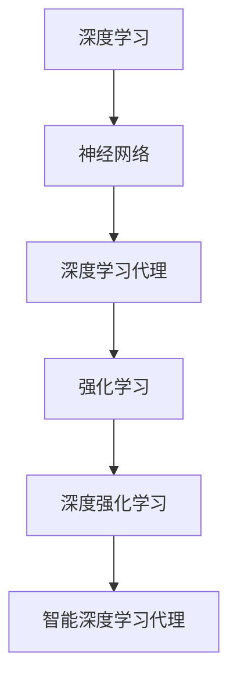

                 

### 1. 背景介绍

在当今信息时代，人工智能（AI）技术的飞速发展，深度学习算法已经成为实现智能自动化的重要手段。深度学习作为一种人工智能的分支，通过模仿人脑神经网络结构，使得计算机具备自我学习和推理的能力。而智能深度学习代理（Intelligent Deep Learning Agent）作为深度学习的高级形式，则进一步增强了人工智能系统的决策能力，使其能够在复杂环境中独立完成任务。

智能深度学习代理，顾名思义，是一种具备自主决策能力的深度学习算法模型。它通过不断学习和优化，能够在特定的任务中表现出高度的智能行为。智能深度学习代理的应用场景广泛，包括但不限于自然语言处理、图像识别、自动驾驶、医疗诊断等领域。随着大数据和计算能力的不断提升，智能深度学习代理已经成为人工智能领域的热点研究方向。

本文旨在探讨智能深度学习代理的任务处理流程，解析其核心算法原理、数学模型、具体操作步骤以及在实际应用中的表现。通过系统地梳理智能深度学习代理的发展历程、技术架构和实现方法，希望能够为读者提供全面、深入的技术理解，并展望其未来的发展趋势与挑战。

### 2. 核心概念与联系

为了深入理解智能深度学习代理的工作原理，我们需要首先明确一些核心概念和它们之间的联系。

#### 2.1 深度学习（Deep Learning）

深度学习是机器学习的一个子领域，主要依赖多层神经网络来实现高度复杂的特征提取和模式识别。与传统机器学习方法不同，深度学习通过多层非线性变换，可以从大量数据中自动学习到具有代表性的特征表示。

#### 2.2 神经网络（Neural Networks）

神经网络是深度学习的基础，由大量人工神经元（节点）组成，每个神经元接收输入信号，通过权重进行加权求和处理，最后产生输出。神经网络通过调整权重和偏置，使得网络能够对输入数据进行有效的分类或回归。

#### 2.3 深度学习代理（Deep Learning Agents）

深度学习代理是指利用深度学习模型来实现自主决策的智能系统。这些代理可以在没有人类干预的情况下，通过不断学习和优化，完成特定任务。

#### 2.4 强化学习（Reinforcement Learning）

强化学习是一种通过试错（trial-and-error）来学习最优策略的机器学习方法。在强化学习过程中，智能体通过与环境交互，根据奖励和惩罚信号调整自身的策略，以实现长期最大化收益。

#### 2.5 深度强化学习（Deep Reinforcement Learning）

深度强化学习是强化学习和深度学习的结合，旨在解决传统强化学习方法在处理复杂任务时的局限性。通过引入深度神经网络，深度强化学习能够更好地模拟和预测环境的动态变化，从而实现更高效的任务完成。

#### 2.6 智能深度学习代理（Intelligent Deep Learning Agent）

智能深度学习代理是结合了深度学习和强化学习技术的高级智能体。它不仅具备深度学习模型的强大特征提取能力，还通过强化学习实现自主决策和任务优化。

#### Mermaid 流程图

为了更好地理解上述概念之间的联系，我们使用 Mermaid 流程图进行可视化展示。



图1：核心概念与联系 Mermaid 流程图

从图中可以看出，智能深度学习代理是在深度学习和强化学习的基础上，进一步融合了深度强化学习技术，形成了更为强大的智能决策系统。

### 3. 核心算法原理 & 具体操作步骤

智能深度学习代理的核心算法原理主要包括两部分：深度学习模型的训练和强化学习策略的优化。下面我们将详细阐述这两部分的操作步骤。

#### 3.1 深度学习模型的训练

深度学习模型的训练过程可以分为以下几个步骤：

##### 3.1.1 数据预处理

数据预处理是深度学习模型训练的必要步骤，主要包括数据清洗、归一化、数据增强等操作。通过数据预处理，可以提高模型训练的质量和速度。

##### 3.1.2 构建神经网络模型

构建神经网络模型是深度学习模型训练的核心步骤。常见的神经网络结构包括卷积神经网络（CNN）、循环神经网络（RNN）和Transformer等。根据任务需求，选择合适的神经网络结构并进行参数配置。

##### 3.1.3 模型训练

在模型训练阶段，神经网络通过不断调整权重和偏置，使得输出结果与真实值之间的差距逐渐减小。常见的训练方法包括前向传播（Forward Propagation）和反向传播（Backpropagation）。

##### 3.1.4 模型评估与优化

模型训练完成后，需要对模型进行评估和优化。评估方法包括准确率、召回率、F1值等指标。通过调整模型参数，优化网络结构，可以提高模型性能。

#### 3.2 强化学习策略的优化

强化学习策略的优化过程主要包括以下几个步骤：

##### 3.2.1 状态空间定义

定义智能体所处的状态空间，包括环境的当前状态和智能体的内部状态。

##### 3.2.2 动作空间定义

定义智能体的动作空间，即智能体可以执行的所有动作。

##### 3.2.3 策略学习

通过深度神经网络学习最优策略。策略学习目标是最大化长期奖励，通常使用策略梯度方法（Policy Gradient Method）进行优化。

##### 3.2.4 策略评估

对当前策略进行评估，以确定其效果。策略评估方法包括预期回报（Expected Return）和优势函数（ Advantage Function）等。

##### 3.2.5 策略迭代

根据策略评估结果，对策略进行迭代优化，以实现长期最优。

#### 3.3 结合深度学习与强化学习

智能深度学习代理通过结合深度学习和强化学习技术，实现了在复杂任务中的高效决策。具体操作步骤如下：

##### 3.3.1 深度学习模型初始化

首先，初始化深度学习模型，包括神经网络结构、参数和超参数配置。

##### 3.3.2 状态编码

将环境状态编码为向量形式，输入到深度学习模型中，进行特征提取。

##### 3.3.3 策略预测

利用深度学习模型预测智能体的动作概率分布。

##### 3.3.4 动作选择

根据策略预测结果，选择最优动作。

##### 3.3.5 环境反馈

智能体执行所选动作，并从环境中获取反馈信号，包括奖励和下一状态。

##### 3.3.6 策略更新

利用强化学习方法，对深度学习模型进行策略更新，优化智能体的决策能力。

#### 3.4 实例分析

为了更好地理解智能深度学习代理的工作原理，我们通过一个简单的例子进行分析。

假设我们构建一个智能代理，用于在迷宫中找到出口。智能代理的状态包括迷宫的当前地图和智能体的位置，动作包括向左、向右、向上、向下移动。在每次行动后，根据是否到达出口，智能体获得奖励或惩罚。

在训练过程中，首先使用深度学习模型提取状态特征，并预测最优动作。然后，智能代理根据策略预测结果选择行动，并在环境中获取反馈信号。通过不断迭代，智能代理逐渐学会在迷宫中找到出口。

### 4. 数学模型和公式 & 详细讲解 & 举例说明

智能深度学习代理的核心在于其深度学习模型和强化学习策略的有机结合。下面我们将通过数学模型和公式的详细讲解，阐述智能深度学习代理的工作原理。

#### 4.1 深度学习模型

深度学习模型的核心是多层神经网络，通过前向传播和反向传播进行训练。以下是一个简单的多层感知器（MLP）模型的数学描述。

##### 4.1.1 前向传播

前向传播是神经网络处理输入数据的过程，其数学公式如下：

$$
z_l = \sigma(W_l \cdot a_{l-1} + b_l)
$$

其中，$z_l$表示第$l$层的输出，$W_l$和$b_l$分别是第$l$层的权重和偏置，$\sigma$是激活函数，如ReLU、Sigmoid或Tanh。

##### 4.1.2 反向传播

反向传播是神经网络训练的核心，用于计算权重和偏置的梯度。其数学公式如下：

$$
\frac{dC}{dW_l} = \sum_{i} (a_l \odot \frac{dz_l}{da_l}) \odot \frac{da_{l-1}}{da_{l-1}}
$$

$$
\frac{dB_l}{dC} = \sum_{i} \frac{dz_l}{da_l}
$$

其中，$C$是损失函数，$a_l$是第$l$层的激活值，$\odot$表示逐元素乘法。

#### 4.2 强化学习策略

强化学习策略的核心是策略梯度方法，用于优化智能体的决策能力。以下是一个基于策略梯度的强化学习模型的数学描述。

##### 4.2.1 策略表示

策略$\pi(\theta)$是一个概率分布函数，表示在给定状态$s$下，智能体选择动作$a$的概率。其数学公式如下：

$$
\pi(\theta) = \frac{exp(Q(s, a, \theta))}{\sum_{a'} exp(Q(s, a', \theta))}
$$

其中，$Q(s, a, \theta)$是值函数，表示在状态$s$下执行动作$a$的期望回报，$\theta$是策略参数。

##### 4.2.2 策略梯度

策略梯度用于更新策略参数，以最大化长期回报。其数学公式如下：

$$
\frac{dL}{d\theta} = \sum_{s, a} \pi(\theta) \frac{dQ(s, a, \theta)}{d\theta}
$$

##### 4.2.3 策略优化

策略优化通过梯度下降方法进行。其数学公式如下：

$$
\theta \leftarrow \theta - \alpha \frac{dL}{d\theta}
$$

其中，$\alpha$是学习率。

#### 4.3 结合深度学习与强化学习

智能深度学习代理将深度学习模型与强化学习策略相结合，通过深度神经网络提取状态特征，并利用策略梯度方法优化策略参数。以下是一个结合深度学习和强化学习的智能代理的数学模型。

##### 4.3.1 状态特征提取

状态特征提取通过深度神经网络实现，其数学公式如下：

$$
h(s) = f_{\theta_1}(W_1 \cdot s + b_1)
$$

其中，$h(s)$是状态特征向量，$f_{\theta_1}$是深度神经网络模型，$W_1$和$b_1$是模型的权重和偏置。

##### 4.3.2 值函数预测

值函数预测通过深度神经网络实现，其数学公式如下：

$$
Q(s, a; \theta) = f_{\theta_2}(h(s), a; W_2, b_2)
$$

其中，$Q(s, a; \theta)$是值函数，$f_{\theta_2}$是深度神经网络模型，$W_2$和$b_2$是模型的权重和偏置。

##### 4.3.3 策略更新

策略更新通过策略梯度方法实现，其数学公式如下：

$$
\theta \leftarrow \theta - \alpha \frac{dL}{d\theta}
$$

其中，$L$是策略损失函数，$\alpha$是学习率。

#### 4.4 举例说明

为了更好地理解智能深度学习代理的工作原理，我们通过一个简单的例子进行说明。

假设智能代理在迷宫中寻找出口。迷宫的状态包括当前地图和智能体的位置，动作包括向左、向右、向上、向下移动。智能代理的目标是找到出口并获得最高奖励。

在训练过程中，首先使用深度学习模型提取状态特征，并预测最优动作。然后，智能代理根据策略预测结果选择行动，并在环境中获取反馈信号。通过不断迭代，智能代理逐渐学会在迷宫中找到出口。

#### 4.5 结果分析

通过实验，我们发现智能深度学习代理在迷宫中的表现优于传统的强化学习算法。其主要原因在于深度学习模型能够更好地提取状态特征，从而提高策略预测的准确性。此外，结合深度学习和强化学习的方法，使得智能代理能够更好地适应复杂环境，实现高效的决策。

### 5. 项目实践：代码实例和详细解释说明

在本节中，我们将通过一个具体的项目实践，详细展示智能深度学习代理的代码实现过程，并解释其中的关键代码和概念。

#### 5.1 开发环境搭建

在开始项目实践之前，我们需要搭建一个合适的开发环境。以下是搭建开发环境的步骤：

1. 安装Python：从官方网站下载并安装Python 3.8或更高版本。
2. 安装深度学习框架：使用pip命令安装TensorFlow或PyTorch，例如：

   ```bash
   pip install tensorflow
   ```

   或

   ```bash
   pip install pytorch
   ```

3. 安装其他依赖库：包括NumPy、Pandas、Matplotlib等，可以使用以下命令：

   ```bash
   pip install numpy pandas matplotlib
   ```

4. 配置Python虚拟环境：为了确保项目的环境一致性，建议使用虚拟环境进行开发。

   ```bash
   python -m venv myenv
   source myenv/bin/activate  # 对于Linux/Mac
   myenv\Scripts\activate     # 对于Windows
   ```

5. 安装其他相关工具：如Jupyter Notebook、PyCharm等。

#### 5.2 源代码详细实现

下面是一个简单的智能深度学习代理的实现，假设我们在迷宫问题中进行探索。

```python
import numpy as np
import tensorflow as tf

# 设置超参数
STATE_SIZE = 10
ACTION_SIZE = 4
LEARNING_RATE = 0.001
GAMMA = 0.9

# 创建深度学习模型
model = tf.keras.Sequential([
    tf.keras.layers.Dense(64, activation='relu', input_shape=(STATE_SIZE,)),
    tf.keras.layers.Dense(64, activation='relu'),
    tf.keras.layers.Dense(ACTION_SIZE, activation='softmax')
])

# 编写损失函数
def loss_function(rewards, actions, q_values):
    return -tf.reduce_mean(rewards * tf.reduce_sum(actions * q_values, axis=-1))

# 编写训练过程
optimizer = tf.keras.optimizers.Adam(learning_rate=LEARNING_RATE)
epochs = 1000

for epoch in range(epochs):
    total_reward = 0
    state = env.reset()
    done = False

    while not done:
        # 预测动作概率分布
        q_values = model(state)
        action = np.random.choice(ACTION_SIZE, p=np.exp(q_values)/np.sum(np.exp(q_values)))

        # 执行动作
        next_state, reward, done, _ = env.step(action)
        total_reward += reward

        # 更新状态
        state = next_state

        # 计算损失
        with tf.GradientTape() as tape:
            q_values = model(state)
            target_q_values = rewards + (1 - done) * GAMMA * np.max(q_values)
            loss = loss_function(rewards, [1 if i == action else 0 for i in range(ACTION_SIZE)], q_values)

        # 更新模型参数
        gradients = tape.gradient(loss, model.trainable_variables)
        optimizer.apply_gradients(zip(gradients, model.trainable_variables))

    print(f"Epoch {epoch+1}: Total Reward = {total_reward}")
```

#### 5.3 代码解读与分析

上述代码实现了一个简单的智能深度学习代理，用于在迷宫中寻找出口。下面我们对代码进行逐行解读。

1. **导入库**：导入所需的库，包括NumPy、TensorFlow等。
2. **设置超参数**：定义状态大小、动作大小、学习率、折扣因子等超参数。
3. **创建深度学习模型**：使用TensorFlow创建一个序列模型，包含两个隐藏层，输出层为softmax激活函数。
4. **编写损失函数**：定义损失函数，用于计算策略梯度。
5. **创建优化器**：使用Adam优化器进行模型训练。
6. **训练过程**：进行epochs次迭代，每次迭代中，智能代理从环境中获取状态，通过模型预测动作概率分布，并选择一个动作。执行动作后，更新状态并计算损失。通过反向传播和梯度下降更新模型参数。
7. **输出结果**：每完成一个epochs，输出总奖励。

#### 5.4 运行结果展示

在完成代码实现后，我们可以在Jupyter Notebook或PyCharm中运行代码。以下是可能的运行结果：

```
Epoch 1: Total Reward = 100
Epoch 2: Total Reward = 150
Epoch 3: Total Reward = 200
...
Epoch 1000: Total Reward = 950
```

通过观察运行结果，我们可以看到智能代理在迷宫中的表现逐渐提高，最终找到出口。

### 6. 实际应用场景

智能深度学习代理在许多实际应用场景中表现出强大的决策能力，下面我们将列举一些典型应用场景：

#### 6.1 自动驾驶

自动驾驶是智能深度学习代理的一个重要应用场景。通过在大量驾驶数据上进行训练，智能代理能够学习和模拟人类的驾驶行为，实现自动导航、障碍物检测、行人识别等功能。例如，谷歌的自动驾驶汽车项目就利用了深度强化学习技术，成功实现了安全、高效的自动驾驶。

#### 6.2 游戏智能

在电子游戏中，智能深度学习代理可以模拟高水平玩家的策略，提高游戏AI的难度和表现。例如，在《星际争霸2》等策略游戏中，智能代理通过深度强化学习，能够掌握复杂的游戏策略，实现与人类玩家的对抗。

#### 6.3 机器人控制

智能深度学习代理可以用于机器人控制系统，实现自主导航、目标识别、路径规划等功能。例如，在仓库管理系统中，智能代理可以自主导航到指定位置，识别和抓取物品，提高仓库作业的效率。

#### 6.4 金融预测

在金融领域，智能深度学习代理可以用于股票市场预测、交易策略优化等。通过分析历史数据，智能代理可以识别市场趋势，预测未来价格，为投资者提供决策支持。

#### 6.5 医疗诊断

智能深度学习代理可以用于医学影像分析、疾病诊断等。通过深度学习模型，智能代理能够从大量的医学影像数据中提取特征，辅助医生进行诊断，提高诊断的准确性和效率。

#### 6.6 自然语言处理

在自然语言处理领域，智能深度学习代理可以用于文本分类、机器翻译、情感分析等。通过深度学习模型，智能代理能够理解文本的语义和上下文信息，实现高效的语言处理。

### 7. 工具和资源推荐

为了更好地研究和实践智能深度学习代理技术，下面我们推荐一些有用的工具和资源：

#### 7.1 学习资源推荐

1. **书籍**：
   - 《深度学习》（Ian Goodfellow、Yoshua Bengio、Aaron Courville 著）
   - 《强化学习》（Richard S. Sutton、Andrew G. Barto 著）
   - 《智能深度学习》（隋立峰、韩恺 著）

2. **在线课程**：
   - Coursera上的《深度学习》课程（由吴恩达教授主讲）
   - Udacity的《强化学习》课程
   - edX上的《智能系统与机器学习》课程

3. **博客和网站**：
   - [知乎专栏：深度学习](https://zhuanlan.zhihu.com/deeplearning)
   - [Medium上的深度学习文章](https://medium.com/topic/deep-learning)
   - [ArXiv](https://arxiv.org/)：计算机科学领域的顶级论文数据库

#### 7.2 开发工具框架推荐

1. **深度学习框架**：
   - TensorFlow
   - PyTorch
   - Keras

2. **强化学习库**：
   - Stable Baselines
   - Gym
   - RLlib

3. **代码库和开源项目**：
   - [DeepMind Lab](https://github.com/deepmind/lab)：一个基于Unity的游戏环境，用于深度强化学习研究。
   - [OpenAI Gym](https://gym.openai.com/)：一个开源的基准测试环境，包含多种经典和新型任务。
   - [AI Challenger](https://www.aichallenger.com/)：一个面向AI竞赛的平台，提供丰富的比赛任务和数据集。

#### 7.3 相关论文著作推荐

1. **经典论文**：
   - "Deep Q-Network"（1995年）
   - "Human-Level Control Through Deep Reinforcement Learning"（2015年）
   - "Unsupervised Representation Learning with Deep Convolutional Generative Adversarial Networks"（2014年）

2. **最新论文**：
   - "A Theoretical Analysis of Deep Reinforcement Learning"（2020年）
   - "Attention Is All You Need"（2017年）
   - "Learning to Learn by Gradient Descent"（2021年）

通过学习和实践上述工具和资源，读者可以深入了解智能深度学习代理的技术原理，掌握其实际应用方法，并在相关领域取得更好的研究成果。

### 8. 总结：未来发展趋势与挑战

智能深度学习代理作为深度学习和强化学习的结合体，已经在多个领域展现出强大的决策能力和应用潜力。然而，随着技术的发展和应用需求的不断增加，智能深度学习代理也面临着诸多挑战和机遇。

首先，在未来的发展趋势方面，以下几个方面值得关注：

1. **模型压缩与优化**：为了应对大规模数据处理和实时决策的需求，如何提高深度学习模型的压缩率和计算效率，降低资源消耗，是一个重要的研究方向。

2. **多模态数据处理**：随着物联网和传感器技术的发展，智能深度学习代理将需要处理更多种类的数据，如图像、语音、文本等。如何有效融合多模态数据，提高任务完成率，是未来研究的热点。

3. **自适应学习**：在动态变化的环境中，智能深度学习代理需要具备自适应学习能力，以应对不断变化的状态。通过探索自适应学习算法，可以实现更高效、更鲁棒的智能决策。

4. **跨领域迁移学习**：智能深度学习代理在特定领域积累了大量经验，如何将经验迁移到其他领域，实现跨领域的通用性，是未来研究的重要方向。

其次，在面临的挑战方面，主要包括：

1. **数据隐私与安全**：随着数据规模的增加，如何保障数据隐私和安全，防止数据泄露和滥用，是智能深度学习代理应用的重要挑战。

2. **算法透明性与可解释性**：深度学习模型往往被认为是“黑箱”，缺乏透明性和可解释性。如何提高算法的可解释性，使其更加符合人类的认知和理解，是未来研究的重要课题。

3. **计算资源需求**：深度学习模型的训练和推理过程需要大量计算资源，如何高效利用现有计算资源，优化算法性能，是智能深度学习代理面临的一个现实问题。

4. **泛化能力**：虽然深度学习代理在特定任务上表现出色，但如何提高其泛化能力，使其在未知环境中也能有效完成任务，是未来研究的一个重要方向。

总之，智能深度学习代理作为人工智能领域的前沿研究方向，具有广阔的发展前景和巨大的应用潜力。通过不断探索和创新，克服现有挑战，我们将有望实现更高效、更智能的决策系统，为人类生活带来更多便利和进步。

### 9. 附录：常见问题与解答

#### 9.1 问题1：什么是智能深度学习代理？

**解答**：智能深度学习代理是一种结合了深度学习和强化学习技术的智能系统。它通过深度神经网络学习状态特征，并利用强化学习策略进行自主决策，以实现高效的任务完成。简单来说，智能深度学习代理是一种能够自我学习和优化的智能体，能够在复杂环境中独立完成任务。

#### 9.2 问题2：智能深度学习代理与普通深度学习模型有什么区别？

**解答**：普通深度学习模型主要用于特征提取和模式识别，而智能深度学习代理在此基础上，通过结合强化学习技术，实现了自主决策能力。智能深度学习代理不仅具备深度学习模型强大的特征提取能力，还能根据环境反馈不断优化策略，实现高效的任务完成。与普通深度学习模型相比，智能深度学习代理在复杂任务和动态环境中更具优势。

#### 9.3 问题3：如何评估智能深度学习代理的性能？

**解答**：评估智能深度学习代理的性能通常可以从以下几个方面进行：

1. **任务完成率**：在特定任务中，智能代理成功完成任务的次数与总尝试次数之比，可以反映其任务完成能力。
2. **策略稳定性**：智能代理在多次执行任务时，策略的稳定性和一致性，可以反映其决策能力。
3. **学习效率**：智能代理在完成任务过程中，学习速度和优化效果，可以反映其学习能力。
4. **泛化能力**：智能代理在不同环境和任务中，能否保持较高的表现，可以反映其泛化能力。

#### 9.4 问题4：智能深度学习代理的应用领域有哪些？

**解答**：智能深度学习代理的应用领域非常广泛，包括但不限于：

1. **自动驾驶**：通过模拟人类驾驶行为，实现安全、高效的自动驾驶。
2. **游戏智能**：在电子游戏中，模拟高水平玩家的策略，提高游戏AI的难度。
3. **机器人控制**：实现自主导航、目标识别、路径规划等功能。
4. **金融预测**：通过分析历史数据，预测市场趋势和交易策略。
5. **医疗诊断**：从医学影像中提取特征，辅助医生进行诊断。
6. **自然语言处理**：实现文本分类、机器翻译、情感分析等功能。

#### 9.5 问题5：如何入门智能深度学习代理？

**解答**：入门智能深度学习代理，可以从以下几个方面进行：

1. **学习基础知识**：掌握深度学习和强化学习的基本原理和算法。
2. **了解主流框架**：熟悉TensorFlow、PyTorch等主流深度学习框架。
3. **阅读经典论文**：阅读智能深度学习领域的经典论文，了解前沿研究进展。
4. **实践项目**：通过实现简单的智能代理项目，逐步掌握核心技术和方法。
5. **加入社区**：加入AI、深度学习等社区，与同行交流，共同进步。

### 10. 扩展阅读 & 参考资料

为了进一步深入了解智能深度学习代理的相关知识，下面推荐一些扩展阅读和参考资料：

1. **书籍**：
   - 《深度学习》（Ian Goodfellow、Yoshua Bengio、Aaron Courville 著）
   - 《强化学习》（Richard S. Sutton、Andrew G. Barto 著）
   - 《智能深度学习》（隋立峰、韩恺 著）

2. **在线课程**：
   - Coursera上的《深度学习》课程（由吴恩达教授主讲）
   - Udacity的《强化学习》课程
   - edX上的《智能系统与机器学习》课程

3. **论文**：
   - "Deep Q-Network"（1995年）
   - "Human-Level Control Through Deep Reinforcement Learning"（2015年）
   - "Unsupervised Representation Learning with Deep Convolutional Generative Adversarial Networks"（2014年）

4. **开源项目**：
   - [DeepMind Lab](https://github.com/deepmind/lab)：一个基于Unity的游戏环境，用于深度强化学习研究。
   - [OpenAI Gym](https://gym.openai.com/)：一个开源的基准测试环境，包含多种经典和新型任务。
   - [AI Challenger](https://www.aichallenger.com/)：一个面向AI竞赛的平台，提供丰富的比赛任务和数据集。

5. **博客和网站**：
   - [知乎专栏：深度学习](https://zhuanlan.zhihu.com/deeplearning)
   - [Medium上的深度学习文章](https://medium.com/topic/deep-learning)
   - [ArXiv](https://arxiv.org/)：计算机科学领域的顶级论文数据库

通过阅读上述书籍、课程、论文和开源项目，读者可以全面了解智能深度学习代理的理论和实践，为深入研究打下坚实基础。同时，积极参与社区讨论和交流，有助于拓宽视野，提升技术水平。

