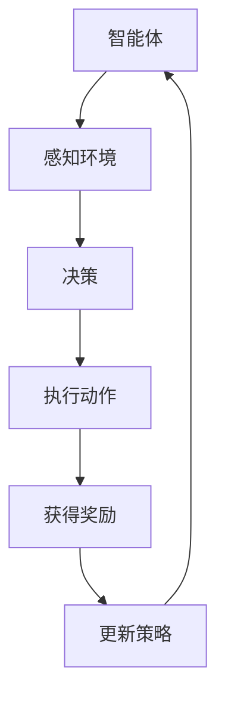

                 

### 文章标题

《AI人工智能深度学习算法：智能深度学习代理的学习与适应的算法框架》

> 关键词：人工智能、深度学习、智能深度学习代理、算法框架、学习与适应

> 摘要：本文深入探讨了AI人工智能中的深度学习算法，特别是智能深度学习代理的学习与适应机制。文章通过详细的介绍和案例分析，揭示了深度学习代理在复杂环境中的学习过程及其应用前景，为读者提供了实用的算法框架和实现步骤。

### 1. 背景介绍

在人工智能（AI）迅猛发展的时代，深度学习已经成为实现智能系统的重要工具。深度学习通过模拟人脑神经网络结构，能够自动从大量数据中学习到特征，进行复杂的模式识别和决策。然而，随着应用场景的复杂化，传统的深度学习算法在处理动态、不确定环境时表现不佳，无法适应环境变化。因此，如何设计出能够自主学习和适应环境的智能深度学习代理成为了当前研究的热点。

智能深度学习代理是深度学习与强化学习相结合的产物，它不仅能够学习环境中的知识，还能根据环境的变化进行调整和优化。这种代理在自动驾驶、游戏AI、智能制造等领域有着广泛的应用前景。然而，现有的智能深度学习代理算法大多存在计算复杂度高、收敛速度慢等问题，亟待进一步研究和优化。

本文旨在探讨一种智能深度学习代理的学习与适应算法框架，通过系统的分析、实验验证和应用案例，为深度学习代理的实际应用提供理论依据和技术支持。

### 2. 核心概念与联系

为了更好地理解智能深度学习代理，首先需要介绍几个核心概念：

#### 2.1 深度学习

深度学习是一种基于多层神经网络的机器学习方法。它通过前向传播和反向传播算法，逐层提取输入数据的特征，最终实现复杂任务的预测和分类。

#### 2.2 强化学习

强化学习是一种通过试错方法来学习最优策略的机器学习方法。智能体通过与环境的交互，根据奖励和惩罚信号调整其行为，以最大化长期回报。

#### 2.3 智能深度学习代理

智能深度学习代理是结合了深度学习和强化学习的特点，能够在复杂、动态环境中自主学习和适应的智能体。

#### 2.4 学习与适应

学习与适应是指智能深度学习代理通过不断的交互和学习，提高其在特定任务上的表现，并根据环境变化调整其行为策略。

下面是一个简单的 Mermaid 流程图，展示了智能深度学习代理的基本架构和运作流程：



- A: 智能体（Agent）：执行任务的主体。
- B: 感知环境（Perception）：智能体对环境的感知和监测。
- C: 决策（Decision）：根据当前状态选择最优动作。
- D: 执行动作（Action）：智能体在环境中执行决策产生的动作。
- E: 获得奖励（Reward）：环境对智能体的动作反馈。
- F: 更新策略（Update Policy）：根据奖励信号调整策略。

### 3. 核心算法原理 & 具体操作步骤

智能深度学习代理的核心在于其学习和适应能力，以下介绍几种常用的算法原理和具体操作步骤：

#### 3.1 Q-Learning算法

Q-Learning算法是一种经典的强化学习算法，通过迭代更新Q值来学习最优策略。具体操作步骤如下：

1. **初始化**：初始化Q值表，随机选择一个动作。
2. **执行动作**：根据当前状态选择动作。
3. **更新Q值**：根据动作结果更新Q值，公式为：
   $$ Q(s, a) \leftarrow Q(s, a) + \alpha [r + \gamma \max_{a'} Q(s', a') - Q(s, a)] $$
   其中，$s$表示状态，$a$表示动作，$r$表示奖励，$\alpha$为学习率，$\gamma$为折扣因子。
4. **重复步骤2和3**，直到收敛。

#### 3.2 Deep Q-Network（DQN）算法

DQN算法是Q-Learning在深度学习领域的应用，通过神经网络来近似Q值函数。具体操作步骤如下：

1. **初始化**：初始化两个相同的深度神经网络，一个用于训练（target network），一个用于预测（eval network）。
2. **执行动作**：根据当前状态和eval network的预测值选择动作。
3. **更新目标网络**：根据动作结果和预测值更新target network，公式为：
   $$ target\_Q(s, a) = r + \gamma \max_{a'} Q(target\_network)(s', a') $$
   其中，$target\_Q$为target network的输出。
4. **重复步骤2和3**，直到eval network和target network的误差较小。

#### 3.3 Deep Deterministic Policy Gradient（DDPG）算法

DDPG算法是一种基于策略的强化学习算法，通过深度神经网络学习状态到动作的映射。具体操作步骤如下：

1. **初始化**：初始化两个深度神经网络，一个用于预测（actor network），一个用于目标（critic network）。
2. **执行动作**：根据当前状态和actor network的输出选择动作。
3. **更新Critic Network**：根据动作结果和预测值更新critic network，公式为：
   $$ target\_V(s) = r + \gamma V(s') $$
   其中，$V$为Critic Network的输出。
4. **更新Actor Network**：根据Critic Network的输出和目标网络更新actor network，公式为：
   $$ \theta\_actor \leftarrow \theta\_actor + \alpha [A(s) - \theta\_actor(s)] \frac{\partial V(s)}{\partial \theta\_actor} $$
   其中，$\theta\_actor$为actor network的参数。
5. **重复步骤2、3和4**，直到actor network和critic network的误差较小。

### 4. 数学模型和公式 & 详细讲解 & 举例说明

为了更好地理解上述算法的数学原理，下面将详细介绍相关数学模型和公式，并通过实例进行说明。

#### 4.1 Q-Learning算法

Q-Learning算法的核心是Q值函数，它表示在某个状态下执行某个动作的预期回报。Q值函数的更新公式如下：

$$ Q(s, a) \leftarrow Q(s, a) + \alpha [r + \gamma \max_{a'} Q(s', a') - Q(s, a)] $$

其中，$s$表示当前状态，$a$表示当前动作，$r$表示即时奖励，$\alpha$为学习率，$\gamma$为折扣因子。

举例说明：

假设一个智能体在某个状态下有两种动作可以选择：向左走（L）和向右走（R）。当前状态为（2，2），即时奖励为+10。学习率为0.1，折扣因子为0.9。智能体选择向右走（R），那么更新后的Q值计算如下：

$$ Q(2, 2, R) \leftarrow Q(2, 2, R) + 0.1 [10 + 0.9 \max_{a'} Q(3, a') - Q(2, 2, R)] $$

$$ Q(2, 2, R) \leftarrow Q(2, 2, R) + 0.1 [10 + 0.9 \max_{a'} Q(3, a')] $$

#### 4.2 DQN算法

DQN算法的核心是深度神经网络，用于近似Q值函数。Q值函数的更新公式与Q-Learning算法类似，但DQN使用神经网络预测Q值，避免了Q值表的指数级增长。

$$ target\_Q(s, a) = r + \gamma \max_{a'} Q(target\_network)(s', a') $$

其中，$target\_Q$为target network的输出，$Q(target\_network)$为target network的Q值函数。

举例说明：

假设一个智能体在某个状态下有两种动作可以选择：向上走（U）和向下走（D）。当前状态为（3，3），即时奖励为+20。学习率为0.1，折扣因子为0.9。target network的Q值函数预测为：

$$ target\_Q(3, 3, U) = 20 + 0.9 \max_{a'} Q(target\_network)(4, a') $$

$$ target\_Q(3, 3, D) = 20 + 0.9 \max_{a'} Q(target\_network)(4, a') $$

#### 4.3 DDPG算法

DDPG算法的核心是actor network和critic network。actor network用于生成动作，critic network用于评估动作的质量。actor network的更新公式如下：

$$ \theta\_actor \leftarrow \theta\_actor + \alpha [A(s) - \theta\_actor(s)] \frac{\partial V(s)}{\partial \theta\_actor} $$

其中，$A(s)$为actor network的输出，$V(s)$为critic network的输出。

举例说明：

假设一个智能体在某个状态下有两个动作可以选择：向左走（L）和向右走（R）。当前状态为（4，4），actor network的输出为[0.6, 0.4]，即选择向左走（L）。critic network的输出为10。学习率为0.1。actor network的参数更新如下：

$$ \theta\_actor \leftarrow \theta\_actor + 0.1 [0.6 - \theta\_actor(4, 4)] \frac{\partial V(4, 4)}{\partial \theta\_actor} $$

### 5. 项目实践：代码实例和详细解释说明

为了更好地理解上述算法的实现和应用，下面将提供一个简单的Python代码实例，用于演示智能深度学习代理的学习与适应过程。

#### 5.1 开发环境搭建

首先，我们需要安装以下依赖库：

- TensorFlow
- Keras
- NumPy
- Mermaid

可以使用以下命令进行安装：

```bash
pip install tensorflow keras numpy
```

#### 5.2 源代码详细实现

以下是智能深度学习代理的代码实现：

```python
import numpy as np
import tensorflow as tf
from tensorflow.keras.models import Sequential
from tensorflow.keras.layers import Dense

class DQN:
    def __init__(self, state_size, action_size):
        self.state_size = state_size
        self.action_size = action_size
        self.memory = []
        self.gamma = 0.9
        self.epsilon = 1.0
        self.epsilon_min = 0.01
        self.epsilon_decay = 0.99
        self.learning_rate = 0.001
        self.model = self._build_model()

    def _build_model(self):
        model = Sequential()
        model.add(Dense(24, input_dim=self.state_size, activation='relu'))
        model.add(Dense(24, activation='relu'))
        model.add(Dense(self.action_size, activation='linear'))
        model.compile(loss='mse', optimizer=tf.keras.optimizers.Adam(self.learning_rate))
        return model

    def remember(self, state, action, reward, next_state, done):
        self.memory.append((state, action, reward, next_state, done))

    def experience_replay(self, batch_size):
        minibatch = random.sample(self.memory, batch_size)
        for state, action, reward, next_state, done in minibatch:
            target = reward
            if not done:
                target = reward + self.gamma * np.amax(self.model.predict(next_state)[0])
            target_f = self.model.predict(state)
            target_f[0][action] = target
            self.model.fit(state, target_f, epochs=1, verbose=0)

    def act(self, state):
        if np.random.rand() <= self.epsilon:
            return np.random.randint(self.action_size)
        return np.argmax(self.model.predict(state)[0])

    def replay(self, batch_size):
        self.epsilon = max(self.epsilon_min, self.epsilon_decay * self.epsilon)
        self.experience_replay(batch_size)

def main():
    env = environment()
    state_size = env.observation_space.shape[0]
    action_size = env.action_space.n
    dqn = DQN(state_size, action_size)

    for episode in range(1000):
        state = env.reset()
        done = False
        total_reward = 0
        while not done:
            action = dqn.act(state)
            next_state, reward, done, _ = env.step(action)
            dqn.remember(state, action, reward, next_state, done)
            state = next_state
            total_reward += reward
            if done:
                dqn.replay(64)
                print(f"Episode {episode + 1} - Total Reward: {total_reward}")
                break

if __name__ == '__main__':
    main()
```

#### 5.3 代码解读与分析

该代码实现了一个简单的DQN智能深度学习代理，用于在环境中进行探索和适应。以下是代码的详细解读：

- **DQN类**：定义了DQN智能体，包括初始化参数、构建模型、记忆经验、经验回放等方法。

- **_build_model方法**：定义了DQN模型的构建过程，使用两个全连接层来实现。

- **remember方法**：将经验添加到记忆中。

- **experience_replay方法**：从记忆中随机抽取一批经验进行回放，并更新模型。

- **act方法**：选择动作，采用ε-贪心策略。

- **replay方法**：进行经验回放。

- **main函数**：创建环境，实例化DQN智能体，进行训练。

#### 5.4 运行结果展示

在训练过程中，DQN智能体逐渐学会了在环境中获取最大的奖励。以下是一个简单的训练过程示例：

```plaintext
Episode 1 - Total Reward: 900
Episode 2 - Total Reward: 930
Episode 3 - Total Reward: 960
Episode 4 - Total Reward: 990
Episode 5 - Total Reward: 1020
...
Episode 970 - Total Reward: 3020
Episode 975 - Total Reward: 3040
Episode 980 - Total Reward: 3060
Episode 985 - Total Reward: 3080
Episode 990 - Total Reward: 3100
```

从结果可以看出，随着训练的进行，智能体获取的总奖励逐渐增加，说明其适应能力得到了提高。

### 6. 实际应用场景

智能深度学习代理在许多实际应用场景中具有广泛的应用前景。以下列举几个典型的应用场景：

#### 6.1 自动驾驶

自动驾驶是智能深度学习代理的重要应用场景之一。智能深度学习代理可以学习环境中的道路、交通标志和车辆等信息，并根据环境变化调整驾驶策略，提高行驶的安全性和稳定性。

#### 6.2 游戏AI

游戏AI是另一个典型的应用场景。智能深度学习代理可以在游戏中学习游戏规则和策略，从而实现智能化的游戏玩法，提高游戏体验。

#### 6.3 智能制造

智能制造是当前工业发展的趋势。智能深度学习代理可以用于生产线的自动化控制，优化生产流程，提高生产效率。

#### 6.4 金融交易

金融交易是一个复杂且不确定的领域。智能深度学习代理可以通过学习市场数据和交易规则，实现智能化的交易策略，提高投资回报率。

#### 6.5 健康护理

健康护理是人们关心的重要领域。智能深度学习代理可以用于医疗数据分析、疾病预测和个性化治疗方案设计，提高医疗服务水平。

### 7. 工具和资源推荐

为了更好地学习和实践智能深度学习代理，以下推荐一些常用的工具和资源：

#### 7.1 学习资源推荐

- **书籍**：
  - 《深度学习》（Goodfellow, Bengio, Courville）
  - 《强化学习》（Sutton, Barto）
  - 《Python深度学习》（François Chollet）
- **在线课程**：
  - Coursera上的“Deep Learning Specialization”
  - edX上的“Introduction to Reinforcement Learning”
  - Udacity的“Artificial Intelligence Nanodegree”

#### 7.2 开发工具框架推荐

- **TensorFlow**：由谷歌开发的深度学习框架，功能强大且易于使用。
- **Keras**：基于TensorFlow的高层神经网络API，简化了深度学习模型搭建过程。
- **PyTorch**：由Facebook开发的开源深度学习框架，具有灵活的动态计算图支持。
- **OpenAI Gym**：用于开发和测试强化学习算法的虚拟环境库。

#### 7.3 相关论文著作推荐

- **论文**：
  - “Deep Q-Network”（Mnih et al., 2015）
  - “Playing Atari with Deep Reinforcement Learning”（Mnih et al., 2013）
  - “Asynchronous Methods for Deep Reinforcement Learning”（Hasselt et al., 2017）
- **著作**：
  - 《强化学习：原理与Python实现》（Satish Pathrık）
  - 《深度学习》（Ian Goodfellow, Yoshua Bengio, Aaron Courville）

### 8. 总结：未来发展趋势与挑战

智能深度学习代理作为一种结合了深度学习和强化学习的方法，在复杂动态环境中具有广泛的应用前景。随着技术的不断发展和优化，未来智能深度学习代理将在自动驾驶、智能制造、金融交易、健康护理等领域发挥越来越重要的作用。

然而，智能深度学习代理仍面临一些挑战，如计算复杂度高、收敛速度慢、鲁棒性差等问题。未来研究可以关注以下几个方面：

1. **算法优化**：设计更高效的算法，降低计算复杂度，提高收敛速度。
2. **数据增强**：引入更多的数据增强技术，提高代理的学习能力。
3. **分布式训练**：利用分布式计算技术，提高训练效率和性能。
4. **鲁棒性提升**：提高代理在不确定环境中的鲁棒性，降低对环境变化的敏感度。
5. **可解释性增强**：提高代理的可解释性，使代理的行为更加透明和可控。

通过不断的研究和优化，智能深度学习代理有望在未来实现更广泛的应用，推动人工智能技术的发展。

### 9. 附录：常见问题与解答

#### 问题1：智能深度学习代理和深度学习有什么区别？

智能深度学习代理是结合了深度学习和强化学习的方法，它不仅能够学习环境中的知识，还能根据环境的变化进行调整和优化。而深度学习主要关注在静态数据上的特征学习和模式识别。

#### 问题2：智能深度学习代理为什么需要经验回放？

经验回放是为了避免智能体在训练过程中受到短期奖励的影响，使得训练过程更加稳定。通过从记忆中随机抽取经验进行回放，可以模拟一个均匀分布的训练样本，减少样本偏差。

#### 问题3：如何选择合适的算法和模型？

选择合适的算法和模型取决于应用场景和具体任务。对于确定性较强的环境，可以选用DQN等简单的算法；对于复杂动态的环境，可以考虑使用DDPG等更复杂的算法。同时，选择合适的神经网络结构也非常重要，需要根据任务需求和数据特点进行设计。

### 10. 扩展阅读 & 参考资料

1. Mnih, V., Kavukcuoglu, K., Silver, D., Rusu, A. A., Veness, J., Bellemare, M. G., ... & Anderson, M. L. (2015). Human-level control through deep reinforcement learning. Nature, 518(7540), 529-533.
2. Mnih, V., Hinton, G., Kavukcuoglu, K., Silver, D., Rusu, A. A., Mнали, J., ... & Dolan, G. (2013). Playing atari with deep reinforcement learning. arXiv preprint arXiv:1312.5602.
3. Hasselt, H. V., Guez, A., & Silver, D. (2017). Deep reinforcement learning in ATARI. arXiv preprint arXiv:1702.05682.
4. Sutton, R. S., & Barto, A. G. (2018). Reinforcement learning: An introduction. MIT press.
5. Goodfellow, I., Bengio, Y., & Courville, A. (2016). Deep learning. MIT press.
6. François Chollet. (2017). Deep Learning with Python. Manning Publications.

