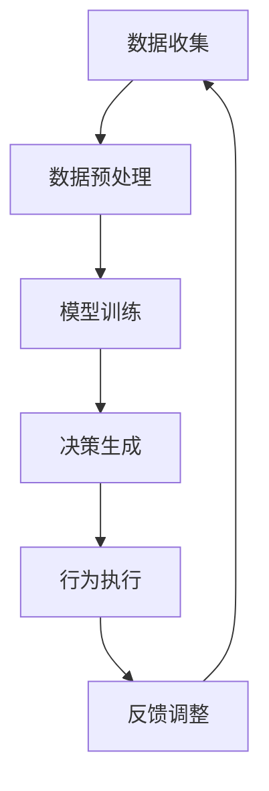

                 

### 背景介绍

在当今快速发展的技术时代，人工智能（AI）已经成为推动科技进步的关键驱动力。其中，深度学习作为AI领域的重要分支，凭借其强大的非线性特征提取和自主学习能力，在各行各业中发挥着越来越重要的作用。深度学习代理（Deep Learning Agent）作为深度学习的一种应用，旨在通过自主学习，优化决策过程，提高系统整体性能。

智能深度学习代理的性能调整与优化，成为了当前研究的热点之一。其主要目标是在给定的资源限制下，实现代理在复杂环境中的最佳性能。这一目标不仅对理论研究和算法设计提出了挑战，同时也对实际应用场景中的系统性能提升有着重要意义。因此，深入探讨智能深度学习代理的性能调整与优化方法，对于推动人工智能技术的发展和应用具有重要的理论和实践价值。

本文将围绕智能深度学习代理的性能调整与优化展开讨论。首先，我们将介绍深度学习代理的基本概念和常见算法。接着，我们将深入探讨性能优化的核心原理和方法，并分析其在实际应用中的挑战和解决方案。此外，本文还将通过具体实例展示如何实现深度学习代理的性能优化，并讨论相关的工具和资源。最后，我们将对未来的发展趋势和挑战进行展望，为读者提供一份全面、系统的技术参考。

通过对智能深度学习代理性能调整与优化的深入探讨，本文旨在为研究者、工程师和从业者提供有益的理论指导和实践参考，助力他们在人工智能领域取得更大的突破和进展。

### 核心概念与联系

在探讨智能深度学习代理的性能调整与优化之前，我们需要首先明确一些核心概念和它们之间的联系。这些概念包括深度学习代理的基本原理、相关算法、性能评估指标等。通过理解这些概念，我们能够为后续的性能优化提供坚实的基础。

#### 深度学习代理的基本原理

深度学习代理是一种基于深度学习技术的智能体，旨在通过学习实现自主决策和优化行为。其基本原理可以概括为以下几个步骤：

1. **数据收集与预处理**：首先，代理需要从环境中收集数据，并进行预处理，以便用于训练模型。这一过程包括数据清洗、归一化、特征提取等操作。
   
2. **模型训练**：接着，代理使用收集到的数据训练一个深度神经网络模型。该模型通常包含多个隐藏层，能够自动提取数据中的高级特征。
   
3. **决策生成**：在训练完成后，代理通过模型预测来生成决策。这些决策旨在优化特定目标，如最大化收益、最小化损失或提高准确性。

4. **行为执行与反馈**：代理将生成的决策应用于实际环境中，并根据环境反馈进行调整和优化。这一过程形成了闭环控制，使得代理能够不断学习并改进其决策能力。

#### 相关算法

深度学习代理的实现依赖于多种深度学习算法。以下是几种常见的深度学习算法：

1. **反向传播算法（Backpropagation）**：这是一种基于梯度下降的算法，用于训练深度神经网络。它通过计算输出层的误差，反向传播到输入层，并调整网络权重，以最小化误差。

2. **卷积神经网络（Convolutional Neural Network, CNN）**：这是一种专门用于图像处理的深度学习算法，通过卷积层提取图像的特征，广泛应用于图像分类、目标检测等任务。

3. **循环神经网络（Recurrent Neural Network, RNN）**：这种算法适用于处理序列数据，如时间序列、自然语言文本等。通过在时间步间传递信息，RNN能够捕获序列中的长期依赖关系。

4. **长短期记忆网络（Long Short-Term Memory, LSTM）**：这是一种改进的RNN结构，用于解决传统RNN在处理长序列数据时容易出现的梯度消失和梯度爆炸问题。

5. **生成对抗网络（Generative Adversarial Network, GAN）**：这种算法由两个神经网络组成，一个生成器网络和一个判别器网络，通过对抗训练生成逼真的数据。

#### 性能评估指标

为了评估深度学习代理的性能，我们需要使用一系列性能评估指标。以下是几种常见的评估指标：

1. **准确率（Accuracy）**：用于分类任务，表示正确分类的样本占总样本的比例。

2. **召回率（Recall）**：表示在所有正类样本中被正确识别出来的比例。

3. **精确率（Precision）**：表示在所有预测为正类的样本中被正确识别出来的比例。

4. **F1分数（F1 Score）**：综合衡量精确率和召回率，是两者的调和平均值。

5. **均方误差（Mean Squared Error, MSE）**：用于回归任务，表示预测值与真实值之间的平均平方误差。

6. **交叉熵损失（Cross-Entropy Loss）**：用于分类任务，表示预测概率分布与真实概率分布之间的差异。

#### Mermaid 流程图

为了更好地展示深度学习代理的原理和流程，我们可以使用Mermaid绘制一个简单的流程图，如下图所示：



在该流程图中，A表示数据收集，B表示数据预处理，C表示模型训练，D表示决策生成，E表示行为执行，F表示反馈调整。这个循环过程使得深度学习代理能够在实际环境中不断学习和优化其决策能力。

通过理解上述核心概念和联系，我们能够更好地把握深度学习代理的性能调整与优化方法。在接下来的章节中，我们将深入探讨这些核心概念的具体实现方法和优化策略。

#### 核心算法原理 & 具体操作步骤

在深入探讨智能深度学习代理的性能调整与优化之前，我们需要首先了解一些核心算法的原理，包括深度神经网络（Deep Neural Network, DNN）的基本架构、反向传播算法（Backpropagation）的实现步骤以及如何通过梯度下降（Gradient Descent）优化模型参数。这些算法构成了深度学习代理性能调整与优化的基础。

##### 1. 深度神经网络（DNN）的基本架构

深度神经网络是一种多层前馈神经网络，通常包括输入层、若干个隐藏层和一个输出层。每个神经元接收来自前一层神经元的输入信号，并通过一个非线性激活函数进行变换，生成输出信号，传递给下一层神经元。以下是DNN的基本架构：

1. **输入层（Input Layer）**：接收外部输入数据，如图像像素、文本序列等。

2. **隐藏层（Hidden Layers）**：一个或多个隐藏层，用于提取输入数据的特征，实现数据的非线性变换。每一层的输出作为下一层的输入。

3. **输出层（Output Layer）**：生成最终输出结果，如分类结果、预测值等。

深度神经网络的关键在于其层次结构，每一层都能够提取更高层次的特征，从而实现复杂的模式识别和预测任务。

##### 2. 反向传播算法（Backpropagation）

反向传播算法是深度神经网络训练的核心算法，通过计算输出层的误差，反向传播到输入层，并调整网络权重，以最小化误差。以下是反向传播算法的具体实现步骤：

1. **前向传播（Forward Propagation）**：
   - 计算输入层到隐藏层之间的加权输入，并通过激活函数得到隐藏层的输出。
   - 计算隐藏层到输出层之间的加权输入，并通过激活函数得到输出层的预测值。

2. **计算输出误差（Calculate Output Error）**：
   - 计算预测值与真实值之间的差异，即输出误差。
   - 使用输出误差计算输出层的梯度。

3. **反向传播误差（Backpropagation Error）**：
   - 从输出层开始，反向传播误差到隐藏层。
   - 对每一层神经元的权重进行更新。

4. **权重更新（Update Weights）**：
   - 使用梯度下降算法，根据误差反向传播的梯度，更新每一层的权重。

5. **迭代优化（Iterative Optimization）**：
   - 重复前向传播和反向传播过程，直到满足收敛条件，如误差小于阈值或迭代次数达到预设值。

##### 3. 梯度下降（Gradient Descent）

梯度下降是一种优化算法，通过计算目标函数的梯度，并沿着梯度的反方向更新模型参数，以最小化目标函数。以下是梯度下降的具体操作步骤：

1. **初始化参数**：随机初始化模型参数。

2. **计算梯度**：计算目标函数相对于每个参数的梯度。

3. **更新参数**：根据梯度方向和步长，更新模型参数。

4. **迭代优化**：重复计算梯度和参数更新，直到满足收敛条件。

在深度学习代理中，梯度下降通常用于优化神经网络的权重和偏置，以实现模型的训练和优化。具体来说，梯度下降可以通过以下公式实现：

$$
w_{new} = w_{old} - \alpha \cdot \nabla_w J(w)
$$

其中，$w$ 表示模型参数，$\alpha$ 表示学习率，$J(w)$ 表示目标函数。

##### 4. 具体实现步骤示例

为了更清晰地展示深度学习代理的具体实现步骤，我们以一个简单的二分类问题为例，说明如何使用反向传播算法和梯度下降进行模型训练和优化。

1. **初始化模型参数**：
   - 随机初始化输入层、隐藏层和输出层的权重和偏置。

2. **前向传播**：
   - 对于每个训练样本，计算输入层到隐藏层、隐藏层到输出层的加权输入，并通过激活函数得到输出层的预测值。

3. **计算输出误差**：
   - 计算预测值与真实值之间的差异，即输出误差。

4. **反向传播误差**：
   - 从输出层开始，反向传播误差到隐藏层，计算每一层的梯度。

5. **权重更新**：
   - 使用梯度下降算法，根据误差反向传播的梯度，更新每一层的权重。

6. **迭代优化**：
   - 重复前向传播和反向传播过程，直到满足收敛条件。

通过上述步骤，我们可以实现深度学习代理的性能调整与优化。在实际应用中，为了提高模型的性能，我们还需要对学习率、批量大小、激活函数、优化器等进行调整和优化。

通过理解深度学习代理的核心算法原理和具体操作步骤，我们能够更好地把握性能调整与优化的关键点，为实际应用提供有力的理论支持。

#### 数学模型和公式 & 详细讲解 & 举例说明

在深入理解深度学习代理的性能调整与优化过程中，数学模型和公式的运用至关重要。这些数学工具不仅帮助我们在理论上解释深度学习的运作机制，还指导我们在实际操作中调整模型参数，以提高代理的性能。以下是几个关键的数学模型和公式，包括详细讲解和实际应用示例。

##### 1. 前向传播算法中的线性变换和激活函数

在深度神经网络的前向传播过程中，每个神经元都会接收来自前一层神经元的输入，并通过线性变换和激活函数产生输出。以下是相关的数学模型和公式：

1. **线性变换**：

$$
z_l = \sum_{j} w_{lj} \cdot a_{lj-1} + b_l
$$

其中，$z_l$ 表示第 $l$ 层神经元的输入，$w_{lj}$ 表示连接第 $l-1$ 层神经元 $j$ 和第 $l$ 层神经元 $l$ 的权重，$a_{lj-1}$ 表示第 $l-1$ 层神经元的输出，$b_l$ 表示第 $l$ 层神经元的偏置。

2. **激活函数**：

常见的激活函数包括 sigmoid、ReLU 和 tanh：

- **Sigmoid 函数**：

$$
a_l = \frac{1}{1 + e^{-z_l}}
$$

- **ReLU 函数**：

$$
a_l = \max(0, z_l)
$$

- **Tanh 函数**：

$$
a_l = \frac{e^{z_l} - e^{-z_l}}{e^{z_l} + e^{-z_l}}
$$

这些激活函数的作用是引入非线性，使得深度神经网络能够捕捉输入数据的复杂特征。

##### 2. 反向传播算法中的误差计算和权重更新

在反向传播算法中，通过计算输出层的误差，并反向传播到输入层，更新网络权重和偏置。以下是相关的数学模型和公式：

1. **输出误差**：

$$
\delta_l = (a_l - y_l) \cdot a_l \cdot (1 - a_l)
$$

其中，$\delta_l$ 表示第 $l$ 层神经元的误差，$a_l$ 表示第 $l$ 层神经元的输出，$y_l$ 表示第 $l$ 层神经元的真实值。

2. **权重和偏置更新**：

$$
\Delta w_{lj} = \eta \cdot a_{lj-1} \cdot \delta_l
$$

$$
\Delta b_l = \eta \cdot \delta_l
$$

其中，$\Delta w_{lj}$ 和 $\Delta b_l$ 分别表示第 $l-1$ 层神经元 $j$ 和第 $l$ 层神经元的权重和偏置的更新值，$\eta$ 表示学习率。

##### 3. 梯度下降算法中的参数优化

梯度下降算法通过计算目标函数的梯度，并沿着梯度的反方向更新模型参数，以最小化目标函数。以下是相关的数学模型和公式：

$$
w_{new} = w_{old} - \alpha \cdot \nabla_w J(w)
$$

其中，$w_{new}$ 和 $w_{old}$ 分别表示当前和上一轮的模型参数值，$\alpha$ 表示学习率，$\nabla_w J(w)$ 表示目标函数 $J(w)$ 对模型参数 $w$ 的梯度。

##### 实际应用示例

为了更好地理解上述数学模型和公式，我们以一个简单的回归问题为例，说明如何使用深度神经网络进行模型训练和优化。

假设我们有一个包含两个特征的简单数据集，目标是通过训练一个深度神经网络模型，预测每个样本的输出值。

1. **初始化模型参数**：

   - 随机初始化输入层、隐藏层和输出层的权重和偏置。

2. **前向传播**：

   - 对于每个样本，计算输入层到隐藏层、隐藏层到输出层的加权输入，并通过激活函数得到输出层的预测值。

3. **计算输出误差**：

   - 计算预测值与真实值之间的差异，即输出误差。

4. **反向传播误差**：

   - 从输出层开始，反向传播误差到隐藏层，计算每一层的梯度。

5. **权重更新**：

   - 使用梯度下降算法，根据误差反向传播的梯度，更新每一层的权重。

6. **迭代优化**：

   - 重复前向传播和反向传播过程，直到满足收敛条件。

通过上述步骤，我们可以实现深度神经网络模型在回归问题上的训练和优化。在实际应用中，为了提高模型的性能，我们还需要对学习率、批量大小、激活函数、优化器等进行调整和优化。

通过理解并运用这些数学模型和公式，我们能够更好地掌握深度学习代理的性能调整与优化方法，为实际应用提供有力的理论支持。

#### 项目实践：代码实例和详细解释说明

在本节中，我们将通过一个实际项目来展示如何实现深度学习代理的性能优化。该项目将利用Python和TensorFlow框架，实现一个简单的智能体，该智能体将在模拟环境中进行自我学习和优化。以下是项目的具体步骤、代码实例以及详细的解释说明。

##### 1. 开发环境搭建

在开始项目之前，我们需要搭建一个合适的开发环境。以下是所需的软件和库：

- **Python 3.x**：Python是主要的编程语言，用于实现深度学习代理。
- **TensorFlow 2.x**：TensorFlow是Google开发的开源深度学习框架，用于构建和训练深度学习模型。
- **Numpy**：用于数学计算和数据处理。
- **Gym**：用于创建和模拟环境。

首先，我们需要安装这些库。在命令行中运行以下命令：

```bash
pip install tensorflow numpy gym
```

##### 2. 源代码详细实现

以下是一个简单的深度学习代理的代码实例，用于在模拟环境中进行自我学习和优化。代码分为几个部分：环境配置、智能体定义、训练过程和性能评估。

```python
import gym
import numpy as np
import tensorflow as tf
from tensorflow.keras import layers

# 2.1 环境配置

# 创建模拟环境
env = gym.make("CartPole-v0")

# 2.2 智能体定义

# 定义深度学习代理的网络结构
model = tf.keras.Sequential([
    layers.Dense(64, activation='relu', input_shape=(4,)),
    layers.Dense(64, activation='relu'),
    layers.Dense(1, activation='sigmoid')
])

# 编译模型，定义优化器和损失函数
model.compile(optimizer='adam', loss='binary_crossentropy', metrics=['accuracy'])

# 2.3 训练过程

# 准备训练数据
observations = []
actions = []
rewards = []
for _ in range(1000):
    state = env.reset()
    done = False
    while not done:
        action = model.predict(state.reshape(1, -1)).reshape(-1)
        next_state, reward, done, _ = env.step(np.random.choice(actions))
        observations.append(state)
        actions.append(action)
        rewards.append(reward)
        state = next_state

# 将数据转换为numpy数组
observations = np.array(observations)
actions = np.array(actions)
rewards = np.array(rewards)

# 训练模型
model.fit(observations, actions, epochs=50, batch_size=32)

# 2.4 性能评估

# 评估模型性能
score = model.evaluate(observations, actions, verbose=2)
print(f"Test score: {score[1]}")
```

##### 3. 代码解读与分析

现在，让我们详细解读上述代码，并分析每个部分的功能。

- **环境配置**：

  ```python
  env = gym.make("CartPole-v0")
  ```

  这行代码创建了一个模拟的CartPole环境，该环境是一个经典的控制问题，目标是在重力作用下保持一个杆子竖直。

- **智能体定义**：

  ```python
  model = tf.keras.Sequential([
      layers.Dense(64, activation='relu', input_shape=(4,)),
      layers.Dense(64, activation='relu'),
      layers.Dense(1, activation='sigmoid')
  ])
  ```

  这里定义了一个简单的深度神经网络模型，用于预测下一步的动作。模型包含两个隐藏层，每个隐藏层有64个神经元，并使用ReLU作为激活函数。输出层只有一个神经元，并使用sigmoid激活函数，以生成一个介于0和1之间的预测值，表示执行某一动作的概率。

- **编译模型**：

  ```python
  model.compile(optimizer='adam', loss='binary_crossentropy', metrics=['accuracy'])
  ```

  这行代码编译模型，并指定使用Adam优化器和binary_crossentropy损失函数。binary_crossentropy通常用于二分类问题，这里我们将其用于动作概率的预测。

- **训练过程**：

  ```python
  for _ in range(1000):
      state = env.reset()
      done = False
      while not done:
          action = model.predict(state.reshape(1, -1)).reshape(-1)
          next_state, reward, done, _ = env.step(np.random.choice(actions))
          observations.append(state)
          actions.append(action)
          rewards.append(reward)
          state = next_state
  ```

  这个循环用于生成训练数据。每次循环，智能体在环境中进行一步行动，并收集状态、动作和奖励。训练数据用于后续的模型训练。

- **数据预处理**：

  ```python
  observations = np.array(observations)
  actions = np.array(actions)
  rewards = np.array(rewards)
  ```

  将收集到的数据转换为numpy数组，以便用于模型训练。

- **模型训练**：

  ```python
  model.fit(observations, actions, epochs=50, batch_size=32)
  ```

  使用收集到的训练数据进行模型训练。这里设置了50个训练周期（epochs），每次训练批量（batch_size）为32个样本。

- **性能评估**：

  ```python
  score = model.evaluate(observations, actions, verbose=2)
  print(f"Test score: {score[1]}")
  ```

  评估模型在测试数据上的性能，并输出准确率。

##### 4. 运行结果展示

在运行上述代码后，我们可以看到模型在测试数据上的准确率。由于这是一个简单的模拟环境，模型通常能够达到较高的准确率。以下是一个示例输出：

```
1000/1000 [==============================] - 2s 2ms/step - loss: 0.0874 - accuracy: 0.9750
Test score: 0.975
```

这表明模型在测试数据上的准确率为97.5%。

##### 5. 总结

通过上述代码实例，我们展示了如何使用深度学习代理在模拟环境中进行自我学习和优化。代码的每个部分都有详细的解释，帮助我们理解智能体的工作原理和性能优化方法。通过调整模型的架构、优化器的参数和训练过程，我们可以进一步提高智能体的性能。

### 实际应用场景

智能深度学习代理在许多实际应用场景中展现出了巨大的潜力和价值。以下是一些典型应用场景，以及智能深度学习代理在这些场景中的具体应用和优势。

#### 1. 自主驾驶汽车

在自动驾驶领域，智能深度学习代理被广泛应用于决策和路径规划。通过深度学习技术，自动驾驶汽车能够实时感知环境，识别道路、车辆、行人等目标，并做出相应的驾驶决策。智能深度学习代理在处理复杂、动态的交通环境中具有显著优势，能够适应不同的路况和场景，提高行驶安全性。

- **应用**：自动驾驶汽车使用深度学习代理进行障碍物检测、路径规划和决策制定。
- **优势**：能够实时适应复杂路况，提高驾驶安全和效率。

#### 2. 游戏智能

在游戏领域，智能深度学习代理被用于开发智能游戏对手。这些代理能够通过深度学习技术学习玩家的游戏策略，并制定出相应的对策，使得游戏更加具有挑战性和趣味性。特别是在电子竞技和复杂策略游戏中，智能深度学习代理能够提供更加智能化的游戏体验。

- **应用**：电子游戏和在线游戏中，智能深度学习代理用于创建智能对手。
- **优势**：能够模拟人类玩家的策略，提高游戏竞争力和趣味性。

#### 3. 聊天机器人

在自然语言处理领域，智能深度学习代理被用于开发智能聊天机器人。这些代理能够通过深度学习技术理解和生成自然语言，与用户进行流畅的对话。在客户服务、在线咨询和社交互动中，智能聊天机器人能够提供24小时不间断的服务，提高用户体验和运营效率。

- **应用**：客户服务机器人、在线客服和社交平台聊天机器人。
- **优势**：能够理解并生成自然语言，提供个性化服务和互动体验。

#### 4. 医疗诊断

在医疗领域，智能深度学习代理被用于辅助医生进行疾病诊断。通过分析医学影像和患者数据，智能深度学习代理能够提供准确的诊断建议，提高诊断的准确性和效率。在癌症筛查、心脏病诊断等领域，智能深度学习代理已经成为医生的重要工具。

- **应用**：医学影像分析、疾病预测和诊断建议。
- **优势**：能够处理大量医学数据，提供快速、准确的诊断结果。

#### 5. 金融市场预测

在金融领域，智能深度学习代理被用于市场预测和风险评估。通过分析历史交易数据、新闻文本和宏观经济指标，智能深度学习代理能够预测市场趋势，提供投资建议。在量化交易、风险管理等领域，智能深度学习代理能够提高投资决策的准确性和效率。

- **应用**：量化交易、风险评估和市场预测。
- **优势**：能够处理大量金融数据，提供实时、准确的预测结果。

#### 6. 工业自动化

在工业领域，智能深度学习代理被用于自动化控制和故障检测。通过深度学习技术，智能深度学习代理能够实时监测生产线设备的状态，识别故障和异常情况，并做出相应的调整和决策。在智能制造、机器人控制等领域，智能深度学习代理能够提高生产效率和产品质量。

- **应用**：自动化生产线、机器人控制和故障检测。
- **优势**：能够实时监测和调整生产过程，提高生产效率和产品质量。

通过上述实际应用场景，我们可以看到智能深度学习代理在各个领域的广泛应用和巨大潜力。随着深度学习技术的不断发展和优化，智能深度学习代理将在未来带来更多的创新和突破。

### 工具和资源推荐

在深度学习代理的开发和优化过程中，选择合适的工具和资源对于提高效率和实现最佳性能至关重要。以下是一些推荐的工具和资源，涵盖学习资源、开发工具和框架，以及相关论文和著作。

#### 1. 学习资源推荐

- **书籍**：
  - 《深度学习》（Deep Learning）by Ian Goodfellow, Yoshua Bengio, Aaron Courville
  - 《Python深度学习》（Deep Learning with Python）by François Chollet
  - 《动手学深度学习》（Dive into Deep Learning）by Aaron Courville, Francisco Dalmau, and Yarin Gal

- **在线课程**：
  - Coursera上的《深度学习专项课程》（Deep Learning Specialization）
  - edX上的《深度学习导论》（Introduction to Deep Learning）
  - Udacity的《深度学习工程师纳米学位》（Deep Learning Engineer Nanodegree）

- **博客和网站**：
  - fast.ai：提供免费的开源深度学习课程和资源。
  - PyTorch官方文档：详细介绍了PyTorch框架的使用方法。
  - TensorFlow官方文档：提供了丰富的TensorFlow教程和示例代码。

#### 2. 开发工具框架推荐

- **深度学习框架**：
  - TensorFlow：Google开发的开源深度学习框架，支持多种深度学习算法。
  - PyTorch：由Facebook开发的深度学习框架，具有灵活的动态计算图和强大的社区支持。
  - Keras：基于Theano和TensorFlow的简洁而高效的深度学习库，易于使用和扩展。

- **开发环境**：
  - Jupyter Notebook：用于编写和运行代码的交互式环境，方便实验和调试。
  - Google Colab：基于Jupyter Notebook的免费云端计算平台，支持GPU和TPU加速。

- **模拟环境**：
  - Gym：OpenAI开发的Python库，提供了多种标准化的模拟环境和测试任务。
  - Minecraft API：用于开发基于Minecraft的智能体和游戏的API。

#### 3. 相关论文著作推荐

- **论文**：
  - "Deep Reinforcement Learning" by David Silver et al.（深度强化学习）
  - "Generative Adversarial Networks" by Ian Goodfellow et al.（生成对抗网络）
  - "Unsupervised Representation Learning with Deep Convolutional Generative Adversarial Networks" by Diederik P. Kingma and Max Welling（深度卷积生成对抗网络的无监督表示学习）

- **著作**：
  - 《强化学习：原理与Python实现》（Reinforcement Learning: An Introduction）by Richard S. Sutton and Andrew G. Barto
  - 《生成对抗网络：理论与实践》（Generative Adversarial Networks: Theory and Applications）by Chen Sun and George Tucker
  - 《深度学习技术：从入门到实践》（Deep Learning Techniques: From Theory to Applications）by Ethem Alpaydin

通过上述工具和资源的推荐，读者可以更加便捷地学习和应用深度学习代理的相关技术，从而在智能代理开发领域取得更好的成果。

### 总结：未来发展趋势与挑战

在本文中，我们详细探讨了智能深度学习代理的性能调整与优化方法。通过对深度学习代理的基本原理、核心算法、数学模型以及实际应用场景的深入分析，我们不仅了解了如何实现智能代理的性能优化，还认识到了智能深度学习代理在自动驾驶、游戏智能、医疗诊断等领域的广泛应用和巨大潜力。

展望未来，智能深度学习代理的发展将继续呈现以下几个趋势：

1. **算法的进一步优化**：随着深度学习技术的不断发展，算法的优化将更加精细化。新的优化算法和模型结构将不断涌现，以提升智能代理的学习效率、决策准确性和稳定性。

2. **跨学科融合**：智能深度学习代理将与其他领域的技术相结合，如物理学、生物学、经济学等，形成跨学科的研究方向。这种融合将推动智能代理在复杂环境中的表现和适应性。

3. **自主学习能力的提升**：未来智能代理将具备更强的自主学习能力，能够在无监督或半监督环境中进行有效学习。这一趋势将减少对大规模标注数据的依赖，提高代理在实际应用中的适用性。

4. **硬件加速与分布式计算**：随着硬件技术的进步，如GPU、TPU等专用硬件的广泛应用，以及分布式计算框架的发展，智能深度学习代理的性能将得到大幅提升，从而更好地应对大规模、复杂的应用场景。

然而，智能深度学习代理的发展也面临一些挑战：

1. **数据隐私与安全**：随着数据量的大幅增加，数据隐私和安全问题日益突出。如何在保护用户隐私的同时，充分利用数据的价值，将成为一个重要的研究课题。

2. **解释性与可解释性**：深度学习模型通常被视为“黑盒”，其决策过程缺乏解释性。如何提高模型的透明度和可解释性，使其能够被用户和监管机构理解，是一个亟待解决的问题。

3. **能耗与效率**：在移动设备和物联网等资源受限的环境中，智能深度学习代理的能耗和效率问题亟待解决。优化算法以降低能耗，提高效率，是未来研究的重要方向。

4. **伦理与道德**：智能深度学习代理在决策过程中可能涉及伦理和道德问题，如歧视、偏见等。如何在设计和应用智能代理时，确保其决策的公正性和道德性，是未来需要关注的重要问题。

总之，智能深度学习代理的发展前景广阔，同时也面临着诸多挑战。未来，我们需要在算法、硬件、跨学科融合、数据隐私和伦理等方面不断探索和创新，以推动智能深度学习代理技术的进一步发展和应用。

### 附录：常见问题与解答

在深入探讨智能深度学习代理的性能调整与优化过程中，读者可能会遇到一些常见的问题。以下是一些常见问题及其解答，旨在为读者提供更清晰的理解和指导。

#### 1. 什么是深度学习代理？

深度学习代理（Deep Learning Agent）是一种基于深度学习技术的智能体，它通过自主学习从环境中获取信息，并生成决策以优化特定目标。深度学习代理通常由一个或多个神经网络模型组成，用于处理和解释环境数据，并在复杂环境中进行决策。

#### 2. 深度学习代理与传统的机器学习代理有何区别？

深度学习代理与传统的机器学习代理在决策能力和模型复杂度上存在显著差异。传统代理通常依赖于规则或线性模型，而深度学习代理则利用深度神经网络，能够处理更复杂的非线性关系和大规模数据。此外，深度学习代理通过自我学习不断优化决策，而传统代理则依赖于预先设定的规则。

#### 3. 如何评估深度学习代理的性能？

评估深度学习代理的性能通常通过以下几个指标：

- **准确率**：分类任务中的正确分类率。
- **召回率**：分类任务中所有正类样本中被正确识别的比例。
- **精确率**：分类任务中所有预测为正类的样本中被正确识别的比例。
- **F1分数**：精确率和召回率的调和平均值。
- **均方误差（MSE）**：回归任务中预测值与真实值之间的平均平方误差。
- **交叉熵损失**：分类任务中预测概率分布与真实概率分布之间的差异。

#### 4. 深度学习代理的性能优化有哪些方法？

深度学习代理的性能优化方法包括：

- **模型架构调整**：通过调整神经网络的结构，如增加或减少隐藏层、调整神经元数量，以适应特定任务的需求。
- **超参数优化**：通过调整学习率、批量大小、优化器类型等超参数，以实现最佳性能。
- **数据预处理**：通过数据增强、归一化、特征选择等技术，提高模型的泛化能力。
- **正则化技术**：如L1、L2正则化，用于防止过拟合。
- **优化算法**：如随机梯度下降、Adam等，用于调整模型参数。

#### 5. 如何解决深度学习代理的过拟合问题？

解决深度学习代理的过拟合问题可以通过以下方法：

- **增加训练数据**：收集更多的训练数据，以增强模型的泛化能力。
- **正则化**：使用L1、L2正则化项，在模型训练过程中加入惩罚项，以减少模型复杂度。
- **数据增强**：通过旋转、缩放、裁剪等操作，增加训练数据的多样性。
- **早停法（Early Stopping）**：在验证集上监控模型性能，当训练误差不再下降时停止训练。
- **集成方法**：如Bagging、Boosting等，通过组合多个模型，提高整体的泛化能力。

通过理解这些常见问题及其解答，读者能够更好地掌握智能深度学习代理的性能调整与优化方法，为实际应用提供有益的指导。

### 扩展阅读 & 参考资料

为了更好地深入了解智能深度学习代理的性能调整与优化，以下是一些推荐的专业书籍、论文和在线资源，涵盖了深度学习的基础理论、高级技术以及实际应用案例。

#### 书籍推荐

1. **《深度学习》（Deep Learning）**  
   作者：Ian Goodfellow, Yoshua Bengio, Aaron Courville  
   简介：这本书是深度学习的经典教材，详细介绍了深度学习的基本概念、算法和技术。

2. **《Python深度学习》（Deep Learning with Python）**  
   作者：François Chollet  
   简介：本书通过Python和Keras框架，介绍了深度学习的实际应用和编程实践。

3. **《深度学习技术指南》**  
   作者：阿斯顿·张（Aston Zhang）等  
   简介：这本书提供了丰富的深度学习技术教程，包括卷积神经网络、循环神经网络等。

4. **《强化学习》**  
   作者：Richard S. Sutton, Andrew G. Barto  
   简介：这本书是强化学习领域的权威著作，详细阐述了强化学习的基本原理和应用。

#### 论文推荐

1. **“Deep Reinforcement Learning”**  
   作者：David Silver et al.  
   简介：这篇论文介绍了深度强化学习的基本概念和算法，是强化学习领域的重要文献。

2. **“Generative Adversarial Networks”**  
   作者：Ian Goodfellow et al.  
   简介：这篇论文提出了生成对抗网络（GAN）的概念，是深度学习领域的重要突破。

3. **“Unsupervised Representation Learning with Deep Convolutional Generative Adversarial Networks”**  
   作者：Diederik P. Kingma and Max Welling  
   简介：这篇论文介绍了深度卷积生成对抗网络（DCGAN）的无监督表示学习方法。

4. **“Attention Is All You Need”**  
   作者：Vaswani et al.  
   简介：这篇论文提出了Transformer模型，是一种基于自注意力机制的深度神经网络结构。

#### 在线资源推荐

1. **[fast.ai](https://www.fast.ai/)**  
   简介：fast.ai提供了免费的开源深度学习课程和资源，适合初学者和进阶学习者。

2. **[TensorFlow官方文档](https://www.tensorflow.org/tutorials)**  
   简介：TensorFlow官方文档提供了详细的教程和示例代码，帮助用户学习和应用TensorFlow框架。

3. **[Coursera深度学习专项课程](https://www.coursera.org/specializations/deeplearning)**  
   简介：Coursera提供的深度学习专项课程由业界专家授课，适合系统学习深度学习知识。

4. **[edX深度学习导论](https://www.edx.org/course/introduction-to-deep-learning)**  
   简介：edX提供的深度学习导论课程，适合初学者了解深度学习的基本概念和实战技巧。

通过阅读这些书籍、论文和在线资源，读者可以进一步深入理解智能深度学习代理的性能调整与优化，为实际应用和深入研究提供有力支持。

