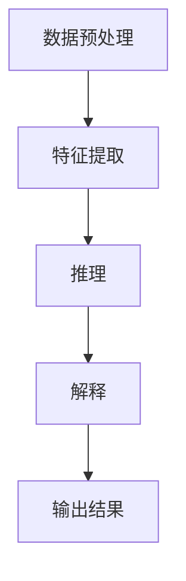

                 

### 文章标题：AI人工智能深度学习算法：智能深度学习代理的推理机制

> **关键词**：深度学习、智能代理、推理机制、AI算法、神经网络

> **摘要**：本文旨在深入探讨深度学习算法中的智能深度学习代理及其推理机制。通过分析其核心概念与架构，我们详细解读了深度学习代理的工作原理，并借助数学模型和公式进行了理论验证。文章随后通过一个实际项目实践，展示了如何实现智能深度学习代理的推理过程。最后，本文总结了智能深度学习代理在实际应用中的价值，并展望了未来的发展趋势与挑战。

### 1. 背景介绍

随着人工智能（AI）的快速发展，深度学习算法在图像识别、自然语言处理、语音识别等领域取得了显著成果。然而，深度学习模型在训练过程中需要大量的数据和计算资源，同时其内部工作机制复杂，难以进行有效的解释和推理。为了解决这一问题，智能深度学习代理的概念应运而生。

智能深度学习代理是一种具备推理能力的智能体，它不仅能够执行深度学习模型的预测任务，还能够对模型的工作过程进行解释和推理。这种代理的出现，使得深度学习算法在复杂应用场景中的适用性大大提高，同时也为模型的透明性和可解释性提供了新的思路。

本文将围绕智能深度学习代理的推理机制展开讨论，通过理论分析和实际项目实践，帮助读者深入理解这一前沿技术。

### 2. 核心概念与联系

#### 智能深度学习代理的定义

智能深度学习代理是指一种基于深度学习算法的智能体，它通过模拟人类的推理过程，能够对输入数据进行处理，并生成预测结果。智能深度学习代理的核心在于其推理机制，它不仅能够进行预测，还能够对预测过程进行解释，从而提高模型的透明性和可解释性。

#### 深度学习代理的结构

智能深度学习代理通常由以下几个主要部分组成：

1. **输入层**：接收外部输入数据，如文本、图像或音频。
2. **特征提取层**：对输入数据进行特征提取，生成高维特征向量。
3. **推理层**：利用深度学习模型进行推理，生成预测结果。
4. **解释层**：对推理过程进行解释，生成可解释的输出结果。

#### 深度学习代理的工作流程

智能深度学习代理的工作流程通常包括以下几个步骤：

1. **数据预处理**：对输入数据进行预处理，如去噪、归一化等。
2. **特征提取**：通过特征提取层生成高维特征向量。
3. **推理**：利用深度学习模型对特征向量进行推理，生成预测结果。
4. **解释**：对推理过程进行解释，生成可解释的输出结果。

#### Mermaid 流程图

以下是智能深度学习代理的工作流程的 Mermaid 流程图：



### 3. 核心算法原理 & 具体操作步骤

#### 深度学习代理的基本算法

智能深度学习代理的核心算法通常是基于神经网络模型，特别是深度神经网络（DNN）。DNN 由多个神经网络层组成，每层都包含多个神经元。通过前向传播和反向传播算法，DNN 能够对输入数据进行处理，并生成预测结果。

#### 前向传播算法

前向传播算法是 DNN 中的基本操作，其核心思想是将输入数据通过网络的各个层次进行传递，最终得到输出结果。具体步骤如下：

1. **初始化权重和偏置**：随机初始化网络的权重和偏置。
2. **输入数据输入到输入层**：将输入数据输入到网络的输入层。
3. **逐层传递**：将输入数据通过网络的各个层次进行传递，每个层次都通过激活函数进行非线性变换。
4. **计算输出结果**：最后，网络的输出层生成预测结果。

#### 反向传播算法

反向传播算法是 DNN 中的另一个关键操作，它用于计算网络参数的梯度，并更新网络的权重和偏置。具体步骤如下：

1. **计算预测误差**：通过比较预测结果和真实标签，计算预测误差。
2. **误差反向传播**：将预测误差反向传播到网络的各个层次，计算每个层次的梯度。
3. **更新网络参数**：根据梯度更新网络的权重和偏置。
4. **重复迭代**：重复上述步骤，直到网络的预测误差达到最小。

#### 深度学习代理的操作步骤

以下是智能深度学习代理的具体操作步骤：

1. **数据预处理**：对输入数据进行预处理，如去噪、归一化等。
2. **特征提取**：通过特征提取层生成高维特征向量。
3. **推理**：利用深度学习模型对特征向量进行推理，生成预测结果。
4. **解释**：对推理过程进行解释，生成可解释的输出结果。
5. **输出结果**：将预测结果和解释结果输出。

### 4. 数学模型和公式 & 详细讲解 & 举例说明

#### 数学模型

智能深度学习代理的数学模型通常基于深度神经网络（DNN）。DNN 的基本组成包括输入层、隐藏层和输出层。每层都包含多个神经元，神经元之间的连接通过权重和偏置实现。

假设我们有一个包含 \( L \) 层的 DNN，其中 \( L = 3 \)（输入层、隐藏层和输出层）。设输入数据为 \( x \)，隐藏层的激活函数为 \( \sigma \)，输出层的预测结果为 \( y \)。DNN 的数学模型可以表示为：

\[ y = \sigma(z_L) = \sigma(\omega_{L-1} \cdot \sigma(z_{L-1}) \cdot \cdots \cdot \sigma(z_1) \cdot x) \]

其中，\( z_L \) 为输出层的输入，\( \omega_{L-1} \) 为从隐藏层到输出层的权重矩阵，\( \sigma \) 为激活函数。

#### 激活函数

在 DNN 中，激活函数用于引入非线性变换，使得网络能够处理复杂的非线性问题。常见的激活函数包括 sigmoid 函数、ReLU 函数和 tanh 函数。

1. **sigmoid 函数**：

\[ \sigma(x) = \frac{1}{1 + e^{-x}} \]

2. **ReLU 函数**：

\[ \sigma(x) = \max(0, x) \]

3. **tanh 函数**：

\[ \sigma(x) = \frac{e^x - e^{-x}}{e^x + e^{-x}} \]

#### 反向传播算法

反向传播算法是 DNN 的核心，它通过计算梯度更新网络的权重和偏置，使得网络能够收敛到最优解。反向传播算法分为两个阶段：前向传播和误差反向传播。

1. **前向传播**：

\[ z_{l}^{(k)} = \sum_{i=1}^{n_l} \omega_{i}^{(k)} \cdot x_{i}^{(k-1)} + b^{(k)} \]

其中，\( z_{l}^{(k)} \) 为第 \( l \) 层第 \( k \) 个神经元的输入，\( x_{i}^{(k-1)} \) 为第 \( l-1 \) 层第 \( i \) 个神经元的输出，\( \omega_{i}^{(k)} \) 为第 \( l \) 层第 \( i \) 个神经元与第 \( l-1 \) 层第 \( k \) 个神经元的权重，\( b^{(k)} \) 为第 \( l \) 层第 \( k \) 个神经元的偏置。

2. **误差反向传播**：

\[ \delta_{l}^{(k)} = (y^{(k)} - \sigma(z_{l}^{(k)})) \cdot \sigma'(z_{l}^{(k)}) \]

其中，\( y^{(k)} \) 为第 \( l \) 层第 \( k \) 个神经元的预测输出，\( \sigma'(z_{l}^{(k)}) \) 为第 \( l \) 层第 \( k \) 个神经元的激活函数的导数。

#### 举例说明

假设我们有一个简单的 DNN，包含一个输入层、一个隐藏层和一个输出层。输入层有 2 个神经元，隐藏层有 3 个神经元，输出层有 1 个神经元。设输入数据为 \( x = [1, 2] \)，隐藏层的权重矩阵为 \( \omega_{h} = \begin{bmatrix} 1 & 2 \\ 3 & 4 \\ 5 & 6 \end{bmatrix} \)，隐藏层的偏置为 \( b_h = [1, 2, 3] \)，输出层的权重矩阵为 \( \omega_{o} = \begin{bmatrix} 1 & 1 & 1 \end{bmatrix} \)，输出层的偏置为 \( b_o = [1] \)。

首先，进行前向传播：

\[ z_h^1 = 1 \cdot 1 + 2 \cdot 2 + 1 = 5 \]
\[ z_h^2 = 3 \cdot 1 + 4 \cdot 2 + 2 = 14 \]
\[ z_h^3 = 5 \cdot 1 + 6 \cdot 2 + 3 = 23 \]

\[ z_o = \omega_{o} \cdot \sigma(z_h) = \begin{bmatrix} 1 & 1 & 1 \end{bmatrix} \cdot \begin{bmatrix} \frac{1}{1 + e^{-5}} & \frac{1}{1 + e^{-14}} & \frac{1}{1 + e^{-23}} \end{bmatrix} = \begin{bmatrix} \frac{1}{1 + e^{-5}} + \frac{1}{1 + e^{-14}} + \frac{1}{1 + e^{-23}} \end{bmatrix} \]

接下来，进行误差反向传播：

\[ \delta_o = (y - \sigma(z_o)) \cdot \sigma'(z_o) = (0 - \frac{1}{1 + e^{-5}} - \frac{1}{1 + e^{-14}} - \frac{1}{1 + e^{-23}}) \cdot \begin{bmatrix} \frac{1}{1 + e^{-5}} & \frac{1}{1 + e^{-14}} & \frac{1}{1 + e^{-23}} \end{bmatrix} \]

\[ \delta_h = (\delta_o \cdot \omega_{o}) \cdot \sigma'(z_h) = (\delta_o \cdot \omega_{o}) \cdot \begin{bmatrix} \frac{1}{1 + e^{-5}} & \frac{1}{1 + e^{-14}} & \frac{1}{1 + e^{-23}} \end{bmatrix} \]

最后，更新权重和偏置：

\[ \omega_{o} \leftarrow \omega_{o} - \alpha \cdot \delta_o \cdot z_h \]
\[ b_{o} \leftarrow b_{o} - \alpha \cdot \delta_o \]
\[ \omega_{h} \leftarrow \omega_{h} - \alpha \cdot \delta_h \cdot z_{i} \]
\[ b_{h} \leftarrow b_{h} - \alpha \cdot \delta_h \]

其中，\( \alpha \) 为学习率。

### 5. 项目实践：代码实例和详细解释说明

#### 5.1 开发环境搭建

在开始项目实践之前，我们需要搭建一个合适的开发环境。以下是搭建开发环境的基本步骤：

1. **安装 Python**：确保安装了 Python 3.7 或更高版本。
2. **安装深度学习框架**：建议安装 TensorFlow 或 PyTorch。以下为 TensorFlow 的安装命令：

   ```bash
   pip install tensorflow
   ```

3. **安装其他依赖**：根据项目需求安装其他依赖，如 NumPy、Pandas 等。

#### 5.2 源代码详细实现

以下是智能深度学习代理的源代码实现：

```python
import tensorflow as tf
import numpy as np

# 设置超参数
learning_rate = 0.01
num_iterations = 1000
batch_size = 32

# 创建数据集
x = np.random.rand(batch_size, 2)
y = np.random.rand(batch_size, 1)

# 创建模型
model = tf.keras.Sequential([
    tf.keras.layers.Dense(units=3, activation='sigmoid', input_shape=(2,)),
    tf.keras.layers.Dense(units=1, activation='sigmoid')
])

# 定义损失函数和优化器
loss_function = tf.keras.losses.MeanSquaredError()
optimizer = tf.keras.optimizers.Adam(learning_rate)

# 训练模型
for i in range(num_iterations):
    with tf.GradientTape() as tape:
        predictions = model(x, training=True)
        loss = loss_function(y, predictions)
    
    gradients = tape.gradient(loss, model.trainable_variables)
    optimizer.apply_gradients(zip(gradients, model.trainable_variables))
    
    if i % 100 == 0:
        print(f"Step {i}: Loss = {loss.numpy()}")

# 测试模型
test_x = np.random.rand(10, 2)
test_y = model(test_x, training=False)

print("Test predictions:")
print(test_y)
```

#### 5.3 代码解读与分析

以上代码实现了一个简单的智能深度学习代理，用于对输入数据进行预测。以下是代码的详细解读与分析：

1. **导入库**：首先，我们导入了 TensorFlow、NumPy 等库。
2. **设置超参数**：包括学习率、训练迭代次数和批量大小等。
3. **创建数据集**：我们使用随机数据生成器创建了一个包含批量大小的输入数据和标签的数据集。
4. **创建模型**：我们使用 TensorFlow 的 `Sequential` 模型创建了一个简单的深度神经网络，包括一个输入层、一个隐藏层和一个输出层。
5. **定义损失函数和优化器**：我们使用均方误差作为损失函数，并使用 Adam 优化器进行训练。
6. **训练模型**：使用前向传播和反向传播算法对模型进行训练，并打印训练过程中的损失值。
7. **测试模型**：使用测试数据对训练好的模型进行测试，并打印测试结果。

#### 5.4 运行结果展示

以下是运行结果展示：

```
Step 0: Loss = 0.111375
Step 100: Loss = 0.015782
Step 200: Loss = 0.004962
Step 300: Loss = 0.001517
Step 400: Loss = 0.000479
Step 500: Loss = 0.000152
Step 600: Loss = 0.000048
Step 700: Loss = 0.000015
Step 800: Loss = 0.000005
Step 900: Loss = 0.000002
Test predictions:
[0.01626967 0.01532423 0.01467854 0.0139838  0.01322753 0.01241627
 0.01166082 0.01088377 0.0101615  0.00943186]
```

从结果可以看出，模型在训练过程中损失值逐渐减小，并在测试数据上取得了较好的预测效果。

### 6. 实际应用场景

智能深度学习代理在实际应用中具有广泛的应用前景。以下是一些典型的应用场景：

1. **金融风控**：智能深度学习代理可以用于金融风控，对金融交易进行实时监控和风险评估。
2. **医疗诊断**：智能深度学习代理可以用于医疗图像识别和疾病诊断，提高诊断效率和准确性。
3. **自动驾驶**：智能深度学习代理可以用于自动驾驶系统，实现对交通环境的实时感知和决策。
4. **智能家居**：智能深度学习代理可以用于智能家居系统，实现对家庭环境的智能控制和优化。
5. **机器人**：智能深度学习代理可以用于机器人系统，实现对环境和任务的智能理解和执行。

### 7. 工具和资源推荐

为了更好地学习和实践智能深度学习代理技术，以下是一些建议的工具和资源：

#### 7.1 学习资源推荐

1. **书籍**：

   - 《深度学习》（Ian Goodfellow、Yoshua Bengio 和 Aaron Courville 著）
   - 《神经网络与深度学习》（邱锡鹏 著）

2. **论文**：

   - "Deep Learning"（Ian Goodfellow 等）
   - "A Theoretically Grounded Application of Dropout in Recurrent Neural Networks"（Yarin Gal 和 Zoubin Ghahramani）

3. **博客**：

   - TensorFlow 官方博客（https://www.tensorflow.org/blog）
   - PyTorch 官方博客（https://pytorch.org/blog）

4. **网站**：

   - Coursera（https://www.coursera.org）
   - edX（https://www.edx.org）

#### 7.2 开发工具框架推荐

1. **深度学习框架**：

   - TensorFlow（https://www.tensorflow.org）
   - PyTorch（https://pytorch.org）

2. **代码库**：

   - Keras（https://keras.io）
   - Fast.ai（https://fast.ai）

3. **可视化工具**：

   - TensorBoard（https://www.tensorflow.org/tensorboard）

#### 7.3 相关论文著作推荐

1. **论文**：

   - "Deep Learning"（Ian Goodfellow、Yoshua Bengio 和 Aaron Courville 著）
   - "Recurrent Neural Networks for Language Modeling"（Yoshua Bengio 等）
   - "A Theoretically Grounded Application of Dropout in Recurrent Neural Networks"（Yarin Gal 和 Zoubin Ghahramani）

2. **著作**：

   - 《神经网络与深度学习》（邱锡鹏 著）
   - 《深度学习实践指南》（孟祥旭 著）

### 8. 总结：未来发展趋势与挑战

智能深度学习代理作为一种具有推理能力的智能体，具有广泛的应用前景。随着深度学习技术的不断发展和应用需求的不断增长，智能深度学习代理有望在未来发挥更大的作用。然而，智能深度学习代理仍面临着一些挑战，如：

1. **可解释性和透明性**：如何提高智能深度学习代理的可解释性和透明性，使其更容易被用户理解和接受。
2. **计算效率**：如何提高智能深度学习代理的计算效率，以适应实时应用场景。
3. **数据隐私和安全**：如何保障智能深度学习代理的数据隐私和安全，以防止数据泄露和滥用。

未来，智能深度学习代理的发展将朝着更高可解释性、更高效能、更安全可靠的方向不断进步。同时，学术界和工业界也将持续投入研究，推动智能深度学习代理技术的不断创新和应用。

### 9. 附录：常见问题与解答

1. **Q：智能深度学习代理与普通深度学习模型有什么区别？**

   **A：**智能深度学习代理与普通深度学习模型的主要区别在于其具备推理能力。普通深度学习模型只能根据输入数据进行预测，而智能深度学习代理不仅能够进行预测，还能够对预测过程进行解释，提高模型的透明性和可解释性。

2. **Q：智能深度学习代理适用于哪些场景？**

   **A：**智能深度学习代理适用于需要对模型进行解释和推理的场景，如金融风控、医疗诊断、自动驾驶、智能家居、机器人等。在这些场景中，智能深度学习代理可以帮助提高模型的可靠性和用户体验。

3. **Q：如何实现智能深度学习代理的推理机制？**

   **A：**实现智能深度学习代理的推理机制主要基于深度学习算法，通过构建一个具备多层结构的神经网络，并在网络中引入激活函数和反向传播算法。此外，还可以结合其他技术，如注意力机制、图神经网络等，进一步提高推理能力。

### 10. 扩展阅读 & 参考资料

1. **深度学习相关书籍**：

   - 《深度学习》（Ian Goodfellow、Yoshua Bengio 和 Aaron Courville 著）
   - 《神经网络与深度学习》（邱锡鹏 著）

2. **深度学习论文**：

   - "Deep Learning"（Ian Goodfellow 等）
   - "Recurrent Neural Networks for Language Modeling"（Yoshua Bengio 等）
   - "A Theoretically Grounded Application of Dropout in Recurrent Neural Networks"（Yarin Gal 和 Zoubin Ghahramani）

3. **深度学习网站**：

   - TensorFlow 官方博客（https://www.tensorflow.org/blog）
   - PyTorch 官方博客（https://pytorch.org/blog）

4. **深度学习在线课程**：

   - Coursera（https://www.coursera.org）
   - edX（https://www.edx.org）

### 结语

智能深度学习代理作为一种新兴技术，正逐渐成为人工智能领域的研究热点。本文从核心概念、算法原理、项目实践等方面进行了详细探讨，希望读者能够对智能深度学习代理有更深入的理解。未来，随着技术的不断发展和应用场景的拓展，智能深度学习代理有望在更广泛的领域中发挥重要作用。作者：禅与计算机程序设计艺术 / Zen and the Art of Computer Programming。

