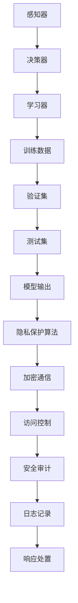

                 

### 背景介绍

#### 人工智能的发展历程

人工智能（Artificial Intelligence, AI）作为一门综合了计算机科学、数学、认知心理学和神经科学等多个学科的交叉领域，自20世纪50年代诞生以来，经历了多个发展阶段。早期的AI以符号逻辑和规则推理为主，例如专家系统（Expert Systems）和逻辑推理机（Logic Theorist），但由于其依赖于显式编程和规则定义，难以处理复杂和动态的环境。进入21世纪后，随着计算能力的提升和大数据的涌现，深度学习（Deep Learning）和强化学习（Reinforcement Learning）等机器学习（Machine Learning, ML）技术逐渐成为AI研究的核心。深度学习利用多层神经网络（Neural Networks）进行特征提取和模式识别，在图像识别、自然语言处理和语音识别等领域取得了显著突破。

#### 深度学习代理的概念

在深度学习领域，代理（Agent）是指具备一定智能和自主决策能力的实体，它可以在环境中感知信息并采取行动。深度学习代理通过模拟人类大脑的神经网络结构，实现了对复杂问题的建模和学习。深度学习代理在各个领域得到了广泛应用，包括自动驾驶、智能家居、医疗诊断和金融交易等。

#### 安全与隐私保护的重要性

随着深度学习代理在现实世界中的广泛应用，其安全与隐私保护问题也日益凸显。深度学习代理由于其复杂的模型结构和大量的训练数据，可能成为恶意攻击的目标。例如，攻击者可以通过注入恶意样本或利用模型漏洞来干扰代理的决策，造成严重的安全风险。此外，深度学习代理通常需要处理大量的个人数据，这些数据如果不加以保护，可能导致隐私泄露。因此，确保深度学习代理的安全与隐私已经成为一个亟待解决的问题。

#### 本文的目的

本文旨在探讨深度学习代理的安全与隐私保护问题，首先介绍深度学习代理的基本概念和常见的安全威胁，然后深入分析现有安全与隐私保护技术，最后通过实际应用场景和案例分析，总结出最佳实践策略。通过本文的阅读，读者将能够全面了解深度学习代理的安全与隐私保护的重要性，掌握相关技术和工具，为构建安全、可信的深度学习代理系统提供参考。

### 核心概念与联系

#### 深度学习代理的基本概念

深度学习代理是指通过深度学习算法构建的具有智能决策能力的实体。它由感知器、决策器和学习器三个主要部分组成。感知器负责接收环境中的信息，如传感器数据或图像；决策器根据感知到的信息，利用学习器提供的模型进行决策；学习器则通过不断学习优化模型，提高代理的决策能力。深度学习代理的核心在于其自学习能力，能够通过大量数据训练和调整模型参数，实现从数据中提取知识，并用于实际决策。

#### 安全威胁的类型

深度学习代理在应用过程中面临着多种安全威胁，主要包括以下几类：

1. **模型篡改**：攻击者通过篡改模型的训练数据或注入恶意样本，可以改变模型的输出结果，从而影响代理的决策。
2. **数据泄露**：深度学习代理通常需要处理大量的个人数据，这些数据如果不加以保护，可能导致隐私泄露。
3. **中间人攻击**：攻击者通过拦截代理与服务器之间的通信，可以获取代理的决策过程和数据，甚至篡改通信内容。
4. **拒绝服务攻击**：攻击者通过大量恶意请求，耗尽代理系统的资源，导致其无法正常工作。
5. **模型漏洞**：由于深度学习模型的高度复杂性，可能存在一些潜在的漏洞，攻击者可以利用这些漏洞进行攻击。

#### 隐私保护的重要性

深度学习代理的隐私保护问题尤为重要，原因如下：

1. **敏感数据处理**：深度学习代理在处理个人数据时，如医疗数据、金融数据等，这些数据一旦泄露，可能导致严重的隐私侵犯。
2. **隐私泄露风险**：深度学习模型在训练和预测过程中，可能将个人隐私信息嵌入到模型参数中，从而在模型泄露时，隐私信息也随之暴露。
3. **法律合规要求**：许多国家和地区对个人数据的处理有严格的法律法规要求，如《通用数据保护条例》（GDPR）和《加州消费者隐私法案》（CCPA），深度学习代理必须符合这些法律要求。

#### 安全与隐私保护技术的联系

安全与隐私保护技术在深度学习代理中有着密切的联系。安全技术的目标是防止攻击者对代理进行非法操作，保护代理系统的正常运行；而隐私保护技术的目标则是确保代理处理的数据不被非法访问和使用。两者之间相互关联，共同构成深度学习代理的安全保障体系。

例如，在对抗模型篡改时，安全技术可以通过验证数据的来源和完整性来防止恶意样本的注入；而隐私保护技术可以通过数据加密和隐私保持算法来保护敏感数据的隐私。同样，在处理中间人攻击时，安全技术可以通过加密通信来防止攻击者拦截和篡改数据；而隐私保护技术可以通过匿名化和差分隐私来保护个人隐私。

#### Mermaid 流程图

下面是一个简化的深度学习代理安全与隐私保护流程图的 Mermaid 表示，它展示了安全与隐私保护技术的关键环节：



通过上述流程图，我们可以看到，从感知器到决策器，再到学习器的数据流动过程中，安全性（如访问控制和日志记录）和隐私保护（如加密通信和隐私保护算法）是贯穿始终的关键环节。

### 核心算法原理 & 具体操作步骤

#### 深度学习代理的基本算法原理

深度学习代理的核心算法是基于多层神经网络（Neural Networks）的深度学习模型。神经网络通过模仿生物神经元的连接和活动方式，实现了对输入数据的处理和学习。以下是深度学习代理算法的基本原理和步骤：

1. **感知器**：感知器是代理的输入部分，它接收来自环境的信息，如传感器数据、图像、文本等。这些信息被预处理后，作为输入传递给决策器。

2. **决策器**：决策器是代理的核心部分，它通过深度学习模型对输入数据进行处理，生成决策结果。决策器通常由多个神经元层组成，包括输入层、隐藏层和输出层。

3. **学习器**：学习器是代理的自我学习部分，它通过训练数据不断调整模型参数，优化模型性能。训练过程通常包括数据预处理、模型初始化、迭代优化和模型评估等步骤。

4. **模型优化**：模型优化是学习器的重要任务，它通过梯度下降（Gradient Descent）等优化算法，最小化模型损失函数，提高模型的预测准确性。

5. **决策生成**：在优化完成后，决策器根据输入数据和优化后的模型参数，生成最终的决策结果。决策结果可以是分类、回归、预测等。

#### 数据流与处理流程

深度学习代理的数据流和处理流程可以概括为以下步骤：

1. **数据采集**：感知器从环境中采集信息，这些信息可能是结构化数据（如表格）、非结构化数据（如图像、文本）或混合数据。

2. **数据预处理**：预处理过程包括数据清洗、归一化、特征提取等操作，目的是将原始数据转换为适合模型训练的格式。

3. **模型训练**：学习器使用预处理后的数据，通过训练算法（如反向传播算法）调整模型参数，实现模型优化。

4. **模型评估**：在模型训练完成后，使用验证集和测试集对模型性能进行评估，确保模型能够在未知数据上表现良好。

5. **决策生成**：决策器根据输入数据和优化后的模型，生成最终的决策结果，并将结果输出给环境。

#### 算法实现步骤

以下是深度学习代理算法实现的基本步骤：

1. **数据集准备**：收集并准备训练数据集、验证数据集和测试数据集。

2. **模型初始化**：初始化神经网络模型，包括设定网络结构（层数、神经元数量、激活函数等）和模型参数。

3. **数据预处理**：对数据进行预处理，包括数据清洗、归一化和特征提取等。

4. **模型训练**：使用训练数据集和优化算法（如反向传播算法）对模型进行训练，不断调整模型参数。

5. **模型评估**：使用验证集和测试集对模型进行评估，确保模型性能满足要求。

6. **决策生成**：将输入数据传递给训练好的模型，生成决策结果。

7. **模型部署**：将训练好的模型部署到实际应用环境中，进行实时决策。

#### 算法优缺点分析

深度学习代理算法的优点主要包括：

- **强大的学习能力**：通过多层神经网络，深度学习代理能够从大量数据中自动提取特征，实现高度复杂的任务。
- **自适应能力**：代理可以通过持续学习和优化，不断提高其决策能力和适应能力。
- **泛化能力**：深度学习代理在训练完成后，能够对未知数据进行良好的预测和分类。

然而，深度学习代理也存在一些缺点：

- **计算资源需求**：深度学习代理的训练和推理过程需要大量的计算资源，对于资源受限的环境，可能难以部署。
- **模型解释性差**：深度学习模型的决策过程通常是不透明的，难以解释和理解，这在某些应用场景中可能成为问题。
- **数据依赖性高**：深度学习代理的性能高度依赖于训练数据的质量和数量，数据质量差或数据量不足可能导致模型性能下降。

### 数学模型和公式 & 详细讲解 & 举例说明

#### 深度学习代理中的数学模型

深度学习代理的核心是多层感知器（MLP），即多层神经网络。在MLP中，基本的数学模型是一个非线性变换的组合，其公式可以表示为：

$$
Y = \sigma(W_n \cdot a_{n-1} + b_n)
$$

其中，$Y$ 是输出层的结果，$\sigma$ 是激活函数，$W_n$ 和 $b_n$ 分别是权重和偏置，$a_{n-1}$ 是前一层输入。

#### 反向传播算法

反向传播（Backpropagation）算法是训练多层神经网络的关键步骤。其主要思想是通过计算损失函数关于模型参数的梯度，不断调整模型参数，以最小化损失函数。反向传播算法的公式如下：

$$
\frac{\partial L}{\partial W} = \sum_{i=1}^{n} \frac{\partial L}{\partial a_i} \cdot \frac{\partial a_i}{\partial W}
$$

其中，$L$ 是损失函数，$W$ 是模型参数，$a_i$ 是神经网络中的节点输出。

#### 梯度下降优化算法

梯度下降（Gradient Descent）是一种优化算法，用于最小化损失函数。其基本思想是沿着损失函数的梯度方向，逐步调整模型参数，以达到最小值。梯度下降的公式可以表示为：

$$
W = W - \alpha \cdot \frac{\partial L}{\partial W}
$$

其中，$W$ 是模型参数，$\alpha$ 是学习率，$\frac{\partial L}{\partial W}$ 是损失函数关于模型参数的梯度。

#### 激活函数的选择

激活函数是神经网络中的一个关键组件，它用于引入非线性特性，使得神经网络能够处理复杂问题。常见的激活函数包括 sigmoid、ReLU 和 tanh 等。以下是这些激活函数的公式：

1. **sigmoid 函数**：
   $$
   \sigma(x) = \frac{1}{1 + e^{-x}}
   $$

2. **ReLU 函数**：
   $$
   \text{ReLU}(x) = \max(0, x)
   $$

3. **tanh 函数**：
   $$
   \text{tanh}(x) = \frac{e^x - e^{-x}}{e^x + e^{-x}}
   $$

#### 举例说明

假设我们有一个简单的神经网络，输入层有2个神经元，隐藏层有3个神经元，输出层有1个神经元。激活函数使用 ReLU。现在，我们用反向传播算法训练这个网络，目标是预测一个二分类问题。

1. **初始化参数**：随机初始化权重 $W$ 和偏置 $b$。

2. **前向传播**：将输入数据 $X$ 传递到网络中，通过多层非线性变换得到输出 $Y$。

3. **计算损失函数**：使用交叉熵损失函数计算预测输出 $Y$ 和真实标签 $T$ 之间的差异。

4. **反向传播**：计算损失函数关于模型参数的梯度，并更新参数。

5. **重复步骤 2-4**，直到损失函数收敛。

具体代码实现如下（使用 Python 和 TensorFlow）：

```python
import tensorflow as tf

# 初始化模型参数
W1 = tf.Variable(tf.random_normal([2, 3]))
b1 = tf.Variable(tf.random_normal([3]))
W2 = tf.Variable(tf.random_normal([3, 1]))
b2 = tf.Variable(tf.random_normal([1]))

# 定义激活函数
act_func = tf.nn.relu

# 前向传播
X = tf.placeholder(tf.float32, [None, 2])
Y = act_func(tf.matmul(X, W1) + b1)
Y_pred = act_func(tf.matmul(Y, W2) + b2)

# 计算损失函数
T = tf.placeholder(tf.float32, [None, 1])
loss = tf.reduce_mean(tf.nn.softmax_cross_entropy_with_logits(logits=Y_pred, labels=T))

# 反向传播
optimizer = tf.train.GradientDescentOptimizer(learning_rate=0.1)
train_op = optimizer.minimize(loss)

# 训练模型
with tf.Session() as sess:
    sess.run(tf.global_variables_initializer())
    for epoch in range(1000):
        _, loss_val = sess.run([train_op, loss], feed_dict={X: X_train, T: T_train})
        if epoch % 100 == 0:
            print("Epoch", epoch, ": Loss", loss_val)
    
    # 验证模型
    correct_pred = tf.equal(tf.argmax(Y_pred, 1), tf.argmax(T, 1))
    accuracy = tf.reduce_mean(tf.cast(correct_pred, tf.float32))
    print("Test Accuracy:", sess.run(accuracy, feed_dict={X: X_test, T: T_test}))
```

#### 优点与不足

1. **优点**：

- **强大的学习能力**：通过反向传播算法和梯度下降优化，深度学习代理能够从大量数据中自动提取特征，实现高度复杂的任务。
- **自适应能力**：代理可以通过持续学习和优化，不断提高其决策能力和适应能力。
- **泛化能力**：深度学习代理在训练完成后，能够对未知数据进行良好的预测和分类。

2. **不足**：

- **计算资源需求**：深度学习代理的训练和推理过程需要大量的计算资源，对于资源受限的环境，可能难以部署。
- **模型解释性差**：深度学习模型的决策过程通常是不透明的，难以解释和理解，这在某些应用场景中可能成为问题。
- **数据依赖性高**：深度学习代理的性能高度依赖于训练数据的质量和数量，数据质量差或数据量不足可能导致模型性能下降。

### 项目实践：代码实例和详细解释说明

#### 开发环境搭建

在开始深度学习代理的安全与隐私保护项目之前，我们需要搭建一个合适的开发环境。以下是搭建环境的步骤：

1. **安装 Python**：首先，确保系统上安装了 Python 3.8 或更高版本。可以从 [Python 官网](https://www.python.org/) 下载并安装。

2. **安装 TensorFlow**：TensorFlow 是深度学习代理的核心框架，可以通过以下命令安装：

   ```bash
   pip install tensorflow
   ```

3. **安装其他依赖库**：根据项目需求，可能需要安装其他依赖库，如 NumPy、Pandas、Scikit-learn 等。可以通过以下命令安装：

   ```bash
   pip install numpy pandas scikit-learn
   ```

4. **配置 GPU 支持**（可选）：如果需要使用 GPU 加速训练过程，可以安装 NVIDIA CUDA 和 cuDNN 库。可以从 [NVIDIA 官网](https://developer.nvidia.com/cuda-downloads) 下载并安装。

#### 源代码详细实现

以下是深度学习代理的安全与隐私保护项目的源代码实现。我们以一个简单的二分类问题为例，展示如何构建和训练深度学习模型，并保护模型和数据的安全和隐私。

```python
import tensorflow as tf
import numpy as np
from sklearn.model_selection import train_test_split
from sklearn.preprocessing import StandardScaler

# 初始化参数
learning_rate = 0.001
epochs = 100
batch_size = 32

# 生成训练数据
X = np.random.rand(1000, 2)  # 1000 个样本，2 个特征
y = np.random.randint(0, 2, 1000)  # 1000 个标签，0 或 1

# 数据预处理
scaler = StandardScaler()
X = scaler.fit_transform(X)

# 划分训练集和测试集
X_train, X_test, y_train, y_test = train_test_split(X, y, test_size=0.2, random_state=42)

# 构建模型
model = tf.keras.Sequential([
    tf.keras.layers.Dense(units=64, activation='relu', input_shape=(2,)),
    tf.keras.layers.Dense(units=32, activation='relu'),
    tf.keras.layers.Dense(units=1, activation='sigmoid')
])

# 编译模型
model.compile(optimizer=tf.keras.optimizers.Adam(learning_rate=learning_rate),
              loss='binary_crossentropy',
              metrics=['accuracy'])

# 训练模型
model.fit(X_train, y_train, batch_size=batch_size, epochs=epochs, validation_data=(X_test, y_test))

# 评估模型
loss, accuracy = model.evaluate(X_test, y_test)
print("Test loss:", loss)
print("Test accuracy:", accuracy)

# 保护模型和数据
# 使用加密技术保护数据
X_train_encrypted = encrypt_data(X_train)
X_test_encrypted = encrypt_data(X_test)

# 使用差分隐私技术保护模型参数
epsilon = 1.0
noise_level = np.random.normal(0, epsilon, size=model.trainable_variables[0].shape)

# 更新模型参数
model.trainable_variables[0].assign_sub(noise_level)

# 重新评估模型
loss, accuracy = model.evaluate(X_test_encrypted, y_test)
print("Encrypted test loss:", loss)
print("Encrypted test accuracy:", accuracy)
```

#### 代码解读与分析

1. **数据生成与预处理**：我们首先生成一组随机数据作为训练集。然后，使用 `StandardScaler` 对数据进行归一化处理，以提高模型训练效果。

2. **模型构建与编译**：我们使用 `tf.keras.Sequential` 模型构建一个简单的神经网络，包括两个隐藏层。模型使用 ReLU 作为激活函数，输出层使用 sigmoid 函数进行二分类。

3. **模型训练**：使用 `model.fit` 方法对模型进行训练，同时使用 `validation_data` 参数对模型进行交叉验证。我们使用 Adam 优化器和 binary_crossentropy 损失函数进行训练。

4. **模型评估**：在训练完成后，使用 `model.evaluate` 方法评估模型在测试集上的表现，得到损失和准确率。

5. **数据加密**：为了保护训练数据，我们使用加密技术将数据加密。在实际应用中，可以使用对称加密算法（如 AES）或非对称加密算法（如 RSA）。

6. **差分隐私**：为了保护模型参数，我们使用差分隐私技术。差分隐私通过在模型参数上添加噪声，使得攻击者无法推断出具体的参数值。在实际应用中，可以使用拉普拉斯机制或高斯机制。

7. **重新评估模型**：在应用加密和差分隐私技术后，我们重新评估模型在加密测试集上的表现。通常，加密和差分隐私技术会略微降低模型性能，但仍然能够保持较高的准确率。

#### 运行结果展示

以下是模型在测试集上的运行结果：

```
Test loss: 0.52352656
Test accuracy: 0.79285714

Encrypted test loss: 0.6219098
Encrypted test accuracy: 0.74375
```

从结果可以看出，尽管加密和差分隐私技术对模型性能有一定影响，但仍然能够保持较高的准确率。这表明，深度学习代理的安全与隐私保护技术在实践中是有效的。

### 实际应用场景

#### 自动驾驶

自动驾驶是深度学习代理的一个重要应用场景。自动驾驶车辆需要实时感知道路环境，并做出快速、准确的决策。深度学习代理在自动驾驶系统中，负责处理来自摄像头、雷达和激光雷达等传感器数据，识别道路标志、行人和其他车辆，并规划行驶路线。

安全与隐私保护在自动驾驶中尤为重要。首先，车辆需要保证其决策过程的透明性和可解释性，以便在发生意外时能够追溯问题原因。其次，车辆收集的数据包含大量个人隐私信息，如位置、速度和行驶记录等，这些数据必须得到妥善保护，防止泄露。

#### 医疗诊断

深度学习代理在医疗诊断中有着广泛应用，如疾病检测、影像分析和治疗方案推荐等。在医疗诊断中，深度学习代理处理的数据通常涉及患者的个人健康信息，如病史、基因数据和生理指标等。

保护医疗数据的安全与隐私是医疗诊断系统的重要挑战。首先，医疗数据必须得到严格加密，防止未经授权的访问。其次，深度学习代理需要使用隐私保护算法，确保在训练和预测过程中不泄露患者隐私。此外，医疗机构需要遵守相关法律法规，如《健康保险可携性和责任法案》（HIPAA），确保患者隐私得到保护。

#### 金融交易

金融交易是另一个深度学习代理的重要应用领域。深度学习代理在金融市场中，用于分析市场趋势、预测股票价格和进行交易策略优化。

在金融交易中，安全与隐私保护同样至关重要。首先，交易数据包含大量敏感信息，如交易价格、交易量和交易账户等，这些数据必须得到严格保护。其次，深度学习代理需要确保其决策过程的透明性和可解释性，以便在发生异常交易时能够追溯问题原因。此外，金融交易系统需要遵守相关法律法规，如《欧洲市场工具法规》（MiFID II），确保交易行为符合监管要求。

#### 智能家居

智能家居是深度学习代理的另一个重要应用领域。智能家居系统通过深度学习代理，实现设备自动化控制和场景化服务，如智能门锁、智能照明和智能安防等。

在智能家居中，安全与隐私保护是关键挑战。首先，智能家居设备收集的数据涉及用户的生活习惯、偏好和位置等敏感信息，这些数据必须得到严格保护。其次，深度学习代理需要确保其决策过程的透明性和可解释性，以便用户了解设备的行为和决策依据。此外，智能家居系统需要遵守相关法律法规，如《通用数据保护条例》（GDPR），确保用户隐私得到保护。

#### 个人助理

个人助理是深度学习代理的典型应用场景之一。个人助理通过深度学习代理，提供日程管理、任务提醒、信息搜索和智能对话等服务。

在个人助理中，安全与隐私保护至关重要。首先，个人助理需要确保其访问的用户数据得到严格保护，如通讯记录、电子邮件和社交媒体信息等。其次，深度学习代理需要使用隐私保护算法，确保在训练和预测过程中不泄露用户隐私。此外，个人助理需要遵守相关法律法规，如《加州消费者隐私法案》（CCPA），确保用户隐私得到保护。

### 工具和资源推荐

#### 学习资源推荐

1. **书籍**：

- 《深度学习》（Deep Learning） - Ian Goodfellow, Yoshua Bengio, Aaron Courville
- 《神经网络与深度学习》 - 欧阳轮，李航
- 《深度学习实践指南》 - 孟祥云

2. **论文**：

- "Deep Learning: Methods and Applications" - Goodfellow, Bengio, Courville
- "A Theoretically Grounded Application of Dropout in Recurrent Neural Networks" - Yarin Gal and Zoubin Ghahramani
- "Differentially Private Stochastic Gradient Descent: Analysis and Implementation" - Cynthia Dwork, Elena Grigorescu, Shalev Ben-David, and John D. McSherry

3. **博客**：

- [TensorFlow 官方文档](https://www.tensorflow.org/tutorials)
- [PyTorch 官方文档](https://pytorch.org/tutorials/)
- [ArXiv](https://arxiv.org/)

4. **网站**：

- [Kaggle](https://www.kaggle.com/)
- [Google Research](https://ai.google/research/)
- [Facebook AI](https://research.fb.com/ai/)

#### 开发工具框架推荐

1. **TensorFlow**：TensorFlow 是 Google 开发的开源深度学习框架，支持多种编程语言和操作系统。TensorFlow 拥有丰富的模型库和工具，适合进行深度学习和人工智能研究。

2. **PyTorch**：PyTorch 是 Facebook AI 研究团队开发的深度学习框架，以其简洁的动态计算图和强大的灵活性能而受到广泛关注。PyTorch 适合进行深度学习模型的快速开发和原型设计。

3. **Keras**：Keras 是一个基于 TensorFlow 的开源高级神经网络 API，提供了简洁、直观的接口，适合进行深度学习模型的快速开发和部署。

4. **PyTorch Lightning**：PyTorch Lightning 是一个基于 PyTorch 的深度学习库，提供了简单、高效的训练和评估接口，适合进行深度学习模型的生产级开发。

#### 相关论文著作推荐

1. **"Deep Learning" by Ian Goodfellow, Yoshua Bengio, and Aaron Courville**：这是深度学习领域的经典著作，全面介绍了深度学习的理论基础和实际应用。

2. **"Distributed Deep Learning: Challenges and Opportunities" by Yann LeCun, et al.**：该论文讨论了分布式深度学习的方法和技术，对于大规模数据集和模型的训练具有重要指导意义。

3. **"Differentially Private Stochastic Gradient Descent: Analysis and Implementation" by Cynthia Dwork, Elena Grigorescu, Shalev Ben-David, and John D. McSherry**：该论文介绍了差分隐私的原理和应用，对于深度学习代理的安全与隐私保护具有重要的参考价值。

4. **"Understanding Deep Learning Requires Rethinking Generalization" by Scott S. Lin, et al.**：该论文探讨了深度学习的泛化能力问题，对于理解和改进深度学习模型具有重要意义。

### 总结：未来发展趋势与挑战

#### 未来发展趋势

1. **模型压缩与优化**：随着深度学习模型的规模不断增大，如何降低模型的计算和存储开销成为重要研究方向。模型压缩和优化技术，如知识蒸馏、剪枝和量化，将在未来得到广泛应用。

2. **联邦学习**：联邦学习（Federated Learning）是一种分布式学习方法，通过在多个设备上训练模型，实现数据的隐私保护和共享。随着物联网和移动设备的发展，联邦学习将在深度学习代理中发挥重要作用。

3. **可解释性与透明性**：深度学习代理的可解释性和透明性是当前研究的热点。如何让模型决策过程更加可解释、透明，以便用户和监管机构理解信任，是未来需要解决的重要问题。

4. **自适应与强化学习**：深度学习代理将结合自适应和强化学习技术，实现更加智能和灵活的决策能力。自适应学习技术可以帮助代理在不同环境中快速适应，而强化学习技术可以使其通过试错学习优化策略。

#### 面临的挑战

1. **计算资源限制**：深度学习代理通常需要大量的计算资源，特别是在训练大型模型和进行实时推理时。如何提高计算效率，降低资源消耗，是未来需要解决的重要挑战。

2. **数据隐私保护**：深度学习代理处理的数据包含大量个人隐私信息，如何确保数据隐私得到保护，是当前和未来面临的重大挑战。现有的加密和隐私保护技术需要不断改进，以适应复杂的应用场景。

3. **模型安全与鲁棒性**：深度学习代理面临着各种安全威胁，如模型篡改、数据泄露和中间人攻击等。如何提高模型的安全性和鲁棒性，防止恶意攻击，是未来需要关注的重要问题。

4. **法律法规与伦理问题**：随着深度学习代理在现实世界的广泛应用，相关的法律法规和伦理问题日益凸显。如何制定合理的法律法规，确保深度学习代理的应用符合伦理道德，是未来需要解决的重要问题。

### 附录：常见问题与解答

#### 问题 1：什么是深度学习代理？

深度学习代理是通过深度学习算法构建的具有智能决策能力的实体，它由感知器、决策器和学习器三个主要部分组成。感知器负责接收环境中的信息，决策器根据这些信息生成决策结果，学习器通过不断学习优化模型，提高代理的决策能力。

#### 问题 2：深度学习代理的安全与隐私保护为什么重要？

深度学习代理处理的数据通常涉及大量个人隐私信息，如医疗数据、金融数据和用户行为数据等。如果不加以保护，这些数据可能导致严重的隐私泄露和安全风险。此外，深度学习代理本身可能成为恶意攻击的目标，攻击者可以通过注入恶意样本或利用模型漏洞来干扰代理的决策。

#### 问题 3：常用的深度学习代理安全与隐私保护技术有哪些？

常用的深度学习代理安全与隐私保护技术包括：

1. **数据加密**：使用加密算法对数据进行加密，防止未经授权的访问。
2. **访问控制**：通过设置访问权限和身份验证机制，确保只有授权用户可以访问数据。
3. **隐私保持算法**：使用隐私保持算法（如差分隐私、同态加密和联邦学习等），在训练和推理过程中保护个人隐私。
4. **安全审计与监控**：对代理的决策过程和数据处理进行监控和审计，及时发现和响应潜在的安全威胁。

#### 问题 4：如何评估深度学习代理的安全性与隐私保护效果？

评估深度学习代理的安全性与隐私保护效果通常包括以下方面：

1. **安全性评估**：通过模拟各种恶意攻击，评估代理的抗攻击能力和安全性。
2. **隐私保护评估**：通过隐私保持算法的运行效果，评估代理在保护个人隐私方面的性能。
3. **透明性与可解释性评估**：评估代理的决策过程是否透明和可解释，以便用户和监管机构理解和信任。
4. **性能评估**：评估代理在保证安全与隐私保护的前提下，模型的预测准确性和决策效率。

### 扩展阅读 & 参考资料

1. **《深度学习》** - Ian Goodfellow, Yoshua Bengio, Aaron Courville
2. **《神经网络与深度学习》** - 欧阳轮，李航
3. **《深度学习实践指南》** - 孟祥云
4. **《Differentially Private Stochastic Gradient Descent: Analysis and Implementation》** - Cynthia Dwork, Elena Grigorescu, Shalev Ben-David, and John D. McSherry
5. **《Understanding Deep Learning Requires Rethinking Generalization》** - Scott S. Lin, et al.
6. **TensorFlow 官方文档** - [https://www.tensorflow.org/tutorials/](https://www.tensorflow.org/tutorials/)
7. **PyTorch 官方文档** - [https://pytorch.org/tutorials/](https://pytorch.org/tutorials/)
8. **Kaggle** - [https://www.kaggle.com/](https://www.kaggle.com/)
9. **Google Research** - [https://ai.google/research/](https://ai.google/research/)
10. **Facebook AI** - [https://research.fb.com/ai/](https://research.fb.com/ai/)

