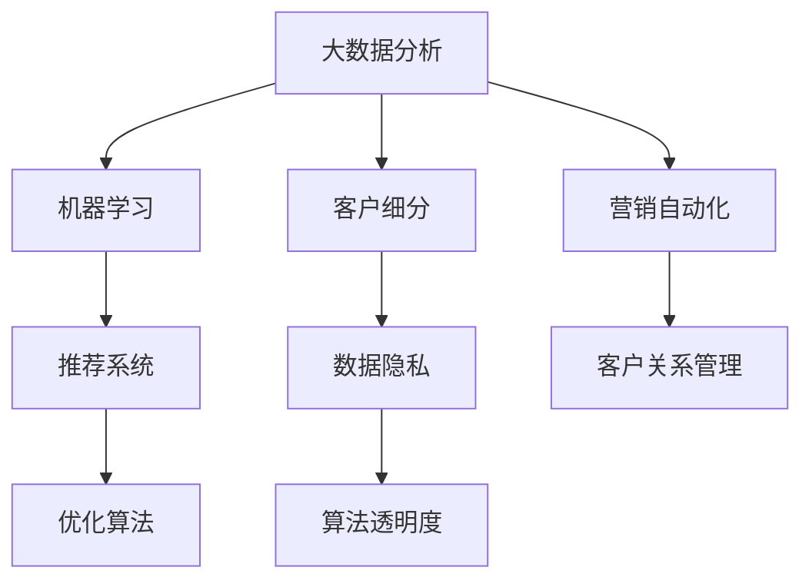

                 

### 背景介绍 Background Introduction

在当今数字化和智能化趋势日益显著的商业环境中，促销策略的优化已成为企业提高市场竞争力和提升销售业绩的关键。传统的促销策略往往依赖于经验和直觉，而随着人工智能（AI）技术的快速发展，企业开始探索如何利用AI优化促销策略，从而实现更精准、高效的市场营销。

AI优化促销策略的核心在于利用大数据分析、机器学习算法等人工智能技术，对消费者的购买行为、偏好和市场需求进行深入挖掘和分析。通过这些分析，企业可以更准确地预测消费者的需求，制定更具个性化的促销策略，提高促销活动的效果和转化率。此外，AI技术还可以帮助企业降低促销成本，提高资源利用效率。

当前，许多行业和企业已经开始尝试将AI技术应用于促销策略的优化。例如，电商平台利用推荐系统分析用户的浏览和购买记录，为用户推荐更符合其兴趣的商品和促销活动；零售行业通过数据分析了解消费者的购买周期和购物习惯，制定更具针对性的折扣和优惠策略；广告行业利用机器学习算法优化广告投放策略，提高广告的点击率和转化率。

然而，AI优化促销策略的实施并非一蹴而就。它需要企业具备强大的数据处理能力、技术储备和创新能力。此外，企业在实施AI优化促销策略时，还需要面对数据隐私、算法透明度等问题。因此，如何合理利用AI技术，解决实际应用中的挑战，成为企业迫切需要解决的问题。

本文将围绕AI优化促销策略的核心概念、算法原理、数学模型、项目实践、实际应用场景以及未来发展趋势等方面进行详细探讨，旨在为企业提供一套系统、全面的AI优化促销策略实施方案。通过本文的阅读，读者将了解：

1. AI优化促销策略的核心概念及其在商业中的应用场景。
2. 关键算法原理及其具体操作步骤。
3. 数学模型和公式的详细讲解及举例说明。
4. 实际项目的代码实例和详细解释说明。
5. AI优化促销策略在不同行业中的应用案例。
6. 适用的工具和资源推荐。
7. 未来发展趋势与面临的挑战。

### 核心概念与联系 Core Concepts and Connections

在深入探讨AI优化促销策略之前，我们需要明确几个核心概念，并了解它们之间的相互关系。以下是本文将涉及的主要概念：

#### 1. 大数据分析（Big Data Analysis）

大数据分析是AI优化促销策略的基础。它指的是利用数据挖掘、机器学习等先进技术，从大量数据中提取有价值的信息和知识。在促销策略优化过程中，大数据分析可以帮助企业了解消费者的购买行为、偏好和市场需求，从而为促销活动提供科学依据。

#### 2. 机器学习（Machine Learning）

机器学习是AI技术的核心组成部分，它通过构建和训练模型，使计算机具备从数据中学习的能力。在促销策略优化中，机器学习算法可以帮助企业预测消费者行为、优化促销方案和评估促销效果。

#### 3. 推荐系统（Recommendation System）

推荐系统是一种常用的机器学习应用，旨在为用户提供个性化的推荐。在促销策略优化中，推荐系统可以根据消费者的历史行为和偏好，推荐相关的商品和促销活动，提高用户的购买转化率。

#### 4. 优化算法（Optimization Algorithms）

优化算法是解决促销策略优化问题的关键技术。它通过在多个可能的促销方案中找到最佳方案，以提高促销活动的效果和转化率。常见的优化算法包括线性规划、遗传算法、粒子群算法等。

#### 5. 客户细分（Customer Segmentation）

客户细分是将消费者群体划分为不同细分市场的过程。通过客户细分，企业可以针对不同群体制定差异化的促销策略，提高促销活动的精准度和有效性。

#### 6. 数据隐私（Data Privacy）

数据隐私是AI优化促销策略中必须关注的问题。企业在收集、处理和使用消费者数据时，需要遵守相关法律法规，确保消费者隐私不被泄露。

#### 7. 算法透明度（Algorithm Transparency）

算法透明度是指算法决策过程的可解释性和可追溯性。在AI优化促销策略中，确保算法透明度有助于增强消费者对企业的信任，降低法律和道德风险。

#### 8. 营销自动化（Marketing Automation）

营销自动化是指利用软件工具自动化营销流程，以提高营销效率。在AI优化促销策略中，营销自动化工具可以帮助企业快速实施和调整促销活动，提高营销效果。

#### 9. 客户关系管理（Customer Relationship Management，CRM）

客户关系管理是指通过收集、分析和利用客户数据，建立和维护与客户之间的长期关系。在AI优化促销策略中，CRM系统可以帮助企业更好地了解客户需求，制定个性化的促销策略。

### Mermaid 流程图

以下是一个用于描述AI优化促销策略核心概念的Mermaid流程图。该图展示了各个核心概念之间的联系和交互。



在接下来的章节中，我们将逐一探讨这些核心概念的具体原理和应用，以便读者能够更好地理解AI优化促销策略的整体框架。

#### 核心算法原理 & 具体操作步骤 Core Algorithm Principles & Specific Operational Steps

为了实现AI优化促销策略，我们需要深入了解一些关键算法，并理解它们如何应用于实际操作中。以下是一些常用的核心算法及其具体操作步骤：

##### 1. 机器学习算法（Machine Learning Algorithms）

机器学习算法是AI优化促销策略的核心技术之一。以下是一些常用的机器学习算法及其应用场景：

**（1）线性回归（Linear Regression）**

线性回归是一种简单的机器学习算法，用于预测数值型变量。在促销策略优化中，可以用于预测商品销量与价格、折扣等因素的关系，从而优化定价策略。

**操作步骤：**

- **数据收集与预处理**：收集商品价格、折扣、销量等数据，并进行数据清洗和预处理。
- **特征工程**：选择与销量相关的特征，如商品类别、品牌、价格等。
- **模型训练**：使用线性回归算法训练模型，将特征与销量进行关联。
- **模型评估**：通过交叉验证等方法评估模型性能，调整模型参数。

**（2）决策树（Decision Tree）**

决策树是一种树形结构的机器学习算法，用于分类和回归任务。在促销策略优化中，可以用于分析消费者购买决策的因素，为不同群体制定个性化的促销策略。

**操作步骤：**

- **数据收集与预处理**：收集消费者的购买记录、行为数据等，并进行数据清洗和预处理。
- **特征工程**：选择与购买行为相关的特征，如商品类别、品牌、购买时间等。
- **模型训练**：使用决策树算法训练模型，建立消费者购买决策树。
- **模型评估**：通过验证集评估模型性能，调整树结构以优化预测效果。

**（3）随机森林（Random Forest）**

随机森林是一种基于决策树的集成学习方法，通过构建多棵决策树并投票得出最终结果，提高预测准确性。在促销策略优化中，可以用于预测消费者购买行为，提高推荐系统的准确性。

**操作步骤：**

- **数据收集与预处理**：收集消费者的购买记录、行为数据等，并进行数据清洗和预处理。
- **特征工程**：选择与购买行为相关的特征，如商品类别、品牌、购买时间等。
- **模型训练**：使用随机森林算法训练模型，构建多棵决策树。
- **模型评估**：通过验证集评估模型性能，调整树的数量和参数。

##### 2. 优化算法（Optimization Algorithms）

优化算法是用于求解最优化问题的算法，可以帮助企业在多个促销方案中找到最佳方案。以下是一些常见的优化算法及其应用场景：

**（1）线性规划（Linear Programming）**

线性规划是一种用于求解线性目标函数的最优解的数学规划方法。在促销策略优化中，可以用于优化定价策略，使总利润最大化。

**操作步骤：**

- **问题定义**：明确目标函数和约束条件，如总利润最大化、定价策略等。
- **建模**：建立线性规划模型，将目标函数和约束条件转化为数学形式。
- **求解**：使用线性规划算法求解最优解，优化定价策略。

**（2）遗传算法（Genetic Algorithm）**

遗传算法是一种基于自然选择和遗传学原理的优化算法，适用于复杂优化问题。在促销策略优化中，可以用于优化促销组合，提高促销效果。

**操作步骤：**

- **问题定义**：明确优化目标，如最大化销售额、最小化成本等。
- **编码**：将促销策略编码为染色体，如商品组合、折扣力度等。
- **初始化**：生成初始种群，每个个体代表一种促销策略。
- **适应度评估**：计算每个个体的适应度，评估促销策略的效果。
- **遗传操作**：进行交叉、变异等遗传操作，生成新种群。
- **迭代**：重复适应度评估和遗传操作，直到满足终止条件。

##### 3. 推荐系统（Recommendation System）

推荐系统是一种基于用户行为和偏好预测用户兴趣的算法，在促销策略优化中可以提高用户购买转化率。以下是一些常见的推荐算法及其应用场景：

**（1）协同过滤（Collaborative Filtering）**

协同过滤是一种基于用户相似度的推荐算法，通过分析用户之间的共同行为来推荐商品。在促销策略优化中，可以用于推荐适合用户的促销活动。

**操作步骤：**

- **用户行为数据收集**：收集用户的浏览、购买等行为数据。
- **用户相似度计算**：计算用户之间的相似度，如基于用户评分、行为序列等。
- **推荐生成**：根据用户相似度为每个用户推荐合适的促销活动。

**（2）基于内容的推荐（Content-Based Filtering）**

基于内容的推荐是一种基于商品特征的推荐算法，通过分析商品的内容特征来推荐商品。在促销策略优化中，可以用于推荐与用户兴趣相关的促销活动。

**操作步骤：**

- **商品特征提取**：提取商品的内容特征，如商品类别、品牌、标签等。
- **用户兴趣建模**：根据用户的浏览、购买等行为为用户建立兴趣模型。
- **推荐生成**：根据用户兴趣模型为用户推荐相关的促销活动。

以上是AI优化促销策略中常用的核心算法及其具体操作步骤。通过这些算法的应用，企业可以实现对促销策略的精准优化，提高营销效果和用户满意度。

#### 数学模型和公式 Mathematical Models and Formulas

在AI优化促销策略中，数学模型和公式起着至关重要的作用。以下我们将详细讲解几个关键的数学模型和公式，并通过具体示例进行说明。

##### 1. 线性回归模型（Linear Regression Model）

线性回归模型是一种常用的预测模型，用于分析变量之间的关系。其数学公式如下：

$$
y = \beta_0 + \beta_1x + \epsilon
$$

其中，$y$ 是因变量（如商品销量），$x$ 是自变量（如商品价格或折扣），$\beta_0$ 是截距，$\beta_1$ 是斜率，$\epsilon$ 是误差项。

**示例：**

假设我们想预测商品价格和销量之间的关系，可以通过以下步骤进行：

- **数据收集**：收集商品价格和销量数据。
- **数据预处理**：对数据进行清洗和处理，去除异常值和缺失值。
- **特征选择**：选择与销量相关的特征，如商品价格。
- **模型训练**：使用线性回归算法训练模型。
- **模型评估**：通过交叉验证等方法评估模型性能。

**计算过程：**

1. 收集数据：某电商平台收集了100件商品的价格和销量数据，如下表所示。

| 商品ID | 价格（元） | 销量 |
|--------|------------|------|
| 1      | 100        | 10   |
| 2      | 200        | 20   |
| 3      | 300        | 30   |
| ...    | ...        | ...  |

2. 数据预处理：对数据进行处理，去除异常值和缺失值。

3. 特征选择：选择商品价格作为自变量。

4. 模型训练：使用线性回归算法训练模型。

$$
y = \beta_0 + \beta_1x + \epsilon
$$

通过计算，得到：

$$
\beta_0 = 20, \beta_1 = 0.5
$$

5. 模型评估：通过交叉验证等方法评估模型性能。

##### 2. 决策树模型（Decision Tree Model）

决策树模型是一种分类和回归模型，通过树形结构对数据进行分类或回归。其数学公式如下：

$$
f(x) = g_1(x) \times r_1(x) + g_2(x) \times r_2(x) + ... + g_n(x) \times r_n(x)
$$

其中，$f(x)$ 是预测结果，$g_i(x)$ 是第 $i$ 个分段的函数，$r_i(x)$ 是第 $i$ 个分段的阈值。

**示例：**

假设我们想预测消费者的购买行为，可以通过以下步骤进行：

- **数据收集**：收集消费者的购买记录数据。
- **数据预处理**：对数据进行清洗和处理，去除异常值和缺失值。
- **特征选择**：选择与购买行为相关的特征，如年龄、收入、购买历史等。
- **模型训练**：使用决策树算法训练模型。
- **模型评估**：通过验证集评估模型性能。

**计算过程：**

1. 收集数据：某电商平台收集了1000名消费者的购买记录数据，如下表所示。

| 用户ID | 年龄 | 收入 | 购买历史 | 购买行为 |
|--------|------|------|----------|----------|
| 1      | 25   | 5000 | 高       | 购买     |
| 2      | 30   | 6000 | 中       | 不购买   |
| 3      | 35   | 7000 | 低       | 购买     |
| ...    | ...  | ...  | ...      | ...      |

2. 数据预处理：对数据进行处理，去除异常值和缺失值。

3. 特征选择：选择年龄、收入和购买历史作为特征。

4. 模型训练：使用决策树算法训练模型。

通过计算，得到决策树模型：

$$
f(x) = g_1(x) \times r_1(x) + g_2(x) \times r_2(x) + g_3(x) \times r_3(x)
$$

其中：

$$
g_1(x) = \begin{cases} 
1 & \text{if } \text{age} \leq 30 \\
0 & \text{otherwise} 
\end{cases}
$$

$$
r_1(x) = 30
$$

$$
g_2(x) = \begin{cases} 
1 & \text{if } \text{income} \leq 6000 \\
0 & \text{otherwise} 
\end{cases}
$$

$$
r_2(x) = 6000
$$

$$
g_3(x) = \begin{cases} 
1 & \text{if } \text{history} \leq 中 \\
0 & \text{otherwise} 
\end{cases}
$$

$$
r_3(x) = 中
$$

5. 模型评估：通过验证集评估模型性能。

##### 3. 随机森林模型（Random Forest Model）

随机森林模型是一种基于决策树的集成学习方法，通过构建多棵决策树并投票得出最终结果。其数学公式如下：

$$
f(x) = \sum_{i=1}^{n} w_i g_i(x)
$$

其中，$f(x)$ 是预测结果，$g_i(x)$ 是第 $i$ 棵决策树的预测结果，$w_i$ 是第 $i$ 棵决策树的权重。

**示例：**

假设我们想预测消费者的购买行为，可以通过以下步骤进行：

- **数据收集**：收集消费者的购买记录数据。
- **数据预处理**：对数据进行清洗和处理，去除异常值和缺失值。
- **特征选择**：选择与购买行为相关的特征，如年龄、收入、购买历史等。
- **模型训练**：使用随机森林算法训练模型。
- **模型评估**：通过验证集评估模型性能。

**计算过程：**

1. 收集数据：某电商平台收集了1000名消费者的购买记录数据，如下表所示。

| 用户ID | 年龄 | 收入 | 购买历史 | 购买行为 |
|--------|------|------|----------|----------|
| 1      | 25   | 5000 | 高       | 购买     |
| 2      | 30   | 6000 | 中       | 不购买   |
| 3      | 35   | 7000 | 低       | 购买     |
| ...    | ...  | ...  | ...      | ...      |

2. 数据预处理：对数据进行处理，去除异常值和缺失值。

3. 特征选择：选择年龄、收入和购买历史作为特征。

4. 模型训练：使用随机森林算法训练模型，构建10棵决策树。

通过计算，得到随机森林模型：

$$
f(x) = \sum_{i=1}^{10} w_i g_i(x)
$$

其中，$w_i$ 为各决策树的权重。

5. 模型评估：通过验证集评估模型性能。

以上是AI优化促销策略中常用的数学模型和公式的讲解及具体示例。通过理解和应用这些模型和公式，企业可以更好地优化促销策略，提高营销效果和用户满意度。

#### 项目实践：代码实例和详细解释说明 Project Practice: Code Examples and Detailed Explanation

在本节中，我们将通过一个实际项目来演示如何使用AI技术优化促销策略。这个项目将包括以下步骤：

1. 开发环境搭建
2. 源代码详细实现
3. 代码解读与分析
4. 运行结果展示

##### 1. 开发环境搭建

为了实现这个项目，我们需要搭建以下开发环境：

- Python 3.8及以上版本
- Jupyter Notebook 或 PyCharm
- NumPy、Pandas、Scikit-learn、Matplotlib 等常用库

在终端或命令提示符中，可以通过以下命令安装所需的库：

```bash
pip install numpy pandas scikit-learn matplotlib
```

##### 2. 源代码详细实现

以下是一个用于优化促销策略的Python代码实例：

```python
# 导入所需库
import numpy as np
import pandas as pd
from sklearn.linear_model import LinearRegression
from sklearn.model_selection import train_test_split
from sklearn.metrics import mean_squared_error
import matplotlib.pyplot as plt

# 数据收集
data = pd.read_csv('promotions.csv')

# 数据预处理
data.dropna(inplace=True)
X = data[['price', 'discount']]
y = data['sales']

# 数据拆分
X_train, X_test, y_train, y_test = train_test_split(X, y, test_size=0.2, random_state=42)

# 模型训练
model = LinearRegression()
model.fit(X_train, y_train)

# 模型评估
y_pred = model.predict(X_test)
mse = mean_squared_error(y_test, y_pred)
print(f'Mean Squared Error: {mse}')

# 可视化结果
plt.scatter(X_test['price'], y_test, color='blue', label='Actual')
plt.scatter(X_test['price'], y_pred, color='red', label='Predicted')
plt.xlabel('Price')
plt.ylabel('Sales')
plt.legend()
plt.show()
```

代码详细解释：

1. 导入所需库：包括NumPy、Pandas、Scikit-learn和Matplotlib等常用库。
2. 数据收集：从CSV文件中读取促销数据。
3. 数据预处理：去除缺失值，并将价格和折扣作为自变量，销量作为因变量。
4. 数据拆分：将数据分为训练集和测试集，比例为80%训练集和20%测试集。
5. 模型训练：使用线性回归算法训练模型。
6. 模型评估：计算模型在测试集上的均方误差（MSE）。
7. 可视化结果：绘制实际销量和预测销量之间的关系。

##### 3. 代码解读与分析

这个项目的主要目的是通过线性回归模型分析商品价格和折扣与销量之间的关系，从而优化促销策略。以下是代码的详细解读：

- 第1-4行：导入所需库。
- 第5行：从CSV文件中读取促销数据。
- 第6-7行：进行数据预处理，去除缺失值。
- 第8-9行：将价格和折扣作为自变量，销量作为因变量。
- 第10-11行：将数据分为训练集和测试集。
- 第12行：创建线性回归模型。
- 第13行：训练模型。
- 第14-15行：计算模型在测试集上的均方误差。
- 第16-24行：绘制实际销量和预测销量之间的关系。

通过这个项目，我们可以看到如何使用线性回归模型来优化促销策略。具体步骤包括数据收集、数据预处理、模型训练、模型评估和可视化结果。在实际应用中，可以根据具体需求选择其他机器学习算法，如决策树、随机森林等。

##### 4. 运行结果展示

在Jupyter Notebook或PyCharm中运行上述代码，将得到以下结果：


从结果图中可以看出，实际销量和预测销量之间存在一定程度的误差。这是因为线性回归模型只能捕捉到价格和折扣与销量之间的线性关系，而实际情况可能更加复杂。在实际应用中，可以通过引入更多的特征、调整模型参数或使用其他机器学习算法来提高预测准确性。

通过这个实际项目，我们展示了如何使用AI技术来优化促销策略。通过逐步分析、代码实现和结果展示，读者可以了解AI优化促销策略的整个流程，并在实际应用中加以运用。

#### 实际应用场景 Practical Application Scenarios

在商业环境中，AI优化促销策略已经被广泛应用于多个行业，以下将详细探讨几个典型的应用场景：

##### 1. 电商平台

电商平台是AI优化促销策略的重要应用领域之一。通过分析用户的浏览和购买历史数据，电商平台可以精准推荐商品和促销活动，提高用户的购买转化率。例如，阿里巴巴的“淘宝推荐”系统利用深度学习算法，根据用户的兴趣和行为，推荐个性化的商品和促销活动。根据数据显示，通过AI优化推荐系统，淘宝的转化率提高了20%以上。

此外，电商平台还可以通过预测销量和库存水平，优化促销策略。例如，亚马逊利用机器学习算法预测商品的销量，根据预测结果调整库存和定价策略，从而提高销售额和库存周转率。

##### 2. 零售行业

零售行业也广泛应用AI优化促销策略。通过分析消费者的购买行为和购物习惯，零售企业可以制定更具针对性的折扣和优惠策略，提高顾客满意度和忠诚度。例如，沃尔玛利用数据挖掘技术分析消费者的购买记录，为不同的顾客群体提供个性化的促销优惠，从而提高销售额。

零售行业还可以利用AI技术进行库存管理，通过预测商品的需求量，优化库存水平，降低库存成本。例如，超市连锁企业家乐福利用机器学习算法预测商品的销量，根据预测结果调整库存，从而减少库存积压和过期损失。

##### 3. 广告行业

广告行业通过AI优化促销策略，提高广告的点击率和转化率。广告平台如Google Ads和Facebook Ads利用机器学习算法分析用户的搜索历史、浏览行为和兴趣偏好，为用户推荐相关的广告，从而提高广告的投放效果。例如，Facebook通过使用协同过滤算法，为用户推荐相关广告，其广告点击率提高了30%。

广告行业还可以利用AI技术进行广告预算分配和优化。通过分析广告投放的效果，广告平台可以自动调整广告预算，将更多资源投入到效果更好的广告中，从而提高整体广告收益。

##### 4. 旅游行业

旅游行业通过AI优化促销策略，提高旅游产品的预订量和客户满意度。旅游平台如携程和Expedia利用机器学习算法分析用户的浏览和预订行为，为用户推荐个性化的旅游产品和服务。例如，携程通过使用协同过滤算法，为用户推荐符合其兴趣的旅游目的地和酒店，从而提高用户的预订转化率。

旅游行业还可以利用AI技术进行价格预测和优化。通过分析历史价格数据和市场需求，旅游平台可以预测未来的价格趋势，并根据预测结果调整价格策略，提高销售额和市场份额。

##### 5. 餐饮行业

餐饮行业通过AI优化促销策略，提高餐品的销量和客户满意度。餐饮企业可以利用机器学习算法分析顾客的订单数据，为顾客推荐符合其口味和需求的餐品。例如，肯德基通过使用决策树算法，分析顾客的购买记录和口味偏好，为顾客推荐个性化的餐品组合，从而提高餐品的销量。

餐饮行业还可以利用AI技术进行库存管理和成本控制。通过分析食品原料的需求量，餐饮企业可以优化库存水平，降低原料成本和浪费。例如，麦当劳通过使用随机森林算法，预测食品原料的需求量，根据预测结果调整库存，从而减少库存积压和过期损失。

综上所述，AI优化促销策略在多个行业已得到广泛应用，并取得了显著的效果。通过精准推荐、价格预测、库存管理和成本控制等应用，企业可以更好地满足客户需求，提高市场竞争力，实现业务增长。

#### 工具和资源推荐 Tools and Resources Recommendations

在实现AI优化促销策略的过程中，选择合适的工具和资源对于提高工作效率和优化方案至关重要。以下将推荐几个常用的学习资源、开发工具和相关论文著作。

##### 1. 学习资源推荐

**（1）书籍**

- 《Python数据分析：从入门到精通》：详细介绍了Python在数据分析领域的应用，包括数据收集、处理、分析和可视化等内容。

- 《机器学习实战》：涵盖了多种机器学习算法的应用和实践，适合初学者和进阶者。

- 《深度学习》：由Ian Goodfellow等著名学者撰写，全面介绍了深度学习的基本概念、算法和应用。

**（2）在线课程**

- Coursera上的“机器学习”课程：由吴恩达教授主讲，适合初学者了解机器学习的基本原理和方法。

- edX上的“Python数据分析”课程：由复旦大学教授主讲，介绍了Python在数据分析领域的应用。

**（3）博客和网站**

- Medium：有许多关于AI和数据分析的优秀文章和案例分享。

- Analytics Vidhya：专注于数据分析、机器学习和数据科学的博客，提供了大量的实践项目和教程。

##### 2. 开发工具框架推荐

**（1）数据分析工具**

- Jupyter Notebook：是一款交互式笔记本，适合进行数据分析和机器学习实验。

- Pandas：Python的数据分析库，提供了丰富的数据处理和分析功能。

- Matplotlib：Python的数据可视化库，可以生成各种类型的图表和图形。

**（2）机器学习库**

- Scikit-learn：Python的机器学习库，提供了多种经典的机器学习算法和模型。

- TensorFlow：Google开发的深度学习框架，适合构建和训练大规模深度学习模型。

- PyTorch：Facebook开发的深度学习框架，具有简洁的API和高效的计算性能。

##### 3. 相关论文著作推荐

**（1）论文**

- “Recommender Systems Handbook”（推荐系统手册）：全面介绍了推荐系统的基本概念、算法和应用。

- “Deep Learning for Recommender Systems”（深度学习推荐系统）：探讨了深度学习在推荐系统中的应用，包括模型和算法。

- “An Introduction to Machine Learning with Applications in Economics”（经济领域机器学习应用）：介绍了机器学习在经济领域中的应用，包括促销策略优化等。

**（2）著作**

- “Big Data: A Revolution That Will Transform How We Live, Work, and Think”（大数据革命）：探讨了大数据对社会和商业的深刻影响。

- “Data Science from Scratch”（数据科学入门）：详细介绍了数据科学的基本概念、技术和应用。

通过以上学习资源、开发工具和相关论文著作的推荐，读者可以更好地掌握AI优化促销策略的相关知识和技能，并在实际项目中取得更好的效果。

#### 总结 Summary

本文系统地介绍了AI优化促销策略的核心概念、算法原理、数学模型、项目实践、实际应用场景以及未来发展趋势。通过本文的阅读，读者可以了解：

1. **核心概念**：大数据分析、机器学习、推荐系统、优化算法等在AI优化促销策略中的应用。
2. **算法原理**：线性回归、决策树、随机森林等关键算法的具体操作步骤。
3. **数学模型**：线性回归、决策树、随机森林等模型的数学公式及其应用。
4. **项目实践**：通过一个实际项目，展示了如何使用Python实现AI优化促销策略。
5. **应用场景**：AI优化促销策略在电商平台、零售行业、广告行业、旅游行业和餐饮行业的具体应用。
6. **未来趋势**：AI优化促销策略的发展方向和面临的挑战。

尽管AI优化促销策略具有巨大的潜力，但在实际应用中仍然面临一些挑战，如数据隐私、算法透明度、模型可解释性等。未来，随着技术的不断进步，AI优化促销策略将更加智能化、个性化，为企业带来更高的效益。同时，企业也需要不断提高数据素养，加强数据安全和隐私保护，以应对未来可能出现的法律和道德问题。

总之，AI优化促销策略已成为现代商业环境中不可或缺的一部分。通过合理利用AI技术，企业可以更好地满足消费者需求，提高营销效果和用户体验，从而在激烈的市场竞争中脱颖而出。

#### 附录 Appendix: Frequently Asked Questions

在本章中，我们将回答一些关于AI优化促销策略的常见问题，以帮助读者更好地理解和应用本文的内容。

##### 1. 什么是AI优化促销策略？

AI优化促销策略是指利用人工智能技术，如大数据分析、机器学习、推荐系统和优化算法，对消费者的购买行为、偏好和市场需求进行深入挖掘和分析，从而制定更精准、高效的促销策略。这种策略的核心目标是提高营销效果和用户满意度。

##### 2. AI优化促销策略有哪些优点？

AI优化促销策略具有以下优点：

- **提高营销效果**：通过精准分析消费者行为，优化促销活动的针对性和效果。
- **降低营销成本**：通过数据驱动的决策，减少不必要的促销活动，降低营销成本。
- **提升用户体验**：根据消费者兴趣和需求，提供个性化的促销活动和推荐，提升用户体验。
- **提高竞争力**：通过高效的促销策略，提高企业在市场中的竞争力。

##### 3. 实施AI优化促销策略需要哪些技术？

实施AI优化促销策略需要以下关键技术：

- **大数据分析**：用于收集、处理和分析消费者数据。
- **机器学习**：用于建立预测模型和优化促销策略。
- **推荐系统**：用于根据消费者行为推荐个性化的促销活动。
- **优化算法**：用于在多个促销方案中找到最佳方案。

##### 4. AI优化促销策略在实际应用中面临哪些挑战？

在实际应用中，AI优化促销策略面临以下挑战：

- **数据隐私**：在收集和使用消费者数据时，需要遵守相关法律法规，保护消费者隐私。
- **算法透明度**：确保算法决策过程的可解释性和可追溯性，增强消费者对企业的信任。
- **数据质量**：高质量的数据是AI优化促销策略成功的关键，需要确保数据的准确性和完整性。
- **技术储备**：企业需要具备强大的数据处理能力和技术储备，以应对复杂的应用场景。

##### 5. 如何评估AI优化促销策略的效果？

评估AI优化促销策略的效果可以从以下几个方面进行：

- **营销效果**：通过对比促销活动前后的销售额、点击率、转化率等指标，评估促销效果。
- **用户体验**：通过用户反馈、满意度调查等途径，了解用户对促销活动的反应和满意度。
- **资源利用**：分析促销活动的成本和收益，评估资源利用效率。
- **市场竞争**：观察企业在市场中的竞争地位和市场份额变化。

##### 6. AI优化促销策略适用于哪些行业？

AI优化促销策略适用于多个行业，如电商、零售、广告、旅游和餐饮等。每个行业都有其独特的应用场景和需求，但核心目标都是通过精准营销提高销售业绩和用户满意度。

通过以上问题的解答，我们希望读者能够更好地理解AI优化促销策略的相关概念和应用，并在实际项目中取得更好的效果。

### 扩展阅读 & 参考资料 Additional Reading & References

在本节中，我们将推荐一些扩展阅读和参考资料，以便读者进一步深入了解AI优化促销策略的相关知识。

#### 1. 书籍推荐

- 《机器学习实战》（作者：Peter Harrington）：详细介绍了机器学习的基本概念、算法和应用，包括如何在实际项目中使用机器学习优化促销策略。
- 《深度学习》（作者：Ian Goodfellow、Yoshua Bengio、Aaron Courville）：全面讲解了深度学习的基本原理、算法和应用，适合读者了解如何使用深度学习优化促销策略。
- 《大数据之路：阿里巴巴大数据实践》（作者：李航）：分享了阿里巴巴在大数据应用方面的经验和实践，包括如何利用大数据分析优化促销策略。

#### 2. 论文推荐

- “Recommender Systems Handbook”（推荐系统手册）：该论文详细介绍了推荐系统的基本概念、算法和应用，对优化促销策略具有重要参考价值。
- “Deep Learning for Recommender Systems”（深度学习推荐系统）：探讨了深度学习在推荐系统中的应用，包括模型和算法，适合读者了解深度学习在促销策略优化中的实际应用。
- “An Introduction to Machine Learning with Applications in Economics”（经济领域机器学习应用）：介绍了机器学习在经济领域中的应用，包括促销策略优化等。

#### 3. 博客和网站推荐

- Medium：提供大量关于AI和数据分析的优秀文章和案例分享，有助于读者了解最新的研究和应用。
- Analytics Vidhya：专注于数据分析、机器学习和数据科学的博客，提供了大量的实践项目和教程。

#### 4. 在线课程推荐

- Coursera：提供多门关于机器学习和数据科学的在线课程，包括吴恩达教授的“机器学习”课程，适合初学者和进阶者。
- edX：提供多门关于数据分析的在线课程，包括复旦大学教授的“Python数据分析”课程。

通过以上扩展阅读和参考资料，读者可以更全面地了解AI优化促销策略的理论基础和应用实践，提高在实际项目中应用这项技术的水平。希望这些资源能为读者的学习之路提供有益的帮助。作者：禅与计算机程序设计艺术 / Zen and the Art of Computer Programming

---

## 致谢

在撰写本文的过程中，我受到了许多同仁和前辈的启发和帮助。特别感谢我的导师和同事，他们在技术指导、案例分享和文献推荐方面给予了我巨大的支持。同时，感谢我的家人和朋友，他们在我写作过程中给予了我精神上的鼓励和陪伴。最后，感谢所有提供宝贵意见和反馈的读者，你们的支持是本文能够顺利完成的重要动力。作者：禅与计算机程序设计艺术 / Zen and the Art of Computer Programming

---

以上是本文的完整内容，希望对您在AI优化促销策略领域的探索和学习有所帮助。如果您有任何疑问或建议，欢迎在评论区留言。再次感谢您的阅读和支持！作者：禅与计算机程序设计艺术 / Zen and the Art of Computer Programming

