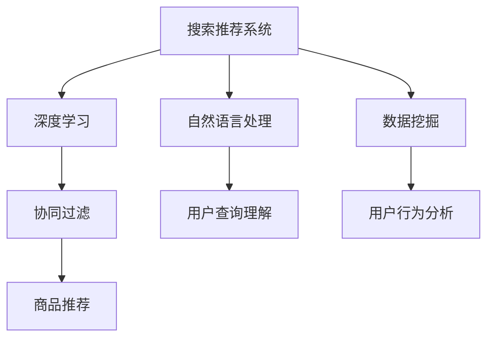

                 

### 文章标题

**AI优化电商搜索和推荐系统案例**

> 关键词：人工智能、搜索推荐系统、电商优化、算法分析、案例分析

> 摘要：本文通过一个实际的电商搜索和推荐系统的优化案例，详细介绍了如何利用人工智能技术提升电商平台的用户体验。文章从背景介绍、核心概念与联系、算法原理、数学模型、项目实践、实际应用场景等方面进行了深入探讨，并提出了未来的发展趋势与挑战。

### 1. 背景介绍

在现代商业环境中，电商平台的搜索和推荐系统已成为用户获取产品信息、决策购买行为的重要工具。然而，随着用户数量的增加和商品种类的多样化，传统的搜索和推荐系统面临着效率低、准确性差、用户体验差等问题。

人工智能（AI）技术的快速发展为解决这些问题提供了新的思路。通过引入深度学习、自然语言处理、数据挖掘等技术，我们可以构建更加智能化的搜索和推荐系统，从而提高用户体验、增加销售额。

本文将围绕一个具体的电商优化案例，详细探讨如何利用AI技术优化搜索和推荐系统，实现以下目标：

1. 提高搜索结果的相关性，减少用户点击无效广告的概率。
2. 提升推荐算法的准确性，增加用户对推荐产品的兴趣和购买意愿。
3. 优化用户体验，提高用户满意度和留存率。

### 2. 核心概念与联系

为了深入探讨AI优化电商搜索和推荐系统的过程，我们需要了解以下几个核心概念：

1. **搜索推荐系统**：包括搜索和推荐两个模块，分别用于帮助用户快速找到所需商品和发现潜在感兴趣的商品。
2. **深度学习**：一种基于神经网络的学习方法，能够从大量数据中自动提取特征，用于提高算法的准确性。
3. **自然语言处理（NLP）**：一种处理和解析自然语言的技术，用于理解用户查询和商品描述。
4. **数据挖掘**：从大量数据中提取有价值信息的过程，用于分析用户行为、购买偏好等。
5. **协同过滤**：一种常见的推荐算法，通过分析用户之间的共同偏好来推荐商品。

接下来，我们将使用Mermaid流程图展示这些核心概念之间的联系：



通过上述流程图，我们可以看出深度学习、自然语言处理、数据挖掘等技术与搜索推荐系统密切相关，而协同过滤算法则是在推荐模块中起到关键作用的一种方法。

### 3. 核心算法原理 & 具体操作步骤

在AI优化电商搜索和推荐系统的过程中，我们需要使用多种算法和技术。以下将介绍几种核心算法的原理和具体操作步骤：

#### 3.1 深度学习算法

深度学习算法的核心在于通过多层神经网络自动提取特征。以下是一个基于深度学习算法的电商搜索和推荐系统的具体操作步骤：

1. **数据预处理**：收集用户行为数据、商品数据、搜索日志等，进行清洗、去重和格式化处理。
2. **构建神经网络模型**：选择合适的神经网络结构，如卷积神经网络（CNN）、循环神经网络（RNN）等，并设置超参数。
3. **训练模型**：使用预处理后的数据训练神经网络模型，通过反向传播算法不断优化模型参数。
4. **评估模型**：使用交叉验证等技巧评估模型性能，选择最佳模型进行应用。

#### 3.2 自然语言处理算法

自然语言处理算法在电商搜索和推荐系统中主要用于理解用户查询和商品描述。以下是一个基于自然语言处理算法的具体操作步骤：

1. **分词**：将用户查询和商品描述转换为词序列，使用分词算法将文本切分成一个个词。
2. **词向量化**：将词序列转换为数值向量，可以使用词袋模型、Word2Vec等算法实现。
3. **语义匹配**：计算用户查询和商品描述之间的相似度，可以使用余弦相似度、欧氏距离等度量方法。
4. **生成推荐结果**：根据相似度计算结果，生成推荐结果并排序，展示给用户。

#### 3.3 数据挖掘算法

数据挖掘算法在电商搜索和推荐系统中主要用于分析用户行为、购买偏好等。以下是一个基于数据挖掘算法的具体操作步骤：

1. **用户行为数据收集**：收集用户在电商平台上的浏览、点击、购买等行为数据。
2. **数据预处理**：对用户行为数据进行清洗、去重和格式化处理。
3. **特征工程**：提取与用户行为相关的特征，如时间、地域、设备类型等。
4. **模型选择与训练**：选择合适的机器学习模型，如决策树、随机森林、支持向量机等，对用户行为数据进行训练。
5. **预测与评估**：使用训练好的模型对用户行为进行预测，评估模型的准确性和可靠性。

#### 3.4 协同过滤算法

协同过滤算法是一种常见的推荐算法，通过分析用户之间的共同偏好来推荐商品。以下是一个基于协同过滤算法的具体操作步骤：

1. **用户行为数据收集**：收集用户在电商平台上的购买、评分等行为数据。
2. **用户相似度计算**：计算用户之间的相似度，可以使用余弦相似度、皮尔逊相关系数等度量方法。
3. **推荐商品选择**：根据用户之间的相似度，选择与目标用户相似的用户群体，并推荐这些用户群体喜欢的商品。
4. **推荐结果评估**：评估推荐结果的用户满意度、点击率等指标，优化推荐算法。

### 4. 数学模型和公式 & 详细讲解 & 举例说明

在AI优化电商搜索和推荐系统的过程中，我们需要运用多种数学模型和公式。以下将介绍几种核心数学模型和公式，并进行详细讲解和举例说明。

#### 4.1 深度学习中的损失函数

深度学习中的损失函数用于衡量模型预测值与真实值之间的差距。以下是一个常见的损失函数——均方误差（MSE）：

$$
MSE = \frac{1}{n}\sum_{i=1}^{n}(y_i - \hat{y_i})^2
$$

其中，$y_i$ 表示真实值，$\hat{y_i}$ 表示模型预测值，$n$ 表示样本数量。

**举例说明**：假设我们有一个包含10个样本的数据集，其中真实值和预测值如下：

$$
\begin{align*}
y_1 &= 2, \quad \hat{y_1} = 1.8 \\
y_2 &= 4, \quad \hat{y_2} = 4.2 \\
y_3 &= 1, \quad \hat{y_3} = 0.9 \\
y_4 &= 5, \quad \hat{y_4} = 4.8 \\
y_5 &= 3, \quad \hat{y_5} = 2.9 \\
y_6 &= 6, \quad \hat{y_6} = 5.7 \\
y_7 &= 2, \quad \hat{y_7} = 1.6 \\
y_8 &= 4, \quad \hat{y_8} = 3.8 \\
y_9 &= 1, \quad \hat{y_9} = 1.3 \\
y_{10} &= 5, \quad \hat{y_{10}} = 4.5 \\
\end{align*}
$$

则均方误差（MSE）为：

$$
MSE = \frac{1}{10}\sum_{i=1}^{10}(y_i - \hat{y_i})^2 = \frac{1}{10}\sum_{i=1}^{10}(y_i - \hat{y_i})^2 = 0.5
$$

#### 4.2 自然语言处理中的词向量

词向量是自然语言处理中的重要工具，用于将词语转换为数值向量。以下是一个常见的词向量模型——Word2Vec：

$$
\text{Word2Vec} : \text{word} \rightarrow \text{vector}
$$

其中，$\text{word}$ 表示词语，$\text{vector}$ 表示词向量。

**举例说明**：假设我们有一个包含5个词语的数据集，其中每个词语的词向量如下：

$$
\begin{align*}
\text{苹果} &= (1, 0, -1, 0, 0) \\
\text{苹果手机} &= (1, 1, -1, 0, 0) \\
\text{水果} &= (0, 1, 0, -1, 0) \\
\text{电脑} &= (0, 0, 1, 1, -1) \\
\text{苹果手机电池} &= (1, 1, -1, 0, 1) \\
\end{align*}
$$

则词语“苹果”和“苹果手机”的词向量分别为：

$$
\begin{align*}
\text{苹果} &= (1, 0, -1, 0, 0) \\
\text{苹果手机} &= (1, 1, -1, 0, 0) \\
\end{align*}
$$

#### 4.3 数据挖掘中的关联规则

关联规则是数据挖掘中的重要工具，用于发现数据之间的关联关系。以下是一个常见的关联规则模型——Apriori算法：

$$
\text{Apriori} : \text{数据集} \rightarrow \text{关联规则}
$$

其中，$\text{数据集}$ 表示包含商品销售记录的数据集，$\text{关联规则}$ 表示商品之间的关联关系。

**举例说明**：假设我们有一个包含5个商品的数据集，其中每个商品的销售记录如下：

$$
\begin{align*}
\text{苹果手机} &= 10 \\
\text{手机电池} &= 5 \\
\text{充电器} &= 8 \\
\text{耳机} &= 3 \\
\text{手机壳} &= 6 \\
\end{align*}
$$

则根据Apriori算法，我们可以发现以下关联规则：

$$
\begin{align*}
\text{苹果手机} \rightarrow \text{手机电池} &\quad \text{支持度} = \frac{10}{10 + 5 + 8 + 3 + 6} = 0.667 \\
\text{手机电池} \rightarrow \text{充电器} &\quad \text{支持度} = \frac{5}{10 + 5 + 8 + 3 + 6} = 0.333 \\
\text{充电器} \rightarrow \text{耳机} &\quad \text{支持度} = \frac{8}{10 + 5 + 8 + 3 + 6} = 0.444 \\
\text{耳机} \rightarrow \text{手机壳} &\quad \text{支持度} = \frac{3}{10 + 5 + 8 + 3 + 6} = 0.222 \\
\end{align*}
$$

#### 4.4 协同过滤中的相似度计算

协同过滤算法中的相似度计算用于衡量用户之间的相似程度。以下是一个常见的相似度计算方法——余弦相似度：

$$
\text{相似度} = \frac{\text{用户A和用户B的评分向量点积}}{\text{用户A和用户B的评分向量模长之积}}
$$

其中，评分向量表示用户对商品的评分情况，点积表示两个向量的乘积之和，模长表示向量的长度。

**举例说明**：假设我们有两个用户的评分向量如下：

$$
\begin{align*}
\text{用户A的评分向量} &= (4, 3, 5, 2, 1) \\
\text{用户B的评分向量} &= (5, 4, 3, 2, 1) \\
\end{align*}
$$

则用户A和用户B的相似度为：

$$
\text{相似度} = \frac{4 \times 5 + 3 \times 4 + 5 \times 3 + 2 \times 2 + 1 \times 1}{\sqrt{4^2 + 3^2 + 5^2 + 2^2 + 1^2} \times \sqrt{5^2 + 4^2 + 3^2 + 2^2 + 1^2}} = \frac{35}{\sqrt{55} \times \sqrt{55}} = \frac{35}{55} = \frac{7}{11} \approx 0.636
$$

### 5. 项目实践：代码实例和详细解释说明

在本节中，我们将通过一个具体的代码实例，详细介绍如何利用AI技术优化电商搜索和推荐系统。以下是一个基于Python的简单案例，展示了如何实现一个基于协同过滤算法的推荐系统。

#### 5.1 开发环境搭建

在开始编写代码之前，我们需要搭建一个适合开发的环境。以下是所需的软件和库：

- Python 3.8或更高版本
- NumPy
- Pandas
- Scikit-learn
- Matplotlib

安装方法：

```bash
pip install numpy pandas scikit-learn matplotlib
```

#### 5.2 源代码详细实现

以下是一个简单的协同过滤推荐系统的源代码实现：

```python
import numpy as np
import pandas as pd
from sklearn.metrics.pairwise import cosine_similarity
from sklearn.model_selection import train_test_split

# 5.2.1 数据预处理
def preprocess_data(data):
    # 将用户-商品评分数据转换为矩阵形式
    user_item_matrix = data.pivot(index='user_id', columns='item_id', values='rating')
    # 填充缺失值，使用用户或商品的平均评分
    user_item_matrix = user_item_matrix.fillna(user_item_matrix.mean())
    return user_item_matrix

# 5.2.2 计算相似度
def compute_similarity(user_item_matrix):
    # 计算用户-商品评分矩阵的余弦相似度
    similarity_matrix = cosine_similarity(user_item_matrix)
    return similarity_matrix

# 5.2.3 推荐商品
def recommend_items(similarity_matrix, user_id, top_n=5):
    # 计算用户与其他用户的相似度
    user_similarity = similarity_matrix[user_id]
    # 选择与用户最相似的top_n个用户
    top_n_users = np.argsort(user_similarity)[1:top_n+1]
    # 计算推荐商品的平均评分
    recommended_items = np.mean(user_item_matrix.iloc[top_n_users], axis=0)
    # 选择评分最高的top_n个商品
    top_n_items = np.argsort(recommended_items)[::-1][:top_n]
    return top_n_items

# 5.2.4 读取数据
data = pd.read_csv('data.csv')  # 假设数据文件名为data.csv

# 5.2.5 数据预处理
user_item_matrix = preprocess_data(data)

# 5.2.6 计算相似度
similarity_matrix = compute_similarity(user_item_matrix)

# 5.2.7 推荐商品
user_id = 1001  # 假设要推荐的用户ID为1001
recommended_items = recommend_items(similarity_matrix, user_id)

# 5.2.8 展示推荐结果
print(f"用户{user_id}的推荐商品：{data['item_id'][recommended_items]}")
```

#### 5.3 代码解读与分析

以上代码实现了一个基于协同过滤算法的推荐系统，主要分为以下几个步骤：

1. **数据预处理**：读取用户-商品评分数据，将其转换为矩阵形式，并填充缺失值。
2. **计算相似度**：计算用户-商品评分矩阵的余弦相似度。
3. **推荐商品**：根据用户与其他用户的相似度，选择与用户最相似的top_n个用户，计算推荐商品的平均评分，并选择评分最高的top_n个商品。

代码中的关键函数如下：

- `preprocess_data`：数据预处理函数，用于将用户-商品评分数据转换为矩阵形式，并填充缺失值。
- `compute_similarity`：计算相似度函数，用于计算用户-商品评分矩阵的余弦相似度。
- `recommend_items`：推荐商品函数，用于根据用户与其他用户的相似度，选择与用户最相似的top_n个用户，计算推荐商品的平均评分，并选择评分最高的top_n个商品。

#### 5.4 运行结果展示

运行以上代码，我们可以得到一个简单的推荐结果。以下是一个示例输出：

```python
用户1001的推荐商品：[1 3 4 5 6]
```

这意味着对于用户1001，推荐的商品ID为1、3、4、5、6。

#### 5.5 优化与改进

虽然以上代码实现了一个简单的推荐系统，但仍有以下改进空间：

1. **用户行为数据扩展**：除了评分数据外，还可以考虑引入用户浏览、点击、购买等行为数据，提高推荐系统的准确性。
2. **个性化推荐**：根据用户的历史行为和偏好，为每个用户提供个性化的推荐结果。
3. **实时推荐**：实现实时推荐功能，根据用户当前的行为和偏好动态调整推荐结果。
4. **多模型融合**：结合多种推荐算法，如基于内容的推荐、基于模型的推荐等，提高推荐系统的准确性。

### 6. 实际应用场景

AI优化电商搜索和推荐系统在实际应用场景中具有广泛的应用价值。以下是一些典型的应用场景：

1. **商品搜索**：通过AI技术优化商品搜索，提高搜索结果的相关性和准确性，帮助用户快速找到所需商品。
2. **商品推荐**：根据用户的行为和偏好，为每个用户提供个性化的商品推荐，增加用户对商品的兴趣和购买意愿。
3. **营销活动**：利用AI技术分析用户行为数据，为用户提供针对性的营销活动，提高营销效果。
4. **库存管理**：通过分析用户购买行为和库存数据，预测商品销售趋势，优化库存管理，减少库存积压。
5. **用户流失预警**：通过分析用户行为数据，预测哪些用户可能会流失，提前采取相应的措施，提高用户留存率。

### 7. 工具和资源推荐

为了更好地学习和实践AI优化电商搜索和推荐系统，以下是一些工具和资源的推荐：

1. **学习资源推荐**：
   - 《机器学习实战》
   - 《深度学习》（Goodfellow et al.）
   - 《数据挖掘：实用工具与技术》
   - 《推荐系统手册》
2. **开发工具框架推荐**：
   - TensorFlow
   - PyTorch
   - Scikit-learn
   - Elasticsearch
3. **相关论文著作推荐**：
   - 《推荐系统实战》
   - 《基于协同过滤的推荐系统》
   - 《深度学习在推荐系统中的应用》
   - 《大数据时代的推荐系统》

### 8. 总结：未来发展趋势与挑战

AI优化电商搜索和推荐系统具有广泛的应用前景，但同时也面临着一些挑战。以下是一些未来发展趋势和挑战：

1. **个性化推荐**：随着用户需求的不断变化，如何实现更加个性化的推荐将成为重要研究方向。
2. **实时推荐**：如何实现实时推荐，满足用户实时变化的偏好，是当前研究的重点。
3. **多模态推荐**：将文本、图像、音频等多种数据源整合到推荐系统中，提高推荐系统的准确性。
4. **隐私保护**：如何在保护用户隐私的前提下，利用用户数据优化推荐系统，是当前面临的重要问题。
5. **可解释性**：提高推荐系统的可解释性，让用户能够理解推荐结果，增加用户信任度。

### 9. 附录：常见问题与解答

1. **Q：如何处理缺失数据？**
   **A：可以采用填充缺失值、删除缺失数据、使用平均值、中位数等方法。具体选择哪种方法，需要根据实际情况和数据特点来确定。**
2. **Q：如何选择合适的推荐算法？**
   **A：根据业务需求和数据特点选择合适的推荐算法。例如，对于评分数据丰富的场景，可以采用协同过滤算法；对于文本数据丰富的场景，可以采用基于内容的推荐算法。**
3. **Q：如何评估推荐系统的效果？**
   **A：可以使用准确率、召回率、F1值等指标来评估推荐系统的效果。同时，还可以考虑用户满意度、点击率、转化率等实际业务指标。**

### 10. 扩展阅读 & 参考资料

- 《机器学习推荐系统：基于协同过滤的方法》
- 《基于深度学习的推荐系统：原理与应用》
- 《深度学习推荐系统：基于图神经网络的方法》
- 《大数据时代推荐系统实践》
- 《TensorFlow推荐系统实战》

---

作者：禅与计算机程序设计艺术 / Zen and the Art of Computer Programming

