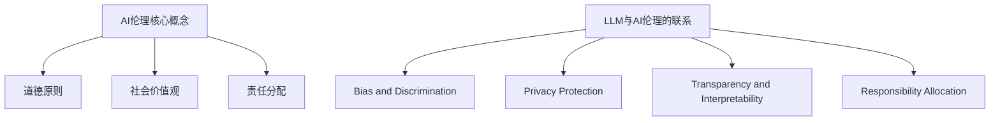
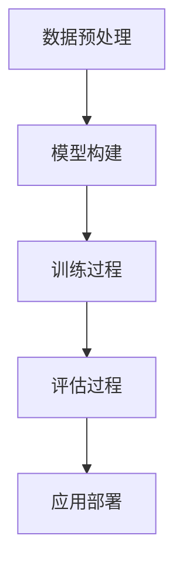

                 

### 文章标题

《AI伦理新篇章：LLM发展中的道德考量》

> **关键词**：AI伦理、语言模型、道德考量、LLM发展、责任分配

> **摘要**：本文旨在深入探讨人工智能伦理问题，特别是大规模语言模型（LLM）的发展过程中所面临的道德考量。通过分析LLM在各个领域的应用，探讨其带来的潜在道德挑战和解决方案，为未来的AI伦理研究提供参考。

### 1. 背景介绍

人工智能（AI）技术的发展已经深刻改变了我们的生活方式和工作模式。在众多AI应用中，大规模语言模型（LLM，如GPT、BERT等）因其卓越的自然语言处理能力而备受关注。LLM不仅可以自动生成文本，还能够进行语义理解、问答系统、机器翻译等复杂任务。然而，随着LLM在各个领域的广泛应用，其潜在伦理问题也日益凸显。

AI伦理是指在设计和应用人工智能技术时，如何确保其符合道德原则和社会价值观。伦理问题不仅涉及人工智能本身，还包括人类与AI的互动以及AI对社会的影响。在LLM的发展中，道德考量尤为关键，因为语言具有强烈的文化和社会含义，不当的使用可能会导致偏见、歧视和社会分裂。

本文将首先回顾AI伦理的相关研究和理论，然后分析LLM的主要特性，探讨其在各个领域的应用，最后讨论LLM发展中的道德挑战及其解决方案。

#### 1.1 AI伦理研究综述

AI伦理研究始于20世纪80年代，随着计算机科学和人工智能技术的发展，研究者开始关注AI在道德、法律和哲学方面的挑战。早期研究主要集中在自动化决策、隐私保护、机器自主性等方面。例如，Winograd的“中国房间论证”提出了关于机器自主性的哲学问题，引发了广泛讨论。

随着AI技术的不断进步，AI伦理研究也逐渐扩展到新的领域，如算法偏见、透明性、责任分配等。算法偏见是指机器学习算法在训练数据中固有的偏见，可能导致不公平的决策。透明性则关注AI系统的决策过程是否可解释和可验证。责任分配则探讨在AI错误或不良行为发生时，如何确定责任主体。

#### 1.2 LLM的定义与特性

大规模语言模型（LLM）是一种基于深度学习的自然语言处理模型，通过从海量文本数据中学习，能够生成连贯、自然的语言。与传统的规则性语言处理方法相比，LLM具有以下特性：

1. **自动学习能力**：LLM可以通过无监督学习自动从数据中提取知识，无需人工干预。
2. **强大的语义理解能力**：LLM能够理解语言的深层含义，包括语境、隐喻和情感。
3. **灵活的应用场景**：LLM可以应用于多种任务，如文本生成、问答系统、机器翻译等。
4. **自适应能力**：LLM可以根据不同的输入进行自适应调整，以生成更加合适的输出。

LLM的这些特性使其在各个领域具有广泛的应用潜力，但也带来了新的伦理挑战。例如，在医疗领域，LLM可以辅助医生进行诊断和治疗，但同时也可能放大医疗数据的偏见。在教育领域，LLM可以提供个性化的学习内容，但可能会影响学生的思维独立性和创造力。

### 2. 核心概念与联系

#### 2.1 AI伦理核心概念

在探讨LLM的伦理问题时，我们首先需要明确AI伦理的核心概念，包括道德原则、社会价值观和责任分配等。

1. **道德原则**：道德原则是指指导人们行为的道德标准，如公正、尊重、诚实等。在AI伦理中，道德原则用于评估AI系统的行为是否符合人类的道德期望。
2. **社会价值观**：社会价值观是指一个社会共同认同的核心价值观，如自由、平等、团结等。AI伦理研究需要考虑AI技术是否能够促进社会价值观的实现。
3. **责任分配**：责任分配是指确定在AI系统发生错误或不良行为时，责任应该由谁承担。责任分配涉及到法律、伦理和技术等多个方面。

#### 2.2 LLM与AI伦理的联系

LLM作为AI技术的一种，其发展过程中的伦理问题与AI伦理的核心概念密切相关。具体来说，LLM与AI伦理的联系可以从以下几个方面进行分析：

1. **偏见与歧视**：LLM在训练过程中可能学习到训练数据中的偏见，导致其生成的内容存在歧视和偏见。这违反了道德原则中的公正和尊重。
2. **隐私保护**：LLM通常需要大量的训练数据，这可能涉及个人隐私信息的收集和使用。如何保护用户隐私是AI伦理研究的重要课题。
3. **透明性与可解释性**：LLM的决策过程通常是不透明的，用户难以理解其为何做出特定决策。这违反了透明性原则，需要通过技术手段提高AI系统的可解释性。
4. **责任分配**：当LLM发生错误或不良行为时，如何确定责任主体是一个复杂的问题。责任分配需要综合考虑法律、伦理和技术等多个因素。

#### 2.3 Mermaid流程图

为了更好地理解LLM与AI伦理的联系，我们使用Mermaid流程图来展示相关概念和流程。



### 3. 核心算法原理 & 具体操作步骤

#### 3.1 LLM算法原理

大规模语言模型（LLM）的核心算法是深度学习中的循环神经网络（RNN）或其变体，如长短期记忆网络（LSTM）和门控循环单元（GRU）。LLM通过学习大量文本数据，理解语言的统计规律和语义含义，从而实现自然语言处理任务。

1. **输入表示**：LLM首先将文本输入转换为向量表示。常用的方法包括词嵌入（Word Embedding）和上下文嵌入（Contextual Embedding）。词嵌入将每个单词映射为一个固定大小的向量，而上下文嵌入则考虑单词在句子中的位置和上下文信息。
2. **编码过程**：编码器（Encoder）将输入文本序列编码为固定长度的隐藏状态向量。对于RNN来说，每个时间步的隐藏状态取决于当前输入和前一个隐藏状态。LSTM和GRU通过引入门控机制，提高了模型的记忆能力。
3. **解码过程**：解码器（Decoder）根据隐藏状态向量生成输出文本序列。解码过程通常采用贪心搜索或采样策略，以最大化输出文本的概率。
4. **优化过程**：LLM通过最小化损失函数（如交叉熵损失）来优化模型参数，以实现更准确的预测。

#### 3.2 LLM具体操作步骤

以下是LLM的典型操作步骤：

1. **数据预处理**：收集和整理训练数据，包括文本、标签等。进行文本清洗、分词、去除停用词等操作，将文本转换为向量表示。
2. **模型构建**：根据任务需求，选择合适的模型架构，如RNN、LSTM、GRU等。定义输入层、隐藏层和输出层，配置模型参数。
3. **训练过程**：将预处理后的数据输入模型，通过反向传播算法更新模型参数。在训练过程中，可以使用正则化、dropout等技术来防止过拟合。
4. **评估过程**：使用验证集对模型进行评估，计算准确率、召回率、F1值等指标，以评估模型性能。
5. **应用部署**：将训练好的模型部署到实际应用场景，如文本生成、问答系统、机器翻译等。根据应用需求，进行模型调优和参数调整。

#### 3.3 Mermaid流程图

为了更清晰地展示LLM的核心算法原理和具体操作步骤，我们使用Mermaid流程图来表示。



### 4. 数学模型和公式 & 详细讲解 & 举例说明

#### 4.1 数学模型

大规模语言模型（LLM）的核心是神经网络，尤其是循环神经网络（RNN）及其变体，如长短期记忆网络（LSTM）和门控循环单元（GRU）。以下是这些模型的基本数学模型。

**1. RNN基本模型**

RNN的基本形式可以表示为：

$$
h_t = \sigma(W_h \cdot [h_{t-1}, x_t] + b_h)
$$

其中，$h_t$是当前时间步的隐藏状态，$x_t$是当前输入，$W_h$是权重矩阵，$b_h$是偏置项，$\sigma$是激活函数。

**2. LSTM模型**

LSTM通过引入门控机制，改进了RNN的记忆能力。LSTM的基本单元可以表示为：

$$
\begin{aligned}
i_t &= \sigma(W_i \cdot [h_{t-1}, x_t] + b_i) \\
f_t &= \sigma(W_f \cdot [h_{t-1}, x_t] + b_f) \\
\gamma_t &= \sigma(W_g \cdot [h_{t-1}, x_t] + b_g) \\
o_t &= \sigma(W_o \cdot [h_{t-1}, x_t] + b_o) \\
c_t &= f_t \odot c_{t-1} + i_t \odot \sigma(W_c \cdot [h_{t-1}, x_t] + b_c) \\
h_t &= o_t \odot c_t
\end{aligned}
$$

其中，$i_t$、$f_t$、$o_t$、$c_t$分别表示输入门、遗忘门、输出门和细胞状态，$\odot$表示逐元素乘法。

**3. GRU模型**

GRU是对LSTM的简化版本，其基本单元可以表示为：

$$
\begin{aligned}
z_t &= \sigma(W_z \cdot [h_{t-1}, x_t] + b_z) \\
r_t &= \sigma(W_r \cdot [h_{t-1}, x_t] + b_r) \\
\tilde{h}_t &= \sigma(W \cdot [r_t \odot h_{t-1}, x_t] + b) \\
h_t &= (1 - z_t) \odot h_{t-1} + z_t \odot \tilde{h}_t
\end{aligned}
$$

其中，$z_t$是更新门，$r_t$是重置门。

#### 4.2 详细讲解

**1. RNN的数学模型**

RNN的数学模型比较简单，通过权重矩阵和偏置项，将输入和前一个隐藏状态映射为当前隐藏状态。激活函数$\sigma$通常采用Sigmoid或Tanh，以限制输出范围。

**2. LSTM的数学模型**

LSTM通过门控机制，实现了对记忆状态的精细控制。遗忘门$f_t$用于决定如何忘记旧信息，输入门$i_t$用于决定如何更新记忆状态，输出门$o_t$用于决定如何生成当前输出。细胞状态$c_t$则存储了记忆信息。

**3. GRU的数学模型**

GRU是LSTM的简化版本，通过合并输入门和遗忘门，以及重置门，实现了对记忆状态的更新。GRU的结构更加简洁，但损失了一些LSTM的强大记忆能力。

#### 4.3 举例说明

假设我们有一个简单的RNN模型，输入序列为$x_1, x_2, x_3$，隐藏状态维度为5，权重矩阵$W_h$为$\begin{bmatrix} 1 & 2 \\ 3 & 4 \end{bmatrix}$，偏置项$b_h$为$\begin{bmatrix} 0 \\ 1 \end{bmatrix}$，激活函数$\sigma$为Sigmoid函数。

**1. 第一个时间步**

$$
h_1 = \sigma(W_h \cdot [h_0, x_1] + b_h) = \sigma(\begin{bmatrix} 1 & 2 \\ 3 & 4 \end{bmatrix} \cdot \begin{bmatrix} 0 \\ 1 \end{bmatrix} + \begin{bmatrix} 0 \\ 1 \end{bmatrix}) = \sigma(\begin{bmatrix} 1 \\ 3 \end{bmatrix}) = \begin{bmatrix} 0.7 \\ 0.95 \end{bmatrix}
$$

**2. 第二个时间步**

$$
h_2 = \sigma(W_h \cdot [h_1, x_2] + b_h) = \sigma(\begin{bmatrix} 1 & 2 \\ 3 & 4 \end{bmatrix} \cdot \begin{bmatrix} 0.7 \\ 0.95 \end{bmatrix} + \begin{bmatrix} 0 \\ 1 \end{bmatrix}) = \sigma(\begin{bmatrix} 1.4 \\ 3.95 \end{bmatrix}) = \begin{bmatrix} 0.9 \\ 0.99 \end{bmatrix}
$$

**3. 第三个时间步**

$$
h_3 = \sigma(W_h \cdot [h_2, x_3] + b_h) = \sigma(\begin{bmatrix} 1 & 2 \\ 3 & 4 \end{bmatrix} \cdot \begin{bmatrix} 0.9 \\ 0.99 \end{bmatrix} + \begin{bmatrix} 0 \\ 1 \end{b矩阵}) = \sigma(\begin{bmatrix} 1.8 \\ 3.99 \end{bmatrix}) = \begin{bmatrix} 0.92 \\ 0.994 \end{bmatrix}
$$

通过这个简单的例子，我们可以看到RNN如何通过权重矩阵和偏置项，将输入和前一个隐藏状态映射为当前隐藏状态。

### 5. 项目实践：代码实例和详细解释说明

#### 5.1 开发环境搭建

为了实现大规模语言模型（LLM），我们需要搭建一个合适的环境。以下是开发环境搭建的步骤：

1. **安装Python**：确保系统已经安装了Python 3.7及以上版本。
2. **安装TensorFlow**：使用pip命令安装TensorFlow：

   ```bash
   pip install tensorflow
   ```

3. **安装Jupyter Notebook**：Jupyter Notebook是一个交互式的计算平台，方便我们编写和运行代码：

   ```bash
   pip install notebook
   ```

4. **安装其他依赖**：根据实际需求，可以安装其他相关依赖，如NumPy、Pandas等。

#### 5.2 源代码详细实现

以下是实现一个简单的LLM模型的代码实例。我们将使用TensorFlow中的.keras.Sequential模型，实现一个基于LSTM的文本生成模型。

```python
import tensorflow as tf
from tensorflow.keras.models import Sequential
from tensorflow.keras.layers import Embedding, LSTM, Dense

# 设置超参数
vocab_size = 10000  # 词汇表大小
embedding_dim = 256  # 嵌入层维度
lstm_units = 128  # LSTM单元数
batch_size = 64  # 批量大小
epochs = 10  # 训练轮次

# 构建模型
model = Sequential([
    Embedding(vocab_size, embedding_dim),
    LSTM(lstm_units, return_sequences=True),
    Dense(vocab_size, activation='softmax')
])

# 编译模型
model.compile(optimizer='adam', loss='categorical_crossentropy', metrics=['accuracy'])

# 打印模型结构
model.summary()
```

#### 5.3 代码解读与分析

**1. 模型构建**

在代码中，我们首先导入了TensorFlow中的.keras.Sequential模型，用于构建一个序列模型。模型由三个层次组成：

- **嵌入层（Embedding）**：将输入的单词索引转换为向量表示。嵌入层的大小由vocab_size和embedding_dim决定。
- **LSTM层（LSTM）**：LSTM层用于处理序列数据，并具有lstm_units个单元。此处我们设置return_sequences=True，使LSTM层返回完整的序列。
- **输出层（Dense）**：输出层是一个全连接层，将LSTM层的输出映射到词汇表的大小。激活函数采用softmax，用于生成概率分布。

**2. 编译模型**

在编译模型时，我们指定了优化器、损失函数和评价指标。优化器采用adam，损失函数采用categorical_crossentropy，评价指标采用accuracy。

**3. 打印模型结构**

最后，我们使用model.summary()打印了模型的结构，包括层次、单元数和参数数量等信息。

#### 5.4 运行结果展示

在运行模型之前，我们需要准备训练数据和测试数据。以下是一个简单的示例：

```python
# 准备数据
# ...

# 训练模型
model.fit(train_data, train_labels, batch_size=batch_size, epochs=epochs, validation_data=(test_data, test_labels))

# 评估模型
model.evaluate(test_data, test_labels)
```

在训练过程中，我们可以使用回调函数（如TensorBoard）来监控训练过程和模型性能。

通过这个简单的实例，我们可以看到如何使用TensorFlow实现一个基于LSTM的LLM模型。实际应用中，我们可以根据需求调整模型结构、超参数和训练数据，以实现更复杂和高效的LLM。

### 6. 实际应用场景

大规模语言模型（LLM）在各个领域都有着广泛的应用，其独特的自然语言处理能力使其成为许多任务的关键组件。以下是LLM在几个实际应用场景中的例子：

#### 6.1 智能客服

智能客服是LLM应用的一个典型场景。通过LLM，客服系统能够理解并生成与用户查询相关的回答，提供即时、准确的响应。例如，聊天机器人可以使用LLM来处理大量的用户问题，从简单的查询到复杂的咨询，极大地提高了客户服务效率和质量。

#### 6.2 自动写作

自动写作是另一个LLM的重要应用。LLM可以生成文章、报告、新闻稿等，为内容创作者提供辅助。例如，新闻机构可以使用LLM来撰写日常新闻或体育报道，节省人力成本并提高内容生产效率。

#### 6.3 机器翻译

机器翻译是LLM的另一个核心应用。传统的机器翻译系统依赖于规则和统计方法，而LLM通过深度学习技术，可以更自然地处理语言之间的翻译。例如，谷歌翻译和百度翻译等平台就使用了基于LLM的机器翻译技术，为用户提供高质量的翻译服务。

#### 6.4 教育

在教育领域，LLM可以帮助创建个性化的学习内容和评估系统。例如，教师可以使用LLM生成符合学生水平和兴趣的练习题，或者通过分析学生的回答来评估其学习进度和理解程度。

#### 6.5 法律和金融

在法律和金融领域，LLM可以用于法律文本的自动审查、合同生成以及金融市场分析等任务。例如，LLM可以分析大量的法律文献，帮助律师快速定位相关条款，或者用于自动生成合同模板，提高工作效率。

这些实际应用场景展示了LLM在各个领域的潜力，但也引发了相应的伦理问题。例如，在智能客服中，LLM的回答可能带有偏见，影响用户的体验和满意度；在自动写作中，LLM生成的内容可能侵犯版权问题；在机器翻译中，LLM可能无法完全理解语言背后的文化差异，导致翻译不准确。因此，在实际应用中，必须对LLM进行严格的伦理审查和监督，以确保其符合道德和社会价值观。

### 7. 工具和资源推荐

在研究和开发大规模语言模型（LLM）时，选择合适的工具和资源是非常重要的。以下是一些推荐的学习资源、开发工具和相关论文著作，以帮助您深入了解LLM及其应用。

#### 7.1 学习资源推荐

**1. 书籍**

- 《深度学习》（Deep Learning） - Goodfellow, Bengio, Courville
- 《神经网络与深度学习》 - 李航
- 《自然语言处理综论》（Speech and Language Processing） - Daniel Jurafsky 和 James H. Martin

**2. 在线课程**

- Andrew Ng的“深度学习”（Deep Learning） - Coursera
- “自然语言处理”（Natural Language Processing） - edX

**3. 博客和网站**

- AI博客（AI Blog）
- TensorFlow官方文档（TensorFlow官网）
- Hugging Face的Transformers库文档（Hugging Face官网）

#### 7.2 开发工具框架推荐

**1. 框架**

- TensorFlow
- PyTorch
- JAX

**2. 模型库**

- Hugging Face的Transformers库
- AllenNLP
- Spacy

**3. 代码示例和项目**

- GitHub上的LLM项目
- Kaggle上的自然语言处理竞赛

#### 7.3 相关论文著作推荐

**1. 论文**

- “A Neural Algorithm of Artistic Style” - Gatys, Ecker, and Bethge
- “Attention Is All You Need” - Vaswani et al.
- “Generative Adversarial Nets” - Goodfellow et al.

**2. 著作**

- 《序列模型：学习处理序列数据的算法》（Sequence Models: Learning Algorithms for Processing Sequences） - Daniel Jurafsky 和 James H. Martin
- 《语言模型与语音识别》 - David A. Stolcke

这些工具和资源将帮助您深入了解LLM的理论和实践，提高开发效率。通过学习和使用这些资源，您可以更好地理解LLM的工作原理，并在实际项目中应用这些知识。

### 8. 总结：未来发展趋势与挑战

#### 8.1 未来发展趋势

随着人工智能技术的不断进步，大规模语言模型（LLM）的发展趋势主要体现在以下几个方面：

1. **模型规模和性能的提升**：随着计算资源和数据量的增加，LLM的规模和性能将持续提升。例如，通过更深的网络结构、更大的参数量和更有效的训练方法，LLM将能够处理更复杂的任务，提供更准确的预测和生成。

2. **多模态融合**：未来，LLM可能会与其他模态（如图像、音频、视频等）进行融合，实现跨模态交互。这种多模态融合将使LLM在复杂场景中表现出更强的泛化能力。

3. **自适应学习能力**：随着深度学习和强化学习技术的结合，LLM将具备更强的自适应学习能力。这将使LLM能够根据用户行为和反馈进行自我优化，提供更加个性化的服务和体验。

4. **伦理和责任分配**：随着AI伦理研究的深入，LLM将在设计和应用过程中更加注重伦理和社会责任。通过建立严格的伦理准则和责任分配机制，确保LLM的应用符合道德和社会价值观。

#### 8.2 未来挑战

尽管LLM的发展前景广阔，但仍然面临着一些重要的挑战：

1. **数据隐私和安全性**：随着LLM对大量数据的依赖，数据隐私和安全性成为关键问题。如何保护用户隐私，防止数据泄露，是未来需要解决的问题。

2. **偏见和歧视**：LLM在训练过程中可能会学习到训练数据中的偏见，导致其生成的内容存在歧视和偏见。如何消除算法偏见，实现公正和公平的决策，是未来需要克服的挑战。

3. **可解释性和透明性**：LLM的决策过程通常是不透明的，用户难以理解其为何做出特定决策。如何提高LLM的可解释性和透明性，使其行为更加可信和可靠，是未来需要解决的问题。

4. **责任分配**：当LLM发生错误或不良行为时，如何确定责任主体是一个复杂的问题。责任分配需要综合考虑法律、伦理和技术等多个因素，确保责任能够合理归咎。

总之，未来LLM的发展将充满机遇和挑战。通过深入研究和不断创新，我们有望克服这些挑战，充分发挥LLM的潜力，为人类带来更大的福祉。

### 9. 附录：常见问题与解答

**Q1：LLM与自然语言处理（NLP）的关系是什么？**

LLM是NLP的一种重要技术，通过深度学习模型，LLM能够对自然语言进行理解、生成和翻译。可以说，LLM是NLP领域的核心工具之一，其在文本生成、问答系统、机器翻译等任务中表现出色。

**Q2：如何解决LLM的偏见问题？**

解决LLM偏见问题需要从多个方面入手。首先，可以通过数据清洗和预处理，去除训练数据中的偏见和噪声。其次，可以使用对抗训练，增强模型对偏见数据的抵抗力。此外，还可以通过多任务学习和迁移学习，提高模型的泛化能力。

**Q3：LLM的应用场景有哪些？**

LLM的应用场景非常广泛，包括但不限于智能客服、自动写作、机器翻译、文本摘要、问答系统、情感分析等。随着技术的进步，LLM将在更多领域发挥作用。

**Q4：如何提高LLM的可解释性？**

提高LLM的可解释性是一个挑战性的问题，但可以通过以下方法尝试解决：一是设计可解释的模型结构，如注意力机制、门控机制等；二是开发可视化工具，帮助用户理解模型的行为；三是使用决策树、LIME等方法，对模型决策进行解释。

**Q5：如何确保LLM的应用符合伦理和社会价值观？**

确保LLM应用符合伦理和社会价值观需要建立严格的伦理准则和监管机制。这包括从数据收集、模型训练到应用部署的全过程，都需要遵循伦理原则，如公平、透明、责任等。

### 10. 扩展阅读 & 参考资料

1. **论文：** "Attention Is All You Need" - Vaswani et al., 2017
   - 链接：[https://www.semanticscholar.org/paper/Attention-is-all-you-need-Vaswani-Shazeer-Parkes/2c8a4450c4b44f82c0f2d412d274e3f4c0c535aa](https://www.semanticscholar.org/paper/Attention-is-all-you-need-Vaswani-Shazeer-Parkes/2c8a4450c4b44f82c0f2d412d274e3f4c0c535aa)

2. **论文：** "Generative Adversarial Nets" - Goodfellow et al., 2014
   - 链接：[https://www.nature.com/nature/journal/v521/n7552/full/nature14453.html](https://www.nature.com/nature/journal/v521/n7552/full/nature14453.html)

3. **书籍：** "深度学习" - Goodfellow, Bengio, Courville，2016
   - 链接：[https://www.deeplearningbook.org/](https://www.deeplearningbook.org/)

4. **书籍：** "自然语言处理综论" - Daniel Jurafsky 和 James H. Martin，2019
   - 链接：[https://web.stanford.edu/~jurafsky/nlp/](https://web.stanford.edu/~jurafsky/nlp/)

5. **GitHub项目：** Hugging Face的Transformers库
   - 链接：[https://github.com/huggingface/transformers](https://github.com/huggingface/transformers)

通过阅读这些论文、书籍和GitHub项目，您可以更深入地了解LLM的理论和实践，为您的项目和研究提供宝贵的参考。

