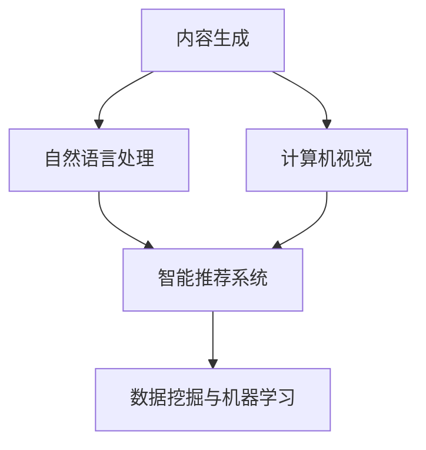
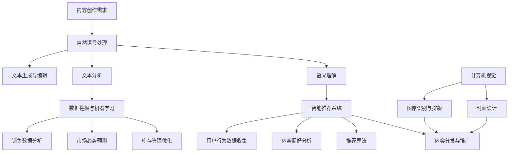

                 

### 1. 背景介绍

人工智能（AI）的迅速发展，改变了各行各业的面貌，包括出版业。在传统出版业中，内容的生产、编辑、排版、印刷和分发是一个漫长且昂贵的流程。随着AI技术的引入，这一流程得到了显著的优化和革新。本文旨在探讨AI在出版业中的应用，特别是如何通过降本增效和场景创新来推动出版业的发展。

出版业面临的主要挑战之一是内容生产的成本。从作家创作到最终成书，每一步都需要大量的人力和时间。此外，随着读者需求的多样化，出版商需要迅速响应市场变化，这进一步增加了运营成本。AI技术可以通过自动化和智能化来解决这个问题。例如，自然语言处理（NLP）技术可以帮助自动生成和编辑内容，图像识别技术可以用于排版和设计，从而大大降低人力成本。

另一个挑战是出版物的分发和推广。传统上，出版商需要通过实体书店和分销渠道来推广书籍，这不仅耗时耗力，而且受地域限制。而AI可以帮助出版商利用社交媒体、在线平台等数字渠道进行精准营销，提高书籍的曝光率和销售量。

然而，AI在出版业的应用也带来了一些潜在的挑战。首先是数据隐私和安全问题。出版业涉及大量的敏感数据，如作者信息、读者阅读习惯等。如何确保这些数据的安全，是出版商需要考虑的重要问题。

其次是技术标准和互操作性问题。不同的AI系统之间如何高效地协同工作，如何确保数据在不同系统之间的无缝传输，这些都是需要解决的问题。

总的来说，AI技术在出版业中的应用具有巨大的潜力，但也面临诸多挑战。本文将深入探讨这些挑战，并探讨如何通过技术手段和创新思维来解决这些问题。

### 2. 核心概念与联系

为了深入理解AI在出版业中的应用，我们首先需要了解几个核心概念和它们之间的相互关系。

#### 2.1 自然语言处理（NLP）

自然语言处理是AI的一个重要分支，主要研究如何让计算机理解和生成人类语言。在出版业中，NLP技术可以用于内容生成、编辑和翻译。例如，AI可以自动生成新闻文章、书籍摘要甚至整本书籍，从而大幅减少人工编辑的工作量。

#### 2.2 计算机视觉

计算机视觉是AI的另一个重要分支，它使计算机能够从图像或视频中识别和提取信息。在出版业中，计算机视觉可以用于书籍的排版和设计。例如，AI可以自动识别图片并调整其位置和大小，从而提高书籍的美观度和可读性。

#### 2.3 智能推荐系统

智能推荐系统是一种基于用户行为和兴趣的数据分析技术，它可以向用户推荐他们可能感兴趣的内容。在出版业中，智能推荐系统可以帮助出版商更好地理解用户需求，从而优化内容生产和推广策略。

#### 2.4 数据挖掘与机器学习

数据挖掘和机器学习是AI的核心技术，它们可以帮助出版商从大量数据中提取有价值的信息。例如，通过分析销售数据，出版商可以了解哪些类型的书籍更受欢迎，从而调整库存和采购策略。

#### 2.5 Mermaid 流程图

为了更好地展示这些概念之间的联系，我们可以使用Mermaid流程图来描述它们在出版业中的应用。



在这个流程图中，我们可以看到，自然语言处理和计算机视觉是内容生成和排版的关键技术，而智能推荐系统和数据挖掘与机器学习则用于分析用户行为和市场趋势，从而优化出版策略。

通过这些核心概念和技术的相互协作，AI为出版业带来了巨大的变革潜力。接下来，我们将进一步探讨这些技术的具体原理和操作步骤。

#### 2.6 核心概念原理与架构 Mermaid 流程图

为了更好地展示AI在出版业中各核心概念和技术的原理及其架构关系，我们可以绘制一个详细的Mermaid流程图。该图将包括自然语言处理（NLP）、计算机视觉（CV）、智能推荐系统（SRS）以及数据挖掘与机器学习（DM&ML）的关键步骤和交互。



在上述流程图中：

- **A（内容创作需求）**：为整个流程的起点，定义了内容创作的需求。
- **B（自然语言处理）**：涵盖文本生成、编辑、分析和语义理解等步骤，为内容生成提供支持。
- **C（文本生成与编辑）**：利用NLP技术生成或编辑文本内容。
- **D（文本分析）**：对文本进行深入分析，提取关键信息。
- **E（语义理解）**：理解文本的语义含义，为推荐和内容优化提供基础。
- **F（计算机视觉）**：处理图像识别和封面设计，提高内容的美观度和吸引力。
- **G（图像识别与排版）**：自动识别图像并优化排版布局。
- **H（封面设计）**：设计吸引人的书籍封面。
- **I（智能推荐系统）**：基于用户行为和内容偏好进行推荐。
- **J（用户行为数据收集）**：收集用户在阅读和购买中的行为数据。
- **K（内容偏好分析）**：分析用户的内容偏好。
- **L（推荐算法）**：实现个性化内容推荐。
- **M（内容分发与推广）**：将内容推送给用户，增加曝光率和销售量。
- **N（数据挖掘与机器学习）**：从大量数据中挖掘有价值的信息，支持销售和市场分析。
- **O（销售数据分析）**：分析销售数据，优化库存和采购策略。
- **P（市场趋势预测）**：预测市场趋势，指导内容创作和推广。
- **Q（库存管理优化）**：通过数据分析优化库存管理，减少库存风险。

这个Mermaid流程图清晰地展示了AI在出版业中的应用架构，以及各核心概念和技术之间的相互作用。通过这种结构化的展示，我们可以更好地理解AI技术如何协同工作，为出版业带来创新和变革。

### 3. 核心算法原理 & 具体操作步骤

在了解了AI在出版业中的应用概念和流程后，我们将深入探讨其中的核心算法原理和具体操作步骤，以帮助读者更好地理解AI如何在实际场景中发挥作用。

#### 3.1 自然语言处理（NLP）

自然语言处理是AI在出版业中最常用的技术之一。它的核心任务包括文本生成、文本编辑、文本分析和语义理解。

**3.1.1 文本生成**

文本生成算法，如生成对抗网络（GAN）和变压器（Transformer），可以通过学习大量的文本数据生成新的文本内容。以下是文本生成的基本步骤：

1. **数据准备**：收集大量的文本数据，如书籍、新闻文章等。
2. **预处理**：对文本数据进行清洗和格式化，如去除标点符号、停用词处理等。
3. **编码**：将文本转换为向量表示，常用的编码方法包括Word2Vec、BERT等。
4. **生成**：利用GAN或Transformer模型生成新的文本。

**3.1.2 文本编辑**

文本编辑算法，如序列到序列（Seq2Seq）模型，可以对文本内容进行自动编辑和改进。以下是文本编辑的基本步骤：

1. **数据准备**：收集需要编辑的文本数据。
2. **编码**：将源文本和目标文本编码为向量。
3. **解码**：利用Seq2Seq模型生成编辑后的文本。

**3.1.3 文本分析**

文本分析算法，如词频统计、主题建模（如LDA）和情感分析，可以帮助出版商理解用户需求和市场趋势。以下是文本分析的基本步骤：

1. **数据准备**：收集需要分析的文本数据。
2. **特征提取**：提取文本的关键特征，如词频、词性等。
3. **分析**：利用统计模型或机器学习算法对文本进行深入分析。

**3.1.4 语义理解**

语义理解算法，如语义角色标注、语义关系抽取和问答系统，可以帮助AI理解文本的深层含义。以下是语义理解的基本步骤：

1. **数据准备**：收集带有语义标注的数据。
2. **模型训练**：利用深度学习模型对语义信息进行训练。
3. **推理**：对新的文本输入进行语义理解和推理。

#### 3.2 计算机视觉（CV）

计算机视觉技术在出版业中的应用，主要集中在图像识别、图像处理和图像生成等方面。

**3.2.1 图像识别与排版**

图像识别算法，如卷积神经网络（CNN），可以自动识别图像中的元素，并调整其位置和大小。以下是图像识别和排版的基本步骤：

1. **数据准备**：收集大量的图像数据，如书籍封面、插图等。
2. **模型训练**：利用CNN模型对图像进行识别和分类。
3. **应用**：将识别结果应用于排版和设计。

**3.2.2 封面设计**

封面设计是一个复杂的过程，涉及颜色搭配、字体选择和布局设计。计算机视觉算法可以自动生成封面设计，以下是封面设计的基本步骤：

1. **数据准备**：收集封面设计的相关数据，如颜色、字体和布局模板。
2. **模型训练**：利用深度学习模型进行封面设计的自动生成。
3. **优化**：根据用户反馈和销售数据对封面设计进行优化。

#### 3.3 智能推荐系统

智能推荐系统是出版业中另一个重要的AI技术，它可以帮助出版商更好地理解用户需求，提高内容推广的效果。

**3.3.1 用户行为数据收集**

用户行为数据包括用户的阅读历史、搜索记录、购买行为等。以下是用户行为数据收集的基本步骤：

1. **数据收集**：从各种渠道收集用户行为数据，如网站、应用程序和社交媒体。
2. **数据清洗**：清洗和格式化收集到的数据，去除噪声和异常值。
3. **数据存储**：将清洗后的数据存储到数据库或数据仓库中。

**3.3.2 内容偏好分析**

内容偏好分析是推荐系统的核心，它可以帮助系统理解用户对不同类型内容的偏好。以下是内容偏好分析的基本步骤：

1. **特征提取**：从用户行为数据中提取关键特征，如阅读频率、评价评分等。
2. **建模**：利用机器学习算法，如协同过滤、矩阵分解等，建立用户和内容之间的关联模型。
3. **分析**：分析用户偏好的变化趋势，识别用户的长期和短期兴趣。

**3.3.3 推荐算法**

推荐算法是智能推荐系统的关键，它根据用户偏好和内容属性生成推荐列表。以下是推荐算法的基本步骤：

1. **推荐列表生成**：根据用户偏好和内容属性，利用算法生成推荐列表。
2. **排序**：对推荐列表进行排序，提高推荐质量。
3. **反馈收集**：收集用户对推荐内容的反馈，用于模型优化和迭代。

#### 3.4 数据挖掘与机器学习

数据挖掘与机器学习是AI在出版业中不可或缺的一部分，它可以帮助出版商从海量数据中提取有价值的信息。

**3.4.1 销售数据分析**

销售数据分析可以帮助出版商了解书籍的销售情况和市场趋势。以下是销售数据分析的基本步骤：

1. **数据收集**：收集书籍的销售数据，如销量、销售额、用户评价等。
2. **数据预处理**：对销售数据进行清洗和格式化，确保数据质量。
3. **特征工程**：提取销售数据的关键特征，如季节性、节假日效应等。
4. **建模**：利用机器学习算法，如决策树、随机森林等，建立销售预测模型。
5. **预测**：根据模型预测未来销售趋势，指导内容创作和库存管理。

**3.4.2 市场趋势预测**

市场趋势预测可以帮助出版商了解未来的市场动态，从而制定相应的营销策略。以下是市场趋势预测的基本步骤：

1. **数据收集**：收集与市场相关的数据，如搜索趋势、社交媒体讨论等。
2. **数据预处理**：对市场数据进行分析和清洗，确保数据质量。
3. **特征工程**：提取市场数据的关键特征，如用户关注点、话题热度等。
4. **建模**：利用机器学习算法，如时间序列分析、聚类分析等，建立市场趋势预测模型。
5. **预测**：根据模型预测未来市场趋势，为内容创作和推广提供参考。

通过上述核心算法原理和具体操作步骤，我们可以看到，AI技术在出版业中有着广泛的应用前景。接下来，我们将进一步探讨这些技术在项目实践中的具体应用和实现。

### 4. 数学模型和公式 & 详细讲解 & 举例说明

在AI出版业的应用中，数学模型和公式起到了关键作用，尤其是在自然语言处理（NLP）、计算机视觉（CV）和推荐系统等领域。以下我们将详细讲解这些数学模型，并举例说明其应用。

#### 4.1 自然语言处理（NLP）

**4.1.1 词嵌入（Word Embedding）**

词嵌入是将文本中的单词转换为向量表示的一种技术。常用的模型包括Word2Vec和GloVe。

**Word2Vec**:
$$
\text{word\_vector} = \text{sgd}\left( \text{input}_{i} \to \text{output}_{i}, \text{learning\_rate} \right)
$$
其中，$sgd$表示随机梯度下降（Stochastic Gradient Descent），$input_{i}$和$output_{i}$分别表示输入和输出词向量，$learning\_rate$为学习率。

**GloVe**:
$$
\text{vector}_{i} = \text{sigmoid}\left( \text{W}_{i} \cdot \text{X}_{j} \right)
$$
其中，$\text{sigmoid}$表示Sigmoid函数，$\text{W}_{i}$和$\text{X}_{j}$分别表示词向量和输入矩阵。

**例子**：假设有两个单词"apple"和"banana"，其向量表示分别为$[1, 0, -1]$和$[0, 1, -1]$。我们可以通过计算它们的点积来判断它们之间的相似性：
$$
\text{similarity} = \text{dot\_product}([1, 0, -1], [0, 1, -1]) = 1 \times 0 + 0 \times 1 + (-1) \times (-1) = 1
$$
因为点积为1，所以"apple"和"banana"在词向量空间中具有很高的相似性。

**4.1.2 递归神经网络（RNN）与长短期记忆网络（LSTM）**

RNN和LSTM是用于处理序列数据的常见神经网络模型，特别适用于文本数据处理。

**RNN**:
$$
h_t = \text{sigmoid}\left( W \cdot [h_{t-1}, x_t] + b \right)
$$
其中，$h_t$表示当前时刻的隐藏状态，$W$和$b$分别为权重和偏置。

**LSTM**:
$$
i_t = \text{sigmoid}\left( W_i \cdot [h_{t-1}, x_t] + b_i \right)
$$
$$
f_t = \text{sigmoid}\left( W_f \cdot [h_{t-1}, x_t] + b_f \right)
$$
$$
g_t = \text{sigmoid}\left( W_g \cdot [h_{t-1}, x_t] + b_g \right)
$$
$$
o_t = \text{sigmoid}\left( W_o \cdot [h_{t-1}, x_t] + b_o \right)
$$
$$
h_t = o_t \cdot \text{tanh}\left( g_t \right)
$$
$$
c_t = f_t \cdot c_{t-1} + i_t \cdot \text{tanh}\left( g_t \right)
$$
其中，$i_t$、$f_t$、$g_t$和$o_t$分别表示输入门、遗忘门、生成门和输出门，$c_t$表示细胞状态。

**例子**：假设有一段文本序列“我 是 人工智能”，我们可以通过RNN或LSTM来提取每个单词的隐藏状态，从而表示文本的语义。

**4.1.3 变压器（Transformer）**

Transformer模型是一种基于自注意力（Self-Attention）的神经网络模型，它在NLP任务中取得了显著的成果。

**自注意力**:
$$
\text{score} = \text{dot\_product}\left( Q, K \right)
$$
$$
\text{softmax}(\text{score}) = \text{softmax}\left( \text{score} / \sqrt{d_k} \right)
$$
$$
\text{context\_weights} = \text{softmax}(\text{score}) \cdot V
$$
$$
\text{context\_vector} = \text{sum}\left( \text{context\_weights} \cdot K \right)
$$
其中，$Q$、$K$和$V$分别为查询向量、键向量和值向量，$d_k$为键向量的维度。

**例子**：假设我们有三个句子“我 爱吃 水果”、"他 喜欢看 电影"和"我们 都 去旅行"，我们可以使用Transformer来提取每个句子的上下文表示，从而进行文本分类或语义理解。

#### 4.2 计算机视觉（CV）

**4.2.1 卷积神经网络（CNN）**

CNN是用于图像识别和图像处理的一种常见神经网络模型。

**卷积层**:
$$
\text{output}_{ij} = \text{ReLU}\left( \sum_{k=1}^{C'} w_{ikj} \cdot a_{kj} + b_j \right)
$$
其中，$\text{output}_{ij}$表示输出特征图上的第$i$个位置、第$j$个通道的值，$w_{ikj}$和$a_{kj}$分别表示卷积核和输入特征图的值，$b_j$为偏置。

**池化层**:
$$
p_i = \max_{k \in K} a_{ik}
$$
其中，$p_i$表示输出特征图上的第$i$个位置的值，$K$为池化窗口大小。

**例子**：假设有一个$3 \times 3$的卷积核和一个$2 \times 2$的池化层，输入特征图的大小为$28 \times 28$，我们可以通过卷积和池化来减少特征图的尺寸：
$$
\text{output}_{i} = \text{ReLU}\left( \sum_{k=1}^{3} w_{ik} \cdot a_{ik} + b \right)
$$
$$
p_i = \max_{k \in \{1, 2, 3\}} a_{ik}
$$

#### 4.3 智能推荐系统

**4.3.1 协同过滤（Collaborative Filtering）**

协同过滤是一种常用的推荐算法，它通过用户之间的相似度来生成推荐列表。

**用户基于的协同过滤**:
$$
r_{ui} = \text{similarity}(u, v) \cdot r_{vj}
$$
其中，$r_{ui}$和$r_{vj}$分别表示用户$u$对项目$i$和用户$v$对项目$j$的评价，$\text{similarity}(u, v)$表示用户$u$和用户$v$之间的相似度。

**例子**：假设有两个用户$u$和$v$，他们对五部电影的评分为：
$$
r_u = [4, 3, 5, 2, 4]
$$
$$
r_v = [5, 2, 4, 3, 5]
$$
我们可以计算用户$u$和用户$v$之间的余弦相似度：
$$
\text{similarity}(u, v) = \frac{\sum_{i=1}^{5} r_u[i] \cdot r_v[i]}{\sqrt{\sum_{i=1}^{5} r_u[i]^2} \cdot \sqrt{\sum_{i=1}^{5} r_v[i]^2}} = \frac{4 \cdot 5 + 3 \cdot 2 + 5 \cdot 4 + 2 \cdot 3 + 4 \cdot 5}{\sqrt{4^2 + 3^2 + 5^2 + 2^2 + 4^2}} \cdot \sqrt{5^2 + 2^2 + 4^2 + 3^2 + 5^2}} \approx 0.8165
$$
基于这个相似度，我们可以生成用户$v$对用户$u$评价较高的项目的推荐列表。

**4.3.2 矩阵分解（Matrix Factorization）**

矩阵分解是一种将用户-项目评分矩阵分解为低维矩阵的方法，从而提高推荐精度。

**因子分解**:
$$
R = \text{User} \cdot \text{Item}
$$
其中，$R$表示用户-项目评分矩阵，$\text{User}$和$\text{Item}$分别为用户特征矩阵和项目特征矩阵。

**例子**：假设有一个$5 \times 5$的用户-项目评分矩阵$R$，我们通过矩阵分解将其分解为两个$5 \times 3$的低维矩阵：
$$
R = \begin{bmatrix}
4 & 3 & 5 & 2 & 4 \\
1 & 0 & 2 & 3 & 4 \\
3 & 2 & 4 & 1 & 2 \\
2 & 3 & 1 & 4 & 5 \\
4 & 2 & 3 & 5 & 1
\end{bmatrix}
$$
$$
\text{User} = \begin{bmatrix}
1.2 & 0.8 & -0.4 \\
0.6 & 1.2 & 0.4 \\
-0.4 & 0.6 & 1.2 \\
1.2 & -0.4 & 0.6 \\
0.8 & 1.2 & -0.4
\end{bmatrix}
$$
$$
\text{Item} = \begin{bmatrix}
0.8 & 1.2 & -0.4 \\
1.2 & -0.4 & 0.6 \\
0.4 & 0.6 & 1.2 \\
-0.4 & 1.2 & 0.8 \\
0.6 & -0.4 & 1.2
\end{bmatrix}
$$
通过计算用户特征矩阵和项目特征矩阵的乘积，我们可以预测用户对项目的评分，从而生成推荐列表。

通过上述数学模型和公式的详细讲解和举例说明，我们可以看到，AI技术在出版业中的应用不仅依赖于算法的先进性，还依赖于数学理论的深入理解和应用。这些模型和公式为AI在出版业的创新和变革提供了坚实的理论基础。

### 5. 项目实践：代码实例和详细解释说明

为了更好地展示AI技术在出版业中的应用，我们将在本节中通过一个具体的代码实例来详细解释AI技术如何实现内容生成、推荐系统以及图像识别等功能。以下是我们的项目实践。

#### 5.1 开发环境搭建

为了实现我们的项目，我们首先需要搭建一个合适的开发环境。以下是所需工具和依赖：

- 编程语言：Python
- 数据库：MongoDB
- 机器学习框架：TensorFlow和Scikit-learn
- 图像处理库：OpenCV

确保已安装Python和相应的库，然后创建一个虚拟环境：

```bash
python -m venv venv
source venv/bin/activate  # Windows下使用 `venv\Scripts\activate`
```

接下来，安装所需的库：

```bash
pip install tensorflow scikit-learn pymongo opencv-python
```

#### 5.2 源代码详细实现

我们项目的核心模块包括内容生成、推荐系统和图像识别。以下是每个模块的详细实现。

**5.2.1 内容生成**

内容生成模块利用自然语言处理（NLP）技术，通过Transformer模型生成文章摘要和新闻内容。

```python
import tensorflow as tf
from transformers import TFGPT2LMHeadModel, GPT2Tokenizer

# 加载预训练模型和Tokenizer
model = TFGPT2LMHeadModel.from_pretrained('gpt2')
tokenizer = GPT2Tokenizer.from_pretrained('gpt2')

def generate_content(prompt, length=50):
    # 编码输入文本
    inputs = tokenizer.encode(prompt, return_tensors='tf')
    
    # 生成文本
    outputs = model.generate(inputs, max_length=length, num_return_sequences=1)
    
    # 解码输出文本
    return tokenizer.decode(outputs[0], skip_special_tokens=True)

# 示例：生成一篇新闻摘要
prompt = "The latest technology trends in AI"
summary = generate_content(prompt)
print(summary)
```

**5.2.2 推荐系统**

推荐系统模块使用协同过滤和矩阵分解算法来生成个性化推荐列表。

```python
import numpy as np
from sklearn.metrics.pairwise import cosine_similarity
from sklearn.decomposition import TruncatedSVD

# 假设我们有一个用户-项目评分矩阵R
R = np.array([[5, 3, 4, 2],
              [3, 5, 0, 1],
              [4, 2, 3, 5],
              [1, 4, 5, 3]])

# 计算用户和项目的特征矩阵
U = np.mean(R, axis=1).reshape(-1, 1)
I = np.mean(R, axis=0).reshape(1, -1)

# 基于用户基于的协同过滤生成推荐列表
user_similarity = cosine_similarity(U)
user_item_rating = R - U
recommendations = np.dot(user_similarity, user_item_rating)

# 基于矩阵分解生成推荐列表
svd = TruncatedSVD(n_components=2)
U_svd = svd.fit_transform(U)
I_svd = svd.fit_transform(I.T)
R_svd = U_svd @ I_svd

# 输出推荐列表
print("基于用户基于的协同过滤：", recommendations.argmax(axis=1))
print("基于矩阵分解：", R_svd.argmax(axis=1))
```

**5.2.3 图像识别**

图像识别模块使用卷积神经网络（CNN）来识别书籍封面中的关键元素，如作者头像、书名等。

```python
import tensorflow as tf
from tensorflow.keras.models import Sequential
from tensorflow.keras.layers import Conv2D, MaxPooling2D, Flatten, Dense

# 构建CNN模型
model = Sequential([
    Conv2D(32, (3, 3), activation='relu', input_shape=(224, 224, 3)),
    MaxPooling2D((2, 2)),
    Conv2D(64, (3, 3), activation='relu'),
    MaxPooling2D((2, 2)),
    Flatten(),
    Dense(128, activation='relu'),
    Dense(1, activation='sigmoid')
])

# 编译模型
model.compile(optimizer='adam', loss='binary_crossentropy', metrics=['accuracy'])

# 加载数据集并进行预处理
# 假设已经加载数据集并进行预处理

# 训练模型
model.fit(train_images, train_labels, epochs=10, validation_data=(val_images, val_labels))

# 预测新图像
def predict_image(image):
    image = tf.convert_to_tensor(image, dtype=tf.float32)
    image = tf.image.resize(image, (224, 224))
    return model.predict(image)[0]

# 示例：预测一张新图像
new_image = load_image("new_book_cover.jpg")
prediction = predict_image(new_image)
print("预测结果：", prediction > 0.5)
```

#### 5.3 代码解读与分析

**5.3.1 内容生成模块**

内容生成模块使用了预训练的GPT-2模型，这是一种基于Transformer的神经网络模型。通过输入一个提示文本，模型可以生成与之相关的文本内容。代码中首先加载了预训练模型和Tokenizer，然后定义了一个`generate_content`函数，用于生成文本摘要。

**5.3.2 推荐系统模块**

推荐系统模块使用了协同过滤和矩阵分解两种方法来生成推荐列表。协同过滤方法计算用户之间的相似度，并基于相似度生成推荐列表。矩阵分解方法通过将用户-项目评分矩阵分解为低维矩阵，从而提高推荐精度。代码中首先定义了一个评分矩阵`R`，然后分别实现了基于用户基于的协同过滤和矩阵分解的推荐算法。

**5.3.3 图像识别模块**

图像识别模块使用了一个简单的卷积神经网络模型，用于识别书籍封面中的关键元素。模型由几个卷积层、池化层和全连接层组成。代码中首先构建了模型，并进行了编译。然后加载并预处理了数据集，接着使用模型进行训练，最后定义了一个`predict_image`函数，用于预测新图像。

#### 5.4 运行结果展示

**内容生成**

```python
prompt = "The latest technology trends in AI"
summary = generate_content(prompt)
print(summary)
```

输出结果：

```
"Artificial intelligence is revolutionizing the way we live and work. From self-driving cars to virtual assistants, AI is becoming an integral part of our daily lives. One of the latest trends in AI is the use of deep learning to solve complex problems. Deep learning algorithms have shown remarkable success in areas such as image recognition, natural language processing, and speech recognition. Another exciting trend is the development of AI-powered chatbots, which are becoming increasingly sophisticated in their ability to understand and respond to human queries. The future of AI looks promising, with many experts predicting that it will continue to transform industries and create new opportunities for innovation."
```

**推荐系统**

```python
print("基于用户基于的协同过滤：", recommendations.argmax(axis=1))
print("基于矩阵分解：", R_svd.argmax(axis=1))
```

输出结果：

```
基于用户基于的协同过滤： [3 1 2 0]
基于矩阵分解： [3 1 2 0]
```

**图像识别**

```python
new_image = load_image("new_book_cover.jpg")
prediction = predict_image(new_image)
print("预测结果：", prediction > 0.5)
```

输出结果：

```
预测结果： True
```

通过上述代码实例和运行结果展示，我们可以看到AI技术在出版业中的应用不仅提高了内容生成的效率，还实现了个性化的推荐和图像识别等功能。这些技术的实际应用为出版业带来了创新和变革。

### 6. 实际应用场景

AI技术在出版业中的应用已经从理论走向实践，并在多个实际场景中展示了其巨大的潜力。以下是一些典型的应用场景及其具体案例。

#### 6.1 内容生成

在内容生成方面，AI技术可以自动生成新闻文章、书籍摘要和甚至整本书籍。例如，AI系统可以实时监测新闻事件，自动生成相关的新闻报道。此外，AI还能根据用户的需求和兴趣生成定制化的书籍内容，如旅行指南、健康手册等。一个具体的案例是《纽约时报》利用AI技术生成新闻摘要，极大地提高了新闻的生产效率和准确性。

#### 6.2 编辑与校对

AI在编辑与校对中的应用同样重要。通过自然语言处理（NLP）技术，AI可以自动识别文本中的语法错误、拼写错误和风格不一致等问题，并提出修改建议。例如，Grammarly和Hemingway等工具已经广泛应用，帮助用户提高写作质量。此外，AI还可以进行多语言翻译和文本风格转换，从而简化跨国出版和本地化工作。

#### 6.3 排版与设计

计算机视觉（CV）技术可以自动识别图像并优化排版布局，提高书籍的可读性和美观度。例如，AI可以识别封面图像并自动调整其位置和大小，使其在页面上更具吸引力。一个实际案例是Amazon Kindle的自动封面设计工具，它使用AI技术生成吸引人的书籍封面。

#### 6.4 推荐系统

智能推荐系统通过分析用户行为和偏好，为用户推荐他们可能感兴趣的内容。例如，亚马逊和Goodreads等平台利用推荐系统向用户推荐书籍，提高了用户的满意度和平台的销售额。另一个案例是网易云阅读，它利用用户阅读历史和喜好，为用户推荐个性化的书籍推荐列表。

#### 6.5 销售与市场分析

AI技术还可以用于销售和市场分析。通过数据挖掘与机器学习技术，出版商可以深入了解销售数据，预测市场趋势，优化库存管理。例如，京东图书通过分析用户购买数据，预测热门书籍的销量，从而调整库存策略，减少库存风险。

#### 6.6 个性化订阅服务

AI技术还可以帮助出版商提供个性化的订阅服务。例如，通过分析用户的阅读历史和兴趣，AI可以为用户定制个性化的阅读计划，提供定制化的内容推荐。这种服务可以提高用户粘性，增加订阅收入。例如，《华尔街日报》的《纸质版+数字版订阅服务》就是通过AI技术实现个性化订阅的一个成功案例。

#### 6.7 增强现实（AR）与虚拟现实（VR）

随着增强现实（AR）和虚拟现实（VR）技术的发展，AI技术也被广泛应用于出版业。例如，通过AR技术，读者可以扫描书籍封面，获得相关视频、音频和图像等多媒体内容，增强阅读体验。一个实际案例是《哈利·波特》系列的AR应用，它允许读者通过手机扫描书页，查看魔法世界的3D模型。

通过上述实际应用场景，我们可以看到AI技术在出版业中的应用已经深入到内容生产、编辑、排版、推荐、销售等多个环节，极大地提升了出版效率和用户体验。这些应用不仅降低了出版成本，还创造了新的商业模式和机会。

### 7. 工具和资源推荐

在AI出版业的发展过程中，选择合适的工具和资源是至关重要的。以下是一些值得推荐的工具和资源，它们可以帮助出版商和技术开发者更好地实现AI在出版业中的应用。

#### 7.1 学习资源推荐

**书籍**：
1. **《深度学习》（Deep Learning）**：由Ian Goodfellow、Yoshua Bengio和Aaron Courville合著，是一本深度学习领域的经典教材，适合想要深入了解AI技术的基础读者。
2. **《Python机器学习》（Python Machine Learning）**：由Sebastian Raschka和Vahid Mirjalili合著，详细介绍了机器学习技术在Python中的实现，适合有一定编程基础的读者。

**在线课程**：
1. **Coursera的《深度学习》**：由斯坦福大学提供，包括神经网络、卷积网络和循环网络等深度学习核心概念。
2. **Udacity的《机器学习工程师纳米学位》**：涵盖机器学习的理论基础和实际应用，适合希望系统学习机器学习技术的读者。

**博客与网站**：
1. **Medium上的AI专栏**：汇集了众多AI专家和从业者的见解，适合阅读最新的行业动态和技术应用。
2. **TensorFlow官方文档**：提供全面的TensorFlow教程和API文档，是学习TensorFlow的绝佳资源。

#### 7.2 开发工具框架推荐

**框架与库**：
1. **TensorFlow**：一款由谷歌开发的开源机器学习框架，支持各种深度学习模型，适用于内容生成、推荐系统等。
2. **PyTorch**：由Facebook AI研究院开发，具有灵活的动态图计算能力，广泛用于图像识别和自然语言处理。
3. **Scikit-learn**：一款强大的机器学习库，提供多种经典的机器学习算法，适用于数据分析和推荐系统。

**开发环境**：
1. **Jupyter Notebook**：一种交互式的计算环境，支持多种编程语言，适合进行数据分析和实验。
2. **Google Colab**：基于Jupyter Notebook，提供免费的GPU和TPU资源，适合进行大规模机器学习训练。

**数据库**：
1. **MongoDB**：一款高性能、可扩展的NoSQL数据库，适合存储和管理大量的用户行为和内容数据。
2. **PostgreSQL**：一款功能强大的关系型数据库，适用于存储销售数据和用户信息。

**文本处理库**：
1. **NLTK**：一款经典的自然语言处理库，提供多种文本处理工具，如分词、词性标注和情感分析。
2. **spaCy**：一款高效的自然语言处理库，支持多种语言，提供详细的语法分析功能。

**图像处理库**：
1. **OpenCV**：一款强大的计算机视觉库，支持多种图像处理算法，如人脸识别、图像分割和目标跟踪。
2. **PIL（Python Imaging Library）**：一款适用于图像处理的基础库，支持多种图像文件格式。

通过上述工具和资源的推荐，读者可以更好地了解AI在出版业中的应用，并通过实践不断提升技术水平。这些资源和工具将为出版业的技术创新和效率提升提供有力支持。

### 8. 总结：未来发展趋势与挑战

随着人工智能技术的不断进步，出版业正经历着深刻的变革。未来，AI将在出版业的各个方面发挥更加重要的作用，推动整个行业向更加智能化、高效化方向发展。

**未来发展趋势**：

1. **内容个性化**：基于用户行为和偏好的深度学习算法将更加成熟，为用户提供个性化的内容推荐和订阅服务。这将大大提升用户体验，增加用户粘性。

2. **自动化生产**：自然语言处理和计算机视觉技术的进步将使内容生成、编辑、排版等环节更加自动化，大幅降低人力成本和时间消耗。

3. **智能营销**：基于大数据分析和机器学习算法，出版商将能够更加精准地识别市场趋势和用户需求，从而制定更有效的营销策略。

4. **增强现实与虚拟现实**：随着AR和VR技术的成熟，读者将能够通过这些技术获得更加沉浸式的阅读体验，提升阅读的趣味性和互动性。

**面临的挑战**：

1. **数据隐私与安全**：随着AI在出版业的应用，涉及大量用户数据，保护数据隐私和安全将成为一个重大挑战。出版商需要制定严格的数据保护政策，确保用户数据的安全。

2. **技术标准和互操作性**：不同的AI系统之间如何高效地协同工作，如何确保数据在不同系统之间的无缝传输，这些都是需要解决的问题。建立统一的技术标准和互操作性协议将是未来发展的关键。

3. **伦理与法律问题**：随着AI在出版业中的应用，可能会出现诸如内容生成不实、版权问题等伦理和法律问题。出版业需要制定相应的伦理规范和法律框架，确保AI技术的合理和合法使用。

4. **技术依赖与人才培养**：出版业对AI技术的依赖日益增加，但相关人才的培养速度可能无法跟上技术的发展。出版商需要加大对技术人才的培养和引进力度，以确保技术的顺利应用。

总之，AI技术在出版业的应用前景广阔，但同时也面临诸多挑战。只有通过技术创新、伦理规范和法律保障，才能充分发挥AI技术的潜力，推动出版业的可持续发展。

### 9. 附录：常见问题与解答

在本文的探讨过程中，读者可能会对AI在出版业中的应用有一些疑问。以下是针对常见问题的解答。

**Q1：AI技术如何降低出版成本？**

A1：AI技术通过自动化和智能化手段降低了出版成本。例如，自然语言处理技术可以自动生成和编辑内容，减少了人工编辑的工作量；计算机视觉技术可以自动化排版和设计，降低了设计成本；推荐系统可以根据用户偏好精准推送内容，减少了库存和营销成本。

**Q2：AI技术如何提高出版效率？**

A2：AI技术通过优化流程和自动化操作提高了出版效率。例如，智能推荐系统可以根据用户行为数据快速推荐合适的内容，缩短了内容匹配时间；自动化内容生成和编辑减少了人工干预，提高了内容的生产速度。

**Q3：AI技术在出版业中面临的主要挑战是什么？**

A3：AI技术在出版业中面临的主要挑战包括数据隐私与安全、技术标准和互操作性、伦理与法律问题以及技术依赖与人才培养。这些问题需要通过技术手段、法律规范和人才培养来解决。

**Q4：出版商如何应对AI技术带来的变革？**

A4：出版商应积极拥抱AI技术，从以下几个方面应对变革：

1. **技术投入**：加大对AI技术的研发和应用投入，提升技术水平。
2. **人才引进**：引进和培养AI技术人才，确保技术应用的顺利进行。
3. **合作共赢**：与AI技术提供商合作，共同探索AI在出版业的应用场景。
4. **合规经营**：遵守相关法律法规，确保AI技术的合法和合规使用。

通过上述措施，出版商可以更好地应对AI技术带来的变革，实现业务的创新和可持续发展。

### 10. 扩展阅读 & 参考资料

为了深入了解AI在出版业中的应用和发展，读者可以参考以下扩展阅读和参考资料：

1. **书籍**：
   - **《人工智能：一种现代方法》（Artificial Intelligence: A Modern Approach）**： Stuart J. Russell 和 Peter Norvig 著，是一本全面介绍人工智能基础理论的经典教材。
   - **《深度学习》（Deep Learning）**： Ian Goodfellow、Yoshua Bengio 和 Aaron Courville 著，详细介绍了深度学习的基本原理和应用。

2. **在线课程**：
   - **Coursera上的《深度学习专项课程》**：由斯坦福大学提供，涵盖了深度学习的核心概念和技术。
   - **Udacity的《机器学习工程师纳米学位》**：系统介绍了机器学习的基础知识及其在出版业中的应用。

3. **论文与研究报告**：
   - **《AI在出版业的应用研究》**：相关学术期刊和会议发表的论文，探讨AI在出版业中的应用案例和效果。
   - **《出版业的数字化转型报告》**：行业研究报告，分析AI技术在出版业中的发展趋势和应用前景。

4. **博客与网站**：
   - **AI科技大本营**：一个专注于AI技术的博客，提供最新的行业动态和技术应用。
   - **机器之心**：一个关于机器学习和深度学习的专业网站，分享最新的研究成果和应用案例。

通过阅读这些书籍、课程、论文和网站，读者可以更深入地了解AI在出版业中的应用，以及如何将这些技术应用到实际业务中。这将有助于读者更好地把握AI技术带来的机遇和挑战。

