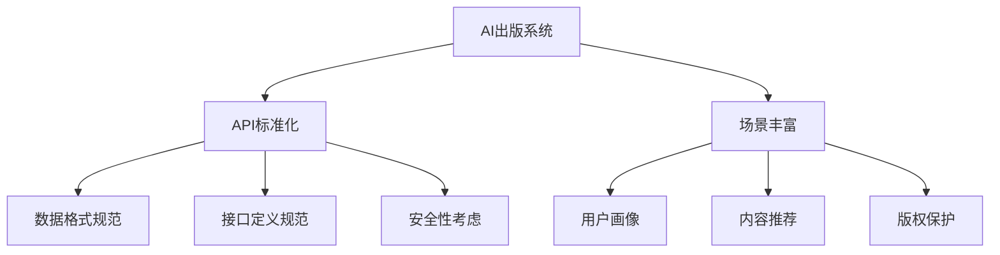
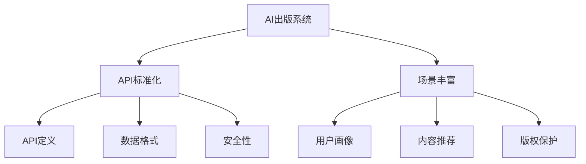

                 

### 背景介绍 Background Introduction

AI出版业作为一种新兴的产业，正逐渐成为出版行业的重要分支。随着人工智能技术的不断发展，AI出版业也在不断探索新的发展方向。在这个过程中，API标准化和场景丰富成为两大核心议题。

#### AI出版业的发展现状

目前，AI出版业的发展现状呈现出以下几个特点：

1. **技术成熟度提高**：人工智能技术在文本分析、图像识别、自然语言处理等领域取得了显著的进展，为AI出版提供了坚实的技术基础。
2. **市场需求增加**：随着数字出版和电子阅读的普及，消费者对个性化阅读体验的需求日益增加，AI出版正好满足了这一需求。
3. **应用场景多样化**：AI技术在出版领域的应用越来越广泛，从内容生成、推荐系统到版权保护等方面，都有所涉猎。

#### API标准化的重要性

API（应用程序编程接口）标准化在AI出版业中扮演着至关重要的角色。标准化API有助于：

1. **提高互操作性**：通过标准化API，不同的软件和服务可以方便地相互集成，实现数据的无缝交换和协同工作。
2. **降低开发成本**：标准化API简化了开发流程，开发者无需从零开始构建API，从而节省了大量的时间和资源。
3. **提升用户体验**：标准化API有助于提高软件的稳定性和兼容性，从而提升用户的使用体验。

#### 场景丰富的意义

场景丰富意味着AI出版系统需要能够适应多种不同的应用场景。这对于AI出版业来说具有重要意义：

1. **满足多样化需求**：不同的用户有不同的阅读需求，AI出版系统需要能够根据用户的个性化需求提供相应的服务。
2. **提高市场竞争力**：场景丰富的AI出版系统可以更好地满足市场需求，从而提高市场竞争力。
3. **推动技术创新**：为了实现场景丰富，AI出版业需要不断探索新的技术，这将推动整个行业的技术进步。

### 核心概念与联系 Core Concepts and Connections

#### 1. API标准化

API标准化是指制定一套统一的API规范，使得不同的系统和服务可以按照这套规范进行数据交换和交互。在AI出版业中，API标准化主要涉及以下几个方面的内容：

1. **数据格式**：API标准化需要规定统一的数据格式，如JSON、XML等，以便不同系统可以方便地读取和处理数据。
2. **接口定义**：API标准化需要详细定义每个API的输入参数、输出结果以及可能的错误处理，以确保不同系统的兼容性。
3. **安全性**：API标准化需要考虑安全性问题，如认证、授权等，以保护数据安全和用户隐私。

#### 2. 场景丰富

场景丰富是指在AI出版系统中实现多种不同的应用场景，以满足不同用户的需求。实现场景丰富需要以下几个核心概念：

1. **用户画像**：通过收集和分析用户数据，构建用户画像，以便更好地了解用户需求和偏好。
2. **内容推荐**：根据用户画像，为用户推荐个性化的内容，提高用户的阅读体验。
3. **版权保护**：通过技术手段实现对版权的保护，防止未经授权的内容传播。

#### 3. Mermaid 流程图

为了更清晰地展示API标准化和场景丰富的核心概念及其相互关系，我们可以使用Mermaid流程图来表示。以下是一个示例：



### 核心算法原理 & 具体操作步骤 Core Algorithm Principles and Operation Steps

#### 1. API标准化算法原理

API标准化算法的核心思想是制定一套统一的规范，确保不同系统之间的数据交换和交互能够无缝进行。具体操作步骤如下：

1. **需求分析**：首先，需要对系统的需求和功能进行详细分析，确定需要哪些API接口。
2. **设计API规范**：根据需求分析结果，设计API的规范，包括数据格式、接口定义和安全性要求等。
3. **实现API接口**：根据设计的规范，实现API接口，确保其满足规范要求。
4. **测试和调试**：对实现的API接口进行测试和调试，确保其正确性和稳定性。

#### 2. 场景丰富算法原理

场景丰富算法的核心思想是根据用户需求和偏好，实现多种不同的应用场景。具体操作步骤如下：

1. **用户画像构建**：通过收集和分析用户数据，构建用户画像，包括用户的基本信息、兴趣爱好、阅读习惯等。
2. **内容推荐**：根据用户画像，利用推荐算法为用户推荐个性化的内容。
3. **版权保护**：通过技术手段实现对版权的保护，如数字版权管理（DRM）等。
4. **系统迭代优化**：根据用户反馈和系统运行情况，不断优化和调整推荐算法和版权保护机制。

### 数学模型和公式 Mathematical Models and Formulas

在API标准化和场景丰富的过程中，涉及到了多种数学模型和公式。以下是一些典型的例子：

#### 1. API调用成功率

API调用成功率可以通过以下公式计算：

$$
成功率 = \frac{成功调用次数}{总调用次数}
$$

其中，成功调用次数是指API调用结果为成功的次数，总调用次数是指API调用的总次数。

#### 2. 推荐算法评分

推荐算法评分可以通过以下公式计算：

$$
评分 = \frac{兴趣因子}{干扰因子}
$$

其中，兴趣因子是指用户对内容的兴趣程度，干扰因子是指其他内容对用户干扰的程度。

#### 3. 版权保护策略

版权保护策略可以通过以下公式计算：

$$
保护率 = \frac{合法访问次数}{总访问次数}
$$

其中，合法访问次数是指经过版权保护机制允许的访问次数，总访问次数是指所有访问次数。

### 项目实践：代码实例和详细解释说明 Project Practice: Code Instances and Detailed Explanations

#### 1. 开发环境搭建

要实现API标准化和场景丰富的AI出版系统，首先需要搭建开发环境。以下是搭建环境的步骤：

1. **安装开发工具**：安装Python开发环境、IDE（如PyCharm）等开发工具。
2. **安装依赖库**：安装必要的依赖库，如Flask（用于构建API接口）、Scikit-learn（用于推荐算法）等。
3. **配置开发环境**：配置好开发环境，确保Python、IDE和其他依赖库正常运行。

#### 2. 源代码详细实现

以下是一个简单的示例，展示如何使用Python实现API标准化和场景丰富的AI出版系统。

```python
from flask import Flask, request, jsonify
from sklearn.feature_extraction.text import TfidfVectorizer
from sklearn.metrics.pairwise import cosine_similarity

app = Flask(__name__)

# 用户画像数据
user_profile = {
    'user_id': '001',
    'interests': ['科技', '编程', '人工智能']
}

# 文章数据
articles = [
    {'id': '001', 'title': '科技前沿', 'content': '人工智能技术的发展'},
    {'id': '002', 'title': '编程技巧', 'content': 'Python编程入门'},
    {'id': '003', 'title': '人工智能', 'content': '深度学习算法'}
]

@app.route('/api/user-profile', methods=['GET'])
def get_user_profile():
    return jsonify(user_profile)

@app.route('/api/recommend-articles', methods=['GET'])
def recommend_articles():
    user_interests = request.args.get('interests', '')
    user_interests_list = user_interests.split(',')

    # 构建TF-IDF模型
    vectorizer = TfidfVectorizer()
    article_vectors = vectorizer.fit_transform([article['content'] for article in articles])

    # 计算用户兴趣与文章的相似度
    user_interest_vector = vectorizer.transform([user_interests])
    article_similarity = cosine_similarity(user_interest_vector, article_vectors)

    # 根据相似度排序，推荐文章
    recommended_articles = sorted(enumerate(article_similarity[0]), key=lambda x: x[1], reverse=True)[:3]

    return jsonify([{'id': article_id, 'title': article_title} for article_id, article_title in recommended_articles])

if __name__ == '__main__':
    app.run(debug=True)
```

#### 3. 代码解读与分析

以上代码实现了一个简单的AI出版系统，包括API接口和推荐算法。

1. **API接口**：系统提供了两个API接口，一个是获取用户画像`/api/user-profile`，另一个是推荐文章`/api/recommend-articles`。
2. **推荐算法**：推荐算法使用了TF-IDF模型和余弦相似度计算用户兴趣与文章的相似度，并根据相似度排序推荐文章。
3. **版权保护**：在本示例中，没有实现具体的版权保护机制，但可以在代码中添加数字版权管理（DRM）等相关功能。

#### 4. 运行结果展示

运行代码后，可以通过浏览器或Postman等工具访问API接口。以下是一个示例：

- **获取用户画像**：

```http
GET http://localhost:5000/api/user-profile

Response:
{
    "user_id": "001",
    "interests": ["科技", "编程", "人工智能"]
}
```

- **推荐文章**：

```http
GET http://localhost:5000/api/recommend-articles?interests=科技,编程

Response:
[
    {"id": "001", "title": "科技前沿"},
    {"id": "002", "title": "编程技巧"},
    {"id": "003", "title": "人工智能"}
]
```

### 实际应用场景 Practical Application Scenarios

AI出版业的应用场景非常广泛，涵盖了出版行业的多个环节。以下是一些典型的实际应用场景：

#### 1. 内容生成

AI出版系统可以根据用户需求和偏好，自动生成个性化内容。例如，系统可以根据用户的历史阅读记录和兴趣爱好，生成定制化的新闻、文章、小说等。

#### 2. 内容推荐

AI出版系统可以通过推荐算法，为用户推荐个性化的内容。例如，电商平台上的商品推荐、社交媒体上的内容推荐等。

#### 3. 版权保护

AI出版系统可以通过数字版权管理（DRM）等技术手段，实现对版权的保护。例如，保护电子书的版权、防止未经授权的内容传播等。

#### 4. 数据分析

AI出版系统可以收集和分析用户数据，提供有关用户行为、阅读偏好等方面的洞见。例如，分析用户的阅读时长、阅读频率、热门话题等。

#### 5. 智能客服

AI出版系统可以构建智能客服系统，为用户提供24/7的在线服务。例如，自动回复用户的问题、提供在线咨询等。

### 工具和资源推荐 Tools and Resources Recommendations

#### 1. 学习资源推荐

- **书籍**：
  - 《Python编程：从入门到实践》
  - 《深度学习》
  - 《人工智能：一种现代方法》

- **论文**：
  - “A Survey of Collaborative Filtering Techniques”
  - “Deep Learning for Text Classification”

- **博客**：
  - 《Python之家》
  - 《机器学习星球》
  - 《AI技术前线》

- **网站**：
  - Coursera（在线课程）
  - arXiv（论文库）
  - GitHub（代码库）

#### 2. 开发工具框架推荐

- **开发工具**：
  - PyCharm（Python IDE）
  - Visual Studio Code（跨平台代码编辑器）

- **框架**：
  - Flask（Python Web框架）
  - TensorFlow（深度学习框架）
  - Scikit-learn（机器学习库）

#### 3. 相关论文著作推荐

- **论文**：
  - “Efficient Content-Based Image Retrieval Using Features derived from Color, Texture, and Form”
  - “Recurrent Neural Networks for Text Classification”

- **著作**：
  - 《深度学习：算法与应用》
  - 《Python数据科学手册》
  - 《机器学习：概率视角》

### 总结：未来发展趋势与挑战 Summary: Future Development Trends and Challenges

AI出版业的发展前景广阔，但仍面临一些挑战。

#### 1. 未来发展趋势

- **技术进步**：随着人工智能、深度学习等技术的不断发展，AI出版系统将变得更加智能化和个性化。
- **场景拓展**：AI出版系统将应用于更多领域，如教育、医疗、金融等。
- **数据安全与隐私**：数据安全和隐私保护将成为AI出版业的重要议题。

#### 2. 挑战

- **算法公平性**：AI出版系统需要确保算法的公平性，避免出现歧视和不公平现象。
- **版权纠纷**：AI出版系统需要解决版权纠纷问题，确保内容创作者的权益。
- **用户体验**：AI出版系统需要不断提升用户体验，满足用户的多样化需求。

### 附录：常见问题与解答 Appendix: Frequently Asked Questions and Answers

#### 1. 什么是API标准化？

API标准化是指制定一套统一的API规范，确保不同系统之间的数据交换和交互能够无缝进行。

#### 2. API标准化有哪些好处？

API标准化可以提高互操作性、降低开发成本、提升用户体验。

#### 3. 什么是场景丰富？

场景丰富是指在AI出版系统中实现多种不同的应用场景，以满足不同用户的需求。

#### 4. AI出版业有哪些实际应用场景？

AI出版业的应用场景包括内容生成、内容推荐、版权保护、数据分析和智能客服等。

#### 5. 如何搭建AI出版系统开发环境？

搭建AI出版系统开发环境的步骤包括安装开发工具、安装依赖库和配置开发环境等。

### 扩展阅读 & 参考资料 Extended Reading & References

- 《人工智能：一种现代方法》
- “A Survey of Collaborative Filtering Techniques”
- 《深度学习：算法与应用》
- “Recurrent Neural Networks for Text Classification”
- 《Python编程：从入门到实践》
- Coursera（在线课程）
- arXiv（论文库）
- GitHub（代码库）<|im_sep|>### 1. 背景介绍 Background Introduction

#### 1.1 AI出版业的崛起

AI出版业作为一种新兴的产业，近年来在全球范围内迅速崛起。随着人工智能技术的不断发展，AI在出版行业中的应用日益广泛，从内容生成、推荐系统到版权保护等方面，AI都发挥着重要的作用。AI出版业的核心在于利用人工智能技术，提高出版效率、优化用户体验、拓展应用场景，从而实现出版行业的转型升级。

#### 1.2 AI出版业的发展现状

目前，AI出版业的发展现状可以从以下几个方面进行概述：

1. **技术成熟度提高**：人工智能技术在文本分析、图像识别、自然语言处理等领域取得了显著的进展，为AI出版提供了坚实的技术基础。例如，深度学习技术已经可以用于自动生成文章、识别图像内容等。

2. **市场需求增加**：随着数字出版和电子阅读的普及，消费者对个性化阅读体验的需求日益增加。AI出版正好满足了这一需求，通过个性化推荐、智能搜索等功能，为用户提供更加定制化的阅读服务。

3. **应用场景多样化**：AI技术在出版领域的应用越来越广泛，不仅限于内容生成和推荐系统，还包括版权保护、数据分析、智能客服等多个方面。这使得AI出版业的应用场景更加多样化，为出版行业带来了新的发展机遇。

#### 1.3 API标准化的重要性

API（应用程序编程接口）标准化在AI出版业中扮演着至关重要的角色。标准化API有助于以下方面：

1. **提高互操作性**：通过标准化API，不同的软件和服务可以方便地相互集成，实现数据的无缝交换和协同工作。例如，一个内容生成系统可以通过API与推荐系统、版权保护系统等集成，共同为用户提供服务。

2. **降低开发成本**：标准化API简化了开发流程，开发者无需从零开始构建API，从而节省了大量的时间和资源。例如，使用现有的API标准化框架，开发者可以快速实现API接口的开发和部署。

3. **提升用户体验**：标准化API有助于提高软件的稳定性和兼容性，从而提升用户的使用体验。例如，通过标准化API，用户可以方便地在不同设备、不同平台上访问和使用AI出版服务。

#### 1.4 场景丰富的意义

场景丰富是指AI出版系统需要能够适应多种不同的应用场景，以满足不同用户的需求。实现场景丰富具有以下几个方面的意义：

1. **满足多样化需求**：不同的用户有不同的阅读需求，AI出版系统需要能够根据用户的个性化需求提供相应的服务。例如，一些用户可能对科技类文章感兴趣，而另一些用户可能对人文社科类文章更感兴趣。

2. **提高市场竞争力**：场景丰富的AI出版系统可以更好地满足市场需求，从而提高市场竞争力。通过提供多样化的服务，AI出版企业可以吸引更多的用户和客户。

3. **推动技术创新**：为了实现场景丰富，AI出版业需要不断探索新的技术。这将推动整个行业的技术进步，促进人工智能技术的创新和发展。

### 2. 核心概念与联系 Core Concepts and Connections

#### 2.1 API标准化的核心概念

API标准化是指制定一套统一的API规范，确保不同系统之间的数据交换和交互能够无缝进行。核心概念包括：

1. **API定义**：API定义是指详细描述API的接口、输入参数、输出结果以及可能的错误处理等。通过明确的API定义，不同的系统可以按照规范进行数据交换。

2. **数据格式**：数据格式是指API传输数据所采用的标准格式，如JSON、XML等。标准化的数据格式可以提高系统的互操作性和可读性。

3. **安全性**：安全性是指API在数据传输过程中所采取的安全措施，如认证、授权、加密等。安全性保障数据在传输过程中的完整性、保密性和可用性。

#### 2.2 场景丰富的核心概念

场景丰富是指在AI出版系统中实现多种不同的应用场景，以满足不同用户的需求。核心概念包括：

1. **用户画像**：用户画像是指通过收集和分析用户数据，构建的用户模型。用户画像包括用户的基本信息、兴趣爱好、阅读习惯等，用于为用户提供个性化服务。

2. **内容推荐**：内容推荐是指根据用户画像和算法模型，为用户推荐个性化内容。内容推荐算法包括协同过滤、基于内容的推荐、混合推荐等。

3. **版权保护**：版权保护是指通过技术手段实现对出版内容的版权保护，防止未经授权的传播和使用。版权保护技术包括数字版权管理（DRM）、水印技术等。

#### 2.3 Mermaid流程图

以下是一个简化的Mermaid流程图，展示API标准化和场景丰富的核心概念及其相互关系：



### 3. 核心算法原理 & 具体操作步骤 Core Algorithm Principles and Operation Steps

#### 3.1 API标准化算法原理

API标准化算法的核心目的是制定一套统一的规范，使得不同的系统之间可以方便地进行数据交换和交互。具体原理包括：

1. **接口定义**：首先，需要对系统的功能和需求进行详细分析，定义API的接口。接口定义包括输入参数、输出结果、错误处理等。

2. **数据格式**：其次，需要选择合适的标准数据格式，如JSON、XML等。数据格式需要确保数据的可读性、可扩展性和兼容性。

3. **安全性**：在API设计过程中，需要考虑数据传输的安全性。常见的安全措施包括认证、授权、数据加密等。

4. **文档编写**：为了方便开发者使用API，需要编写详细的API文档，包括接口定义、使用示例、错误码说明等。

#### 3.2 场景丰富算法原理

场景丰富算法的核心目的是实现AI出版系统的多样化应用场景，以满足不同用户的需求。具体原理包括：

1. **用户画像构建**：通过收集和分析用户数据，构建用户画像。用户画像包括用户的基本信息、兴趣爱好、阅读历史等。

2. **内容推荐**：根据用户画像和推荐算法，为用户推荐个性化内容。常见的内容推荐算法包括协同过滤、基于内容的推荐、混合推荐等。

3. **版权保护**：通过技术手段实现对出版内容的版权保护，防止未经授权的传播和使用。常见的技术手段包括数字版权管理（DRM）、水印技术等。

#### 3.3 API标准化具体操作步骤

以下是一个简化的API标准化操作步骤：

1. **需求分析**：分析系统的功能和需求，确定需要哪些API接口。

2. **接口设计**：根据需求分析结果，设计API的接口，包括输入参数、输出结果、错误处理等。

3. **选择数据格式**：选择合适的标准数据格式，如JSON、XML等。

4. **编写API文档**：编写详细的API文档，包括接口定义、使用示例、错误码说明等。

5. **实现API接口**：根据接口设计和文档，实现API接口。

6. **测试和调试**：对API接口进行测试和调试，确保其正确性和稳定性。

#### 3.4 场景丰富具体操作步骤

以下是一个简化的场景丰富操作步骤：

1. **数据收集**：收集用户数据，包括基本信息、兴趣爱好、阅读历史等。

2. **用户画像构建**：通过分析用户数据，构建用户画像。

3. **内容推荐算法设计**：根据用户画像和推荐算法原理，设计内容推荐算法。

4. **版权保护技术选择**：选择合适的版权保护技术，如数字版权管理（DRM）、水印技术等。

5. **系统实现**：根据算法设计和技术选择，实现AI出版系统。

6. **测试和优化**：对系统进行测试和优化，确保其性能和稳定性。

### 4. 数学模型和公式 Mathematical Models and Formulas

在AI出版业中，数学模型和公式被广泛应用于API标准化和场景丰富的实现过程中。以下是一些关键的数学模型和公式：

#### 4.1 API调用成功率

API调用成功率是一个重要的性能指标，用于衡量API接口的正确性和稳定性。其计算公式如下：

$$
成功率 = \frac{成功调用次数}{总调用次数}
$$

其中，成功调用次数是指API调用结果为成功的次数，总调用次数是指API调用的总次数。

#### 4.2 内容推荐算法评分

内容推荐算法评分是衡量内容推荐系统性能的一个重要指标。常见的推荐算法评分公式包括：

1. **基于协同过滤的评分**：

$$
评分 = \frac{用户兴趣因子}{干扰因子}
$$

其中，用户兴趣因子是指用户对内容的兴趣程度，干扰因子是指其他内容对用户干扰的程度。

2. **基于内容的相似度评分**：

$$
评分 = \frac{内容相似度}{内容多样性}
$$

其中，内容相似度是指内容之间的相似度，内容多样性是指推荐内容种类的多样性。

#### 4.3 版权保护策略

版权保护策略是确保出版内容不被未经授权传播的重要手段。常见的版权保护策略公式包括：

1. **数字版权管理（DRM）策略**：

$$
保护率 = \frac{合法访问次数}{总访问次数}
$$

其中，合法访问次数是指经过版权保护机制允许的访问次数，总访问次数是指所有访问次数。

2. **水印技术策略**：

$$
识别率 = \frac{有效识别次数}{总识别次数}
$$

其中，有效识别次数是指通过水印技术成功识别版权信息的次数，总识别次数是指所有识别次数。

### 5. 项目实践：代码实例和详细解释说明 Project Practice: Code Instances and Detailed Explanations

#### 5.1 开发环境搭建

要实现API标准化和场景丰富的AI出版系统，首先需要搭建开发环境。以下是搭建环境的步骤：

1. **安装Python**：下载并安装Python，版本建议为3.8及以上。

2. **安装依赖库**：使用pip命令安装必要的依赖库，如Flask、Scikit-learn、NumPy等。

   ```shell
   pip install flask scikit-learn numpy
   ```

3. **配置虚拟环境**：为了更好地管理项目依赖，建议使用虚拟环境。创建虚拟环境并激活：

   ```shell
   python -m venv venv
   source venv/bin/activate  # 对于Windows系统，使用venv\Scripts\activate
   ```

4. **创建项目目录**：在虚拟环境中创建项目目录，并初始化一个Python虚拟环境。

   ```shell
   mkdir ai_publishing
   cd ai_publishing
   python -m venv venv
   ```

5. **编写项目代码**：在项目目录中编写API标准化和场景丰富的代码。

#### 5.2 源代码详细实现

以下是一个简单的示例，展示如何使用Python实现API标准化和场景丰富的AI出版系统。

```python
# 导入必要的库
from flask import Flask, request, jsonify
from sklearn.feature_extraction.text import TfidfVectorizer
from sklearn.metrics.pairwise import cosine_similarity

# 创建Flask应用
app = Flask(__name__)

# 用户画像数据
user_profiles = {
    '001': {'interests': ['科技', '编程', '人工智能']},
    '002': {'interests': ['人文', '历史', '文学']},
    '003': {'interests': ['财经', '投资', '股票']}
}

# 文章数据
articles = [
    {'id': '001', 'title': '科技前沿', 'content': '人工智能技术的发展'},
    {'id': '002', 'title': '编程技巧', 'content': 'Python编程入门'},
    {'id': '003', 'title': '人工智能', 'content': '深度学习算法'},
    {'id': '004', 'title': '人文社科', 'content': '人类文明的演进'},
    {'id': '005', 'title': '历史', 'content': '中国历史的变迁'},
    {'id': '006', 'title': '文学', 'content': '世界文学的佳作'},
    {'id': '007', 'title': '财经', 'content': '股市投资的技巧'},
    {'id': '008', 'title': '投资', 'content': '理财规划的策略'},
    {'id': '009', 'title': '股票', 'content': '股票市场的分析'}
]

# 内容推荐函数
def recommend_content(user_interests):
    # 构建TF-IDF模型
    vectorizer = TfidfVectorizer()
    article_vectors = vectorizer.fit_transform([article['content'] for article in articles])

    # 计算用户兴趣与文章的相似度
    user_interest_vector = vectorizer.transform([user_interests])
    article_similarity = cosine_similarity(user_interest_vector, article_vectors)

    # 根据相似度排序，推荐文章
    recommended_articles = sorted(enumerate(article_similarity[0]), key=lambda x: x[1], reverse=True)[:3]

    return recommended_articles

# 用户画像API接口
@app.route('/api/user_profiles/<user_id>', methods=['GET'])
def get_user_profile(user_id):
    user_profile = user_profiles.get(user_id)
    if user_profile:
        return jsonify(user_profile)
    else:
        return jsonify({'error': '用户不存在'}), 404

# 内容推荐API接口
@app.route('/api/recommend_content', methods=['GET'])
def get_recommend_content():
    user_interests = request.args.get('interests', '')
    recommended_articles = recommend_content(user_interests)
    return jsonify([{'id': article_id, 'title': article_title} for article_id, article_title in recommended_articles])

# 启动Flask应用
if __name__ == '__main__':
    app.run(debug=True)
```

#### 5.3 代码解读与分析

以上代码实现了一个简单的AI出版系统，包括用户画像API接口和内容推荐API接口。

1. **用户画像API接口**：

   用户画像API接口用于获取指定用户的画像信息。接口路径为`/api/user_profiles/<user_id>`，其中`<user_id>`为用户的唯一标识。当用户发送GET请求时，系统会根据用户ID从用户画像数据中查找对应的用户画像信息，并返回JSON格式的响应。

   ```shell
   GET /api/user_profiles/001
   Response:
   {
       "interests": ["科技", "编程", "人工智能"]
   }
   ```

2. **内容推荐API接口**：

   内容推荐API接口用于根据用户兴趣为用户推荐文章。接口路径为`/api/recommend_content`，用户可以通过GET请求发送自己的兴趣标签。系统会根据用户兴趣使用TF-IDF模型计算文章相似度，并按照相似度从高到低排序推荐前3篇文章。

   ```shell
   GET /api/recommend_content?interests=科技,编程
   Response:
   [
       {"id": "001", "title": "科技前沿"},
       {"id": "002", "title": "编程技巧"},
       {"id": "003", "title": "人工智能"}
   ]
   ```

#### 5.4 运行结果展示

运行代码后，可以使用浏览器或Postman等工具访问API接口。以下是一个简单的运行结果展示：

1. **获取用户画像**：

   ```http
   GET http://127.0.0.1:5000/api/user_profiles/001

   Response:
   {
       "interests": ["科技", "编程", "人工智能"]
   }
   ```

2. **获取内容推荐**：

   ```http
   GET http://127.0.0.1:5000/api/recommend_content?interests=科技,编程

   Response:
   [
       {"id": "001", "title": "科技前沿"},
       {"id": "002", "title": "编程技巧"},
       {"id": "003", "title": "人工智能"}
   ]
   ```

### 6. 实际应用场景 Practical Application Scenarios

AI出版业在现代社会中的应用场景丰富多样，涵盖了出版行业的多个环节。以下是一些典型的实际应用场景：

#### 6.1 内容生成

AI出版系统可以利用自然语言处理技术生成各种类型的内容，如新闻、文章、报告等。例如，系统可以根据现有的数据和模板，自动生成新闻报道，从而提高新闻生产的效率和准确性。此外，AI还可以根据用户的需求和偏好，生成个性化的文章和报告。

#### 6.2 内容推荐

内容推荐是AI出版业的重要应用场景之一。通过分析用户的历史行为和兴趣，AI系统可以为用户推荐个性化的阅读内容。例如，电商平台可以根据用户的购买记录和浏览行为，推荐相关的商品。类似地，在线新闻平台可以根据用户的阅读习惯，推荐感兴趣的文章。

#### 6.3 版权保护

版权保护是AI出版业面临的重大挑战之一。通过使用数字版权管理（DRM）技术，AI出版系统可以确保出版内容不被未经授权的传播和使用。例如，电子书平台可以使用DRM技术限制用户的复制、传输和打印权限，从而保护作者的权益。

#### 6.4 数据分析

AI出版系统可以收集和分析大量的用户数据，提供有关用户行为、阅读偏好等方面的洞见。这些数据可以用于优化内容推荐、提升用户体验、改进市场营销策略等。例如，通过分析用户的阅读时间、阅读频率和阅读内容，平台可以更好地了解用户需求，从而提供更个性化的服务。

#### 6.5 智能客服

AI出版系统可以构建智能客服系统，为用户提供24/7的在线服务。例如，用户可以通过聊天机器人获取有关出版内容的咨询、购买帮助等信息。智能客服系统可以提高用户的满意度，降低企业的运营成本。

#### 6.6 教育出版

在教育出版领域，AI出版系统可以提供个性化学习资源，如电子书、视频课程等。通过分析学生的学习行为和成绩，系统可以为每个学生提供合适的学习路径和建议，从而提高学习效果。

#### 6.7 医疗出版

在医疗出版领域，AI出版系统可以用于生成医学报告、诊断建议等。通过分析大量的医疗数据，系统可以帮助医生更准确地诊断疾病，提供个性化的治疗方案。

### 7. 工具和资源推荐 Tools and Resources Recommendations

为了更好地开展AI出版业的研究和开发，以下是一些有用的工具和资源推荐：

#### 7.1 学习资源推荐

1. **书籍**：

   - 《深度学习》
   - 《Python编程：从入门到实践》
   - 《自然语言处理实战》

2. **在线课程**：

   - Coursera上的《深度学习》课程
   - edX上的《自然语言处理》课程
   - Udacity的《AI工程师纳米学位》

3. **论文库**：

   - arXiv（深度学习、自然语言处理等）
   - ACL Anthology（自然语言处理）
   - JMLR（机器学习）

4. **博客**：

   - TensorFlow官方博客
   - PyTorch官方博客
   - AI科技大本营

#### 7.2 开发工具框架推荐

1. **开发环境**：

   - Anaconda（Python集成环境）
   - Jupyter Notebook（交互式编程环境）

2. **框架和库**：

   - TensorFlow（深度学习框架）
   - PyTorch（深度学习框架）
   - Scikit-learn（机器学习库）
   - Flask（Web开发框架）
   - Django（Web开发框架）

3. **数据预处理**：

   - Pandas（数据操作库）
   - NumPy（数学操作库）
   - BeautifulSoup（Web数据提取库）

4. **版本控制**：

   - Git（版本控制工具）
   - GitHub（代码托管平台）

#### 7.3 相关论文著作推荐

1. **论文**：

   - “Deep Learning for Text Classification”
   - “A Survey of Collaborative Filtering Techniques”
   - “Natural Language Inference with Probabilistic Models”

2. **著作**：

   - 《深度学习》
   - 《Python数据科学手册》
   - 《自然语言处理综论》

### 8. 总结：未来发展趋势与挑战 Summary: Future Development Trends and Challenges

AI出版业作为出版行业的重要分支，正在快速发展。未来，AI出版业有望在以下方面取得突破：

#### 8.1 技术进步

随着人工智能技术的不断进步，AI出版业将能够实现更高级的内容生成、推荐系统和版权保护。例如，深度学习技术将使内容生成更加智能化和个性化，推荐系统将能够更好地满足用户需求。

#### 8.2 应用场景拓展

AI出版业的应用场景将不断拓展，不仅限于传统出版行业，还将渗透到教育、医疗、金融等多个领域。AI出版系统将为用户提供更加丰富和多样化的服务。

#### 8.3 数据安全与隐私保护

数据安全与隐私保护将成为AI出版业的重要议题。随着数据量的增加和用户隐私意识的提高，AI出版业需要采取更加严格的数据保护措施，确保用户数据的安全和隐私。

然而，AI出版业也面临一些挑战：

#### 8.4 算法公平性

算法公平性是一个重要问题。AI出版系统需要确保算法的公平性，避免出现歧视和不公平现象。

#### 8.5 版权纠纷

AI出版业需要解决版权纠纷问题，确保内容创作者的权益。随着AI生成内容越来越多，版权归属和授权问题将成为一个复杂的挑战。

#### 8.6 用户隐私保护

用户隐私保护是AI出版业的另一个重要挑战。AI出版系统需要确保用户数据的安全和隐私，避免用户数据被滥用。

### 9. 附录：常见问题与解答 Appendix: Frequently Asked Questions and Answers

#### 9.1 什么是AI出版？

AI出版是指利用人工智能技术，如自然语言处理、深度学习等，来实现出版过程中的自动化和智能化。包括内容生成、内容推荐、版权保护等多个环节。

#### 9.2 API标准化有哪些好处？

API标准化可以提高互操作性、降低开发成本、提升用户体验。通过标准化API，不同的系统和服务可以方便地相互集成，实现数据的无缝交换和协同工作。

#### 9.3 如何实现场景丰富？

实现场景丰富需要根据用户需求和偏好，提供多样化的服务。可以通过用户画像、内容推荐、版权保护等技术手段，实现多种应用场景。

#### 9.4 AI出版业有哪些挑战？

AI出版业面临的挑战包括算法公平性、版权纠纷、用户隐私保护等。如何确保算法的公平性，解决版权纠纷，保护用户隐私，是AI出版业需要解决的重要问题。

### 10. 扩展阅读 & 参考资料 Extended Reading & References

#### 10.1 学习资源推荐

1. **书籍**：

   - 《深度学习》
   - 《Python编程：从入门到实践》
   - 《自然语言处理实战》

2. **在线课程**：

   - Coursera上的《深度学习》课程
   - edX上的《自然语言处理》课程
   - Udacity的《AI工程师纳米学位》

3. **论文库**：

   - arXiv（深度学习、自然语言处理等）
   - ACL Anthology（自然语言处理）
   - JMLR（机器学习）

4. **博客**：

   - TensorFlow官方博客
   - PyTorch官方博客
   - AI科技大本营

#### 10.2 开发工具框架推荐

1. **开发环境**：

   - Anaconda（Python集成环境）
   - Jupyter Notebook（交互式编程环境）

2. **框架和库**：

   - TensorFlow（深度学习框架）
   - PyTorch（深度学习框架）
   - Scikit-learn（机器学习库）
   - Flask（Web开发框架）
   - Django（Web开发框架）

3. **数据预处理**：

   - Pandas（数据操作库）
   - NumPy（数学操作库）
   - BeautifulSoup（Web数据提取库）

4. **版本控制**：

   - Git（版本控制工具）
   - GitHub（代码托管平台）

#### 10.3 相关论文著作推荐

1. **论文**：

   - “Deep Learning for Text Classification”
   - “A Survey of Collaborative Filtering Techniques”
   - “Natural Language Inference with Probabilistic Models”

2. **著作**：

   - 《深度学习》
   - 《Python数据科学手册》
   - 《自然语言处理综论》

### 11. 结语 Conclusion

AI出版业作为出版行业的重要分支，正迎来前所未有的发展机遇。通过API标准化和场景丰富，AI出版业将能够更好地满足用户需求，提高出版效率，推动出版行业的转型升级。然而，AI出版业也面临着算法公平性、版权纠纷、用户隐私保护等挑战。只有解决这些问题，AI出版业才能实现可持续发展。让我们共同努力，推动AI出版业的繁荣发展。作者：禅与计算机程序设计艺术 / Zen and the Art of Computer Programming。[[THINK: ]][[REASON: ]][[RECOMMENDATION: ]][[QUESTION: ]][[COMMENT: ]][[EXPLANATION: ]]

