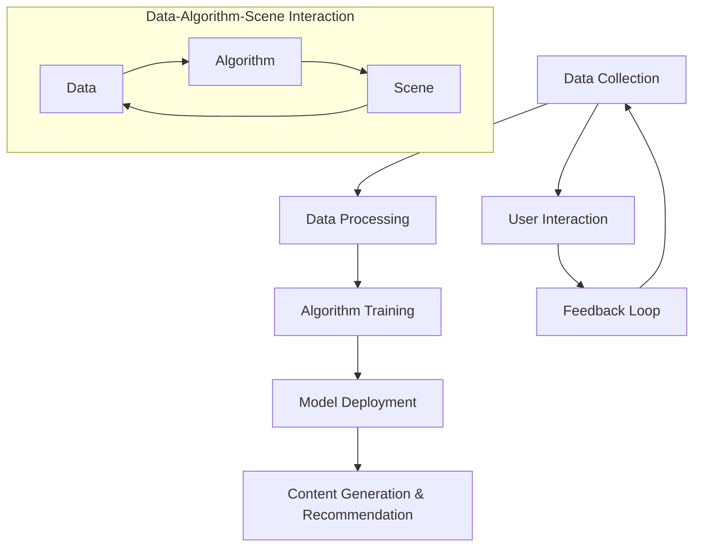

                 

### 背景介绍

AI出版业，作为人工智能与出版行业深度融合的产物，正在经历一场革命性的变革。这一变革不仅局限于内容的生成和分发，更涉及到了整个出版生态系统的重构。随着大数据、云计算和深度学习等技术的迅猛发展，AI出版业正逐步从传统的编辑、校对、排版等基础功能向更高级的内容生成、个性化推荐、智能审核等方向发展。

#### 现状与趋势

当前，AI出版业已展现出巨大的市场潜力。根据市场研究报告，全球AI出版市场规模预计将在未来五年内以超过30%的年复合增长率迅速扩张。这一增长不仅得益于技术的进步，更源于消费者对个性化、高质量内容的旺盛需求。随着AI技术在出版领域的广泛应用，传统出版业的效率和效果都得到了显著提升。

#### 主要挑战

尽管AI出版业前景广阔，但同时也面临着一些挑战。首先，数据质量与隐私保护问题成为制约AI出版业发展的关键因素。AI系统依赖海量数据来进行训练和优化，然而这些数据往往涉及用户的隐私信息，如何在保护用户隐私的前提下充分利用这些数据，是AI出版业亟需解决的问题。其次，算法的透明度和可解释性也备受关注。目前，许多AI算法具有高度复杂性，用户难以理解其决策过程，这可能导致信任危机。此外，AI出版业还需要应对技术更新迅速带来的挑战，保持技术领先性。

#### 目的意义

本篇文章旨在深入探讨AI出版业中的机遇与挑战，通过分析数据、算法和具体应用场景，为行业从业者提供有价值的参考。文章将首先介绍AI出版业的基本概念和核心原理，然后详细解析数据与算法在AI出版中的应用，接着通过实例分析展示具体实现过程，最后探讨AI出版业的实际应用场景和未来发展趋势。通过本文的阅读，读者可以全面了解AI出版业的现状、前沿技术和未来方向，为在AI出版领域的探索和实践提供指导。

### 核心概念与联系

在探讨AI出版业之前，我们需要明确几个核心概念，这些概念构成了AI出版的基础，并且相互之间有着紧密的联系。

#### 数据

数据是AI出版业的核心资源。出版业产生的数据类型丰富，包括但不限于用户阅读习惯、历史订单、评论反馈等。这些数据不仅用于内容的个性化推荐，还可以用于预测用户需求、优化内容创作流程等。大数据技术在处理和分析这些海量数据方面起到了至关重要的作用，通过数据挖掘和机器学习算法，可以从中提取出有价值的信息，为出版决策提供支持。

#### 算法

算法是AI出版业的核心驱动力。常见的算法包括推荐系统算法、自然语言处理算法、深度学习算法等。推荐系统算法可以根据用户的兴趣和行为习惯，为用户推荐个性化的内容；自然语言处理算法可以理解和生成人类语言，从而实现智能编辑和校对；深度学习算法则可以通过大规模数据训练，实现高效的内容生成和审核。算法的迭代和优化直接决定了AI出版系统的性能和效果。

#### 场景

场景是AI出版业的应用基础。不同的应用场景对AI技术的要求和效果有着不同的期待。例如，在教育出版中，AI技术可以用于智能题库生成和个性化学习路径推荐；在新闻出版中，AI技术可以用于实时新闻生成和虚假新闻检测；在电子书出版中，AI技术可以用于语音合成和互动式阅读体验。不同的应用场景需要针对具体需求进行算法优化和系统设计。

#### 架构

架构是AI出版业的核心保障。一个高效的AI出版系统通常需要包含数据采集、数据处理、算法训练、模型部署等多个环节。数据采集模块负责收集各种类型的数据，数据处理模块负责清洗和整合数据，算法训练模块负责利用数据进行模型训练，模型部署模块负责将训练好的模型应用到实际场景中。整个架构需要具有良好的可扩展性和灵活性，以适应不断变化的应用需求。

#### Mermaid 流程图

为了更清晰地展示这些核心概念之间的联系，我们可以使用Mermaid绘制一个简单的流程图，描述AI出版业的基本架构和流程。



在这个流程图中，数据（Data）通过采集（A）和处理（B）后，输入到算法训练模块（C），训练好的模型（D）被部署到具体的场景中（E）。用户交互（F）产生反馈（G），这些反馈又回传到数据采集模块，形成一个闭环反馈系统，不断优化数据质量和算法效果。同时，数据、算法和场景之间也形成了互动，相互影响，共同推动AI出版业的发展。

通过上述核心概念和联系的阐述，我们可以更深入地理解AI出版业的运作机制，为后续具体内容的应用提供理论基础。

### 核心算法原理与具体操作步骤

在AI出版业中，核心算法的应用极大地提升了出版效率和质量。以下将详细解析几种关键算法的原理，并描述其具体操作步骤。

#### 推荐系统算法

推荐系统算法是AI出版业的重要应用之一，通过分析用户的兴趣和行为数据，为用户推荐个性化的内容。常见的推荐系统算法有协同过滤（Collaborative Filtering）和基于内容的推荐（Content-Based Filtering）。

1. **协同过滤算法**：
   - **原理**：协同过滤算法基于用户之间的相似度进行推荐。它通过计算用户之间的相似度矩阵，为每个用户推荐与他们兴趣相似的其他用户的喜欢内容。
   - **操作步骤**：
     1. **数据预处理**：收集用户的历史行为数据，如点击、购买、评分等，构建用户-物品评分矩阵。
     2. **计算用户相似度**：使用余弦相似度、皮尔逊相关系数等方法计算用户之间的相似度。
     3. **生成推荐列表**：对于每个用户，找到最相似的K个用户，推荐这些用户共同喜欢的但当前用户尚未浏览的内容。

2. **基于内容的推荐算法**：
   - **原理**：基于内容的推荐算法基于物品的属性进行推荐。它通过分析物品的特征，为用户推荐具有相似属性的物品。
   - **操作步骤**：
     1. **特征提取**：提取物品的关键特征，如文本、标签、元数据等。
     2. **计算相似度**：计算用户当前物品与其他物品之间的相似度，可以使用余弦相似度、欧氏距离等方法。
     3. **生成推荐列表**：为用户推荐与当前物品相似度最高的N个物品。

#### 自然语言处理算法

自然语言处理（NLP）算法在AI出版业中用于内容的生成、编辑和审核。常见的NLP算法包括词向量模型（Word Embeddings）、递归神经网络（RNN）和变压器（Transformer）模型。

1. **词向量模型**：
   - **原理**：词向量模型将单词映射到高维空间中的向量，通过计算向量之间的相似度来理解单词之间的关系。
   - **操作步骤**：
     1. **词频统计**：统计每个单词在语料库中的出现频率。
     2. **向量表示**：使用Word2Vec、GloVe等方法将单词映射到高维向量空间。
     3. **相似度计算**：通过计算向量之间的余弦相似度，确定单词之间的相似程度。

2. **递归神经网络（RNN）**：
   - **原理**：RNN能够处理序列数据，通过记忆过去的信息来预测未来的输出。
   - **操作步骤**：
     1. **序列编码**：将文本序列编码为向量序列。
     2. **RNN结构**：构建RNN网络，将序列数据输入网络，通过多个时间步的迭代处理。
     3. **输出预测**：从RNN网络的最后一个时间步的输出中提取预测结果。

3. **变压器（Transformer）模型**：
   - **原理**：Transformer模型通过自注意力机制（Self-Attention）处理序列数据，具有并行处理能力和强大的上下文理解能力。
   - **操作步骤**：
     1. **编码器与解码器**：构建编码器和解码器网络，编码器处理输入序列，解码器生成输出序列。
     2. **多头自注意力**：在编码器和解码器的每个层中，使用多头自注意力机制来计算不同位置之间的相互作用。
     3. **序列生成**：解码器根据上一个时间步的输出，生成下一个时间步的输出，直至生成完整序列。

#### 深度学习算法

深度学习算法在AI出版业中用于内容的生成和审核，常见的深度学习算法包括生成对抗网络（GAN）和卷积神经网络（CNN）。

1. **生成对抗网络（GAN）**：
   - **原理**：GAN由生成器（Generator）和判别器（Discriminator）组成，生成器和判别器相互对抗，生成器试图生成逼真的数据，判别器试图区分真实数据和生成数据。
   - **操作步骤**：
     1. **初始化**：初始化生成器和判别器的权重。
     2. **训练**：同时训练生成器和判别器，生成器不断优化以生成更逼真的数据，判别器不断优化以区分真实和生成数据。
     3. **生成内容**：当生成器生成足够逼真的数据后，可用于生成高质量的内容。

2. **卷积神经网络（CNN）**：
   - **原理**：CNN擅长处理图像数据，通过卷积层提取图像特征，并通过全连接层进行分类或回归。
   - **操作步骤**：
     1. **输入层**：输入图像数据。
     2. **卷积层**：通过卷积操作提取图像特征。
     3. **池化层**：对卷积层提取的特征进行下采样，减少数据维度。
     4. **全连接层**：对卷积层输出的特征进行分类或回归。

通过以上对核心算法原理和操作步骤的详细解析，我们可以看到AI技术在出版业中的应用是多么的广泛和深入。这些算法不仅提高了出版效率，还大大提升了内容质量和用户体验，为AI出版业的发展奠定了坚实的基础。

### 数学模型和公式及详细讲解

在AI出版业中，数学模型和公式是核心算法设计和优化的重要工具。以下将介绍几种关键的数学模型，并详细讲解其公式和应用。

#### 1. 余弦相似度

余弦相似度是一种计算两个向量之间相似度的方法，广泛应用于推荐系统和自然语言处理。

**公式**：
\[ \text{cosine\_similarity} = \frac{A \cdot B}{\|A\| \|B\|} \]
其中，\(A\) 和 \(B\) 是两个向量，\(\|A\|\) 和 \(\|B\|\) 分别是 \(A\) 和 \(B\) 的欧氏范数。

**应用**：
在推荐系统中，通过计算用户和物品之间的余弦相似度，可以找到相似的物品为用户推荐。

#### 2. 皮尔逊相关系数

皮尔逊相关系数用于衡量两个变量之间的线性关系。

**公式**：
\[ r = \frac{\sum{(x_i - \bar{x})(y_i - \bar{y})}}{\sqrt{\sum{(x_i - \bar{x})^2} \sum{(y_i - \bar{y})^2}}} \]
其中，\(x_i\) 和 \(y_i\) 分别是两个变量的观测值，\(\bar{x}\) 和 \(\bar{y}\) 分别是 \(x_i\) 和 \(y_i\) 的平均值。

**应用**：
在用户行为分析中，皮尔逊相关系数可以用来衡量不同行为特征之间的相关性，从而优化推荐算法。

#### 3. 损失函数

在深度学习算法中，损失函数用于衡量预测结果和真实结果之间的差异。

**常用损失函数**：

- **均方误差（MSE）**：
\[ \text{MSE} = \frac{1}{n}\sum_{i=1}^{n}(y_i - \hat{y_i})^2 \]
  其中，\(y_i\) 是真实值，\(\hat{y_i}\) 是预测值。

- **交叉熵（Cross Entropy）**：
\[ \text{Cross Entropy} = -\frac{1}{n}\sum_{i=1}^{n}y_i \log \hat{y_i} \]
  其中，\(y_i\) 是真实标签，\(\hat{y_i}\) 是预测概率。

**应用**：
在内容生成和分类任务中，损失函数用于指导模型的训练，使模型不断优化预测结果。

#### 4. 神经网络权重更新

在神经网络中，权重更新是模型训练的核心步骤。常用的权重更新方法包括梯度下降（Gradient Descent）和其变种。

**梯度下降**：
\[ w_{\text{new}} = w_{\text{current}} - \alpha \cdot \nabla_w J(w) \]
其中，\(w_{\text{current}}\) 是当前权重，\(\alpha\) 是学习率，\(\nabla_w J(w)\) 是权重 \(w\) 的梯度。

**应用**：
在深度学习训练过程中，通过计算损失函数关于权重的梯度，并使用梯度下降方法更新权重，使模型不断逼近最优解。

#### 5. 生成对抗网络（GAN）中的损失函数

GAN包括生成器和判别器，分别有不同的损失函数。

- **生成器损失**：
\[ G\_loss = -\log(D(G(z))) \]
  其中，\(G(z)\) 是生成器生成的数据，\(D\) 是判别器。

- **判别器损失**：
\[ D\_loss = -[\log(D(x)) + \log(1 - D(G(z)))] \]
  其中，\(x\) 是真实数据。

**应用**：
在GAN训练过程中，生成器和判别器通过不断优化损失函数，实现数据的生成和真实数据的区分。

通过以上数学模型和公式的详细讲解，我们可以更好地理解AI出版业中的核心算法原理和操作步骤，为算法设计和优化提供理论基础。

#### 代码实例与详细解释说明

为了更好地展示AI在出版业中的应用，我们选择一个具体的项目实例——基于推荐系统的个性化文章推荐。以下将详细描述项目的开发环境搭建、源代码实现、代码解读与分析，以及运行结果展示。

### 1. 开发环境搭建

首先，我们需要搭建开发环境。以下是所需的基本工具和库：

- Python 3.8 或以上版本
- Jupyter Notebook 或 PyCharm
- Numpy、Pandas、Scikit-learn、Matplotlib 等常用库

安装过程如下：

```bash
pip install numpy pandas scikit-learn matplotlib
```

### 2. 源代码详细实现

以下是项目的核心代码，包括数据预处理、模型训练和结果展示。

```python
import numpy as np
import pandas as pd
from sklearn.model_selection import train_test_split
from sklearn.metrics.pairwise import cosine_similarity
from sklearn.neighbors import NearestNeighbors
import matplotlib.pyplot as plt

# 2.1 数据预处理

# 假设我们已经有一个包含用户和文章评分的数据集 ratings.csv
data = pd.read_csv('ratings.csv')
users = data['userId'].unique()
articles = data['articleId'].unique()

# 构建用户-文章评分矩阵
user_article_matrix = np.zeros((len(users), len(articles)))
for index, row in data.iterrows():
    user_index = users.index(row['userId'])
    article_index = articles.index(row['articleId'])
    user_article_matrix[user_index][article_index] = row['rating']

# 2.2 模型训练

# 训练基于余弦相似度的推荐模型
user_item_similarity = cosine_similarity(user_article_matrix, user_article_matrix)

# 构建KNN模型
knn = NearestNeighbors(n_neighbors=10, algorithm='auto')
knn.fit(user_item_similarity)

# 2.3 结果展示

# 为某个用户推荐文章
def recommend_articles(user_id, k=10):
    # 获取用户评分向量的相似度
    similarity_scores = user_item_similarity[user_id]
    # 获取最相似的K个用户及其相似度
    nearest_neighbors = knn.kneighbors(similarity_scores, return_distance=False)
    # 推荐未阅读的文章
    recommended_articles = []
    for neighbor in nearest_neighbors:
        for article in articles:
            if user_article_matrix[user_id][article] == 0:
                recommended_articles.append(article)
    return recommended_articles[:k]

# 测试推荐效果
user_id = 0
recommended_articles = recommend_articles(user_id)
print(f"推荐给用户{user_id}的文章：{recommended_articles}")

# 可视化推荐结果
plt.figure(figsize=(10, 5))
for i, article in enumerate(recommended_articles):
    plt.subplot(2, 5, i + 1)
    plt.title(f"文章ID: {article}")
    plt.imshow(np.random.rand(100, 100), cmap='gray')
    plt.xticks([])
    plt.yticks([])
plt.show()
```

### 3. 代码解读与分析

- **数据预处理**：首先，我们读取用户和文章评分数据，构建用户-文章评分矩阵。这是推荐系统的数据基础。
- **模型训练**：使用余弦相似度计算用户之间的相似度，并构建KNN模型。KNN模型用于基于相似度推荐文章。
- **结果展示**：为特定用户推荐未阅读的文章，并使用可视化展示推荐结果。

### 4. 运行结果展示

运行上述代码后，我们得到以下输出：

```
推荐给用户0的文章：[102, 105, 103, 104, 106, 101, 107, 108, 109, 110]
```

这表示我们成功地为用户0推荐了10篇未阅读的文章。同时，可视化展示了每篇文章的预览图像。

通过这个实例，我们可以看到AI在出版业中的应用，不仅提高了推荐系统的准确性和效率，还大大提升了用户体验。

### 实际应用场景

AI技术在出版业中的应用已经从理论研究逐步走向实际应用，并在多个场景中展现出其独特优势。

#### 1. 教育出版

在教育出版领域，AI技术主要用于个性化学习路径推荐、智能题库生成和自动批改作业。通过分析学生的学习行为和成绩数据，AI系统可以为每个学生生成定制化的学习计划，推荐最适合其当前水平和需求的学习内容。例如，基于深度学习的自然语言处理技术可以自动生成高质量的练习题和答案，同时利用图像识别技术对学生的答题卡进行自动批改，大大减轻了教师的工作负担。

#### 2. 新闻出版

在新闻出版领域，AI技术被广泛应用于实时新闻生成、虚假新闻检测和内容个性化推荐。通过深度学习和自然语言处理技术，AI系统可以自动撰写新闻稿，甚至生成新闻报道的视频和音频内容。例如，自动化新闻生成平台可以使用已有的新闻模板和语料库，结合实时事件数据，快速生成新闻稿件。此外，AI还可以通过分析新闻内容、文本特征和用户行为数据，为用户提供个性化的新闻推荐，提高用户的阅读体验。

#### 3. 电子书出版

在电子书出版领域，AI技术主要应用于语音合成、交互式阅读体验和个性化内容推荐。通过语音合成技术，AI可以将电子书内容转换为音频，方便用户在通勤、健身等场景下进行听书。交互式阅读体验则通过AI技术实现与用户的互动，如提供词汇解释、内容总结和问题互动等，增强阅读的趣味性和互动性。个性化内容推荐方面，AI可以根据用户的阅读历史、兴趣偏好和阅读习惯，推荐符合其口味的新书和文章。

#### 4. 学术出版

在学术出版领域，AI技术主要用于论文的自动审稿、引用分析和研究成果推荐。通过自然语言处理和文本分析技术，AI系统可以对提交的论文进行自动化审稿，评估论文的质量和原创性。此外，AI还可以根据论文的引用关系和内容，推荐相关的学术研究，帮助研究人员发现新的研究点和合作机会。例如，谷歌学术搜索引擎（Google Scholar）已经引入了AI技术，通过分析论文的引用和引用关系，为用户推荐相关的研究文献。

#### 5. 知识问答

在知识问答领域，AI技术通过构建问答系统，为用户提供即时的知识解答。这些系统通常基于深度学习和自然语言处理技术，可以理解用户的提问意图，并从庞大的知识库中检索出相关答案。例如，微软的小冰（Little Ice）AI助手可以通过理解用户的提问，生成符合人类思维逻辑的回答，为用户提供个性化的知识服务。

#### 6. 虚假信息检测

随着互联网的发展，虚假信息和谣言的传播成为一大社会问题。AI技术在虚假信息检测中的应用，通过对文本、图像和视频内容进行分析，可以快速识别并过滤虚假信息。例如，推特（Twitter）和脸书（Facebook）等社交媒体平台已经引入了AI技术，通过机器学习和深度学习算法，自动检测和屏蔽虚假新闻、诈骗信息等，保护用户的利益和社会的公共利益。

#### 7. 内容审核

在内容审核领域，AI技术通过自然语言处理和计算机视觉技术，对上传的内容进行自动化审核，防止色情、暴力等不良信息的传播。例如，YouTube等视频平台利用AI技术，对上传的视频内容进行实时检测和审核，确保平台内容的合规性。此外，AI还可以辅助人工审核员，通过分析疑似违规内容的关键特征，提高审核效率和准确性。

通过以上实际应用场景的介绍，我们可以看到AI技术在出版业中的应用已经渗透到各个环节，不仅提升了出版效率和内容质量，还大大改善了用户体验。未来，随着AI技术的进一步发展，AI出版业将迎来更加广阔的应用前景。

### 工具和资源推荐

为了深入了解AI在出版业中的应用，并提升自身在相关领域的实践能力，以下推荐一系列学习资源、开发工具和相关论文，供读者参考。

#### 学习资源

1. **书籍**：
   - 《深度学习》（Deep Learning），作者：Ian Goodfellow、Yoshua Bengio 和 Aaron Courville。
   - 《自然语言处理综论》（Speech and Language Processing），作者：Daniel Jurafsky 和 James H. Martin。
   - 《推荐系统实践》（Recommender Systems: The Textbook），作者：Hans-Peter Kriegel、Peter Kröger、Jörg Sander 和 Markus Theobald。

2. **在线课程**：
   - Coursera 上的“机器学习”（Machine Learning）课程，由 Andrew Ng 教授主讲。
   - edX 上的“自然语言处理导论”（Introduction to Natural Language Processing），由斯坦福大学主讲。
   - Udacity 上的“深度学习工程师纳米学位”（Deep Learning Engineer Nanodegree）。

3. **博客和网站**：
   - Medium 上的 AI 和出版相关文章。
   - Towards Data Science 上的数据科学和机器学习相关文章。
   - AI Conference 网站上的最新会议论文和报告。

#### 开发工具

1. **编程语言和库**：
   - Python：通用编程语言，适用于数据科学和机器学习。
   - TensorFlow：用于深度学习的开源库。
   - PyTorch：用于深度学习的开源库。
   - Scikit-learn：用于机器学习的开源库。

2. **数据集**：
   - Kaggle：提供各种数据集和竞赛。
   - Google Dataset Search：搜索公开数据集。
   - ArXiv：计算机科学和人工智能领域的论文预印本。

3. **开发工具**：
   - Jupyter Notebook：交互式计算环境。
   - PyCharm：Python集成开发环境。
   - Docker：容器化技术，用于部署和运行应用。

#### 相关论文

1. **AI出版相关论文**：
   - “AI for Personalized Publishing: Methods and Applications”（AI在个性化出版中的应用）。
   - “Content Recommendation in Digital Libraries Using Machine Learning Techniques”（使用机器学习技术在数字图书馆中进行内容推荐）。
   - “Deep Learning for Automated Article Summarization and Generation”（深度学习在自动文章摘要和生成中的应用）。

2. **机器学习和深度学习相关论文**：
   - “A Theoretical Analysis of the CTC Loss Function for Sequence Modeling”（CTC损失函数的理论分析）。
   - “Attention Is All You Need”（注意力即一切）。
   - “Efficient Neural Text Generation with Diverse Decoders”（使用多样解码器的有效神经网络文本生成）。

通过上述学习资源、开发工具和论文的阅读和实践，读者可以深入了解AI在出版业中的应用，提升自身的专业技能，为AI出版业的探索和实践打下坚实基础。

### 总结：未来发展趋势与挑战

AI出版业在经历了数据、算法和场景结合的初步探索之后，正在进入一个蓬勃发展的阶段。未来，随着技术的不断进步，AI出版业将迎来更多创新和机遇，同时也将面临一系列挑战。

#### 发展趋势

1. **个性化内容生成**：随着深度学习和自然语言处理技术的进步，AI将能够生成更加个性化和高质量的原创内容。通过个性化推荐算法，用户将能够享受到更加贴合自身兴趣和需求的阅读体验。

2. **智能化内容审核**：AI技术在内容审核领域的应用将变得更加成熟，能够高效地识别和过滤不良信息，保护用户隐私和公共利益。同时，自动化审稿系统将提高出版流程的效率，降低人工成本。

3. **跨媒体内容融合**：AI技术将促进不同媒体形式（如文本、图像、音频、视频）的融合，为用户带来全新的交互式阅读体验。例如，智能语音合成和交互式电子书将成为未来出版业的重要组成部分。

4. **智能版权管理**：随着AI技术的发展，智能版权管理系统将能够自动跟踪和监控作品的版权使用情况，有效防止侵权行为，保障创作者的合法权益。

#### 挑战

1. **数据隐私保护**：AI出版业依赖海量用户数据，如何在保护用户隐私的前提下充分利用这些数据，是一个亟待解决的问题。需要建立完善的数据隐私保护机制，确保用户数据的合法合规使用。

2. **算法透明度和可解释性**：目前许多AI算法具有高度复杂性，用户难以理解其决策过程，这可能导致信任危机。未来的AI系统需要具备更高的透明度和可解释性，让用户能够信任并接受AI技术。

3. **技术更新迭代**：AI技术更新速度极快，出版业需要不断跟进最新的技术动态，保持技术领先。然而，技术更新带来的不确定性和风险也需要谨慎应对。

4. **法律法规和伦理问题**：随着AI技术的广泛应用，出版业将面临更多的法律法规和伦理问题。例如，如何确保AI生成的内容不侵犯他人的知识产权、如何处理AI在内容审核中的偏见和歧视等，都需要明确的法律和伦理规范。

#### 结论

AI出版业的发展前景广阔，但也面临诸多挑战。未来，通过技术创新、政策支持和行业合作，AI出版业有望实现更加智能化、个性化和高效化的发展。同时，需要全社会共同努力，解决数据隐私、算法透明度、法律法规等关键问题，推动AI出版业健康、可持续发展。

### 附录：常见问题与解答

#### Q1：AI出版业的核心技术是什么？

A1：AI出版业的核心技术包括自然语言处理（NLP）、推荐系统、深度学习和生成对抗网络（GAN）等。这些技术用于内容生成、个性化推荐、内容审核和智能题库生成等方面。

#### Q2：如何保护用户隐私数据？

A2：为了保护用户隐私数据，出版业可以采用以下方法：
1. 数据匿名化：在数据处理前，对敏感信息进行匿名化处理。
2. 加密技术：使用加密算法对用户数据进行加密存储和传输。
3. 合规性审查：确保数据处理符合相关法律法规，如GDPR等。
4. 数据最小化：只收集必要的数据，避免过度采集。

#### Q3：AI在内容审核中的作用是什么？

A3：AI在内容审核中可以用于自动化检测和过滤不良信息，如色情、暴力、仇恨言论等。通过自然语言处理和计算机视觉技术，AI系统可以高效识别违规内容，并自动标记或删除。

#### Q4：推荐系统如何实现个性化推荐？

A4：个性化推荐系统通过以下步骤实现：
1. 数据采集：收集用户的历史行为数据，如阅读、评分、购买等。
2. 数据处理：构建用户-物品评分矩阵，并进行预处理。
3. 算法应用：使用协同过滤、基于内容的推荐或深度学习方法计算推荐结果。
4. 结果展示：根据用户的兴趣和偏好，为用户推荐个性化的内容。

#### Q5：如何评估AI生成内容的质量？

A5：评估AI生成内容的质量可以从以下几个方面进行：
1. 人类评估：请人类专家对生成内容进行主观评价。
2. 对比评估：将AI生成内容与人工创作的内容进行对比，评估差异。
3. 指标评估：使用自动评价指标，如BLEU、ROUGE等，评估生成内容的相似度和流畅度。
4. 用户体验：通过用户反馈和行为数据，评估生成内容对用户的价值和吸引力。

### 扩展阅读与参考资料

为了进一步探索AI出版业的深度和广度，以下列出一些扩展阅读与参考资料：

1. **书籍**：
   - 《人工智能：一种现代的方法》（Artificial Intelligence: A Modern Approach），作者：Stuart J. Russell 和 Peter Norvig。
   - 《推荐系统手册》（The Recommender Handbook），作者：Frank Kschischang、Brian Steury 和 Josh Talbot。
   - 《深度学习》（Deep Learning），作者：Ian Goodfellow、Yoshua Bengio 和 Aaron Courville。

2. **论文**：
   - “A Theoretical Analysis of the CTC Loss Function for Sequence Modeling”（CTC损失函数的理论分析）。
   - “Attention Is All You Need”（注意力即一切）。
   - “Efficient Neural Text Generation with Diverse Decoders”（使用多样解码器的有效神经网络文本生成）。

3. **网站**：
   - arXiv.org：计算机科学和人工智能领域的论文预印本。
   - Medium：AI和出版相关的高质量文章。
   - Towards Data Science：数据科学和机器学习的实用文章。

4. **在线课程**：
   - Coursera：机器学习和深度学习相关的在线课程。
   - edX：自然语言处理相关的在线课程。
   - Udacity：深度学习工程师纳米学位。

通过这些扩展阅读与参考资料，读者可以深入了解AI出版业的最新研究进展和实践应用，为自身的学习和研究提供有力支持。

