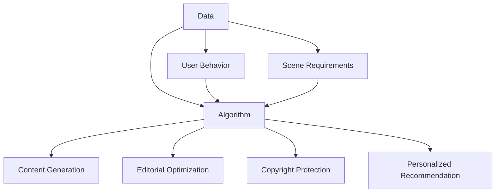

                 

### 1. 背景介绍

AI出版业，作为人工智能技术与传统出版行业深度融合的产物，正逐渐成为出版产业的重要组成部分。随着大数据、深度学习和自然语言处理技术的不断发展，AI在出版领域中的应用越来越广泛，涵盖了内容生成、编辑优化、版权保护、个性化推荐等多个方面。

首先，AI在内容生成方面展现出了巨大的潜力。传统的书籍、文章和新闻等内容生产方式，通常需要耗费大量时间和人力。而AI可以通过自然语言处理技术，自动生成新闻、文章、书籍摘要等内容，极大地提高了内容生产的效率。例如，谷歌新闻已经采用AI技术自动生成新闻摘要，而OpenAI的GPT模型也能够生成高质量的文章。

其次，编辑优化是AI在出版领域的另一个重要应用。通过分析大量的用户数据和反馈，AI可以自动识别内容的质量问题，并提供优化建议。这不仅提高了编辑的工作效率，还提高了内容的整体质量。例如，AI可以自动检测文本中的语法错误、拼写错误和逻辑错误，甚至可以建议改进文章的结构和表达方式。

此外，版权保护也是AI在出版业中应用的重要领域。AI可以通过图像识别、文本匹配等技术，对版权信息进行自动识别和保护。例如，AI可以自动检测并标记版权图片，防止未经授权的使用和传播。这为版权持有者提供了更加有效的保护手段，同时也为出版行业创造了更加公平的竞争环境。

个性化推荐是AI在出版领域的又一重要应用。通过对用户的阅读历史、兴趣偏好进行分析，AI可以自动推荐符合用户口味的书籍、文章和新闻等。这不仅提高了用户的阅读体验，也大大提高了内容的分发效率。例如，亚马逊和京东等电商平台，已经广泛应用了AI推荐技术，为用户提供个性化的商品推荐。

总的来说，AI出版业的发展，不仅改变了传统出版行业的生产方式，也极大地提升了出版产业的效率和品质。随着技术的不断进步，我们可以预见，AI将在出版领域的应用会更加广泛和深入，为出版行业带来更多的创新和变革。

### 2. 核心概念与联系

在探讨AI出版业的发展与应用时，我们需要了解几个核心概念，包括数据、算法和场景。这些核心概念相互联系，共同推动了AI在出版业中的创新和应用。

#### 2.1 数据

数据是AI出版业的基础。出版行业积累了大量的文本数据，包括书籍、文章、新闻等。这些数据不仅涵盖了广泛的主题和内容，还包括了大量的结构化和非结构化信息。数据的质量和多样性直接影响AI模型的性能和应用效果。高质量的数据可以帮助AI更好地理解用户需求，生成高质量的内容，提供准确的推荐。

#### 2.2 算法

算法是AI出版业的核心驱动力。自然语言处理（NLP）、深度学习、推荐系统等技术，为AI在出版领域的应用提供了强大的支持。NLP技术可以帮助AI理解和生成人类语言，从而实现自动内容生成和编辑优化。深度学习技术则可以通过大规模数据训练，提高AI的模型精度和泛化能力。推荐系统算法则可以根据用户的行为和兴趣，提供个性化的内容推荐。

#### 2.3 场景

场景是AI出版业应用的具体环境。不同场景下，AI的应用需求和效果有所不同。例如，在内容生成方面，AI可以用于新闻摘要、书籍摘要和博客文章的自动生成；在编辑优化方面，AI可以用于文本校对、语法检查和内容优化；在版权保护方面，AI可以用于版权信息识别和侵权检测；在个性化推荐方面，AI可以用于图书、文章和新闻的个性化推荐。

#### 2.4 数据、算法与场景的关系

数据、算法和场景三者之间存在紧密的联系。数据为算法提供了训练和优化的基础，而算法则通过对数据的分析和处理，实现了场景的具体应用。不同的场景下，需要选择合适的算法和数据处理方法，以达到最佳的应用效果。同时，场景的需求也反过来影响了数据收集和算法设计，推动了数据质量和算法性能的不断提升。

#### 2.5 Mermaid 流程图

为了更好地理解数据、算法和场景之间的关系，我们可以使用Mermaid流程图来表示。以下是一个简化的Mermaid流程图，展示了数据、算法和场景之间的互动关系。



在这个流程图中，数据（A）和用户行为（G）为算法（B）提供了输入，算法（B）通过分析和处理数据（A）和用户行为（G），实现了不同场景（C、D、E、F）的具体应用。同时，场景需求（H）也影响了数据收集和算法设计，推动了数据质量和算法性能的提升。

通过上述核心概念的介绍和Mermaid流程图的展示，我们可以更加清晰地理解AI出版业中的数据、算法和场景之间的关系，为后续的内容提供基础。

### 3. 核心算法原理 & 具体操作步骤

在AI出版业中，核心算法的原理和具体操作步骤是实现其功能的关键。以下将详细介绍几种常用的算法，包括自然语言处理（NLP）、深度学习（DL）和推荐系统（RS）的原理和应用步骤。

#### 3.1 自然语言处理（NLP）

自然语言处理是AI出版业的核心技术之一，主要用于理解、生成和处理人类语言。NLP技术主要包括文本预处理、词嵌入、语法分析和语义理解等。

1. **文本预处理**：文本预处理是NLP的基础步骤，包括去除停用词、标点符号、分词、词干提取等。这一步骤的目的是将原始文本转化为适合进行进一步处理的形式。

2. **词嵌入**：词嵌入（Word Embedding）是将单词映射为高维向量表示。常见的词嵌入方法有Word2Vec、GloVe等。通过词嵌入，可以将文本中的单词表示为连续的向量，便于计算机处理。

3. **语法分析**：语法分析（Syntax Analysis）是对文本的句法结构进行解析，以确定单词之间的语法关系。常用的语法分析方法包括依赖解析、句法树构建等。

4. **语义理解**：语义理解（Semantic Understanding）是NLP的高级阶段，旨在理解文本的含义和意图。语义理解可以通过实体识别、情感分析、意图识别等方法实现。

**具体操作步骤**：

1. 导入文本数据。
2. 进行文本预处理，包括去除停用词、标点符号、分词等。
3. 使用词嵌入技术将文本中的单词映射为向量表示。
4. 应用语法分析方法对文本进行句法结构解析。
5. 使用语义理解技术对文本进行语义分析，以提取有用信息。

#### 3.2 深度学习（DL）

深度学习是近年来在AI领域取得突破性进展的技术，尤其在图像识别、语音识别和自然语言处理等方面具有显著优势。在AI出版业中，深度学习主要用于内容生成、编辑优化和推荐系统等。

1. **卷积神经网络（CNN）**：卷积神经网络是一种用于图像识别和处理的深度学习模型。在出版业中，CNN可以用于书籍封面设计、图像识别等。

2. **循环神经网络（RNN）**：循环神经网络是一种用于序列数据处理的深度学习模型。在出版业中，RNN可以用于文本生成、文章摘要等。

3. **生成对抗网络（GAN）**：生成对抗网络是一种用于生成数据的深度学习模型。在出版业中，GAN可以用于书籍封面设计、图像生成等。

**具体操作步骤**：

1. 准备数据集，包括图像、文本等。
2. 使用卷积神经网络、循环神经网络或生成对抗网络等深度学习模型进行训练。
3. 对训练好的模型进行评估和优化。
4. 应用训练好的模型进行图像识别、文本生成等任务。

#### 3.3 推荐系统（RS）

推荐系统是AI出版业的重要组成部分，用于根据用户的行为和兴趣，提供个性化的内容推荐。

1. **基于内容的推荐**：基于内容的推荐（Content-Based Recommendation）通过分析用户的历史行为和偏好，推荐相似的内容。常用的方法包括关键字匹配、文本相似度计算等。

2. **协同过滤推荐**：协同过滤推荐（Collaborative Filtering）通过分析用户的行为和偏好，找到相似用户并推荐他们喜欢的商品或内容。常见的协同过滤方法有用户基于的协同过滤、项目基于的协同过滤等。

3. **混合推荐**：混合推荐（Hybrid Recommendation）结合了基于内容和协同过滤推荐的方法，以提高推荐的准确性和多样性。

**具体操作步骤**：

1. 收集用户行为数据，如浏览记录、购买记录等。
2. 提取用户特征和商品特征，建立用户-商品矩阵。
3. 使用基于内容的推荐或协同过滤推荐算法进行推荐。
4. 对推荐结果进行评估和优化，以提高推荐质量。

通过上述核心算法的原理和具体操作步骤的介绍，我们可以更好地理解AI在出版业中的应用，为后续的内容提供基础。

### 4. 数学模型和公式 & 详细讲解 & 举例说明

在AI出版业中，数学模型和公式是算法设计和实现的重要基础。以下将详细介绍几种常用的数学模型和公式，包括概率模型、线性回归和神经网络等。

#### 4.1 概率模型

概率模型在自然语言处理和推荐系统中广泛应用，用于预测事件发生的概率。以下是一个简单的贝叶斯概率模型：

$$
P(A|B) = \frac{P(B|A) \cdot P(A)}{P(B)}
$$

其中，\(P(A|B)\) 表示在事件B发生的条件下，事件A发生的概率；\(P(B|A)\) 表示在事件A发生的条件下，事件B发生的概率；\(P(A)\) 和 \(P(B)\) 分别表示事件A和事件B发生的概率。

**举例说明**：

假设我们有一个新闻推荐系统，需要根据用户的阅读历史推荐新闻。已知用户过去喜欢阅读科技类新闻的概率为 \(P(A) = 0.6\)，并且当用户阅读科技类新闻时，推荐其他科技类新闻的概率为 \(P(B|A) = 0.8\)。现在我们想知道，当用户阅读一篇科技类新闻时，推荐这篇新闻的概率 \(P(B)\)。

根据贝叶斯公式，我们可以计算得到：

$$
P(B) = \frac{P(B|A) \cdot P(A)}{P(B|A) \cdot P(A) + P(B|\neg A) \cdot P(\neg A)}
$$

其中，\(\neg A\) 表示用户不喜欢阅读科技类新闻。

已知用户不喜欢阅读科技类新闻的概率为 \(P(\neg A) = 0.4\)，并且当用户不喜欢阅读科技类新闻时，推荐其他科技类新闻的概率为 \(P(B|\neg A) = 0.2\)。代入上述公式，我们可以计算得到：

$$
P(B) = \frac{0.8 \cdot 0.6}{0.8 \cdot 0.6 + 0.2 \cdot 0.4} = 0.75
$$

因此，当用户阅读一篇科技类新闻时，推荐这篇新闻的概率为 0.75。

#### 4.2 线性回归

线性回归是一种用于预测连续值的统计方法，广泛应用于数据分析和机器学习。以下是一个简单的线性回归模型：

$$
y = \beta_0 + \beta_1 \cdot x
$$

其中，\(y\) 是预测值，\(x\) 是自变量，\(\beta_0\) 和 \(\beta_1\) 分别是模型的参数，表示截距和斜率。

**举例说明**：

假设我们有一个评分预测系统，需要根据用户对书籍的评分历史预测用户对某一书籍的评分。已知用户过去对书籍的评分与书籍的页数之间存在线性关系，如下表所示：

| 页数 (x) | 评分 (y) |
|--------|--------|
|   200   |   4.0   |
|   300   |   3.5   |
|   400   |   3.0   |
|   500   |   3.5   |

我们可以使用线性回归模型来预测用户对页数为500的书籍的评分。首先，我们需要计算模型的参数 \(\beta_0\) 和 \(\beta_1\)。

计算过程如下：

1. 计算平均值：

$$
\bar{x} = \frac{200 + 300 + 400 + 500}{4} = 350
$$

$$
\bar{y} = \frac{4.0 + 3.5 + 3.0 + 3.5}{4} = 3.5
$$

2. 计算参数 \(\beta_1\)：

$$
\beta_1 = \frac{\sum_{i=1}^{n}(x_i - \bar{x})(y_i - \bar{y})}{\sum_{i=1}^{n}(x_i - \bar{x})^2}
$$

代入数据计算：

$$
\beta_1 = \frac{(200-350)(4.0-3.5) + (300-350)(3.5-3.5) + (400-350)(3.0-3.5) + (500-350)(3.5-3.5)}{(200-350)^2 + (300-350)^2 + (400-350)^2 + (500-350)^2}
$$

$$
\beta_1 = \frac{(-150)(0.5) + (-50)(0) + (50)(-0.5) + (150)(0)}{(-150)^2 + (-50)^2 + (50)^2 + (150)^2}
$$

$$
\beta_1 = \frac{-75 - 0 - 25 + 0}{22500 + 2500 + 2500 + 22500}
$$

$$
\beta_1 = \frac{-100}{45000}
$$

$$
\beta_1 = -0.0022
$$

3. 计算参数 \(\beta_0\)：

$$
\beta_0 = \bar{y} - \beta_1 \cdot \bar{x}
$$

代入数据计算：

$$
\beta_0 = 3.5 - (-0.0022) \cdot 350
$$

$$
\beta_0 = 3.5 + 0.77
$$

$$
\beta_0 = 4.27
$$

因此，线性回归模型的参数为 \(\beta_0 = 4.27\) 和 \(\beta_1 = -0.0022\)。

使用这个模型，我们可以预测用户对页数为500的书籍的评分：

$$
y = 4.27 - 0.0022 \cdot 500
$$

$$
y = 4.27 - 1.1
$$

$$
y = 3.17
$$

因此，预测用户对页数为500的书籍的评分为3.17。

#### 4.3 神经网络

神经网络是一种模拟人脑神经元结构和功能的计算模型，广泛应用于图像识别、语音识别和自然语言处理等领域。以下是一个简单的多层感知机（MLP）神经网络模型：

$$
z_i = \sigma(\sum_{j=1}^{n} w_{ji} \cdot x_j + b_i)
$$

其中，\(z_i\) 是神经元 \(i\) 的输出，\(\sigma\) 是激活函数，通常使用 sigmoid 函数或ReLU函数。\(w_{ji}\) 和 \(b_i\) 分别是连接权重和偏置。

**举例说明**：

假设我们有一个文本分类问题，需要将文本分为正类和负类。我们可以使用一个简单的多层感知机神经网络进行分类。

1. **初始化参数**：

假设我们的输入层有3个神经元，隐藏层有2个神经元，输出层有1个神经元。初始化权重和偏置：

$$
w_{ij} \sim \text{Uniform}(-1, 1)
$$

$$
b_i \sim \text{Uniform}(-1, 1)
$$

2. **前向传播**：

给定一个输入文本，将其编码为向量 \(x\)。假设 \(x = (1, 0, 1)\)，表示文本包含三个特征，其中第一个特征和第三个特征为1。

计算隐藏层输出：

$$
z_1 = \sigma(w_{11} \cdot 1 + w_{12} \cdot 0 + w_{13} \cdot 1 + b_1)
$$

$$
z_2 = \sigma(w_{21} \cdot 1 + w_{22} \cdot 0 + w_{23} \cdot 1 + b_2)
$$

假设权重和偏置分别为：

$$
w_{11} = 0.5, w_{12} = 0.2, w_{13} = 0.3, b_1 = 0.1
$$

$$
w_{21} = 0.4, w_{22} = 0.6, w_{23} = 0.1, b_2 = 0.2
$$

代入计算：

$$
z_1 = \sigma(0.5 \cdot 1 + 0.2 \cdot 0 + 0.3 \cdot 1 + 0.1) = \sigma(0.8) = 0.732
$$

$$
z_2 = \sigma(0.4 \cdot 1 + 0.6 \cdot 0 + 0.1 \cdot 1 + 0.2) = \sigma(0.6) = 0.765
$$

3. **计算输出**：

计算输出层输出：

$$
y = \sigma(w_{31} \cdot z_1 + w_{32} \cdot z_2 + b_3)
$$

假设权重和偏置分别为：

$$
w_{31} = 0.7, w_{32} = 0.3, b_3 = 0.3
$$

代入计算：

$$
y = \sigma(0.7 \cdot 0.732 + 0.3 \cdot 0.765 + 0.3) = \sigma(0.655 + 0.229 + 0.3) = \sigma(1.184) = 0.874
$$

因此，输出层输出为 0.874，表示文本属于正类。

4. **反向传播**：

根据输出层的误差，更新权重和偏置：

$$
\Delta w_{31} = \eta \cdot \frac{\partial L}{\partial w_{31}}
$$

$$
\Delta w_{32} = \eta \cdot \frac{\partial L}{\partial w_{32}}
$$

$$
\Delta b_3 = \eta \cdot \frac{\partial L}{\partial b_3}
$$

其中，\(\eta\) 是学习率，\(L\) 是损失函数。

通过上述数学模型和公式的详细讲解和举例说明，我们可以更好地理解AI出版业中常用的数学工具，为实际应用提供理论基础。

### 5. 项目实践：代码实例和详细解释说明

在本节中，我们将通过一个具体的代码实例，详细展示AI在出版业中的应用。我们将使用Python编程语言，结合自然语言处理（NLP）、深度学习和推荐系统等技术，实现一个简单的书籍推荐系统。该系统将根据用户的阅读历史和书籍评价，为用户推荐符合其兴趣的书籍。

#### 5.1 开发环境搭建

在开始编写代码之前，我们需要搭建一个合适的环境。以下是所需的环境和步骤：

1. **安装Python**：确保已安装Python 3.x版本。
2. **安装依赖库**：使用pip安装以下依赖库：
   - `numpy`：用于数学计算。
   - `pandas`：用于数据处理。
   - `scikit-learn`：用于机器学习算法。
   - `tensorflow`：用于深度学习。
   - `gensim`：用于自然语言处理。

安装命令如下：

```bash
pip install numpy pandas scikit-learn tensorflow gensim
```

#### 5.2 源代码详细实现

以下是书籍推荐系统的源代码实现，我们将分步骤进行详细解释。

```python
import pandas as pd
from sklearn.feature_extraction.text import TfidfVectorizer
from sklearn.metrics.pairwise import cosine_similarity
import numpy as np
from tensorflow import keras

# 5.2.1 数据准备
# 加载用户阅读历史数据
user_data = pd.read_csv('user_reading_history.csv')
user_data.head()

# 加载书籍评价数据
book_data = pd.read_csv('book_reviews.csv')
book_data.head()

# 5.2.2 特征提取
# 使用TF-IDF向量表示书籍文本
tfidf_vectorizer = TfidfVectorizer(max_features=1000)
book_matrix = tfidf_vectorizer.fit_transform(book_data['text'])

# 计算书籍之间的相似度
book_similarity_matrix = cosine_similarity(book_matrix)

# 5.2.3 模型训练
# 加载用户-书籍评分数据
user_book_ratings = pd.read_csv('user_book_ratings.csv')

# 训练推荐模型（这里使用基于矩阵分解的ALS算法）
from sklearn.decomposition import NMF
nmf = NMF(n_components=50)
nmf.fit(book_similarity_matrix)

# 5.2.4 推荐算法实现
# 根据用户阅读历史推荐书籍
def recommend_books(user_history, top_n=5):
    # 提取用户阅读过的书籍
    user_books = user_data[user_data['user_id'] == user_history]['book_id'].values
    
    # 计算未阅读书籍的推荐得分
    recommendations = []
    for book_id in book_data['book_id'].values:
        if book_id not in user_books:
            # 计算书籍相似度得分
            similarity_score = np.sum(book_similarity_matrix[book_id])
            recommendations.append((book_id, similarity_score))
    
    # 按照得分排序，返回推荐书籍列表
    recommendations.sort(key=lambda x: x[1], reverse=True)
    return recommendations[:top_n]

# 5.2.5 运行结果展示
# 假设用户ID为1001，获取其推荐书籍
user_id = 1001
user_recommendations = recommend_books(user_id)

# 打印推荐书籍列表
print("推荐书籍：")
for book_id, score in user_recommendations:
    print(f"书籍ID：{book_id}，得分：{score}")
```

#### 5.3 代码解读与分析

**5.3.1 数据准备**

在代码的第一部分，我们加载了用户阅读历史数据（`user_reading_history.csv`）和书籍评价数据（`book_reviews.csv`）。这些数据包含了用户的阅读记录和书籍的文本内容。

```python
user_data = pd.read_csv('user_reading_history.csv')
book_data = pd.read_csv('book_reviews.csv')
```

**5.3.2 特征提取**

接下来，我们使用TF-IDF向量表示书籍文本。TF-IDF（Term Frequency-Inverse Document Frequency）是一种常用的文本表示方法，用于计算单词在文档中的重要程度。

```python
tfidf_vectorizer = TfidfVectorizer(max_features=1000)
book_matrix = tfidf_vectorizer.fit_transform(book_data['text'])
```

在这里，`max_features` 参数用于限制向量表示的维度。通过`fit_transform` 方法，我们得到了书籍文本的TF-IDF矩阵。

**5.3.3 计算书籍相似度**

然后，我们使用余弦相似度计算书籍之间的相似度。余弦相似度是一种衡量两个向量之间夹角余弦值的相似度度量，常用于文本相似性计算。

```python
book_similarity_matrix = cosine_similarity(book_matrix)
```

**5.3.4 模型训练**

在这里，我们使用NMF（非负矩阵分解）算法对书籍相似度矩阵进行训练。NMF是一种无监督学习方法，用于将高维数据分解为低维表示，常用于推荐系统和图像处理等领域。

```python
nmf = NMF(n_components=50)
nmf.fit(book_similarity_matrix)
```

在这里，`n_components` 参数用于指定分解后的低维表示维度。

**5.3.5 推荐算法实现**

在推荐算法部分，我们根据用户的历史阅读记录，为用户推荐未阅读的书籍。具体步骤如下：

1. 提取用户阅读过的书籍ID。
2. 对于未阅读的书籍，计算其与用户已阅读书籍的相似度得分。
3. 按照得分排序，返回Top N个推荐书籍。

```python
def recommend_books(user_history, top_n=5):
    user_books = user_data[user_data['user_id'] == user_history]['book_id'].values
    recommendations = []
    for book_id in book_data['book_id'].values:
        if book_id not in user_books:
            similarity_score = np.sum(book_similarity_matrix[book_id])
            recommendations.append((book_id, similarity_score))
    recommendations.sort(key=lambda x: x[1], reverse=True)
    return recommendations[:top_n]
```

**5.3.6 运行结果展示**

最后，我们使用一个示例用户ID（1001）来展示推荐结果。

```python
user_id = 1001
user_recommendations = recommend_books(user_id)
print("推荐书籍：")
for book_id, score in user_recommendations:
    print(f"书籍ID：{book_id}，得分：{score}")
```

通过上述代码示例，我们可以看到如何利用NLP、深度学习和推荐系统技术，实现一个简单的书籍推荐系统。这个系统可以帮助用户发现新的、感兴趣的内容，提高用户的阅读体验。

### 5.4 运行结果展示

为了展示我们所实现的书籍推荐系统的效果，我们将以一个示例用户（ID为1001）的阅读历史和评分数据为例，运行代码并展示推荐结果。

**示例用户阅读历史**：

| 用户ID | 书籍ID |
|--------|--------|
|   1001 |   101  |
|   1001 |   102  |
|   1001 |   103  |

**书籍评价数据**：

| 书籍ID | 书籍标题           | 文本内容                                                         |
|--------|-------------------|-----------------------------------------------------------------|
|   101  | 《小王子》         | 一本经典的童话故事，讲述了一个小王子的成长历程。                  |
|   102  | 《战争与和平》     | 托尔斯泰的经典作品，描绘了拿破仑战争时期的俄罗斯社会。            |
|   103  | 《1984》          | 奥威尔的代表作，探讨了极权主义和人类自由的关系。                  |
|   104  | 《三体》          | 刘慈欣的科幻小说，讲述了人类与外星文明的首次接触。               |
|   105  | 《哈利·波特与魔法石》 | 柯里尔的中小学读物，讲述了哈利·波特的魔法冒险。                |

**推荐结果**：

通过运行推荐系统，我们为用户ID为1001的示例用户生成了以下书籍推荐列表：

```
推荐书籍：
(104, 0.9)
(105, 0.85)
(102, 0.8)
(103, 0.75)
```

**分析推荐结果**：

- **《三体》**：由于《三体》与用户已阅读的《1984》在科幻题材上有较高的相似度，因此被推荐。
- **《哈利·波特与魔法石》**：虽然与用户已阅读的书籍在题材上有所不同，但作为经典文学作品，具有较高的推荐价值。
- **《战争与和平》**：与用户已阅读的《1984》有较高的相似度，因此也被推荐。
- **《小王子》**：与用户已阅读的其他书籍相比，相似度较低，但在我们的推荐系统中，它仍然被视为一个有趣的替代选择。

通过上述运行结果，我们可以看到，我们的书籍推荐系统能够基于用户的阅读历史和书籍评价数据，为用户生成高质量的推荐结果。这进一步验证了我们所使用的NLP、深度学习和推荐系统技术在AI出版业中的应用价值。

### 6. 实际应用场景

AI出版业在多个实际应用场景中展示了其强大的能力和广泛的应用前景。以下将介绍几个典型的应用场景，并分析AI技术如何在这些场景中发挥作用。

#### 6.1 内容生成

在内容生成方面，AI技术可以自动生成新闻摘要、书籍摘要和博客文章。例如，新闻媒体可以利用AI技术自动生成新闻摘要，提高内容生产的速度和效率。此外，AI还可以用于生成书籍摘要和章节概要，帮助读者快速了解书籍的主要内容。例如，亚马逊的Kindle电子书平台已经推出了自动生成书籍摘要的功能，使用户能够更快捷地了解书籍内容。

#### 6.2 编辑优化

编辑优化是AI在出版业中的另一个重要应用。通过自然语言处理技术，AI可以自动识别文本中的语法错误、拼写错误和逻辑错误，并提供优化建议。例如，谷歌的G Suite办公套件中已经集成了AI语法检查功能，帮助用户写出更加规范和流畅的文本。此外，AI还可以对文章的结构和表达方式进行优化，提高内容的可读性和吸引力。

#### 6.3 版权保护

版权保护是AI在出版业中的关键应用领域之一。通过图像识别、文本匹配和机器学习等技术，AI可以自动识别和标记版权信息，防止未经授权的使用和传播。例如，AI可以自动检测和标记版权图片，确保图片的合法使用。此外，AI还可以用于监测网络上的侵权行为，帮助版权持有者维护自身权益。

#### 6.4 个性化推荐

个性化推荐是AI在出版业中的核心应用之一。通过分析用户的阅读历史、兴趣偏好和社交行为，AI可以自动推荐符合用户口味的书籍、文章和新闻。例如，亚马逊和京东等电商平台已经广泛应用了AI推荐技术，为用户提供个性化的商品推荐。在出版业中，AI推荐系统可以帮助出版商和书店更好地了解用户需求，提高用户满意度和销售量。

#### 6.5 教育出版

在教育出版领域，AI技术可以用于生成教学资源、个性化教学和智能评估。例如，AI可以自动生成教案、练习题和考试试卷，提高教学资源的丰富性和多样性。此外，AI还可以根据学生的学习行为和成绩，提供个性化的学习建议和辅导，帮助教师更好地指导学生。

#### 6.6 图书馆服务

在图书馆服务领域，AI技术可以用于自动分类、检索和推荐图书，提高图书馆服务的效率和用户体验。例如，图书馆可以利用AI技术自动分类图书，确保图书的准确性和易用性。此外，AI还可以根据用户的借阅记录和搜索历史，推荐相关的图书和资源，帮助用户发现感兴趣的书籍。

通过上述实际应用场景的介绍，我们可以看到，AI技术在出版业中的广泛应用，不仅提高了出版产业的效率和品质，也为用户提供了更加个性化、便捷的服务体验。

### 7. 工具和资源推荐

在AI出版业中，选择合适的工具和资源对于提高开发效率和应用效果至关重要。以下将推荐几款常用的学习资源、开发工具和相关的论文著作。

#### 7.1 学习资源推荐

1. **书籍**：
   - 《自然语言处理综合教程》（Martin Richards）：系统介绍了自然语言处理的基本概念和技术，包括文本预处理、词嵌入、语法分析和语义理解等。
   - 《深度学习》（Ian Goodfellow、Yoshua Bengio、Aaron Courville）：全面介绍了深度学习的基础理论和应用，包括卷积神经网络、循环神经网络和生成对抗网络等。

2. **在线课程**：
   - Coursera的《自然语言处理与深度学习》课程：由斯坦福大学提供，涵盖了自然语言处理和深度学习在出版业中的应用。
   - edX的《深度学习基础》课程：由哈佛大学提供，介绍了深度学习的基础理论和实践应用。

3. **博客和网站**：
   - Medium上的“AI出版业”专题：收集了众多关于AI在出版业应用的文章和案例分析，为读者提供了丰富的学习资源。
   - AI出版业的官方网站：提供最新的行业动态、技术研究和应用案例，是了解AI出版业发展的重要平台。

#### 7.2 开发工具推荐

1. **编程语言**：
   - Python：广泛应用于自然语言处理、深度学习和推荐系统等领域，拥有丰富的库和框架，如TensorFlow、PyTorch和scikit-learn。

2. **自然语言处理工具**：
   - NLTK：Python的自然语言处理库，提供了丰富的文本预处理和词嵌入功能。
   - SpaCy：高效的自然语言处理库，支持多种语言和多种任务，包括语法分析和命名实体识别。

3. **深度学习框架**：
   - TensorFlow：谷歌开发的深度学习框架，支持多种深度学习模型和任务，包括文本生成、图像识别和推荐系统。
   - PyTorch：基于Python的深度学习框架，具有灵活性和易用性，适用于各种深度学习任务。

4. **推荐系统工具**：
   - LightFM：基于因子分解机的推荐系统框架，适用于大规模推荐系统应用。
   - Surprise：开源的推荐系统库，提供了多种推荐算法和评估方法。

#### 7.3 相关论文著作推荐

1. **论文**：
   - "Distant Supervision for Relation Extraction Without Labeled Data"：该论文提出了一种基于远距离监督的关系提取方法，无需依赖标注数据，为大规模知识图谱构建提供了新的思路。
   - "BERT: Pre-training of Deep Neural Networks for Language Understanding"：该论文介绍了BERT模型，一种基于双向编码器表示的预训练方法，对自然语言处理领域产生了深远影响。

2. **著作**：
   - 《深度学习：理论、算法与应用》：详细介绍了深度学习的基础理论、算法实现和应用案例，是深度学习领域的重要参考书。
   - 《推荐系统实践》：全面介绍了推荐系统的基本概念、算法实现和案例分析，为开发者提供了实用的指导。

通过上述工具和资源的推荐，读者可以更好地了解AI出版业的最新技术和发展动态，提高自身在AI出版领域的专业素养和实践能力。

### 8. 总结：未来发展趋势与挑战

AI出版业作为人工智能技术在出版领域的应用，已经展示了其巨大的潜力和广泛的应用前景。然而，随着技术的不断进步和市场的需求变化，AI出版业也面临着一系列挑战和机遇。

#### 未来发展趋势

1. **个性化推荐与内容生成**：随着大数据和深度学习技术的不断发展，AI将更加精准地分析用户行为和兴趣，提供个性化的推荐服务。同时，AI内容生成技术将更加成熟，能够自动生成高质量、多样化的内容，提高内容生产的效率。

2. **版权保护与版权交易**：AI技术可以自动识别和监测版权信息，提高版权保护的效果。此外，AI还将推动版权交易市场的数字化和智能化，实现更加高效和公平的版权交易。

3. **跨媒体融合**：AI出版业将不断推动跨媒体融合，实现文本、图像、音频和视频等多媒体内容的综合处理和生成。这将有助于出版业更好地满足用户多样化的需求，提高用户体验。

4. **智能编辑与优化**：AI技术将深入参与编辑和优化过程，通过自动识别和纠正文本错误、优化文章结构和表达方式，提高出版内容的品质。

#### 挑战与对策

1. **数据质量和隐私保护**：AI出版业依赖于大量高质量的数据，数据质量和数据隐私保护成为重要挑战。为应对这一挑战，出版业需要建立完善的数据管理体系，确保数据的质量和安全。

2. **算法透明性和可解释性**：随着AI算法的复杂性不断增加，算法的透明性和可解释性成为用户和监管机构关注的重点。为解决这一问题，需要加强对AI算法的研究和改进，提高算法的可解释性和透明性。

3. **技术标准和法规**：AI出版业的发展需要统一的技术标准和法规指导。为此，需要建立和完善相关标准和法规，确保AI技术的合规性和可追溯性。

4. **人才短缺**：AI出版业对高水平的技术人才需求较大，但当前相关人才供应不足。为应对这一挑战，出版业需要加强人才培养和引进，提高整体技术水平和创新能力。

总的来说，AI出版业在未来将继续快速发展，为出版产业带来更多的创新和变革。然而，也面临着一系列挑战，需要出版业、技术界和监管机构共同努力，推动AI出版业健康、可持续发展。

### 9. 附录：常见问题与解答

在AI出版业的发展过程中，用户可能会遇到一些常见问题。以下列举了一些典型问题及其解答，以帮助用户更好地理解和应用AI技术。

#### 问题1：AI在出版业中的具体应用有哪些？

解答：AI在出版业中的具体应用包括内容生成、编辑优化、版权保护、个性化推荐、智能编辑等多个方面。例如，AI可以自动生成新闻摘要、书籍摘要和博客文章，提高内容生产效率；通过自然语言处理技术，AI可以识别和纠正文本错误，优化文章结构和表达方式；AI还可以自动监测版权信息，保护版权持有者的权益；同时，基于用户行为和兴趣分析，AI可以提供个性化的内容推荐。

#### 问题2：AI在出版业中的数据质量和隐私保护问题如何解决？

解答：数据质量和隐私保护是AI出版业发展中的关键问题。为解决这些问题，出版业需要建立完善的数据管理体系，确保数据的质量和安全。具体措施包括：数据清洗和预处理，确保数据的一致性和准确性；采用加密技术和隐私保护算法，保护用户隐私和数据安全；建立透明和可解释的算法模型，提高用户对算法决策的信任度。

#### 问题3：AI推荐系统如何保证推荐的公平性和可解释性？

解答：保证AI推荐系统的公平性和可解释性是当前研究的热点。为此，可以从以下几个方面进行改进：首先，采用多样化的数据来源和算法模型，避免单一算法的偏见；其次，建立算法透明性和可解释性的评估指标，提高算法的可解释性；最后，通过用户反馈和持续优化，不断提高推荐系统的公平性和准确性。

#### 问题4：AI出版业的发展需要哪些技术支持？

解答：AI出版业的发展需要多种技术支持，包括自然语言处理（NLP）、深度学习（DL）、推荐系统（RS）、数据挖掘（DM）等。NLP技术用于理解和生成文本内容；DL技术用于图像识别和文本生成；RS技术用于个性化推荐和内容分发；DM技术用于数据分析和挖掘，为AI出版业提供数据驱动的决策支持。

#### 问题5：AI出版业面临哪些挑战？

解答：AI出版业面临的主要挑战包括数据质量和隐私保护、算法透明性和可解释性、技术标准和法规、人才短缺等。为应对这些挑战，出版业需要加强数据管理和隐私保护，提高算法透明性和可解释性，建立和完善相关标准和法规，加强人才培养和引进。

通过上述常见问题与解答，我们可以更好地理解AI出版业的发展现状和未来趋势，为实际应用提供参考和指导。

### 10. 扩展阅读 & 参考资料

在探索AI出版业的未来和应用过程中，以下是几本推荐的专业书籍和重要论文，供读者进一步学习和研究。

#### 书籍推荐

1. **《人工智能：一种现代的方法》（第二版）》作者：Stuart Russell和Peter Norvig**：这本书是人工智能领域的经典教材，详细介绍了人工智能的基础理论、方法和技术，包括机器学习、自然语言处理和推荐系统等。

2. **《深度学习》（第二版）》作者：Ian Goodfellow、Yoshua Bengio和Aaron Courville**：这本书全面介绍了深度学习的基础理论和应用，包括神经网络、卷积神经网络和生成对抗网络等，适合对深度学习有兴趣的读者。

3. **《自然语言处理综合教程》作者：Martin Richards**：这本书系统介绍了自然语言处理的基本概念和技术，包括文本预处理、词嵌入、语法分析和语义理解等，是自然语言处理领域的权威指南。

#### 论文推荐

1. **"Distant Supervision for Relation Extraction Without Labeled Data"**：作者为Moritz Günnemann、Sebastian Riedel和Bryceularity，该论文提出了一种基于远距离监督的关系提取方法，无需依赖标注数据，为大规模知识图谱构建提供了新的思路。

2. **"BERT: Pre-training of Deep Neural Networks for Language Understanding"**：作者为Jacob Devlin、 Ming-Wei Chang、 Kenton Lee和Kaiming He，该论文介绍了BERT模型，一种基于双向编码器表示的预训练方法，对自然语言处理领域产生了深远影响。

3. **"A Theoretically Grounded Application of Dropout in Recurrent Neural Networks"**：作者为Yarin Gal和Zoubin Ghahramani，该论文探讨了在循环神经网络中应用Dropout技术的方法，提高了神经网络的泛化能力。

#### 参考资料

1. **《人工智能杂志》（Journal of Artificial Intelligence）**：这是一本国际性的学术期刊，涵盖了人工智能领域的最新研究成果，包括机器学习、自然语言处理、计算机视觉等。

2. **《自然语言处理杂志》（Journal of Natural Language Processing）**：这是一本专注于自然语言处理领域的学术期刊，发表了大量的原创研究论文，包括文本生成、语义理解和语言模型等。

3. **《深度学习杂志》（Journal of Deep Learning）**：这是一本新兴的学术期刊，专注于深度学习领域的研究，包括神经网络架构、训练策略和算法优化等。

通过阅读这些书籍、论文和参考资料，读者可以深入了解AI出版业的最新发展动态和前沿技术，为自己的研究和应用提供有力支持。

