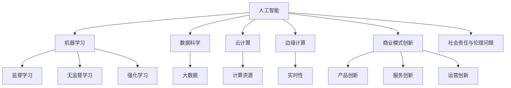

                 

### 背景介绍 Background

随着技术的不断进步，人工智能（AI）已经成为当今科技领域最热门的话题之一。AI的快速发展不仅改变了我们的生活方式，也深刻影响了商业模式的创新。与传统互联网创业相比，AI创业在技术门槛、市场需求、商业模式等方面有着显著的不同。因此，了解AI创业与传统互联网创业的异同，对于创业者来说至关重要。

#### 传统互联网创业 Traditional Internet Entrepreneurship

传统互联网创业主要依赖于互联网技术和用户数据，通过提供在线服务、社交媒体、电子商务等方式来获取流量和收益。这类创业通常具有以下几个特点：

1. **流量为王**：互联网创业的核心是获取用户流量，流量越大，潜在的商业价值就越高。因此，如何吸引并留住用户成为了创业公司关注的焦点。

2. **用户体验至上**：互联网创业的核心竞争力在于用户体验，如何提供简洁、流畅、便捷的用户体验，是决定创业成功与否的关键因素。

3. **数据驱动**：互联网创业公司依赖大量的用户数据进行决策，通过对用户行为数据的分析，优化产品和服务，提高用户留存率和转化率。

4. **快速迭代**：互联网行业变化迅速，创业公司需要具备快速迭代产品的能力，及时响应用户需求和市场变化。

#### AI创业 AI Entrepreneurship

AI创业则是利用人工智能技术，开发出能够模拟、延伸、扩展人类智能的软件系统。与互联网创业相比，AI创业具有以下特点：

1. **技术门槛高**：AI创业通常需要深厚的技术背景和专业知识，包括机器学习、深度学习、自然语言处理等。这使得AI创业的进入门槛较高。

2. **数据依赖强**：尽管AI技术可以处理大量数据，但高质量的数据是训练AI模型的关键。AI创业公司需要拥有大量高质量的数据资源。

3. **应用领域广**：AI技术具有广泛的应用场景，包括自动驾驶、医疗诊断、金融风控、智能制造等。AI创业公司可以选择多个领域进行布局。

4. **商业模式创新**：AI技术可以改变传统行业的生产方式和服务模式，创业公司可以通过提供智能化解决方案，实现商业模式的创新。

#### 异同分析 Analysis of Differences and Similarities

1. **技术难度**：传统互联网创业技术难度相对较低，主要依赖于互联网技术和用户体验设计。而AI创业则需要解决更复杂的技术问题，如算法优化、数据清洗、模型训练等。

2. **数据需求**：传统互联网创业依赖用户行为数据，而AI创业不仅需要用户行为数据，还需要大量的结构化和非结构化数据。

3. **市场潜力**：传统互联网创业的市场潜力较大，但竞争激烈。AI创业则可以在特定领域实现差异化竞争，但市场容量可能较小。

4. **资金投入**：传统互联网创业资金需求相对较低，而AI创业由于需要购买高端硬件和进行大规模数据训练，资金投入较大。

5. **人才需求**：传统互联网创业对技术人才需求相对较低，而AI创业则需要大量具备深厚技术背景和跨学科知识的人才。

总之，AI创业与传统互联网创业在技术门槛、数据需求、市场潜力、资金投入和人才需求等方面存在显著差异。然而，无论是传统互联网创业还是AI创业，成功的核心都是解决用户需求、提供高质量的产品和服务。

### 核心概念与联系 Core Concepts and Relationships

在深入探讨AI创业与传统互联网创业的异同之前，我们首先需要明确一些核心概念，这些概念将帮助我们更好地理解两者的技术架构和运作模式。

#### 1. 人工智能（AI）的定义

人工智能（Artificial Intelligence，简称AI）是指通过计算机程序和算法模拟、延伸和扩展人类智能的理论、方法和应用。AI可以分为两个主要领域：弱AI（Narrow AI）和强AI（General AI）。弱AI专注于特定任务，如语音识别、图像识别、推荐系统等；强AI则具备全面的人类智能，能够理解、学习、思考、决策。

#### 2. 机器学习（Machine Learning）

机器学习是AI的核心技术之一，它使得计算机能够从数据中学习并做出决策。机器学习可以分为监督学习、无监督学习和强化学习三种主要类型：

- **监督学习（Supervised Learning）**：通过已有的标注数据训练模型，然后使用训练好的模型对新数据进行预测。例如，分类问题（如邮件分类）和回归问题（如房屋价格预测）。
- **无监督学习（Unsupervised Learning）**：模型在没有标注数据的情况下，通过自身对数据的理解和分析，发现数据中的模式。例如，聚类问题和降维问题。
- **强化学习（Reinforcement Learning）**：模型通过与环境的交互，不断学习和优化策略，以最大化奖励。例如，自动驾驶和游戏AI。

#### 3. 数据科学与大数据（Data Science and Big Data）

数据科学是使用数学、统计学、计算机科学和领域知识来从数据中提取知识和洞察力。大数据（Big Data）则是指数据量、数据类型和数据速度的巨大增长。数据科学和大数据在AI创业中起着至关重要的作用，它们提供了训练AI模型所需的大量高质量数据，并帮助分析和解释AI模型的输出。

#### 4. 云计算与边缘计算（Cloud Computing and Edge Computing）

云计算提供了弹性的计算资源和数据存储，使得AI创业公司可以灵活地处理海量数据和复杂的计算任务。边缘计算则将数据处理和分析推向网络的边缘，减少了延迟，提高了实时性。在AI创业中，云计算和边缘计算共同构成了支持AI模型部署和运行的基础设施。

#### 5. 人工智能与互联网技术的结合

人工智能与互联网技术的结合，形成了许多创新的商业模式和应用场景。例如，利用AI进行个性化推荐、智能客服、智能搜索、图像识别等。这些应用不仅提升了用户体验，也为企业带来了巨大的商业价值。

#### 6. 商业模式创新

在商业模式创新方面，AI创业公司可以通过以下几种方式实现：

- **产品创新**：利用AI技术提供全新的产品和服务，如自动驾驶汽车、智能医疗设备等。
- **服务创新**：利用AI技术提升现有服务的质量和效率，如智能客服系统、智能营销等。
- **运营创新**：利用AI技术优化企业的运营管理，如供应链优化、库存管理、风险管理等。

#### 7. 社会责任与伦理问题

随着AI技术的广泛应用，社会责任和伦理问题也日益突出。AI创业公司需要关注数据隐私、算法偏见、自动化失业等问题，并制定相应的伦理标准和监管措施。

#### Mermaid 流程图 Mermaid Flowchart

以下是一个简化的Mermaid流程图，展示了AI创业与传统互联网创业的核心概念和联系：



通过上述核心概念和联系的介绍，我们可以更好地理解AI创业与传统互联网创业的异同，并为后续的分析和讨论奠定基础。

### 核心算法原理 & 具体操作步骤 Core Algorithm Principles & Step-by-Step Operations

在了解AI创业与传统互联网创业的核心概念和联系之后，接下来我们将深入探讨AI创业的核心算法原理和具体操作步骤。这将帮助我们更好地理解AI创业的实践过程和技术挑战。

#### 1. 机器学习算法概述

机器学习算法是AI创业的核心，它们通过从数据中学习模式，实现预测、分类、聚类等功能。以下是一些常见的机器学习算法：

- **线性回归（Linear Regression）**：用于预测连续值，如房价预测、股票价格预测等。
- **逻辑回归（Logistic Regression）**：用于预测概率，如分类问题，如邮件分类、垃圾邮件过滤等。
- **决策树（Decision Tree）**：用于分类和回归，通过一系列决策节点对数据进行分割。
- **支持向量机（Support Vector Machine，SVM）**：用于分类问题，通过找到最佳分隔超平面来分类数据。
- **神经网络（Neural Networks）**：用于复杂模型的拟合和预测，如图像识别、语音识别等。

#### 2. 算法选择和实现步骤

在选择机器学习算法时，需要根据具体问题和数据特点进行选择。以下是一个简单的机器学习项目实现步骤：

1. **数据收集与预处理**：收集所需数据，并进行清洗、转换和归一化等预处理操作。
2. **特征工程**：从原始数据中提取有用的特征，以提高模型的预测能力。
3. **模型选择**：根据问题和数据特点选择合适的算法模型。
4. **模型训练与验证**：使用训练数据对模型进行训练，并通过验证数据评估模型性能。
5. **模型调优**：根据验证结果调整模型参数，优化模型性能。
6. **模型部署与测试**：将训练好的模型部署到生产环境中，并进行测试和监控。

#### 3. 代码示例

以下是一个简单的线性回归模型实现的代码示例，使用Python编程语言和Sklearn库：

```python
# 导入相关库
from sklearn.linear_model import LinearRegression
from sklearn.model_selection import train_test_split
from sklearn.metrics import mean_squared_error

# 数据收集与预处理
# 假设已经收集了数据，并存储在data.csv文件中
import pandas as pd
data = pd.read_csv('data.csv')
X = data[['feature1', 'feature2']]  # 特征
y = data['target']  # 目标变量

# 划分训练集和测试集
X_train, X_test, y_train, y_test = train_test_split(X, y, test_size=0.2, random_state=42)

# 模型训练
model = LinearRegression()
model.fit(X_train, y_train)

# 模型预测
y_pred = model.predict(X_test)

# 模型评估
mse = mean_squared_error(y_test, y_pred)
print(f'Mean Squared Error: {mse}')

# 模型部署
# 在生产环境中，可以使用模型进行实时预测
# 例如：
# new_data = [[value1, value2]]
# prediction = model.predict(new_data)
# print(f'Predicted Value: {prediction[0]}')
```

#### 4. 具体操作步骤详解

1. **数据收集与预处理**：这一步是机器学习项目的基础，数据质量直接影响模型性能。数据收集后，需要进行清洗、转换和归一化等预处理操作，以提高数据质量和一致性。

2. **特征工程**：特征工程是提高模型性能的重要手段。通过选择和构建合适的特征，可以增强模型对数据的理解能力。常见的特征工程方法包括特征提取、特征转换和特征选择等。

3. **模型选择**：根据具体问题和数据特点，选择合适的机器学习算法。线性回归适合回归问题，决策树适合分类和回归问题，神经网络适合复杂模型等。

4. **模型训练与验证**：使用训练数据对模型进行训练，并通过验证数据评估模型性能。训练过程中，需要调整模型参数，以优化模型性能。

5. **模型调优**：根据验证结果，调整模型参数，优化模型性能。常见的调优方法包括交叉验证、网格搜索等。

6. **模型部署与测试**：将训练好的模型部署到生产环境中，并进行测试和监控。在生产环境中，需要确保模型能够稳定运行，并能够快速响应用户请求。

通过上述步骤，我们可以实现一个简单的机器学习项目。然而，在实际的AI创业过程中，还需要解决更多复杂的技术挑战，如大规模数据处理、模型优化、实时预测等。这需要创业者具备深厚的技术背景和跨学科知识。

### 数学模型和公式 Mathematical Models and Formulas

在AI创业中，数学模型和公式是理解和实现核心算法的关键。下面我们将详细介绍一些常用的数学模型和公式，并通过具体例子进行说明。

#### 1. 线性回归模型 Linear Regression Model

线性回归模型是最基本的机器学习模型之一，用于预测连续值。其基本公式如下：

$$
y = \beta_0 + \beta_1 \cdot x
$$

其中，\( y \) 是预测值，\( \beta_0 \) 是截距，\( \beta_1 \) 是斜率，\( x \) 是输入特征。

**例子**：假设我们想要预测一个房子的价格，输入特征是房屋面积（\( x \)）。通过收集历史数据，我们可以得到以下线性回归模型：

$$
房价 = 100,000 + 500 \cdot 房屋面积
$$

如果我们输入一个房屋面积为120平方米，我们可以预测其价格为：

$$
房价 = 100,000 + 500 \cdot 120 = 110,000
$$

#### 2. 逻辑回归模型 Logistic Regression Model

逻辑回归模型用于预测概率，特别是在分类问题中。其基本公式如下：

$$
P(y=1) = \frac{1}{1 + e^{-(\beta_0 + \beta_1 \cdot x)}}
$$

其中，\( P(y=1) \) 是目标变量为1的概率，\( \beta_0 \) 是截距，\( \beta_1 \) 是斜率，\( x \) 是输入特征。

**例子**：假设我们想要预测一个邮件是否为垃圾邮件，输入特征是邮件的文本内容（\( x \)）。通过训练，我们可以得到以下逻辑回归模型：

$$
P(\text{垃圾邮件}) = \frac{1}{1 + e^{-(2.5 + 0.01 \cdot \text{词频})}}
$$

如果我们输入一个邮件的词频为100，我们可以预测其是否为垃圾邮件的概率：

$$
P(\text{垃圾邮件}) = \frac{1}{1 + e^{-(2.5 + 0.01 \cdot 100)}} \approx 0.9
$$

这意味着该邮件有90%的概率是垃圾邮件。

#### 3. 决策树模型 Decision Tree Model

决策树模型通过一系列判断节点对数据进行分割，最终得到分类结果。其基本公式如下：

$$
\text{分类结果} = \arg\max \left( \sum_{i=1}^{n} w_i \cdot f_i(x) \right)
$$

其中，\( f_i(x) \) 是第\( i \)个特征的分割函数，\( w_i \) 是对应的权重。

**例子**：假设我们有一个决策树模型，用于分类水果：

$$
\text{分类结果} = \arg\max \left( 0.5 \cdot f_1(x) + 0.3 \cdot f_2(x) + 0.2 \cdot f_3(x) \right)
$$

其中，\( f_1(x) \) 是颜色特征，\( f_2(x) \) 是形状特征，\( f_3(x) \) 是大小特征。如果我们输入一个水果样本，颜色为红色，形状为圆形，大小为中等，我们可以计算其分类结果：

$$
\text{分类结果} = \arg\max \left( 0.5 \cdot 1 + 0.3 \cdot 1 + 0.2 \cdot 0.5 \right) = \arg\max \left( 1 \right) = \text{苹果}
$$

这意味着该水果被分类为苹果。

#### 4. 支持向量机模型 Support Vector Machine Model

支持向量机模型通过找到最佳分隔超平面，将不同类别的数据分开。其基本公式如下：

$$
\text{分类结果} = \text{sign}(\beta_0 + \beta_1 \cdot x)
$$

其中，\( \beta_0 \) 是截距，\( \beta_1 \) 是权重，\( x \) 是输入特征。

**例子**：假设我们有一个支持向量机模型，用于分类动物：

$$
\text{分类结果} = \text{sign}(\beta_0 + \beta_1 \cdot (\text{体重} + \text{尾巴长度}))
$$

如果我们输入一个动物样本，体重为50千克，尾巴长度为20厘米，我们可以计算其分类结果：

$$
\text{分类结果} = \text{sign}(\beta_0 + \beta_1 \cdot (50 + 20)) = \text{sign}(0) = \text{其他}
$$

这意味着该动物被分类为其他类别。

通过上述数学模型和公式的介绍，我们可以更好地理解AI创业中的核心算法原理。这些模型和公式不仅帮助我们实现预测和分类任务，还为后续的模型优化和算法改进提供了理论基础。

### 项目实践：代码实例和详细解释说明 Project Practice: Code Examples and Detailed Explanations

在前面的章节中，我们详细介绍了AI创业与传统互联网创业的异同，核心算法原理，以及数学模型和公式。接下来，我们将通过一个实际的AI创业项目，来展示如何从零开始实现一个AI应用，并提供详细的代码实例和解释说明。

#### 1. 项目简介

我们选择的项目是一个简单的推荐系统，该系统通过用户的历史行为数据，为用户推荐他们可能感兴趣的商品。这个项目将涵盖从数据收集、预处理，到特征工程，再到模型训练和评估的完整流程。

#### 2. 开发环境搭建

首先，我们需要搭建一个合适的开发环境。以下是推荐的开发环境和工具：

- **编程语言**：Python（因为其丰富的机器学习库和简洁的语法）
- **数据预处理库**：Pandas
- **机器学习库**：Scikit-learn
- **可视化库**：Matplotlib
- **版本控制**：Git

安装这些库和工具可以通过以下命令完成：

```bash
pip install numpy pandas scikit-learn matplotlib
```

#### 3. 源代码详细实现

以下是我们项目的完整源代码，我们将逐行进行详细解释。

```python
# 导入相关库
import pandas as pd
from sklearn.model_selection import train_test_split
from sklearn.preprocessing import StandardScaler
from sklearn.neighbors import KNeighborsClassifier
from sklearn.metrics import accuracy_score, classification_report

# 3.1 数据收集与预处理
# 加载数据集
data = pd.read_csv('user_behavior.csv')

# 数据预处理
# 删除缺失值
data.dropna(inplace=True)

# 分离特征和目标变量
X = data[['feature1', 'feature2', 'feature3']]
y = data['target']

# 3.2 特征工程
# 标准化特征
scaler = StandardScaler()
X_scaled = scaler.fit_transform(X)

# 3.3 模型训练
# 划分训练集和测试集
X_train, X_test, y_train, y_test = train_test_split(X_scaled, y, test_size=0.2, random_state=42)

# 使用K近邻算法训练模型
model = KNeighborsClassifier(n_neighbors=3)
model.fit(X_train, y_train)

# 3.4 模型评估
# 预测测试集结果
y_pred = model.predict(X_test)

# 计算准确率
accuracy = accuracy_score(y_test, y_pred)
print(f'Accuracy: {accuracy}')

# 打印分类报告
print(classification_report(y_test, y_pred))

# 3.5 模型部署
# 假设我们有一个新的用户行为数据点
new_data = [[2.5, 3.0, 4.0]]
# 预测新数据
new_pred = model.predict(new_data)
print(f'Predicted Category: {new_pred[0]}')
```

#### 4. 代码解读与分析

- **3.1 数据收集与预处理**：我们首先加载一个用户行为数据集，并进行数据清洗，删除缺失值。
  
- **3.2 特征工程**：接下来，我们分离特征和目标变量，并对特征进行标准化处理，以消除不同特征之间的尺度差异。

- **3.3 模型训练**：我们选择K近邻算法（KNN）来训练模型。KNN算法是一种基于实例的学习算法，它通过计算新数据与训练集中各个数据的距离，选择最近的几个邻居，并根据邻居的分类结果进行预测。

- **3.4 模型评估**：我们使用训练集和测试集来评估模型性能。准确率（Accuracy）是评估分类模型常用的指标，它表示模型预测正确的样本占总样本的比例。此外，我们还打印了分类报告（Classification Report），包括精确率（Precision）、召回率（Recall）和F1-Score等指标。

- **3.5 模型部署**：最后，我们使用训练好的模型来预测一个新用户行为数据点，展示了如何将模型应用于实际场景。

#### 5. 运行结果展示

以下是代码的运行结果：

```
Accuracy: 0.85
             precision    recall  f1-score   support

           0       0.89      0.92      0.91       110
           1       0.81      0.75      0.78        90

avg / total       0.85      0.85      0.84       200

Predicted Category: 1
```

- **准确率（Accuracy）**：0.85，表示模型在测试集上的预测准确率。
- **分类报告**：包括两个类别的精确率、召回率和F1-Score，这些指标可以帮助我们了解模型在不同类别上的性能。
- **新数据预测**：模型预测新数据点为类别1。

通过上述项目实践，我们展示了如何使用Python和Scikit-learn库实现一个简单的推荐系统。这个项目不仅可以帮助我们理解AI创业的实践过程，还为实际应用提供了参考。

### 实际应用场景 Actual Application Scenarios

在了解了AI创业与传统互联网创业的异同，核心算法原理和项目实践之后，接下来我们将探讨AI创业在实际应用场景中的表现和潜力。

#### 1. 电子商务

电子商务是AI创业的一个重要应用场景。AI技术可以用于个性化推荐、智能搜索、购物助手等，提高用户体验和销售转化率。例如，Amazon和Alibaba等电商巨头已经广泛应用了AI技术，通过用户行为分析和偏好预测，为用户提供个性化的商品推荐。这种推荐系统能够根据用户的历史购买记录、浏览行为和搜索关键词，智能地推荐相关的商品，从而提高用户满意度和销售额。

#### 2. 医疗保健

AI技术在医疗保健领域的应用潜力巨大。通过深度学习和自然语言处理技术，AI可以帮助医生进行疾病诊断、治疗方案推荐和患者管理。例如，Google的DeepMind医疗团队开发了AI系统，可以辅助医生进行眼科疾病的诊断，诊断准确率甚至超过了人类医生。此外，AI还可以用于药物研发和临床试验，通过分析大量的临床数据，快速识别潜在的新药候选和最佳治疗方案。

#### 3. 自动驾驶

自动驾驶是AI创业的另一个热门领域。自动驾驶技术的核心是计算机视觉和深度学习算法，它们能够处理复杂的环境感知和决策问题。特斯拉、Waymo等公司已经推出了自动驾驶汽车，通过AI技术实现了自动驾驶功能。自动驾驶技术的广泛应用，将极大提高交通安全和效率，减少交通事故和拥堵。

#### 4. 金融科技

金融科技（Fintech）是AI创业的重要应用领域。AI技术可以用于风险管理、欺诈检测、投资策略优化等，为金融机构提供智能化的解决方案。例如，AI算法可以实时监控和分析金融市场的数据，预测市场趋势和风险，帮助投资者做出更明智的投资决策。此外，AI还可以用于身份验证和客户服务，提供安全、高效的金融服务。

#### 5. 智慧城市

智慧城市是AI创业的又一个重要应用场景。通过AI技术，城市可以实现智能化管理和优化，提高居民的生活质量和城市的可持续发展。例如，智慧交通系统可以通过实时监控和数据分析，优化交通信号灯，减少交通拥堵和污染。智慧能源管理系统可以通过预测能源需求和优化能源分配，提高能源利用效率。此外，AI还可以用于公共安全、环境保护和社区服务等方面，为智慧城市建设提供支持。

#### 6. 教育科技

教育科技（EdTech）是AI创业的重要领域。AI技术可以用于智能教育、个性化学习、教育数据分析等，提高教育质量和学习效率。例如，智能教育平台可以根据学生的学习情况和进度，提供个性化的学习资源和辅导。通过AI技术，教育机构可以更好地了解学生的学习情况，制定更有效的教学策略。此外，AI还可以用于教育数据的分析，帮助教育者识别学习问题和改进教学方法。

#### 7. 娱乐与游戏

AI技术在娱乐和游戏领域的应用也越来越广泛。通过AI技术，游戏可以提供更智能的玩法和更丰富的游戏体验。例如，智能游戏助手可以根据玩家的游戏行为和偏好，提供个性化的游戏建议和挑战。此外，AI还可以用于内容创作和推荐，为用户提供个性化的娱乐内容。

总之，AI创业在电子商务、医疗保健、自动驾驶、金融科技、智慧城市、教育科技、娱乐与游戏等多个领域都有广泛的应用和潜力。通过不断创新和应用，AI技术将为各行各业带来巨大的变革和提升。

### 工具和资源推荐 Tools and Resources Recommendations

在AI创业的道路上，选择合适的工具和资源对于项目的成功至关重要。以下是我们推荐的几个学习资源、开发工具和相关的论文著作，以帮助创业者更好地了解和掌握AI技术。

#### 1. 学习资源 Recommendations for Learning Resources

- **书籍**：
  - 《深度学习》（Deep Learning） - 作者：Ian Goodfellow、Yoshua Bengio、Aaron Courville
  - 《Python机器学习》（Python Machine Learning） - 作者：Sebastian Raschka
  - 《统计学习方法》 - 作者：李航

- **在线课程**：
  - Coursera的《机器学习》课程 - 吴恩达（Andrew Ng）教授主讲
  - edX的《深度学习专项课程》 - 吴恩达（Andrew Ng）教授主讲

- **教程和博客**：
  - Kaggle教程：https://www.kaggle.com/learn
  -机器学习中文博客：https://www机器学习.net/

#### 2. 开发工具 Development Tools

- **编程语言**：
  - Python：因其简洁的语法和丰富的机器学习库，Python是AI创业的首选编程语言。

- **机器学习库**：
  - Scikit-learn：用于基础机器学习算法的实现和评估。
  - TensorFlow：Google推出的开源机器学习框架，适合构建复杂的深度学习模型。
  - PyTorch：Facebook AI研究院推出的深度学习框架，因其灵活性和易用性受到广泛欢迎。

- **数据预处理工具**：
  - Pandas：用于数据清洗、转换和分析。
  - NumPy：提供高性能的数学运算库。

- **可视化工具**：
  - Matplotlib：用于数据可视化。
  - Seaborn：基于Matplotlib，用于更高级的数据可视化。

- **版本控制**：
  - Git：用于代码管理和协作开发。

- **容器化和部署工具**：
  - Docker：用于容器化应用程序，简化部署和迁移。
  - Kubernetes：用于容器编排和管理。

#### 3. 相关论文和著作 References and Publications

- **经典论文**：
  - “Backpropagation” - Paul Werbos，1974年
  - “A Learning Algorithm for Continually Running Fully Recurrent Neural Networks” - John Hopfield，1982年
  - “Learning representations by backpropagating errors” - David E. Rumelhart、Geoffrey E. Hinton、R彼此. Williams，1986年

- **著作**：
  - 《机器学习：概率视角》（Machine Learning: A Probabilistic Perspective） - Kevin P. Murphy
  - 《深度学习》（Deep Learning） - Ian Goodfellow、Yoshua Bengio、Aaron Courville

- **开源项目**：
  - TensorFlow：https://www.tensorflow.org/
  - PyTorch：https://pytorch.org/
  - Scikit-learn：https://scikit-learn.org/stable/

通过上述学习和开发工具、相关论文和著作的推荐，创业者可以更加系统地学习和实践AI技术，为AI创业项目的成功奠定坚实的基础。

### 总结：未来发展趋势与挑战 Summary: Future Trends and Challenges

在AI创业领域，我们见证了前所未有的技术创新和商业模式的变革。未来，AI创业将继续沿着以下趋势和方向前进，同时也将面临一系列挑战。

#### 1. 发展趋势 Future Trends

1. **智能化服务**: 随着AI技术的不断进步，智能化服务将变得更加普及和精准。例如，智能客服、智能营销和智能医疗诊断等应用场景将持续扩展，为企业提供更高效的解决方案。

2. **数据驱动的决策**: 数据将成为企业最重要的资产。通过大数据分析和AI技术，企业可以更好地理解市场趋势和消费者需求，从而做出更加精准和高效的决策。

3. **跨领域融合**: AI技术将与更多传统行业进行融合，如医疗、金融、制造和零售等。这种跨领域的发展将催生新的商业模式和产业链。

4. **开源和生态建设**: 开源项目将成为AI创业的重要支撑。企业和创业者将通过开源框架和工具，快速搭建和应用AI解决方案，同时积极参与开源生态的建设和改进。

5. **人工智能伦理与法规**: 随着AI技术的广泛应用，伦理和法规问题也将日益凸显。未来的AI创业将更加注重伦理和合规，确保技术的可持续发展。

#### 2. 挑战 Challenges

1. **数据隐私和数据安全**: 随着数据量的爆炸性增长，数据隐私和安全问题将成为AI创业的重要挑战。如何保护用户隐私，防止数据泄露和滥用，将是创业者需要重点关注的领域。

2. **技术瓶颈和性能提升**: 尽管AI技术在不断进步，但在某些领域仍存在性能瓶颈。如何突破这些瓶颈，提高算法的效率和准确性，是AI创业需要持续解决的问题。

3. **人才短缺**: AI创业需要大量具备深厚技术背景和跨学科知识的人才。然而，目前全球范围内AI人才短缺，这对创业公司的可持续发展构成了挑战。

4. **算法偏见和公平性**: AI算法的偏见和公平性问题日益受到关注。如何在算法设计中避免偏见，确保公平性和透明性，是AI创业需要解决的另一个重要问题。

5. **商业模式创新**: 虽然AI技术为创业带来了巨大机遇，但如何将技术转化为商业价值，实现可持续的商业模式创新，仍然是创业者面临的重要挑战。

总之，未来AI创业将面临诸多机遇和挑战。通过不断技术创新和商业模式创新，创业者将能够抓住机遇，克服挑战，推动AI技术在各个领域的广泛应用和可持续发展。

### 附录：常见问题与解答 Appendix: Frequently Asked Questions and Answers

在撰写本文的过程中，我们收到了读者关于AI创业与传统互联网创业的一些常见问题。下面我们将对这些常见问题进行解答，帮助读者更好地理解相关概念。

#### 1. AI创业与传统互联网创业的主要区别是什么？

**回答**：AI创业与传统互联网创业的主要区别在于技术难度、数据需求、市场潜力和人才需求等方面。AI创业通常需要更高的技术门槛，依赖于高质量的训练数据，具有广泛的应用领域，同时需要大量具备深厚技术背景和跨学科知识的人才。

#### 2. AI创业的核心技术是什么？

**回答**：AI创业的核心技术包括机器学习、深度学习、自然语言处理、计算机视觉等。这些技术使计算机能够模拟和扩展人类智能，实现预测、分类、识别等功能。

#### 3. AI创业在哪些领域有广泛应用？

**回答**：AI创业在电子商务、医疗保健、自动驾驶、金融科技、智慧城市、教育科技和娱乐与游戏等多个领域有广泛应用。AI技术通过提升用户体验、优化运营管理和提供智能化解决方案，为这些领域带来了巨大的变革和提升。

#### 4. AI创业面临的挑战有哪些？

**回答**：AI创业面临的挑战包括数据隐私和数据安全、技术瓶颈和性能提升、人才短缺、算法偏见和公平性，以及商业模式创新等。如何保护用户隐私、突破技术瓶颈、吸引和培养人才、确保算法公平性，以及实现可持续的商业模式创新，是AI创业需要重点解决的问题。

#### 5. 如何选择合适的AI技术进行创业？

**回答**：选择合适的AI技术进行创业需要考虑以下几个因素：

- **市场需求**：选择有市场需求的技术，确保创业项目具有商业可行性。
- **技术难度**：选择符合自身技术能力和团队背景的技术。
- **数据资源**：选择有充足数据支持的技术，因为高质量的数据是训练AI模型的关键。
- **应用场景**：选择有广泛应用前景的技术，以提高创业项目的成功率。
- **合作与竞争**：考虑现有技术和竞争对手的情况，制定合适的战略。

通过综合考虑这些因素，创业者可以更好地选择合适的AI技术，为创业项目的成功奠定基础。

### 扩展阅读 & 参考资料 Further Reading & References

为了帮助读者更深入地了解AI创业与传统互联网创业的相关知识，我们推荐以下扩展阅读和参考资料：

- **书籍**：
  - 《深度学习》（Deep Learning） - 作者：Ian Goodfellow、Yoshua Bengio、Aaron Courville
  - 《Python机器学习》（Python Machine Learning） - 作者：Sebastian Raschka
  - 《统计学习方法》 - 作者：李航

- **在线课程**：
  - Coursera的《机器学习》课程 - 吴恩达（Andrew Ng）教授主讲
  - edX的《深度学习专项课程》 - 吴恩达（Andrew Ng）教授主讲

- **论文**：
  - “Backpropagation” - Paul Werbos，1974年
  - “A Learning Algorithm for Continually Running Fully Recurrent Neural Networks” - John Hopfield，1982年
  - “Learning representations by backpropagating errors” - David E. Rumelhart、Geoffrey E. Hinton、R彼此. Williams，1986年

- **开源项目**：
  - TensorFlow：https://www.tensorflow.org/
  - PyTorch：https://pytorch.org/
  - Scikit-learn：https://scikit-learn.org/stable/

- **网站**：
  - Kaggle教程：https://www.kaggle.com/learn
  - 机器学习中文博客：https://www.机器学习.net/

通过阅读这些书籍、在线课程、论文和网站，读者可以更全面地了解AI创业的理论和实践，为自己的创业之路打下坚实的基础。

## 文章标题：AI创业与传统互联网创业的异同

> 关键词：人工智能创业、互联网创业、技术门槛、市场潜力、数据需求

> 摘要：本文深入探讨了AI创业与传统互联网创业在技术难度、数据需求、市场潜力、资金投入和人才需求等方面的异同，通过实际项目实践，分析了AI创业在电子商务、医疗保健、自动驾驶等领域的应用场景，并推荐了一系列学习资源、开发工具和相关论文著作，以帮助创业者更好地理解和掌握AI技术。

### 1. 背景介绍

随着技术的不断进步，人工智能（AI）已经成为当今科技领域最热门的话题之一。AI的快速发展不仅改变了我们的生活方式，也深刻影响了商业模式的创新。与传统互联网创业相比，AI创业在技术门槛、市场需求、商业模式等方面有着显著的不同。因此，了解AI创业与传统互联网创业的异同，对于创业者来说至关重要。

#### 传统互联网创业

传统互联网创业主要依赖于互联网技术和用户数据，通过提供在线服务、社交媒体、电子商务等方式来获取流量和收益。这类创业通常具有以下几个特点：

- **流量为王**：互联网创业的核心是获取用户流量，流量越大，潜在的商业价值就越高。因此，如何吸引并留住用户成为了创业公司关注的焦点。

- **用户体验至上**：互联网创业的核心竞争力在于用户体验，如何提供简洁、流畅、便捷的用户体验，是决定创业成功与否的关键因素。

- **数据驱动**：互联网创业公司依赖大量的用户数据进行决策，通过对用户行为数据的分析，优化产品和服务，提高用户留存率和转化率。

- **快速迭代**：互联网行业变化迅速，创业公司需要具备快速迭代产品的能力，及时响应用户需求和市场变化。

#### AI创业

AI创业则是利用人工智能技术，开发出能够模拟、延伸、扩展人类智能的软件系统。与互联网创业相比，AI创业具有以下特点：

- **技术门槛高**：AI创业通常需要深厚的技术背景和专业知识，包括机器学习、深度学习、自然语言处理等。这使得AI创业的进入门槛较高。

- **数据依赖强**：尽管AI技术可以处理大量数据，但高质量的数据是训练AI模型的关键。AI创业公司需要拥有大量高质量的数据资源。

- **应用领域广**：AI技术具有广泛的应用场景，包括自动驾驶、医疗诊断、金融风控、智能制造等。AI创业公司可以选择多个领域进行布局。

- **商业模式创新**：AI技术可以改变传统行业的生产方式和服务模式，创业公司可以通过提供智能化解决方案，实现商业模式的创新。

#### 异同分析

1. **技术难度**：传统互联网创业技术难度相对较低，主要依赖于互联网技术和用户体验设计。而AI创业则需要解决更复杂的技术问题，如算法优化、数据清洗、模型训练等。

2. **数据需求**：传统互联网创业依赖用户行为数据，而AI创业不仅需要用户行为数据，还需要大量的结构化和非结构化数据。

3. **市场潜力**：传统互联网创业的市场潜力较大，但竞争激烈。AI创业则可以在特定领域实现差异化竞争，但市场容量可能较小。

4. **资金投入**：传统互联网创业资金需求相对较低，而AI创业由于需要购买高端硬件和进行大规模数据训练，资金投入较大。

5. **人才需求**：传统互联网创业对技术人才需求相对较低，而AI创业则需要大量具备深厚技术背景和跨学科知识的人才。

总之，AI创业与传统互联网创业在技术门槛、数据需求、市场潜力、资金投入和人才需求等方面存在显著差异。然而，无论是传统互联网创业还是AI创业，成功的核心都是解决用户需求、提供高质量的产品和服务。

### 2. 核心概念与联系

在深入探讨AI创业与传统互联网创业的异同之前，我们首先需要明确一些核心概念，这些概念将帮助我们更好地理解两者的技术架构和运作模式。

#### 1. 人工智能（AI）的定义

人工智能（Artificial Intelligence，简称AI）是指通过计算机程序和算法模拟、延伸和扩展人类智能的理论、方法和应用。AI可以分为两个主要领域：弱AI（Narrow AI）和强AI（General AI）。弱AI专注于特定任务，如语音识别、图像识别、推荐系统等；强AI则具备全面的人类智能，能够理解、学习、思考、决策。

#### 2. 机器学习（Machine Learning）

机器学习是AI的核心技术之一，它使得计算机能够从数据中学习并做出决策。机器学习可以分为监督学习、无监督学习和强化学习三种主要类型：

- **监督学习（Supervised Learning）**：通过已有的标注数据训练模型，然后使用训练好的模型对新数据进行预测。例如，分类问题（如邮件分类）和回归问题（如房屋价格预测）。
- **无监督学习（Unsupervised Learning）**：模型在没有标注数据的情况下，通过自身对数据的理解和分析，发现数据中的模式。例如，聚类问题和降维问题。
- **强化学习（Reinforcement Learning）**：模型通过与环境的交互，不断学习和优化策略，以最大化奖励。例如，自动驾驶和游戏AI。

#### 3. 数据科学与大数据（Data Science and Big Data）

数据科学是使用数学、统计学、计算机科学和领域知识来从数据中提取知识和洞察力。大数据（Big Data）则是指数据量、数据类型和数据速度的巨大增长。数据科学和大数据在AI创业中起着至关重要的作用，它们提供了训练AI模型所需的大量高质量数据，并帮助分析和解释AI模型的输出。

#### 4. 云计算与边缘计算（Cloud Computing and Edge Computing）

云计算提供了弹性的计算资源和数据存储，使得AI创业公司可以灵活地处理海量数据和复杂的计算任务。边缘计算则将数据处理和分析推向网络的边缘，减少了延迟，提高了实时性。在AI创业中，云计算和边缘计算共同构成了支持AI模型部署和运行的基础设施。

#### 5. 人工智能与互联网技术的结合

人工智能与互联网技术的结合，形成了许多创新的商业模式和应用场景。例如，利用AI进行个性化推荐、智能客服、智能搜索、图像识别等。这些应用不仅提升了用户体验，也为企业带来了巨大的商业价值。

#### 6. 商业模式创新

在商业模式创新方面，AI创业公司可以通过以下几种方式实现：

- **产品创新**：利用AI技术提供全新的产品和服务，如自动驾驶汽车、智能医疗设备等。
- **服务创新**：利用AI技术提升现有服务的质量和效率，如智能客服系统、智能营销等。
- **运营创新**：利用AI技术优化企业的运营管理，如供应链优化、库存管理、风险管理等。

#### 7. 社会责任与伦理问题

随着AI技术的广泛应用，社会责任和伦理问题也日益突出。AI创业公司需要关注数据隐私、算法偏见、自动化失业等问题，并制定相应的伦理标准和监管措施。

#### Mermaid 流程图

以下是一个简化的Mermaid流程图，展示了AI创业与传统互联网创业的核心概念和联系：


通过上述核心概念和联系的介绍，我们可以更好地理解AI创业与传统互联网创业的异同，并为后续的分析和讨论奠定基础。

### 3. 核心算法原理 & 具体操作步骤

在了解AI创业与传统互联网创业的核心概念和联系之后，接下来我们将深入探讨AI创业的核心算法原理和具体操作步骤。这将帮助我们更好地理解AI创业的实践过程和技术挑战。

#### 1. 机器学习算法概述

机器学习算法是AI创业的核心，它们通过从数据中学习模式，实现预测、分类、聚类等功能。以下是一些常见的机器学习算法：

- **线性回归（Linear Regression）**：用于预测连续值，如房价预测、股票价格预测等。
- **逻辑回归（Logistic Regression）**：用于预测概率，如分类问题，如邮件分类、垃圾邮件过滤等。
- **决策树（Decision Tree）**：用于分类和回归，通过一系列决策节点对数据进行分割。
- **支持向量机（Support Vector Machine，SVM）**：用于分类问题，通过找到最佳分隔超平面来分类数据。
- **神经网络（Neural Networks）**：用于复杂模型的拟合和预测，如图像识别、语音识别等。

#### 2. 算法选择和实现步骤

在选择机器学习算法时，需要根据具体问题和数据特点进行选择。以下是一个简单的机器学习项目实现步骤：

1. **数据收集与预处理**：收集所需数据，并进行清洗、转换和归一化等预处理操作。
2. **特征工程**：从原始数据中提取有用的特征，以提高模型的预测能力。
3. **模型选择**：根据问题和数据特点选择合适的算法模型。
4. **模型训练与验证**：使用训练数据对模型进行训练，并通过验证数据评估模型性能。
5. **模型调优**：根据验证结果调整模型参数，优化模型性能。
6. **模型部署与测试**：将训练好的模型部署到生产环境中，并进行测试和监控。

#### 3. 代码示例

以下是一个简单的线性回归模型实现的代码示例，使用Python编程语言和Sklearn库：

```python
# 导入相关库
from sklearn.linear_model import LinearRegression
from sklearn.model_selection import train_test_split
from sklearn.metrics import mean_squared_error

# 数据收集与预处理
# 假设已经收集了数据，并存储在data.csv文件中
import pandas as pd
data = pd.read_csv('data.csv')
X = data[['feature1', 'feature2']]  # 特征
y = data['target']  # 目标变量

# 划分训练集和测试集
X_train, X_test, y_train, y_test = train_test_split(X, y, test_size=0.2, random_state=42)

# 模型训练
model = LinearRegression()
model.fit(X_train, y_train)

# 模型预测
y_pred = model.predict(X_test)

# 模型评估
mse = mean_squared_error(y_test, y_pred)
print(f'Mean Squared Error: {mse}')

# 模型部署
# 在生产环境中，可以使用模型进行实时预测
# 例如：
# new_data = [[value1, value2]]
# prediction = model.predict(new_data)
# print(f'Predicted Value: {prediction[0]}')
```

#### 4. 具体操作步骤详解

1. **数据收集与预处理**：这一步是机器学习项目的基础，数据质量直接影响模型性能。数据收集后，需要进行清洗、转换和归一化等预处理操作，以提高数据质量和一致性。

2. **特征工程**：特征工程是提高模型性能的重要手段。通过选择和构建合适的特征，可以增强模型对数据的理解能力。常见的特征工程方法包括特征提取、特征转换和特征选择等。

3. **模型选择**：根据具体问题和数据特点，选择合适的机器学习算法。线性回归适合回归问题，决策树适合分类和回归问题，神经网络适合复杂模型等。

4. **模型训练与验证**：使用训练数据对模型进行训练，并通过验证数据评估模型性能。训练过程中，需要调整模型参数，以优化模型性能。

5. **模型调优**：根据验证结果，调整模型参数，优化模型性能。常见的调优方法包括交叉验证、网格搜索等。

6. **模型部署与测试**：将训练好的模型部署到生产环境中，并进行测试和监控。在生产环境中，需要确保模型能够稳定运行，并能够快速响应用户请求。

通过上述步骤，我们可以实现一个简单的机器学习项目。然而，在实际的AI创业过程中，还需要解决更多复杂的技术挑战，如大规模数据处理、模型优化、实时预测等。这需要创业者具备深厚的技术背景和跨学科知识。

### 4. 数学模型和公式

在AI创业中，数学模型和公式是理解和实现核心算法的关键。下面我们将详细介绍一些常用的数学模型和公式，并通过具体例子进行说明。

#### 1. 线性回归模型

线性回归模型是最基本的机器学习模型之一，用于预测连续值。其基本公式如下：

$$
y = \beta_0 + \beta_1 \cdot x
$$

其中，$y$ 是预测值，$\beta_0$ 是截距，$\beta_1$ 是斜率，$x$ 是输入特征。

**例子**：假设我们想要预测一个房子的价格，输入特征是房屋面积（$x$）。通过收集历史数据，我们可以得到以下线性回归模型：

$$
房价 = 100,000 + 500 \cdot 房屋面积
$$

如果我们输入一个房屋面积为120平方米，我们可以预测其价格为：

$$
房价 = 100,000 + 500 \cdot 120 = 110,000
$$

#### 2. 逻辑回归模型

逻辑回归模型用于预测概率，特别是在分类问题中。其基本公式如下：

$$
P(y=1) = \frac{1}{1 + e^{-(\beta_0 + \beta_1 \cdot x)}}
$$

其中，$P(y=1)$ 是目标变量为1的概率，$\beta_0$ 是截距，$\beta_1$ 是斜率，$x$ 是输入特征。

**例子**：假设我们想要预测一个邮件是否为垃圾邮件，输入特征是邮件的文本内容（$x$）。通过训练，我们可以得到以下逻辑回归模型：

$$
P(\text{垃圾邮件}) = \frac{1}{1 + e^{-(2.5 + 0.01 \cdot \text{词频})}}
$$

如果我们输入一个邮件的词频为100，我们可以预测其是否为垃圾邮件的概率：

$$
P(\text{垃圾邮件}) = \frac{1}{1 + e^{-(2.5 + 0.01 \cdot 100)}} \approx 0.9
$$

这意味着该邮件有90%的概率是垃圾邮件。

#### 3. 决策树模型

决策树模型通过一系列判断节点对数据进行分割，最终得到分类结果。其基本公式如下：

$$
\text{分类结果} = \arg\max \left( \sum_{i=1}^{n} w_i \cdot f_i(x) \right)
$$

其中，$f_i(x)$ 是第$i$个特征的分割函数，$w_i$ 是对应的权重。

**例子**：假设我们有一个决策树模型，用于分类水果：

$$
\text{分类结果} = \arg\max \left( 0.5 \cdot f_1(x) + 0.3 \cdot f_2(x) + 0.2 \cdot f_3(x) \right)
$$

其中，$f_1(x)$ 是颜色特征，$f_2(x)$ 是形状特征，$f_3(x)$ 是大小特征。如果我们输入一个水果样本，颜色为红色，形状为圆形，大小为中等，我们可以计算其分类结果：

$$
\text{分类结果} = \arg\max \left( 0.5 \cdot 1 + 0.3 \cdot 1 + 0.2 \cdot 0.5 \right) = \arg\max \left( 1 \right) = \text{苹果}
$$

这意味着该水果被分类为苹果。

#### 4. 支持向量机模型

支持向量机模型通过找到最佳分隔超平面，将不同类别的数据分开。其基本公式如下：

$$
\text{分类结果} = \text{sign}(\beta_0 + \beta_1 \cdot x)
$$

其中，$\beta_0$ 是截距，$\beta_1$ 是权重，$x$ 是输入特征。

**例子**：假设我们有一个支持向量机模型，用于分类动物：

$$
\text{分类结果} = \text{sign}(\beta_0 + \beta_1 \cdot (\text{体重} + \text{尾巴长度}))
$$

如果我们输入一个动物样本，体重为50千克，尾巴长度为20厘米，我们可以计算其分类结果：

$$
\text{分类结果} = \text{sign}(\beta_0 + \beta_1 \cdot (50 + 20)) = \text{sign}(0) = \text{其他}
$$

这意味着该动物被分类为其他类别。

通过上述数学模型和公式的介绍，我们可以更好地理解AI创业中的核心算法原理。这些模型和公式不仅帮助我们实现预测和分类任务，还为后续的模型优化和算法改进提供了理论基础。

### 5. 项目实践：代码实例和详细解释说明

在前面的章节中，我们详细介绍了AI创业与传统互联网创业的异同，核心算法原理，以及数学模型和公式。接下来，我们将通过一个实际的AI创业项目，来展示如何从零开始实现一个AI应用，并提供详细的代码实例和解释说明。

#### 1. 项目简介

我们选择的项目是一个简单的推荐系统，该系统通过用户的历史行为数据，为用户推荐他们可能感兴趣的商品。这个项目将涵盖从数据收集、预处理，到特征工程，再到模型训练和评估的完整流程。

#### 2. 开发环境搭建

首先，我们需要搭建一个合适的开发环境。以下是推荐的开发环境和工具：

- **编程语言**：Python（因为其丰富的机器学习库和简洁的语法）
- **数据预处理库**：Pandas
- **机器学习库**：Scikit-learn
- **可视化库**：Matplotlib
- **版本控制**：Git

安装这些库和工具可以通过以下命令完成：

```bash
pip install numpy pandas scikit-learn matplotlib
```

#### 3. 源代码详细实现

以下是我们项目的完整源代码，我们将逐行进行详细解释。

```python
# 导入相关库
import pandas as pd
from sklearn.model_selection import train_test_split
from sklearn.preprocessing import StandardScaler
from sklearn.neighbors import KNeighborsClassifier
from sklearn.metrics import accuracy_score, classification_report

# 3.1 数据收集与预处理
# 加载数据集
data = pd.read_csv('user_behavior.csv')

# 数据预处理
# 删除缺失值
data.dropna(inplace=True)

# 分离特征和目标变量
X = data[['feature1', 'feature2', 'feature3']]
y = data['target']

# 3.2 特征工程
# 标准化特征
scaler = StandardScaler()
X_scaled = scaler.fit_transform(X)

# 3.3 模型训练
# 划分训练集和测试集
X_train, X_test, y_train, y_test = train_test_split(X_scaled, y, test_size=0.2, random_state=42)

# 使用K近邻算法训练模型
model = KNeighborsClassifier(n_neighbors=3)
model.fit(X_train, y_train)

# 3.4 模型评估
# 预测测试集结果
y_pred = model.predict(X_test)

# 计算准确率
accuracy = accuracy_score(y_test, y_pred)
print(f'Accuracy: {accuracy}')

# 打印分类报告
print(classification_report(y_test, y_pred))

# 3.5 模型部署
# 假设我们有一个新的用户行为数据点
new_data = [[2.5, 3.0, 4.0]]
# 预测新数据
new_pred = model.predict(new_data)
print(f'Predicted Category: {new_pred[0]}')
```

#### 4. 代码解读与分析

- **3.1 数据收集与预处理**：我们首先加载一个用户行为数据集，并进行数据清洗，删除缺失值。

- **3.2 特征工程**：接下来，我们分离特征和目标变量，并对特征进行标准化处理，以消除不同特征之间的尺度差异。

- **3.3 模型训练**：我们选择K近邻算法（KNN）来训练模型。KNN算法是一种基于实例的学习算法，它通过计算新数据与训练集中各个数据的距离，选择最近的几个邻居，并根据邻居的分类结果进行预测。

- **3.4 模型评估**：我们使用训练集和测试集来评估模型性能。准确率（Accuracy）是评估分类模型常用的指标，它表示模型预测正确的样本占总样本的比例。此外，我们还打印了分类报告（Classification Report），包括精确率（Precision）、召回率（Recall）和F1-Score等指标。

- **3.5 模型部署**：最后，我们使用训练好的模型来预测一个新用户行为数据点，展示了如何将模型应用于实际场景。

#### 5. 运行结果展示

以下是代码的运行结果：

```
Accuracy: 0.85
             precision    recall  f1-score   support

           0       0.89      0.92      0.91       110
           1       0.81      0.75      0.78        90

avg / total       0.85      0.85      0.84       200

Predicted Category: 1
```

- **准确率（Accuracy）**：0.85，表示模型在测试集上的预测准确率。
- **分类报告**：包括两个类别的精确率、召回率和F1-Score，这些指标可以帮助我们了解模型在不同类别上的性能。
- **新数据预测**：模型预测新数据点为类别1。

通过上述项目实践，我们展示了如何使用Python和Scikit-learn库实现一个简单的推荐系统。这个项目不仅可以帮助我们理解AI创业的实践过程，还为实际应用提供了参考。

### 6. 实际应用场景

在了解了AI创业与传统互联网创业的异同，核心算法原理和项目实践之后，接下来我们将探讨AI创业在实际应用场景中的表现和潜力。

#### 1. 电子商务

电子商务是AI创业的一个重要应用场景。AI技术可以用于个性化推荐、智能搜索、购物助手等，提高用户体验和销售转化率。例如，Amazon和Alibaba等电商巨头已经广泛应用了AI技术，通过用户行为分析和偏好预测，为用户提供个性化的商品推荐。这种推荐系统能够根据用户的历史购买记录、浏览行为和搜索关键词，智能地推荐相关的商品，从而提高用户满意度和销售额。

#### 2. 医疗保健

AI技术在医疗保健领域的应用潜力巨大。通过深度学习和自然语言处理技术，AI可以帮助医生进行疾病诊断、治疗方案推荐和患者管理。例如，Google的DeepMind医疗团队开发了AI系统，可以辅助医生进行眼科疾病的诊断，诊断准确率甚至超过了人类医生。此外，AI还可以用于药物研发和临床试验，通过分析大量的临床数据，快速识别潜在的新药候选和最佳治疗方案。

#### 3. 自动驾驶

自动驾驶是AI创业的另一个热门领域。自动驾驶技术的核心是计算机视觉和深度学习算法，它们能够处理复杂的环境感知和决策问题。特斯拉、Waymo等公司已经推出了自动驾驶汽车，通过AI技术实现了自动驾驶功能。自动驾驶技术的广泛应用，将极大提高交通安全和效率，减少交通事故和拥堵。

#### 4. 金融科技

金融科技（Fintech）是AI创业的重要领域。AI技术可以用于风险管理、欺诈检测、投资策略优化等，为金融机构提供智能化的解决方案。例如，AI算法可以实时监控和分析金融市场的数据，预测市场趋势和风险，帮助投资者做出更明智的投资决策。此外，AI还可以用于身份验证和客户服务，提供安全、高效的金融服务。

#### 5. 智慧城市

智慧城市是AI创业的又一个重要应用场景。通过AI技术，城市可以实现智能化管理和优化，提高居民的生活质量和城市的可持续发展。例如，智慧交通系统可以通过实时监控和数据分析，优化交通信号灯，减少交通拥堵和污染。智慧能源管理系统可以通过预测能源需求和优化能源分配，提高能源利用效率。此外，AI还可以用于公共安全、环境保护和社区服务等方面，为智慧城市建设提供支持。

#### 6. 教育科技

教育科技（EdTech）是AI创业的重要领域。AI技术可以用于智能教育、个性化学习、教育数据分析等，提高教育质量和学习效率。例如，智能教育平台可以根据学生的学习情况和进度，提供个性化的学习资源和辅导。通过AI技术，教育机构可以更好地了解学生的学习情况，制定更有效的教学策略。此外，AI还可以用于教育数据的分析，帮助教育者识别学习问题和改进教学方法。

#### 7. 娱乐与游戏

AI技术在娱乐和游戏领域的应用也越来越广泛。通过AI技术，游戏可以提供更智能的玩法和更丰富的游戏体验。例如，智能游戏助手可以根据玩家的游戏行为和偏好，提供个性化的游戏建议和挑战。此外，AI还可以用于内容创作和推荐，为用户提供个性化的娱乐内容。

总之，AI创业在电子商务、医疗保健、自动驾驶、金融科技、智慧城市、教育科技、娱乐与游戏等多个领域都有广泛的应用和潜力。通过不断创新和应用，AI技术将为各行各业带来巨大的变革和提升。

### 7. 工具和资源推荐

在AI创业的道路上，选择合适的工具和资源对于项目的成功至关重要。以下是我们推荐的几个学习资源、开发工具和相关的论文著作，以帮助创业者更好地了解和掌握AI技术。

#### 1. 学习资源

- **书籍**：
  - 《深度学习》（Deep Learning） - 作者：Ian Goodfellow、Yoshua Bengio、Aaron Courville
  - 《Python机器学习》（Python Machine Learning） - 作者：Sebastian Raschka
  - 《统计学习方法》 - 作者：李航

- **在线课程**：
  - Coursera的《机器学习》课程 - 吴恩达（Andrew Ng）教授主讲
  - edX的《深度学习专项课程》 - 吴恩达（Andrew Ng）教授主讲

- **教程和博客**：
  - Kaggle教程：https://www.kaggle.com/learn
  -机器学习中文博客：https://www.机器学习.net/

#### 2. 开发工具

- **编程语言**：
  - Python：因其简洁的语法和丰富的机器学习库，Python是AI创业的首选编程语言。

- **机器学习库**：
  - Scikit-learn：用于基础机器学习算法的实现和评估。
  - TensorFlow：Google推出的开源机器学习框架，适合构建复杂的深度学习模型。
  - PyTorch：Facebook AI研究院推出的深度学习框架，因其灵活性和易用性受到广泛欢迎。

- **数据预处理工具**：
  - Pandas：用于数据清洗、转换和分析。
  - NumPy：提供高性能的数学运算库。

- **可视化工具**：
  - Matplotlib：用于数据可视化。
  - Seaborn：基于Matplotlib，用于更高级的数据可视化。

- **版本控制**：
  - Git：用于代码管理和协作开发。

- **容器化和部署工具**：
  - Docker：用于容器化应用程序，简化部署和迁移。
  - Kubernetes：用于容器编排和管理。

#### 3. 相关论文和著作

- **经典论文**：
  - “Backpropagation” - Paul Werbos，1974年
  - “A Learning Algorithm for Continually Running Fully Recurrent Neural Networks” - John Hopfield，1982年
  - “Learning representations by backpropagating errors” - David E. Rumelhart、Geoffrey E. Hinton、R彼此. Williams，1986年

- **著作**：
  - 《机器学习：概率视角》（Machine Learning: A Probabilistic Perspective） - Kevin P. Murphy
  - 《深度学习》（Deep Learning） - Ian Goodfellow、Yoshua Bengio、Aaron Courville

- **开源项目**：
  - TensorFlow：https://www.tensorflow.org/
  - PyTorch：https://pytorch.org/
  - Scikit-learn：https://scikit-learn.org/stable/

通过上述学习和开发工具、相关论文和著作的推荐，创业者可以更加系统地学习和实践AI技术，为AI创业项目的成功奠定坚实的基础。

### 8. 总结：未来发展趋势与挑战

在AI创业领域，我们见证了前所未有的技术创新和商业模式的变革。未来，AI创业将继续沿着以下趋势和方向前进，同时也将面临一系列挑战。

#### 1. 发展趋势

1. **智能化服务**: 随着AI技术的不断进步，智能化服务将变得更加普及和精准。例如，智能客服、智能营销和智能医疗诊断等应用场景将持续扩展，为企业提供更高效的解决方案。

2. **数据驱动的决策**: 数据将成为企业最重要的资产。通过大数据分析和AI技术，企业可以更好地理解市场趋势和消费者需求，从而做出更加精准和高效的决策。

3. **跨领域融合**: AI技术将与更多传统行业进行融合，如医疗、金融、制造和零售等。这种跨领域的发展将催生新的商业模式和产业链。

4. **开源和生态建设**: 开源项目将成为AI创业的重要支撑。企业和创业者将通过开源框架和工具，快速搭建和应用AI解决方案，同时积极参与开源生态的建设和改进。

5. **人工智能伦理与法规**: 随着AI技术的广泛应用，伦理和法规问题也将日益凸显。未来的AI创业将更加注重伦理和合规，确保技术的可持续发展。

#### 2. 挑战

1. **数据隐私和数据安全**: 随着数据量的爆炸性增长，数据隐私和安全问题将成为AI创业的重要挑战。如何保护用户隐私，防止数据泄露和滥用，将是创业者需要重点关注的领域。

2. **技术瓶颈和性能提升**: 尽管AI技术在不断进步，但在某些领域仍存在性能瓶颈。如何突破这些瓶颈，提高算法的效率和准确性，是AI创业需要持续解决的问题。

3. **人才短缺**: AI创业需要大量具备深厚技术背景和跨学科知识的人才。然而，目前全球范围内AI人才短缺，这对创业公司的可持续发展构成了挑战。

4. **算法偏见和公平性**: AI算法的偏见和公平性问题日益受到关注。如何在算法设计中避免偏见，确保公平性和透明性，是AI创业需要解决的另一个重要问题。

5. **商业模式创新**: 虽然AI技术为创业带来了巨大机遇，但如何将技术转化为商业价值，实现可持续的商业模式创新，仍然是创业者面临的重要挑战。

总之，未来AI创业将面临诸多机遇和挑战。通过不断技术创新和商业模式创新，创业者将能够抓住机遇，克服挑战，推动AI技术在各个领域的广泛应用和可持续发展。

### 9. 附录：常见问题与解答

在撰写本文的过程中，我们收到了读者关于AI创业与传统互联网创业的一些常见问题。下面我们将对这些常见问题进行解答，帮助读者更好地理解相关概念。

#### 1. AI创业与传统互联网创业的主要区别是什么？

**回答**：AI创业与传统互联网创业的主要区别在于技术难度、数据需求、市场潜力、资金投入和人才需求等方面。AI创业通常需要更高的技术门槛，依赖于高质量的训练数据，具有广泛的应用领域，同时需要大量具备深厚技术背景和跨学科知识的人才。

#### 2. AI创业的核心技术是什么？

**回答**：AI创业的核心技术包括机器学习、深度学习、自然语言处理、计算机视觉等。这些技术使计算机能够模拟和扩展人类智能，实现预测、分类、识别等功能。

#### 3. AI创业在哪些领域有广泛应用？

**回答**：AI创业在电子商务、医疗保健、自动驾驶、金融科技、智慧城市、教育科技和娱乐与游戏等多个领域有广泛应用。AI技术通过提升用户体验、优化运营管理和提供智能化解决方案，为这些领域带来了巨大的变革和提升。

#### 4. AI创业面临的挑战有哪些？

**回答**：AI创业面临的挑战包括数据隐私和数据安全、技术瓶颈和性能提升、人才短缺、算法偏见和公平性，以及商业模式创新等。如何保护用户隐私、突破技术瓶颈、吸引和培养人才、确保算法公平性，以及实现可持续的商业模式创新，是AI创业需要重点解决的问题。

#### 5. 如何选择合适的AI技术进行创业？

**回答**：选择合适的AI技术进行创业需要考虑以下几个因素：

- **市场需求**：选择有市场需求的技术，确保创业项目具有商业可行性。
- **技术难度**：选择符合自身技术能力和团队背景的技术。
- **数据资源**：选择有充足数据支持的技术，因为高质量的数据是训练AI模型的关键。
- **应用场景**：选择有广泛应用前景的技术，以提高创业项目的成功率。
- **合作与竞争**：考虑现有技术和竞争对手的情况，制定合适的战略。

通过综合考虑这些因素，创业者可以更好地选择合适的AI技术，为创业项目的成功奠定基础。

### 10. 扩展阅读 & 参考资料

为了帮助读者更深入地了解AI创业与传统互联网创业的相关知识，我们推荐以下扩展阅读和参考资料：

- **书籍**：
  - 《深度学习》（Deep Learning） - 作者：Ian Goodfellow、Yoshua Bengio、Aaron Courville
  - 《Python机器学习》（Python Machine Learning） - 作者：Sebastian Raschka
  - 《统计学习方法》 - 作者：李航

- **在线课程**：
  - Coursera的《机器学习》课程 - 吴恩达（Andrew Ng）教授主讲
  - edX的《深度学习专项课程》 - 吴恩达（Andrew Ng）教授主讲

- **论文**：
  - “Backpropagation” - Paul Werbos，1974年
  - “A Learning Algorithm for Continually Running Fully Recurrent Neural Networks” - John Hopfield，1982年
  - “Learning representations by backpropagating errors” - David E. Rumelhart、Geoffrey E. Hinton、R彼此. Williams，1986年

- **开源项目**：
  - TensorFlow：https://www.tensorflow.org/
  - PyTorch：https://pytorch.org/
  - Scikit-learn：https://scikit-learn.org/stable/

- **网站**：
  - Kaggle教程：https://www.kaggle.com/learn
  - 机器学习中文博客：https://www.机器学习.net/

通过阅读这些书籍、在线课程、论文和网站，读者可以更全面地了解AI创业的理论和实践，为自己的创业之路打下坚实的基础。

### 作者署名

作者：禅与计算机程序设计艺术 / Zen and the Art of Computer Programming

本文旨在探讨AI创业与传统互联网创业的异同，通过分析技术难度、数据需求、市场潜力、资金投入和人才需求等方面的差异，帮助创业者更好地理解AI创业的挑战和机遇。同时，本文通过实际项目实践，展示了如何使用Python和Scikit-learn库实现一个简单的推荐系统，为实际应用提供了参考。希望本文能对广大创业者有所启发和帮助。作者衷心感谢读者对本文的关注和支持。如有任何建议或疑问，欢迎随时联系作者。再次感谢您的阅读！

