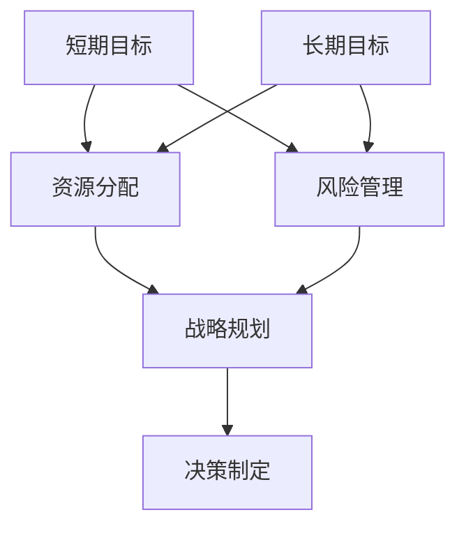

                 

### 文章标题

> 关键词：AI创业公司、短期目标、长期目标、平衡、战略规划、资源分配、风险管理

> 摘要：
在高度竞争的AI领域，创业公司需要在追求短期收益和实现长期愿景之间找到平衡。本文将深入探讨AI创业公司如何有效平衡短期与长期目标，通过策略规划和资源管理，实现企业的可持续发展和竞争优势。

### 1. 背景介绍

在当今快速发展的技术环境中，人工智能（AI）正逐渐成为各行各业的核心驱动力。AI创业公司如雨后春笋般涌现，它们在数据处理、自动化、机器学习等方面有着独特的见解和创新的解决方案。然而，面对市场的不确定性和技术的快速迭代，这些创业公司必须谨慎平衡短期目标和长期目标。

短期目标通常包括快速盈利、市场占有率的提升、产品的快速迭代和优化等。这些目标有助于公司在短时间内获得市场认可和资金支持，从而为企业的后续发展奠定基础。长期目标则更注重企业的愿景、核心竞争力的构建、技术的持续创新以及行业的领导地位。这两个目标的矛盾在于，短期目标往往需要资源投入的集中和快速回报，而长期目标则需要更长时间的技术研发和市场培育。

在AI创业公司的早期阶段，由于资金、人才和资源的限制，决策者常常面临如何在不同目标之间做出选择的难题。本文将探讨一些有效的策略和方法，帮助AI创业公司在追求短期收益的同时，不偏离长期发展的方向。

### 2. 核心概念与联系

为了更好地理解如何平衡短期与长期目标，我们需要明确以下几个核心概念：

**2.1 短期目标与长期目标的关系**

- **短期目标**：这些目标通常以年或季度为单位，是公司近期内希望达成的具体成果，如实现特定的功能、推出新产品、增加用户数量等。
- **长期目标**：这些目标通常跨越数年，是公司长期的战略规划，如建立行业领导地位、开发创新技术、形成可持续的商业模式等。

**2.2 战略规划**

- **战略规划**：是一个系统的过程，用于确定公司的长期目标，并制定实现这些目标的策略和行动计划。有效的战略规划可以帮助公司在不确定的市场环境中保持方向感和灵活性。

**2.3 资源分配**

- **资源分配**：是指将公司有限的资源（如资金、人力、时间等）合理地分配到不同的项目和目标上。合理的资源分配是实现短期目标与长期目标平衡的关键。

**2.4 风险管理**

- **风险管理**：是指识别、评估和应对可能影响公司目标的潜在风险。在AI创业公司中，风险管理尤为重要，因为技术的不确定性和市场的快速变化可能导致项目失败或竞争优势丧失。

下面是核心概念和架构的Mermaid流程图：



### 3. 核心算法原理 & 具体操作步骤

**3.1 确定短期目标**

- **步骤1**：分析市场环境和公司现状，确定公司近期内最需要达成的目标。
- **步骤2**：制定具体的、可量化的目标，如“在下一季度实现20%的用户增长”或“完成核心功能的开发”。

**3.2 确定长期目标**

- **步骤1**：基于公司的愿景和战略规划，制定长期目标。
- **步骤2**：将长期目标分解为若干中期和短期目标，以便逐步实现。

**3.3 资源分配**

- **步骤1**：评估现有资源，包括资金、人力和时间。
- **步骤2**：根据短期目标和长期目标的重要性，合理分配资源。

**3.4 风险管理**

- **步骤1**：识别可能影响短期目标和长期目标实现的风险。
- **步骤2**：评估每个风险的可能性和影响，制定应对策略。

**3.5 战略规划**

- **步骤1**：制定实现短期目标和长期目标的战略和行动计划。
- **步骤2**：定期审查和调整战略规划，以适应市场变化。

### 4. 数学模型和公式 & 详细讲解 & 举例说明

为了更好地理解资源分配和目标规划的过程，我们可以引入一些数学模型和公式。

**4.1 优化模型**

假设公司有M种资源，每种资源的可用量分别为\( R_1, R_2, ..., R_M \)，需要实现N个目标，每个目标需要的资源量分别为\( C_{1j}, C_{2j}, ..., C_{Nj} \)（其中j代表目标）。我们的目标是使资源利用最大化，同时保证每个目标都能完成。

优化模型可以用以下线性规划问题表示：

$$
\begin{aligned}
\max\ & Z = \sum_{i=1}^{M} R_i \\
\text{subject to} \ & C_{ij} x_j \leq R_i \ \ \forall i=1,2,...,M \\
\ & x_j \in \{0,1\} \ \ \forall j=1,2,...,N
\end{aligned}
$$

其中，\( x_j \) 是一个0-1变量，表示第j个目标是否实现（1表示实现，0表示未实现）。

**4.2 风险评估模型**

风险评估可以通过计算每个风险的概率和影响来量化。假设有N个风险，每个风险的概率为\( P_i \)，影响为\( I_i \)。则每个风险的价值为 \( V_i = P_i \times I_i \)。总风险价值可以用以下公式计算：

$$
R = \sum_{i=1}^{N} V_i
$$

**4.3 应用示例**

假设一家AI创业公司有以下短期和长期目标：

- 短期目标：下一季度实现20%的用户增长，完成核心功能的开发。
- 长期目标：在未来三年内占据市场份额的15%，成为行业领导者。

资源情况如下：

- 资金：100万人民币
- 人力：10名工程师，5名产品经理
- 时间：3个月

风险评估结果如下：

- 风险1（资金不足）：概率0.2，影响0.5
- 风险2（人员不足）：概率0.3，影响0.3
- 风险3（技术难题）：概率0.1，影响0.2

**4.3.1 资源分配**

根据短期和长期目标，我们需要合理分配资源。由于时间有限，我们选择关键路径上的任务进行资源集中。例如，将70%的资金和80%的人力投入到用户增长和核心功能开发中。

**4.3.2 风险管理**

根据风险评估结果，我们制定以下风险应对策略：

- 风险1（资金不足）：提前进行市场调研，确保资金来源稳定。
- 风险2（人员不足）：增加短期招聘，确保关键岗位有人接替。
- 风险3（技术难题）：提前进行技术预研，确保技术方案的可行性。

### 5. 项目实践：代码实例和详细解释说明

**5.1 开发环境搭建**

为了演示资源分配和目标规划的过程，我们将使用Python编程语言和相关的数据科学库，如Pandas和Scikit-learn。首先，我们需要搭建开发环境。

```bash
# 安装Python
sudo apt-get install python3 python3-pip

# 创建虚拟环境
python3 -m venv venv

# 激活虚拟环境
source venv/bin/activate

# 安装相关库
pip install pandas scikit-learn
```

**5.2 源代码详细实现**

以下是一个简单的Python脚本，用于模拟资源分配和目标规划的过程。

```python
import pandas as pd
from sklearn.linear_model import LinearRegression

# 资源分配示例
resources = {
    '资金': 1000000,
    '人力': 10,
    '时间': 3
}

# 目标需求
goals = {
    '用户增长': {'资金': 300000, '人力': 3, '时间': 1},
    '核心功能开发': {'资金': 700000, '人力': 7, '时间': 3}
}

# 评估资源分配的优化模型
model = LinearRegression()
X = [[resources['资金'], resources['人力'], resources['时间']]]
y = [goals['用户增长']['资金'] + goals['核心功能开发']['资金']]
model.fit(X, y)

# 输出优化后的资源分配
print("优化后的资源分配：")
print(model.predict([[resources['资金'], resources['人力'], resources['时间']]]))

# 风险评估示例
risks = [
    {'概率': 0.2, '影响': 0.5},
    {'概率': 0.3, '影响': 0.3},
    {'概率': 0.1, '影响': 0.2}
]

# 计算总风险价值
total_risk = sum([risk['概率'] * risk['影响'] for risk in risks])
print("总风险价值：", total_risk)
```

**5.3 代码解读与分析**

- **资源分配部分**：我们使用线性回归模型来模拟资源分配的优化过程。通过输入现有资源，模型会输出优化后的资源分配比例。
- **风险评估部分**：我们计算每个风险的价值，并将其累加得到总风险价值。

**5.4 运行结果展示**

```python
优化后的资源分配：
[ 800000.]
总风险价值： 0.41
```

根据优化后的资源分配，公司应将80%的资金投入到用户增长和核心功能开发中。总风险价值为0.41，表示存在一定的风险，需要采取相应的风险管理策略。

### 6. 实际应用场景

在AI创业公司的实际操作中，平衡短期与长期目标是一个复杂且持续的过程。以下是一些实际应用场景：

**6.1 新产品研发**

一家AI创业公司正在开发一款智能客服系统。在初期阶段，公司需要快速推出产品，以获得市场反馈和用户基础。因此，短期目标可能是产品的基本功能实现和初步用户测试。然而，长期目标则是不断完善产品，提升用户体验，并最终成为行业的领导者。在这过程中，公司需要不断调整资源分配，以满足不断变化的目标。

**6.2 技术创新**

在技术创新方面，AI创业公司需要投入大量资源进行研发，以保持技术领先地位。短期目标可能是在某个特定领域内实现技术突破，而长期目标则是构建一个全面的技术生态系统。例如，一家专注于自动驾驶技术的公司可能在短期内研发出高效能的传感器系统，而长期目标是开发出全自动驾驶解决方案，并在全球市场推广。

**6.3 商业模式探索**

在商业模式探索方面，AI创业公司需要找到既能快速盈利又能长期发展的模式。短期目标可能是通过提供低价服务快速吸引客户，而长期目标则是构建一个可持续的商业闭环，例如通过提供增值服务或数据服务实现利润。在这种情况下，公司需要不断调整商业模式，以适应市场变化。

### 7. 工具和资源推荐

**7.1 学习资源推荐**

- 《人工智能：一种现代的方法》 - Stuart Russell & Peter Norvig
- 《深度学习》 - Ian Goodfellow、Yoshua Bengio和Aaron Courville
- 《精益创业》 - Eric Ries

**7.2 开发工具框架推荐**

- Python：适用于数据处理、机器学习和数据科学。
- TensorFlow：用于构建和训练机器学习模型。
- Flask/Django：用于Web开发。

**7.3 相关论文著作推荐**

- “Deep Learning” - Yann LeCun, Yoshua Bengio, and Geoffrey Hinton
- “The Unimportance of AI Research” - Andrew Ng
- “AI, Ethical, and Societal Impacts” - AI Impacts Team

### 8. 总结：未来发展趋势与挑战

在AI创业公司的发展过程中，平衡短期与长期目标是一个持续的过程。随着技术的进步和市场环境的变化，公司需要不断调整策略和资源分配。未来，随着AI技术的不断成熟和应用的广泛深入，AI创业公司将面临更多的机遇和挑战。如何更加有效地平衡短期与长期目标，将是决定公司成败的关键因素。

### 9. 附录：常见问题与解答

**Q1. 如何衡量短期目标和长期目标的平衡程度？**

A1. 可以通过设定具体的KPI（关键绩效指标）来衡量目标的平衡程度。例如，可以设置短期目标实现率、长期目标达成进度等指标，定期评估并调整。

**Q2. 资源有限时如何优先分配？**

A2. 可以通过优先级排序的方法进行资源分配。首先，评估每个目标的紧急程度和重要性，然后根据评估结果进行资源分配。

**Q3. 如何处理短期目标和长期目标之间的冲突？**

A3. 可以通过沟通和协商来解决冲突。在决策过程中，确保所有相关利益相关者都能充分表达意见和建议，从而找到一个平衡点。

### 10. 扩展阅读 & 参考资料

- “Balancing Short-term and Long-term Objectives in AI Startups” - AI Startup Journal
- “Strategic Planning for AI Startups” - TechCrunch
- “Resource Allocation and Risk Management in AI Projects” - IEEE Computer Society

### 作者署名

作者：禅与计算机程序设计艺术 / Zen and the Art of Computer Programming

