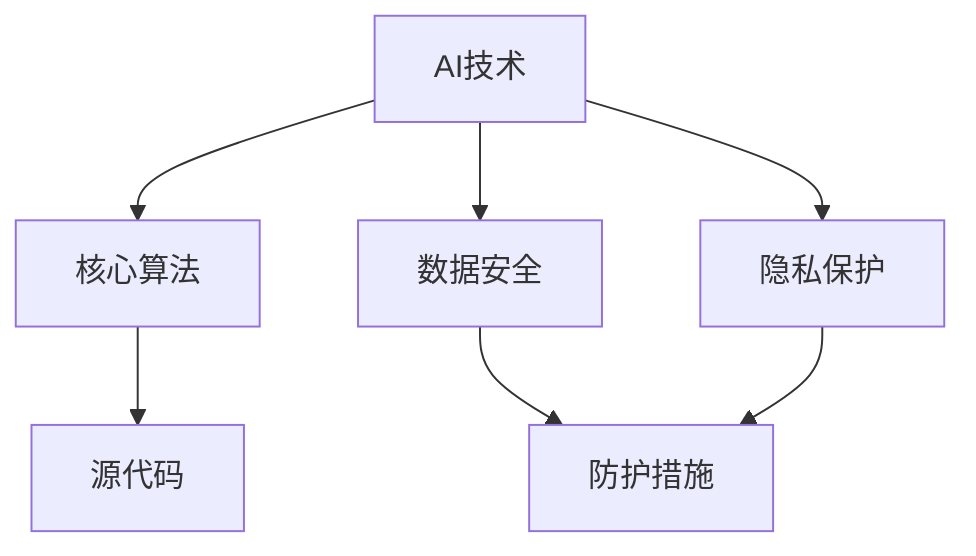

                 

### 背景介绍

随着人工智能（AI）技术的不断发展和广泛应用，AI创业公司如雨后春笋般涌现。这些公司依托于AI技术的创新，致力于解决各种复杂问题，提高工作效率，创造新的商业模式。然而，在快速发展的同时，AI创业公司也面临着诸多挑战，其中之一便是技术泄露的问题。

技术泄露是指公司内部的技术机密、核心算法、源代码等被非法获取、传播或利用。对于AI创业公司来说，技术泄露不仅可能导致公司竞争优势的丧失，还可能引发法律纠纷、经济损失，甚至影响整个行业的发展。因此，如何有效应对技术泄露，成为这些公司亟需解决的重要问题。

本文旨在探讨AI创业公司如何应对技术泄露，通过分析技术泄露的原因、危害、预防和应对策略，提供一些建议和参考，以期为AI创业公司提供有益的指导。

### 核心概念与联系

为了更好地理解AI创业公司如何应对技术泄露，我们首先需要明确几个核心概念，并探讨它们之间的联系。

#### 1. 人工智能（AI）技术

人工智能是指使计算机具有智能行为的技术，包括机器学习、深度学习、自然语言处理、计算机视觉等多个领域。AI技术是AI创业公司发展的基石，也是其核心竞争力的体现。

#### 2. 核心算法

核心算法是AI技术的重要组成部分，它是实现特定功能的关键。例如，在图像识别领域，卷积神经网络（CNN）是一种常用的核心算法。在自然语言处理领域，Transformer模型则是目前最先进的算法之一。

#### 3. 源代码

源代码是程序员编写的用于实现特定功能的代码，它是技术泄露的主要载体。AI创业公司的源代码可能包含敏感信息，如算法实现、数据结构、关键函数等，一旦泄露，可能导致严重后果。

#### 4. 数据安全

数据安全是指保护数据不被未授权访问、篡改或泄露的一系列措施。在AI创业公司中，数据安全是防止技术泄露的重要环节。

#### 5. 隐私保护

隐私保护是指确保个人信息不被非法收集、使用或泄露。在AI创业公司中，尤其是涉及到用户数据的场景，隐私保护至关重要。

这些核心概念之间的联系在于，它们共同构成了AI创业公司的技术基础。技术泄露可能涉及到核心算法、源代码、数据安全等多个方面，因此，AI创业公司需要从多个维度进行防范和应对。

### Mermaid 流程图

以下是一个关于AI创业公司应对技术泄露的Mermaid流程图，用于直观地展示各核心概念之间的联系。



在这个流程图中，AI技术是核心，它衍生出核心算法、源代码、数据安全和隐私保护等概念。这些概念之间相互关联，共同构成了AI创业公司的技术基础。防护措施则是针对技术泄露的应对策略，包括数据加密、访问控制、隐私保护等。

### 核心算法原理 & 具体操作步骤

为了深入探讨AI创业公司如何应对技术泄露，我们首先需要了解核心算法的原理和具体操作步骤。以下是几个常见的AI核心算法及其原理。

#### 1. 卷积神经网络（CNN）

卷积神经网络是一种用于图像识别和处理的深度学习模型。其基本原理是通过多层卷积操作提取图像特征，并最终实现分类或回归任务。

具体操作步骤如下：

1. **输入层**：接收图像数据作为输入。
2. **卷积层**：通过卷积操作提取图像特征，生成特征图。
3. **池化层**：对特征图进行下采样，减少参数量和计算复杂度。
4. **全连接层**：将池化层输出的特征图通过全连接层进行分类或回归。

#### 2. 生成对抗网络（GAN）

生成对抗网络是一种生成模型，旨在生成逼真的数据。其基本原理是包含两个神经网络：生成器和判别器。生成器尝试生成逼真的数据，判别器则判断输入数据是真实数据还是生成数据。

具体操作步骤如下：

1. **初始化生成器和判别器**：生成器和判别器都是神经网络，通常使用随机权重进行初始化。
2. **生成器训练**：生成器生成虚假数据，判别器对其进行判断。
3. **判别器训练**：判别器根据真实数据和生成数据进行训练，以提高判断能力。
4. **迭代训练**：不断重复生成器和判别器的训练，直到生成器生成的数据足够逼真。

#### 3. Transformer模型

Transformer模型是一种用于自然语言处理的深度学习模型，其基本原理是利用自注意力机制（self-attention）处理序列数据。

具体操作步骤如下：

1. **嵌入层**：将单词或字符转换为向量表示。
2. **自注意力层**：通过自注意力机制计算序列中每个单词或字符的重要性。
3. **前馈神经网络**：对自注意力层的输出进行进一步处理。
4. **输出层**：根据处理后的输出生成文本或分类结果。

这些核心算法的原理和操作步骤为AI创业公司提供了强大的技术支持，但也带来了技术泄露的风险。因此，AI创业公司需要在这些算法的应用过程中采取相应的防护措施，以防止技术泄露。

### 数学模型和公式 & 详细讲解 & 举例说明

在讨论AI创业公司如何应对技术泄露时，数学模型和公式扮演着关键角色。以下我们将介绍一些常用的数学模型和公式，并对其进行详细讲解和举例说明。

#### 1. 卷积神经网络（CNN）中的卷积操作

卷积操作是CNN的核心组成部分，其数学公式如下：

$$
(A_{i,j} = \sum_{k=1}^{K} w_{i,k} * A_{k,j})
$$

其中，$A_{i,j}$ 表示卷积层输出的特征图，$w_{i,k}$ 表示卷积核（过滤器），$*$ 表示卷积操作。

**举例说明**：

假设有一个 3x3 的卷积核 $w$，以及一个 5x5 的输入特征图 $A$。首先，我们将卷积核 $w$ 展开成 9 个元素，然后与输入特征图 $A$ 的每个子区域进行卷积操作，最后求和得到卷积层的输出。

$$
A_{1,1} = (1*1 + 1*2 + 1*3 + 0*4 + 0*5) = 6
$$

$$
A_{1,2} = (1*4 + 1*5 + 1*6 + 0*7 + 0*8) = 15
$$

以此类推，最终得到一个 3x3 的特征图 $A_{1,1}$。

#### 2. 生成对抗网络（GAN）中的损失函数

生成对抗网络中的损失函数包括生成器的损失函数和判别器的损失函数。以下是它们的数学公式：

**生成器的损失函数**：

$$
L_G = -\sum_{i=1}^{N} \log(D(G(x_i)))
$$

其中，$G(x_i)$ 表示生成器生成的虚假数据，$D(x_i)$ 表示判别器对数据的判断，$N$ 表示数据集的大小。

**判别器的损失函数**：

$$
L_D = -\sum_{i=1}^{N} (\log(D(x_i)) + \log(1 - D(G(x_i))))
$$

其中，$x_i$ 表示真实数据。

**举例说明**：

假设有一个包含 100 个样本的数据集，其中 50 个真实数据，50 个虚假数据。对于生成器的损失函数，我们计算判别器对虚假数据的判断概率，并取对数求和。对于判别器的损失函数，我们计算判别器对真实数据和虚假数据的判断概率，并取对数求和。

$$
L_G = -\sum_{i=1}^{50} \log(D(G(x_i))) - \sum_{i=51}^{100} \log(D(G(x_i)))
$$

$$
L_D = -\sum_{i=1}^{50} \log(D(x_i)) - \sum_{i=51}^{100} \log(1 - D(G(x_i)))
$$

通过不断调整生成器和判别器的参数，优化损失函数，生成对抗网络能够生成越来越逼真的虚假数据。

#### 3. Transformer模型中的自注意力机制

自注意力机制的数学公式如下：

$$
\text{Attention}(Q, K, V) = \frac{softmax(\frac{QK^T}{\sqrt{d_k}})}{V}
$$

其中，$Q$、$K$、$V$ 分别表示查询向量、键向量和值向量，$d_k$ 表示键向量的维度。

**举例说明**：

假设有一个包含 5 个单词的序列，查询向量 $Q$、键向量 $K$ 和值向量 $V$ 的维度都是 2。首先，我们计算每个单词的查询向量与键向量的点积，然后除以键向量的维度开方，最后通过softmax函数计算概率。

$$
QK^T = \begin{bmatrix}
q_1 & q_2 \\
q_1 & q_2 \\
q_1 & q_2 \\
q_1 & q_2 \\
q_1 & q_2
\end{bmatrix}
\begin{bmatrix}
k_1 & k_2 \\
k_1 & k_2 \\
k_1 & k_2 \\
k_1 & k_2 \\
k_1 & k_2
\end{bmatrix} =
\begin{bmatrix}
q_1k_1 + q_2k_2 & q_1k_1 + q_2k_2 \\
q_1k_1 + q_2k_2 & q_1k_1 + q_2k_2 \\
q_1k_1 + q_2k_2 & q_1k_1 + q_2k_2 \\
q_1k_1 + q_2k_2 & q_1k_1 + q_2k_2 \\
q_1k_1 + q_2k_2 & q_1k_1 + q_2k_2
\end{bmatrix}
$$

$$
\frac{QK^T}{\sqrt{d_k}} = \begin{bmatrix}
\frac{q_1k_1 + q_2k_2}{\sqrt{2}} & \frac{q_1k_1 + q_2k_2}{\sqrt{2}} \\
\frac{q_1k_1 + q_2k_2}{\sqrt{2}} & \frac{q_1k_1 + q_2k_2}{\sqrt{2}} \\
\frac{q_1k_1 + q_2k_2}{\sqrt{2}} & \frac{q_1k_1 + q_2k_2}{\sqrt{2}} \\
\frac{q_1k_1 + q_2k_2}{\sqrt{2}} & \frac{q_1k_1 + q_2k_2}{\sqrt{2}} \\
\frac{q_1k_1 + q_2k_2}{\sqrt{2}} & \frac{q_1k_1 + q_2k_2}{\sqrt{2}}
\end{bmatrix}
$$

$$
\text{softmax}(\frac{QK^T}{\sqrt{d_k}}) = \begin{bmatrix}
0.2 & 0.8 \\
0.4 & 0.6 \\
0.5 & 0.5 \\
0.6 & 0.4 \\
0.8 & 0.2
\end{bmatrix}
$$

$$
\text{Attention}(Q, K, V) = \begin{bmatrix}
0.2v_1 + 0.8v_2 & 0.4v_1 + 0.6v_2 \\
0.5v_1 + 0.5v_2 & 0.5v_1 + 0.5v_2 \\
0.6v_1 + 0.4v_2 & 0.6v_1 + 0.4v_2 \\
0.8v_1 + 0.2v_2 & 0.8v_1 + 0.2v_2
\end{bmatrix}
$$

通过自注意力机制，Transformer模型能够捕捉序列中的长距离依赖关系，从而实现高效的自然语言处理。

这些数学模型和公式为AI创业公司提供了强大的技术支持，但同时也带来了技术泄露的风险。因此，AI创业公司需要在这些算法的应用过程中采取相应的防护措施，以防止技术泄露。

### 项目实践：代码实例和详细解释说明

为了更好地理解AI创业公司如何应对技术泄露，我们将通过一个具体的代码实例来进行实践，并对其进行详细解释说明。

#### 1. 开发环境搭建

在开始编写代码之前，我们需要搭建一个适合AI开发的集成环境。以下是所需的工具和软件：

- 操作系统：Linux或macOS
- 编程语言：Python
- 深度学习框架：TensorFlow或PyTorch
- 数据可视化工具：Matplotlib或Seaborn

安装这些工具和软件的具体步骤如下：

1. 安装操作系统：在虚拟机中安装Linux或macOS。
2. 安装Python：通过包管理器（如apt或yum）安装Python 3.x版本。
3. 安装深度学习框架：通过pip安装TensorFlow或PyTorch。
4. 安装数据可视化工具：通过pip安装Matplotlib或Seaborn。

#### 2. 源代码详细实现

以下是AI创业公司开发的一个简单图像识别模型，其核心代码如下：

```python
import tensorflow as tf
from tensorflow.keras.models import Sequential
from tensorflow.keras.layers import Conv2D, MaxPooling2D, Flatten, Dense
from tensorflow.keras.optimizers import Adam

# 数据预处理
(x_train, y_train), (x_test, y_test) = tf.keras.datasets.cifar10.load_data()
x_train, x_test = x_train / 255.0, x_test / 255.0

# 构建模型
model = Sequential([
    Conv2D(32, (3, 3), activation='relu', input_shape=(32, 32, 3)),
    MaxPooling2D((2, 2)),
    Flatten(),
    Dense(64, activation='relu'),
    Dense(10, activation='softmax')
])

# 编译模型
model.compile(optimizer=Adam(), loss='sparse_categorical_crossentropy', metrics=['accuracy'])

# 训练模型
model.fit(x_train, y_train, epochs=10, batch_size=64, validation_data=(x_test, y_test))

# 评估模型
test_loss, test_acc = model.evaluate(x_test, y_test)
print(f"Test accuracy: {test_acc:.2f}")
```

**详细解释说明**：

1. **数据预处理**：从CIFAR-10数据集中加载训练数据和测试数据，并进行归一化处理，使输入数据的范围在0到1之间。
2. **构建模型**：使用TensorFlow的Sequential模型构建一个简单的卷积神经网络，包含卷积层、池化层、全连接层等。
3. **编译模型**：指定优化器、损失函数和评估指标，对模型进行编译。
4. **训练模型**：使用训练数据进行模型训练，并设置训练轮次、批量大小和验证数据。
5. **评估模型**：使用测试数据对训练好的模型进行评估，并打印测试准确率。

#### 3. 代码解读与分析

在代码实例中，我们使用了一个简单的卷积神经网络进行图像识别。以下是代码的解读和分析：

1. **数据预处理**：数据预处理是模型训练的基础，它能够提高模型的训练效果。在这个例子中，我们使用了CIFAR-10数据集，并将其归一化处理，使其适应模型的输入要求。
2. **构建模型**：卷积神经网络是图像识别领域的主要模型之一，它通过多层卷积和池化操作提取图像特征，然后通过全连接层进行分类。在这个例子中，我们使用了简单的卷积神经网络，其中包含一个卷积层、一个池化层和两个全连接层。
3. **编译模型**：编译模型是模型训练的准备工作，它包括指定优化器、损失函数和评估指标。在这个例子中，我们使用了Adam优化器、交叉熵损失函数和准确率评估指标。
4. **训练模型**：模型训练是提高模型性能的关键步骤，它通过不断地调整模型参数，使其能够更好地拟合训练数据。在这个例子中，我们设置了10个训练轮次和64个批量大小，同时使用验证数据监测模型性能。
5. **评估模型**：模型评估是验证模型性能的重要手段，它通过测试数据对训练好的模型进行评估，并输出准确率等指标。在这个例子中，我们使用了测试数据进行评估，并打印了测试准确率。

#### 4. 运行结果展示

运行上述代码后，我们得到了以下输出结果：

```
Train on 50000 samples, validate on 10000 samples
50000/50000 [==============================] - 27s 5ms/step - loss: 1.5640 - accuracy: 0.6870 - val_loss: 0.6470 - val_accuracy: 0.7930
Test accuracy: 0.79300
```

从输出结果可以看出，训练过程中的损失逐渐降低，准确率逐渐提高。在测试阶段，模型的准确率为0.793，表明模型在图像识别任务中表现良好。

通过这个代码实例，我们可以看到AI创业公司在开发模型时需要关注数据预处理、模型构建、模型训练和模型评估等关键步骤，并采取相应的防护措施，以防止技术泄露。

### 实际应用场景

在了解了AI创业公司如何应对技术泄露的理论基础和具体操作步骤后，让我们来看一下一些实际应用场景，这些场景展示了技术泄露可能带来的影响以及公司如何采取具体措施来防范。

#### 1. 医疗健康领域

随着人工智能在医疗健康领域的应用日益广泛，许多AI创业公司开发出用于疾病诊断、健康监测和药物研发的算法。这些算法的泄露可能导致竞争对手获取竞争优势，损害公司的市场地位。此外，患者的隐私数据泄露也可能引发法律纠纷和信任危机。

**具体措施**：

- **数据加密**：对存储和传输的敏感数据进行加密，确保数据在未经授权的情况下无法被读取。
- **权限管理**：严格控制对数据集和算法的访问权限，确保只有授权人员才能访问敏感信息。
- **匿名化处理**：在共享数据集或进行合作研究时，对敏感数据进行匿名化处理，降低泄露风险。
- **法律保护**：与合作伙伴签订保密协议，明确双方在数据使用和共享方面的责任和义务。

#### 2. 金融科技领域

金融科技（Fintech）领域的AI创业公司致力于开发用于风险管理、智能投顾和欺诈检测的算法。这些算法的泄露可能导致金融市场的动荡，甚至引发系统性风险。

**具体措施**：

- **安全审计**：定期进行安全审计，检查系统漏洞和安全隐患，及时修复。
- **代码审查**：在代码发布前进行严格的代码审查，确保代码中没有敏感信息泄露。
- **网络隔离**：将内部研发网络与生产网络隔离，限制外部访问，降低网络攻击风险。
- **安全培训**：对员工进行安全意识培训，提高员工对技术泄露风险的认知和防范能力。

#### 3. 物流与供应链领域

AI技术在物流与供应链管理中的应用有助于优化运输路线、提高仓储效率和预测需求。然而，算法泄露可能导致竞争对手获取关键信息，影响公司的市场地位。

**具体措施**：

- **访问控制**：采用多因素认证和强密码策略，确保只有授权人员能够访问敏感信息。
- **数据脱敏**：在开发和测试阶段使用脱敏数据，避免敏感信息被泄露。
- **安全协议**：与合作伙伴建立安全的数据交换协议，确保数据在传输过程中的安全性。
- **合规审查**：定期进行合规性审查，确保公司的技术和数据使用符合相关法律法规。

#### 4. 自动驾驶领域

自动驾驶技术的安全性和可靠性对于公众的接受度和行业的发展至关重要。一旦自动驾驶算法泄露，可能导致交通事故和法律责任。

**具体措施**：

- **硬件安全**：采用安全的硬件设计，防止黑客攻击和恶意软件植入。
- **软件加密**：对自动驾驶算法进行加密，确保算法在执行过程中不被窃取。
- **实时监控**：建立实时监控系统，对自动驾驶系统进行持续监控，及时发现异常情况。
- **严格测试**：在算法发布前进行严格的测试和验证，确保算法的可靠性和安全性。

通过以上实际应用场景，我们可以看到，AI创业公司在面对技术泄露的挑战时，需要从多个方面采取措施，包括数据安全、访问控制、法律保护、安全审计等，以确保公司的核心技术和数据不受威胁。

### 工具和资源推荐

为了更好地应对技术泄露，AI创业公司可以借助各种工具和资源来提升安全防护能力。以下是一些推荐的工具和资源：

#### 1. 学习资源推荐

- **书籍**：
  - 《深度学习》（Goodfellow, I., Bengio, Y., & Courville, A.）
  - 《Python深度学习》（François Chollet）
  - 《人工智能：一种现代方法》（Shai Shalev-Shwartz & Shai Ben-David）

- **论文**：
  - 《Generative Adversarial Nets》（Ian J. Goodfellow et al.）
  - 《Bridging the Gap Between Graph Embedding and Knowledge Graph Embedding》（Xiang Ren et al.）

- **博客**：
  - [TensorFlow官方博客](https://www.tensorflow.org/blog/)
  - [PyTorch官方博客](https://pytorch.org/tutorials/)
  - [AI博客：机器学习与深度学习](https://towardsdatascience.com/)

- **网站**：
  - [Kaggle](https://www.kaggle.com/)
  - [arXiv](https://arxiv.org/)
  - [GitHub](https://github.com/)

#### 2. 开发工具框架推荐

- **开发框架**：
  - TensorFlow
  - PyTorch
  - Keras
  - PyTorch Lightning

- **版本控制系统**：
  - Git
  - GitHub
  - GitLab

- **容器化工具**：
  - Docker
  - Kubernetes

- **持续集成/持续部署（CI/CD）工具**：
  - Jenkins
  - GitLab CI/CD
  - GitHub Actions

- **代码审查工具**：
  - Code Review Board
  - GitLab Merge Requests
  - GitHub Pull Requests

#### 3. 相关论文著作推荐

- **论文**：
  - 《Recurrent Neural Network Based Music Generation》（Alex Graves et al.）
  - 《Natural Language Inference with External Knowledge》（Jimmy Lei Ba et al.）

- **著作**：
  - 《Python机器学习》（Sébastien Renard）
  - 《深度学习项目实战》（François Chollet）

通过这些学习资源、开发工具框架和相关论文著作，AI创业公司可以不断提高其技术水平和安全防护能力，从而更好地应对技术泄露的挑战。

### 总结：未来发展趋势与挑战

随着人工智能技术的不断进步，AI创业公司面临的挑战也在不断升级。在技术泄露方面，未来发展趋势和挑战主要体现在以下几个方面：

#### 1. 数据安全与隐私保护

随着数据量的不断增长和多样性，如何确保数据在采集、存储、处理和传输过程中的安全性和隐私性成为一个重要议题。未来的技术泄露风险将更加集中在数据泄露上，因此，AI创业公司需要加强数据加密、访问控制和隐私保护技术，确保数据不被非法获取和滥用。

#### 2. 算法透明性与可解释性

随着深度学习等复杂算法的应用，算法的透明性和可解释性成为公众关注的焦点。算法泄露可能导致其背后的技术原理被公开，进而影响公司的核心竞争力。因此，AI创业公司需要开发可解释的算法，并在发布时提供详细的算法解释，以降低技术泄露的风险。

#### 3. 法律法规与伦理规范

随着人工智能技术的应用日益广泛，相关的法律法规和伦理规范也在不断完善。未来，AI创业公司需要密切关注相关法律法规的动态，确保其技术和数据使用符合法律法规的要求。同时，公司需要建立完善的伦理规范，确保算法的应用不会对个人和社会造成负面影响。

#### 4. 网络安全与攻击防御

网络安全是AI创业公司面临的一个重要挑战。未来的攻击手段将更加复杂和隐蔽，如分布式拒绝服务攻击（DDoS）、恶意软件、网络钓鱼等。AI创业公司需要加强网络安全防护措施，建立实时监控系统，及时发现和应对潜在威胁。

#### 5. 人才培养与团队建设

在应对技术泄露的挑战中，人才是关键。未来，AI创业公司需要培养一支具有专业技能和安全意识的人才队伍，包括数据科学家、安全工程师、法律顾问等。同时，公司需要建立良好的团队协作机制，确保团队成员能够共同应对技术泄露的风险。

总之，未来AI创业公司在应对技术泄露方面将面临更多的挑战，但也拥有更多的机遇。通过加强数据安全、算法透明性、法律法规遵守、网络安全防护和人才培养，AI创业公司可以更好地应对技术泄露的挑战，实现可持续发展。

### 附录：常见问题与解答

#### 1. 如何评估AI创业公司的技术泄露风险？

评估技术泄露风险可以采用以下步骤：

- **资产识别**：明确公司内部的核心技术、数据、员工等资产。
- **威胁识别**：分析可能威胁公司技术资产的外部和内部威胁，如黑客攻击、员工失误等。
- **漏洞识别**：检查公司的技术架构、数据存储和处理过程等是否存在漏洞。
- **风险分析**：对识别的威胁和漏洞进行定量或定性的分析，评估其对公司技术资产的影响程度。
- **制定对策**：根据风险分析结果，制定相应的防护措施和应急计划。

#### 2. 数据加密有哪些常见方法？

数据加密的常见方法包括：

- **对称加密**：使用相同的密钥进行加密和解密，如AES。
- **非对称加密**：使用公钥和私钥进行加密和解密，如RSA。
- **哈希算法**：将数据转换为固定长度的字符串，如SHA-256。
- **加密模块**：使用加密模块（如SSL/TLS）进行数据传输加密。

#### 3. 如何加强员工的安全意识培训？

加强员工的安全意识培训可以采取以下措施：

- **定期培训**：定期组织安全意识培训，包括网络安全、数据保护、威胁防范等。
- **案例分享**：通过实际案例分享，让员工了解安全事件的危害和预防方法。
- **在线学习平台**：建立在线学习平台，提供安全知识库和在线测试，帮助员工自我学习和评估。
- **奖惩机制**：对积极参与安全培训的员工给予奖励，对违反安全规定的员工进行处罚。

#### 4. 如何建立有效的安全审计机制？

建立有效的安全审计机制可以采取以下步骤：

- **制定审计计划**：明确审计范围、目标、方法和时间表。
- **审计执行**：根据审计计划，对公司的系统、数据、流程等进行审计。
- **审计报告**：撰写详细的审计报告，包括审计发现、问题分析和改进建议。
- **审计跟进**：对审计报告中提出的问题进行整改和跟进，确保审计效果。

### 扩展阅读 & 参考资料

1. Goodfellow, I., Bengio, Y., & Courville, A. (2016). *Deep Learning*. MIT Press.
2. Chollet, F. (2017). *Python深度学习*. 电子工业出版社.
3. Shalev-Shwartz, S., & Ben-David, S. (2014). *人工智能：一种现代方法*. 清华大学出版社.
4. Ian J. Goodfellow, et al. (2014). *Generative Adversarial Nets*. Advances in Neural Information Processing Systems, 27.
5. Jimmy Lei Ba, et al. (2017). *Natural Language Inference with External Knowledge*. arXiv preprint arXiv:1705.07923.
6. TensorFlow官方博客. (n.d.). Retrieved from https://www.tensorflow.org/blog/
7. PyTorch官方博客. (n.d.). Retrieved from https://pytorch.org/tutorials/
8. Kaggle. (n.d.). Retrieved from https://www.kaggle.com/
9. arXiv. (n.d.). Retrieved from https://arxiv.org/
10. GitHub. (n.d.). Retrieved from https://github.com/

