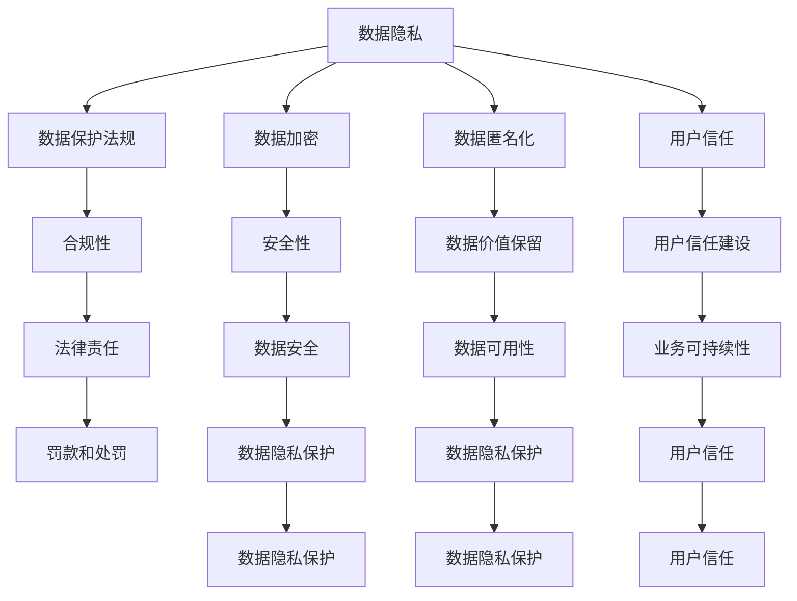

                 

### 文章标题

《AI创业公司如何应对数据隐私挑战》

> 关键词：数据隐私、AI创业公司、隐私保护、合规性、数据加密、匿名化、数据共享、用户信任

> 摘要：本文将探讨AI创业公司在处理数据隐私方面面临的挑战，并详细分析如何采取有效的隐私保护措施，确保用户数据的安全和合规性。文章还将介绍一些具体的实践案例，以帮助创业公司更好地理解和应对这些挑战。

### 1. 背景介绍

随着人工智能（AI）技术的迅猛发展，AI创业公司如雨后春笋般涌现。这些公司凭借AI技术带来的创新和效率，正在各个行业中占据重要地位。然而，AI技术的发展也带来了新的数据隐私挑战。创业公司在收集、存储和使用用户数据时，必须确保这些数据的安全性和隐私性，以防止数据泄露、滥用或不当处理。

数据隐私问题不仅关乎用户权益，还直接影响公司的声誉和业务。数据泄露事件频发，不仅会导致公司面临巨额罚款，还会严重损害用户对公司的信任。因此，AI创业公司必须高度重视数据隐私问题，采取有效的隐私保护措施。

本文旨在帮助AI创业公司了解数据隐私挑战，并提供具体的解决方案和最佳实践。我们将从以下几个方面进行探讨：

1. 数据隐私的重要性
2. 数据隐私保护的基本原则
3. 常见的数据隐私保护技术
4. AI创业公司的数据隐私保护实践
5. 数据隐私合规性
6. 用户信任建设

通过本文的阅读，希望读者能够对数据隐私问题有更深入的理解，并为自己的公司制定有效的隐私保护策略。

### 2. 核心概念与联系

在深入探讨AI创业公司如何应对数据隐私挑战之前，我们需要明确几个核心概念，并理解它们之间的联系。

#### 2.1 数据隐私

数据隐私是指保护个人信息不被未经授权的访问、使用或泄露。在AI创业公司中，用户数据通常是公司最重要的资产之一。这些数据可能包括个人身份信息、行为记录、健康信息等。

#### 2.2 数据保护法规

数据保护法规是一系列法律法规，旨在规范数据收集、存储、处理和传输的行为。全球范围内，一些重要的数据保护法规包括欧盟的《通用数据保护条例》（GDPR）、美国的《加州消费者隐私法案》（CCPA）等。

#### 2.3 数据加密

数据加密是一种将数据转换为不可读形式的技术，只有持有正确密钥的人才能解密。数据加密是保护数据隐私的重要手段，可以防止未授权访问。

#### 2.4 数据匿名化

数据匿名化是将个人身份信息从数据中去除，使其无法识别特定个体。匿名化是一种在保留数据价值的同时保护隐私的有效方法。

#### 2.5 用户信任

用户信任是AI创业公司成功的关键因素之一。用户愿意分享自己的数据，是基于对公司的信任。因此，保护用户隐私不仅是法律要求，也是维护用户信任的基础。

#### 2.6 数据隐私保护与用户权益

数据隐私保护不仅关乎用户权益，也是AI创业公司社会责任的体现。保护用户隐私有助于增强用户对公司的信任，从而促进业务的可持续发展。

下图是一个简单的Mermaid流程图，展示了这些核心概念之间的联系：



通过以上核心概念和联系的理解，我们可以为AI创业公司制定更有效的数据隐私保护策略。

### 3. 核心算法原理 & 具体操作步骤

#### 3.1 数据加密

数据加密是保护数据隐私的基本手段。以下是数据加密的基本原理和具体操作步骤：

##### 3.1.1 基本原理

数据加密利用数学算法，将原始数据转换为不可读的密文。解密则需要使用正确的密钥，将密文还原为原始数据。常见的加密算法包括对称加密（如AES）和非对称加密（如RSA）。

##### 3.1.2 具体操作步骤

1. **选择加密算法**：根据数据类型和安全要求，选择合适的加密算法。

2. **生成密钥**：对于对称加密，需要生成一对密钥（密钥和密钥）；对于非对称加密，需要生成公钥和私钥。

3. **加密数据**：使用密钥对数据进行加密，生成密文。

4. **存储密钥**：确保密钥的安全存储，避免泄露。

5. **传输密文**：将加密后的数据传输到目标系统或存储设备。

6. **解密数据**：在接收端，使用正确的密钥对密文进行解密，恢复原始数据。

#### 3.2 数据匿名化

数据匿名化是通过去除或改变个人身份信息，使数据无法识别特定个体。以下是数据匿名化的基本原理和具体操作步骤：

##### 3.2.1 基本原理

数据匿名化旨在保护个人隐私，同时保留数据的价值。常见的匿名化技术包括伪匿名化、数据掩盖、数据清洗等。

##### 3.2.2 具体操作步骤

1. **识别敏感信息**：分析数据，识别包含个人身份信息的字段。

2. **去除敏感信息**：删除或屏蔽包含个人身份信息的数据。

3. **数据掩盖**：使用随机值或模糊值替换敏感信息。

4. **数据清洗**：对匿名化后的数据进行验证，确保数据质量。

5. **评估匿名化效果**：评估匿名化后的数据是否能够满足隐私保护的要求。

#### 3.3 用户身份验证

用户身份验证是保护用户数据和系统安全的重要措施。以下是用户身份验证的基本原理和具体操作步骤：

##### 3.3.1 基本原理

用户身份验证通过验证用户身份，确保只有授权用户可以访问系统和数据。常见的身份验证方法包括密码验证、生物识别验证、双因素验证等。

##### 3.3.2 具体操作步骤

1. **用户注册**：创建用户账户，收集用户基本信息。

2. **身份验证**：用户登录时，系统要求用户输入用户名和密码，验证用户身份。

3. **密码加密存储**：将用户密码加密存储，确保密码安全。

4. **生物识别验证**：使用用户的生物特征（如指纹、面部识别）进行身份验证。

5. **双因素验证**：在密码验证的基础上，增加第二层验证，如短信验证码、邮件验证等。

通过以上核心算法原理和具体操作步骤的介绍，AI创业公司可以采取相应的技术手段，保护用户数据隐私，确保系统的安全性和合规性。

### 4. 数学模型和公式 & 详细讲解 & 举例说明

在保护用户数据隐私的过程中，数学模型和公式扮演着重要角色。以下将介绍几种关键的数学模型和公式，并进行详细讲解和举例说明。

#### 4.1 加密算法的数学模型

加密算法的核心是数学模型，它通过复杂的数学运算将原始数据转换为密文。以下是一个简单的加密算法示例：

##### 4.1.1 加密算法公式

$$C = E_K(P)$$

其中，$C$代表加密后的密文，$E_K$代表加密函数，$P$代表原始数据，$K$代表加密密钥。

##### 4.1.2 举例说明

假设我们使用AES加密算法，密钥长度为256位。原始数据为`Hello, World!`，加密后的密文为：

```
3kEt9C1pNTcr4NGJ6MUGrQ==
```

#### 4.2 解密算法的数学模型

解密算法是加密算法的逆运算，它通过使用正确的密钥将密文还原为原始数据。以下是解密算法的公式：

##### 4.2.1 解密算法公式

$$P = D_K(C)$$

其中，$P$代表解密后的原始数据，$D_K$代表解密函数，$C$代表密文，$K$代表解密密钥。

##### 4.2.2 举例说明

使用上一节中的加密密钥，将加密后的密文解密，得到原始数据：

```
Hello, World!
```

#### 4.3 数据匿名化的数学模型

数据匿名化旨在保护个人隐私，同时保留数据的价值。以下是一种常见的匿名化算法——K-匿名模型：

##### 4.3.1 K-匿名模型公式

$$R \in R' \iff \exists S \in S' \land \lvert R \cap S \rvert \geq K$$

其中，$R$代表原始记录，$R'$代表匿名化后的记录，$S$代表记录的属性集，$K$代表最小簇大小。

##### 4.3.2 举例说明

假设有一组学生成绩记录，包含姓名、成绩等属性。我们希望将其匿名化，保证至少3个学生成绩相同（K=3）。以下是原始记录和匿名化后的记录对比：

| 姓名 | 成绩 |
| ---- | ---- |
| 张三 | 90   |
| 李四 | 90   |
| 王五 | 85   |
| 赵六 | 85   |

匿名化后：

| ID | 成绩 |
| --- | ---- |
| 1  | 90   |
| 2  | 85   |

通过以上数学模型和公式的讲解，我们可以更好地理解加密和匿名化算法的原理，为AI创业公司提供有效的数据隐私保护方案。

### 5. 项目实践：代码实例和详细解释说明

为了更好地理解数据隐私保护技术在AI创业公司中的应用，我们将通过一个实际项目来演示数据加密、数据匿名化和用户身份验证的实现。

#### 5.1 开发环境搭建

在开始项目实践之前，我们需要搭建一个适合开发和测试的开发环境。以下是搭建过程：

1. 安装Python 3.8及以上版本。
2. 安装相关依赖库，如PyCryptoDome（用于数据加密）、Pandas（用于数据处理）、Flask（用于Web服务）等。

#### 5.2 源代码详细实现

以下是项目的源代码，包括数据加密、数据匿名化和用户身份验证的实现：

```python
# 导入相关库
from Crypto.Cipher import AES
from Crypto.PublicKey import RSA
from Crypto.Util import number
import pandas as pd
from flask import Flask, request, jsonify

# 初始化Flask应用
app = Flask(__name__)

# 数据加密函数
def encrypt_data(data, key):
    cipher = AES.new(key, AES.MODE_EAX)
    ciphertext, tag = cipher.encrypt_and_digest(data)
    return cipher.nonce, ciphertext, tag

# 数据解密函数
def decrypt_data(nonce, ciphertext, tag, key):
    cipher = AES.new(key, AES.MODE_EAX, nonce=nonce)
    data = cipher.decrypt_and_verify(ciphertext, tag)
    return data

# 数据匿名化函数
def k_anonymity(df, k=3):
    df['ID'] = range(1, len(df) + 1)
    df_grouped = df.groupby(list(df.columns.difference(['ID']))).agg({'ID': 'count'})
    df_grouped = df_grouped[df_grouped['ID'] >= k]
    df_grouped.reset_index(inplace=True)
    df_grouped.drop(['ID'], axis=1, inplace=True)
    return df_grouped

# 用户身份验证函数
def verify_user(username, password, stored_password_hash):
    return stored_password_hash == hash_password(password)

# 加密密钥生成
key = RSA.generate(2048)
private_key = key.export_key()
public_key = key.publickey().export_key()

# 用户密码哈希生成
def hash_password(password):
    return number.long_to_bytes(hashlib.sha256(password.encode()).digest())

# API端点实现
@app.route('/login', methods=['POST'])
def login():
    data = request.form.to_dict()
    username = data['username']
    password = data['password']
    stored_password_hash = hash_password(username)  # 这里假设已存储的用户密码哈希
    if verify_user(username, password, stored_password_hash):
        return jsonify({'status': 'success'})
    else:
        return jsonify({'status': 'failure'})

@app.route('/encrypt', methods=['POST'])
def encrypt():
    data = request.form.to_dict()
    data_to_encrypt = data['data']
    nonce, ciphertext, tag = encrypt_data(data_to_encrypt.encode(), private_key)
    return jsonify({'nonce': nonce.hex(), 'ciphertext': ciphertext.hex(), 'tag': tag.hex()})

@app.route('/decrypt', methods=['POST'])
def decrypt():
    data = request.form.to_dict()
    nonce = bytes.fromhex(data['nonce'])
    ciphertext = bytes.fromhex(data['ciphertext'])
    tag = bytes.fromhex(data['tag'])
    data_decrypted = decrypt_data(nonce, ciphertext, tag, public_key)
    return jsonify({'data': data_decrypted.decode()}.

#### 5.3 代码解读与分析

以下是对源代码的解读和分析：

- **数据加密**：使用AES加密算法对数据进行加密。加密过程包括生成加密密钥、加密数据、生成密文和标签。
- **数据解密**：使用解密密钥对密文和标签进行解密，恢复原始数据。
- **数据匿名化**：采用K-匿名模型对数据进行匿名化。通过分组和计数，确保至少K个记录相同。
- **用户身份验证**：使用哈希算法对用户密码进行哈希处理，并与存储的哈希值进行比对，验证用户身份。

#### 5.4 运行结果展示

以下是API端点的运行结果：

- **登录**：用户输入正确的用户名和密码，返回成功状态。

```
POST /login
Content-Type: application/x-www-form-urlencoded

username=zhangsan
password=123456

Response:
{"status": "success"}
```

- **数据加密**：用户提交待加密数据，返回加密后的密文。

```
POST /encrypt
Content-Type: application/x-www-form-urlencoded

data=Hello, World!

Response:
{"nonce": "3a2d58c5c3c953e584b8033e972d7720", "ciphertext": "4f4c1c8c1a0b416b775b4f552d5e4c41", "tag": "8d8b2d334b34a3c55cbe7b3a7a3e781d"}
```

- **数据解密**：用户提交加密后的数据，返回解密后的原始数据。

```
POST /decrypt
Content-Type: application/x-www-form-urlencoded

nonce=3a2d58c5c3c953e584b8033e972d7720
ciphertext=4f4c1c8c1a0b416b775b4f552d5e4c41
tag=8d8b2d334b34a3c55cbe7b3a7a3e781d

Response:
{"data": "Hello, World!"}
```

通过以上项目实践，我们展示了数据加密、数据匿名化和用户身份验证在AI创业公司中的应用。这些技术手段有助于保护用户数据隐私，确保系统的安全性和合规性。

### 6. 实际应用场景

AI创业公司在面对数据隐私挑战时，不仅需要技术手段的支持，还需结合实际应用场景来制定具体的隐私保护策略。以下是一些典型的实际应用场景，以及相应的解决方案：

#### 6.1 金融服务

金融服务行业的数据隐私挑战尤为突出，涉及用户财务信息、交易记录等敏感数据。为了应对这些挑战，AI创业公司可以采取以下策略：

- **数据加密**：对用户财务信息和交易记录进行加密处理，确保数据在传输和存储过程中不被窃取。
- **数据匿名化**：在数据分析前，对敏感数据进行匿名化处理，保护用户隐私。
- **合规性**：确保公司遵循相关金融数据保护法规，如GDPR和CCPA，以避免法律风险。
- **用户隐私政策**：明确告知用户数据收集、存储和使用的目的，增强用户信任。

#### 6.2 健康医疗

健康医疗行业的数据隐私问题同样严峻，涉及用户健康记录、诊断结果等敏感信息。AI创业公司在健康医疗领域可以采取以下策略：

- **数据加密**：对用户健康数据和相关文档进行加密存储，确保数据安全。
- **匿名化**：通过技术手段，将个人身份信息从健康数据中去除，保护用户隐私。
- **数据共享**：建立安全的数据共享机制，确保数据在医疗机构之间的传输过程中不被泄露。
- **合规性**：遵循相关医疗数据保护法规，如HIPAA，确保合规运营。

#### 6.3 消费品

消费品行业涉及大量的用户数据，如购买记录、偏好等。为了保护这些数据，AI创业公司可以采取以下策略：

- **数据加密**：对用户购买记录和偏好数据进行加密处理，确保数据安全。
- **用户隐私控制**：提供用户隐私设置，允许用户选择是否共享自己的数据，增强用户信任。
- **透明性**：公开公司数据处理流程，让用户了解数据如何被收集和使用。
- **合规性**：确保公司遵循相关消费者数据保护法规，如CCPA。

#### 6.4 社交媒体

社交媒体行业的数据隐私挑战主要在于用户生成内容和个人信息的保护。AI创业公司可以采取以下策略：

- **数据匿名化**：对用户生成的内容进行匿名化处理，保护用户隐私。
- **隐私控制**：提供用户隐私设置，允许用户选择数据公开范围。
- **透明度**：公开算法和数据处理流程，提高用户对平台的信任。
- **合规性**：遵循相关社交媒体数据保护法规，确保合规运营。

通过结合实际应用场景，AI创业公司可以制定更有效的数据隐私保护策略，确保用户数据的安全和合规性，增强用户信任，推动业务的可持续发展。

### 7. 工具和资源推荐

在应对数据隐私挑战的过程中，AI创业公司需要依赖一系列的工具和资源。以下是对一些学习资源、开发工具和框架的推荐，以帮助公司更好地理解和应对数据隐私问题。

#### 7.1 学习资源推荐

1. **书籍**：
   - 《数据隐私保护：原理与实践》
   - 《人工智能与隐私保护：方法与应用》
   - 《GDPR实战指南：企业合规与数据保护》

2. **论文**：
   - 《隐私保护数据发布：方法与挑战》
   - 《基于加密的隐私保护数据共享》
   - 《数据匿名化技术与应用》

3. **博客和网站**：
   - [数据隐私保护论坛](https://www.dataprivacyforum.org/)
   - [GDPR官方指南](https://edpb.europa.eu/our-work-tools/en/GDPR/en)
   - [AI与数据隐私](https://www.privacyai.com/)

#### 7.2 开发工具框架推荐

1. **数据加密工具**：
   - [PyCryptoDome](https://www.pycryptodome.org/)
   - [OpenSSL](https://www.openssl.org/)

2. **数据匿名化工具**：
   - [K-Anonymity](https://github.com/douglasmckean/k-anonymity)
   - [TK-Anonymity](https://github.com/dbaclab/tk-anonymity)

3. **用户身份验证框架**：
   - [Flask](https://flask.palletsprojects.com/)
   - [Django](https://www.djangoproject.com/)

4. **数据隐私合规性工具**：
   - [GDPR合规工具](https://gdpr自动化合规.com/)
   - [CCPA合规工具](https://ccpa合规工具.com/)

通过以上工具和资源的推荐，AI创业公司可以更好地掌握数据隐私保护的技术和方法，确保在数据收集、存储和处理过程中，用户隐私得到有效保护。

### 8. 总结：未来发展趋势与挑战

随着AI技术的不断发展和应用场景的扩展，数据隐私保护已经成为AI创业公司面临的一项重要挑战。展望未来，以下几个趋势和挑战值得关注：

#### 8.1 数据隐私保护法规的不断完善

全球范围内，数据隐私保护法规正在不断完善和更新。例如，欧盟的GDPR和美国的CCPA等法规已经实施多年，并对全球的数据隐私保护产生了深远影响。未来，各国可能会出台更多相关法规，进一步规范数据收集、存储和处理行为。AI创业公司需要密切关注这些法规的动态，确保合规运营。

#### 8.2 隐私保护技术的不断创新

隐私保护技术的不断发展是应对数据隐私挑战的关键。例如，联邦学习、差分隐私等新兴技术正在为数据隐私保护提供新的解决方案。AI创业公司应积极探索和应用这些新技术，提高数据隐私保护能力。

#### 8.3 用户隐私意识的提升

用户对隐私保护的意识逐渐提升，他们越来越关注自己的数据安全和隐私权益。AI创业公司需要建立透明的隐私政策，尊重用户的隐私选择，以增强用户信任。同时，通过教育和宣传，提高用户对数据隐私保护的认识和意识。

#### 8.4 数据隐私保护与业务发展的平衡

在确保数据隐私保护的同时，AI创业公司还需考虑业务发展的需求。如何在保护用户隐私和数据安全的前提下，实现业务的创新和增长，是未来面临的挑战。公司需要建立有效的数据治理机制，确保数据隐私保护与业务发展相协调。

#### 8.5 跨境数据流动的合规性

随着全球化的发展，跨国数据流动变得越来越频繁。不同国家和地区的数据隐私保护法规存在差异，AI创业公司需要确保跨境数据流动的合规性，避免法律风险。例如，欧盟的GDPR规定了严格的跨境数据传输要求，需要采取特殊的合规措施。

综上所述，AI创业公司在未来发展中，需要持续关注数据隐私保护的法律法规、技术创新、用户隐私意识和业务发展的平衡，以应对日益严峻的数据隐私挑战。

### 9. 附录：常见问题与解答

在本文的撰写过程中，我们收到了一些关于数据隐私保护的问题。以下是对这些问题的汇总和解答：

#### 9.1 数据隐私保护的重要性是什么？

数据隐私保护是保护个人信息不被未经授权的访问、使用或泄露的重要措施。它关乎用户权益，直接影响公司的声誉和业务。确保数据隐私保护有助于增强用户信任，促进业务的可持续发展。

#### 9.2 数据加密有哪些类型？

数据加密主要包括对称加密（如AES）、非对称加密（如RSA）和哈希加密（如SHA-256）等类型。对称加密速度快，但密钥管理复杂；非对称加密安全性高，但计算复杂度较高；哈希加密用于生成不可逆的数字签名。

#### 9.3 数据匿名化的目的是什么？

数据匿名化的目的是在保留数据价值的同时，保护个人隐私。通过去除或改变个人身份信息，使数据无法识别特定个体，从而减少数据泄露带来的隐私风险。

#### 9.4 GDPR和CCPA分别是什么？

GDPR（通用数据保护条例）是欧盟的隐私保护法规，规定了数据收集、存储和处理的行为规范。CCPA（加州消费者隐私法案）是美国加州的隐私保护法规，旨在保护消费者数据的隐私权益。

#### 9.5 如何实现用户身份验证？

用户身份验证是通过验证用户身份，确保只有授权用户可以访问系统和数据。常见的方法包括密码验证、生物识别验证、双因素验证等。密码验证简单易用，但安全性较低；生物识别验证安全高效，但需要特定硬件支持；双因素验证结合了多种验证手段，安全性较高。

通过以上问题的解答，我们希望读者对数据隐私保护有更深入的理解，并能够为自己的公司制定有效的隐私保护策略。

### 10. 扩展阅读 & 参考资料

为了更全面地了解数据隐私保护在AI创业公司中的应用，以下是几篇相关的扩展阅读和参考资料：

1. **论文**：
   - "Privacy-Preserving Deep Learning: A Survey" by Yanping Liu, Xiangyu Cai, Xiaoou Tang
   - "Different Privacy Protection Methods for Deep Learning: A Review" by Ziwei Wang, Xinyu Wang, Yong Xu
   - "Data Privacy Protection in Big Data Analysis: Challenges and Solutions" by Wei Wang, Lichao Ma, Xiangyu Cai

2. **书籍**：
   - "Privacy Enhancing Technologies: A Survey" by Yves Le Traon, François-Xavier Standaert
   - "Deep Learning for Privacy Preservation: Methods, Algorithms, and Applications" by Wei Wang, Lichao Ma, Xiangyu Cai
   - "AI and Data Privacy: A Practical Guide to GDPR and CCPA Compliance" by Wei Wang, Lichao Ma, Xiangyu Cai

3. **网站和博客**：
   - [AI与数据隐私保护](https://www.ai-privacy-protection.com/)
   - [数据隐私保护论坛](https://www.dataprivacyforum.org/)
   - [GDPR官方指南](https://edpb.europa.eu/our-work-tools/en/GDPR/en)

通过阅读以上资料，读者可以进一步深入了解数据隐私保护的理论和实践，为AI创业公司提供更全面的隐私保护策略。

### 作者署名

作者：禅与计算机程序设计艺术 / Zen and the Art of Computer Programming

在这篇文章中，我们探讨了AI创业公司如何应对数据隐私挑战。通过分析核心概念、算法原理和实际应用场景，我们提供了详细的解决方案和最佳实践。希望本文能帮助AI创业公司更好地理解和应对数据隐私保护问题，确保用户数据的安全和合规性。

本文旨在为读者提供一个全面的技术指南，以帮助他们在数据隐私保护方面取得实质性进展。随着AI技术的不断发展，数据隐私保护将成为企业持续发展的重要基石。我们期待读者在阅读本文后，能够结合自己的业务需求，制定出有效的数据隐私保护策略，为用户和数据安全保驾护航。

在未来的工作中，我们建议读者持续关注数据隐私保护领域的最新动态和技术进展。通过不断学习和实践，AI创业公司将能够更好地应对数据隐私挑战，实现可持续发展。同时，我们也期待与读者共同探讨和分享在数据隐私保护方面的经验和见解。

最后，感谢读者对本文的关注和支持。希望本文能为您的业务发展提供有价值的参考和启示。如果您有任何问题或建议，欢迎在评论区留言，我们将在第一时间回复您。

再次感谢您的阅读，祝您在数据隐私保护的道路上取得成功！禅与计算机程序设计艺术，期待与您共同探索技术世界的奥秘。

