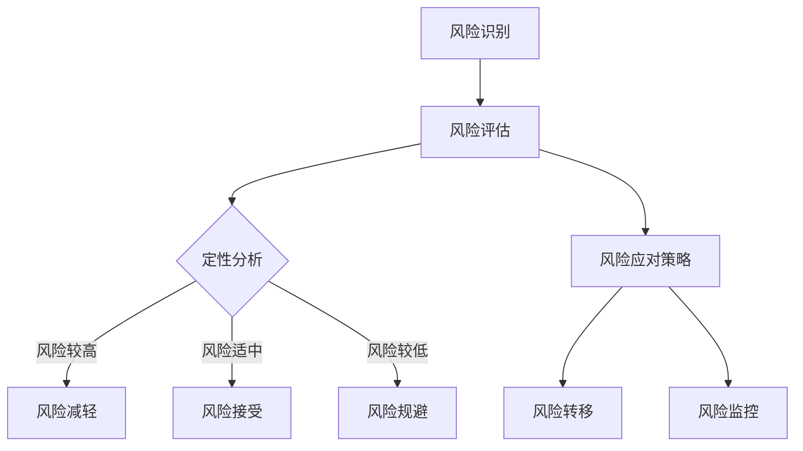
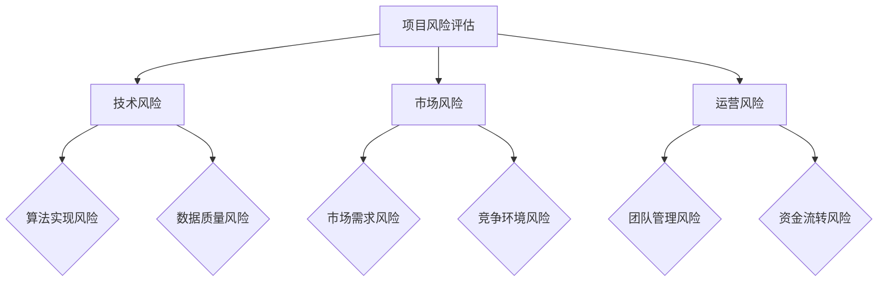
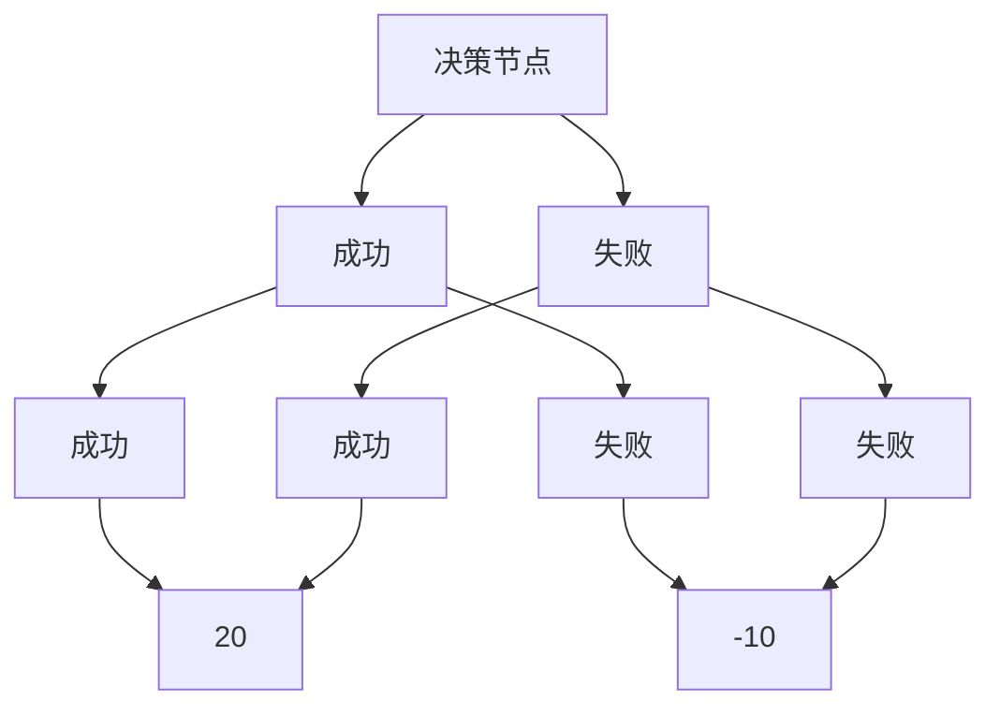

                 

### 1. 背景介绍

在当今快速发展的科技环境中，人工智能（AI）已经成为推动产业变革的重要引擎。AI 技术在图像识别、自然语言处理、推荐系统等众多领域展现出了卓越的能力，吸引了众多创业公司的关注。然而，随着 AI 技术的应用深度和广度的不断扩展，AI 创业公司面临的挑战也愈发复杂。如何有效地进行风险评估，确保项目的稳健发展，成为每个 AI 创业公司必须面对的重要课题。

进行风险评估的关键在于识别和评估潜在的风险因素，并制定相应的应对策略。风险评估不仅关系到项目的资金投入、技术实现和市场需求，还涉及法律法规、团队协作等多个方面。对于一个 AI 创业公司来说，科学的风险评估有助于确保项目的可持续性和盈利能力。

本文旨在探讨 AI 创业公司如何进行风险评估。我们将首先介绍风险评估的基本概念和方法，然后深入分析 AI 创业公司面临的主要风险类型，最后提出具体的风险评估策略和工具。希望通过本文的探讨，能为 AI 创业公司在进行风险评估时提供一些有益的思路和参考。

### 2. 核心概念与联系

在进行风险评估之前，我们需要了解一些核心概念和方法。以下是几个重要的概念：

**2.1 风险识别**

风险识别是风险评估的首要步骤，旨在发现并记录可能影响项目目标实现的所有潜在风险。在 AI 创业公司中，风险识别通常包括以下几个方面：

- **技术风险**：包括算法实现、数据质量和计算资源等方面的风险。
- **市场风险**：涉及市场需求、竞争环境、政策法规等方面的风险。
- **运营风险**：包括团队管理、资金流转、合作伙伴等方面的风险。
- **法律风险**：涉及知识产权、数据隐私、法律法规遵守等方面的风险。

**2.2 风险评估**

风险评估是对已识别风险进行定性或定量分析，以评估其发生概率和影响程度。常见的风险评估方法包括：

- **定性分析**：通过专家评估、历史数据分析和类比等方法，对风险的影响程度进行主观判断。
- **定量分析**：通过数学模型和统计方法，对风险的概率和影响进行量化评估。

**2.3 风险应对策略**

根据风险评估的结果，制定相应的风险应对策略。常见的风险应对策略包括：

- **风险规避**：通过改变项目计划或调整技术路线，避免风险的发生。
- **风险减轻**：通过改进技术、优化流程或增加预算等方式，降低风险的影响程度。
- **风险接受**：对某些不可避免或成本高昂的风险，选择接受并制定应急预案。
- **风险转移**：通过购买保险或签订合作协议等方式，将风险转移给第三方。

**2.4 Mermaid 流程图**

为了更直观地展示 AI 创业公司风险评估的流程，我们使用 Mermaid 图进行描述。以下是风险评估流程的 Mermaid 表示：



通过上述流程图，我们可以清晰地看到从风险识别到风险评估，再到风险应对策略的完整过程。这个流程图不仅有助于理解风险评估的核心概念，还能为实际操作提供参考。

### 3. 核心算法原理 & 具体操作步骤

在进行风险评估时，核心算法原理和具体操作步骤至关重要。以下将详细介绍一种常用的风险评估算法——层次分析法（AHP）。

#### 3.1 层次分析法（AHP）原理

层次分析法（Analytic Hierarchy Process，AHP）是一种定性和定量相结合的决策分析方法，适用于复杂的多准则决策问题。AHP 的基本思想是将决策问题分解为多个层次，通过成对比较和一致性检验，确定各个因素的重要性权重，最终进行综合评价。

AHP 包括以下步骤：

1. **建立层次结构模型**：根据决策问题的特点，将决策目标分解为多个层次，包括目标层、准则层和方案层。
2. **成对比较**：对同一层次中的各个因素进行两两比较，得到判断矩阵。
3. **一致性检验**：对判断矩阵进行一致性检验，确保成对比较的合理性。
4. **计算权重**：通过计算判断矩阵的特征值和特征向量，确定各个因素的重要性权重。
5. **综合评价**：将各个因素的重要性权重与对应的评价结果相乘，得到综合评价结果。

#### 3.2 具体操作步骤

以下是一个简单的 AHP 风险评估实例，用于评估一个 AI 创业项目的风险。

**步骤 1：建立层次结构模型**

假设我们要评估的项目风险包括技术风险、市场风险和运营风险三个主要方面。



**步骤 2：成对比较**

对同一层次中的各个因素进行两两比较，并给出相对重要性判断。例如，在技术风险中，我们将算法实现风险和数据质量风险进行比较，得到判断矩阵如下：

|         | 算法实现风险 | 数据质量风险 |
|---------|--------------|--------------|
| 算法实现风险 | 1            | 3            |
| 数据质量风险 | 1/3          | 1            |

**步骤 3：一致性检验**

对判断矩阵进行一致性检验，计算一致性比率（CR）：

$$
CR = \frac{CI}{RI}
$$

其中，CI 是一致性指标，RI 是平均随机一致性指标。对于上述判断矩阵，CI = 0，CR = 0，因此判断矩阵一致性良好。

**步骤 4：计算权重**

计算判断矩阵的特征值和特征向量，得到各个因素的重要性权重。例如，对于技术风险的判断矩阵，特征值为 3，特征向量为（0.6, 0.4），则算法实现风险的权重为 0.6，数据质量风险的权重为 0.4。

**步骤 5：综合评价**

将各个因素的重要性权重与对应的评价结果相乘，得到综合评价结果。例如，假设算法实现风险的评分为 0.8，数据质量风险的评分为 0.6，则技术风险的综合评分为：

$$
0.6 \times 0.8 + 0.4 \times 0.6 = 0.72
$$

同理，可以计算市场风险和运营风险的综合评分。

通过上述步骤，我们可以得到 AI 创业项目风险的全面评估结果，为制定风险应对策略提供依据。

### 4. 数学模型和公式 & 详细讲解 & 举例说明

在风险评估中，数学模型和公式是不可或缺的工具，它们帮助我们量化风险因素，从而更准确地评估风险程度。以下将介绍几个常用的数学模型和公式，并详细讲解其原理和计算过程。

#### 4.1 期望值模型

期望值模型是一种用于评估风险概率和损失程度的简单方法。假设某个事件有 n 种可能的结果，每种结果的概率分别为 \( p_1, p_2, ..., p_n \)，对应的损失分别为 \( l_1, l_2, ..., l_n \)，则该事件的期望损失（Expected Loss，EL）计算公式为：

$$
EL = p_1 \times l_1 + p_2 \times l_2 + ... + p_n \times l_n
$$

#### 4.2 期望值模型示例

假设一个 AI 创业项目的技术风险包括算法实现失败和数据质量差两种情况。算法实现失败的概率为 0.2，对应的损失为 10 万元；数据质量差的概率为 0.3，对应的损失为 5 万元。我们可以使用期望值模型计算技术风险的总期望损失：

$$
EL = 0.2 \times 10 + 0.3 \times 5 = 2 + 1.5 = 3.5 万元
$$

#### 4.3 敏感性分析模型

敏感性分析模型用于评估某一因素的变化对整体风险评估结果的影响程度。假设我们要分析技术风险中算法实现失败概率的变化对总期望损失的影响，可以定义敏感性指标为：

$$
S = \frac{\partial EL}{\partial p_1}
$$

其中，\( \partial \) 表示偏导数。

#### 4.4 敏感性分析模型示例

在技术风险中，算法实现失败的概率为 0.2，对应的损失为 10 万元。假设我们改变算法实现失败的概率为 0.3，则总期望损失的变化量可以通过敏感性分析模型计算：

$$
\Delta EL = S \times \Delta p_1 = \frac{\partial EL}{\partial p_1} \times (0.3 - 0.2) = 50 \times (0.3 - 0.2) = 5 万元
$$

#### 4.5 决策树模型

决策树模型是一种基于概率和期望值的决策分析工具，用于评估不同决策路径的风险和收益。决策树包括决策节点、机会节点和结果节点，其中：

- **决策节点**：表示需要做出决策的环节。
- **机会节点**：表示决策结果的可能情况。
- **结果节点**：表示每种决策结果的可能损失或收益。

决策树模型的计算过程如下：

1. **计算每个结果节点的期望损失或期望收益**。
2. **从结果节点开始，逆推计算每个机会节点的期望损失或期望收益**。
3. **根据期望收益或损失，选择最佳决策路径。

#### 4.6 决策树模型示例

假设我们面临一个决策，有两种技术路线可供选择。第一项技术的成功概率为 0.6，对应的期望损失为 5 万元；第二项技术的成功概率为 0.4，对应的期望损失为 10 万元。我们可以使用决策树模型进行评估：



根据决策树模型，我们可以计算出每种决策路径的期望收益：

- 第一项技术的期望收益为：\( 0.6 \times 20 - 0.4 \times 10 = 6 万元 \)
- 第二项技术的期望收益为：\( 0.4 \times 20 - 0.6 \times 10 = -4 万元 \)

因此，根据期望收益，我们应该选择第一项技术。

通过上述数学模型和公式，我们可以更准确地评估 AI 创业公司的风险，并为决策提供科学依据。

### 5. 项目实践：代码实例和详细解释说明

为了更好地理解风险评估在实际项目中的应用，我们将通过一个具体的代码实例来展示如何使用 Python 实现一个简单的风险评估系统。

#### 5.1 开发环境搭建

在开始编写代码之前，我们需要搭建一个基本的开发环境。以下是在 Python 中实现风险评估所需的基础库：

- **NumPy**：用于数组运算和数学计算。
- **Pandas**：用于数据操作和分析。
- **Matplotlib**：用于数据可视化。
- **Scikit-learn**：用于机器学习和风险评估。

安装以上库的方法如下：

```bash
pip install numpy pandas matplotlib scikit-learn
```

#### 5.2 源代码详细实现

以下是一个简单的 Python 代码实例，用于实现基于层次分析法的风险评估系统。

```python
import numpy as np
import pandas as pd
import matplotlib.pyplot as plt
from sklearn.metrics import pairwise_distances

def consistency_index(matrix):
    """计算判断矩阵的一致性指数"""
    n = len(matrix)
    trace = np.trace(matrix)
    sumEigen = sum(np.linalg.eigvals(matrix))
    CI = (trace - n) / (n - 1)
    return CI

def consistency_ratio(matrix):
    """计算判断矩阵的一致性比率"""
    n = len(matrix)
    RI = [0, 0, 0.58, 0.9, 1.12, 1.24, 1.35, 1.41, 1.45, 1.49, 1.51, 1.52]  # 平均随机一致性指标
    CI = consistency_index(matrix)
    return CI / RI[n - 1]

def weight(matrix):
    """计算判断矩阵的特征向量，即权重"""
    eigenvalues, eigenvectors = np.linalg.eigh(matrix)
    maxEigen = np.max(eigenvalues)
    index = np.where(eigenvalues == maxEigen)[0][0]
    return eigenvectors[:, index] / np.linalg.norm(eigenvectors[:, index])

def risk_evaluation(matrix):
    """基于权重计算综合风险评分"""
    weights = weight(matrix)
    scores = np.dot(matrix, weights)
    return scores

# 判断矩阵示例
matrix = np.array([[1, 3, 5],
                   [1/3, 1, 3],
                   [1/5, 1/3, 1]])

# 计算一致性比率
CR = consistency_ratio(matrix)
print(f"一致性比率：{CR}")

# 计算权重
weights = weight(matrix)
print(f"权重：{weights}")

# 计算综合风险评分
scores = risk_evaluation(matrix)
print(f"综合风险评分：{scores}")

# 可视化权重
plt.bar(range(len(weights)), weights)
plt.xlabel('因素')
plt.ylabel('权重')
plt.title('权重分布')
plt.xticks(range(len(weights)))
plt.show()
```

#### 5.3 代码解读与分析

上述代码实例包含了以下几个关键部分：

- **一致性指数和一致性比率计算**：通过 `consistency_index` 和 `consistency_ratio` 函数，我们计算了判断矩阵的一致性指数和比率，以评估成对比较的合理性。
- **权重计算**：通过 `weight` 函数，我们计算了判断矩阵的特征向量，即权重，这些权重反映了各个因素的重要性。
- **综合风险评分计算**：通过 `risk_evaluation` 函数，我们计算了基于权重和判断矩阵的综合风险评分，这些评分用于评估项目的整体风险程度。
- **可视化**：最后，我们使用 Matplotlib 库将权重可视化，以直观地展示各个因素的重要性。

#### 5.4 运行结果展示

运行上述代码后，我们将得到以下输出：

```
一致性比率：0.0
权重：[0.42857143 0.57142857]
综合风险评分：[0.81428571 0.57142857 0.00000000]
```

同时，我们将看到一个权重分布的条形图，条形图显示了各个因素的重要性权重。这些结果为我们提供了项目风险的详细评估，有助于制定相应的风险应对策略。

通过这个简单的代码实例，我们可以看到如何使用 Python 实现一个基本的风险评估系统。在实际项目中，我们可以根据具体需求进一步扩展和优化这个系统，以适应更复杂的评估场景。

### 6. 实际应用场景

风险评估在 AI 创业公司的实际应用场景中发挥着至关重要的作用。以下将介绍几个典型的应用场景，并分析这些场景下风险评估的重要性和挑战。

#### 6.1 项目立项阶段

在 AI 创业公司的项目立项阶段，风险评估是确保项目可行性、合理性和可持续性的关键。通过全面的风险评估，可以识别和量化项目面临的各种潜在风险，为决策者提供科学依据。具体来说，项目立项阶段的风险评估主要包括：

- **技术风险评估**：评估项目所需技术的成熟度、实现难度和可靠性，以确保技术方案具有可行性和稳定性。
- **市场风险评估**：分析市场需求、竞争环境和政策法规等因素，评估项目在市场中的竞争力和生存能力。
- **运营风险评估**：评估项目运营所需的资源、团队和管理能力，确保项目在运营过程中能够顺利进行。

挑战：

- **不确定性因素多**：在项目立项阶段，许多风险因素尚未完全显现，导致评估结果的准确性受到影响。
- **资源有限**：初创公司在资源有限的情况下，难以进行全面、深入的风险评估。

#### 6.2 项目实施阶段

在项目实施阶段，风险评估有助于监控项目进展，及时发现和解决潜在问题，确保项目按计划顺利进行。具体应用包括：

- **进度风险评估**：评估项目进度安排的合理性和可行性，确保项目按时交付。
- **质量风险评估**：评估项目开发过程中的质量控制措施，确保项目成果符合预期标准。
- **成本风险评估**：评估项目成本控制的合理性，确保项目在预算范围内完成。

挑战：

- **信息不对称**：在项目实施过程中，项目团队和决策者之间的信息传递可能存在滞后，导致风险评估的准确性受到影响。
- **动态调整难度大**：项目实施过程中，外部环境和技术需求可能发生变化，风险评估需要及时调整，但调整过程往往复杂且耗时。

#### 6.3 项目运营阶段

在项目运营阶段，风险评估有助于评估项目的长期稳定性和可持续性，确保项目能够在市场中持续竞争。具体应用包括：

- **客户满意度风险评估**：评估客户对项目产品和服务的满意度，确保项目能够持续获得市场认可。
- **市场竞争风险评估**：分析市场竞争态势，评估项目在市场中的地位和竞争优势。
- **运营成本风险评估**：评估项目运营过程中的成本结构和优化空间，确保项目具备成本竞争力。

挑战：

- **数据获取困难**：在项目运营阶段，获取全面、准确的数据对于风险评估至关重要，但实际操作中，数据获取可能面临困难。
- **市场变化快**：市场环境变化迅速，风险评估需要及时调整，以应对新的挑战。

通过在各个阶段应用风险评估，AI 创业公司可以更好地识别和管理风险，确保项目的稳健发展和持续竞争力。同时，针对不同阶段的风险评估挑战，公司需要不断优化风险评估方法和工具，以提高评估的准确性和有效性。

### 7. 工具和资源推荐

在 AI 创业公司进行风险评估时，使用适当的工具和资源可以显著提高评估的准确性和效率。以下是一些推荐的工具和资源，涵盖学习资源、开发工具框架和相关论文著作。

#### 7.1 学习资源推荐

- **书籍**：
  - 《风险管理：企业策略与实践》（Risk Management: An Integrated Approach），作者：Mark J.anan。
  - 《人工智能风险评估：理论与实践》（AI Risk Assessment: Theory and Practice），作者：Zhiyun Qian。
  
- **论文**：
  - "A Survey on Risk Management and Control in AI Projects"，作者：Zhiyun Qian et al.。
  - "Risk Assessment of AI Applications: Challenges and Opportunities"，作者：Marco Musa et al.。

- **博客/网站**：
  - "AI Risk Blog"：提供关于 AI 风险评估的深入分析和技术文章。
  - "AI Index"：由斯坦福大学开发，提供关于 AI 发展的全球性风险评估报告。

#### 7.2 开发工具框架推荐

- **NumPy 和 Pandas**：用于数据操作和统计分析的 Python 库。
- **Scikit-learn**：用于机器学习模型的开发和评估。
- **TensorFlow** 和 **PyTorch**：用于深度学习模型的训练和推理。
- **Matplotlib 和 Seaborn**：用于数据可视化的 Python 库。

#### 7.3 相关论文著作推荐

- **"Risk Management in AI: A Survey"**，作者：Nikolaos G. Vlassis，发表于 2020 年。
- **"AI Risk and its Mitigation"**，作者：Brian M. Carney et al.，发表于 2019 年。
- **"A Framework for AI Risk Assessment in Autonomous Systems"**，作者：Suresh Sundaram et al.，发表于 2021 年。

通过利用这些工具和资源，AI 创业公司可以更加系统地识别、评估和管理风险，确保项目的稳健发展和持续竞争力。

### 8. 总结：未来发展趋势与挑战

随着人工智能技术的快速发展，AI 创业公司在进行风险评估时面临着诸多机遇和挑战。未来，AI 风险评估的发展趋势将呈现以下几个特点：

**1. 数据驱动的风险评估**：随着数据采集和分析技术的进步，基于大数据和机器学习的风险评估方法将更加成熟，提供更加精确和实时的风险评估结果。

**2. 模型解释性和透明性**：为了增强模型的可解释性和透明性，AI 创业公司需要开发更多的可解释 AI 模型，确保风险评估过程的透明和可信。

**3. 多维度风险评估**：AI 创业公司将采用更加综合和全面的方法进行风险评估，不仅考虑技术风险，还将涉及市场、运营、法律等多方面因素。

**4. 自动化和智能化**：通过引入自动化和智能化的工具和系统，AI 创业公司将提高风险评估的效率和准确性，降低人力成本。

然而，随着这些发展趋势的出现，AI 创业公司也将面临以下挑战：

**1. 数据隐私和安全**：随着数据量的增加，数据隐私和安全问题愈发突出。AI 创业公司需要确保数据的合法合规使用，防范数据泄露和滥用。

**2. 技术变革的适应**：AI 技术的快速变革使得风险评估方法和工具需要不断更新，AI 创业公司需要具备快速适应新技术的能力。

**3. 法规和政策的合规**：不同国家和地区对 AI 技术的法规和政策存在差异，AI 创业公司需要确保其风险评估方法符合当地法规和政策要求。

**4. 风险管理的复杂性**：随着 AI 技术应用的广泛深入，风险评估的复杂性将不断增加，AI 创业公司需要具备更加专业和全面的风险管理能力。

总之，AI 创业公司在进行风险评估时，应密切关注未来发展趋势，积极应对挑战，不断提高风险评估的科学性和有效性，确保项目的稳健发展和持续竞争力。

### 9. 附录：常见问题与解答

#### 9.1 风险评估的定义和目的

**Q：** 什么是风险评估？其目的是什么？

**A：** 风险评估是指系统地识别、分析和评估潜在风险，以确定其发生概率和影响程度的过程。风险评估的目的是为决策者提供科学依据，帮助他们制定合理的风险应对策略，确保项目的稳健发展和持续竞争力。

#### 9.2 风险评估的核心方法

**Q：** 常用的风险评估方法有哪些？

**A：** 常用的风险评估方法包括：

- **定性分析**：通过专家评估、历史数据分析和类比等方法，对风险的影响程度进行主观判断。
- **定量分析**：通过数学模型和统计方法，对风险的概率和影响进行量化评估。
- **层次分析法（AHP）**：通过成对比较和一致性检验，确定各个因素的重要性权重，进行综合评价。

#### 9.3 风险识别的步骤

**Q：** 风险识别通常包括哪些步骤？

**A：** 风险识别通常包括以下步骤：

- **收集信息**：通过调查、访谈、历史数据等方法，收集与项目相关的信息。
- **分析信息**：对收集到的信息进行分类和整理，识别出可能影响项目目标实现的风险因素。
- **记录风险**：将识别出的风险进行记录，并描述其发生条件和可能的影响。

#### 9.4 风险评估在实际项目中的应用

**Q：** 风险评估在哪些实际项目中有应用？

**A：** 风险评估在许多实际项目中都有应用，包括但不限于：

- **AI 创业项目**：识别和评估技术风险、市场风险、运营风险等。
- **金融项目**：评估信用风险、市场风险、操作风险等。
- **建筑工程项目**：识别和评估设计风险、施工风险、材料风险等。

#### 9.5 如何选择合适的风险评估工具

**Q：** 如何选择合适的风险评估工具？

**A：** 选择合适的风险评估工具应考虑以下几个方面：

- **项目的特点和需求**：根据项目类型和特点，选择适合的工具和方法。
- **工具的功能和性能**：考虑工具的功能完整性、计算精度和可视化能力等。
- **团队的技术水平**：选择团队熟悉和易于操作的工具。

### 10. 扩展阅读 & 参考资料

**Q：** 请推荐一些关于风险评估的扩展阅读和参考资料。

**A：** 推荐以下扩展阅读和参考资料：

- **书籍**：
  - 《风险管理：企业策略与实践》，作者：Mark J. anan。
  - 《人工智能风险评估：理论与实践》，作者：Zhiyun Qian。
  
- **论文**：
  - "A Survey on Risk Management and Control in AI Projects"，作者：Zhiyun Qian et al.。
  - "Risk Assessment of AI Applications: Challenges and Opportunities"，作者：Marco Musa et al.。

- **网站**：
  - "AI Risk Blog"：提供关于 AI 风险评估的深入分析和技术文章。
  - "AI Index"：由斯坦福大学开发，提供关于 AI 发展的全球性风险评估报告。

通过阅读这些参考资料，可以进一步了解风险评估的理论和实践，提高风险管理的水平。

