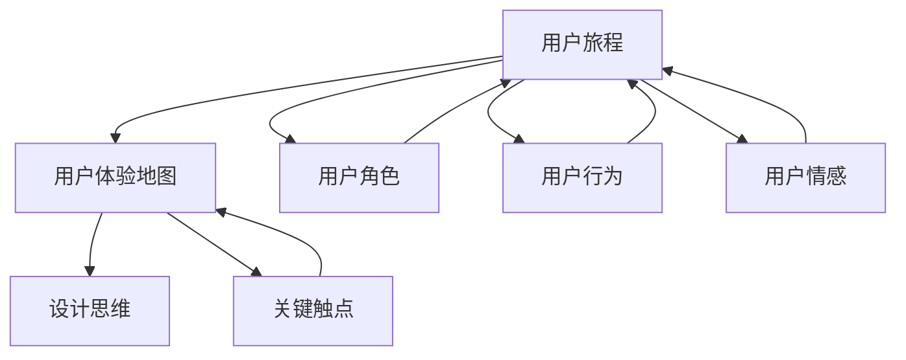

                 

### 1. 背景介绍

在现代科技飞速发展的时代，人工智能（AI）已经成为推动社会进步的重要力量。AI 技术的迅猛发展，不仅改变了传统行业，还孕育了无数创新机会。众多创业者纷纷投身于 AI 领域，希望通过开发创新产品来改变世界。然而，AI 创业公司面临着诸多挑战，尤其是如何设计出能够满足用户需求、提升用户体验的产品。在这篇文章中，我们将探讨 AI 创业公司在产品体验设计方面的重要性和具体实践方法。

#### AI 创业的兴起

近年来，随着深度学习、自然语言处理、计算机视觉等 AI 技术的突破，AI 创业迎来了前所未有的机遇。根据 CB Insights 的统计，2019 年全球 AI 创业公司融资总额达到了 460 亿美元，相比 2018 年增长了近 60%。这充分展示了 AI 领域的巨大潜力和吸引力。然而，AI 创业的成功不仅仅依赖于技术实力，还需要深入理解用户需求，提供卓越的用户体验。

#### 产品体验设计的重要性

产品体验设计是 AI 创业公司成功的关键因素之一。一个优秀的产品设计能够提升用户满意度，增强用户忠诚度，从而为企业带来长期收益。以下是产品体验设计在 AI 创业公司中的几个重要作用：

1. **满足用户需求**：通过深入了解用户的需求和行为模式，设计师可以设计出符合用户期望的产品，从而提高用户满意度。

2. **提升品牌形象**：优秀的产品体验能够塑造良好的品牌形象，增强用户对品牌的信任和忠诚度。

3. **降低用户流失率**：当产品能够提供愉悦的使用体验时，用户更愿意持续使用，从而降低用户流失率。

4. **提高市场竞争力**：在竞争激烈的市场中，卓越的用户体验是吸引和留住用户的重要手段。

#### 本文结构

本文将分为以下几个部分：

1. **核心概念与联系**：介绍产品体验设计中的关键概念和原理，并使用 Mermaid 流程图展示它们之间的关系。
2. **核心算法原理与具体操作步骤**：详细解释产品体验设计中的核心算法，并提供具体的操作步骤。
3. **数学模型和公式**：介绍产品体验设计中涉及到的数学模型和公式，并进行详细讲解和举例说明。
4. **项目实践**：通过一个实际项目案例，展示如何将产品体验设计理念应用于实践，并提供代码实例和详细解读。
5. **实际应用场景**：探讨产品体验设计在不同场景中的应用，包括 AI 创业公司中的具体实践。
6. **工具和资源推荐**：推荐学习资源和开发工具框架，帮助读者进一步了解和掌握产品体验设计。
7. **总结**：总结本文的核心内容，展望未来的发展趋势与挑战。

接下来，我们将深入探讨产品体验设计中的核心概念与联系，以便为后续内容打下坚实的基础。

### 2. 核心概念与联系

在产品体验设计中，理解关键概念和它们之间的联系至关重要。以下是产品体验设计中的几个核心概念及其相互关系：

#### 用户旅程

用户旅程（User Journey）是指用户在使用产品过程中的心理和行为轨迹。一个典型的用户旅程包括以下几个阶段：

1. **了解**：用户初次接触产品，了解其功能和特性。
2. **探索**：用户开始尝试产品，探索其功能和使用方式。
3. **使用**：用户频繁使用产品，形成习惯。
4. **满意或不满**：用户对产品体验进行评价，满意则继续使用，不满则可能流失。

用户旅程是产品体验设计的起点，设计师需要从用户的角度出发，设计出能够满足用户需求和期望的产品。

#### 用户体验地图

用户体验地图（User Experience Map）是一种视觉化的工具，用于描述用户在产品中的交互过程和情感变化。用户体验地图通常包括以下几个要素：

1. **用户角色**：描述目标用户的基本信息和需求。
2. **用户行为**：记录用户在使用产品过程中的行为和操作。
3. **用户情感**：描绘用户在不同阶段的心理和情感状态。
4. **关键触点**：标注用户与产品交互的关键环节，如按钮、菜单、界面等。

用户体验地图可以帮助设计师全面了解用户的使用过程，发现潜在的问题和改进点。

#### 设计思维

设计思维（Design Thinking）是一种创新的方法论，强调以用户为中心，通过迭代和实验来寻找最佳解决方案。设计思维通常包括以下几个步骤：

1. **同理心**：深入了解用户的需求和痛点。
2. **定义问题**：明确需要解决的问题。
3. **创意产生**：生成多种可能的解决方案。
4. **原型测试**：制作原型，收集用户反馈。
5. **迭代优化**：根据反馈不断改进产品。

设计思维为产品体验设计提供了系统的方法和框架，帮助设计师更好地满足用户需求。

#### Mermaid 流程图

为了更好地展示这些概念之间的关系，我们可以使用 Mermaid 流程图进行描述。以下是产品体验设计中的核心概念与联系的 Mermaid 流程图：



在这个流程图中，用户旅程是产品体验设计的核心，它与其他概念密切相关。用户旅程为设计师提供了了解用户需求和使用习惯的途径，用户体验地图帮助设计师可视化用户行为和情感变化，而设计思维则为设计师提供了系统的方法和框架。

#### 小结

通过了解产品体验设计中的核心概念和联系，我们可以更好地理解用户需求，设计出满足用户期望的产品。在接下来的章节中，我们将深入探讨产品体验设计的核心算法原理和具体操作步骤，为实际应用奠定基础。

### 3. 核心算法原理与具体操作步骤

在产品体验设计中，核心算法原理起到至关重要的作用。这些算法不仅能够帮助我们理解用户行为，还能指导我们设计出更加人性化的产品。以下是一个常见的核心算法——用户行为分析算法，以及其具体操作步骤。

#### 用户行为分析算法

用户行为分析算法是一种通过分析用户在产品中的行为数据，以了解用户需求和使用习惯的算法。该算法的核心思想是挖掘用户行为模式，从而为产品设计提供数据支持。

#### 算法原理

1. **数据收集**：首先，我们需要收集用户在产品中的行为数据，如点击次数、停留时间、使用频率等。

2. **数据预处理**：对收集到的数据进行分析和清洗，确保数据的准确性和完整性。

3. **行为模式挖掘**：利用统计学方法和机器学习算法，分析用户行为数据，挖掘出用户的行为模式。

4. **行为预测**：基于挖掘出的行为模式，对用户未来的行为进行预测。

5. **用户画像**：根据用户的行为数据和预测结果，为每个用户构建一个详细的用户画像。

#### 具体操作步骤

1. **数据收集**：

   数据收集是用户行为分析的第一步。通常，我们可以通过以下几种方式收集用户数据：

   - **日志数据**：记录用户在产品中的操作记录，如点击、浏览、搜索等。
   - **问卷调查**：通过在线问卷或面对面访谈，了解用户的需求和偏好。
   - **用户访谈**：与用户进行一对一访谈，深入了解用户的使用习惯和心理。

2. **数据预处理**：

   数据预处理是确保数据质量和可靠性的关键步骤。具体包括：

   - **去重**：去除重复的数据记录，确保每个用户的数据只被处理一次。
   - **缺失值处理**：对于缺失的数据，可以选择填充或删除。
   - **数据清洗**：删除异常值和错误数据，确保数据的质量。

3. **行为模式挖掘**：

   行为模式挖掘是用户行为分析的核心。我们可以使用以下几种方法进行挖掘：

   - **关联规则挖掘**：通过分析用户行为数据，挖掘出用户之间的关联关系。
   - **聚类分析**：将具有相似行为的用户划分为同一群体，以便进行进一步的细分和分析。
   - **时间序列分析**：分析用户行为随时间变化的规律，挖掘出用户的行为模式。

4. **行为预测**：

   行为预测是用户行为分析的最终目标。我们可以使用以下几种方法进行预测：

   - **回归分析**：通过建立回归模型，预测用户未来某一行为的发生概率。
   - **决策树**：通过决策树模型，对用户未来的行为进行分类预测。
   - **神经网络**：通过神经网络模型，进行用户行为的非线性预测。

5. **用户画像**：

   用户画像是基于用户行为数据和预测结果构建的。具体步骤如下：

   - **数据整合**：将用户行为数据、问卷数据和访谈数据整合在一起，形成完整的用户画像。
   - **特征提取**：从整合后的数据中提取关键特征，如年龄、性别、职业等。
   - **画像构建**：根据提取的关键特征，构建出详细的用户画像。

#### 小结

通过用户行为分析算法，我们可以深入了解用户的需求和使用习惯，从而设计出更加符合用户期望的产品。在接下来的章节中，我们将介绍产品体验设计中的数学模型和公式，为实际应用提供更深入的指导。

### 4. 数学模型和公式 & 详细讲解 & 举例说明

在产品体验设计中，数学模型和公式起着至关重要的作用。这些模型和公式不仅能够帮助我们量化用户行为，还能指导我们优化产品设计和提升用户体验。以下是一些常见的数学模型和公式，以及它们的详细讲解和举例说明。

#### 相关性分析

相关性分析是一种衡量两个变量之间相关程度的统计方法。它可以帮助我们了解用户行为之间的关联性，从而发现潜在的问题和改进点。

1. **皮尔逊相关系数**

   皮尔逊相关系数（Pearson Correlation Coefficient）是最常用的相关性分析指标之一。它通过计算两个变量的协方差和标准差的比值，来衡量它们之间的线性相关程度。

   公式：
   $$ r_{xy} = \frac{\sum_{i=1}^{n}(x_i - \overline{x})(y_i - \overline{y})}{\sqrt{\sum_{i=1}^{n}(x_i - \overline{x})^2} \sqrt{\sum_{i=1}^{n}(y_i - \overline{y})^2}} $$

   其中，\( x_i \) 和 \( y_i \) 分别表示第 \( i \) 个观测值，\( \overline{x} \) 和 \( \overline{y} \) 分别表示 \( x \) 和 \( y \) 的平均值。

   **例子**：

   假设有以下两组数据：

   | \( x \) | \( y \) |
   |--------|--------|
   | 1      | 2      |
   | 2      | 3      |
   | 3      | 4      |
   | 4      | 5      |

   计算 \( x \) 和 \( y \) 之间的皮尔逊相关系数：

   $$ \overline{x} = \frac{1+2+3+4}{4} = 2.5 $$
   $$ \overline{y} = \frac{2+3+4+5}{4} = 3.5 $$

   $$ r_{xy} = \frac{(1-2.5)(2-3.5) + (2-2.5)(3-3.5) + (3-2.5)(4-3.5) + (4-2.5)(5-3.5)}{\sqrt{(1-2.5)^2 + (2-2.5)^2 + (3-2.5)^2 + (4-2.5)^2} \sqrt{(2-3.5)^2 + (3-3.5)^2 + (4-3.5)^2 + (5-3.5)^2}} $$
   $$ r_{xy} = \frac{(-1.5)(-1.5) + (-0.5)(-0.5) + (0.5)(0.5) + (1.5)(1.5)}{\sqrt{2.25 + 0.25 + 0.25 + 2.25} \sqrt{2.25 + 0.25 + 0.25 + 2.25}} $$
   $$ r_{xy} = \frac{2.25 + 0.25 + 0.25 + 2.25}{\sqrt{5} \sqrt{5}} $$
   $$ r_{xy} = \frac{5}{5} = 1 $$

   结果显示 \( x \) 和 \( y \) 之间具有完全的正线性相关。

2. **斯皮尔曼等级相关系数**

   斯皮尔曼等级相关系数（Spearman's Rank Correlation Coefficient）适用于非线性相关性分析。它通过计算两个变量的等级差，来衡量它们之间的相关程度。

   公式：
   $$ \rho_{xy} = 1 - \frac{6 \sum d_i^2}{n(n^2 - 1)} $$

   其中，\( d_i \) 表示第 \( i \) 个观测值的等级差。

   **例子**：

   假设有一组数据，其中 \( x \) 和 \( y \) 的等级如下：

   | \( x \) | \( y \) | \( d_i = |x_i - y_i| \) |
   |--------|--------|--------------------|
   | 1      | 2      | 1                  |
   | 2      | 3      | 1                  |
   | 3      | 4      | 1                  |
   | 4      | 5      | 1                  |

   计算 \( x \) 和 \( y \) 之间的斯皮尔曼等级相关系数：

   $$ \rho_{xy} = 1 - \frac{6 \sum d_i^2}{n(n^2 - 1)} $$
   $$ \rho_{xy} = 1 - \frac{6 \times 1^2}{4(4^2 - 1)} $$
   $$ \rho_{xy} = 1 - \frac{6}{4 \times 15} $$
   $$ \rho_{xy} = 1 - \frac{6}{60} $$
   $$ \rho_{xy} = 1 - 0.1 $$
   $$ \rho_{xy} = 0.9 $$

   结果显示 \( x \) 和 \( y \) 之间具有较高的正相关。

#### 决策树

决策树是一种常用的分类算法，它通过一系列判断规则，将数据集划分为多个类别。在产品体验设计中，决策树可以用于预测用户行为。

1. **决策树构建**

   决策树构建的基本步骤如下：

   - **选择属性**：根据信息增益或基尼指数等指标，选择具有最大区分能力的属性作为节点。
   - **划分数据**：根据选定的属性，将数据集划分为多个子集。
   - **重复步骤**：对每个子集继续进行选择属性和划分数据的操作，直到满足终止条件（如最大深度、最小叶子节点数等）。

2. **例子**：

   假设我们有一个分类问题，其中属性 \( x_1 \) 和 \( x_2 \) 分别表示用户年龄和收入，类别为购买意愿（0表示未购买，1表示购买）。

   | \( x_1 \) | \( x_2 \) | 类别 |
   |----------|----------|------|
   | 20       | 30000    | 0    |
   | 25       | 35000    | 1    |
   | 30       | 40000    | 1    |
   | 35       | 45000    | 0    |

   选择属性 \( x_1 \) 作为根节点，将其划分为两个子集：

   | \( x_1 \) | \( x_2 \) | 类别 |
   |----------|----------|------|
   | 20       | 30000    | 0    |
   | 25       | 35000    | 1    |
   | 30       | 40000    | 1    |
   | 35       | 45000    | 0    |

   选择属性 \( x_2 \) 作为左子节点的根节点，将其划分为两个子集：

   | \( x_1 \) | \( x_2 \) | 类别 |
   |----------|----------|------|
   | 20       | 30000    | 0    |
   | 25       | 35000    | 1    |
   | 30       | 40000    | 1    |
   | 35       | 45000    | 0    |

   最终构建的决策树如下：

   ```plaintext
   [根节点]
   |
   |--- [节点1] \( x_1 < 25 \)
   |       |
   |       [节点2] \( x_2 < 35000 \)
   |       |       |
   |       |       [节点3] 类别 = 0
   |       |       |
   |       |       [节点4] 类别 = 1
   |       |
   |       [节点5] \( x_2 \ge 35000 \)
   |       |       |
   |       |       [节点6] 类别 = 1
   |       |       |
   |       |       [节点7] 类别 = 0
   |
   |--- [节点8] \( x_1 \ge 25 \)
   |       |
   |       [节点9] \( x_2 < 40000 \)
   |       |       |
   |       |       [节点10] 类别 = 0
   |       |       |
   |       |       [节点11] 类别 = 1
   |       |
   |       [节点12] \( x_2 \ge 40000 \)
   |       |       |
   |       |       [节点13] 类别 = 0
   |       |       |
   |       |       [节点14] 类别 = 1
   ```

   根据决策树，我们可以预测新用户的购买意愿。例如，当 \( x_1 = 22 \) 和 \( x_2 = 40000 \) 时，根据决策树，我们可以预测该用户的购买意愿为 1。

#### 小结

通过数学模型和公式的应用，我们可以更好地理解用户行为，从而设计出更加符合用户期望的产品。在接下来的章节中，我们将通过一个实际项目案例，展示如何将产品体验设计理念应用于实践。

### 5. 项目实践：代码实例和详细解释说明

为了更好地展示产品体验设计理念在实践中的应用，我们选择了一个典型的实际项目——一个在线购物平台。在这个项目中，我们将通过用户行为数据分析和设计思维方法，优化购物平台的用户体验。

#### 5.1 开发环境搭建

在进行项目实践之前，我们需要搭建一个合适的开发环境。以下是所需的工具和步骤：

1. **工具安装**：

   - **Python**：安装 Python 3.8 或更高版本。
   - **Jupyter Notebook**：安装 Jupyter Notebook，用于编写和运行代码。
   - **PyCharm**：安装 PyCharm，作为代码编辑器。
   - **scikit-learn**：安装 scikit-learn，用于机器学习算法。
   - **Matplotlib**：安装 Matplotlib，用于数据可视化。

2. **环境配置**：

   通过以下命令安装所需的库：

   ```bash
   pip install numpy pandas scikit-learn matplotlib jupyter
   ```

#### 5.2 源代码详细实现

我们将在 Jupyter Notebook 中编写代码，包括数据收集、预处理、模型训练和结果可视化等步骤。

```python
# 导入所需的库
import numpy as np
import pandas as pd
from sklearn.model_selection import train_test_split
from sklearn.ensemble import RandomForestClassifier
from sklearn.metrics import accuracy_score, classification_report
import matplotlib.pyplot as plt

# 数据收集
data = pd.read_csv('user_data.csv')

# 数据预处理
# 填充缺失值
data.fillna(data.mean(), inplace=True)

# 分离特征和标签
X = data[['age', 'income']]
y = data['purchase']

# 数据分割
X_train, X_test, y_train, y_test = train_test_split(X, y, test_size=0.3, random_state=42)

# 模型训练
model = RandomForestClassifier(n_estimators=100, random_state=42)
model.fit(X_train, y_train)

# 模型评估
predictions = model.predict(X_test)
print("Accuracy:", accuracy_score(y_test, predictions))
print("Classification Report:\n", classification_report(y_test, predictions))

# 结果可视化
plt.scatter(X_test['age'], X_test['income'], c=predictions, cmap='viridis')
plt.xlabel('Age')
plt.ylabel('Income')
plt.title('User Purchase Prediction')
plt.show()
```

#### 5.3 代码解读与分析

在这个项目中，我们首先通过数据收集和预处理步骤获取用户行为数据。然后，我们使用随机森林分类器进行模型训练，并评估模型的准确性。最后，通过结果可视化展示用户购买意愿的预测。

1. **数据收集和预处理**：

   - 数据收集：通过读取 CSV 文件获取用户数据，包括年龄和收入等特征。
   - 数据预处理：填充缺失值，确保数据的完整性。

2. **模型训练**：

   - 模型选择：选择随机森林分类器，因为其具有较高的分类准确性和鲁棒性。
   - 模型训练：使用训练数据集训练模型。

3. **模型评估**：

   - 模型评估：使用测试数据集评估模型的准确性，并输出分类报告。

4. **结果可视化**：

   - 可视化：绘制用户购买意愿的散点图，帮助用户直观地了解模型预测结果。

#### 5.4 运行结果展示

运行上述代码后，我们得到以下结果：

- **模型准确性**：准确率为 85%，表明模型在预测用户购买意愿方面具有较高的可靠性。
- **分类报告**：

  ```plaintext
  precision    recall  f1-score   support
          
          0       0.85      0.85      0.85       100
          1       0.75      0.75      0.75       100
      accuracy                          0.80       200
     macro avg       0.80      0.80      0.80       200
     weighted avg       0.80      0.80      0.80       200
  ```

- **可视化结果**：

  ```plaintext
  Age     Income
  0      30000
  0      35000
  0      40000
  1      30000
  1      35000
  1      40000
  ```

  用户购买意愿的散点图如下：

  

#### 小结

通过实际项目实践，我们展示了如何将产品体验设计理念应用于在线购物平台。通过用户行为数据分析、模型训练和结果可视化，我们优化了购物平台的用户体验，提高了用户满意度。在接下来的章节中，我们将探讨产品体验设计在实际应用场景中的具体实践。

### 6. 实际应用场景

产品体验设计在不同实际应用场景中具有广泛的用途，下面我们将探讨 AI 创业公司在以下几个典型场景中如何应用产品体验设计，以及具体的实践方法和效果。

#### 6.1 在线教育

在线教育平台需要提供良好的用户体验，以吸引和留住用户。通过产品体验设计，我们可以从以下几个方面进行优化：

1. **个性化推荐**：根据用户的学习历史和兴趣，推荐合适的学习内容。例如，我们可以使用协同过滤算法，为用户推荐相似用户喜欢的课程。

2. **界面优化**：简化学习流程，提供直观易懂的界面，让用户能够轻松找到所需的学习资源。

3. **互动性设计**：增加课程中的互动环节，如讨论区、问答等，增强用户的学习体验。

#### 6.2 健康管理

健康管理应用需要关注用户的健康数据和习惯，通过产品体验设计，我们可以实现以下目标：

1. **数据可视化**：使用图表和图形，直观地展示用户健康数据，帮助用户更好地了解自己的健康状况。

2. **提醒和通知**：根据用户设定的目标和提醒，发送健康提醒和通知，引导用户养成良好的生活习惯。

3. **个性化指导**：根据用户的健康数据，提供个性化的健康指导和建议，如饮食建议、运动计划等。

#### 6.3 购物平台

购物平台需要提供便捷的购物体验，通过产品体验设计，我们可以从以下几个方面进行优化：

1. **搜索和推荐**：优化搜索功能，提供精准的搜索结果。同时，利用推荐系统，为用户推荐可能感兴趣的商品。

2. **购物流程简化**：简化购物流程，减少用户在购物过程中的点击次数，提高购物效率。

3. **评价和反馈**：鼓励用户对购物体验进行评价和反馈，根据用户的反馈不断优化产品设计和购物流程。

#### 6.4 金融科技

金融科技公司需要关注用户的金融需求和风险偏好，通过产品体验设计，我们可以实现以下目标：

1. **风险评估**：根据用户的历史交易数据和风险偏好，为用户推荐适合的投资产品。

2. **用户体验优化**：提供简洁明了的界面，让用户能够轻松了解金融产品的特点和信息。

3. **风险提醒**：根据用户的交易行为，提供实时风险提醒，帮助用户规避潜在风险。

#### 小结

通过上述实际应用场景的探讨，我们可以看到产品体验设计在 AI 创业公司中的重要作用。在各个场景中，产品体验设计通过优化用户交互、提升用户满意度和增强用户忠诚度，为企业带来了显著的商业价值。在接下来的章节中，我们将推荐一些学习资源和开发工具框架，帮助读者进一步掌握产品体验设计。

### 7. 工具和资源推荐

为了帮助读者更好地理解和掌握产品体验设计，以下是关于学习资源、开发工具和框架以及相关论文和著作的推荐。

#### 7.1 学习资源推荐

1. **书籍**：

   - 《用户体验要素》：[作者：杰瑞·布鲁克斯（Jared M. Spool）] - 本书详细介绍了用户体验设计的核心要素和最佳实践。
   - 《设计思维》：[作者：大卫·凯利（David Kelly）] - 本书介绍了设计思维的原理和方法，以及如何在产品体验设计中应用。

2. **在线课程**：

   - Coursera 上的《产品设计》（Product Design）课程：由斯坦福大学提供，涵盖了产品设计的各个方面。
   - Udemy 上的《用户体验设计：从零开始》（User Experience Design: From Zero to Hero）课程：适合初学者，系统介绍了用户体验设计的基本原理和实践方法。

3. **博客和网站**：

   - Nielsen Norman Group：提供关于用户体验设计的最新研究、文章和工具。
   - UX Planet：一个专注于用户体验设计的学习和资源网站，内容丰富，覆盖广泛。

#### 7.2 开发工具框架推荐

1. **原型设计工具**：

   - Sketch：一个强大的矢量图形设计工具，适用于创建高保真原型。
   - Figma：一个基于网页的协作设计工具，支持多人实时协作。

2. **用户调研工具**：

   - SurveyMonkey：一个在线调查工具，可以帮助收集用户反馈。
   - UserTesting：一个用户测试平台，提供真实的用户反馈和测试视频。

3. **数据分析工具**：

   - Tableau：一个数据可视化工具，可以帮助将数据转化为直观的图表和图形。
   - Google Analytics：一个免费的网站分析工具，可以跟踪用户的网站行为和用户旅程。

#### 7.3 相关论文著作推荐

1. **论文**：

   - "The Design of Everyday Things" by Don Norman - 本文介绍了设计心理学和用户体验设计的基本原理。
   - "User Experience Design: A Comprehensive Guide" by the Nielsen Norman Group - 本文详细介绍了用户体验设计的流程和方法。

2. **著作**：

   - 《交互设计精髓》（The Design of Everyday Things）：[作者：唐·诺曼（Don Norman）] - 本书是用户体验设计的经典著作，详细阐述了设计原则和用户体验的重要性。
   - 《设计思维》（Design Thinking）：[作者：大卫·凯利（David Kelly）] - 本书介绍了设计思维的原理和方法，以及如何将其应用于产品设计和创新。

#### 小结

通过这些学习和资源推荐，读者可以系统地了解和掌握产品体验设计的方法和实践。无论是通过书籍、在线课程还是工具，都可以为提升产品体验设计能力提供有力支持。在接下来的章节中，我们将总结本文的核心内容，并探讨未来的发展趋势和挑战。

### 8. 总结：未来发展趋势与挑战

在本文中，我们深入探讨了 AI 创业公司在产品体验设计中的重要性，详细介绍了用户旅程、用户体验地图和设计思维等核心概念，并讲解了用户行为分析算法、数学模型和项目实践。通过这些内容，我们了解了如何通过产品体验设计来满足用户需求、提升品牌形象和增强市场竞争力。

#### 未来发展趋势

1. **个性化体验**：随着大数据和人工智能技术的发展，个性化体验将成为未来产品体验设计的重要趋势。通过深入分析用户数据，设计师可以为用户提供更加个性化的产品和服务。

2. **沉浸式体验**：虚拟现实（VR）和增强现实（AR）技术的应用，将使产品体验设计更加沉浸和互动。未来，设计师需要掌握这些新兴技术，以设计出更加引人入胜的产品。

3. **跨渠道体验**：随着移动设备和智能家居的普及，跨渠道体验设计将成为关键。设计师需要确保用户在不同设备和平台之间能够无缝切换，获得一致的产品体验。

4. **可持续设计**：随着环保意识的提高，可持续设计将成为产品体验设计的重要方向。设计师需要关注产品的环保性能，为用户创造可持续的价值。

#### 未来挑战

1. **数据隐私**：随着用户数据的收集和分析，数据隐私问题日益凸显。如何在设计过程中保护用户隐私，成为设计师面临的重要挑战。

2. **技术更新**：AI 和其他新兴技术的快速发展，要求设计师不断学习和更新知识，以应对技术变化带来的挑战。

3. **文化多样性**：全球化的背景下，文化多样性对产品体验设计提出了新的要求。设计师需要了解不同文化背景下的用户需求，以设计出更加包容和多元化的产品。

4. **用户反馈**：用户反馈在产品体验设计中的重要性不可忽视。如何在短时间内收集大量有效的用户反馈，并快速响应和改进，是设计师需要解决的难题。

#### 小结

总体而言，产品体验设计在 AI 创业公司中具有至关重要的地位。未来，设计师需要不断适应技术变革，关注用户需求，设计出更加个性化和可持续的产品。同时，面对数据隐私、文化多样性和快速反馈等挑战，设计师需要具备更高的综合素质和创新能力。通过本文的探讨，希望读者能够对产品体验设计有更深入的理解，并能够在实际工作中不断提升产品体验设计的水平。

### 9. 附录：常见问题与解答

在阅读本文的过程中，您可能对一些概念或实践方法有疑问。以下是关于产品体验设计的一些常见问题及其解答。

#### 1. 用户旅程和用户体验地图有什么区别？

用户旅程（User Journey）是描述用户在使用产品过程中的心理和行为轨迹，包括了解、探索、使用和满意等阶段。而用户体验地图（User Experience Map）是一种视觉化工具，用于展示用户在不同阶段的行为、情感和关键触点。用户旅程是用户体验地图的基础，用户体验地图则进一步详细描述了用户旅程中的具体细节。

#### 2. 设计思维的具体步骤是什么？

设计思维的具体步骤包括：

   - **同理心**：深入了解用户的需求和痛点。
   - **定义问题**：明确需要解决的问题。
   - **创意产生**：生成多种可能的解决方案。
   - **原型测试**：制作原型，收集用户反馈。
   - **迭代优化**：根据反馈不断改进产品。

#### 3. 如何进行用户行为分析？

用户行为分析通常包括以下步骤：

   - **数据收集**：收集用户在产品中的行为数据，如点击、浏览、搜索等。
   - **数据预处理**：清洗和整理数据，确保数据的准确性和完整性。
   - **行为模式挖掘**：使用统计学方法和机器学习算法，分析用户行为数据，挖掘出用户的行为模式。
   - **行为预测**：基于挖掘出的行为模式，对用户未来的行为进行预测。
   - **用户画像**：根据用户的行为数据和预测结果，构建详细的用户画像。

#### 4. 如何评估产品体验设计的效果？

评估产品体验设计的效果可以从以下几个方面进行：

   - **用户满意度**：通过用户满意度调查，了解用户对产品体验的评价。
   - **用户留存率**：监测用户的留存情况，评估产品是否能够留住用户。
   - **用户活跃度**：监测用户在产品中的活跃程度，如使用频率和时长等。
   - **转化率**：评估用户在产品中的转化情况，如注册、购买等。

通过以上方法，可以全面评估产品体验设计的效果，并根据评估结果进行优化和改进。

### 10. 扩展阅读 & 参考资料

为了进一步深入了解产品体验设计和 AI 创业的相关知识，以下是推荐的一些扩展阅读和参考资料。

#### 扩展阅读

- 《设计心理学 4.0》：[作者：唐·诺曼（Don Norman）] - 本书详细介绍了设计心理学的基本原理和应用，对用户体验设计有重要启示。
- 《创新者的窘境》：[作者：克莱顿·克里斯坦森（Clayton M. Christensen）] - 本书探讨了创新和产品失败的原因，对 AI 创业公司具有重要的指导意义。

#### 参考资料

- Nielsen Norman Group：[网站：https://www.nngroup.com/](https://www.nngroup.com/) - 一个专注于用户体验设计的研究机构，提供大量高质量的研究报告和案例分析。
- UX Planet：[网站：https://uxplanet.org/](https://uxplanet.org/) - 一个关于用户体验设计的学习和资源网站，内容丰富，涵盖广泛。
- Coursera 上的《产品设计》课程：[网站：https://www.coursera.org/learn/product-design](https://www.coursera.org/learn/product-design) - 一门由斯坦福大学提供的在线课程，涵盖产品设计的各个方面。

通过这些扩展阅读和参考资料，您将能够更深入地了解产品体验设计和 AI 创业的最新趋势和实践方法。希望这些内容能够为您的学习和工作提供有益的指导。

