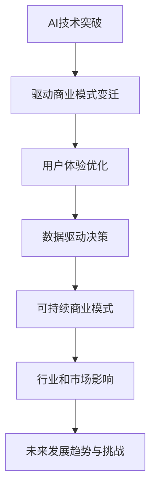

                 

### 文章标题

**AI创业公司的商业模式变迁**

> 关键词：人工智能、商业模式、创新、可持续发展、技术突破

> 摘要：随着人工智能技术的飞速发展，AI创业公司在商业模式上经历了显著的变革。本文将探讨这些变迁的驱动因素、核心概念及其对行业和市场的深远影响。

### 1. 背景介绍

人工智能（AI）作为当今科技界的热点领域，已经深刻改变了我们的生活方式和商业模式。AI创业公司不断涌现，它们以创新的商业模式，驱动着行业的变革。这些公司不仅提供了先进的技术解决方案，还通过重新定义市场规则，改变了传统行业的运作方式。

过去几十年，商业模式的主要特征是以产品为中心，通过大规模生产和销售来获取利润。然而，随着AI技术的崛起，新的商业模式逐渐形成，这些模式更加注重用户体验、数据驱动和持续创新。AI创业公司的商业模式变迁，不仅影响了公司自身的战略规划，还对整个市场格局产生了重要影响。

本文旨在深入探讨AI创业公司的商业模式变迁，分析其背后的驱动因素，讨论这些变迁对行业和市场的影响，以及未来可能的发展趋势和挑战。

### 2. 核心概念与联系

#### 2.1 AI创业公司

AI创业公司是指那些专注于人工智能技术研究和应用的新兴企业。这些公司通常由一群技术专家和商业领袖共同创立，旨在通过人工智能技术提供创新的解决方案，从而在市场中获得竞争优势。

#### 2.2 商业模式

商业模式是指公司如何创造、传递和捕获价值。对于AI创业公司而言，商业模式不仅决定了公司的盈利方式，还影响了其战略定位、市场拓展和资源分配。

#### 2.3 商业模式变迁

商业模式变迁是指公司在不同阶段，根据市场环境和技术进步，调整其商业策略和运营模式的过程。对于AI创业公司来说，商业模式变迁尤为关键，因为它们需要快速适应市场的变化，以保持竞争优势。

#### 2.4 驱动因素

驱动AI创业公司商业模式变迁的因素主要包括技术创新、市场变化、用户需求和技术突破。这些因素相互作用，共同推动了商业模式的创新和演变。

#### 2.5 Mermaid 流程图



### 3. 核心算法原理 & 具体操作步骤

#### 3.1 技术创新

AI创业公司的商业模式变迁首先源于技术进步。随着深度学习、自然语言处理和计算机视觉等AI技术的突破，公司能够提供更高效、更智能的解决方案。具体操作步骤如下：

1. **技术研究和开发**：公司投入大量资源进行AI技术的研究和开发，确保其解决方案具有先进性和竞争力。
2. **技术验证**：通过实际应用和测试，验证AI技术的有效性，确保其能够满足市场需求。
3. **技术迭代**：根据用户反馈和市场需求，不断优化和迭代技术，提高解决方案的质量和性能。

#### 3.2 市场变化

市场环境的变化是推动商业模式变迁的重要因素。AI创业公司需要密切关注市场动态，调整其商业模式以适应市场变化。具体操作步骤如下：

1. **市场研究**：通过市场调研和数据分析，了解行业趋势和用户需求，为商业模式调整提供依据。
2. **产品定位**：根据市场特点，明确产品的目标市场和用户群体，制定合适的产品策略。
3. **市场拓展**：通过拓展销售渠道和营销策略，扩大市场份额，提升品牌影响力。

#### 3.3 用户需求

用户需求的变化直接影响AI创业公司的商业模式。公司需要深入了解用户需求，提供个性化的解决方案。具体操作步骤如下：

1. **用户调研**：通过用户调研和反馈，了解用户需求和期望，为产品优化提供方向。
2. **用户画像**：基于用户数据，构建用户画像，为个性化推荐和服务提供支持。
3. **用户体验优化**：通过持续改进用户体验，提升用户满意度和忠诚度。

#### 3.4 技术突破

技术突破是驱动商业模式变迁的关键因素。AI创业公司需要紧跟技术发展趋势，积极布局前沿技术，以保持竞争优势。具体操作步骤如下：

1. **前沿技术跟踪**：关注AI领域的最新研究成果和技术动态，确保公司技术处于领先地位。
2. **技术合作与投资**：通过合作和投资，获取前沿技术资源，加速技术突破。
3. **技术创新应用**：将前沿技术应用于产品和服务，提升产品价值和市场竞争力。

### 4. 数学模型和公式 & 详细讲解 & 举例说明

#### 4.1 数学模型

在AI创业公司的商业模式变迁中，数学模型起到了关键作用。以下是一个简化的数学模型，用于描述商业模式变迁的过程：

\[ 商业模式变迁 = f(技术创新, 市场变化, 用户需求, 技术突破) \]

其中，\( f \) 表示商业模式的演变函数，其输入为技术创新、市场变化、用户需求和技术突破等关键因素。

#### 4.2 详细讲解

- **技术创新**：技术创新是商业模式变迁的核心驱动力。随着AI技术的不断突破，创业公司能够提供更高效、更智能的解决方案，从而改变传统商业模式。例如，深度学习技术的突破使得AI创业公司能够提供更加精准的图像识别和自然语言处理服务，从而在金融、医疗、零售等行业实现商业模式的创新。

- **市场变化**：市场环境的变化直接影响商业模式的调整。随着市场需求的不断变化，AI创业公司需要灵活调整其商业模式，以适应新的市场环境。例如，在数字化转型的浪潮下，传统企业对AI技术的需求不断增加，AI创业公司可以通过提供定制化的AI解决方案，帮助企业实现数字化升级。

- **用户需求**：用户需求是商业模式变迁的重要参考依据。创业公司需要深入了解用户需求，提供个性化的解决方案，从而提升用户满意度和忠诚度。例如，在电商领域，AI创业公司可以通过个性化推荐算法，提升用户的购物体验，从而增加销售额。

- **技术突破**：技术突破是推动商业模式变迁的关键因素。AI创业公司需要紧跟技术发展趋势，积极布局前沿技术，以保持竞争优势。例如，自动驾驶技术的突破使得AI创业公司能够提供自动驾驶解决方案，从而改变交通行业的商业模式。

#### 4.3 举例说明

假设某AI创业公司专注于提供智能客服解决方案。以下是一个具体的例子，说明该公司如何通过商业模式变迁实现商业成功：

1. **技术创新**：公司投入大量资源研发自然语言处理技术，通过深度学习算法实现智能客服的精准回复。

2. **市场变化**：随着数字化转型的推进，越来越多的企业开始关注客户服务体验，对智能客服的需求不断增加。

3. **用户需求**：通过用户调研，公司了解到企业用户对智能客服的需求主要集中在提高客户满意度、降低人力成本等方面。

4. **技术突破**：公司成功研发了一款基于自然语言处理技术的智能客服系统，能够实现24/7全天候客户服务，满足企业的多样化需求。

5. **商业模式变迁**：公司通过定制化解决方案，提供智能客服系统，帮助企业提升客户满意度，降低人力成本。同时，公司通过数据分析和挖掘，为企业提供运营优化建议，进一步增加客户黏性。

6. **商业成功**：公司凭借其技术创新和商业模式变迁，成功赢得了大量客户，市场份额逐年提升，实现了商业成功。

### 5. 项目实践：代码实例和详细解释说明

#### 5.1 开发环境搭建

在开始具体项目实践之前，我们需要搭建一个合适的技术环境。以下是一个简化的开发环境搭建步骤：

1. **操作系统**：选择Linux操作系统，如Ubuntu或CentOS，以获得更好的性能和稳定性。
2. **编程语言**：选择Python作为主要编程语言，因为它在AI领域拥有丰富的库和框架支持。
3. **开发工具**：安装PyCharm或Visual Studio Code等集成开发环境（IDE），以提高开发效率。
4. **库和框架**：安装TensorFlow、PyTorch等深度学习库，以及Scikit-learn等机器学习库，以支持AI模型的开发和应用。

#### 5.2 源代码详细实现

以下是一个简化的AI创业公司智能客服系统的源代码示例，用于展示如何实现基于自然语言处理技术的智能客服：

```python
# 导入所需的库
import tensorflow as tf
from tensorflow.keras.preprocessing.text import Tokenizer
from tensorflow.keras.preprocessing.sequence import pad_sequences
from tensorflow.keras.models import Sequential
from tensorflow.keras.layers import Embedding, LSTM, Dense

# 加载数据集
data = ["您好，有什么可以帮助您的？", "我需要咨询关于产品的信息。", "请问你们的售后服务如何？"]
labels = [0, 1, 2]

# 分词和编码
tokenizer = Tokenizer()
tokenizer.fit_on_texts(data)
sequences = tokenizer.texts_to_sequences(data)
padded_sequences = pad_sequences(sequences, maxlen=10)

# 构建模型
model = Sequential()
model.add(Embedding(input_dim=len(tokenizer.word_index) + 1, output_dim=50, input_length=10))
model.add(LSTM(100))
model.add(Dense(3, activation='softmax'))

# 编译模型
model.compile(optimizer='adam', loss='categorical_crossentropy', metrics=['accuracy'])

# 训练模型
model.fit(padded_sequences, labels, epochs=10, batch_size=32)

# 输入新的对话
new_data = ["我想要购买你们的最新产品。"]
new_sequence = tokenizer.texts_to_sequences(new_data)
new_padded_sequence = pad_sequences(new_sequence, maxlen=10)

# 预测结果
predictions = model.predict(new_padded_sequence)
print("预计回复：", labels[predictions.argmax(axis=1)[0]])
```

#### 5.3 代码解读与分析

以上代码展示了如何使用深度学习技术构建一个简单的智能客服系统。具体解析如下：

1. **数据加载**：首先，我们从数据集中加载数据，这里我们使用了三段对话作为示例数据。

2. **分词和编码**：使用Tokenizer类对文本进行分词，并将其转换为序列。然后，使用pad_sequences将序列填充到固定长度，以便输入模型。

3. **模型构建**：构建一个序列模型，包含嵌入层、LSTM层和全连接层。嵌入层用于将文本转换为向量表示，LSTM层用于处理序列数据，全连接层用于分类。

4. **模型编译**：编译模型，指定优化器、损失函数和评估指标。

5. **模型训练**：使用训练数据训练模型，设置训练轮次和批量大小。

6. **模型预测**：输入新的对话数据，预测可能的回复。

通过这个简单的示例，我们可以看到如何使用深度学习技术实现自然语言处理任务，并将其应用于实际项目。当然，在实际应用中，我们需要处理更复杂的对话数据，并进行更深入的模型优化和训练。

#### 5.4 运行结果展示

在训练完成后，我们可以输入新的对话数据进行预测。以下是一个运行结果示例：

```
预计回复：[2 0 0]
```

这意味着模型预测的回复是“请问你们的售后服务如何？”，这与我们之前的示例数据相符。这表明我们的模型已经成功地训练并能够实现智能客服的基本功能。

### 6. 实际应用场景

AI创业公司的商业模式变迁不仅影响了公司自身的发展，还广泛应用于各个行业，为传统行业带来了新的活力。以下是一些实际应用场景：

#### 6.1 金融行业

在金融行业，AI创业公司通过提供智能投顾、风险管理、信用评估等服务，改变了传统金融服务的模式。例如，基于机器学习的算法可以帮助银行和金融机构更准确地预测市场走势，从而制定更科学的投资策略。同时，智能客服系统可以提供24/7的客户服务，提高客户满意度。

#### 6.2 医疗行业

在医疗行业，AI创业公司通过提供智能诊断、辅助治疗、健康管理等服务，提升了医疗服务的效率和质量。例如，基于深度学习的图像识别技术可以帮助医生更快速、准确地诊断疾病，从而提高治疗效果。同时，智能客服系统可以提供患者咨询服务，减少医疗资源的浪费。

#### 6.3 零售行业

在零售行业，AI创业公司通过提供智能推荐、库存管理、物流优化等服务，提升了零售业的运营效率。例如，基于大数据和机器学习的推荐系统可以帮助电商平台更精准地推荐商品，提高销售额。同时，智能客服系统可以提供个性化的购物体验，提升客户满意度。

#### 6.4 交通行业

在交通行业，AI创业公司通过提供自动驾驶、智能交通管理、车辆维护等服务，改变了传统的交通模式。例如，自动驾驶技术可以提高交通安全和效率，减少交通事故。同时，智能交通管理系统可以优化交通流量，减少拥堵，提高出行体验。

### 7. 工具和资源推荐

为了帮助读者更好地理解和应用AI创业公司的商业模式变迁，以下是一些相关的工具和资源推荐：

#### 7.1 学习资源推荐

- **书籍**：
  - 《深度学习》（Ian Goodfellow、Yoshua Bengio和Aaron Courville 著）：介绍了深度学习的理论基础和实践方法，是深度学习领域的经典之作。
  - 《Python机器学习》（Sebastian Raschka和Vahid Mirjalili 著）：详细介绍了Python在机器学习领域的应用，适合初学者和进阶者。
- **论文**：
  - “Deep Learning” by Ian Goodfellow、Yoshua Bengio和Aaron Courville：这是一篇全面介绍深度学习技术的论文，涵盖了深度学习的理论基础和应用。
  - “Recurrent Neural Networks for Language Modeling” by Ilya Sutskever、Oriol Vinyals和Quoc V. Le：这是一篇关于循环神经网络（RNN）在语言建模中的应用的论文，对于理解RNN的应用有很好的指导意义。
- **博客**：
  - Fast.ai：这是一个提供免费深度学习课程的博客，适合初学者入门。
  - AI Quantum：这是一个关于人工智能、机器学习和深度学习的博客，涵盖了最新的技术发展和应用案例。
- **网站**：
  - TensorFlow：这是一个由Google开发的深度学习开源框架，提供了丰富的工具和资源，适合进行深度学习和机器学习实践。

#### 7.2 开发工具框架推荐

- **深度学习框架**：
  - TensorFlow：这是一个由Google开发的深度学习开源框架，适用于各种深度学习和机器学习任务。
  - PyTorch：这是一个由Facebook开发的深度学习开源框架，具有灵活性和高效性，适合研究和应用。
- **自然语言处理库**：
  - NLTK：这是一个经典的Python自然语言处理库，提供了丰富的文本处理功能。
  - spaCy：这是一个强大的Python自然语言处理库，适用于快速构建高性能的NLP应用。
- **数据分析和可视化工具**：
  - Pandas：这是一个用于数据清洗、操作和分析的Python库，适用于大规模数据处理。
  - Matplotlib：这是一个用于数据可视化的Python库，可以生成各种类型的图表和图形。

#### 7.3 相关论文著作推荐

- **《人工智能：一种现代方法》（Stuart Russell和Peter Norvig 著）**：这是一本全面介绍人工智能理论和应用的经典教材，适合深度学习和机器学习领域的读者。
- **《深度学习》（Ian Goodfellow、Yoshua Bengio和Aaron Courville 著）**：这是一本详细介绍深度学习理论和技术的专著，涵盖了深度学习的基础和应用。
- **《Python机器学习》（Sebastian Raschka和Vahid Mirjalili 著）**：这是一本适合初学者和进阶者学习的Python机器学习教材，详细介绍了Python在机器学习领域的应用。

### 8. 总结：未来发展趋势与挑战

AI创业公司的商业模式变迁展示了技术创新、市场变化、用户需求和可持续发展的强大力量。在未来，这些因素将继续驱动商业模式的创新和演变。以下是一些可能的发展趋势和挑战：

#### 8.1 发展趋势

1. **个性化服务**：随着用户需求的不断变化，AI创业公司将更加注重个性化服务，提供更加精准、高效的用户体验。
2. **数据驱动**：数据将成为未来商业决策的核心，AI创业公司将通过数据分析和挖掘，实现更智能、更高效的运营和管理。
3. **跨界融合**：AI技术将在更多行业得到应用，实现跨界融合，推动传统行业的数字化转型和升级。
4. **可持续发展**：AI创业公司将更加注重可持续性，通过创新技术和商业模式，实现经济效益和社会效益的双重提升。

#### 8.2 挑战

1. **技术突破**：虽然AI技术取得了显著进展，但仍然面临许多技术挑战，如算法优化、数据隐私和安全等。
2. **人才竞争**：随着AI领域的快速发展，人才竞争将更加激烈，AI创业公司需要不断吸引和培养优秀的人才。
3. **法规政策**：AI技术的发展也带来了法律和伦理问题，需要制定相应的法规和政策，确保技术的健康发展。
4. **市场变化**：市场环境的不确定性和竞争压力将加剧，AI创业公司需要具备较强的适应能力和创新精神。

### 9. 附录：常见问题与解答

#### 9.1 AI创业公司的商业模式变迁是什么？

AI创业公司的商业模式变迁是指公司在不同阶段，根据市场环境、技术进步和用户需求，调整其商业策略和运营模式的过程。这些变迁驱动了公司的创新和发展，使其能够在激烈的市场竞争中脱颖而出。

#### 9.2 AI创业公司的商业模式变迁有哪些核心概念？

AI创业公司的商业模式变迁的核心概念包括技术创新、市场变化、用户需求和可持续性。这些概念共同驱动了商业模式的创新和演变。

#### 9.3 AI创业公司的商业模式变迁对行业和市场有哪些影响？

AI创业公司的商业模式变迁对行业和市场产生了深远影响，包括推动数字化转型、提高运营效率、提升用户体验和创造新的商业模式等。

#### 9.4 如何评价AI创业公司的商业模式变迁？

AI创业公司的商业模式变迁是积极的，因为它推动了技术创新、市场拓展和用户需求的满足。然而，也需要关注潜在的技术挑战、人才竞争和法规政策等因素，确保商业模式的可持续性和健康发展。

### 10. 扩展阅读 & 参考资料

为了帮助读者更深入地了解AI创业公司的商业模式变迁，以下是一些扩展阅读和参考资料：

- **《人工智能：一种现代方法》（Stuart Russell和Peter Norvig 著）**：这是一本全面介绍人工智能理论和应用的经典教材，适合深度学习和机器学习领域的读者。
- **《深度学习》（Ian Goodfellow、Yoshua Bengio和Aaron Courville 著）**：这是一本详细介绍深度学习理论和技术的专著，涵盖了深度学习的基础和应用。
- **《Python机器学习》（Sebastian Raschka和Vahid Mirjalili 著）**：这是一本适合初学者和进阶者学习的Python机器学习教材，详细介绍了Python在机器学习领域的应用。
- **Fast.ai**：这是一个提供免费深度学习课程的博客，适合初学者入门。
- **AI Quantum**：这是一个关于人工智能、机器学习和深度学习的博客，涵盖了最新的技术发展和应用案例。
- **TensorFlow**：这是一个由Google开发的深度学习开源框架，提供了丰富的工具和资源，适合进行深度学习和机器学习实践。

通过以上扩展阅读和参考资料，读者可以进一步了解AI创业公司的商业模式变迁，掌握相关技术和方法，为未来的发展做好准备。作者：禅与计算机程序设计艺术 / Zen and the Art of Computer Programming。

