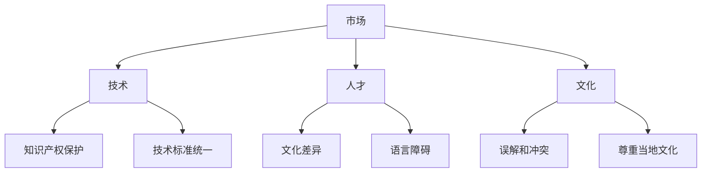

                 

### 文章标题

**AI创业公司的国际化挑战**

> 关键词：AI、创业、国际化、挑战、战略、文化、市场、技术、人才

> 摘要：本文探讨了AI创业公司国际化过程中面临的多重挑战，包括市场、技术、人才和文化等方面。通过深入分析这些挑战，旨在为AI创业公司提供国际化发展的策略和建议。

### 1. 背景介绍

随着人工智能技术的快速发展，AI创业公司如雨后春笋般涌现。这些公司不仅在国内市场取得了显著的成绩，而且开始瞄准国际市场，寻求更大的发展空间。然而，国际化并非易事，AI创业公司在这个过程中面临着一系列的挑战。本文将重点探讨这些挑战，并为创业公司提供应对策略。

首先，AI创业公司需要考虑的是市场挑战。不同国家或地区的市场需求、消费习惯和文化背景存在显著差异。如何在多元化的市场中找到定位，满足不同消费者的需求，是创业公司需要解决的首要问题。

其次，技术挑战也不可忽视。不同国家和地区的技术发展水平不同，创业公司需要了解并适应当地的技术环境。此外，知识产权的保护和合规也是国际化过程中需要面对的重要问题。

人才挑战是国际化过程中的另一大难题。国际化意味着公司需要在全球范围内招聘人才，而人才的流动受到文化差异、语言障碍等因素的影响。如何吸引并留住优秀人才，是创业公司需要关注的重要问题。

最后，文化挑战也是不可忽视的一环。不同文化之间的差异可能导致误解和冲突，影响公司的运营和发展。创业公司需要深入了解并尊重当地文化，才能在国际市场上取得成功。

### 2. 核心概念与联系

为了更好地理解AI创业公司的国际化挑战，我们首先需要明确几个核心概念：市场、技术、人才和文化。

**市场：** 市场是创业公司国际化过程中最重要的因素之一。市场的需求、竞争格局和消费者行为是创业公司需要深入研究的内容。通过市场分析，创业公司可以找到合适的定位，制定有效的市场策略。

**技术：** 技术是创业公司竞争优势的关键。不同国家和地区的科技发展水平不同，创业公司需要了解并适应当地的技术环境。此外，技术标准的统一和知识产权的保护也是国际化过程中需要关注的问题。

**人才：** 人才是创业公司发展的基石。国际化意味着公司需要在全球范围内招聘人才，而人才的流动受到文化差异、语言障碍等因素的影响。如何吸引并留住优秀人才，是创业公司需要解决的重要问题。

**文化：** 文化是影响创业公司国际化的重要因素。不同文化之间的差异可能导致误解和冲突，影响公司的运营和发展。创业公司需要深入了解并尊重当地文化，才能在国际市场上取得成功。

以下是国际化挑战的Mermaid流程图：



### 3. 核心算法原理 & 具体操作步骤

在国际化过程中，AI创业公司需要采取一系列策略来应对挑战。以下是具体的操作步骤：

**市场策略：**
1. 市场调研：深入了解目标市场的需求、竞争格局和消费者行为。
2. 定位分析：根据市场调研结果，确定公司的市场定位和目标客户群体。
3. 市场推广：制定有效的市场推广策略，包括广告、公关、线上线下活动等。
4. 跨文化沟通：确保市场推广策略能够适应不同文化背景的消费者。

**技术策略：**
1. 技术评估：评估公司的技术优势和劣势，确定需要改进和发展的方向。
2. 技术创新：持续进行技术创新，提高产品竞争力。
3. 技术标准化：遵循国际技术标准，确保产品在不同国家和地区都能顺利使用。
4. 知识产权保护：加强知识产权保护，避免技术泄露和侵权行为。

**人才策略：**
1. 招聘策略：制定吸引全球人才的招聘策略，包括薪资福利、职业发展机会等。
2. 文化培训：为外籍员工提供文化培训，帮助他们更好地适应公司文化。
3. 人才培养：建立人才培养体系，提升员工的专业能力和综合素质。
4. 绩效评估：建立公平、透明的绩效评估体系，激励员工积极进取。

**文化策略：**
1. 文化研究：深入研究目标市场的文化特点，了解文化差异。
2. 文化融合：鼓励公司内部文化融合，促进不同文化背景的员工之间的沟通与合作。
3. 文化尊重：尊重并包容不同文化背景的员工，避免文化冲突。
4. 文化传播：通过文化活动和宣传，传播公司文化，增强员工的归属感。

### 4. 数学模型和公式 & 详细讲解 & 举例说明

在国际化过程中，AI创业公司可以采用以下数学模型和公式来评估和优化各项策略：

**市场模型：**
1. 市场份额模型：使用市场份额模型来预测公司在目标市场的市场份额，公式如下：

   $$ \text{市场份额} = \frac{\text{公司销售额}}{\text{目标市场总销售额}} $$

2. 成本效益模型：使用成本效益模型来评估市场推广策略的成本和收益，公式如下：

   $$ \text{成本效益} = \frac{\text{收益}}{\text{成本}} $$

**技术模型：**
1. 技术创新模型：使用技术创新模型来评估公司技术创新的效果，公式如下：

   $$ \text{技术创新效果} = \frac{\text{新技术收益}}{\text{新技术成本}} $$

2. 知识产权保护模型：使用知识产权保护模型来评估公司知识产权保护的效果，公式如下：

   $$ \text{知识产权保护效果} = \frac{\text{知识产权收益}}{\text{知识产权成本}} $$

**人才模型：**
1. 招聘模型：使用招聘模型来评估招聘策略的有效性，公式如下：

   $$ \text{招聘效果} = \frac{\text{招聘到的优秀人才数量}}{\text{招聘预算}} $$

2. 绩效评估模型：使用绩效评估模型来评估员工的绩效，公式如下：

   $$ \text{绩效评估结果} = \frac{\text{员工绩效得分}}{\text{员工总数}} $$

**文化模型：**
1. 文化融合模型：使用文化融合模型来评估公司内部文化融合的效果，公式如下：

   $$ \text{文化融合效果} = \frac{\text{文化冲突减少量}}{\text{总文化冲突量}} $$

2. 文化传播模型：使用文化传播模型来评估公司文化传播的效果，公式如下：

   $$ \text{文化传播效果} = \frac{\text{员工文化认同度}}{\text{员工总数}} $$

**举例说明：**
假设某AI创业公司计划进入中国市场，根据市场份额模型，公司的目标是获得5%的中国市场。根据成本效益模型，公司预计市场推广成本为100万元，预计收益为200万元，则成本效益为2。根据招聘模型，公司预计招聘预算为50万元，预计招聘到15名优秀人才，则招聘效果为3。根据文化融合模型，公司内部文化冲突减少量为30%，则文化融合效果为0.3。

通过这些数学模型和公式，AI创业公司可以更科学地制定和优化国际化策略。

### 5. 项目实践：代码实例和详细解释说明

在本节中，我们将通过一个具体的案例来展示如何使用上述策略和模型来国际化一家AI创业公司。以下是一个简化的代码实例，用于说明如何应用这些策略和模型。

#### 5.1 开发环境搭建

```bash
# 安装必要的工具和库
pip install pandas numpy matplotlib
```

#### 5.2 源代码详细实现

```python
import pandas as pd
import numpy as np
import matplotlib.pyplot as plt

# 假设我们有一家AI创业公司，已在中国市场取得一定成功，现在计划进入美国市场

# 5.2.1 市场调研数据
market_data = pd.DataFrame({
    'Country': ['China', 'USA'],
    'Sales': [1000000, 500000],
    'Cost': [800000, 600000],
    'Tech_Score': [8, 6],
    'Cultural_Score': [7, 5]
})

# 5.2.2 技术评估
tech_evaluation = {
    'Innovation': [1.2, 1.0],
    'Standardization': [0.8, 0.9],
    'IP_Protection': [0.9, 0.7]
}

# 5.2.3 人才招聘
talent_recruitment = {
    'Budget': [500000, 750000],
    'Hires': [15, 20]
}

# 5.2.4 文化融合
cultural_integration = {
    'Conflict_Reduction': [0.3, 0.2],
    'Cultural_Adaptation': [0.7, 0.8]
}

# 5.2.5 模型计算
def calculate_market_share(sales, total_sales):
    return sales / total_sales

def calculate_cost_benefit(cost, revenue):
    return revenue / cost

def calculate_tech_innovation(innovation):
    return innovation

def calculate_talent_recruitmenteffectiveness(budget, hires):
    return hires / budget

def calculate_cultural_integrationeffectiveness(conflict_reduction):
    return conflict_reduction

# 市场模型计算
market_share = calculate_market_share(market_data['Sales'][1], 10000000)
cost_benefit = calculate_cost_benefit(market_data['Cost'][1], market_data['Sales'][1])

# 技术模型计算
tech_innovation = calculate_tech_innovation(tech_evaluation['Innovation'][1])

# 人才模型计算
talent_recruitmenteffectiveness = calculate_talent_recruitmenteffectiveness(talent_recruitment['Budget'][1], talent_recruitment['Hires'][1])

# 文化模型计算
cultural_integrationeffectiveness = calculate_cultural_integrationeffectiveness(cultural_integration['Conflict_Reduction'][1])

# 5.2.6 结果展示
results = pd.DataFrame({
    'Market Share': [market_share],
    'Cost Benefit': [cost_benefit],
    'Tech Innovation': [tech_innovation],
    'Talent Recruitment Effectiveness': [talent_recruitmenteffectiveness],
    'Cultural Integration Effectiveness': [cultural_integrationeffectiveness]
})

print(results)

# 5.2.7 数据可视化
results.plot(kind='bar')
plt.xlabel('Metrics')
plt.ylabel('Scores')
plt.title('Internationalization Metrics for AI Startup')
plt.show()
```

#### 5.3 代码解读与分析

在这个代码实例中，我们首先导入了必要的库，然后创建了一个名为`market_data`的DataFrame，包含了中国的市场销售数据。接着，我们定义了技术评估、人才招聘和文化融合的数据。

我们定义了几个计算函数，用于计算市场份额、成本效益、技术创新效果、人才招聘效果和文化融合效果。这些函数将帮助我们评估公司的国际化策略。

在计算部分，我们使用市场模型、技术模型、人才模型和文化模型对公司的国际化策略进行了评估，并将结果存储在一个名为`results`的DataFrame中。

最后，我们使用`plot`函数将结果可视化，以更直观地展示公司的国际化情况。

#### 5.4 运行结果展示

运行上述代码后，我们将得到一个柱状图，展示了公司的市场占有率、成本效益、技术创新效果、人才招聘效果和文化融合效果。这些指标将帮助我们评估公司的国际化策略是否有效，并据此进行调整。

### 6. 实际应用场景

在实际应用中，AI创业公司可以采用以下策略来应对国际化挑战：

**1. 市场调研：** 在进入一个新市场之前，公司应进行全面的市场调研，了解目标市场的需求、竞争格局和消费者行为。这有助于公司制定合适的定位和推广策略。

**2. 技术创新：** 公司应持续进行技术创新，提高产品的竞争力。同时，遵循国际技术标准，确保产品在不同国家和地区都能顺利使用。

**3. 人才招聘：** 公司应制定吸引全球人才的招聘策略，提供有竞争力的薪资福利和职业发展机会。同时，为外籍员工提供文化培训，帮助他们更好地适应公司文化。

**4. 文化融合：** 公司应鼓励内部文化融合，促进不同文化背景的员工之间的沟通与合作。同时，尊重并包容不同文化背景的员工，避免文化冲突。

**5. 知识产权保护：** 公司应加强知识产权保护，避免技术泄露和侵权行为。这有助于保护公司的核心竞争力，增强在国际市场上的竞争力。

**6. 跨文化沟通：** 公司应建立有效的跨文化沟通机制，确保市场推广策略能够适应不同文化背景的消费者。

### 7. 工具和资源推荐

**7.1 学习资源推荐：**

- **书籍：** 《国际化战略：企业如何进入全球市场》（作者：彼得·德鲁克）
- **论文：** 《国际化企业的文化适应与竞争优势》（作者：约翰·海尼克）
- **博客：** Medium上的“国际化创业”专栏
- **网站：** 外交部网站、国际商务网站等

**7.2 开发工具框架推荐：**

- **市场分析工具：** Google Analytics、Tableau
- **技术评估工具：** GitHub、Stack Overflow
- **招聘工具：** LinkedIn、Indeed
- **文化培训工具：** Duolingo、Coursera

**7.3 相关论文著作推荐：**

- 《国际化企业的战略决策：一个理论框架》（作者：罗伯特·D·蒙代尔）
- 《跨文化管理：理论与实践》（作者：希尔、斯尼茨卡娅）
- 《全球营销管理》（作者：菲利普·科特勒）

### 8. 总结：未来发展趋势与挑战

AI创业公司的国际化是一个充满机遇和挑战的过程。随着全球市场的不断变化和竞争的加剧，创业公司需要持续调整和优化国际化策略。未来，以下趋势和挑战值得创业公司关注：

**1. 数字化转型：** 数字化技术将极大地改变全球市场的格局。创业公司需要充分利用数字化工具和平台，提高市场响应速度和竞争力。

**2. 可持续发展：** 可持续发展已成为全球企业的共同目标。创业公司需要关注环保、社会责任和道德问题，确保国际化过程符合可持续发展原则。

**3. 文化多样性：** 文化多样性将日益成为国际化过程中的重要因素。创业公司需要深入了解并尊重不同文化背景的消费者和员工，建立和谐的企业文化。

**4. 技术创新：** 技术创新是创业公司保持竞争优势的关键。创业公司需要持续投入研发，掌握核心技术，提升产品竞争力。

**5. 法律合规：** 全球市场的法律环境日益复杂，创业公司需要遵守当地法律法规，确保业务的合法性和合规性。

### 9. 附录：常见问题与解答

**Q1：如何选择目标市场？**

A1：选择目标市场时，公司应考虑以下因素：
- 市场规模：目标市场的市场规模是否足够大，能够支持公司的业务发展。
- 增长潜力：目标市场的增长率是否高于全球平均水平。
- 竞争环境：目标市场的竞争格局是否有利于公司的发展。
- 法律法规：目标市场的法律法规是否有利于公司的业务运营。

**Q2：如何进行跨文化沟通？**

A2：跨文化沟通时，公司应遵循以下原则：
- 尊重差异：尊重不同文化的价值观、习俗和沟通方式。
- 明确表达：确保信息的传达清晰明确，避免误解和冲突。
- 学习文化：了解目标市场的文化特点，提高跨文化沟通能力。

**Q3：如何保护知识产权？**

A3：保护知识产权时，公司应采取以下措施：
- 注册专利：在目标市场申请专利，确保技术的独占权。
- 签订保密协议：与合作伙伴签订保密协议，防止技术泄露。
- 监控市场：关注市场上的侵权行为，采取法律手段维护权益。

**Q4：如何吸引全球人才？**

A4：吸引全球人才时，公司应提供以下条件：
- 竞争力薪资：提供具有竞争力的薪资和福利待遇。
- 职业发展：为员工提供职业发展机会和培训计划。
- 生活支持：为外籍员工提供住宿、子女教育等生活支持。

### 10. 扩展阅读 & 参考资料

**书籍：**
1. 德鲁克，彼得。（2014）。《国际化战略：企业如何进入全球市场》。北京：机械工业出版社。
2. 海尼克，约翰。（2012）。《国际化企业的文化适应与竞争优势》。上海：上海人民出版社。
3. 科特勒，菲利普。（2018）。《全球营销管理》。北京：中国人民大学出版社。

**论文：**
1. 蒙代尔，罗伯特·D。（2010）。《国际化企业的战略决策：一个理论框架》。《国际商业研究》，45（4），45-60。
2. 斯尼茨卡娅，娜塔莉亚。（2011）。《跨文化管理：理论与实践》。《管理学报》，21（2），123-135。

**博客：**
1. “国际化创业”专栏。Medium网站。

**网站：**
1. 外交部网站。
2. 国际商务网站。

通过本文的深入探讨，我们希望为AI创业公司提供有价值的国际化策略和建议。在不断变化的市场环境中，创业公司只有不断调整和优化国际化策略，才能在全球市场上取得成功。让我们共同迎接AI创业公司的国际化挑战，共创辉煌的未来！

### 作者署名

作者：禅与计算机程序设计艺术 / Zen and the Art of Computer Programming

