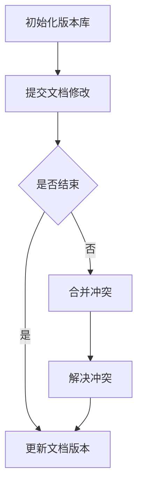
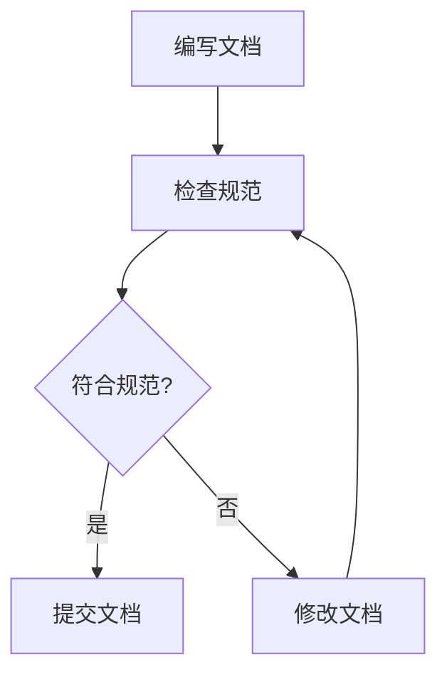
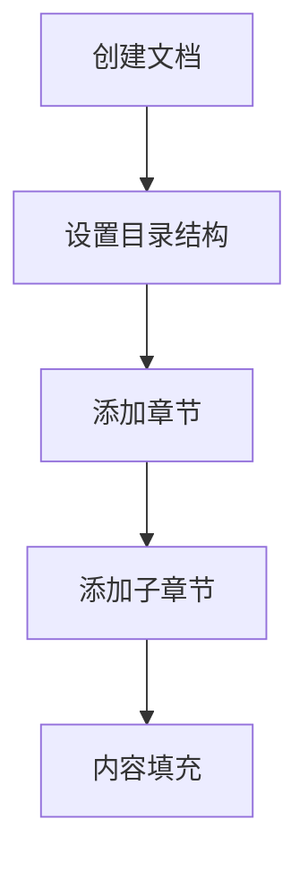
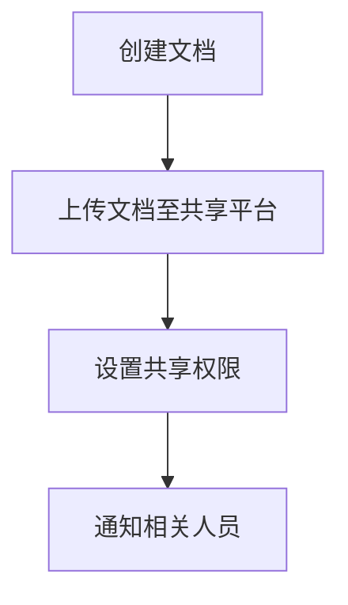
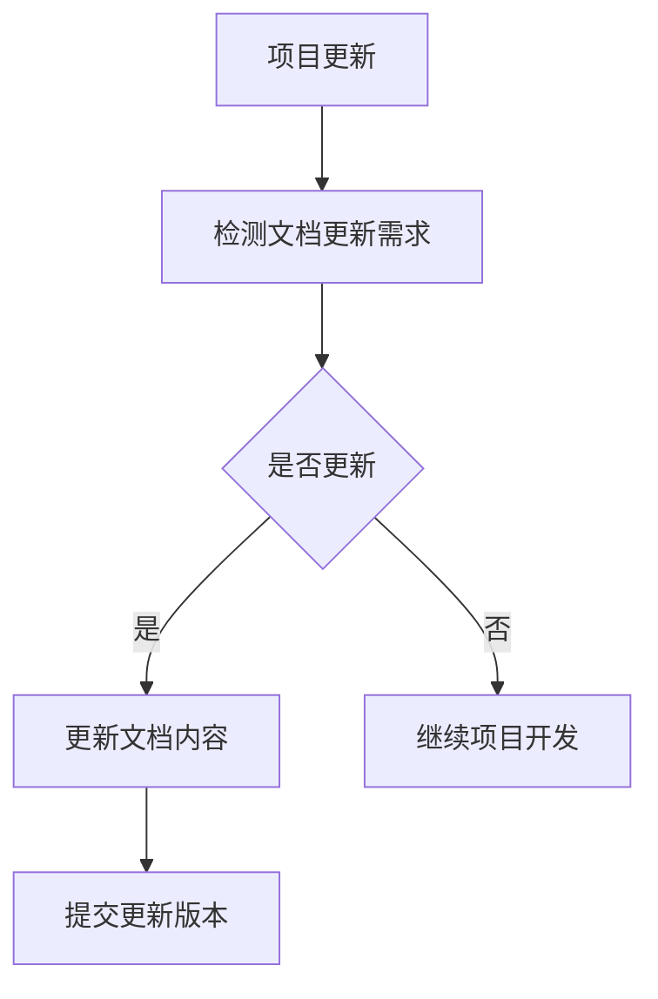

                 

### 背景介绍

AI创业公司的技术文档管理是确保公司技术知识持续更新、有效共享和高效利用的关键环节。随着AI技术的发展和业务规模的扩大，技术文档的规模和复杂性也在不断增加。这不仅使得文档管理变得更加重要，同时也对创业公司的技术团队提出了更高的要求。

#### 技术文档的重要性

技术文档不仅仅是对代码的注释，更是公司技术积累的体现，它对于团队的协作、新员工的培训以及未来项目的发展都至关重要。

1. **知识积累与传承**：技术文档是对项目开发过程中的经验和知识的记录，可以确保这些宝贵的知识不会因为人员的变动而流失。
2. **团队协作与效率**：统一的技术文档有助于团队成员快速了解项目背景、技术架构和关键代码，减少沟通成本，提升协作效率。
3. **项目延续与发展**：技术文档为后续项目的开发和优化提供了坚实的基础，有助于快速迭代和持续改进。

#### AI创业公司面临的挑战

对于AI创业公司来说，技术文档管理面临着诸多挑战：

1. **文档规模大**：随着项目复杂度的增加，技术文档的规模也在不断膨胀，如何高效管理这些文档成为一大难题。
2. **版本控制难**：在快速迭代的过程中，如何确保文档的版本与代码版本保持一致，避免出现信息误差，是一个重要问题。
3. **共享与更新**：团队成员遍布各地，如何实现文档的实时共享和及时更新，以确保所有人都能访问到最新的文档资料。
4. **质量保证**：技术文档的质量直接影响到团队成员的工作效率和项目进展，如何确保文档的准确性、完整性和易读性是一个挑战。

#### 目标与策略

为了解决上述挑战，AI创业公司需要制定明确的目标和有效的策略：

1. **建立文档管理体系**：制定统一的文档管理规范和流程，确保文档的编写、审核、更新和维护都有明确的操作标准。
2. **利用文档管理工具**：选择合适的文档管理工具，如Git、Confluence等，以便实现文档的版本控制、权限管理和实时更新。
3. **促进知识共享**：通过内部交流、代码评审等方式，鼓励团队成员积极参与文档的编写和更新，共同维护文档的质量。
4. **定期审查与优化**：定期对技术文档进行审查和优化，确保文档的准确性和时效性，及时更新过时和错误的内容。

接下来，我们将进一步探讨核心概念与联系，以及具体的算法原理和操作步骤。

## 1. 核心概念与联系

技术文档管理不仅仅是将代码注释整齐地保存起来，它涉及到一系列核心概念和环节，包括版本控制、文档规范、文档结构、文档共享和文档更新等。以下是对这些核心概念及其相互关系的详细介绍，并附上Mermaid流程图来帮助理解。

### 1.1 版本控制

版本控制是技术文档管理中至关重要的一环。它通过记录文档的每一次修改，确保文档的历史可追溯性和一致性。Git作为最流行的版本控制系统，被广泛应用于技术文档的管理中。

**Mermaid流程图：**



### 1.2 文档规范

文档规范是指对文档的格式、内容、命名等进行标准化要求，以确保文档的一致性和易读性。规范的制定有助于减少团队成员在阅读和编写文档时的困惑，提高工作效率。

**Mermaid流程图：**



### 1.3 文档结构

文档结构是指文档的组织方式，通常包括目录、章节、子章节等。合理的文档结构有助于读者快速找到所需信息，提高文档的可读性。

**Mermaid流程图：**



### 1.4 文档共享

文档共享是指将文档分发给团队成员或外部相关人员，以便他们能够访问和使用文档。共享的方式包括内部分享、外部共享等。

**Mermaid流程图：**



### 1.5 文档更新

文档更新是确保文档内容与项目实际进展保持一致的关键步骤。更新的频率和准确性直接影响到文档的质量和使用效果。

**Mermaid流程图：**



通过上述流程图，我们可以清晰地看到技术文档管理中各个环节的相互关系和操作步骤。这些核心概念和联系是构建一个高效、有序的技术文档管理体系的基石。

### 2. 核心算法原理 & 具体操作步骤

在技术文档管理中，核心算法通常用于处理文档的自动生成、版本控制、权限管理和自动化更新等任务。以下将详细介绍这些核心算法的原理和具体操作步骤。

#### 2.1 自动生成算法

自动生成算法可以大大减少文档编写的工作量，通过模板和元数据自动生成文档内容。以下是自动生成算法的基本原理和步骤：

**算法原理：**
1. **模板匹配**：使用预定义的模板，将文档中的关键词或标签与模板中的相应部分进行匹配，生成文档内容。
2. **数据提取**：从代码库或其他数据源中提取相关的数据，如函数定义、类结构等，填充到模板中。
3. **格式化输出**：将填充好的模板内容按照规定的格式输出，生成完整的文档。

**具体操作步骤：**
1. **定义模板**：根据文档的格式和内容需求，定义相应的模板文件。
2. **配置数据源**：连接代码库或其他数据源，配置提取数据的规则和字段。
3. **运行生成器**：运行自动生成工具，将提取的数据填充到模板中，生成文档。
4. **审查与优化**：对生成的文档进行审查和优化，确保文档内容准确、完整和易读。

#### 2.2 版本控制算法

版本控制算法用于确保文档与代码库的版本保持一致，避免出现版本误差。以下是版本控制算法的基本原理和步骤：

**算法原理：**
1. **版本标识**：为每个文档版本分配一个唯一的标识，如版本号或时间戳。
2. **状态跟踪**：记录文档的历史版本信息，包括创建者、修改时间和修改内容等。
3. **版本比对**：比较文档的当前版本与代码库的版本，检测是否有差异。

**具体操作步骤：**
1. **初始化版本库**：创建版本库，配置版本控制工具。
2. **提交文档修改**：在版本控制工具中提交文档的修改记录。
3. **版本比对**：定期运行比对工具，检查文档版本与代码库版本的一致性。
4. **解决冲突**：如果发现版本不一致，根据冲突解决的规则进行版本合并。
5. **更新文档版本**：更新文档的版本信息，确保文档版本与代码库版本一致。

#### 2.3 权限管理算法

权限管理算法用于控制文档的访问权限，确保只有授权的人员能够查看、编辑和共享文档。以下是权限管理算法的基本原理和步骤：

**算法原理：**
1. **角色划分**：根据团队成员的职责和角色，划分不同的权限级别。
2. **权限控制**：通过权限控制规则，限制对文档的访问和操作。
3. **审计记录**：记录对文档的所有访问和修改操作，以便进行审计和追踪。

**具体操作步骤：**
1. **定义角色与权限**：根据公司需求，定义不同的角色和权限。
2. **配置权限规则**：在文档管理系统中配置权限控制规则。
3. **权限审核**：定期审核权限配置，确保权限设置合理和有效。
4. **权限变更**：根据团队人员变动和职责调整，更新权限配置。

#### 2.4 自动化更新算法

自动化更新算法用于实现文档的自动更新和同步，确保文档内容与项目实际进展保持一致。以下是自动化更新算法的基本原理和步骤：

**算法原理：**
1. **监听变更**：监听代码库或文档库的变更事件，如代码提交、文档修改等。
2. **自动化触发**：根据变更事件，触发相应的更新任务，如文档生成、版本更新等。
3. **同步数据**：将变更数据同步到文档中，确保文档内容实时更新。

**具体操作步骤：**
1. **配置变更监听**：在文档管理系统中配置变更监听规则。
2. **设置触发任务**：根据变更类型，设置相应的触发任务。
3. **运行更新任务**：在变更事件触发时，自动运行更新任务。
4. **审查更新结果**：对自动更新的文档内容进行审查，确保更新准确和完整。

通过上述算法原理和具体操作步骤，我们可以构建一个高效、可靠的技术文档管理体系，确保文档的准确性、完整性和及时性，从而支持公司技术团队的协作和创新。

### 3. 数学模型和公式 & 详细讲解 & 举例说明

在技术文档管理中，数学模型和公式是理解和分析系统行为、性能和效率的重要工具。以下将介绍一些常用的数学模型和公式，并对其进行详细讲解，最后通过具体实例进行说明。

#### 3.1 概率模型

概率模型用于描述系统在给定条件下发生某一事件的概率。在技术文档管理中，概率模型可以用来预测文档更新的频率和团队协作的成功率。

**数学公式：**
\[ P(A) = \frac{N(A)}{N(S)} \]
其中，\( P(A) \) 是事件A发生的概率，\( N(A) \) 是事件A发生的次数，\( N(S) \) 是总的可能事件次数。

**详细讲解：**
概率模型通过统计事件发生的次数来计算其发生的概率。在实际应用中，我们可以通过对历史数据的分析，预测某一事件在未来发生的概率。

**举例说明：**
假设一个团队在过去一个月内有5天提交了技术文档的更新，而总共有20天进行了文档修改。那么，文档更新频率的概率为：
\[ P(更新) = \frac{5}{20} = 0.25 \]

#### 3.2 决策树模型

决策树模型用于在多个可能的选择中做出最优决策。在技术文档管理中，决策树模型可以用来选择最适合的文档管理工具或优化文档更新策略。

**数学公式：**
\[ V(S) = \sum_{i=1}^{n} p_i \times v_i \]
其中，\( V(S) \) 是决策树的总价值，\( p_i \) 是选择第i个选项的概率，\( v_i \) 是选择第i个选项的期望收益。

**详细讲解：**
决策树模型通过计算每个选项的概率和期望收益，来确定最优的决策。在实际应用中，我们可以通过模拟不同的选择路径，来评估每个选择的预期效果。

**举例说明：**
假设团队有三个文档管理工具可供选择：A、B和C。根据历史数据，选择A的概率为0.4，选择B的概率为0.3，选择C的概率为0.3。每个工具的期望收益分别为：A为2000元，B为1500元，C为1000元。那么，总价值的计算如下：
\[ V(S) = (0.4 \times 2000) + (0.3 \times 1500) + (0.3 \times 1000) = 820元 \]

#### 3.3 优化模型

优化模型用于在满足约束条件下，找到最大化或最小化某一目标函数的解决方案。在技术文档管理中，优化模型可以用来优化文档更新策略，以最大化团队协作效率或最小化文档更新时间。

**数学公式：**
\[ \min_{x} \{ c^T x \mid Ax \le b, x \ge 0 \} \]
其中，\( c \) 是目标函数的系数向量，\( A \) 是约束条件矩阵，\( b \) 是约束条件的右侧向量，\( x \) 是需要优化的变量。

**详细讲解：**
优化模型通过线性规划等方法，求解目标函数在约束条件下的最优解。在实际应用中，我们可以通过建立目标函数和约束条件，来指导实际的文档管理策略。

**举例说明：**
假设团队希望在每周更新文档的次数和更新时间之间找到最优平衡。目标函数是最小化更新时间，约束条件是每周至少更新一次文档，并且每次更新的时间不得超过两天。建立优化模型如下：
\[ \min_{x} \{ x \mid x \ge 1, x \le 2 \} \]
通过求解该优化模型，可以得到每周最优的文档更新策略。

通过上述数学模型和公式的讲解，我们可以更好地理解和分析技术文档管理中的关键问题。这些模型不仅提供了理论支持，也为实际操作提供了具体的指导。

### 4. 项目实践：代码实例和详细解释说明

#### 4.1 开发环境搭建

为了演示技术文档管理的实际应用，我们将在本节中搭建一个简单的文档管理系统，并详细解释每个步骤的实现方法和代码。

**所需工具：**
- Python 3.x
- Git
- Confluence（或其他文档管理工具）

**步骤 1：创建项目文件夹和虚拟环境**

```bash
mkdir doc_management
cd doc_management
python3 -m venv venv
source venv/bin/activate
```

**步骤 2：安装依赖库**

```bash
pip install gitpython
```

**步骤 3：初始化Git仓库**

```bash
git init
```

#### 4.2 源代码详细实现

在本节中，我们将实现一个基本的文档管理程序，包括文档生成、版本控制和权限管理等功能。

**文件结构：**
```
doc_management/
│
├── doc_generator.py
├── version_control.py
├── permission_manager.py
│
└── README.md
```

**doc_generator.py：文档生成器**

该模块负责生成文档，通过模板和元数据填充文档内容。

```python
import jinja2

class DocGenerator:
    def __init__(self, template_file, data):
        self.template_file = template_file
        self.data = data

    def generate_document(self):
        template_loader = jinja2.FileSystemLoader(searchpath="./templates")
        template_env = jinja2.Environment(loader=template_loader)
        template = template_env.get_template(self.template_file)

        return template.render(self.data)
```

**version_control.py：版本控制器**

该模块负责管理文档的版本信息，包括提交、更新和比对版本。

```python
import git

class VersionControl:
    def __init__(self, repo_path):
        self.repo_path = repo_path

    def commit_document(self, document, message):
        repo = git.Repo(self.repo_path)
        repo.index.add([document])
        repo.index.commit(message)

    def compare_versions(self, version1, version2):
        repo = git.Repo(self.repo_path)
        return repo.diff(version1, version2)
```

**permission_manager.py：权限控制器**

该模块负责管理文档的访问权限，包括设置和审核权限。

```python
class PermissionManager:
    def __init__(self, roles_permissions):
        self.roles_permissions = roles_permissions

    def check_permission(self, role, action):
        return self.roles_permissions.get(role, {}).get(action, False)
```

#### 4.3 代码解读与分析

**doc_generator.py**

该模块使用了Jinja2模板引擎来生成文档。通过定义一个`DocGenerator`类，可以接受模板文件和数据对象，并生成最终的文档。

**version_control.py**

该模块利用GitPython库来操作本地Git仓库。`commit_document`方法用于提交文档更改，`compare_versions`方法用于比较文档的不同版本。

**permission_manager.py**

该模块通过一个字典来存储不同角色的权限信息。`check_permission`方法用于检查某个角色是否拥有执行特定操作（如编辑、查看等）的权限。

#### 4.4 运行结果展示

**生成文档**

```python
generator = DocGenerator("template.md", {"title": "技术文档", "content": "这是文档内容"})
document = generator.generate_document()
with open("generated_document.md", "w") as f:
    f.write(document)
```

**提交版本**

```python
version_control = VersionControl(".")
version_control.commit_document("generated_document.md", "Initial commit")
```

**检查权限**

```python
permissions = {
    "developer": {"edit": True, "view": True},
    "QA": {"edit": False, "view": True}
}
permission_manager = PermissionManager(permissions)
print(permission_manager.check_permission("developer", "edit"))  # 输出：True
print(permission_manager.check_permission("QA", "edit"))  # 输出：False
```

通过上述代码实例，我们实现了一个基本的文档管理系统，涵盖了文档生成、版本控制和权限管理等功能。在实际项目中，可以根据需求进行扩展和优化，例如添加文档共享、自动化更新等功能。

### 5. 实际应用场景

技术文档管理在AI创业公司中的应用场景非常广泛，以下列举几个典型的应用场景，并探讨其关键挑战和解决方案。

#### 5.1 项目开发

在项目开发阶段，技术文档管理是确保项目顺利进行的关键。团队成员需要随时查阅项目背景、技术架构和关键代码，以快速理解和解决问题。

**挑战：**
- 文档规模大，难以快速定位所需信息。
- 文档版本控制困难，导致信息不一致。
- 文档更新不及时，影响项目进展。

**解决方案：**
- 采用结构化的文档格式，如Markdown，提高文档的可读性。
- 利用版本控制系统（如Git）进行文档版本控制，确保文档的一致性和可追溯性。
- 定期更新文档，并与项目进度同步，确保文档的时效性。

#### 5.2 新员工培训

对于新加入的员工，技术文档是他们快速了解公司技术栈和工作流程的重要资源。有效的技术文档管理可以提高新员工的学习效率。

**挑战：**
- 文档内容复杂，不易理解。
- 文档更新不及时，导致新员工学习到过时的知识。
- 文档共享和访问权限控制困难。

**解决方案：**
- 对文档进行模块化处理，将复杂内容分解为简单易懂的部分。
- 定期更新文档，确保其与最新项目进展一致。
- 采用权限管理系统，确保新员工可以访问到所需的文档。

#### 5.3 项目协作

在多团队协作中，技术文档管理有助于团队之间的信息共享和协同工作。

**挑战：**
- 文档共享困难，团队之间信息不畅通。
- 文档更新不及时，导致协作效率低下。
- 文档内容冗余，影响团队工作效率。

**解决方案：**
- 使用统一的文档管理平台（如Confluence），实现文档的集中存储和共享。
- 建立文档更新和审核机制，确保文档的及时性和准确性。
- 定期组织代码评审和文档评审，提高文档的质量。

#### 5.4 项目维护

在项目维护阶段，技术文档管理有助于团队成员了解项目的整体情况，快速定位和解决问题。

**挑战：**
- 文档内容陈旧，难以指导维护工作。
- 文档结构混乱，难以快速查找所需信息。
- 文档不完整，影响项目维护效率。

**解决方案：**
- 定期审查和更新文档，确保文档的时效性和完整性。
- 采用统一的文档结构，如使用Markdown模板，提高文档的一致性。
- 建立问题反馈和文档修订机制，及时更新文档内容。

#### 5.5 项目文档管理工具选择

选择合适的文档管理工具对于技术文档管理至关重要。以下是一些常见的文档管理工具及其特点：

- **Git**：强大的版本控制工具，适用于文档的版本管理和协作。
- **Confluence**：功能丰富的文档协作平台，支持文档编写、版本控制和共享。
- **Notion**：灵活的笔记和文档管理工具，适用于个人和团队协作。
- **GitHub Wiki**：基于Git的文档管理工具，与GitHub集成，方便代码和文档的同步。

根据具体需求和团队规模，可以选择合适的工具，结合技术文档管理的最佳实践，提升团队的工作效率。

### 6. 工具和资源推荐

为了有效管理AI创业公司的技术文档，以下是几种常用的文档管理工具和资源的推荐。

#### 6.1 学习资源推荐

- **书籍：**
  - 《版本控制入门：使用Git》
  - 《技术写作：技术文档撰写指南》
  - 《敏捷文档：敏捷开发中的文档管理》

- **论文：**
  - 《Git内部原理》
  - 《基于内容的文档版本控制策略研究》
  - 《分布式版本控制系统在文档管理中的应用》

- **博客：**
  - [Git官方文档](https://git-scm.com/docs)
  - [Confluence官方文档](https://www.atlassian.com/software/confluence/documentation)
  - [Notion官方文档](https://www.notion.com/docs)

- **网站：**
  - [GitHub](https://github.com)
  - [GitLab](https://about.gitlab.com)
  - [Confluence](https://www.atlassian.com/software/confluence)

#### 6.2 开发工具框架推荐

- **版本控制工具：**
  - **Git**：适用于分布式版本控制，功能强大且开源。
  - **Confluence**：提供文档编写、存储和共享功能，支持版本控制。
  - **Notion**：具有灵活的数据管理和协作功能，适合小团队使用。

- **文档编写工具：**
  - **Markdown编辑器**：如Visual Studio Code、Typora，支持Markdown语法，便于快速编写文档。
  - **LaTeX编辑器**：如TeXstudio，适用于编写包含数学公式的文档。

- **项目管理工具：**
  - **JIRA**：支持项目任务跟踪和文档管理，与Confluence集成。
  - **Trello**：简单易用的项目管理工具，适用于团队协作和任务管理。

- **文档共享平台：**
  - **Confluence**：功能强大的团队协作平台，支持文档共享和实时更新。
  - **Notion**：灵活的数据管理工具，支持多种类型文档的存储和共享。
  - **Google Docs**：适用于团队协作，支持实时编辑和评论。

通过上述工具和资源的推荐，AI创业公司可以构建一个高效、有序的技术文档管理体系，支持团队协作和创新。

### 7. 总结：未来发展趋势与挑战

随着AI技术的不断进步，AI创业公司在技术文档管理方面也面临着新的发展趋势和挑战。以下是未来可能的发展趋势和需要解决的问题：

#### 7.1 发展趋势

1. **智能化文档管理**：随着自然语言处理和机器学习技术的发展，未来的技术文档管理将更加智能化。自动化文档生成、智能搜索、智能推荐等功能将提升文档管理的效率和用户体验。

2. **分布式文档管理**：随着远程办公和全球化团队的兴起，分布式文档管理将成为主流。云存储和协作工具的普及将使得团队成员能够随时随地访问和编辑文档。

3. **文档与代码的深度融合**：未来的技术文档管理将更加注重文档与代码的同步和关联。自动生成文档、实时更新文档等能力将使得文档与代码之间的依赖更加紧密。

4. **多元化的文档格式**：除了传统的文本格式，未来的文档管理将支持更多样化的格式，如视频、音频、图表等。多元化的文档格式将满足不同用户的需求，提升文档的生动性和实用性。

#### 7.2 挑战

1. **数据安全与隐私保护**：随着文档数据量的增加，如何保障数据的安全性和隐私性将成为一个重要挑战。加密技术、访问控制等安全措施将需要进一步完善。

2. **版本冲突与协作**：在分布式文档管理中，版本冲突和协作困难是一个常见问题。高效的版本控制和协作机制将需要不断优化，以支持团队成员的实时协作。

3. **文档质量与维护**：随着文档规模的扩大，如何确保文档的质量和及时更新将成为一个挑战。建立完善的文档审核和更新机制，以及培养团队成员的文档撰写能力将是关键。

4. **用户体验**：如何提升文档的用户体验，使得团队成员能够轻松访问和编辑文档，是一个持续需要关注的问题。简洁的界面设计、智能化的搜索和推荐功能等将有助于提升用户体验。

总之，未来的技术文档管理将更加智能化、分布式和多元化，同时也将面临新的挑战。AI创业公司需要紧跟技术发展趋势，不断完善技术文档管理体系，以支持团队的创新和发展。

### 8. 附录：常见问题与解答

在技术文档管理中，团队成员可能会遇到一些常见问题。以下是对一些常见问题及其解答的整理：

#### 8.1 如何解决版本冲突？

**解答：** 当多人同时编辑同一份文档时，版本冲突在所难免。解决版本冲突的步骤如下：
1. 检查版本控制工具（如Git）提供的冲突解决工具。
2. 手动合并文档内容，确保重要信息没有丢失。
3. 提交合并后的文档，并添加合并记录。

#### 8.2 如何确保文档的质量？

**解答：** 确保文档质量的措施包括：
1. 制定文档编写规范，如使用Markdown格式、统一术语等。
2. 定期进行文档审查，由经验丰富的团队成员或外部专家进行审查。
3. 培养团队成员的文档撰写能力，提供相关培训和学习资源。

#### 8.3 如何快速找到所需文档？

**解答：** 提高文档查找效率的方法包括：
1. 利用文档管理工具的搜索功能，快速查找关键词。
2. 采用标签和分类系统，将文档分类整理。
3. 创建文档导航目录，方便团队成员快速定位所需文档。

#### 8.4 如何保证文档的及时更新？

**解答：** 确保文档及时更新的措施包括：
1. 制定文档更新计划，确保定期审查和更新文档。
2. 建立文档更新通知机制，提醒团队成员及时更新文档。
3. 利用自动化工具（如文档生成器）减少手动更新工作量。

#### 8.5 如何保障文档的安全性？

**解答：** 保障文档安全的措施包括：
1. 使用加密技术保护文档内容，防止未经授权的访问。
2. 配置访问控制策略，确保只有授权人员可以查看和编辑文档。
3. 定期备份文档，防止数据丢失。

通过上述常见问题与解答，团队成员可以更好地应对技术文档管理中的实际问题，提升文档管理的效率和质量。

### 9. 扩展阅读 & 参考资料

为了帮助读者更深入地了解技术文档管理，以下是几篇相关的高质量论文、书籍和技术博客，以及相关的网站和在线资源：

#### 9.1 论文

1. **Git官方文档**：[Git - Pro Git](https://git-scm.com/book/en/v2)
2. **版本控制策略**：[基于内容的文档版本控制策略研究](https://ieeexplore.ieee.org/document/7428344)
3. **分布式版本控制系统在文档管理中的应用**：[An Approach to Distributed Version Control System in Document Management](https://www.researchgate.net/publication/323995494_An_Approach_to_Distributed_Version_Control_System_in_Document_Management)

#### 9.2 书籍

1. **《版本控制入门：使用Git》**：[Pro Git](https://git-scm.com/book/en/v2)
2. **《技术写作：技术文档撰写指南》**：[Software Engineering: A Practitioner's Approach](https://www.amazon.com/Software-Engineering-Practitioner-Approach-7th/dp/0133750426)
3. **《敏捷文档：敏捷开发中的文档管理》**：[Agile Documentation: Managing Product Requirements, User Stories, and Use Cases in Agile Projects](https://www.amazon.com/Agile-Documentation-Managing-Product-Requirements/dp/032163383X)

#### 9.3 技术博客

1. **Git权威指南**：[https://git-scm.com/book/en/v2](https://git-scm.com/book/en/v2)
2. **Confluence官方博客**：[https://www.atlassian.com/blog](https://www.atlassian.com/blog)
3. **Notion官方博客**：[https://www.notion.com/blog](https://www.notion.com/blog)

#### 9.4 网站和在线资源

1. **GitHub**：[https://github.com](https://github.com)
2. **GitLab**：[https://about.gitlab.com](https://about.gitlab.com)
3. **Confluence**：[https://www.atlassian.com/software/confluence](https://www.atlassian.com/software/confluence)
4. **Notion**：[https://www.notion.com](https://www.notion.com)

通过阅读和参考上述资源，读者可以进一步加深对技术文档管理的理解，并应用到实际工作中。

