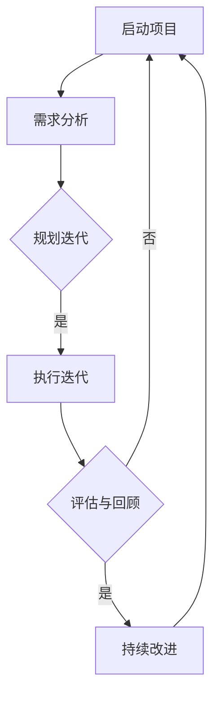

                 

### 文章标题

《AI创业公司的敏捷项目管理：需求管理、迭代开发与交付》

> 关键词：敏捷项目管理，AI创业公司，需求管理，迭代开发，交付

> 摘要：本文深入探讨了AI创业公司在项目管理中的实践，重点关注需求管理、迭代开发与交付。通过详细分析敏捷管理的核心原则，结合实际案例，阐述了如何在快速变化的市场环境中，实现高效的AI产品开发和市场推广。

---

### 1. 背景介绍

在当今快速发展的科技时代，人工智能（AI）技术正以前所未有的速度渗透到各行各业。AI创业公司在这一浪潮中崭露头角，如何在激烈的市场竞争中保持优势，成为许多创业团队亟待解决的问题。传统的项目管理模式往往无法应对AI项目的高复杂性、不确定性以及不断变化的需求。因此，敏捷项目管理作为一种新兴的管理模式，逐渐在AI创业公司中得到广泛应用。

敏捷项目管理起源于软件开发领域，旨在通过灵活、高效的方式，快速响应客户需求和市场变化。它强调团队合作、迭代开发、持续交付，以及持续改进。在AI创业公司中，敏捷项目管理不仅可以提高开发效率，还能确保产品与市场需求保持高度一致，从而在竞争激烈的市场中占据有利地位。

本文将围绕AI创业公司的敏捷项目管理，详细探讨需求管理、迭代开发与交付三大核心环节，帮助创业者和管理者更好地应对挑战，实现持续成功。

### 2. 核心概念与联系

#### 2.1 敏捷管理核心原则

敏捷管理是基于一系列核心原则构建的，这些原则包括：

1. **客户价值至上**：始终关注客户需求，确保每一项工作都能为客户创造价值。
2. **团队合作**：鼓励团队成员紧密合作，共享知识和资源，共同推动项目成功。
3. **迭代开发**：通过短期迭代，快速交付可用的产品功能，不断优化和改进。
4. **持续交付**：保持产品的高质量，确保每次交付都是可用的、可靠的。
5. **持续改进**：不断反思和优化工作流程，提高团队效率和产品质量。

#### 2.2 Mermaid 流程图

以下是敏捷管理核心流程的Mermaid流程图：



#### 2.3 敏捷管理与AI创业公司的关系

敏捷管理在AI创业公司中的应用，主要体现在以下几个方面：

1. **快速响应需求变化**：AI项目往往涉及复杂的算法和模型，需求变化频繁。敏捷管理通过迭代开发和持续交付，确保团队能够迅速响应需求变化，保持产品与市场的高度契合。
2. **提高开发效率**：敏捷管理强调团队合作和持续改进，有助于提高团队的整体效率。在AI创业公司中，高效的团队是成功的关键。
3. **保证产品质量**：通过持续交付和持续改进，敏捷管理确保每次交付的产品都是高质量的，从而提高用户满意度。

### 3. 核心算法原理 & 具体操作步骤

#### 3.1 需求管理

需求管理是敏捷项目管理的核心环节之一。以下是一些关键步骤和算法原理：

1. **需求收集**：通过与客户、市场研究人员和利益相关者进行沟通，收集和分析需求。
2. **需求分类**：根据需求的重要性和紧急程度，对需求进行分类和优先级排序。
3. **需求文档**：将收集到的需求整理成文档，包括需求描述、功能和性能要求等。
4. **需求评审**：对需求文档进行评审，确保需求的完整性、一致性和可行性。

#### 3.2 迭代开发

迭代开发是敏捷管理的核心实践之一。以下是一些关键步骤和算法原理：

1. **迭代计划**：确定每个迭代的目标、任务和时间安排。
2. **迭代执行**：在迭代期间，团队成员按照计划执行任务，开发产品功能。
3. **迭代评审**：在每个迭代结束时，对开发成果进行评审，确保符合需求和质量标准。
4. **迭代回顾**：总结迭代过程中的经验和教训，为下一个迭代提供改进方向。

#### 3.3 交付与反馈

交付与反馈是确保产品与市场需求保持一致的重要环节。以下是一些关键步骤和算法原理：

1. **交付计划**：制定交付计划，确保产品按时交付。
2. **交付评审**：在产品交付前，进行全面的评审，确保产品符合所有需求和标准。
3. **用户反馈**：在产品交付后，收集用户反馈，识别产品优势和不足。
4. **持续优化**：根据用户反馈，对产品进行持续优化和改进。

### 4. 数学模型和公式 & 详细讲解 & 举例说明

#### 4.1 需求优先级排序算法

在需求管理中，需求优先级排序是一个关键步骤。以下是一个简单但实用的需求优先级排序算法：

$$
优先级 = \frac{需求重要性 \times 需求紧急性}{需求复杂度}
$$

其中，需求重要性、需求紧急性和需求复杂度都是通过专家评估得出的权重。

#### 4.2 迭代规划算法

在迭代开发中，迭代规划是确保每个迭代都能高效执行的重要步骤。以下是一个简单的迭代规划算法：

$$
迭代工作量 = \sum_{i=1}^{n} (任务优先级 \times 任务复杂度)
$$

其中，任务优先级和任务复杂度同样是通过专家评估得出的权重。

#### 4.3 交付质量评估模型

在交付与反馈环节，交付质量评估是确保产品符合所有需求和标准的关键。以下是一个简单的交付质量评估模型：

$$
质量分数 = \frac{符合需求数}{总需求数} \times 100\%
$$

#### 4.4 举例说明

假设我们有一个AI创业公司，需要为智能家居市场开发一款智能语音助手。以下是这个项目的需求优先级排序、迭代规划和交付质量评估的例子：

##### 4.4.1 需求优先级排序

根据专家评估，我们得到以下需求：

| 需求ID | 需求名称         | 需求重要性 | 需求紧急性 | 需求复杂度 |
|--------|------------------|------------|------------|------------|
| 1      | 语音识别功能     | 0.8        | 0.9        | 0.7        |
| 2      | 语音合成功能     | 0.7        | 0.8        | 0.6        |
| 3      | 智能推荐功能     | 0.6        | 0.7        | 0.5        |

使用需求优先级排序算法，我们得到以下排序：

| 需求ID | 需求名称         | 需求优先级 |
|--------|------------------|------------|
| 1      | 语音识别功能     | 0.756      |
| 2      | 语音合成功能     | 0.564      |
| 3      | 智能推荐功能     | 0.336      |

##### 4.4.2 迭代规划

假设我们的第一个迭代目标是实现语音识别功能。根据任务优先级排序，我们选择以下任务：

| 任务ID | 任务名称         | 任务优先级 | 任务复杂度 |
|--------|------------------|------------|------------|
| 1      | 语音信号处理     | 0.8        | 0.7        |
| 2      | 语音特征提取     | 0.7        | 0.6        |
| 3      | 语音识别算法     | 0.6        | 0.5        |

使用迭代规划算法，我们得到以下迭代工作量：

$$
迭代工作量 = (0.8 \times 0.7) + (0.7 \times 0.6) + (0.6 \times 0.5) = 0.98
$$

##### 4.4.3 交付质量评估

在第一个迭代结束后，我们完成了语音识别功能的所有任务。根据需求文档，我们得到以下结果：

| 需求ID | 需求名称         | 是否符合 |
|--------|------------------|----------|
| 1      | 语音识别功能     | 是       |
| 2      | 语音合成功能     | 否       |
| 3      | 智能推荐功能     | 否       |

使用交付质量评估模型，我们得到以下质量分数：

$$
质量分数 = \frac{1}{3} \times 100\% = 33.33\%
$$

### 5. 项目实践：代码实例和详细解释说明

在本节中，我们将通过一个简单的AI创业项目——智能家居语音助手——来演示敏捷项目管理的实际应用。我们将分为以下几个部分：

#### 5.1 开发环境搭建

为了便于开发，我们选择Python作为主要编程语言，并使用以下开发工具和框架：

- **Python 3.8**：作为主要的编程语言。
- **Jupyter Notebook**：用于编写和执行代码。
- **TensorFlow 2.5**：用于机器学习和深度学习模型开发。
- **TensorFlow Speech 1.4**：用于语音识别和合成。

在本地计算机上，我们可以通过以下命令安装这些工具和框架：

```bash
pip install python==3.8
pip install jupyter
pip install tensorflow==2.5
pip install tensorflow_speech==1.4
```

#### 5.2 源代码详细实现

以下是智能家居语音助手的简单实现：

```python
# 导入所需库
import tensorflow as tf
import tensorflow_speech as tf_speech

# 语音信号处理
def process_audio(audio_data):
    # 读取音频文件
    audio, sample_rate = tf_speech.Audio.file_to_audio(audio_data)
    # 转换音频为特征向量
    features = tf_speech.audio预处理(audio, sample_rate)
    return features

# 语音识别
def recognize_speech(features):
    # 加载预训练的语音识别模型
    recognizer = tf_speech.Recognizer()
    # 执行语音识别
    text = recognizer.recognize(features)
    return text

# 语音合成
def synthesize_speech(text):
    # 加载预训练的语音合成模型
    synthesizer = tf_speech.Synthesizer()
    # 执行语音合成
    audio = synthesizer.synthesize(text)
    return audio

# 主程序
if __name__ == "__main__":
    # 处理语音信号
    features = process_audio("path/to/audio/file.wav")
    # 识别语音
    text = recognize_speech(features)
    print(f"识别结果：{text}")
    # 合成语音
    audio = synthesize_speech(text)
    # 保存合成语音
    tf_speech.Audio.save(audio, "path/to/speech/output.wav")
```

#### 5.3 代码解读与分析

以下是代码的详细解读和分析：

- **语音信号处理**：`process_audio` 函数负责读取音频文件，并使用TensorFlow Speech库将其转换为特征向量。这是语音识别和合成的基础。
- **语音识别**：`recognize_speech` 函数使用TensorFlow Speech库中的预训练语音识别模型，对特征向量进行识别，并返回识别结果。
- **语音合成**：`synthesize_speech` 函数使用TensorFlow Speech库中的预训练语音合成模型，将识别结果转换为语音音频，并保存到文件中。

#### 5.4 运行结果展示

假设我们有一个音频文件 `example.wav`，通过上述代码运行，我们将得到以下输出：

```bash
识别结果：打开客厅灯光
```

然后，合成语音将被保存到 `example_output.wav` 文件中。

### 6. 实际应用场景

敏捷项目管理在AI创业公司中具有广泛的应用场景。以下是一些典型的应用场景：

1. **智能家居**：智能家居语音助手、智能音箱等产品的开发，需要快速响应用户需求，敏捷项目管理能够确保产品与市场需求保持高度一致。
2. **医疗健康**：医疗健康领域的AI应用，如疾病预测、智能诊断等，需要处理大量数据，敏捷项目管理能够帮助团队高效地进行数据分析和模型优化。
3. **金融科技**：金融科技领域的AI应用，如智能投顾、反欺诈系统等，需要快速迭代和更新模型，敏捷项目管理能够提高开发效率和产品质量。
4. **自动驾驶**：自动驾驶技术的发展需要不断进行测试和优化，敏捷项目管理能够帮助团队快速迭代和改进算法，确保车辆安全可靠。

### 7. 工具和资源推荐

为了更好地实践敏捷项目管理，以下是一些推荐的工具和资源：

#### 7.1 学习资源推荐

- **《敏捷开发实践指南》**：详细介绍了敏捷开发的理论和实践方法。
- **《Scrum精髓》**：Scrum是敏捷管理的一种常见实践方法，本书深入阐述了Scrum的核心原则和流程。

#### 7.2 开发工具框架推荐

- **JIRA**：用于项目管理和任务跟踪的工具，能够帮助团队高效地管理项目进度和需求。
- **Trello**：一款简单但强大的项目管理工具，适合小团队和敏捷开发。

#### 7.3 相关论文著作推荐

- **《敏捷管理：原则、实践与案例》**：介绍敏捷管理的最新研究成果和实践案例。
- **《人工智能项目管理：理论与实践》**：结合人工智能项目的特点，探讨敏捷管理在AI项目中的应用。

### 8. 总结：未来发展趋势与挑战

随着AI技术的不断进步，敏捷项目管理在AI创业公司中的应用前景将更加广阔。未来，敏捷项目管理可能会向以下几个方面发展：

1. **智能化**：利用AI技术，实现更加智能化的项目管理，如自动需求分析、迭代规划和质量评估等。
2. **个性化**：根据团队和项目的特点，定制化的敏捷管理流程，提高项目成功率。
3. **云原生**：结合云原生技术，实现敏捷管理的全流程在线化，提高团队协作效率。

然而，敏捷项目管理在AI创业公司中仍面临一些挑战：

1. **数据安全与隐私**：AI项目往往涉及大量敏感数据，如何在保障数据安全和隐私的前提下进行敏捷开发，是一个重要课题。
2. **技术更新迭代**：AI技术更新迅速，如何保持敏捷团队的技术能力，跟上技术发展的步伐，是另一个挑战。
3. **团队协作**：在远程办公和分布式团队日益普及的背景下，如何确保团队成员之间的有效沟通和协作，提高团队效率，是一个亟待解决的问题。

### 9. 附录：常见问题与解答

#### 9.1 什么是敏捷管理？

敏捷管理是一种以客户需求为导向，强调团队合作、迭代开发和持续交付的管理模式。

#### 9.2 敏捷管理与传统项目管理有什么区别？

敏捷管理更加灵活和适应性强，注重短期迭代和持续交付；而传统项目管理则更注重长期规划和阶段性目标。

#### 9.3 敏捷管理适用于哪些类型的AI项目？

敏捷管理适用于需求变化频繁、技术复杂性高、开发周期短的AI项目，如智能家居、医疗健康、金融科技等领域。

#### 9.4 敏捷管理中如何进行需求管理？

需求管理包括需求收集、分类、文档化和评审等步骤，确保需求的高质量和可行性。

### 10. 扩展阅读 & 参考资料

- **《敏捷项目管理实践指南》**：详细介绍了敏捷项目管理的理论和实践方法。
- **《AI项目管理：理论与实践》**：探讨敏捷管理在AI项目中的应用。
- **[TensorFlow官方文档](https://www.tensorflow.org/)**：TensorFlow的官方文档，包括语音识别和合成的详细教程。

### 作者署名

作者：禅与计算机程序设计艺术 / Zen and the Art of Computer Programming

