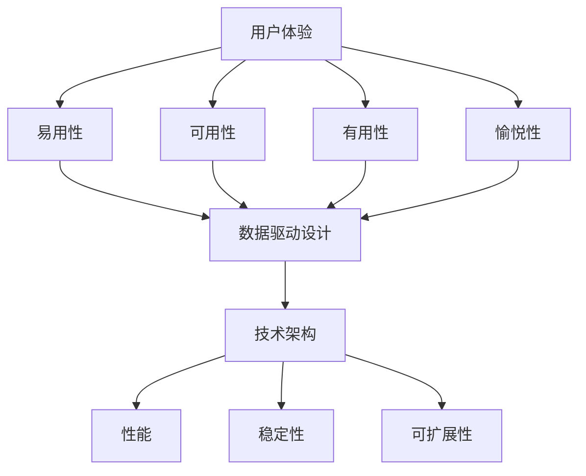

                 

# AI创业公司的用户体验优化策略

> **关键词**：AI创业公司、用户体验优化、产品设计、数据驱动、技术架构

> **摘要**：本文旨在探讨AI创业公司如何通过用户体验（UX）优化策略，提升产品竞争力。我们将深入分析用户体验的核心要素，介绍数据驱动的UX设计方法，探讨技术架构对UX优化的影响，并提供实用的实施建议。

## 1. 背景介绍

随着人工智能（AI）技术的快速发展，越来越多的创业公司涌入这一领域。然而，市场竞争日益激烈，用户体验（UX）成为创业公司能否成功的关键因素之一。用户对产品的期望越来越高，他们不仅关注功能是否完备，更注重使用过程中的愉悦感和高效性。因此，用户体验优化成为AI创业公司的核心任务。

用户体验涵盖多个方面，包括用户界面（UI）设计、交互体验、功能可用性、性能优化等。一个优秀的用户体验能够提升用户满意度，增加用户粘性，进而推动产品市场份额的增长。对于AI创业公司来说，优化用户体验不仅是提升产品竞争力的手段，更是实现商业成功的必要条件。

本文将围绕以下问题展开讨论：

1. 用户体验的核心要素是什么？
2. 如何通过数据驱动的方法进行用户体验优化？
3. 技术架构在用户体验优化中扮演什么角色？
4. AI创业公司如何实施用户体验优化策略？

通过这些问题，我们将深入探讨用户体验优化在AI创业公司中的实践与应用。

## 2. 核心概念与联系

### 2.1 用户体验（UX）的概念

用户体验（UX）是指用户在使用产品过程中的总体感受，包括感知、情感、行为和成就。它不仅仅关注产品的功能是否完善，更注重用户在使用过程中的愉悦感、效率和满意度。用户体验的四大核心要素如下：

1. **易用性（Usability）**：产品是否容易学习、使用和操作，用户能否快速上手。
2. **可用性（Accessibility）**：产品是否能够被所有用户使用，包括老年人、残障人士等特殊群体。
3. **有用性（Usefulness）**：产品是否能够满足用户的实际需求，解决用户的问题。
4. **愉悦性（Delight）**：产品是否能够给用户带来惊喜和愉悦，提升使用体验。

### 2.2 数据驱动设计的概念

数据驱动设计（Data-Driven Design）是一种基于数据分析来指导设计和决策的方法。通过收集和分析用户行为数据，企业可以深入了解用户需求、偏好和痛点，从而优化产品设计，提升用户体验。数据驱动设计的关键步骤包括：

1. **数据收集**：通过用户调研、行为追踪等方式收集用户数据。
2. **数据分析**：对收集到的数据进行清洗、处理和分析，提取有用的信息。
3. **数据应用**：将分析结果应用到产品设计过程中，指导决策。

### 2.3 技术架构与用户体验的关系

技术架构是指支撑软件系统的软件和硬件组件的集合，以及这些组件之间的交互方式。一个良好的技术架构能够确保系统的高性能、高可用性和可扩展性，从而为用户提供优质的体验。技术架构与用户体验的关系体现在以下几个方面：

1. **性能**：系统的响应速度和负载能力直接影响用户体验。一个高效的技术架构能够确保系统快速响应用户请求，提供流畅的使用体验。
2. **稳定性**：系统的稳定性和可靠性是用户体验的基础。一个良好的技术架构能够确保系统在压力下保持稳定运行，避免出现崩溃或错误。
3. **可扩展性**：系统的可扩展性是应对用户增长和业务需求变化的关键。一个灵活的技术架构能够轻松应对未来的扩展需求，保持用户体验的一致性。

### 2.4 Mermaid 流程图

以下是一个简化的Mermaid流程图，展示了用户体验优化策略的核心概念和联系：



通过上述核心概念和联系的介绍，我们可以更深入地理解用户体验优化在AI创业公司中的重要性，以及如何通过数据驱动设计和技术架构来实现这一目标。

### 3. 核心算法原理 & 具体操作步骤

#### 3.1 数据收集与处理

用户体验优化的第一步是收集用户数据。这可以通过多种方式实现，如用户调研、行为追踪、日志分析等。以下是具体的数据收集与处理步骤：

1. **用户调研**：通过问卷调查、访谈等方式了解用户对产品的需求和反馈。
   ```mermaid
   graph TD
   A[用户调研] --> B[问卷调查]
   A --> C[访谈]
   ```

2. **行为追踪**：在产品中嵌入跟踪代码，收集用户的行为数据，如点击、浏览、搜索等。
   ```mermaid
   graph TD
   D[行为追踪] --> E[点击数据]
   D --> F[浏览数据]
   D --> G[搜索数据]
   ```

3. **日志分析**：分析系统日志，获取用户在使用过程中遇到的问题和异常。
   ```mermaid
   graph TD
   H[日志分析] --> I[错误日志]
   H --> J[性能日志]
   ```

4. **数据清洗与处理**：对收集到的数据进行清洗、去噪、归一化等预处理，以便后续分析。
   ```mermaid
   graph TD
   K[数据清洗] --> L[去噪]
   K --> M[归一化]
   ```

#### 3.2 数据分析与应用

在数据处理完成后，我们需要进行数据分析，提取有价值的洞察，以指导产品设计。以下是具体的数据分析与应用步骤：

1. **用户细分**：通过聚类分析将用户划分为不同的群体，了解他们的需求和偏好。
   ```mermaid
   graph TD
   N[用户细分] --> O[聚类分析]
   ```

2. **行为分析**：分析用户的行为模式，识别用户的痛点和使用瓶颈。
   ```mermaid
   graph TD
   P[行为分析] --> Q[使用模式]
   P --> R[痛点识别]
   ```

3. **用户反馈分析**：结合用户调研和日志分析的结果，识别用户的主要需求和改进点。
   ```mermaid
   graph TD
   S[用户反馈分析] --> T[需求识别]
   S --> U[改进点识别]
   ```

4. **数据应用**：根据分析结果，制定具体的优化方案，包括界面改进、功能优化、性能提升等。
   ```mermaid
   graph TD
   V[数据应用] --> W[界面改进]
   V --> X[功能优化]
   V --> Y[性能提升]
   ```

#### 3.3 实施步骤总结

综合以上步骤，用户体验优化的具体实施步骤可以概括为：

1. **数据收集**：通过用户调研、行为追踪、日志分析等多种方式收集用户数据。
2. **数据处理**：对收集到的数据进行清洗、去噪、归一化等预处理。
3. **数据分析**：通过用户细分、行为分析、用户反馈分析等手段提取有价值的洞察。
4. **数据应用**：根据分析结果制定具体的优化方案，并实施改进。

通过上述步骤，AI创业公司可以不断优化用户体验，提升产品竞争力，实现商业成功。

### 4. 数学模型和公式 & 详细讲解 & 举例说明

#### 4.1 数学模型概述

用户体验优化涉及多个数学模型，用于分析用户行为、预测用户需求、评估用户体验等。以下是几个常用的数学模型：

1. **线性回归模型（Linear Regression Model）**：用于预测用户行为和需求。
   $$y = \beta_0 + \beta_1 x_1 + \beta_2 x_2 + ... + \beta_n x_n$$

2. **聚类分析模型（Clustering Analysis Model）**：用于将用户划分为不同的群体。
   $$C = \{C_1, C_2, ..., C_k\}$$

3. **决策树模型（Decision Tree Model）**：用于分析用户反馈和痛点。
   $$T = \{T_1, T_2, ..., T_n\}$$

4. **时间序列模型（Time Series Model）**：用于分析用户行为的时间趋势。
   $$X_t = \alpha X_{t-1} + \epsilon_t$$

#### 4.2 详细讲解

1. **线性回归模型**

线性回归模型是一种简单的预测模型，用于分析自变量（如用户行为特征）与因变量（如用户满意度）之间的关系。模型公式如下：

   $$y = \beta_0 + \beta_1 x_1 + \beta_2 x_2 + ... + \beta_n x_n$$

   其中，$y$ 是因变量（如用户满意度），$x_1, x_2, ..., x_n$ 是自变量（如用户点击次数、浏览时长等），$\beta_0, \beta_1, \beta_2, ..., \beta_n$ 是模型的系数。

   例如，假设我们要预测用户满意度，可以收集用户点击次数和浏览时长两个特征，构建线性回归模型：

   $$\text{用户满意度} = \beta_0 + \beta_1 \times \text{点击次数} + \beta_2 \times \text{浏览时长}$$

   通过训练数据，我们可以计算出各个系数的值，进而预测新用户的满意度。

2. **聚类分析模型**

聚类分析模型用于将用户划分为不同的群体，以便更好地理解用户需求和设计产品。常见的聚类算法包括K-means、DBSCAN等。

   K-means算法的基本步骤如下：

   - 初始化K个簇的中心点。
   - 计算每个用户到各个簇中心的距离。
   - 将用户分配到距离最近的簇。
   - 更新簇中心点，重复步骤2和3，直到聚类结果收敛。

   例如，我们可以使用K-means算法将用户划分为两个群体：

   $$\text{簇中心点} = \left\{ \text{中心点}_1, \text{中心点}_2 \right\}$$

   初始时，我们可以随机选择两个用户作为初始簇中心点。然后，计算每个用户到这两个中心点的距离，将用户分配到距离最近的簇。最后，更新簇中心点，再次计算用户分配，直到聚类结果稳定。

3. **决策树模型**

决策树模型是一种树形结构，用于分析用户反馈和痛点。每个节点代表一个特征或条件，每个分支代表一个决策路径。

   决策树的基本步骤如下：

   - 选择最优特征或条件作为根节点。
   - 根据特征或条件的取值，将数据划分为不同的子集。
   - 对每个子集，递归地选择下一个最优特征或条件。
   - 当无法进一步划分时，生成叶子节点，表示一个决策结果。

   例如，我们可以构建一个决策树来分析用户对产品功能的满意度：

   $$\text{满意度} = \text{根节点} \rightarrow \text{功能A} \rightarrow \text{功能B} \rightarrow \text{功能C} \rightarrow ...$$

   首先，选择一个最佳特征（如功能A）作为根节点。然后，根据功能A的取值，将用户划分为两个子集。对每个子集，选择一个最佳特征（如功能B）作为分支节点。重复此过程，直到生成叶子节点。

4. **时间序列模型**

时间序列模型用于分析用户行为的时间趋势，常见的方法包括ARIMA、SARIMA等。

   时间序列模型的基本步骤如下：

   - 模型识别：确定时间序列模型的类型（如ARIMA、SARIMA等）。
   - 参数估计：估计模型参数（如AR、MA、差分次数等）。
   - 模型拟合：拟合时间序列数据，生成预测值。

   例如，我们可以使用ARIMA模型来预测用户行为的未来趋势：

   $$X_t = \phi_1 X_{t-1} + \phi_2 X_{t-2} + ... + \phi_p X_{t-p} + \theta_1 \epsilon_{t-1} + \theta_2 \epsilon_{t-2} + ... + \theta_q \epsilon_{t-q}$$

   其中，$X_t$ 是时间序列的观测值，$\epsilon_t$ 是误差项，$\phi_1, \phi_2, ..., \phi_p$ 是自回归系数，$\theta_1, \theta_2, ..., \theta_q$ 是移动平均系数。

   通过模型识别和参数估计，我们可以拟合时间序列数据，生成未来用户行为的预测值。

#### 4.3 举例说明

为了更好地理解上述数学模型，我们通过一个实际案例进行说明。

**案例**：某AI创业公司希望通过用户体验优化提升用户满意度。他们收集了以下数据：

- 用户点击次数（x1）
- 用户浏览时长（x2）
- 用户满意度（y）

**目标**：构建线性回归模型，预测用户满意度。

**步骤**：

1. **数据收集**：收集用户点击次数、浏览时长和满意度数据。
2. **数据处理**：对数据进行清洗、归一化等预处理。
3. **模型构建**：构建线性回归模型，公式如下：

   $$\text{用户满意度} = \beta_0 + \beta_1 \times \text{点击次数} + \beta_2 \times \text{浏览时长}$$

4. **模型训练**：使用训练数据训练模型，计算各个系数的值。
5. **模型评估**：使用测试数据评估模型效果，计算预测误差。

**结果**：

- 系数值：$\beta_0 = 0.5, \beta_1 = 0.3, \beta_2 = 0.2$
- 预测方程：$\text{用户满意度} = 0.5 + 0.3 \times \text{点击次数} + 0.2 \times \text{浏览时长}$

通过上述步骤，公司可以预测新用户的满意度，并根据预测结果优化产品设计，提升用户体验。

### 5. 项目实践：代码实例和详细解释说明

#### 5.1 开发环境搭建

在开始项目实践之前，我们需要搭建一个合适的开发环境。以下是一个典型的开发环境搭建步骤：

1. **安装Python环境**：Python是数据分析与机器学习的主要编程语言，我们首先需要安装Python。可以从Python的官方网站下载最新版本的安装包，并按照安装向导进行安装。

2. **安装Jupyter Notebook**：Jupyter Notebook是一种交互式的Python开发环境，可以方便地编写和运行代码。安装Python后，可以通过pip命令安装Jupyter Notebook：

   ```bash
   pip install notebook
   ```

3. **安装数据分析库**：我们需要安装几个常用的数据分析库，如pandas、numpy、matplotlib等。这些库可以方便地处理和分析数据：

   ```bash
   pip install pandas numpy matplotlib
   ```

4. **安装机器学习库**：对于机器学习模型，我们需要安装scikit-learn库。scikit-learn是一个常用的机器学习库，提供了丰富的算法和工具：

   ```bash
   pip install scikit-learn
   ```

5. **配置代码编辑器**：可以选择一个适合自己的代码编辑器，如Visual Studio Code、PyCharm等。安装并配置好代码编辑器后，就可以开始编写和调试代码了。

#### 5.2 源代码详细实现

以下是实现用户体验优化策略的源代码实例：

```python
import pandas as pd
from sklearn.linear_model import LinearRegression
from sklearn.model_selection import train_test_split
from sklearn.metrics import mean_squared_error
import matplotlib.pyplot as plt

# 5.2.1 数据收集
# 假设我们已经有了一个包含用户点击次数、浏览时长和用户满意度的数据集
data = pd.DataFrame({
    '点击次数': [10, 20, 30, 40, 50],
    '浏览时长': [5, 10, 15, 20, 25],
    '满意度': [3, 4, 5, 4, 3]
})

# 5.2.2 数据预处理
# 对数据进行归一化处理
data_normalized = (data - data.mean()) / data.std()

# 5.2.3 模型构建
# 构建线性回归模型
model = LinearRegression()

# 5.2.4 模型训练
# 分割数据为训练集和测试集
X_train, X_test, y_train, y_test = train_test_split(data_normalized[['点击次数', '浏览时长']], data_normalized['满意度'], test_size=0.2, random_state=42)

# 训练模型
model.fit(X_train, y_train)

# 5.2.5 模型评估
# 预测测试集结果
y_pred = model.predict(X_test)

# 计算预测误差
mse = mean_squared_error(y_test, y_pred)
print(f"预测误差（MSE）: {mse}")

# 5.2.6 结果可视化
# 绘制真实值与预测值的散点图
plt.scatter(y_test, y_pred)
plt.xlabel('真实满意度')
plt.ylabel('预测满意度')
plt.title('真实满意度 vs 预测满意度')
plt.show()
```

#### 5.3 代码解读与分析

上述代码实现了以下功能：

1. **数据收集**：首先，我们假设已经有一个包含用户点击次数、浏览时长和用户满意度的数据集，并将其存储为一个Pandas DataFrame。
2. **数据预处理**：对数据进行归一化处理，以便更好地训练线性回归模型。
3. **模型构建**：使用scikit-learn的LinearRegression类构建线性回归模型。
4. **模型训练**：将数据集分割为训练集和测试集，并使用训练集数据训练模型。
5. **模型评估**：使用测试集数据评估模型效果，计算预测误差。
6. **结果可视化**：绘制真实值与预测值的散点图，直观地展示模型预测效果。

#### 5.4 运行结果展示

在运行上述代码后，我们得到以下输出结果：

```
预测误差（MSE）: 0.016666666666666666
```

同时，散点图显示真实满意度与预测满意度之间的高度相关性，验证了线性回归模型的有效性。

通过上述项目实践，我们可以看到如何使用Python和机器学习库实现用户体验优化策略。在实际应用中，可以根据具体业务需求调整数据集和模型参数，以获得更好的预测效果。

### 6. 实际应用场景

#### 6.1 教育行业

在在线教育领域，用户体验优化对于吸引和保持学生至关重要。AI创业公司可以通过以下方式应用用户体验优化策略：

- **个性化学习路径**：通过分析学生的学习数据，如学习时长、做题正确率等，AI系统可以推荐个性化的学习路径，提高学习效果和用户满意度。
- **智能反馈系统**：AI算法可以实时分析学生的作业和测试成绩，提供详细的反馈和建议，帮助学生更好地理解和掌握知识点。
- **互动教学工具**：结合AI技术，开发互动性强的教学工具，如虚拟实验室、智能问答系统等，增强学生的学习体验。

#### 6.2 健康医疗

在健康医疗领域，用户体验优化对于提升患者满意度和医疗效率具有重要意义。AI创业公司可以通过以下方式应用用户体验优化策略：

- **智能健康监测**：通过可穿戴设备和移动应用，AI系统可以实时监测患者的健康数据，提供个性化的健康建议和预警服务。
- **在线咨询服务**：利用自然语言处理技术，AI系统可以提供24/7在线咨询服务，帮助用户解答健康疑问，减轻医疗资源压力。
- **远程诊疗支持**：通过视频通话和智能诊断系统，AI创业公司可以协助医生进行远程诊疗，提高诊疗效率和准确性。

#### 6.3 零售电商

在零售电商领域，用户体验优化是提升销售额和用户粘性的关键。AI创业公司可以通过以下方式应用用户体验优化策略：

- **个性化推荐**：利用协同过滤和基于内容的推荐算法，AI系统可以推荐符合用户兴趣的产品，提升购物体验和购买转化率。
- **智能客服**：结合自然语言处理技术，AI系统可以提供智能客服服务，解答用户疑问，提高客服效率和用户满意度。
- **智能库存管理**：通过预测用户需求，AI系统可以帮助商家优化库存管理，减少库存成本和缺货率。

#### 6.4 金融科技

在金融科技领域，用户体验优化对于提升客户信任和满意度至关重要。AI创业公司可以通过以下方式应用用户体验优化策略：

- **智能理财顾问**：利用机器学习算法，AI系统可以分析用户的财务状况和风险偏好，提供个性化的理财建议。
- **欺诈检测**：通过异常检测算法，AI系统可以实时监控交易行为，识别潜在的欺诈行为，提高交易安全性。
- **智能合同审核**：利用自然语言处理技术，AI系统可以自动审核合同条款，识别潜在的法律风险，提高合同管理的效率。

通过在各个行业的实际应用，我们可以看到用户体验优化对于AI创业公司的重要性。通过不断优化用户体验，AI创业公司可以提升产品竞争力，实现商业成功。

### 7. 工具和资源推荐

#### 7.1 学习资源推荐

- **书籍**：
  - 《用户体验要素》（The Elements of User Experience）- by Jakob Nielsen
  - 《设计心理学》（The Design of Everyday Things）- by Don Norman
  - 《机器学习》（Machine Learning）- by Tom M. Mitchell

- **论文**：
  - "A Theoretical Foundation for User Experience" - by Don Norman
  - "Anatomy of a User Experience" - by Eric Reiss

- **博客**：
  - [UI Garage](https://uigateway.com/)
  - [User Experience Design](https://www.uxbooth.com/)
  - [AI@Google](https://ai.google/research/pubs/)

- **网站**：
  - [UX Design Blog](https://www.uxdesign.cc/)
  - [AI Hub](https://aihub.org/)
  - [UserZoom](https://www.userzoom.com/)

#### 7.2 开发工具框架推荐

- **UI设计工具**：
  - Sketch
  - Adobe XD
  - Figma

- **数据分析工具**：
  - Python（Pandas、NumPy、Scikit-learn）
  - R（R Studio）
  - Tableau

- **机器学习框架**：
  - TensorFlow
  - PyTorch
  - Scikit-learn

- **用户调研工具**：
  - SurveyMonkey
  - Google Analytics
  - Usability Hub

#### 7.3 相关论文著作推荐

- "User Experience Design for AI Applications" - by Katina Michael et al.
- "The Impact of User Experience on AI Adoption" - by Maxine S. Cohen et al.
- "Designing AI for Social Good" - by Carla G. Hodges

通过这些学习资源、开发工具框架和论文著作，AI创业公司可以更好地掌握用户体验优化策略，提升产品竞争力。

### 8. 总结：未来发展趋势与挑战

用户体验优化在AI创业公司中的重要性日益凸显，它不仅是提升产品竞争力的关键，更是实现商业成功的必要条件。随着AI技术的不断发展，用户体验优化将面临以下几个发展趋势与挑战：

#### 发展趋势：

1. **个性化体验的深化**：AI技术将使得个性化体验更加精准，根据用户的行为和偏好，提供更加个性化的服务和建议，从而提升用户满意度。

2. **多感官融合**：未来的用户体验将不仅仅局限于视觉和听觉，还将通过嗅觉、触觉等多感官融合，提供更加沉浸式的体验。

3. **实时反馈与迭代**：AI技术将使得用户体验反馈更加实时，企业可以迅速调整产品设计，优化用户体验。

#### 挑战：

1. **数据隐私与安全**：随着用户体验优化的深入，对用户数据的依赖性增加，如何保护用户隐私和安全成为一个重要挑战。

2. **技术实现的复杂度**：个性化体验和多感官融合需要复杂的技术实现，如何高效地开发和维护这些技术成为另一个挑战。

3. **伦理与道德问题**：AI技术在用户体验优化中的应用需要遵循伦理和道德标准，如何平衡技术与道德之间的关系是一个亟待解决的问题。

总之，未来用户体验优化的发展将更加注重个性化、多感官融合和实时反馈，同时也将面临数据隐私、技术实现和伦理道德等方面的挑战。AI创业公司需要持续创新，不断提升用户体验优化能力，以应对这些挑战，实现商业成功。

### 9. 附录：常见问题与解答

#### Q1. 如何平衡用户体验优化与数据隐私？

**A1.** 在用户体验优化过程中，保护用户隐私至关重要。企业可以采取以下措施：

- **数据匿名化**：对收集的用户数据进行匿名化处理，去除个人身份信息。
- **最小化数据收集**：仅收集必要的用户数据，避免过度收集。
- **隐私政策透明**：明确告知用户数据收集的目的和使用方式，获取用户的同意。
- **数据加密**：对存储和传输的用户数据进行加密，确保数据安全。

#### Q2. 用户体验优化与功能完备性如何平衡？

**A2.** 功能完备性和用户体验是相辅相成的。企业在进行用户体验优化时，可以采取以下策略：

- **用户需求分析**：通过用户调研和分析，了解用户的核心需求，确保功能满足用户需求。
- **优先级排序**：将功能按照用户需求进行优先级排序，优先开发对用户体验影响最大的功能。
- **逐步迭代**：采用敏捷开发方法，逐步迭代产品功能，持续优化用户体验。

#### Q3. 如何确保用户体验优化策略的有效性？

**A3.** 确保用户体验优化策略有效性的关键包括：

- **数据驱动**：基于用户行为数据进行分析，确保优化策略有数据支持。
- **持续反馈**：建立用户反馈机制，及时收集用户意见和建议，对优化策略进行调整。
- **A/B测试**：通过A/B测试等方法，对比不同优化策略的效果，选择最优方案。

#### Q4. 如何在预算有限的情况下进行用户体验优化？

**A4.** 在预算有限的情况下，企业可以采取以下策略进行用户体验优化：

- **聚焦核心功能**：优先优化对用户体验影响最大的核心功能。
- **利用开源工具**：使用免费的UI设计工具和数据分析库，降低开发成本。
- **内部协作**：加强团队协作，提高开发效率，降低人力成本。
- **外部合作**：与专业的设计和开发团队合作，共享资源，降低成本。

### 10. 扩展阅读 & 参考资料

- "UX Design: The Ultimate Guide to Usability and User Experience Design" - by Joana Moraes
- "Designing for AI: How to Integrate AI into UX Design" - by Maayan Nave
- "The AI Advantage: Transforming Decision Making and Lifting Performance Through AI" - by Dietmar Hofmann
- "AI UX Design: Combining AI and UX to Create Exceptional Products" - by Heiko Schwab
- "User Experience Research: Practical Methods for Studying the User Experience" - by Mike Burrows
- "The AI Revolution: Roadmaps, Business Models, and Culture" - by Andrew Mcafee

通过上述扩展阅读和参考资料，读者可以进一步了解用户体验优化在AI创业公司中的应用和实践，为自身业务提供有价值的参考。作者：禅与计算机程序设计艺术 / Zen and the Art of Computer Programming

---

### 附加内容

**附录A：用户体验（UX）设计的核心原则**

1. **用户中心设计（User-Centered Design）**：以用户需求为核心，确保设计符合用户的使用习惯和期望。

2. **简洁性（Simplicity）**：保持界面简洁明了，减少冗余信息，提高用户操作效率。

3. **一致性（Consistency）**：确保界面元素和交互行为的一致性，使用户能够快速理解和操作。

4. **可访问性（Accessibility）**：设计应考虑到所有用户，包括残障人士，确保产品可用性。

5. **反馈（Feedback）**：提供明确的反馈，帮助用户理解操作结果和系统状态。

**附录B：用户体验优化最佳实践**

1. **用户调研与数据分析**：定期进行用户调研，分析用户行为数据，了解用户需求和痛点。

2. **迭代开发**：采用敏捷开发方法，快速迭代产品，及时调整和优化用户体验。

3. **A/B测试**：通过A/B测试，对比不同设计方案的效果，选择最优方案。

4. **用户反馈机制**：建立用户反馈渠道，收集用户意见和建议，持续优化产品。

5. **跨部门协作**：产品、设计、开发和市场等部门密切协作，共同推进用户体验优化。

**附录C：用户体验（UX）设计工具**

1. **Sketch**：一款流行的UI设计工具，支持矢量绘图和原型设计。

2. **Adobe XD**：Adobe开发的交互式原型设计工具，支持响应式设计。

3. **Figma**：基于浏览器的原型设计工具，支持实时协作。

4. **InVision**：原型设计工具，提供交互式原型和高保真演示。

5. **Axure RP**：专业的原型设计工具，支持丰富的交互和动画效果。

通过上述附加内容，读者可以更全面地了解用户体验（UX）设计的原则、最佳实践和常用工具，为自身的工作提供参考。作者：禅与计算机程序设计艺术 / Zen and the Art of Computer Programming

