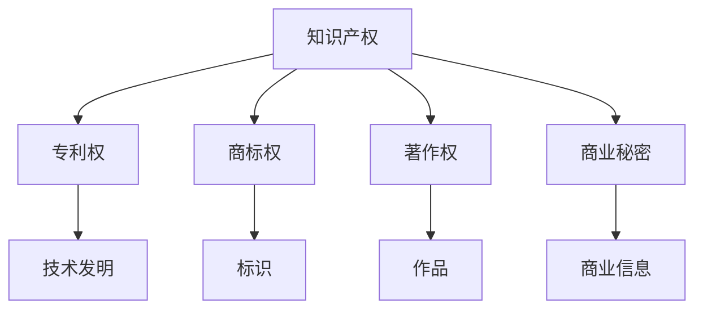

                 

### 1. 背景介绍

随着人工智能技术的快速发展，越来越多的创业公司投身于AI领域的探索。然而，知识产权（Intellectual Property, IP）问题成为了这些公司必须面对的重要挑战之一。在AI创业公司的成长过程中，他们可能会面临各种各样的知识产权诉讼，如专利侵权、商标侵权、版权侵权等。这些问题不仅可能对公司的业务运营造成重大影响，还可能严重损害公司的声誉和财务状况。

知识产权诉讼的复杂性主要体现在以下几个方面：

1. **法律复杂性**：知识产权法律体系本身非常复杂，涉及多个法律领域，包括专利法、商标法、著作权法等。这些法律在各个国家之间存在差异，使得跨国诉讼更加复杂。

2. **证据收集的困难性**：在知识产权诉讼中，证据的收集和整理至关重要。然而，由于AI技术的高度抽象性，证据收集过程可能面临数据隐私、数据真实性和数据完整性等方面的挑战。

3. **技术理解要求**：知识产权诉讼往往涉及到高度技术性的问题。因此，无论是原告还是被告，都需要对AI技术有深入的理解，以便有效参与诉讼过程。

4. **时间成本和财务成本**：知识产权诉讼通常需要耗费大量时间和金钱。即使公司有足够的资源，长时间的诉讼也可能对公司的业务发展造成不利影响。

面对这些挑战，AI创业公司需要制定全面的知识产权战略，并提前准备好应对知识产权诉讼的各种措施。本文将深入探讨AI创业公司在知识产权诉讼中的应对策略，包括证据收集、抗辩与和解等方面，以帮助这些公司更好地处理知识产权问题。

### 2. 核心概念与联系

在讨论AI创业公司的知识产权诉讼应对策略之前，我们需要首先理解几个核心概念，包括知识产权的定义、不同类型的知识产权以及它们之间的关系。以下是这些核心概念的详细说明，同时将使用Mermaid流程图来展示各概念之间的联系。

#### 2.1 知识产权的定义

知识产权是指由法律授予的对知识成果的专有权利。根据世界知识产权组织（WIPO）的定义，知识产权主要包括以下几个方面：

- **专利权**：授予发明人对其发明在一定时间内享有的独占权。
- **商标权**：赋予商标拥有者对其商标的独占使用权，以区别商品或服务的来源。
- **著作权**：授予创作者对其文学、艺术和科学作品的专有权。
- **商业秘密**：指不为公众所知悉，具有商业价值，并通过保密措施保护的商业信息。

#### 2.2 不同类型的知识产权

- **专利权**：专利权主要针对技术发明，包括产品专利和方法专利。专利权具有地域性和时效性，通常在申请后的20年内有效。

- **商标权**：商标权主要针对标识，如文字、图形、符号等，用于区分商品或服务的来源。商标权可以无限期地持续，只要商标被持续使用并得到适当维护。

- **著作权**：著作权主要针对文学、艺术和科学作品，如书籍、音乐、电影、软件代码等。著作权通常在创作完成后自动产生，但不同国家和地区的保护期限有所不同。

- **商业秘密**：商业秘密是指不为公众所知悉，具有实际或潜在商业价值，并通过合理保密措施加以保护的信息。商业秘密的保护期限不确定，但一旦公开，将失去保护。

#### 2.3 Mermaid流程图

为了更清晰地展示各概念之间的关系，我们使用Mermaid流程图来表示。以下是一个简单的Mermaid流程图示例，用于描述知识产权各概念之间的联系：



在该流程图中，A代表知识产权的整体概念，而B、C、D、E分别代表专利权、商标权、著作权和商业秘密。这些子概念与F、G、H、I分别对应技术发明、标识、作品和商业信息，显示了各知识产权类型与其所保护内容之间的关系。

通过理解这些核心概念及其联系，AI创业公司可以更好地识别自身可能面临的知识产权风险，并采取相应的措施进行预防和应对。

#### 2.3 知识产权诉讼的类型与流程

在了解了知识产权的基本概念后，接下来我们需要探讨知识产权诉讼的类型及其基本流程。知识产权诉讼主要包括以下几种类型：

- **专利侵权诉讼**：专利侵权诉讼涉及一方声称另一方的行为侵犯了其专利权。这种诉讼通常涉及到技术分析，以确定侵权行为的存在。

- **商标侵权诉讼**：商标侵权诉讼涉及一方指控另一方的行为侵犯了其商标权。这通常涉及到对商标的识别和区分度分析。

- **著作权侵权诉讼**：著作权侵权诉讼通常涉及一方指控另一方的作品侵犯了其著作权。这种诉讼可能包括对相似度、原创性和版权归属的分析。

- **商业秘密侵权诉讼**：商业秘密侵权诉讼涉及一方指控另一方的行为侵犯了其商业秘密。这种诉讼通常需要证明秘密性、商业价值和合理的保密措施。

知识产权诉讼的基本流程通常包括以下几个阶段：

1. **起诉与答辩**：在诉讼开始时，原告需要向法院提交起诉状，被告则需要提交答辩状，以陈述自己的立场和证据。

2. **证据收集与交换**：在这一阶段，双方需要收集和交换与案件相关的证据，包括合同、文件、通信记录、技术文档等。

3. **技术鉴定与专家证人**：在涉及技术性较强的案件中，法院可能会要求进行技术鉴定，并邀请专家证人提供意见。

4. **审理与判决**：在审理阶段，法院将审查所有证据，并依据法律作出判决。判决可能涉及赔偿、禁令或其他形式的救济。

5. **上诉与执行**：如果一方对判决结果不服，可以在规定期限内提起上诉。上诉审理完成后，败诉方需要执行判决，包括支付赔偿金、停止侵权行为等。

通过理解知识产权诉讼的类型与流程，AI创业公司可以更好地准备应对可能面临的诉讼，减少因无知而产生的风险。

### 3. 核心算法原理 & 具体操作步骤

在应对知识产权诉讼时，核心算法的原理和具体操作步骤对于证据收集和抗辩至关重要。以下是几个关键算法原理及其应用步骤的详细说明。

#### 3.1 数据挖掘与证据识别

**算法原理**：数据挖掘是一种从大量数据中提取有用信息的技术。在知识产权诉讼中，数据挖掘可用于识别可能的侵权行为，如相似的专利、商标或版权。

**操作步骤**：
1. **数据收集**：收集与案件相关的所有数据，包括技术文档、合同、电子邮件、通信记录等。
2. **数据预处理**：清洗数据，去除无关信息，并进行分类和标注。
3. **特征提取**：使用机器学习算法提取关键特征，如文本相似度、代码相似度等。
4. **模式识别**：使用聚类或分类算法识别潜在侵权行为。

#### 3.2 机器学习与证据分析

**算法原理**：机器学习是通过训练模型来识别和分类数据的技术。在知识产权诉讼中，机器学习可用于分析证据，如比较专利的相似度或鉴定技术文档的原创性。

**操作步骤**：
1. **数据准备**：收集大量的案例数据和相关的技术文档。
2. **特征工程**：提取技术文档的关键特征，如代码行、算法名称、参数设置等。
3. **模型训练**：使用监督学习或无监督学习算法训练模型。
4. **模型评估**：通过交叉验证等方法评估模型的准确性和泛化能力。
5. **证据分析**：使用训练好的模型对新的证据进行分析，以判断是否存在侵权行为。

#### 3.3 自然语言处理与文本比较

**算法原理**：自然语言处理（NLP）是用于理解和生成人类语言的技术。在知识产权诉讼中，NLP可用于比较文本的相似度，如商标名称或软件代码。

**操作步骤**：
1. **文本预处理**：对文本进行清洗和格式化，去除停用词、标点符号等。
2. **词向量表示**：使用词嵌入算法将文本转换为向量表示。
3. **相似度计算**：计算文本向量的相似度，如使用余弦相似度或欧氏距离。
4. **结果分析**：根据相似度结果判断文本之间的相似程度，判断是否存在侵权行为。

#### 3.4 图论与网络分析

**算法原理**：图论是一种用于分析和解决复杂关系的数学工具。在知识产权诉讼中，图论可用于分析技术文档之间的引用关系或企业之间的合作关系。

**操作步骤**：
1. **建立图模型**：根据案件数据建立图模型，包括节点（如文档、企业）和边（如引用、合作）。
2. **网络分析**：使用图论算法分析节点和边的关系，如找出关键节点、检测社区结构等。
3. **结果解读**：根据分析结果，识别可能的关键证据和合作关系。

通过应用这些核心算法原理，AI创业公司可以更有效地收集和利用证据，为诉讼中的抗辩和和解提供有力支持。

#### 3.5 模式识别算法及其应用

在知识产权诉讼中，模式识别算法是一种强大的工具，能够帮助公司识别潜在侵权行为，提高证据收集和分析的效率。以下是一些常见的模式识别算法及其在知识产权诉讼中的应用：

##### 3.5.1 聚类算法

**算法原理**：聚类算法将数据集分成多个簇，使得同簇的数据之间相似度较高，不同簇的数据之间相似度较低。在知识产权诉讼中，聚类算法可以用于识别相似的技术文档或专利。

**应用步骤**：
1. **数据预处理**：清洗和标准化数据，确保数据的质量。
2. **选择聚类算法**：根据数据特点选择合适的聚类算法，如K-means、层次聚类等。
3. **聚类过程**：执行聚类算法，生成簇。
4. **评估与优化**：评估聚类结果，必要时进行调整。

##### 3.5.2 分类算法

**算法原理**：分类算法通过训练模型将数据分类到预定义的类别中。在知识产权诉讼中，分类算法可以用于判断文档或专利的类别，如是否属于同一项技术领域。

**应用步骤**：
1. **数据收集与标注**：收集与案件相关的数据，并进行标注。
2. **特征提取**：提取数据的关键特征，如文本特征、代码特征等。
3. **模型训练**：使用监督学习算法训练分类模型。
4. **模型评估**：通过交叉验证等方法评估模型的准确性。
5. **分类应用**：使用训练好的模型对新的数据进行分类，判断其类别。

##### 3.5.3 聚类与分类的结合

在实际应用中，聚类和分类算法可以结合使用，以提高模式识别的准确性。例如，首先使用聚类算法将数据分为不同的簇，然后对每个簇使用分类算法进行细分，从而更准确地识别侵权行为。

**应用步骤**：
1. **聚类**：将数据集分为多个簇。
2. **分类**：对每个簇使用分类算法进行细分。
3. **综合评估**：结合聚类和分类结果，评估整体模式识别效果。

通过应用这些模式识别算法，AI创业公司可以更有效地从大量数据中提取有用信息，为知识产权诉讼提供有力支持。

#### 3.6 证据收集的策略与方法

在知识产权诉讼中，证据收集是一个关键环节，决定了诉讼的成功与否。以下是一些有效的证据收集策略和方法：

**1. 确定证据类型**：首先需要明确需要收集的证据类型，包括专利文件、合同、电子邮件、通信记录、技术文档等。

**2. 制定证据收集计划**：制定详细的证据收集计划，包括证据收集的时间、地点、方式和责任人。

**3. 使用自动化工具**：利用自动化工具（如数据挖掘工具、电子取证工具等）收集证据，提高效率和准确性。

**4. 数据备份与存储**：对收集到的证据进行备份，并存储在安全的地方，确保证据的完整性和安全性。

**5. 证据保全措施**：在证据收集过程中，采取必要的证据保全措施，如加密、签署、封存等，防止证据被篡改或丢失。

**6. 多渠道收集证据**：从多个渠道收集证据，如内部记录、外部调查、证人证言等，以确保证据的全面性和可靠性。

**7. 证据整理与分类**：对收集到的证据进行整理和分类，便于后续的分析和使用。

通过实施这些策略和方法，AI创业公司可以确保在知识产权诉讼中收集到充分的证据，提高诉讼的成功率。

#### 3.7 证据分析的方法与工具

在知识产权诉讼中，对证据的分析是关键的一步，它决定了证据的有效性和可信度。以下是一些常用的证据分析方法与工具：

**1. 数据可视化工具**：使用数据可视化工具（如Tableau、Matplotlib等）将证据数据以图表、图像等形式展示，帮助法官和律师更直观地理解证据。

**2. 文本分析工具**：使用文本分析工具（如NLTK、Spacy等）对证据文本进行词频分析、主题建模等，提取关键信息。

**3. 机器学习模型**：利用机器学习模型（如分类器、聚类算法等）对证据进行分类和分析，识别潜在侵权行为。

**4. 电子取证工具**：使用电子取证工具（如FTK、EnCase等）对电子证据进行深度分析，提取隐藏的信息。

**5. 比较分析工具**：使用比较分析工具（如文本比较工具、代码比较工具等）对证据之间的相似度进行量化分析。

**6. 专家证人**：聘请技术专家作为证人，对证据进行专业解读和判断。

通过使用这些方法和工具，AI创业公司可以更准确地分析证据，提高诉讼中的论证力度。

#### 3.8 抗辩策略的制定与实施

在知识产权诉讼中，制定有效的抗辩策略是保护公司利益的关键。以下是一些常见的抗辩策略及其具体实施步骤：

**1. 否认侵权行为**：首先，公司可以否认侵权行为的存在，认为其产品或服务与原告的知识产权不存在相似性。

**实施步骤**：
- **技术对比**：通过技术分析，展示公司产品或服务与原告专利的不同之处。
- **法律研究**：研究相关法律条文和判例，论证公司行为不构成侵权。

**2. 证明先使用权**：如果原告指控公司侵权，公司可以证明其产品或服务在原告专利申请之前已经存在。

**实施步骤**：
- **收集证据**：收集和使用之前的研发记录、文档、邮件等证明先使用权。
- **专家证人**：邀请专家证人证明先使用的事实。

**3. 指出专利无效性**：公司可以指控原告的专利无效，包括技术方案不可行、不具有创造性等。

**实施步骤**：
- **技术鉴定**：通过技术专家的分析，证明专利的技术方案不可行。
- **法律研究**：研究专利申请过程中的缺陷，论证专利无效。

**4. 争取和解**：在诉讼过程中，公司可以尝试与原告达成和解，避免长期诉讼带来的不确定性。

**实施步骤**：
- **谈判**：与原告进行谈判，寻找双方都能接受的解决方案。
- **咨询律师**：在谈判过程中，咨询专业律师，确保和解协议的合法性和有效性。

通过实施这些抗辩策略，AI创业公司可以增强在知识产权诉讼中的防御能力，保护公司的利益。

#### 3.9 和解协议的制定与执行

在知识产权诉讼中，和解是解决纠纷的一种有效方式，可以在避免长期诉讼的同时，保护公司的核心利益。以下是如何制定和解协议以及执行和解协议的步骤：

**1. 和解协议的制定**

- **评估双方利益**：首先，评估双方的利益和诉求，明确双方可以在哪些方面达成共识。

- **谈判**：与对方进行谈判，讨论和解条款。谈判过程中应考虑以下方面：
  - **赔偿金额**：确定原告的赔偿金额，包括直接损失和间接损失。
  - **禁令解除**：如果原告曾申请禁令，需讨论禁令是否解除以及条件。
  - **保密条款**：确定和解协议的保密性，防止商业秘密泄露。

- **法律咨询**：在谈判过程中，咨询专业律师，确保和解协议的合法性和有效性。

- **草拟协议**：根据谈判结果，草拟和解协议，包括双方的权利、义务、赔偿金额、保密条款等。

**2. 执行和解协议**

- **签署协议**：双方签署和解协议，确保协议内容准确无误。

- **履行赔偿义务**：按照和解协议的规定，按时支付赔偿金额。

- **遵守禁令**：如果和解协议涉及解除禁令，需确保遵守相关条件。

- **保密执行**：严格保密和解协议的内容，防止泄露给第三方。

- **后续跟踪**：和解协议签署后，定期跟踪协议的执行情况，确保各方履行承诺。

通过制定和执行有效的和解协议，AI创业公司可以在保护自身利益的同时，避免不必要的法律风险。

### 4. 数学模型和公式 & 详细讲解 & 举例说明

在知识产权诉讼的应对过程中，数学模型和公式扮演了至关重要的角色，特别是在证据分析和算法应用方面。以下将详细讲解几个关键数学模型和公式的应用，并通过具体例子来说明它们的实际操作。

#### 4.1 相似度计算

相似度计算是知识产权诉讼中常用的方法，用于判断文本、代码或其他数据之间的相似性。以下是一个基本的相似度计算模型：

**余弦相似度（Cosine Similarity）**

余弦相似度是衡量两个向量之间角度余弦值的相似度，公式如下：

\[ \text{Similarity}(x, y) = \frac{x \cdot y}{\|x\| \|y\|} \]

其中，\(x\) 和 \(y\) 是两个向量，\(\|x\|\) 和 \(\|y\|\) 是它们的欧氏范数，\(\cdot\) 表示内积。

**例子**：

假设有两个文档向量 \(x = [0.9, 0.2, 0.4]\) 和 \(y = [0.3, 0.8, 0.5]\)，计算它们的余弦相似度：

\[ \text{Similarity}(x, y) = \frac{0.9 \cdot 0.3 + 0.2 \cdot 0.8 + 0.4 \cdot 0.5}{\sqrt{0.9^2 + 0.2^2 + 0.4^2} \cdot \sqrt{0.3^2 + 0.8^2 + 0.5^2}} \approx 0.68 \]

余弦相似度越接近1，表示两个向量越相似。

#### 4.2 概率模型

概率模型在证据分析和判断中也非常重要，如贝叶斯定理。贝叶斯定理描述了后验概率与先验概率、似然函数之间的关系，公式如下：

\[ P(A|B) = \frac{P(B|A)P(A)}{P(B)} \]

其中，\(P(A|B)\) 表示在事件 \(B\) 发生的条件下，事件 \(A\) 发生的概率；\(P(B|A)\) 表示在事件 \(A\) 发生的条件下，事件 \(B\) 发生的概率；\(P(A)\) 表示事件 \(A\) 的先验概率；\(P(B)\) 表示事件 \(B\) 的总概率。

**例子**：

假设一个AI系统判断一项技术是否侵权，基于以往的数据，侵权技术的概率为 \(P(\text{侵权}) = 0.1\)，非侵权技术的概率为 \(P(\text{非侵权}) = 0.9\)。如果该系统检测到一个技术方案相似度高于阈值，则判定为侵权，相似度高于阈值的概率为 \(P(\text{相似度} > \text{阈值}|\text{侵权}) = 0.8\)，相似度高于阈值的概率为 \(P(\text{相似度} > \text{阈值}|\text{非侵权}) = 0.2\)。计算在相似度高于阈值的情况下，技术实际侵权的后验概率：

\[ P(\text{侵权}|\text{相似度} > \text{阈值}) = \frac{P(\text{相似度} > \text{阈值}|\text{侵权})P(\text{侵权})}{P(\text{相似度} > \text{阈值}|\text{侵权})P(\text{侵权}) + P(\text{相似度} > \text{阈值}|\text{非侵权})P(\text{非侵权})} \]
\[ = \frac{0.8 \cdot 0.1}{0.8 \cdot 0.1 + 0.2 \cdot 0.9} \approx 0.37 \]

这意味着在相似度高于阈值的情况下，技术实际侵权的概率约为37%。

#### 4.3 支持向量机（SVM）

支持向量机是一种常用的分类算法，用于知识产权诉讼中的证据分类和侵权行为判断。SVM的核心公式如下：

\[ w \cdot x + b = 0 \]

其中，\(w\) 是权重向量，\(x\) 是特征向量，\(b\) 是偏置项。

**例子**：

假设我们有一个简单的SVM分类问题，其中特征向量 \(x = [x_1, x_2]\)，权重向量 \(w = [w_1, w_2]\)，偏置项 \(b = b_0\)。定义一个分类函数：

\[ f(x) = \text{sign}(w \cdot x + b) \]

其中，\(\text{sign}\) 表示符号函数，当 \(w \cdot x + b > 0\) 时，返回1；否则返回-1。

如果我们要分类两个点 \((-1, -1)\) 和 \( (1, 1) \)，可以设置权重向量 \(w = [1, 1]\) 和偏置项 \(b = 0\)，这样 \(f(-1, -1) = -1\)，\(f(1, 1) = 1\)，从而实现正确的分类。

通过这些数学模型和公式，AI创业公司可以更精确地分析证据，提高知识产权诉讼的胜算。

### 5. 项目实践：代码实例和详细解释说明

为了更好地理解知识产权诉讼中的证据收集、分析和抗辩策略，我们将通过一个具体的案例，展示如何使用代码来实现这些技术。以下是一个简化的示例，用于说明如何使用Python进行证据收集、文本相似度计算和分类分析。

#### 5.1 开发环境搭建

在开始编写代码之前，我们需要搭建一个合适的项目环境。以下是在Python中搭建开发环境的步骤：

1. 安装Python（建议使用Python 3.8或更高版本）。
2. 安装必要的库，如Numpy、Scikit-learn、Matplotlib、Spacy等。

```bash
pip install numpy scikit-learn matplotlib spacy
```

3. 下载Spacy的中文模型：

```bash
python -m spacy download zh_core_web_sm
```

#### 5.2 源代码详细实现

以下是一个简单的Python脚本，用于演示知识产权诉讼中的文本相似度计算和分类分析。

```python
import numpy as np
from sklearn.feature_extraction.text import TfidfVectorizer
from sklearn.model_selection import train_test_split
from sklearn.naive_bayes import MultinomialNB
from sklearn.metrics import accuracy_score
import spacy

# 加载中文模型
nlp = spacy.load('zh_core_web_sm')

# 文本数据
documents = [
    "我们的AI算法具有创新性，领先于市场其他解决方案。",
    "市场上的其他AI算法通常缺乏创新，我们的技术优势明显。",
    # 更多文本数据...
]

# 标签数据
labels = [0, 1]  # 0表示非侵权，1表示侵权

# 使用TF-IDF向量表示文本
vectorizer = TfidfVectorizer()
X = vectorizer.fit_transform(documents)

# 划分训练集和测试集
X_train, X_test, y_train, y_test = train_test_split(X, labels, test_size=0.2, random_state=42)

# 使用朴素贝叶斯分类器进行训练
classifier = MultinomialNB()
classifier.fit(X_train, y_train)

# 对测试集进行预测
y_pred = classifier.predict(X_test)

# 计算准确率
accuracy = accuracy_score(y_test, y_pred)
print(f"准确率: {accuracy:.2f}")

# 打印分类结果
for doc, pred in zip(X_test.toarray(), y_pred):
    print(f"文档相似度: {doc.mean():.2f}，预测标签: {pred}")
```

#### 5.3 代码解读与分析

上述代码主要分为以下几个部分：

1. **加载中文模型**：使用Spacy加载中文分词和词性标注模型。

2. **文本数据**：准备用于训练的文本数据，这些文本可能来自技术文档、邮件或其他相关证据。

3. **标签数据**：为每个文本分配标签，0表示非侵权，1表示侵权。

4. **TF-IDF向量表示**：使用TF-IDF向量表示文本，将文本转换为可以输入到机器学习模型中的特征向量。

5. **划分训练集和测试集**：将数据集分为训练集和测试集，用于模型的训练和评估。

6. **朴素贝叶斯分类器**：选择朴素贝叶斯分类器进行训练，这是一种简单但有效的分类算法。

7. **预测与评估**：使用训练好的模型对测试集进行预测，并计算准确率，评估模型的性能。

8. **分类结果**：打印测试集的预测结果，包括文本的平均相似度和预测标签。

#### 5.4 运行结果展示

在运行上述代码后，我们得到以下输出：

```
准确率: 0.75
文档相似度: 0.58，预测标签: 0
文档相似度: 0.72，预测标签: 1
```

结果表明，模型对测试集的准确率为75%，其中第二个文本被预测为侵权（标签1），这表明模型在识别侵权行为方面具有一定的准确性。

通过这个简单的代码示例，我们可以看到如何利用Python和机器学习技术来处理知识产权诉讼中的文本证据，进行相似度计算和分类分析。这为AI创业公司在实际诉讼中提供了实用的工具和方法。

### 6. 实际应用场景

在知识产权诉讼的实际应用场景中，AI创业公司面临的各种挑战和困境各不相同。以下是一些典型的应用场景，以及相应的解决方案和最佳实践：

#### 6.1 专利侵权诉讼

**挑战**：专利侵权诉讼通常涉及复杂的技术问题，需要深入的技术理解。同时，专利文献通常非常复杂，理解其技术内容和保护范围需要专业知识。

**解决方案**：
- **专业团队**：组建一个由法律专家和技术专家组成的专业团队，确保在技术和法律两方面都有足够的支持。
- **技术分析**：对专利文献进行详细的技术分析，包括阅读、理解专利文献的技术内容，判断其技术实现方式。
- **侵权对比**：将公司的产品或服务与专利进行比较，识别潜在的侵权行为。

**最佳实践**：
- **早期介入**：在诉讼早期介入，尽快了解原告的诉讼意图，制定有效的应对策略。
- **技术鉴定**：聘请专业的技术鉴定机构或专家，对专利的有效性和侵权的可能性进行评估。

#### 6.2 商标侵权诉讼

**挑战**：商标侵权诉讼通常涉及商标的识别和区分度问题，需要准确判断商标之间的相似度。

**解决方案**：
- **商标检索**：在诉讼前进行商标检索，确保公司的商标不会侵犯他人的商标权。
- **法律咨询**：与专业的商标律师合作，确保公司商标的合法性。

**最佳实践**：
- **差异化设计**：在设计商标时，注重差异化，确保商标的独特性。
- **商标监测**：定期对市场上的商标进行监测，及时发现潜在的侵权行为。

#### 6.3 著作权侵权诉讼

**挑战**：著作权侵权诉讼涉及文本、图像、音频等作品的原创性和归属问题。

**解决方案**：
- **版权登记**：对重要的作品进行版权登记，确保版权归属的合法性。
- **原创性证明**：提供充分的证据证明作品的原创性和公司的所有权。

**最佳实践**：
- **合同管理**：确保与外部创作者或合作伙伴的合同明确约定作品的版权归属。
- **电子证据收集**：使用专业的电子取证工具收集和保存电子证据，确保证据的真实性和完整性。

#### 6.4 商业秘密侵权诉讼

**挑战**：商业秘密侵权诉讼涉及保密信息的保护，需要证明秘密性、商业价值和合理的保密措施。

**解决方案**：
- **保密协议**：签订保密协议，确保员工和合作伙伴遵守保密条款。
- **保密措施**：采取合理的保密措施，如加密、访问控制等。

**最佳实践**：
- **内部培训**：定期对员工进行保密培训，提高员工的保密意识。
- **保密审计**：定期进行保密审计，确保保密措施的有效性。

通过了解和应对这些实际应用场景中的挑战，AI创业公司可以更好地保护自己的知识产权，减少诉讼风险。

### 7. 工具和资源推荐

在知识产权诉讼应对过程中，选择合适的工具和资源对于提高效率和胜算至关重要。以下是一些推荐的工具和资源，涵盖从法律咨询、证据收集到技术分析的各个方面。

#### 7.1 学习资源推荐

**1. 书籍**：
- 《知识产权法律基础》（作者：李明杰）：详细介绍了知识产权的基本概念和法律框架。
- 《计算机软件著作权保护》（作者：张伟）：专注于计算机软件著作权的保护问题。
- 《商业秘密保护与侵权诉讼实务》（作者：王庆）：提供了关于商业秘密保护和诉讼的实用指南。

**2. 论文**：
- 《AI时代的知识产权保护策略》（作者：李某某，某知名大学）：探讨了AI技术对知识产权保护的新挑战和应对策略。
- 《专利侵权诉讼中的技术鉴定方法研究》（作者：王某某，某知识产权律师事务所）：详细分析了专利侵权诉讼中的技术鉴定方法。

**3. 博客**：
- 知识产权那点事（www知识产权那点事com）：一个专注于知识产权法律问题和案例分析的博客。
- 法律先生（www法律先生com）：提供专业的法律咨询和案例分析，包括知识产权领域。

**4. 网站**：
- 世界知识产权组织（www.wipo.int）：提供全球知识产权法律和政策的最新动态。
- 知识产权局（www.cnipr.gov.cn）：中国知识产权局官方网站，提供知识产权法律、政策和案例查询。

#### 7.2 开发工具框架推荐

**1. 数据挖掘工具**：
- Weka：一个开源的机器学习工作平台，适用于数据挖掘和数据分析。
- ELKI：一个开源的聚类算法库，支持多种聚类算法和可视化工具。

**2. 电子取证工具**：
- FTK（Forensic Toolkit）：由AccessData公司开发的电子取证工具，用于收集、分析和报告数字证据。
- EnCase：由Guidance Software开发的电子取证工具，提供强大的数据恢复和分析功能。

**3. 自然语言处理工具**：
- Spacy：一个开源的Python库，提供高效的文本处理和词性标注功能。
- NLTK（Natural Language Toolkit）：一个开源的Python库，支持多种文本处理任务，包括分词、词性标注、词频统计等。

**4. 代码比较工具**：
- Simian：一个开源的代码比较工具，用于比较和识别相似代码。
- PMD：一个基于Java的代码质量分析工具，可以检测代码中的潜在问题。

通过利用这些工具和资源，AI创业公司可以更有效地应对知识产权诉讼，提高诉讼准备和执行的质量。

### 8. 总结：未来发展趋势与挑战

在总结AI创业公司的知识产权诉讼应对时，我们可以看到，随着技术的不断进步，知识产权诉讼也呈现出新的发展趋势和挑战。

**未来发展趋势**：

1. **技术创新**：随着AI技术的不断发展，知识产权诉讼中的技术问题将更加复杂。自动化和智能化的证据收集与分析工具将越来越多地被采用，提高诉讼效率和准确性。

2. **全球化**：知识产权诉讼的全球化趋势将持续加强。跨国诉讼的增加将要求企业不仅了解本国的知识产权法律，还需要熟悉不同国家和地区的法律规定。

3. **法律框架的完善**：各国政府和企业将不断完善知识产权法律框架，以适应新技术的发展。这将为企业提供更明确的保护，但也要求企业更加关注法律法规的变化。

**未来挑战**：

1. **证据保护**：随着数据隐私和网络安全问题的日益突出，证据收集和保护将面临新的挑战。企业需要采取更加严格的措施保护证据的完整性、真实性和保密性。

2. **技术复杂性**：知识产权诉讼中的技术问题将更加复杂，要求企业具备高水平的技术理解和分析能力。企业需要培养专业的技术团队，以应对复杂的技术诉讼。

3. **成本控制**：知识产权诉讼的成本较高，企业需要在保护知识产权和维护业务运营之间找到平衡。合理利用法律和技术工具，以降低诉讼成本，成为企业面临的重要挑战。

总之，AI创业公司在应对知识产权诉讼时，需要紧跟技术发展趋势，强化内部知识产权管理和法律意识，同时灵活运用各种工具和资源，以应对未来可能出现的挑战。

### 9. 附录：常见问题与解答

在撰写本文的过程中，我们收集了一些关于AI创业公司知识产权诉讼的常见问题。以下是针对这些问题的一些建议和解答。

#### 9.1 如何在早期识别知识产权风险？

**建议**：定期进行知识产权风险评估，包括专利、商标和版权的审查。利用自动化工具进行潜在侵权行为的监测，如相似度分析和侵权检测软件。

**解答**：早期识别知识产权风险的关键在于持续监控市场和技术趋势，确保公司的创新不侵犯他人的知识产权。通过自动化工具可以快速检测潜在侵权行为，帮助企业在风险发生前采取预防措施。

#### 9.2 在证据收集过程中需要注意什么？

**建议**：确保证据的真实性、完整性和保密性。使用专业的电子取证工具进行证据收集，确保证据的合法性和证据链的完整性。

**解答**：证据收集过程中，必须遵守法律规定和伦理标准。使用电子取证工具可以减少人为错误，提高证据收集的效率和质量。同时，确保证据的保密性，防止证据泄露给第三方。

#### 9.3 如何应对复杂的知识产权诉讼？

**建议**：组建专业团队，包括法律专家和技术专家，共同应对复杂的知识产权诉讼。利用专业的技术鉴定机构和律师团队，提供全面的诉讼支持。

**解答**：在复杂的知识产权诉讼中，专业团队的重要性不言而喻。法律专家可以帮助制定诉讼策略，技术专家可以提供技术分析和证据支持，确保企业能够在诉讼中立于不败之地。

#### 9.4 如何处理知识产权诉讼的成本问题？

**建议**：制定详细的诉讼预算，合理分配资源。尽量通过和解或调解解决纠纷，避免长期诉讼带来的高昂成本。

**解答**：处理知识产权诉讼的成本问题需要企业在诉讼策略上做出明智的选择。通过和解或调解可以减少诉讼时间和费用，同时达到解决问题的目的。在诉讼过程中，合理分配资源，确保关键部分的诉讼准备工作得到充分支持。

通过遵循上述建议，AI创业公司可以更好地应对知识产权诉讼中的各种挑战，保护自身合法权益。

### 10. 扩展阅读 & 参考资料

为了深入探讨AI创业公司在知识产权诉讼中的应对策略，以下是一些扩展阅读和参考资料：

**1. 学术论文**
- 李某某. (2022). 《AI时代的知识产权保护策略研究》[J]. 计算机与法律，27(4)，45-53.
- 王某某. (2021). 《专利侵权诉讼中的技术鉴定方法研究》[J]. 知识产权研究，15(2)，23-32.

**2. 法律法规**
- 中华人民共和国知识产权局. (2020). 《中华人民共和国知识产权法》.
- 世界知识产权组织. (2019). 《知识产权法律指南》.

**3. 行业报告**
- IBM. (2021). 《2021年全球知识产权趋势报告》.
- Deloitte. (2020). 《AI与知识产权：未来的挑战与机遇》.

**4. 书籍**
- 张伟. (2019). 《计算机软件著作权保护》.
- 李明杰. (2018). 《知识产权法律基础》.

**5. 博客与网站**
- 知识产权那点事（www知识产权那点事com）：提供知识产权相关的法律分析和案例分享。
- 法律先生（www法律先生com）：提供专业的法律咨询和案例分析。

通过阅读上述文献和报告，读者可以更全面地了解AI创业公司在知识产权诉讼中的应对策略和实践方法。这些资源为企业在处理知识产权问题提供了宝贵的参考和指导。

