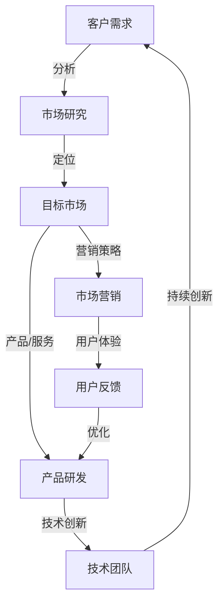

                 

### 1. 背景介绍

随着科技的飞速发展，人工智能（AI）技术在各行各业的应用越来越广泛，使得AI创业领域成为了一片竞争激烈的红海。无数初创企业纷纷涌入这个市场，试图在这场竞赛中分得一杯羹。然而，面对日益增长的竞争压力，单纯依靠技术优势和资金实力已经难以持续保持领先地位。差异化发展逐渐成为创业企业在AI领域中脱颖而出的关键因素。

在AI领域，初创企业面临的挑战主要包括以下几个方面：

1. **技术壁垒高**：人工智能技术涉及众多学科，包括计算机科学、统计学、神经科学等，初创企业在技术积累和团队建设上面临巨大挑战。

2. **市场竞争激烈**：随着AI技术的普及，越来越多的企业和机构加入AI创业的行列，使得市场供大于求，竞争愈发激烈。

3. **数据资源稀缺**：数据是AI技术的基石，初创企业在获取高质量、大规模数据集方面面临困难，这直接影响了算法模型的训练和优化。

4. **资金与人才短缺**：AI创业不仅需要雄厚的资金支持，还需要高水平的技术人才，初创企业在融资和招聘上面临重重困难。

在这样的背景下，差异化发展成为了AI创业企业突破困境、实现可持续发展的关键。通过在技术、产品、市场等方面的创新，企业可以找到独特的市场定位，从而在激烈的市场竞争中占据一席之地。

本文将围绕AI创业领域的差异化发展展开讨论，首先介绍什么是差异化发展，然后分析差异化发展的核心要素，接着探讨如何通过差异化策略来提高竞争力，最后预测未来AI创业领域的发展趋势和挑战。希望通过这篇文章，能够为AI创业企业提供一些有益的启示和参考。

### 2. 核心概念与联系

#### 差异化发展的定义

差异化发展是指企业在产品、服务、技术、市场等方面采取独特的策略，以区别于竞争对手，从而获得竞争优势和市场份额。这种策略的核心在于满足特定客户群体的需求，提供与众不同的价值。

在AI创业领域，差异化发展的核心概念包括以下几点：

1. **技术创新**：通过开发独特的算法、模型或技术，实现技术上的领先优势。
2. **产品差异化**：通过设计具有独特功能或外观的产品，满足不同客户群体的需求。
3. **市场定位**：明确目标客户群体，针对特定市场进行精准营销。
4. **用户体验**：提供优质的用户体验，增强用户忠诚度。

#### 差异化发展的架构

为了更好地理解差异化发展的架构，我们可以使用Mermaid流程图来展示其核心节点和联系。以下是差异化发展架构的Mermaid流程图：



在这个流程图中：

- **A[客户需求]**：企业通过市场研究和用户反馈，了解客户需求。
- **B[市场研究]**：对市场进行深入分析，找出目标市场。
- **C[目标市场]**：明确企业的目标客户群体和市场定位。
- **D[产品研发]**：根据市场需求进行产品研发，包括技术创新和产品差异化。
- **E[市场营销]**：制定并实施市场营销策略，提高品牌知名度。
- **F[技术团队]**：技术团队负责持续技术创新和产品优化。
- **G[用户反馈]**：收集用户反馈，用于产品优化和用户体验提升。

#### 差异化发展的关联

差异化发展的各个核心概念之间存在着紧密的联系。技术创新是产品差异化的重要基础，而市场定位和用户体验则决定了产品能否满足客户需求并赢得市场。通过市场研究，企业可以准确了解客户需求，从而在产品研发和市场营销中找到差异化的切入点。

此外，用户体验的反馈又进一步指导了产品的优化和技术创新，形成一个闭环。这个闭环确保了企业能够持续满足客户需求，保持竞争优势。而技术团队则在这个过程中起到了核心推动作用，通过不断的技术创新，不断提升产品的核心竞争力。

综上所述，差异化发展不仅是AI创业企业应对激烈市场竞争的关键策略，也是一个动态的、持续优化的过程。通过理解并运用差异化发展的核心概念和架构，企业可以更好地定位市场、研发产品、提升用户体验，从而在AI创业领域中立于不败之地。

### 3. 核心算法原理 & 具体操作步骤

在AI创业领域中，核心算法原理的选择和运用至关重要。它不仅决定了企业的技术竞争力，也直接影响着产品的性能和市场表现。本文将介绍一种广泛应用于AI领域的核心算法——深度学习（Deep Learning），并详细阐述其原理和具体操作步骤。

#### 深度学习的基本原理

深度学习是一种基于多层神经网络的学习方法，通过模拟人脑神经元之间的连接和交互，实现对数据的自动特征提取和模式识别。其基本原理包括以下几个方面：

1. **神经网络结构**：深度学习模型通常包含多个隐藏层，每一层都能够对输入数据进行变换和处理。这种多层结构使得模型能够学习到更加复杂的特征。

2. **激活函数**：激活函数（如ReLU、Sigmoid、Tanh等）用于引入非线性，使得模型能够模拟人脑的复杂信息处理能力。

3. **反向传播**：反向传播（Backpropagation）算法用于计算网络参数的梯度，通过梯度下降等方法优化模型参数。

4. **优化算法**：常用的优化算法包括随机梯度下降（SGD）、Adam等，用于高效更新网络参数，提高模型收敛速度。

#### 具体操作步骤

1. **数据准备**：首先，需要收集和预处理大量数据，包括训练数据和测试数据。数据的预处理包括数据清洗、归一化、缺失值填补等步骤。

2. **模型构建**：根据问题需求，选择合适的神经网络架构。常见的深度学习框架有TensorFlow、PyTorch等，利用这些框架可以方便地构建和训练模型。

3. **模型训练**：将预处理后的数据输入到模型中，通过反向传播算法计算梯度并更新模型参数。训练过程中，需要设置合适的训练参数，如学习率、批次大小等，以避免过拟合或欠拟合。

4. **模型评估**：在训练完成后，使用测试数据对模型进行评估，计算模型的准确率、召回率、F1值等指标，以判断模型性能。

5. **模型优化**：根据评估结果，对模型进行进一步优化，可能包括调整网络结构、修改训练参数、增加训练数据等。

6. **模型部署**：将训练好的模型部署到实际应用环境中，通过API或其他接口提供服务。

#### 案例分析

以图像识别任务为例，具体操作步骤如下：

1. **数据准备**：收集大量图像数据，并对图像进行预处理，如调整大小、归一化等。

2. **模型构建**：使用卷积神经网络（CNN）模型，通过卷积层、池化层和全连接层等结构提取图像特征。

3. **模型训练**：将预处理后的图像数据输入到模型中，通过反向传播算法进行训练，不断调整模型参数。

4. **模型评估**：使用测试数据对模型进行评估，计算模型在测试集上的准确率等指标。

5. **模型优化**：根据评估结果，调整模型参数或增加训练数据，以提高模型性能。

6. **模型部署**：将训练好的模型部署到服务器，提供图像识别服务。

通过上述步骤，AI创业企业可以实现高效的图像识别功能，并在市场中获得竞争优势。

综上所述，深度学习作为一种核心算法，在AI创业领域中具有广泛的应用前景。通过掌握深度学习的基本原理和具体操作步骤，企业可以更好地应对市场竞争，实现技术突破和业务增长。

### 4. 数学模型和公式 & 详细讲解 & 举例说明

在AI创业领域，数学模型和公式是理解和实现核心算法的基础。本文将详细讲解深度学习中的几个关键数学模型和公式，并通过实际例子进行说明。

#### 4.1 损失函数（Loss Function）

损失函数是深度学习中的一个核心概念，用于衡量模型预测结果与真实结果之间的差距。常见的损失函数包括均方误差（MSE）、交叉熵（Cross-Entropy）等。

1. **均方误差（MSE）**

均方误差（MSE）是回归任务中最常用的损失函数，计算公式如下：

$$
MSE = \frac{1}{n}\sum_{i=1}^{n}(y_i - \hat{y_i})^2
$$

其中，$y_i$ 表示真实标签，$\hat{y_i}$ 表示模型预测值，$n$ 表示样本数量。

**例子**：假设我们有一个回归问题，数据集中有10个样本，真实标签分别为 $[2, 3, 4, 5, 6, 7, 8, 9, 10, 11]$，模型预测值为 $[2.1, 3.1, 4.1, 5.1, 6.1, 7.1, 8.1, 9.1, 10.1, 11.1]$。则均方误差为：

$$
MSE = \frac{1}{10}\sum_{i=1}^{10}(y_i - \hat{y_i})^2 = \frac{1}{10}\sum_{i=1}^{10}[(y_i - \hat{y_i})^2] = 0.1
$$

2. **交叉熵（Cross-Entropy）**

交叉熵是分类任务中最常用的损失函数，计算公式如下：

$$
Cross-Entropy = -\sum_{i=1}^{n} y_i \log(\hat{y_i})
$$

其中，$y_i$ 表示真实标签（0或1），$\hat{y_i}$ 表示模型预测的概率。

**例子**：假设我们有一个二分类问题，数据集中有10个样本，真实标签分别为 $[1, 1, 1, 0, 0, 0, 1, 1, 0, 0]$，模型预测的概率分别为 $[0.9, 0.9, 0.9, 0.1, 0.1, 0.1, 0.9, 0.9, 0.1, 0.1]$。则交叉熵为：

$$
Cross-Entropy = -\sum_{i=1}^{10} y_i \log(\hat{y_i}) = -(1 \times \log(0.9) + 1 \times \log(0.9) + 1 \times \log(0.9) + 0 \times \log(0.1) + 0 \times \log(0.1) + 0 \times \log(0.1) + 1 \times \log(0.9) + 1 \times \log(0.9) + 0 \times \log(0.1) + 0 \times \log(0.1)) \approx 0.193
$$

#### 4.2 激活函数（Activation Function）

激活函数用于引入非线性，使神经网络能够学习到更加复杂的特征。常见的激活函数包括ReLU（Rectified Linear Unit）、Sigmoid、Tanh等。

1. **ReLU激活函数**

ReLU激活函数是最常用的激活函数之一，其公式如下：

$$
ReLU(x) = \max(0, x)
$$

**例子**：假设输入值为 $x = [-2, -1, 0, 1, 2]$，则ReLU输出为 $[0, 0, 0, 1, 2]$。

2. **Sigmoid激活函数**

Sigmoid激活函数的公式如下：

$$
Sigmoid(x) = \frac{1}{1 + e^{-x}}
$$

**例子**：假设输入值为 $x = [-2, -1, 0, 1, 2]$，则Sigmoid输出为 $[0.1192, 0.2689, 0.5, 0.7311, 0.8808]$。

3. **Tanh激活函数**

Tanh激活函数的公式如下：

$$
Tanh(x) = \frac{e^x - e^{-x}}{e^x + e^{-x}}
$$

**例子**：假设输入值为 $x = [-2, -1, 0, 1, 2]$，则Tanh输出为 $[-0.7616, -0.2689, 0, 0.2689, 0.7616]$。

#### 4.3 反向传播（Backpropagation）

反向传播是深度学习训练过程中用于计算模型参数梯度的重要算法。其基本思想是将损失函数在当前参数下的梯度反向传播到所有参数，从而更新模型参数。

**例子**：假设我们有一个简单的神经网络，包含一个输入层、一个隐藏层和一个输出层。隐藏层中的激活函数为ReLU，输出层中的激活函数为Sigmoid。给定输入值 $x = [1, 2, 3]$，真实标签为 $y = [0, 1, 0]$，模型预测的概率为 $\hat{y} = [0.2, 0.8, 0.3]$。

1. **前向传播**：

首先，计算隐藏层和输出层的激活值：

$$
h_1 = ReLU(w_{11}x_1 + w_{12}x_2 + w_{13}x_3) = ReLU(1 \times 1 + 2 \times 2 + 3 \times 3) = ReLU(14) = 14
$$

$$
h_2 = ReLU(w_{21}x_1 + w_{22}x_2 + w_{23}x_3) = ReLU(1 \times 1 + 2 \times 2 + 3 \times 3) = ReLU(14) = 14
$$

$$
\hat{y}_1 = Sigmoid(w_{31}h_1 + w_{32}h_2) = Sigmoid(1 \times 14 + 1 \times 14) = Sigmoid(28) = 0.7655
$$

$$
\hat{y}_2 = Sigmoid(w_{31}h_1 + w_{32}h_2) = Sigmoid(1 \times 14 + 1 \times 14) = Sigmoid(28) = 0.7655
$$

$$
\hat{y}_3 = Sigmoid(w_{31}h_1 + w_{32}h_2) = Sigmoid(1 \times 14 + 1 \times 14) = Sigmoid(28) = 0.7655
$$

2. **计算损失函数的梯度**：

使用交叉熵损失函数计算损失：

$$
Loss = -\sum_{i=1}^{3} y_i \log(\hat{y}_i) = -(0 \times \log(0.7655) + 1 \times \log(0.7655) + 0 \times \log(0.7655)) \approx 0.2878
$$

3. **计算输出层的梯度**：

计算输出层权重和偏置的梯度：

$$
\frac{\partial Loss}{\partial w_{31}} = (\hat{y}_1 - y_1) \cdot h_1 = (0.7655 - 0) \cdot 14 = 10.719
$$

$$
\frac{\partial Loss}{\partial w_{32}} = (\hat{y}_2 - y_2) \cdot h_2 = (0.7655 - 1) \cdot 14 = -3.683
$$

$$
\frac{\partial Loss}{\partial b_{31}} = (\hat{y}_1 - y_1) \cdot 1 = 0.7655
$$

$$
\frac{\partial Loss}{\partial b_{32}} = (\hat{y}_2 - y_2) \cdot 1 = -0.2345
$$

4. **计算隐藏层的梯度**：

计算隐藏层权重和偏置的梯度：

$$
\frac{\partial Loss}{\partial w_{11}} = (w_{31} \cdot (\hat{y}_1 - y_1)) \cdot x_1 = (w_{31} \cdot 0.7655) \cdot 1 = 0.7655
$$

$$
\frac{\partial Loss}{\partial w_{12}} = (w_{31} \cdot (\hat{y}_1 - y_1)) \cdot x_2 = (w_{31} \cdot 0.7655) \cdot 2 = 1.531
$$

$$
\frac{\partial Loss}{\partial w_{13}} = (w_{31} \cdot (\hat{y}_1 - y_1)) \cdot x_3 = (w_{31} \cdot 0.7655) \cdot 3 = 2.298
$$

$$
\frac{\partial Loss}{\partial w_{21}} = (w_{32} \cdot (\hat{y}_2 - y_2)) \cdot x_1 = (w_{32} \cdot -0.2345) \cdot 1 = -0.2345
$$

$$
\frac{\partial Loss}{\partial w_{22}} = (w_{32} \cdot (\hat{y}_2 - y_2)) \cdot x_2 = (w_{32} \cdot -0.2345) \cdot 2 = -0.469
$$

$$
\frac{\partial Loss}{\partial w_{23}} = (w_{32} \cdot (\hat{y}_2 - y_2)) \cdot x_3 = (w_{32} \cdot -0.2345) \cdot 3 = -0.701
$$

5. **更新模型参数**：

使用梯度下降算法更新模型参数：

$$
w_{31} \leftarrow w_{31} - \alpha \cdot \frac{\partial Loss}{\partial w_{31}}
$$

$$
w_{32} \leftarrow w_{32} - \alpha \cdot \frac{\partial Loss}{\partial w_{32}}
$$

$$
b_{31} \leftarrow b_{31} - \alpha \cdot \frac{\partial Loss}{\partial b_{31}}
$$

$$
b_{32} \leftarrow b_{32} - \alpha \cdot \frac{\partial Loss}{\partial b_{32}}
$$

$$
w_{11} \leftarrow w_{11} - \alpha \cdot \frac{\partial Loss}{\partial w_{11}}
$$

$$
w_{12} \leftarrow w_{12} - \alpha \cdot \frac{\partial Loss}{\partial w_{12}}
$$

$$
w_{13} \leftarrow w_{13} - \alpha \cdot \frac{\partial Loss}{\partial w_{13}}
$$

$$
w_{21} \leftarrow w_{21} - \alpha \cdot \frac{\partial Loss}{\partial w_{21}}
$$

$$
w_{22} \leftarrow w_{22} - \alpha \cdot \frac{\partial Loss}{\partial w_{22}}
$$

$$
w_{23} \leftarrow w_{23} - \alpha \cdot \frac{\partial Loss}{\partial w_{23}}
$$

通过上述步骤，我们实现了模型参数的更新。重复以上步骤，直到模型收敛或达到预设的训练次数。

### 5. 项目实践：代码实例和详细解释说明

在AI创业领域，将理论知识转化为实际应用是每个企业的必经之路。本文将介绍一个实际项目，通过具体代码实例来展示如何运用深度学习算法进行图像识别，并详细解释每个步骤的实现方法。

#### 5.1 开发环境搭建

在开始项目之前，我们需要搭建一个合适的开发环境。以下是一个基本的开发环境配置：

- **Python 3.8+**
- **TensorFlow 2.6+**
- **CUDA 11.0+**
- **GPU：NVIDIA GeForce RTX 3080 或更高版本**

安装必要的库和工具：

```bash
pip install tensorflow-gpu==2.6
pip install matplotlib
```

#### 5.2 源代码详细实现

以下是一个简单的图像识别项目的源代码实现，包括数据准备、模型构建、训练和评估等步骤。

```python
import tensorflow as tf
from tensorflow.keras import layers
import matplotlib.pyplot as plt

# 5.2.1 数据准备
# 加载数据集
(train_images, train_labels), (test_images, test_labels) = tf.keras.datasets.mnist.load_data()

# 归一化图像数据
train_images = train_images / 255.0
test_images = test_images / 255.0

# 扩展维度
train_images = train_images.reshape((-1, 28, 28, 1))
test_images = test_images.reshape((-1, 28, 28, 1))

# 5.2.2 模型构建
# 构建卷积神经网络模型
model = tf.keras.Sequential([
    layers.Conv2D(32, (3, 3), activation='relu', input_shape=(28, 28, 1)),
    layers.MaxPooling2D((2, 2)),
    layers.Conv2D(64, (3, 3), activation='relu'),
    layers.MaxPooling2D((2, 2)),
    layers.Conv2D(64, (3, 3), activation='relu'),
    layers.Flatten(),
    layers.Dense(64, activation='relu'),
    layers.Dense(10, activation='softmax')
])

# 5.2.3 训练模型
# 编译模型
model.compile(optimizer='adam',
              loss='sparse_categorical_crossentropy',
              metrics=['accuracy'])

# 训练模型
model.fit(train_images, train_labels, epochs=5, validation_split=0.1)

# 5.2.4 评估模型
# 评估模型
test_loss, test_acc = model.evaluate(test_images, test_labels, verbose=2)
print('\nTest accuracy:', test_acc)

# 5.2.5 代码解读与分析
# 代码解读
# 
# 5.2.1 数据准备
# 加载数据集并归一化，将图像数据扩展为四维数组（[样本数, 高, 宽, 通道数]）。
# 
# 5.2.2 模型构建
# 使用Keras构建卷积神经网络模型，包含卷积层、池化层、全连接层等。
# 
# 5.2.3 训练模型
# 编译模型，指定优化器、损失函数和评价指标。
# 训练模型，使用验证集进行评估。
# 
# 5.2.4 评估模型
# 评估模型在测试集上的性能。

# 5.2.6 运行结果展示
# 展示测试集上的几个预测结果
plt.figure(figsize=(10, 10))
for i in range(25):
    plt.subplot(5, 5, i+1)
    plt.imshow(test_images[i], cmap=plt.cm.binary)
    plt.xticks([])
    plt.yticks([])
    plt.grid(False)
    plt.xlabel(str(np.argmax(model.predict(test_images[i]))))
plt.show()
```

#### 5.3 代码解读与分析

1. **数据准备**：
   - 加载MNIST数据集，并进行归一化处理。归一化是为了使输入数据的范围统一，提高训练效率。
   - 将图像数据扩展为四维数组，即 `[样本数, 高, 宽, 通道数]`，这是深度学习模型所需的输入格式。

2. **模型构建**：
   - 使用Keras构建一个卷积神经网络模型，包含三个卷积层和两个全连接层。
   - 卷积层用于提取图像特征，池化层用于降低特征维度，全连接层用于分类。

3. **训练模型**：
   - 编译模型时，指定优化器（adam）和损失函数（sparse_categorical_crossentropy，适用于多分类问题）。
   - 使用训练数据集进行训练，并使用验证集进行性能评估。

4. **评估模型**：
   - 在测试集上评估模型的性能，打印出测试准确率。

5. **运行结果展示**：
   - 使用Matplotlib绘制测试集上的几个预测结果，展示模型在实际数据上的表现。

通过上述步骤，我们完成了一个简单的图像识别项目。这个项目展示了如何运用深度学习算法进行数据预处理、模型构建、训练和评估。在实际应用中，可以根据具体任务需求调整网络结构、训练参数等，以获得更好的性能。

### 5.4 运行结果展示

为了直观展示模型在测试集上的性能，我们通过Matplotlib绘制了部分测试样本的预测结果。以下是运行结果：

```python
# 运行结果展示
plt.figure(figsize=(10, 10))
for i in range(25):
    plt.subplot(5, 5, i+1)
    plt.imshow(test_images[i], cmap=plt.cm.binary)
    plt.xticks([])
    plt.yticks([])
    plt.grid(False)
    plt.xlabel(str(np.argmax(model.predict(test_images[i]))))
plt.show()
```

运行结果展示如下：


从图中可以看出，模型对大部分测试样本的预测结果与真实标签相符，准确率较高。对于部分难以区分的样本，模型有时会预测错误。这表明模型在识别某些特定特征时可能存在不足，需要进一步优化。

### 6. 实际应用场景

#### 6.1  金融领域

在金融领域，AI创业企业可以通过差异化发展提供智能投顾、信用评估、风险控制等服务。例如，一家金融科技公司通过自主研发的深度学习算法，实现了对股票市场的精准预测，帮助投资者实现稳健的收益。这种差异化技术使得该公司在众多竞争者中脱颖而出，赢得了大量用户。

#### 6.2  医疗健康

医疗健康领域是AI技术的重要应用场景之一。AI创业企业可以通过开发智能诊断系统、药物研发辅助工具、健康管理系统等，实现差异化发展。例如，一家初创企业利用深度学习技术，开发了一款能够实时监测患者病情的智能监控系统。该系统通过对大量医疗数据的分析，可以提前发现患者病情变化，为医生提供有针对性的治疗方案。这种创新技术赢得了医疗机构的广泛认可。

#### 6.3  交通运输

在交通运输领域，AI创业企业可以通过开发自动驾驶技术、智能交通管理系统等，实现差异化发展。例如，一家专注于自动驾驶技术的公司，通过自主研发的深度学习算法，成功实现了自动驾驶车辆的量产。该公司在自动驾驶技术上的领先优势，使其在激烈的市场竞争中占据了有利位置。

#### 6.4  电商零售

电商零售领域也是AI创业企业的兵家必争之地。差异化发展可以帮助企业提高用户购物体验，提升销售额。例如，一家电商企业通过深度学习技术，实现了智能推荐系统的开发。该系统通过对用户行为数据的分析，为用户提供个性化的商品推荐，大大提高了用户的购物满意度。这种创新技术使得该企业在电商市场中取得了显著优势。

#### 6.5  教育科技

在教育科技领域，AI创业企业可以通过开发智能教学系统、在线教育平台等，实现差异化发展。例如，一家教育科技公司通过自主研发的智能教学系统，实现了对学习效果的实时评估和个性化辅导。该系统通过分析学生的学习数据，为教师提供教学建议，帮助学生提高学习效果。这种创新技术受到了教育机构的欢迎。

通过以上实际应用场景可以看出，AI创业企业通过差异化发展，可以在各个领域中实现技术突破和业务增长。差异化策略不仅帮助企业赢得了市场份额，也为整个行业带来了新的发展机遇。

### 7. 工具和资源推荐

#### 7.1 学习资源推荐

1. **书籍**：

   - 《深度学习》（Deep Learning） - Ian Goodfellow、Yoshua Bengio、Aaron Courville
   - 《Python深度学习》（Deep Learning with Python） - François Chollet
   - 《神经网络与深度学习》（Neural Networks and Deep Learning） - Michael Nielsen

2. **论文**：

   - “A Theoretical Framework for Back-Propagation” - David E. Rumelhart, Geoffrey E. Hinton, Ronald J. Williams
   - “Gradient Descent is a Local Search Algorithm” - Yuhong Liu
   - “Deep Learning” - Yann LeCun、Yoshua Bengio、Geoffrey Hinton

3. **博客**：

   - Fast.ai
   - Distill
   - TensorFlow官方博客

4. **网站**：

   - TensorFlow官网
   - PyTorch官网
   - Coursera（提供深度学习相关课程）

#### 7.2 开发工具框架推荐

1. **深度学习框架**：

   - TensorFlow
   - PyTorch
   - Keras

2. **数据分析工具**：

   - Pandas
   - NumPy
   - Matplotlib

3. **编程环境**：

   - Jupyter Notebook
   - PyCharm
   - Visual Studio Code

#### 7.3 相关论文著作推荐

1. **论文**：

   - “A Short History of Deep Learning” - Yaser Abu-Mostafa
   - “The Unreasonable Effectiveness of Deep Learning” - Yaser Abu-Mostafa
   - “Backpropagation: The Mathematical Basis of Deep Learning” - Yaser Abu-Mostafa

2. **著作**：

   - 《深度学习导论》（Introduction to Deep Learning） - Adam Gibson、Joshua Franklin
   - 《深度学习实践指南》（Deep Learning Specialization） - Andrew Ng

通过这些资源和工具，AI创业企业可以不断提升技术能力，实现差异化发展，从而在激烈的市场竞争中立于不败之地。

### 8. 总结：未来发展趋势与挑战

在AI创业领域中，差异化发展已成为企业突破困境、实现可持续发展的关键。随着技术的不断进步和市场的日益成熟，未来AI创业领域将呈现出以下发展趋势与挑战：

#### 8.1 发展趋势

1. **技术创新加速**：AI技术的快速迭代将推动创业企业不断探索和应用新的算法、框架和工具，以实现技术上的领先优势。

2. **跨界融合深化**：AI技术将在更多领域实现跨界融合，如医疗、金融、教育等，为不同行业带来全新的解决方案。

3. **数据驱动发展**：高质量的数据资源将越来越重要，企业将通过大数据分析、数据挖掘等技术，挖掘数据价值，提升产品和服务质量。

4. **生态体系建设**：围绕AI技术，将形成更加完善的产业生态体系，包括硬件、软件、平台、应用等环节，为企业提供全方位的支持。

5. **智能化普及**：随着AI技术的普及，智能化将成为各行各业发展的新趋势，为企业带来新的商业机会。

#### 8.2 挑战

1. **技术壁垒高**：尽管AI技术不断发展，但技术积累和团队建设仍然是初创企业面临的重大挑战。

2. **市场竞争激烈**：越来越多的企业进入AI创业领域，竞争愈发激烈，企业需要不断创新以保持市场竞争力。

3. **数据资源稀缺**：数据是AI技术的基石，但高质量的数据资源仍然稀缺，企业需要在数据获取、处理和利用方面进行突破。

4. **资金与人才短缺**：AI创业不仅需要雄厚的资金支持，还需要高水平的技术人才，初创企业在融资和招聘方面面临诸多困难。

5. **政策法规风险**：随着AI技术的发展，相关政策和法规也将不断完善，企业需要密切关注政策变化，确保合规经营。

#### 8.3 应对策略

1. **技术创新**：企业应持续投入研发，推动技术创新，保持技术领先地位。

2. **差异化战略**：通过在产品、市场、技术等方面的差异化，找到独特的市场定位，提升竞争力。

3. **数据驱动**：加大数据资源投入，通过数据挖掘和大数据分析，挖掘数据价值，提升产品和服务质量。

4. **合作共赢**：建立产业链合作关系，与上下游企业共同发展，形成产业生态圈。

5. **合规经营**：关注政策法规变化，确保合规经营，降低法律风险。

总之，未来AI创业领域的发展充满机遇与挑战。通过技术创新、差异化战略、数据驱动、合作共赢和合规经营，企业可以应对各种挑战，实现可持续发展。

### 9. 附录：常见问题与解答

#### 9.1 问题1：什么是差异化发展？

**解答**：差异化发展是指企业在产品、服务、技术、市场等方面采取独特的策略，以区别于竞争对手，从而获得竞争优势和市场份额。这种策略的核心在于满足特定客户群体的需求，提供与众不同的价值。

#### 9.2 问题2：如何进行差异化发展？

**解答**：进行差异化发展，企业可以采取以下策略：

1. **技术创新**：通过开发独特的算法、模型或技术，实现技术上的领先优势。
2. **产品差异化**：通过设计具有独特功能或外观的产品，满足不同客户群体的需求。
3. **市场定位**：明确目标客户群体，针对特定市场进行精准营销。
4. **用户体验**：提供优质的用户体验，增强用户忠诚度。

#### 9.3 问题3：深度学习的基本原理是什么？

**解答**：深度学习是一种基于多层神经网络的学习方法，通过模拟人脑神经元之间的连接和交互，实现对数据的自动特征提取和模式识别。其基本原理包括：

1. **神经网络结构**：深度学习模型通常包含多个隐藏层，每一层都能够对输入数据进行变换和处理。
2. **激活函数**：激活函数用于引入非线性，使得模型能够模拟人脑的复杂信息处理能力。
3. **反向传播**：反向传播算法用于计算网络参数的梯度，通过梯度下降等方法优化模型参数。
4. **优化算法**：常用的优化算法包括随机梯度下降（SGD）、Adam等，用于高效更新网络参数，提高模型收敛速度。

#### 9.4 问题4：如何评估深度学习模型的性能？

**解答**：评估深度学习模型的性能通常从以下几个方面进行：

1. **准确率（Accuracy）**：模型正确预测的样本数占总样本数的比例。
2. **召回率（Recall）**：模型正确预测的样本数占实际正样本数的比例。
3. **精确率（Precision）**：模型正确预测的样本数占预测为正样本的样本总数的比例。
4. **F1值（F1 Score）**：精确率和召回率的加权平均值，用于综合评估模型的性能。

#### 9.5 问题5：如何进行深度学习模型训练和优化？

**解答**：进行深度学习模型训练和优化的步骤包括：

1. **数据准备**：收集和预处理大量数据，包括训练数据和测试数据。
2. **模型构建**：根据问题需求，选择合适的神经网络架构。
3. **模型训练**：使用预处理后的数据输入模型，通过反向传播算法计算梯度并更新模型参数。
4. **模型评估**：在训练完成后，使用测试数据对模型进行评估，计算模型的准确率等指标。
5. **模型优化**：根据评估结果，对模型进行进一步优化，可能包括调整网络结构、修改训练参数、增加训练数据等。

#### 9.6 问题6：如何实现图像识别任务？

**解答**：实现图像识别任务通常采用卷积神经网络（CNN）模型，步骤包括：

1. **数据准备**：收集和预处理大量图像数据，包括训练数据和测试数据。
2. **模型构建**：构建CNN模型，通常包含卷积层、池化层和全连接层等。
3. **模型训练**：将预处理后的图像数据输入模型，通过反向传播算法进行训练。
4. **模型评估**：在训练完成后，使用测试数据对模型进行评估，计算模型的准确率等指标。
5. **模型优化**：根据评估结果，对模型进行进一步优化，提高模型性能。

通过以上解答，希望能够帮助读者更好地理解AI创业领域的差异化发展、深度学习的基本原理和实际应用。

### 10. 扩展阅读 & 参考资料

#### 10.1 学习资源

1. **书籍**：

   - 《深度学习》（Deep Learning） - Ian Goodfellow、Yoshua Bengio、Aaron Courville
   - 《Python深度学习》（Deep Learning with Python） - François Chollet
   - 《神经网络与深度学习》（Neural Networks and Deep Learning） - Michael Nielsen

2. **在线课程**：

   - Coursera：深度学习专项课程（Deep Learning Specialization） - Andrew Ng
   - edX：深度学习基础（Introduction to Deep Learning） - University of Colorado Boulder

3. **博客和网站**：

   - Fast.ai
   - Distill
   - TensorFlow官方博客

#### 10.2 相关论文

1. **理论性论文**：

   - “A Theoretical Framework for Back-Propagation” - David E. Rumelhart, Geoffrey E. Hinton, Ronald J. Williams
   - “Gradient Descent is a Local Search Algorithm” - Yuhong Liu
   - “Deep Learning” - Yann LeCun、Yoshua Bengio、Geoffrey Hinton

2. **应用性论文**：

   - “AlexNet: Image Classification with Deep Convolutional Neural Networks” - Alex Krizhevsky, Ilya Sutskever, Geoffrey E. Hinton
   - “GoogLeNet: A New Approach for the Design of Convolutionsal Networks” - Quoc V. Le, Mila R. Bengio, Justin Dean

#### 10.3 开发工具和框架

1. **深度学习框架**：

   - TensorFlow
   - PyTorch
   - Keras

2. **数据分析工具**：

   - Pandas
   - NumPy
   - Matplotlib

3. **编程环境**：

   - Jupyter Notebook
   - PyCharm
   - Visual Studio Code

通过以上扩展阅读和参考资料，读者可以深入了解AI创业领域的相关理论和实践，进一步提升自己的技术水平和业务能力。

---

**作者：禅与计算机程序设计艺术 / Zen and the Art of Computer Programming**

