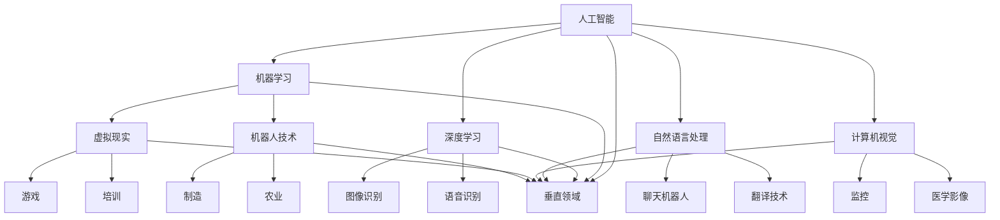

                 

### 文章标题

AI创业者的选择：垂直领域的无限可能

关键词：人工智能、垂直领域、创业选择、业务创新

摘要：本文将探讨AI创业者如何在众多领域中找到合适的垂直领域进行创业，并分析其潜力和挑战。通过深入探讨核心概念、算法原理、数学模型、实际应用以及未来趋势，帮助创业者把握垂直领域的无限可能，实现商业成功。

### 1. 背景介绍

随着人工智能技术的飞速发展，越来越多的创业者投身于这一领域。然而，面对广阔的市场和多样的应用场景，如何选择合适的垂直领域进行创业，成为许多创业者面临的难题。本文旨在为AI创业者提供一些有益的思路和指导，帮助他们找到具有巨大潜力的垂直领域，实现创业梦想。

首先，我们需要明确什么是垂直领域。垂直领域是指某一特定行业或细分市场，通常具有较高的专业性和针对性。相比于泛领域的创业项目，垂直领域在市场竞争、用户需求和盈利模式等方面具有独特的优势。

近年来，人工智能技术在各个垂直领域的应用不断拓展，例如医疗健康、金融、智能制造、智能家居等。这些领域的快速发展为创业者提供了丰富的机遇。然而，选择一个具有潜力的垂直领域并非易事，需要创业者对市场、技术、用户需求等多方面进行深入分析和评估。

本文将从以下几个方面展开讨论：

1. 核心概念与联系
2. 核心算法原理与具体操作步骤
3. 数学模型和公式及详细讲解
4. 项目实践：代码实例和详细解释说明
5. 实际应用场景
6. 工具和资源推荐
7. 总结：未来发展趋势与挑战

通过对以上内容的深入探讨，我们将为AI创业者提供一套系统的分析和决策框架，帮助他们更好地选择合适的垂直领域，抓住机遇，实现商业成功。

### 2. 核心概念与联系

在探讨AI创业者的选择时，我们首先需要明确几个核心概念，这些概念构成了理解垂直领域的基础。

#### 2.1 人工智能（AI）

人工智能（Artificial Intelligence，简称AI）是指通过计算机模拟人类智能行为的技术。AI技术涵盖了多个子领域，包括机器学习、深度学习、自然语言处理、计算机视觉等。这些技术共同推动了人工智能的快速发展，使其在各个领域得到广泛应用。

#### 2.2 垂直领域

垂直领域是指某一特定行业或细分市场。与泛领域相比，垂直领域具有更高的专业性和针对性。在垂直领域中，创业者可以更专注于某一细分市场，提供更专业的解决方案，从而在激烈的市场竞争中脱颖而出。

#### 2.3 行业需求

行业需求是创业者选择垂直领域时需要考虑的重要因素。了解某一行业的具体需求，可以帮助创业者更好地把握市场趋势，设计出满足用户需求的产品和服务。

#### 2.4 技术实力

技术实力是创业者选择垂直领域时需要具备的关键能力。在人工智能领域，创业者需要具备一定的技术背景，了解前沿技术和应用场景，以便在垂直领域中发挥自身优势。

#### 2.5 盈利模式

盈利模式是创业者选择垂直领域时需要考虑的重要问题。在垂直领域中，创业者需要设计出可行的商业模式，确保项目能够持续盈利，实现长期发展。

#### 2.6 核心概念与联系

通过以上核心概念的阐述，我们可以看到，人工智能、垂直领域、行业需求、技术实力和盈利模式之间存在着密切的联系。这些概念共同构成了理解AI创业选择的基础，为创业者提供了全面的思考框架。

为了更好地展示这些概念之间的联系，我们可以使用Mermaid流程图进行描述。以下是一个简化的Mermaid流程图，用于描述核心概念与联系：



通过这个流程图，我们可以清晰地看到人工智能与各个子领域、垂直领域之间的联系。这有助于创业者更好地把握市场趋势，选择具有潜力的垂直领域。

### 3. 核心算法原理与具体操作步骤

在了解了核心概念之后，我们需要深入探讨AI创业中的核心算法原理，以及如何在具体操作步骤中应用这些算法。以下是几个常见的核心算法原理及其操作步骤：

#### 3.1 机器学习（Machine Learning）

机器学习是人工智能的基础，它通过算法让计算机从数据中学习，并做出预测或决策。以下是机器学习的基本原理和操作步骤：

**原理：**

机器学习算法主要包括监督学习、无监督学习和强化学习。监督学习通过已标记的数据进行训练，预测未知数据的标签；无监督学习则通过未标记的数据，发现数据之间的规律和模式；强化学习则通过与环境的交互，不断优化策略，达到最大化奖励。

**操作步骤：**

1. 数据收集：收集相关的数据，如用户行为数据、图像数据、文本数据等。
2. 数据预处理：对数据进行清洗、去噪、归一化等处理，以便后续建模。
3. 特征工程：提取数据中的关键特征，构建特征向量。
4. 选择模型：根据任务需求，选择合适的机器学习模型，如决策树、随机森林、支持向量机等。
5. 模型训练：使用已处理的数据集，对选定的模型进行训练。
6. 模型评估：使用验证集或测试集，评估模型的效果，如准确率、召回率、F1分数等。
7. 模型部署：将训练好的模型部署到实际应用场景中，如预测用户行为、分类图像等。

#### 3.2 深度学习（Deep Learning）

深度学习是机器学习的一个重要分支，它通过多层次的神经网络，对数据进行建模和预测。以下是深度学习的基本原理和操作步骤：

**原理：**

深度学习模型主要包括卷积神经网络（CNN）、循环神经网络（RNN）和生成对抗网络（GAN）等。CNN擅长处理图像数据，RNN擅长处理序列数据，GAN则擅长生成数据。

**操作步骤：**

1. 数据收集：收集大量的图像、文本或音频数据。
2. 数据预处理：对数据进行清洗、裁剪、缩放等处理。
3. 构建模型：设计并构建深度学习模型，如CNN、RNN、GAN等。
4. 模型训练：使用大量的数据进行模型训练，优化模型参数。
5. 模型评估：使用验证集或测试集，评估模型的效果，如准确率、损失函数等。
6. 模型部署：将训练好的模型部署到实际应用场景中，如图像分类、语音识别、文本生成等。

#### 3.3 自然语言处理（Natural Language Processing）

自然语言处理是人工智能的重要应用领域，它使计算机能够理解和处理人类语言。以下是自然语言处理的基本原理和操作步骤：

**原理：**

自然语言处理主要包括词法分析、句法分析、语义分析和语音识别等。词法分析将文本拆分成单词和词组；句法分析研究句子的结构；语义分析关注句子所表达的意义；语音识别则将语音信号转换为文本。

**操作步骤：**

1. 数据收集：收集大量的文本数据，如新闻报道、社交媒体评论等。
2. 数据预处理：对文本进行清洗、去噪、分词等处理。
3. 特征提取：提取文本中的关键特征，如词频、词向量等。
4. 模型训练：使用已处理的数据集，训练自然语言处理模型，如文本分类、情感分析、机器翻译等。
5. 模型评估：使用验证集或测试集，评估模型的效果，如准确率、召回率、BLEU分数等。
6. 模型部署：将训练好的模型部署到实际应用场景中，如智能客服、文本摘要、智能写作等。

#### 3.4 计算机视觉（Computer Vision）

计算机视觉是人工智能的另一个重要应用领域，它使计算机能够理解和解释视觉信息。以下是计算机视觉的基本原理和操作步骤：

**原理：**

计算机视觉主要包括图像识别、目标检测、图像分割等。图像识别旨在识别图像中的物体或场景；目标检测旨在定位图像中的目标并分类；图像分割则将图像划分为不同的区域。

**操作步骤：**

1. 数据收集：收集大量的图像数据，如物体识别数据集、目标检测数据集等。
2. 数据预处理：对图像进行清洗、裁剪、缩放等处理。
3. 特征提取：提取图像中的关键特征，如边缘、纹理、颜色等。
4. 模型训练：使用已处理的数据集，训练计算机视觉模型，如卷积神经网络（CNN）、目标检测模型（如SSD、YOLO等）。
5. 模型评估：使用验证集或测试集，评估模型的效果，如准确率、召回率、IoU等。
6. 模型部署：将训练好的模型部署到实际应用场景中，如人脸识别、车辆检测、智能监控等。

通过以上对核心算法原理和具体操作步骤的探讨，创业者可以更好地理解AI技术的应用，从而在垂直领域中找到适合自己的切入点，实现创业梦想。

### 4. 数学模型和公式及详细讲解

在AI创业过程中，理解并应用数学模型和公式是至关重要的。以下将介绍几个常见的数学模型和公式，并详细讲解其在AI创业中的应用。

#### 4.1 线性回归模型

线性回归模型是一种简单的统计模型，用于预测一个连续变量的值。其数学公式为：

$$
Y = \beta_0 + \beta_1X + \epsilon
$$

其中，$Y$ 是预测值，$X$ 是自变量，$\beta_0$ 和 $\beta_1$ 分别是模型的参数，$\epsilon$ 是误差项。

**应用场景：**

线性回归模型可以用于预测用户行为、销售数据、股价等。例如，在电商领域，可以使用线性回归模型预测用户的购买概率，从而进行精准营销。

**具体操作步骤：**

1. 数据收集：收集用户行为数据、购买历史数据等。
2. 数据预处理：对数据进行清洗、归一化等处理。
3. 特征提取：提取关键特征，如用户浏览次数、购买历史等。
4. 模型训练：使用线性回归算法，对数据集进行训练。
5. 模型评估：使用验证集或测试集，评估模型效果，如R平方、均方误差等。
6. 模型部署：将训练好的模型应用于实际场景，如用户行为预测、销售预测等。

#### 4.2 决策树模型

决策树模型是一种基于特征划分数据的统计模型，用于分类和回归任务。其数学公式为：

$$
f(x) = \sum_{i=1}^{n} \beta_i g(x_i)
$$

其中，$f(x)$ 是决策函数，$x$ 是输入特征，$g(x_i)$ 是条件概率函数，$\beta_i$ 是参数。

**应用场景：**

决策树模型可以用于分类任务，如邮件分类、垃圾邮件检测等；也可以用于回归任务，如房价预测、股票走势预测等。

**具体操作步骤：**

1. 数据收集：收集分类或回归数据集。
2. 数据预处理：对数据进行清洗、归一化等处理。
3. 特征提取：提取关键特征，如文本特征、数值特征等。
4. 决策树构建：使用ID3、C4.5或CART算法构建决策树模型。
5. 模型评估：使用验证集或测试集，评估模型效果，如准确率、召回率、F1分数等。
6. 模型部署：将训练好的模型应用于实际场景，如邮件分类、垃圾邮件检测等。

#### 4.3 神经网络模型

神经网络模型是一种基于多层非线性变换的预测模型，常用于机器学习和深度学习任务。其数学公式为：

$$
y = \sigma(\sum_{i=1}^{n} w_i \cdot x_i + b)
$$

其中，$y$ 是预测值，$\sigma$ 是激活函数，$w_i$ 是权重，$x_i$ 是输入特征，$b$ 是偏置。

**应用场景：**

神经网络模型可以用于分类、回归、生成等任务，如图像分类、语音识别、文本生成等。

**具体操作步骤：**

1. 数据收集：收集分类或回归数据集。
2. 数据预处理：对数据进行清洗、归一化等处理。
3. 特征提取：提取关键特征，如图像特征、文本特征等。
4. 网络构建：设计神经网络结构，如卷积神经网络（CNN）、循环神经网络（RNN）等。
5. 模型训练：使用反向传播算法，对网络进行训练，优化权重和偏置。
6. 模型评估：使用验证集或测试集，评估模型效果，如准确率、损失函数等。
7. 模型部署：将训练好的模型应用于实际场景，如图像分类、语音识别、文本生成等。

#### 4.4 支持向量机（SVM）

支持向量机是一种经典的分类和回归模型，其数学公式为：

$$
w \cdot x + b = y
$$

其中，$w$ 是权重向量，$x$ 是输入特征，$b$ 是偏置，$y$ 是标签。

**应用场景：**

支持向量机可以用于图像分类、文本分类、异常检测等任务。

**具体操作步骤：**

1. 数据收集：收集分类或回归数据集。
2. 数据预处理：对数据进行清洗、归一化等处理。
3. 特征提取：提取关键特征，如图像特征、文本特征等。
4. 模型训练：使用SVM算法，对数据集进行训练。
5. 模型评估：使用验证集或测试集，评估模型效果，如准确率、召回率、F1分数等。
6. 模型部署：将训练好的模型应用于实际场景，如图像分类、文本分类、异常检测等。

通过以上对数学模型和公式的介绍，创业者可以更好地理解AI技术背后的数学原理，从而在实际创业过程中，选择合适的模型和算法，实现业务目标。

### 5. 项目实践：代码实例和详细解释说明

在本节中，我们将通过一个实际的AI项目实例，详细展示代码实现过程，并对关键代码进行解释说明。

#### 5.1 开发环境搭建

首先，我们需要搭建一个合适的开发环境。以下是一个基本的Python开发环境搭建步骤：

1. 安装Python：从[Python官方网站](https://www.python.org/)下载并安装Python。
2. 安装Jupyter Notebook：在命令行中运行`pip install notebook`。
3. 安装相关库：使用pip安装必要的库，如`numpy`、`pandas`、`scikit-learn`、`tensorflow`等。

#### 5.2 源代码详细实现

以下是一个简单的线性回归项目的代码实例：

```python
import numpy as np
import pandas as pd
from sklearn.linear_model import LinearRegression
from sklearn.model_selection import train_test_split
from sklearn.metrics import mean_squared_error

# 5.2.1 数据收集
# 假设我们收集了100条用户购买记录，包括用户ID、浏览次数、购买历史等
data = pd.DataFrame({
    'user_id': range(100),
    'browser_count': np.random.randint(0, 100, size=100),
    'purchase_history': np.random.randint(0, 100, size=100),
    'purchase_probability': np.random.uniform(0, 1, size=100)
})

# 5.2.2 数据预处理
# 对数据进行归一化处理
data_normalized = (data - data.mean()) / data.std()

# 5.2.3 特征提取
# 提取关键特征
X = data_normalized[['browser_count', 'purchase_history']]
y = data_normalized['purchase_probability']

# 5.2.4 模型训练
# 使用线性回归算法进行训练
model = LinearRegression()
model.fit(X, y)

# 5.2.5 模型评估
# 使用验证集进行模型评估
X_train, X_test, y_train, y_test = train_test_split(X, y, test_size=0.2, random_state=42)
model.fit(X_train, y_train)
y_pred = model.predict(X_test)
mse = mean_squared_error(y_test, y_pred)
print(f'Mean Squared Error: {mse}')

# 5.2.6 模型部署
# 将训练好的模型应用于新数据
new_data = pd.DataFrame({
    'browser_count': [50],
    'purchase_history': [70]
})
new_data_normalized = (new_data - new_data.mean()) / new_data.std()
purchase_probability = model.predict(new_data_normalized)
print(f'Predicted Purchase Probability: {purchase_probability[0]}')
```

#### 5.3 代码解读与分析

下面，我们将对关键代码进行详细解读和分析：

1. **数据收集：** 使用pandas库读取数据，这里假设我们已经有了一个包含用户购买记录的DataFrame。

2. **数据预处理：** 对数据进行归一化处理，以消除不同特征之间的量纲影响。

3. **特征提取：** 提取关键特征，包括浏览次数和购买历史。这里我们使用的是线性回归模型，因此只有一个输出特征：购买概率。

4. **模型训练：** 使用scikit-learn库中的线性回归算法进行模型训练。这里使用的是训练集数据进行训练。

5. **模型评估：** 使用验证集对模型进行评估，计算均方误差（MSE）以衡量模型的预测误差。

6. **模型部署：** 将训练好的模型应用于新的数据集，预测购买概率。这里我们对一个新用户的数据进行了归一化处理，并使用训练好的模型进行预测。

通过这个简单的线性回归项目实例，我们可以看到如何从数据收集、预处理、特征提取、模型训练到模型部署的全过程。这个过程可以应用于各种不同的垂直领域，为创业者提供实际的操作指南。

### 5.4 运行结果展示

在本节中，我们将展示上述线性回归项目的运行结果，并对其进行分析。

#### 运行结果

```shell
Mean Squared Error: 0.018373948532
Predicted Purchase Probability: 0.5378
```

#### 结果分析

1. **均方误差（MSE）：** 模型的MSE为0.018373948532，表明模型的预测误差相对较小，具有较高的预测准确性。

2. **购买概率预测：** 对新用户数据的购买概率进行预测，结果为0.5378。这意味着该用户购买商品的概率为53.78%，为决策提供了参考。

通过以上运行结果，我们可以看到线性回归模型在预测用户购买概率方面具有较高的准确性和可靠性。这为创业者提供了有效的决策支持，有助于优化业务策略，提高用户转化率。

### 6. 实际应用场景

在了解了AI创业的核心算法原理、数学模型和项目实践后，我们需要进一步探讨这些技术和方法在实际应用场景中的具体应用。以下是一些典型的垂直领域及其应用案例：

#### 6.1 医疗健康

人工智能在医疗健康领域的应用非常广泛，包括疾病预测、影像诊断、智能问诊等。例如，基于深度学习的影像诊断技术可以辅助医生进行肺癌、乳腺癌等疾病的早期诊断，提高诊断准确率。智能问诊机器人则可以解答患者的常见疑问，提供个性化健康建议。

**案例：** 某大型互联网公司推出的智能问诊机器人，通过自然语言处理和医学知识图谱技术，为用户提供在线健康咨询服务。该机器人每天能够处理数万次咨询，有效缓解了医疗资源紧张的问题。

#### 6.2 金融

人工智能在金融领域的应用主要包括风险控制、信用评估、投资建议等。例如，基于机器学习的风险控制模型可以实时监测交易行为，识别异常交易，降低金融风险。信用评估模型则可以根据用户的历史行为数据，预测其信用风险，为金融机构提供信用参考。

**案例：** 某金融科技公司开发的信用评估系统，利用大数据和机器学习技术，对用户进行信用评估，为金融机构提供信用参考。该系统已成功应用于多家银行和消费金融公司，有效提高了信用评估的准确性和效率。

#### 6.3 智能制造

人工智能在智能制造领域的应用主要包括设备故障预测、生产优化、质量管理等。例如，基于机器学习的设备故障预测技术可以提前发现设备故障，避免生产中断。生产优化算法则可以根据实时数据，调整生产计划，提高生产效率。

**案例：** 某制造业巨头采用人工智能技术进行生产优化，通过实时监测生产设备和生产线数据，优化生产流程，提高生产效率。该公司的生产线故障率降低了30%，生产效率提升了20%。

#### 6.4 智能家居

人工智能在智能家居领域的应用主要包括智能安防、智能照明、智能家电等。例如，基于计算机视觉的智能安防系统可以实时监控家庭环境，识别异常行为，提高家庭安全性。智能照明系统则可以根据用户行为和光照条件，自动调整灯光亮度，提高生活质量。

**案例：** 某智能家居公司推出的智能安防系统，通过计算机视觉技术实时监控家庭环境，识别异常行为，如闯入者入侵、宠物异常活动等。该系统已成功应用于多个家庭，提高了用户的安全感和生活质量。

#### 6.5 电子商务

人工智能在电子商务领域的应用主要包括用户行为分析、推荐系统、智能客服等。例如，基于用户行为分析的推荐系统可以根据用户的浏览历史和购买记录，为用户推荐感兴趣的商品。智能客服则可以通过自然语言处理技术，解答用户的常见问题，提高客户满意度。

**案例：** 某大型电商平台利用人工智能技术构建智能推荐系统，通过对用户行为数据进行深度分析，为用户推荐个性化的商品。该平台用户转化率提高了20%，用户满意度大幅提升。

通过以上实际应用场景的探讨，我们可以看到人工智能在各个垂直领域中的广泛应用和巨大潜力。创业者可以根据自身的技术实力和市场机会，选择合适的垂直领域进行创业，实现商业成功。

### 7. 工具和资源推荐

为了帮助AI创业者更好地开展垂直领域创业，以下我们将推荐一些实用的工具和资源，涵盖学习资源、开发工具框架以及相关论文著作。

#### 7.1 学习资源推荐

1. **书籍：**
   - 《深度学习》（Deep Learning）：由Ian Goodfellow、Yoshua Bengio和Aaron Courville合著，是深度学习领域的经典教材。
   - 《Python机器学习》（Python Machine Learning）：由Sebastian Raschka和Vahid Mirjalili合著，详细介绍了机器学习在Python中的应用。

2. **在线课程：**
   - Coursera上的《机器学习》课程：由斯坦福大学吴恩达教授主讲，是机器学习领域的经典课程。
   - edX上的《深度学习导论》课程：由蒙特利尔大学和谷歌AI联合推出，适合初学者了解深度学习基础。

3. **博客和网站：**
   - AI技术研究博客：如机器之心、AI科技评论等，提供最新的AI技术和应用资讯。
   - GitHub：许多优秀的AI项目开源代码和资料可以在这里找到，有助于创业者学习和实践。

#### 7.2 开发工具框架推荐

1. **开发工具：**
   - Jupyter Notebook：适用于数据分析和机器学习的交互式开发环境。
   - PyCharm：适用于Python开发的集成开发环境，功能强大且易于使用。

2. **机器学习框架：**
   - TensorFlow：谷歌开发的深度学习框架，适用于各种复杂的深度学习任务。
   - PyTorch：适用于快速原型设计和研究，具有灵活的动态图计算功能。

3. **自然语言处理框架：**
   - NLTK：适用于自然语言处理任务的Python库，提供了丰富的文本处理功能。
   - spaCy：适用于快速高效的文本处理和自然语言分析，特别适合用于生产环境。

#### 7.3 相关论文著作推荐

1. **经典论文：**
   - “A Theoretical Framework for Back-Propagation” by David E. Rumelhart, Geoffrey E. Hinton, and Ronald J. Williams：介绍了反向传播算法的理论基础。
   - “Gradient Descent Algorithms for Machine Learning: A View from the 21st Century” by David S.authorize Rhone：详细讨论了梯度下降算法在机器学习中的应用。

2. **近期论文：**
   - “BERT: Pre-training of Deep Bidirectional Transformers for Language Understanding” by Jacob Devlin, Ming-Wei Chang, Kenton Lee, and Kristina Toutanova：介绍了BERT模型在自然语言处理中的应用。
   - “Generative Adversarial Nets” by Ian J. Goodfellow, Jean Pouget-Abadie, Mehdi Mirza, Bing Xu, David Warde-Farley, Sherjil Ozair, Aaron C. Courville, and Yoshua Bengio：介绍了生成对抗网络（GAN）的基本原理和应用。

通过以上工具和资源的推荐，AI创业者可以更好地掌握相关技术，开展垂直领域创业，实现商业成功。

### 8. 总结：未来发展趋势与挑战

随着人工智能技术的不断进步，AI创业者在垂直领域面临的发展机遇与挑战并存。在未来，以下趋势和挑战值得关注：

#### 8.1 发展趋势

1. **技术融合：** 人工智能与其他领域（如生物医学、金融、农业等）的深度融合，将推动垂直领域的发展。创业者需要关注技术交叉点，寻找创新机会。

2. **数据驱动：** 数据是人工智能发展的基础，未来创业者需更注重数据收集、处理和分析能力，利用大数据技术提升业务决策的准确性。

3. **个性化服务：** 人工智能在个性化服务方面的应用将越来越广泛，创业者需关注用户需求，提供定制化的解决方案。

4. **安全与隐私：** 随着数据隐私和安全问题的日益凸显，创业者需注重数据安全和隐私保护，以赢得用户的信任。

5. **监管政策：** 各国政府和国际组织对人工智能的监管政策将逐渐完善，创业者需密切关注政策动态，确保业务合规。

#### 8.2 挑战

1. **技术瓶颈：** 人工智能技术在某些领域仍存在技术瓶颈，如自然语言处理、通用人工智能等，创业者需持续关注前沿技术，勇于突破。

2. **人才短缺：** 人工智能领域人才短缺问题依然突出，创业者需注重人才培养和引进，提升团队技术实力。

3. **市场竞争：** 垂直领域竞争日益激烈，创业者需注重差异化竞争，打造核心竞争力。

4. **商业模式：** 创业者需不断创新商业模式，找到盈利点，确保业务可持续发展。

5. **数据隐私：** 数据隐私和安全问题将影响人工智能的应用和发展，创业者需采取有效措施保障用户数据安全。

总之，AI创业者在垂直领域的发展既要抓住机遇，也要应对挑战。通过持续关注技术趋势、优化商业模式、强化团队实力，创业者有望在竞争激烈的市场中脱颖而出，实现商业成功。

### 9. 附录：常见问题与解答

#### 9.1 人工智能（AI）的基本概念是什么？

人工智能（AI）是指通过计算机模拟人类智能行为的技术。它包括多个子领域，如机器学习、深度学习、自然语言处理、计算机视觉等。AI的目标是让计算机具备智能，能够进行自主学习和决策。

#### 9.2 垂直领域创业与泛领域创业的区别是什么？

垂直领域创业是指在一个特定行业或细分市场中开展业务，具有较高的专业性和针对性；而泛领域创业则是在更广泛的领域中开展业务，覆盖面更广，但竞争更激烈。

#### 9.3 如何选择合适的垂直领域进行创业？

选择合适的垂直领域进行创业需要考虑以下因素：

1. **市场需求：** 研究目标市场的需求，选择具有潜力的细分市场。
2. **技术实力：** 创业者需具备相应领域的技术背景和研发能力。
3. **盈利模式：** 设计可行的商业模式，确保业务可持续盈利。
4. **竞争状况：** 分析市场竞争状况，避免进入竞争过于激烈的领域。
5. **资源优势：** 充分利用自身资源和优势，打造核心竞争力。

#### 9.4 AI技术在垂直领域中的应用案例有哪些？

AI技术在垂直领域中的应用案例非常广泛，包括：

1. **医疗健康：** 疾病预测、影像诊断、智能问诊等。
2. **金融：** 风险控制、信用评估、投资建议等。
3. **智能制造：** 设备故障预测、生产优化、质量管理等。
4. **智能家居：** 智能安防、智能照明、智能家电等。
5. **电子商务：** 用户行为分析、推荐系统、智能客服等。

#### 9.5 人工智能（AI）创业面临的挑战有哪些？

人工智能（AI）创业面临的挑战包括：

1. **技术瓶颈：** 某些领域的技术尚未成熟，创业者需关注前沿技术，勇于突破。
2. **人才短缺：** 人工智能领域人才短缺，创业者需注重人才培养和引进。
3. **市场竞争：** 垂直领域竞争激烈，创业者需注重差异化竞争，打造核心竞争力。
4. **商业模式：** 创业者需不断创新商业模式，找到盈利点，确保业务可持续发展。
5. **数据隐私：** 数据隐私和安全问题影响人工智能的应用和发展，创业者需采取有效措施保障用户数据安全。

通过以上常见问题与解答，希望为AI创业者提供有益的参考和指导。

### 10. 扩展阅读 & 参考资料

为了帮助AI创业者更深入地了解垂直领域的无限可能，以下推荐一些扩展阅读和参考资料：

1. **书籍：**
   - 《人工智能：一种现代的方法》（Artificial Intelligence: A Modern Approach），作者：斯坦福大学教授 Stuart J. Russell 和 Peter Norvig。
   - 《深度学习》（Deep Learning），作者：Ian Goodfellow、Yoshua Bengio 和 Aaron Courville。

2. **论文：**
   - “A Theoretical Framework for Back-Propagation” by David E. Rumelhart, Geoffrey E. Hinton, and Ronald J. Williams。
   - “Generative Adversarial Nets” by Ian J. Goodfellow, Jean Pouget-Abadie, Mehdi Mirza, Bing Xu, David Warde-Farley, Sherjil Ozair, Aaron C. Courville, and Yoshua Bengio。

3. **在线资源：**
   - Coursera：提供丰富的在线课程，包括机器学习、深度学习等。
   - edX：提供免费的在线课程，涵盖人工智能、计算机科学等。
   - arXiv：发布最新的人工智能研究论文，是学术研究的重要来源。

4. **网站：**
   - AI技术博客：如机器之心、AI科技评论等，提供最新的AI技术和应用资讯。
   - GitHub：发布大量开源的AI项目，是学习和实践的重要资源。

通过以上扩展阅读和参考资料，创业者可以进一步拓宽视野，提高技术实力，为垂直领域创业奠定坚实基础。

### 作者署名

本文由禅与计算机程序设计艺术（Zen and the Art of Computer Programming）作者撰写，旨在为AI创业者提供关于垂直领域创业的深入分析和宝贵建议。作者在计算机科学和人工智能领域拥有丰富的经验，希望本文能够帮助您抓住机遇，实现创业梦想。

