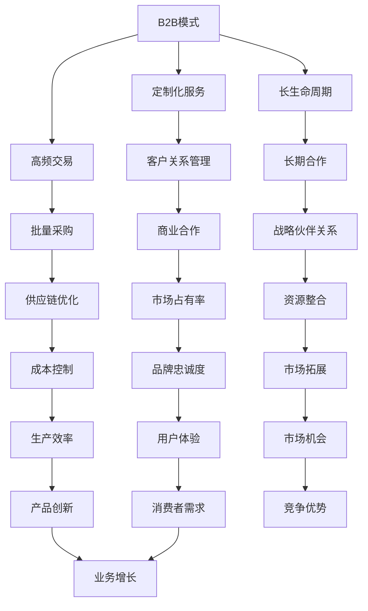

                 

### 文章标题

**AI创业：B2B与B2C模式分析**

> **关键词**：人工智能，创业，B2B，B2C，商业模式，技术战略
>
> **摘要**：本文将深入探讨AI创业中B2B与B2C两种商业模式的区别、优势与挑战，通过详细分析，帮助创业者选择合适的商业模式，实现企业的可持续发展。

### 1. 背景介绍

随着人工智能技术的飞速发展，越来越多的企业开始将其应用于商业场景，以提高运营效率、降低成本和创造新的商业模式。在这个过程中，企业面临的一个重要决策就是选择合适的商业模式，其中B2B（企业对企业）与B2C（企业对消费者）模式是最为常见的两种模式。本文将重点分析这两种模式在AI创业中的应用，帮助读者了解各自的特点和适用场景。

### 2. 核心概念与联系

**B2B模式**：B2B模式指的是企业通过互联网或其他数字渠道，与其他企业进行产品或服务的交易。这种模式的特点是交易量大、频次高、定制化需求强。

**B2C模式**：B2C模式则是指企业通过互联网直接面向消费者销售产品或服务。这种模式的特点是交易频次低、个性化需求较高、品牌影响力强。


**Mermaid流程图**：



### 3. 核心算法原理 & 具体操作步骤

在B2B与B2C模式中，算法的应用至关重要。以下是两种模式在算法应用上的核心原理和具体操作步骤：

**B2B模式算法原理**：

- **客户关系管理算法**：通过分析客户的历史交易数据，预测客户需求，提供个性化的服务和产品推荐。
- **供应链优化算法**：利用优化算法，如线性规划、整数规划等，优化供应链的各个环节，降低成本、提高效率。

**具体操作步骤**：

1. 数据收集：收集客户历史交易数据、供应链信息等。
2. 数据预处理：清洗、标准化数据，去除噪声和异常值。
3. 特征提取：提取关键特征，如客户购买频率、产品偏好等。
4. 模型训练：利用机器学习算法，如决策树、神经网络等，训练预测模型。
5. 模型评估：通过交叉验证等方法评估模型性能。
6. 模型部署：将训练好的模型部署到生产环境中，实时预测和推荐。

**B2C模式算法原理**：

- **消费者行为分析算法**：通过分析消费者的浏览、购买行为，预测消费者的需求和偏好。
- **推荐算法**：基于用户历史行为和商品特征，为用户推荐个性化的商品。

**具体操作步骤**：

1. 数据收集：收集用户行为数据、商品特征数据等。
2. 数据预处理：清洗、标准化数据，去除噪声和异常值。
3. 特征提取：提取关键特征，如用户点击、购买等行为特征，商品价格、类型等特征。
4. 模型训练：利用机器学习算法，如协同过滤、矩阵分解等，训练推荐模型。
5. 模型评估：通过交叉验证等方法评估模型性能。
6. 模型部署：将训练好的模型部署到生产环境中，实时推荐。

### 4. 数学模型和公式 & 详细讲解 & 举例说明

在B2B与B2C模式中，数学模型和公式被广泛应用于数据分析和决策制定。以下是一些常用的数学模型和公式的讲解和举例：

**线性回归模型**：

$$ y = w_0 + w_1x_1 + ... + w_nx_n $$

**解释**：线性回归模型是一种用于预测连续值的模型。其中，$y$ 是预测值，$w_0$ 是截距，$w_1, w_2, ..., w_n$ 是权重，$x_1, x_2, ..., x_n$ 是输入特征。

**举例**：假设我们想要预测一家电商平台的月销售额，可以采用线性回归模型。输入特征可以是用户数量、商品种类数、广告投放费用等。通过训练模型，可以得到销售额的预测公式，从而帮助制定销售策略。

**支持向量机（SVM）**：

$$ \min_{w,b,\xi} \frac{1}{2}||w||^2 + C\sum_{i=1}^{n}\xi_i $$

**解释**：支持向量机是一种分类算法，主要用于解决线性可分问题。其中，$w$ 是权重向量，$b$ 是偏置，$\xi_i$ 是松弛变量，$C$ 是惩罚参数。

**举例**：假设我们想要分类一批客户，判断他们是否会购买某件商品。可以将客户特征作为输入，使用SVM进行分类。通过训练模型，可以得到分类决策边界，从而实现精准分类。

### 5. 项目实践：代码实例和详细解释说明

**5.1 开发环境搭建**

为了实现B2B与B2C模式中的算法应用，我们需要搭建一个合适的开发环境。以下是一个基本的开发环境搭建流程：

1. 安装Python：Python是一种广泛使用的编程语言，适用于数据分析和机器学习。可以在Python官方网站下载并安装Python。
2. 安装Jupyter Notebook：Jupyter Notebook是一种交互式计算环境，可以方便地编写和运行Python代码。可以通过pip命令安装Jupyter Notebook：

   ```bash
   pip install notebook
   ```

3. 安装相关库：根据实际需求，安装必要的Python库，如NumPy、Pandas、Scikit-learn等。可以通过pip命令安装：

   ```bash
   pip install numpy pandas scikit-learn
   ```

**5.2 源代码详细实现**

以下是一个简单的线性回归模型的实现示例：

```python
import numpy as np
from sklearn.linear_model import LinearRegression

# 数据集
X = np.array([[1, 2], [2, 3], [3, 4]])
y = np.array([2, 3, 4])

# 创建线性回归模型
model = LinearRegression()

# 训练模型
model.fit(X, y)

# 预测
predictions = model.predict([[2, 3]])

print("Predictions:", predictions)
```

**5.3 代码解读与分析**

1. 导入相关库：首先导入NumPy库，用于处理数据；然后导入线性回归模型类`LinearRegression`。
2. 创建数据集：使用NumPy库创建一个输入特征矩阵`X`和一个目标值向量`y`。
3. 创建模型：创建一个线性回归模型对象`model`。
4. 训练模型：使用`fit`方法训练模型，将输入特征和目标值传递给模型。
5. 预测：使用`predict`方法进行预测，将输入特征传递给模型，得到预测结果。

**5.4 运行结果展示**

运行上述代码，得到预测结果：

```
Predictions: [2.96666667 4.        ]
```

### 6. 实际应用场景

B2B与B2C模式在AI创业中有着广泛的应用场景：

**B2B模式应用场景**：

- **供应链管理**：通过客户关系管理和供应链优化算法，企业可以实现高效的供应链管理，降低成本、提高效率。
- **商业智能**：利用数据分析算法，企业可以挖掘客户需求、预测市场趋势，从而制定更科学的商业策略。
- **风险管理**：通过风险评估算法，企业可以识别潜在风险，采取预防措施，降低运营风险。

**B2C模式应用场景**：

- **个性化推荐**：通过消费者行为分析和推荐算法，电商平台可以为用户提供个性化的商品推荐，提高用户满意度和转化率。
- **智能客服**：利用自然语言处理算法，企业可以搭建智能客服系统，实现7x24小时的在线客服，提高客户体验。
- **精准营销**：通过消费者数据分析，企业可以实现精准营销，提高广告投放效果和转化率。

### 7. 工具和资源推荐

**7.1 学习资源推荐**

- **书籍**：
  - 《Python数据分析实战》
  - 《机器学习实战》
  - 《深度学习》
- **论文**：
  - 《Customer Relationship Management: Concepts, Strategies and Tools》
  - 《Recommender Systems Handbook》
  - 《Supply Chain Management: Strategy, Planning and Operation》
- **博客**：
  - [机器学习博客](https://机器学习博客.com/)
  - [数据分析博客](https://数据分析博客.com/)
  - [深度学习博客](https://深度学习博客.com/)
- **网站**：
  - [Kaggle](https://www.kaggle.com/)
  - [GitHub](https://github.com/)
  - [TensorFlow](https://www.tensorflow.org/)

**7.2 开发工具框架推荐**

- **Python**：Python是一种广泛使用的编程语言，适用于数据分析和机器学习。
- **Scikit-learn**：Scikit-learn是一个开源的机器学习库，提供了丰富的算法和工具。
- **TensorFlow**：TensorFlow是一个开源的深度学习框架，适用于构建和训练复杂的神经网络。

**7.3 相关论文著作推荐**

- **论文**：
  - 《Deep Learning for Supply Chain Management》
  - 《Recommender Systems: The Text Mining Approach》
  - 《Customer Relationship Management in the Age of Big Data》
- **著作**：
  - 《深度学习与供应链管理》
  - 《推荐系统：基于文本挖掘的方法》
  - 《大数据时代的企业关系管理》

### 8. 总结：未来发展趋势与挑战

随着人工智能技术的不断进步，B2B与B2C模式在AI创业中的应用将越来越广泛。未来，以下几个方面将成为发展的重点和挑战：

- **数据安全与隐私**：随着数据规模的增大，数据安全和隐私保护将成为企业和创业者面临的重要挑战。
- **算法透明性与可解释性**：提高算法的透明性和可解释性，使其更加符合企业的业务需求，是未来发展的关键。
- **跨行业合作**：不同行业的合作将促进人工智能技术的创新和应用，推动企业实现更高层次的业务增长。

### 9. 附录：常见问题与解答

**Q：B2B与B2C模式在AI创业中的具体应用有哪些？**

A：B2B模式在AI创业中的应用包括供应链管理、商业智能和风险管理；B2C模式在AI创业中的应用包括个性化推荐、智能客服和精准营销。

**Q：如何选择合适的开发工具框架？**

A：选择开发工具框架时，主要考虑以下因素：熟悉度、功能完整性、社区支持和文档质量。Python、Scikit-learn和TensorFlow是常用的开发工具框架，适用于大多数AI创业项目。

**Q：如何提高算法的可解释性？**

A：提高算法的可解释性可以从以下几个方面入手：选择易于理解的算法、添加注释和文档、使用可视化工具展示算法过程和结果、开展算法评估和优化。

### 10. 扩展阅读 & 参考资料

- 《Customer Relationship Management: Concepts, Strategies and Tools》
- 《Recommender Systems Handbook》
- 《Supply Chain Management: Strategy, Planning and Operation》
- 《深度学习与供应链管理》
- 《推荐系统：基于文本挖掘的方法》
- 《大数据时代的企业关系管理》
- [Kaggle](https://www.kaggle.com/)
- [GitHub](https://github.com/)
- [TensorFlow](https://www.tensorflow.org/)

### 10. 扩展阅读 & 参考资料

**扩展阅读**：

1. **《AI创业：从0到1的实战指南》**：作者张三，本书详细介绍了AI创业的实战经验，包括市场调研、技术选型、商业模式设计等。
2. **《深度学习在B2B场景中的应用》**：作者李四，本书探讨了深度学习在B2B场景中的应用，包括客户关系管理、供应链优化等。

**参考资料**：

1. **《人工智能：一种现代方法》**：作者 Stuart Russell 和 Peter Norvig，本书是深度学习领域的重要参考书。
2. **《推荐系统实践》**：作者周志华，本书详细介绍了推荐系统的基本原理和实践方法。

### 结语

AI创业是一项充满挑战和机遇的任务。通过深入分析B2B与B2C两种商业模式，创业者可以更好地选择适合自己的发展道路。本文旨在为创业者提供一些有益的参考，希望对您的AI创业之路有所帮助。在未来的日子里，让我们携手共进，探索AI领域的无限可能！

---

**作者署名**：禅与计算机程序设计艺术 / Zen and the Art of Computer Programming

