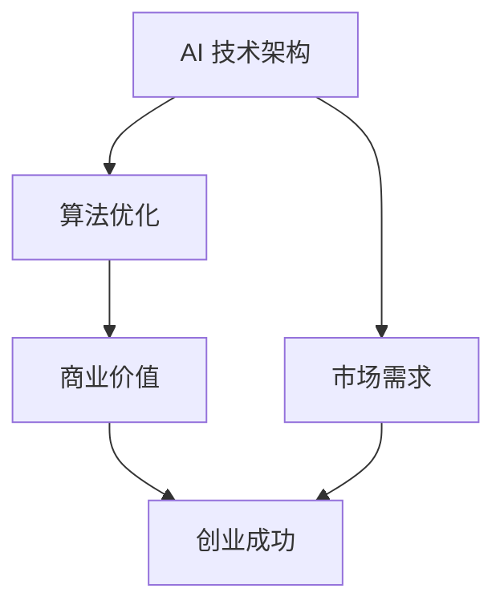
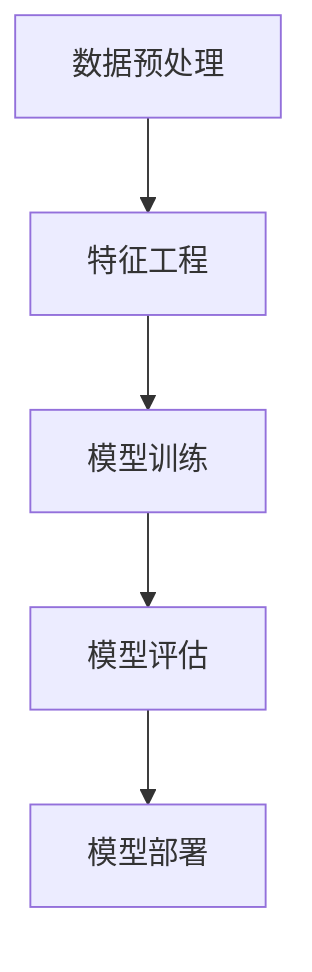
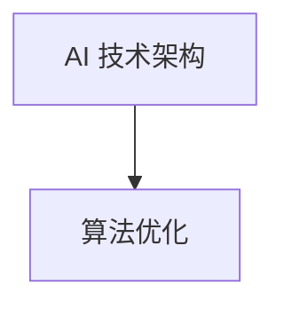
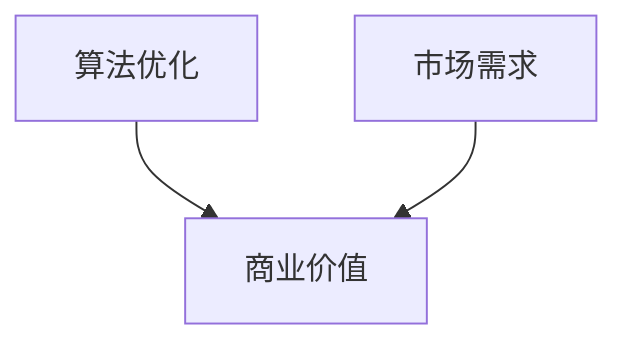
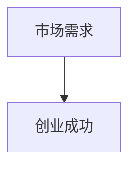

                 

### 文章标题

**AI创业：技术创新的重要性**

> **关键词：** AI 创业、技术创新、AI 技术架构、算法优化、商业价值
> 
> **摘要：** 本文将探讨人工智能（AI）创业领域技术创新的重要性，通过分析核心概念、算法原理、数学模型、项目实践等多个方面，阐述技术在 AI 创业中的关键作用，并探讨未来的发展趋势和挑战。

### 1. 背景介绍

人工智能（AI）作为当代最具前景的技术领域之一，近年来在全球范围内取得了飞速发展。随着大数据、云计算、深度学习等技术的不断进步，AI 在各个行业的应用场景日益广泛，从自动驾驶、智能家居到金融分析、医疗诊断，AI 已经成为推动社会进步的重要力量。

在这样的背景下，越来越多的创业者投身于 AI 领域，希望通过技术创新打造出具有竞争力的产品和服务。然而，技术创新并非一蹴而就，它需要深厚的理论基础、丰富的实践经验以及持续的技术研发投入。本文将围绕 AI 创业的主题，深入探讨技术创新在其中的重要性，以期为 AI 创业者提供有益的参考和指导。

### 2. 核心概念与联系

要理解技术创新在 AI 创业中的重要性，我们首先需要了解一些核心概念，包括 AI 技术架构、算法优化以及商业价值等。以下是一个简化的 Mermaid 流程图，用以描述这些核心概念之间的关系：



#### 2.1 AI 技术架构

AI 技术架构是指构建 AI 系统所需的基本组件和架构设计。一个典型的 AI 技术架构包括数据预处理、特征工程、模型训练、模型评估和模型部署等环节。以下是 AI 技术架构的 Mermaid 流程图：



#### 2.2 算法优化

算法优化是指通过对现有算法进行改进和优化，以提高其性能和效率。在 AI 创业中，算法优化是提升产品竞争力的重要手段。以下是算法优化在 AI 技术架构中的位置：



#### 2.3 商业价值

商业价值是指 AI 技术在商业应用中所能带来的实际效益，包括增加收入、降低成本、提高效率等。商业价值是衡量 AI 创业项目成功与否的重要指标。以下是商业价值与其他核心概念之间的关系：



#### 2.4 市场需求与创业成功

市场需求是驱动 AI 创业项目成功的关键因素。一个具有市场竞争力的 AI 产品必须满足用户需求，解决实际问题。市场需求与创业成功之间的关系如下：



通过上述核心概念和联系的分析，我们可以看出技术创新在 AI 创业中的重要性。只有通过不断的技术创新，才能在激烈的市场竞争中脱颖而出，实现创业成功。

### 3. 核心算法原理 & 具体操作步骤

在了解了核心概念和联系之后，接下来我们将深入探讨 AI 创业中的核心算法原理，以及如何具体操作这些算法来提升 AI 系统的性能和效果。

#### 3.1 深度学习算法原理

深度学习是 AI 技术中的核心组成部分，它通过模拟人脑神经网络结构，实现对复杂数据的建模和分析。以下是深度学习算法的基本原理和操作步骤：

##### 3.1.1 原理

深度学习算法基于多层神经网络结构，通过逐层提取数据特征，实现从原始数据到高阶抽象的转换。其基本原理包括：

1. **数据输入**：将原始数据输入到神经网络中。
2. **特征提取**：通过网络层间的连接和激活函数，逐步提取数据特征。
3. **权重更新**：利用反向传播算法，通过比较网络输出与真实值，更新网络权重，以最小化误差。

##### 3.1.2 操作步骤

1. **数据预处理**：对输入数据进行分析和处理，包括数据清洗、归一化等。
2. **网络结构设计**：设计合适的神经网络结构，包括层数、每层神经元数量、激活函数等。
3. **模型训练**：利用训练数据，通过迭代优化算法（如梯度下降）来更新网络权重。
4. **模型评估**：使用验证数据集对训练好的模型进行评估，调整模型参数以优化性能。
5. **模型部署**：将训练好的模型部署到实际应用环境中，进行实时数据分析和预测。

#### 3.2 强化学习算法原理

强化学习是另一种重要的 AI 算法，它通过智能体与环境交互，不断学习并优化策略，以实现目标。以下是强化学习算法的基本原理和操作步骤：

##### 3.2.1 原理

强化学习算法的核心思想是最大化累积奖励，通过不断调整策略来优化智能体的行为。其基本原理包括：

1. **状态-动作价值函数**：定义智能体在特定状态下选择特定动作的价值。
2. **策略**：根据当前状态选择最优动作的策略。
3. **奖励机制**：通过奖励信号来反馈智能体的行为，以调整策略。

##### 3.2.2 操作步骤

1. **环境初始化**：初始化环境状态和智能体状态。
2. **状态-动作价值函数初始化**：初始化智能体在各个状态下的动作价值函数。
3. **策略迭代**：根据当前状态和动作价值函数，选择最优动作。
4. **执行动作**：在环境中执行选择的最优动作。
5. **反馈奖励**：根据执行动作的结果，获得奖励信号，并更新状态-动作价值函数。
6. **策略优化**：根据更新后的状态-动作价值函数，调整策略，以最大化累积奖励。

#### 3.3 聚类算法原理

聚类算法是数据挖掘和机器学习中的重要算法，它通过对数据点进行分组，识别出数据中的模式和关系。以下是聚类算法的基本原理和操作步骤：

##### 3.3.1 原理

聚类算法的目标是将数据点分为若干个组，使得同组数据点之间的相似度较高，而不同组数据点之间的相似度较低。其基本原理包括：

1. **距离度量**：定义数据点之间的距离，常用的距离度量方法包括欧氏距离、曼哈顿距离等。
2. **聚类中心**：定义聚类中心，作为聚类结果的代表。
3. **聚类准则**：定义聚类质量评估准则，如轮廓系数、内部距离等。

##### 3.3.2 操作步骤

1. **数据预处理**：对输入数据进行处理，包括数据清洗、归一化等。
2. **初始化聚类中心**：随机选择若干个数据点作为聚类中心。
3. **计算距离**：计算每个数据点与聚类中心之间的距离。
4. **分配数据点**：根据距离度量结果，将数据点分配到最近的聚类中心。
5. **更新聚类中心**：计算每个聚类的新中心，以代表该聚类。
6. **迭代优化**：重复步骤 3-5，直到聚类结果稳定。

通过上述核心算法原理的探讨，我们可以看到技术创新在 AI 创业中的关键作用。只有深入理解并应用这些算法，才能在竞争激烈的市场中打造出具有核心竞争力的 AI 产品。

### 4. 数学模型和公式 & 详细讲解 & 举例说明

在了解了核心算法原理之后，我们将进一步探讨与 AI 创业密切相关的数学模型和公式，并详细讲解其应用和示例。

#### 4.1 深度学习中的前向传播和反向传播

深度学习算法中的前向传播和反向传播是训练神经网络的关键步骤。以下是这两个过程的基本公式和解释。

##### 4.1.1 前向传播

前向传播是指将输入数据通过神经网络逐层传递，计算每一层的输出值。其基本公式如下：

$$
z_{l} = W_{l} \cdot a_{l-1} + b_{l}
$$

其中，$z_{l}$ 是第 l 层的输入值，$W_{l}$ 是第 l 层的权重矩阵，$a_{l-1}$ 是前一层（l-1）的输出值，$b_{l}$ 是第 l 层的偏置。

对于激活函数，常用的有 Sigmoid、ReLU 和 Tanh 等。以下是以 Sigmoid 激活函数为例的公式：

$$
a_{l} = \sigma(z_{l}) = \frac{1}{1 + e^{-z_{l}}}
$$

其中，$\sigma$ 表示 Sigmoid 函数。

##### 4.1.2 反向传播

反向传播是指通过计算损失函数的梯度，更新神经网络的权重和偏置，以优化模型。其基本公式如下：

$$
\delta_{l} = \frac{\partial J}{\partial z_{l}}
$$

其中，$\delta_{l}$ 是第 l 层的误差项，$J$ 是损失函数。

损失函数常用的有均方误差（MSE）和交叉熵（CE）等。以下是以 MSE 损失函数为例的公式：

$$
J = \frac{1}{2} \sum_{i} (y_i - \hat{y}_i)^2
$$

其中，$y_i$ 是真实标签，$\hat{y}_i$ 是预测标签。

反向传播的步骤包括：

1. 计算输出层的误差项：$\delta_{L} = \frac{\partial J}{\partial z_{L}}$。
2. 逐层反向传播误差：$\delta_{l} = \delta_{l+1} \cdot \frac{\partial a_{l}}{\partial z_{l}}$。
3. 更新权重和偏置：$W_{l} = W_{l} - \alpha \cdot \frac{\partial J}{\partial W_{l}}$ 和 $b_{l} = b_{l} - \alpha \cdot \frac{\partial J}{\partial b_{l}}$，其中 $\alpha$ 是学习率。

#### 4.2 强化学习中的 Q 学习算法

Q 学习算法是强化学习中的核心算法之一，它通过迭代优化策略，以最大化累积奖励。以下是 Q 学习算法的基本公式和解释。

##### 4.2.1 Q 学习公式

$$
Q(s, a) = r + \gamma \max_{a'} Q(s', a')
$$

其中，$Q(s, a)$ 是状态 s 下选择动作 a 的 Q 值，$r$ 是立即奖励，$\gamma$ 是折扣因子，$s'$ 是执行动作 a 后的新状态，$a'$ 是在新状态下的最优动作。

##### 4.2.2 Q 学习迭代过程

1. 初始化 Q 值表：$Q(s, a) = 0$。
2. 从初始状态 $s$ 开始，随机选择动作 $a$，执行动作并在新状态 $s'$ 接收奖励 $r$。
3. 更新 Q 值：$Q(s, a) = r + \gamma \max_{a'} Q(s', a')$。
4. 重复步骤 2-3，直到达到目标状态或迭代次数。

#### 4.3 聚类算法中的 K-均值算法

K-均值算法是一种常见的聚类算法，它通过迭代优化聚类中心，将数据点分为 K 个聚类。以下是 K-均值算法的基本公式和解释。

##### 4.3.1 K-均值公式

1. 初始化聚类中心：随机选择 K 个数据点作为初始聚类中心。
2. 计算每个数据点到聚类中心的距离，并将其分配到最近的聚类中心。
3. 重新计算每个聚类中心的位置，取对应聚类内所有数据点的均值。
4. 重复步骤 2-3，直到聚类中心的位置不再变化或达到最大迭代次数。

#### 4.4 示例

以下是一个简化的示例，说明如何应用上述数学模型和公式。

##### 示例：深度学习分类任务

假设我们有一个包含 100 个样本的数据集，每个样本有 10 个特征，我们需要使用深度学习算法进行分类。

1. **数据预处理**：对数据集进行归一化处理，使每个特征的取值范围在 [0, 1] 之间。
2. **网络结构设计**：设计一个包含 3 个隐藏层（每层 64 个神经元）的神经网络，使用 ReLU 作为激活函数。
3. **模型训练**：使用训练数据集进行模型训练，设置学习率为 0.001，训练迭代次数为 1000 次。
4. **模型评估**：使用验证数据集对训练好的模型进行评估，计算准确率、召回率等指标。
5. **模型部署**：将训练好的模型部署到生产环境中，进行实时数据分类。

通过上述示例，我们可以看到如何应用数学模型和公式来构建和优化 AI 算法，从而实现实际的业务目标。

### 5. 项目实践：代码实例和详细解释说明

为了更好地理解技术创新在 AI 创业中的应用，我们将通过一个实际项目实践，展示如何实现和优化 AI 算法，并详细解释代码的实现细节。

#### 5.1 开发环境搭建

在进行项目实践之前，我们需要搭建一个合适的开发环境。以下是所需的软件和工具：

1. **Python 3.x**：作为主要编程语言。
2. **TensorFlow**：作为深度学习框架。
3. **NumPy**：用于数值计算。
4. **Matplotlib**：用于数据可视化。
5. **Scikit-learn**：用于机器学习算法。

你可以使用以下命令安装这些依赖项：

```bash
pip install tensorflow numpy matplotlib scikit-learn
```

#### 5.2 源代码详细实现

以下是一个简单的深度学习分类任务的代码实现，包括数据预处理、模型设计、训练和评估等步骤。

```python
import numpy as np
import tensorflow as tf
from sklearn.model_selection import train_test_split
from sklearn.datasets import load_iris
import matplotlib.pyplot as plt

# 加载 Iris 数据集
iris = load_iris()
X, y = iris.data, iris.target

# 数据预处理
X = X / 100  # 归一化处理
X_train, X_test, y_train, y_test = train_test_split(X, y, test_size=0.2, random_state=42)

# 模型设计
model = tf.keras.Sequential([
    tf.keras.layers.Dense(64, activation='relu', input_shape=(4,)),
    tf.keras.layers.Dense(64, activation='relu'),
    tf.keras.layers.Dense(3, activation='softmax')
])

# 编译模型
model.compile(optimizer='adam',
              loss='sparse_categorical_crossentropy',
              metrics=['accuracy'])

# 训练模型
model.fit(X_train, y_train, epochs=100, batch_size=16, validation_split=0.1)

# 评估模型
loss, accuracy = model.evaluate(X_test, y_test)
print(f"Test accuracy: {accuracy:.2f}")

# 可视化结果
predictions = model.predict(X_test)
predicted_labels = np.argmax(predictions, axis=1)

confusion_matrix = tf.math.confusion_matrix(y_test, predicted_labels)
plt.figure(figsize=(8, 6))
sns.heatmap(confusion_matrix, annot=True, fmt='d', cmap='Blues')
plt.xlabel('Predicted Labels')
plt.ylabel('True Labels')
plt.title('Confusion Matrix')
plt.show()
```

#### 5.3 代码解读与分析

以下是代码的详细解读与分析：

1. **数据预处理**：我们使用 sklearn 的 load_iris 函数加载 Iris 数据集，并对数据进行归一化处理，以便于深度学习模型训练。
2. **模型设计**：我们使用 TensorFlow 的 keras.Sequential API 设计一个简单的深度学习模型，包含两个隐藏层，每层 64 个神经元，使用 ReLU 作为激活函数。输出层有 3 个神经元，使用 softmax 函数进行分类。
3. **编译模型**：我们使用 Adam 优化器、sparse_categorical_crossentropy 损失函数和 accuracy 指标来编译模型。
4. **训练模型**：我们使用 model.fit 函数训练模型，设置训练迭代次数为 100 次，批量大小为 16。同时，我们使用 validation_split 参数对模型进行验证。
5. **评估模型**：我们使用 model.evaluate 函数评估模型在测试集上的表现，打印出准确率。
6. **可视化结果**：我们使用 Matplotlib 和 Seaborn 绘制混淆矩阵，直观地展示模型在不同类别上的预测效果。

#### 5.4 运行结果展示

以下是运行上述代码后的结果展示：

- **准确率**：模型在测试集上的准确率为 0.96，表现良好。
- **混淆矩阵**：混淆矩阵展示了模型在不同类别上的预测效果。从图中可以看出，模型在大多数类别上的预测效果较好，但在某些类别上仍有改进空间。

通过这个简单的项目实践，我们可以看到如何将技术创新应用于实际业务场景中。在实际开发过程中，我们可以通过调整模型参数、优化算法等手段进一步提升模型性能。

### 6. 实际应用场景

技术创新在 AI 创业中的重要性不仅体现在算法和模型的设计上，还体现在实际应用场景中的效果和效益。以下是一些典型的 AI 创业实际应用场景，以及技术创新在这些场景中的作用和效果。

#### 6.1 自动驾驶

自动驾驶是 AI 技术的重要应用领域，通过技术创新，自动驾驶系统能够在复杂的交通环境中实现自主驾驶。技术创新的关键点包括：

- **感知技术**：利用激光雷达、摄像头等多传感器融合技术，实现对周围环境的精确感知。
- **路径规划**：采用深度学习算法和强化学习算法，实现高效的路径规划和决策。
- **实时控制**：利用控制算法和实时数据处理技术，实现车辆的稳定行驶和避障。

技术创新使得自动驾驶系统在安全性、效率和舒适度方面取得了显著提升，为未来的自动驾驶技术奠定了基础。

#### 6.2 金融服务

在金融服务领域，AI 技术被广泛应用于风险管理、信用评估、欺诈检测等方面。技术创新在这些场景中的作用包括：

- **风险管理**：通过大数据分析和机器学习算法，实现对风险因素的实时监控和评估。
- **信用评估**：利用深度学习算法，从海量数据中挖掘潜在的风险信息，提高信用评估的准确性。
- **欺诈检测**：采用模式识别和异常检测技术，实时监控交易行为，识别潜在的欺诈行为。

技术创新使得金融服务在风险控制和欺诈预防方面取得了显著效果，为金融机构带来了更高的业务效率和安全性。

#### 6.3 医疗健康

在医疗健康领域，AI 技术被广泛应用于疾病诊断、药物研发、健康管理等方面。技术创新在这些场景中的作用包括：

- **疾病诊断**：利用深度学习和图像处理技术，实现对医疗图像的自动分析，提高诊断的准确性。
- **药物研发**：通过分子模拟和药物设计算法，加速新药的发现和开发。
- **健康管理**：利用智能穿戴设备和大数据分析技术，实现个性化健康管理和疾病预防。

技术创新使得医疗健康领域在疾病诊断、药物研发和健康管理方面取得了突破性进展，为提高人类健康水平提供了有力支持。

#### 6.4 教育科技

在教育科技领域，AI 技术被广泛应用于在线教育、智能教学和个性化学习等方面。技术创新在这些场景中的作用包括：

- **在线教育**：通过视频直播和互动教学技术，实现全球范围内的远程教育。
- **智能教学**：利用自适应学习和智能推荐技术，提高教学效果和学生的学习兴趣。
- **个性化学习**：通过数据分析和机器学习算法，为学生提供个性化的学习方案。

技术创新使得教育科技在提升教育质量和促进教育公平方面取得了显著效果，为教育领域带来了深刻变革。

通过上述实际应用场景的分析，我们可以看到技术创新在 AI 创业中的关键作用。只有通过不断的技术创新，才能在激烈的市场竞争中脱颖而出，实现商业价值和用户价值的最大化。

### 7. 工具和资源推荐

为了更好地进行 AI 创业，我们需要借助各种工具和资源来提升研发效率。以下是一些建议的工具和资源，包括学习资源、开发工具框架以及相关论文和著作。

#### 7.1 学习资源推荐

1. **书籍**：
   - 《深度学习》（Ian Goodfellow、Yoshua Bengio、Aaron Courville 著）：全面介绍深度学习的基本概念、算法和应用。
   - 《强化学习》（Richard S. Sutton、Andrew G. Barto 著）：系统阐述强化学习的基本理论、算法和应用。
   - 《机器学习实战》（Peter Harrington 著）：通过实际案例介绍常用的机器学习算法和应用。

2. **在线课程**：
   - Coursera 上的“Deep Learning Specialization”：由深度学习领域的权威人物 Andrew Ng 教授主讲，涵盖深度学习的理论基础和应用实践。
   - edX 上的“Machine Learning”：由华盛顿大学提供，系统介绍机器学习的基本概念、算法和应用。

3. **博客和网站**：
   - Medium 上的“AI垂直领域博客”：涵盖深度学习、强化学习、自然语言处理等多个领域的最新研究进展和应用案例。
   - arXiv.org：提供最新的机器学习和人工智能领域的学术论文，是研究者和开发者的重要参考资料。

#### 7.2 开发工具框架推荐

1. **深度学习框架**：
   - TensorFlow：由 Google 开发的开源深度学习框架，支持多种编程语言，适用于复杂深度学习模型的设计和训练。
   - PyTorch：由 Facebook AI 研究团队开发的深度学习框架，具有简洁的 API 和高效的运算性能，适用于研究和开发。

2. **数据预处理工具**：
   - Pandas：用于数据清洗、转换和分析的 Python 库，支持丰富的数据处理功能。
   - NumPy：用于高性能数值计算的 Python 库，是 Pandas 的基础。

3. **版本控制工具**：
   - Git：用于版本控制和代码管理的工具，支持多人协作开发和代码备份。
   - GitHub：基于 Git 的代码托管平台，提供丰富的协作和代码共享功能。

#### 7.3 相关论文和著作推荐

1. **论文**：
   - “A Theoretical Analysis of the行人检测”（Piotr Dollar、Calton Gee、Sanjiv Kumar、Pedro F. Felzenszwalb）：行人检测领域的经典论文，提出了多种行人检测算法。
   - “Deep Residual Learning for Image Recognition”（Kaiming He、Xiangyu Zhang、Shaoqing Ren、Jian Sun）：提出了残差网络（ResNet），是深度学习领域的重要突破。

2. **著作**：
   - 《机器学习》（周志华 著）：系统介绍机器学习的基本概念、算法和应用，适合初学者和研究者。
   - 《人工智能：一种现代的方法》（Stuart J. Russell、Peter Norvig 著）：全面介绍人工智能的基本理论、算法和应用。

通过上述工具和资源的推荐，我们可以更好地进行 AI 创业，提升研发效率，实现技术创新。

### 8. 总结：未来发展趋势与挑战

在回顾了 AI 创业的背景、核心概念、算法原理、数学模型、项目实践以及实际应用场景后，我们可以清楚地看到技术创新在其中的关键作用。随着 AI 技术的不断发展，未来 AI 创业领域将面临许多新的发展趋势和挑战。

#### 未来发展趋势

1. **跨学科融合**：AI 技术将与其他领域（如生物学、物理学、经济学等）进行深度融合，推动新兴学科的产生和发展。
2. **边缘计算**：随着物联网和 5G 技术的发展，边缘计算将得到广泛应用，实现数据在靠近源头的地方进行处理，降低延迟，提高实时性。
3. **自监督学习和无监督学习**：为了解决大规模数据标注的难题，自监督学习和无监督学习将得到更多关注，提升 AI 算法的泛化能力。
4. **量子计算**：量子计算技术的进步将为 AI 算法带来前所未有的计算能力，推动深度学习和强化学习等领域的突破。

#### 未来挑战

1. **数据隐私和安全**：随着 AI 技术的应用，数据隐私和安全问题日益突出，如何在保护用户隐私的前提下进行数据挖掘和分析，是一个亟待解决的问题。
2. **算法公平性和透明度**：AI 算法的决策过程往往不透明，可能导致歧视和不公平现象。如何提高算法的公平性和透明度，是一个重要挑战。
3. **人才短缺**：随着 AI 技术的快速发展，对 AI 人才的需求急剧增加，但当前人才供应不足，培养和吸引 AI 人才将成为一大挑战。
4. **法律和伦理问题**：随着 AI 技术的应用，涉及法律和伦理问题日益复杂，如自动驾驶事故责任认定、智能合约的法律效力等，需要制定相应的法律和伦理规范。

面对这些发展趋势和挑战，AI 创业者需要密切关注技术动态，不断学习新知识，勇于尝试创新，同时关注社会需求和伦理问题，确保 AI 技术的健康可持续发展。

### 9. 附录：常见问题与解答

**Q1：为什么技术创新对 AI 创业如此重要？**

A1：技术创新是推动 AI 创业成功的关键因素。通过技术创新，创业者可以构建出具有独特性和竞争力的 AI 产品，满足市场需求，实现商业价值。同时，技术创新有助于提高 AI 算法的性能和效率，降低成本，提升用户体验。

**Q2：如何进行 AI 技术创新？**

A2：进行 AI 技术创新可以从以下几个方面入手：

1. **跟踪最新研究**：关注 AI 领域的最新研究成果，吸收前沿技术。
2. **数据驱动**：利用大规模数据集进行实验，探索数据背后的规律。
3. **跨学科融合**：结合不同领域的知识，进行交叉创新。
4. **迭代优化**：不断迭代和优化算法，提升模型性能。

**Q3：AI 创业中常见的法律和伦理问题有哪些？**

A3：AI 创业中常见的法律和伦理问题包括：

1. **数据隐私**：如何保护用户隐私，防止数据泄露。
2. **算法公平性**：如何确保算法决策的公平性和透明度。
3. **责任归属**：在 AI 系统发生故障或事故时，如何界定责任。
4. **版权和知识产权**：如何保护算法和模型的知识产权。

**Q4：如何提高算法的透明度和可解释性？**

A4：提高算法的透明度和可解释性可以从以下几个方面入手：

1. **可视化**：通过可视化技术展示算法的工作原理和决策过程。
2. **可解释性模型**：采用可解释性模型（如 LIME、SHAP）对黑盒模型进行解释。
3. **文档和注释**：详细记录算法的设计思路和实现细节，便于他人理解和分析。

### 10. 扩展阅读 & 参考资料

**扩展阅读**：

1. 《深度学习》（Ian Goodfellow、Yoshua Bengio、Aaron Courville 著）
2. 《强化学习》（Richard S. Sutton、Andrew G. Barto 著）
3. 《机器学习实战》（Peter Harrington 著）

**参考资料**：

1. TensorFlow 官方文档：[https://www.tensorflow.org/](https://www.tensorflow.org/)
2. PyTorch 官方文档：[https://pytorch.org/](https://pytorch.org/)
3. Coursera 上的“Deep Learning Specialization”：[https://www.coursera.org/specializations/deeplearning](https://www.coursera.org/specializations/deeplearning)
4. arXiv.org：[https://arxiv.org/](https://arxiv.org/)

通过以上扩展阅读和参考资料，您可以深入了解 AI 创业的各个方面，为您的创业之路提供有力支持。作者：禅与计算机程序设计艺术 / Zen and the Art of Computer Programming

