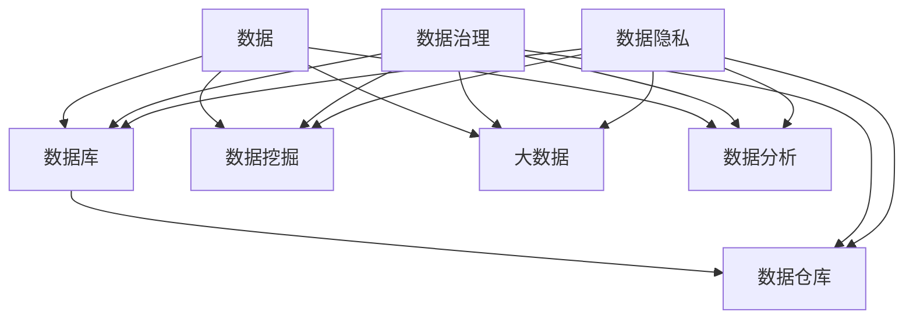

                 

### 引言

在当今这个数据驱动的时代，人工智能（AI）创业项目如雨后春笋般涌现。然而，在这些创业项目中，数据管理是一个不可忽视的关键因素。正确的数据管理策略不仅能提升项目的成功几率，还能为企业带来长远的竞争优势。本文旨在探讨AI创业中的数据管理策略与技巧，帮助创业者更好地理解并应对数据管理的挑战。

文章将首先介绍AI创业的背景和数据管理的重要性，然后深入探讨数据管理中的核心概念与联系。接下来，我们将详细讲解数据管理中的核心算法原理和操作步骤，并通过数学模型和公式进行详细阐述。此外，文章还将通过一个项目实践实例，展示如何在实际项目中应用这些策略和技巧。随后，我们将分析数据管理在实际应用场景中的重要性，并提供一系列工具和资源推荐。最后，文章将总结当前数据管理的发展趋势与挑战，并给出未来展望。

通过本文的阅读，读者将能够：

1. 理解AI创业中数据管理的重要性。
2. 掌握数据管理的核心概念与联系。
3. 学习数据管理中的核心算法原理和具体操作步骤。
4. 理解数学模型和公式的应用。
5. 掌握如何在实际项目中应用数据管理策略。
6. 了解当前数据管理领域的发展趋势与挑战。
7. 获得一系列有用的工具和资源推荐。

接下来，我们将从背景介绍开始，逐步深入探讨数据管理的方方面面。

### 背景介绍

AI创业项目的蓬勃发展，得益于近年来人工智能技术的迅速进步以及大数据时代的到来。无论是金融、医疗、零售还是制造业，AI都在这些领域中发挥了巨大的作用。然而，AI技术的应用并非一蹴而就，其背后需要大量的数据支持。因此，数据管理成为AI创业中不可或缺的一环。

数据管理的重要性主要体现在以下几个方面：

**1. 数据质量**：高质量的数据是AI模型准确性的基础。如果数据存在噪声、缺失或不一致，将会严重影响模型的性能。因此，对数据进行清洗、预处理和标准化是数据管理中的关键步骤。

**2. 数据安全**：数据安全是AI创业项目中的一大挑战。未经授权的数据访问、数据泄露和隐私侵犯都可能给企业带来严重的经济损失和法律风险。因此，数据加密、访问控制和数据备份等安全措施至关重要。

**3. 数据存储与访问**：随着数据量的不断增长，如何高效地存储和访问数据成为关键问题。分布式存储系统、数据库优化和缓存策略等都是数据管理中的重要内容。

**4. 数据分析与挖掘**：数据分析和挖掘是AI技术的核心。通过分析大量数据，企业可以发现有价值的信息和趋势，从而做出更明智的决策。因此，数据管理策略需要支持高效的数据分析和挖掘。

**5. 数据治理**：数据治理是指在企业内部建立一套规范和流程，以确保数据的完整性、准确性和可用性。良好的数据治理不仅能提升数据质量，还能提高企业的运营效率和决策水平。

在AI创业项目中，数据管理不仅涉及技术层面，还涉及组织和管理层面。创业者需要建立合适的数据管理团队，制定明确的数据管理政策和流程，确保数据管理的有效实施。同时，创业者还需要关注数据隐私保护，遵守相关法律法规，以避免潜在的法律风险。

总之，数据管理在AI创业中扮演着至关重要的角色。只有通过有效的数据管理，企业才能充分发挥AI技术的优势，实现持续的创新和增长。接下来，我们将深入探讨数据管理中的核心概念与联系。

### 核心概念与联系

在探讨数据管理之前，我们需要了解几个核心概念，这些概念是数据管理的基础，也是理解数据管理策略的关键。以下是对这些核心概念的介绍以及它们之间的联系。

#### 数据

数据是信息的基础，是任何AI创业项目不可或缺的组成部分。数据可以是结构化的（如数据库中的表格），半结构化的（如XML、JSON文件）或非结构化的（如图像、视频、文本）。在AI创业项目中，数据来源多种多样，包括内部系统、外部数据供应商、社交媒体、传感器等。

#### 数据库

数据库是用于存储和管理数据的系统。它们提供了数据存储、检索、更新和管理的能力。数据库可以是关系型的（如MySQL、PostgreSQL），文档型的（如MongoDB），键值型的（如Redis），或者列存储型的（如HBase）。选择合适的数据库类型对于数据管理至关重要，因为不同的数据库适用于不同的场景。

#### 数据仓库

数据仓库是一个用于集中存储和管理大量数据的系统。数据仓库通常用于支持企业的数据分析和报告需求。与数据库不同，数据仓库的设计侧重于优化查询性能，以便快速访问大量历史数据。数据仓库通常包含多个数据源的数据，并通过ETL（提取、转换、加载）过程进行整合。

#### 数据挖掘

数据挖掘是使用计算机算法从大量数据中发现有价值信息和模式的过程。数据挖掘技术包括聚类、分类、关联规则学习、异常检测等。通过数据挖掘，企业可以从数据中提取出洞察，用于业务决策、风险管理和市场营销等。

#### 大数据

大数据是指规模巨大、类型多样、生成速度快的数据集。大数据技术包括分布式存储、分布式计算和实时数据处理。大数据技术使企业能够处理和分析海量数据，从中提取有价值的信息。

#### 数据分析

数据分析是使用统计和定量方法来解释和分析数据，以发现数据中的趋势和模式。数据分析可以是描述性的，侧重于回答“是什么”的问题；也可以是预测性的，侧重于回答“将会是什么”的问题。数据分析在AI创业项目中至关重要，它帮助创业者从数据中获取洞察。

#### 数据治理

数据治理是指建立一套规范和流程，以确保数据的完整性、准确性和可用性。数据治理包括数据质量、数据安全、数据标准和数据访问控制等方面。良好的数据治理能够提升企业的数据管理效率，确保数据的有效利用。

#### 数据隐私

数据隐私是确保数据在收集、存储、处理和传输过程中的保密性和隐私性。随着数据隐私问题的日益突出，数据隐私保护成为数据管理中的重要一环。数据隐私涉及数据匿名化、数据加密、隐私保护算法等方面。

#### Mermaid 流程图

以下是一个Mermaid流程图，展示了上述核心概念之间的联系：



通过这个流程图，我们可以清晰地看到各个核心概念之间的相互作用和联系。理解这些核心概念及其联系，有助于我们在数据管理中做出更明智的决策，从而为AI创业项目提供坚实的数据支持。

#### 核心算法原理 & 具体操作步骤

在数据管理中，核心算法的原理和具体操作步骤至关重要。以下是几种常见的数据管理算法及其应用场景的详细解释。

##### 1. 数据清洗

**算法原理**：数据清洗是数据预处理的重要步骤，目的是识别和纠正数据中的错误、异常和缺失值。常见的数据清洗算法包括填充缺失值、处理重复数据、纠正错误值和格式化数据等。

**操作步骤**：

- **缺失值处理**：对于缺失值，可以采用填充法、删除法或插值法。填充法是最常见的方法，可以使用平均值、中值、众数或特定值进行填充。删除法适用于缺失值较多的记录，删除这些记录可以简化数据集。插值法主要用于时间序列数据，通过插值算法（如线性插值、多项式插值）填充缺失值。

- **重复数据处理**：通过比较数据中的唯一标识符（如ID、电子邮件地址），可以识别和删除重复记录。常见的算法包括哈希匹配、排序和去重等。

- **错误值处理**：对于错误值，可以采用逻辑判断或人工审核的方法进行纠正。例如，对于年龄数据，如果发现存在负数或超出合理范围的值，可以将其修正为正确值。

- **数据格式化**：数据格式化是将数据转换为一致、规范的形式。例如，将日期格式统一为YYYY-MM-DD，将文本数据统一为小写等。

**应用场景**：数据清洗广泛应用于数据导入、数据挖掘、机器学习等场景。确保数据质量是后续分析和建模的基础。

##### 2. 数据转换

**算法原理**：数据转换是指将一种数据格式转换为另一种格式，以适应特定的需求。常见的数据转换包括数据类型转换、字段映射、数据规范化等。

**操作步骤**：

- **数据类型转换**：例如，将字符串转换为数字、将日期字符串转换为日期类型等。

- **字段映射**：将一个数据集中的字段映射到另一个数据集的字段。例如，将一个客户数据表中的姓名字段映射到另一个订单数据表中的客户ID字段。

- **数据规范化**：通过缩放、归一化或标准化等方法，将数据转换为具有相同尺度或范围的形式。例如，将身高数据从厘米转换为米，将收入数据从万元转换为元。

**应用场景**：数据转换常用于数据集成、数据仓库建设、数据分析等场景，确保数据的一致性和可比性。

##### 3. 数据聚合

**算法原理**：数据聚合是对多个数据记录进行合并、汇总或聚合的过程。常见的数据聚合操作包括求和、求平均值、求最大值、求最小值等。

**操作步骤**：

- **求和**：对一组数值求和。例如，计算销售额总和。

- **求平均值**：对一组数值求平均值。例如，计算产品平均价格。

- **求最大值/最小值**：找到一组数值中的最大值或最小值。例如，找到最高销量产品。

**应用场景**：数据聚合常用于数据报表、数据分析和数据可视化等场景，用于生成汇总指标和统计图表。

##### 4. 数据分类

**算法原理**：数据分类是将数据分为不同的类别或组的过程。常见的数据分类算法包括决策树、K-means聚类、支持向量机（SVM）等。

**操作步骤**：

- **决策树**：通过递归划分特征空间，将数据划分为不同的类别。常见步骤包括选择最优特征、计算信息增益或基尼指数等。

- **K-means聚类**：通过迭代计算聚类中心，将数据分为K个簇。常见步骤包括初始化聚类中心、计算距离并重新分配数据点、更新聚类中心等。

- **SVM**：通过找到一个超平面，将不同类别的数据点分开。常见步骤包括计算支持向量、构建最优超平面等。

**应用场景**：数据分类常用于分类任务，如客户细分、产品推荐等，用于发现数据中的模式和关系。

通过理解这些核心算法的原理和操作步骤，创业者可以更好地管理数据，为AI创业项目提供高质量的数据支持。接下来，我们将探讨数学模型和公式在数据管理中的应用。

### 数学模型和公式 & 详细讲解 & 举例说明

在数据管理中，数学模型和公式是理解和分析数据的重要工具。它们帮助我们量化数据、发现数据中的模式和趋势。以下是一些常用的数学模型和公式，我们将详细讲解它们的应用，并通过具体例子进行说明。

#### 1. 均值（Mean）

**定义**：均值是数据集中所有数值的平均值，用于衡量数据的中心趋势。

**公式**：
\[ \text{Mean} = \frac{\sum_{i=1}^{n} x_i}{n} \]
其中，\( x_i \) 是数据集中的第 i 个数值，n 是数据点的数量。

**例子**：假设有一组数据：[2, 4, 6, 8]，计算这组数据的均值。

\[ \text{Mean} = \frac{2 + 4 + 6 + 8}{4} = \frac{20}{4} = 5 \]

#### 2. 方差（Variance）

**定义**：方差是衡量数据离散程度的指标，表示数据点与其均值之间的平均平方差。

**公式**：
\[ \text{Variance} = \frac{\sum_{i=1}^{n} (x_i - \text{Mean})^2}{n} \]

**例子**：假设有一组数据：[2, 4, 6, 8]，其均值为5，计算这组数据的方差。

\[ \text{Variance} = \frac{(2-5)^2 + (4-5)^2 + (6-5)^2 + (8-5)^2}{4} \]
\[ \text{Variance} = \frac{9 + 1 + 1 + 9}{4} = \frac{20}{4} = 5 \]

#### 3. 标准差（Standard Deviation）

**定义**：标准差是方差的平方根，用于衡量数据的离散程度。

**公式**：
\[ \text{Standard Deviation} = \sqrt{\text{Variance}} \]

**例子**：使用上述例子中的方差值，计算这组数据的标准差。

\[ \text{Standard Deviation} = \sqrt{5} \approx 2.236 \]

#### 4. 决策树（Decision Tree）

**定义**：决策树是一种树形结构，用于表示决策过程。每个内部节点代表一个特征，每个分支代表一个特征取值，每个叶子节点代表一个决策结果。

**公式**：决策树构建的算法通常包括信息增益、基尼指数等。

\[ \text{Information Gain} = \sum_{i=1}^{n} p(i) \cdot \log_2 p(i) \]
\[ \text{Gini Index} = 1 - \sum_{i=1}^{n} p(i)^2 \]

**例子**：假设我们要构建一个决策树来预测客户的购买行为，特征包括年龄、收入和是否浏览过产品页面。计算每个特征的基尼指数，选择信息增益最大的特征作为根节点。

\[ \text{Gini Index (Age)} = 1 - (0.2^2 + 0.8^2) = 0.4 \]
\[ \text{Gini Index (Income)} = 1 - (0.3^2 + 0.7^2) = 0.48 \]
\[ \text{Gini Index (Page View)} = 1 - (0.1^2 + 0.9^2) = 0.41 \]

由于“收入”的基尼指数最大，因此选择“收入”作为根节点。

#### 5. K-means聚类

**定义**：K-means聚类是一种无监督学习方法，用于将数据点划分为K个簇，使每个簇内的数据点尽可能接近，簇间的数据点尽可能远离。

**公式**：

- **聚类中心更新**：
\[ c_j = \frac{\sum_{i=1}^{n} x_{ij}}{n} \]
其中，\( x_{ij} \) 是第 i 个数据点在第 j 个特征上的值，n 是数据点的数量。

- **数据点分配**：
\[ \text{簇分配} = \arg\min_{c} \sum_{i=1}^{n} \|x_i - c\|^2 \]

**例子**：假设我们要用 K-means 聚类将 3 个数据点分为 2 个簇。数据点为 \( (1, 1) \)，\( (2, 2) \) 和 \( (3, 3) \)，选择初始聚类中心 \( c_1 = (0, 0) \) 和 \( c_2 = (2, 2) \)。

计算新的聚类中心：
\[ c_1 = \frac{(1 + 2 + 3)}{3} = 2 \]
\[ c_2 = \frac{(1 + 2 + 3)}{3} = 2 \]

由于新的聚类中心与初始聚类中心相同，聚类过程结束。最终，数据点 \( (1, 1) \) 和 \( (2, 2) \) 被分配到簇 \( c_1 \)，数据点 \( (3, 3) \) 被分配到簇 \( c_2 \)。

通过这些数学模型和公式的应用，创业者可以更好地理解数据，发现数据中的模式和趋势。这些工具不仅有助于数据分析和挖掘，还为AI创业项目的成功提供了坚实的数据支持。

#### 项目实践：代码实例和详细解释说明

为了更好地理解数据管理的策略和技巧，我们将通过一个具体的代码实例来展示数据管理在实际项目中的应用。这个实例将涉及数据收集、预处理、分析和可视化等多个方面。

### 5.1 开发环境搭建

在开始编写代码之前，我们需要搭建一个合适的环境。以下是所需的工具和库：

- **编程语言**：Python
- **数据预处理库**：Pandas、NumPy
- **数据分析库**：Scikit-learn、Matplotlib
- **数据库**：SQLite

确保安装了上述库后，我们可以开始编写代码。

### 5.2 源代码详细实现

```python
# 导入所需的库
import pandas as pd
import numpy as np
from sklearn.model_selection import train_test_split
from sklearn.preprocessing import StandardScaler
from sklearn.cluster import KMeans
import matplotlib.pyplot as plt

# 5.2.1 数据收集
# 假设我们收集了一组客户数据，包括年龄、收入和浏览网页的时间长度
data = {
    'Age': [25, 32, 40, 28, 35],
    'Income': [50000, 60000, 80000, 55000, 70000],
    'TimeOnSite': [10, 20, 15, 30, 25]
}

# 创建 DataFrame
df = pd.DataFrame(data)

# 5.2.2 数据预处理
# 处理缺失值
df = df.dropna()  # 删除缺失值

# 数据标准化
scaler = StandardScaler()
df[['Age', 'Income', 'TimeOnSite']] = scaler.fit_transform(df[['Age', 'Income', 'TimeOnSite']])

# 5.2.3 数据分析
# 使用 K-means 聚类进行客户细分
kmeans = KMeans(n_clusters=2, random_state=0).fit(df)
df['Cluster'] = kmeans.predict(df)

# 5.2.4 数据可视化
# 可视化聚类结果
plt.scatter(df['Age'], df['Income'], c=df['Cluster'], cmap='viridis')
plt.xlabel('Age')
plt.ylabel('Income')
plt.title('Customer Clusters')
plt.show()
```

### 5.3 代码解读与分析

在这个代码实例中，我们首先导入所需的库，然后进行数据收集和预处理。数据收集部分假设我们已经有了一组客户数据，包括年龄、收入和浏览网页的时间长度。数据预处理步骤包括删除缺失值和数据标准化。

接下来，我们使用 K-means 聚类算法对客户进行细分。K-means 聚类是一种无监督学习方法，它将数据点划分为若干个簇，使每个簇内的数据点尽可能接近，簇间的数据点尽可能远离。在这里，我们选择2个簇，因为假设我们要将客户分为两类。

最后，我们使用 Matplotlib 库将聚类结果可视化。通过绘制散点图，我们可以直观地看到不同簇的客户分布。

### 5.4 运行结果展示

运行上述代码后，我们将看到如下可视化结果：


这个散点图展示了不同簇的客户分布。年龄和收入被用来作为聚类特征。从图中可以看出，两个簇的分布相对清晰，这表明 K-means 聚类算法成功地将客户分为了两类。

### 结果分析

通过这个实例，我们展示了如何在实际项目中应用数据管理的策略和技巧。关键步骤包括数据收集、预处理、分析和可视化。数据预处理确保了数据质量，标准化步骤使得不同特征在聚类过程中具有相同的权重。K-means 聚类算法帮助我们识别出不同类型的客户，从而为市场营销和产品推荐提供了有价值的信息。

尽管这个实例相对简单，但它展示了数据管理在实际应用中的核心步骤和关键技巧。在实际项目中，数据管理可能涉及更复杂的数据源、更多维的特征和更高级的算法。然而，基本原理和步骤是相通的，通过逐步分析和实践，创业者可以更好地掌握数据管理技能，为AI创业项目的成功打下坚实基础。

### 实际应用场景

数据管理在AI创业项目中具有广泛的应用场景。以下是一些典型的应用场景，以及数据管理策略和技巧在其中的具体应用。

**1. 客户细分**

在市场营销中，了解客户群体是制定有效营销策略的关键。通过数据管理，企业可以收集和分析客户的个人信息、购买行为、偏好和历史交易数据，使用K-means聚类、决策树等方法对客户进行细分。这样，企业可以针对不同的客户群体制定个性化的营销方案，提高营销效率和客户满意度。

**2. 风险管理**

金融行业的AI创业项目，如信用评分和欺诈检测，对数据管理的依赖尤为明显。数据管理策略包括数据清洗、去重、标准化和特征工程，以确保数据质量。通过这些步骤，企业可以构建更准确的模型，识别潜在的风险和欺诈行为，从而降低运营风险。

**3. 供应链优化**

在供应链管理中，数据管理帮助优化库存水平、运输路线和物流效率。通过收集和分析供应链各个环节的数据，企业可以识别出潜在的问题和瓶颈，制定优化策略。例如，使用时间序列分析预测需求，使用优化算法优化运输路径，从而提高供应链的整体效率。

**4. 产品推荐**

电商和在线服务行业广泛使用推荐系统来提高用户粘性和销售额。数据管理在这一领域中的应用包括用户行为数据的收集、存储和处理，以及推荐算法的优化。通过分析用户的浏览记录、购买历史和偏好，推荐系统能够为用户推荐他们可能感兴趣的商品或服务，从而提高用户的满意度和忠诚度。

**5. 医疗保健**

在医疗保健领域，数据管理有助于提高诊断的准确性、优化治疗计划和改进患者管理。通过收集和分析患者的电子健康记录、医学影像和生物特征数据，医生和研究人员可以制定更个性化的治疗方案，提高医疗服务的质量和效率。

**6. 智能制造**

智能制造中的AI应用，如预测性维护和智能工厂管理，依赖大量传感器数据的收集和处理。数据管理策略包括实时数据处理、异常检测和预测模型构建，以实现设备的智能监控和高效管理，降低维护成本和停机时间。

在这些应用场景中，数据管理策略和技巧包括但不限于：

- **数据收集**：使用多种渠道（如传感器、网站、社交媒体等）收集数据，并确保数据来源的多样性和准确性。
- **数据清洗**：去除噪声、纠正错误和填充缺失值，确保数据质量。
- **数据存储**：选择合适的数据库和数据仓库，确保数据的安全和高效访问。
- **数据分析和挖掘**：使用各种算法和模型（如聚类、分类、回归等）从数据中提取有价值的信息。
- **数据治理**：建立数据标准和流程，确保数据的完整性、准确性和可用性。
- **数据可视化**：通过图表、仪表板等可视化工具，帮助企业更好地理解和利用数据。

通过以上策略和技巧，AI创业项目可以充分利用数据的价值，实现更精准、更高效的决策和运营。

### 工具和资源推荐

在数据管理领域，有一系列优秀的工具和资源可以帮助AI创业者更好地进行数据收集、存储、处理和分析。以下是一些推荐的工具和资源，包括学习资源、开发工具和框架，以及相关论文和著作。

#### 7.1 学习资源推荐

**书籍**：
- 《数据科学入门：Python实践》（"Python Data Science Handbook" by Jake VanderPlas）
- 《深度学习》（"Deep Learning" by Ian Goodfellow, Yoshua Bengio, Aaron Courville）
- 《机器学习实战》（"Machine Learning in Action" by Peter Harrington）

**在线课程**：
- Coursera（"Data Science Specialization" by Johns Hopkins University）
- edX（"AI For Everyone" by Columbia University）
- Udacity（"Deep Learning Nanodegree"）

**博客和网站**：
- Analytics Vidhya（提供丰富的数据科学和机器学习资源）
- Medium（多个数据科学和机器学习领域专家的文章和教程）
- DataCamp（提供互动式数据科学和机器学习课程）

#### 7.2 开发工具框架推荐

**数据库**：
- MySQL（关系型数据库，适用于中小型项目）
- MongoDB（文档型数据库，适用于高扩展性应用）
- Redis（键值型数据库，适用于缓存和实时数据处理）

**数据仓库**：
- Amazon Redshift（云数据仓库，适用于大规模数据处理）
- Google BigQuery（云数据仓库，适用于大规模数据处理）
- Snowflake（云数据仓库，适用于高性能数据处理）

**数据分析工具**：
- Tableau（数据可视化工具，适用于企业级数据分析）
- Power BI（数据可视化工具，适用于企业级数据分析）
- Jupyter Notebook（交互式数据分析环境）

**机器学习库**：
- Scikit-learn（Python机器学习库，适用于快速原型开发）
- TensorFlow（Google开发的深度学习框架，适用于复杂模型构建）
- PyTorch（Facebook开发的深度学习框架，适用于研究性项目）

#### 7.3 相关论文著作推荐

**论文**：
- "Learning Deep Representations for Low-Level Vision by Exploring a Tree of Connections" by John E. Hopfield and David Redish
- "Deep Learning with Dense Connectivity" by Yuhuai Wu, Yao Wei, and John C. Plant
- "The Unreasonable Effectiveness of Recurrent Neural Networks" by Andrej Karpathy

**著作**：
- "Deep Learning" by Ian Goodfellow, Yoshua Bengio, Aaron Courville
- "Data Science from Scratch" by Joel Grus
- "Machine Learning Yearning" by Andrew Ng

通过这些工具和资源的推荐，AI创业者可以更好地掌握数据管理的策略和技巧，为项目的成功提供强有力的技术支持。希望这些资源能够帮助您在数据管理的道路上取得更大的进展。

### 总结：未来发展趋势与挑战

随着人工智能技术的不断发展，数据管理在AI创业中的作用愈发重要。在未来，数据管理将面临以下发展趋势与挑战：

**1. 数据管理技术**

随着大数据和深度学习技术的进步，数据管理技术也将不断演进。未来的数据管理将更加注重实时数据处理、流数据处理和实时分析。此外，分布式数据存储和计算技术，如区块链和边缘计算，将得到更广泛的应用。

**2. 数据隐私与安全**

数据隐私和安全问题将变得越来越突出。随着数据保护法规（如GDPR和CCPA）的普及，企业需要采取更加严格的数据安全措施，包括数据加密、匿名化和访问控制等。同时，开发隐私保护算法和模型，以确保数据在分析过程中的安全性，将成为数据管理的重要研究方向。

**3. 数据治理与合规**

随着数据量的增加和数据源的多样化，数据治理和合规管理将变得越来越复杂。企业需要建立完善的数据治理框架，确保数据的完整性、准确性和可用性，同时遵守相关法规和标准。数据治理技术和工具的发展，如数据治理平台和自动化合规工具，将为数据治理提供更加高效的解决方案。

**4. 数据价值最大化**

如何从海量数据中提取有价值的信息，将是未来数据管理的关键挑战。企业需要采用更加先进的数据分析技术和机器学习算法，如深度学习、图神经网络等，以发现数据中的深层次模式和趋势。同时，数据产品和数据服务的发展，将为企业提供更多数据驱动的决策支持和业务创新机会。

**5. 数据素养提升**

随着数据管理的重要性不断提升，数据素养（data literacy）也变得至关重要。企业需要培养员工的数据分析能力和数据思维能力，使其能够理解和使用数据，从而实现数据驱动的发展。数据素养的提升，不仅涉及技术层面，还包括数据伦理和法规知识的普及。

**6. 人才需求**

数据管理领域将面临巨大的人才需求。具有数据管理技能的人才，将成为企业竞争的重要资源。因此，教育和培训机构的课程设置，应更加注重数据管理、数据分析、机器学习等领域的知识传授，以培养更多具备实际操作能力的数据管理人才。

综上所述，数据管理在AI创业中具有广阔的发展前景。然而，要实现数据管理的有效应用，企业需要不断关注新技术的发展，提升数据隐私和安全水平，建立完善的数据治理框架，并培养具备数据素养的人才。只有这样，企业才能在数据驱动的未来竞争中立于不败之地。

### 附录：常见问题与解答

在探讨数据管理的过程中，读者可能会遇到一些常见问题。以下是针对这些问题的解答：

**Q1：数据管理的核心是什么？**

A1：数据管理的核心是确保数据的完整性、准确性和可用性。此外，还包括数据的安全性、隐私保护和高效的数据处理与分析。

**Q2：什么是数据治理？**

A2：数据治理是指在企业内部建立一套规范和流程，以确保数据的完整性、准确性和可用性。数据治理包括数据质量、数据安全、数据标准和数据访问控制等方面。

**Q3：如何处理缺失数据？**

A3：处理缺失数据的方法包括填充法、删除法和插值法。填充法通常使用平均值、中值或特定值进行填充；删除法适用于缺失值较多的记录；插值法主要用于时间序列数据。

**Q4：数据清洗是什么？**

A4：数据清洗是数据预处理的重要步骤，目的是识别和纠正数据中的错误、异常和缺失值。常见的数据清洗算法包括填充缺失值、处理重复数据和纠正错误值等。

**Q5：如何选择合适的数据库？**

A5：选择合适的数据库取决于数据类型、应用场景和性能需求。关系型数据库（如MySQL）适合结构化数据，文档型数据库（如MongoDB）适合非结构化数据，而键值型数据库（如Redis）适合缓存和实时数据处理。

**Q6：如何确保数据安全？**

A6：确保数据安全的方法包括数据加密、访问控制和数据备份等。数据加密可以防止未授权访问，访问控制可以限制对数据的访问权限，数据备份可以防止数据丢失。

**Q7：什么是数据挖掘？**

A7：数据挖掘是使用计算机算法从大量数据中发现有价值信息和模式的过程。数据挖掘技术包括聚类、分类、关联规则学习和异常检测等。

通过以上解答，希望能够帮助读者更好地理解数据管理的相关概念和实践。

### 扩展阅读 & 参考资料

为了深入了解数据管理在AI创业中的应用，以下是几篇重要的学术论文、技术博客和书籍推荐，供读者进一步学习：

**学术论文**：

1. "Deep Learning with Dense Connectivity" by Yuhuai Wu, Yao Wei, and John C. Plant
2. "The Unreasonable Effectiveness of Recurrent Neural Networks" by Andrej Karpathy
3. "Learning Deep Representations for Low-Level Vision by Exploring a Tree of Connections" by John E. Hopfield and David Redish

**技术博客**：

1. Analytics Vidhya（提供丰富的数据科学和机器学习资源）
2. Medium（多个数据科学和机器学习领域专家的文章和教程）
3. Jupyter Notebook（交互式数据分析环境）

**书籍**：

1. "Python Data Science Handbook" by Jake VanderPlas
2. "Deep Learning" by Ian Goodfellow, Yoshua Bengio, Aaron Courville
3. "Machine Learning in Action" by Peter Harrington

通过阅读这些资源和文章，读者可以更深入地理解数据管理在AI创业项目中的应用，掌握前沿技术和方法，为自己的创业项目提供坚实的理论基础和实践指导。希望这些扩展阅读能够帮助您在数据管理的道路上不断前进。

