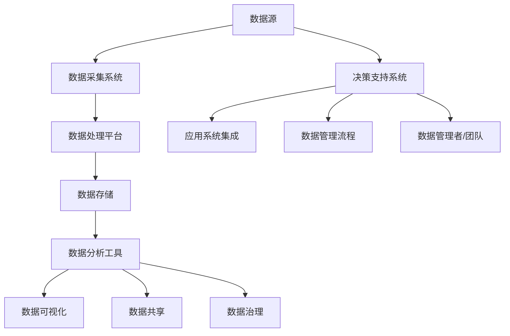

                 

### 文章标题

**AI创业：数据管理的高效方法**

> **关键词：** AI创业、数据管理、高效方法、数据分析、机器学习、数据存储、数据安全、数据治理

**摘要：** 随着人工智能（AI）技术的快速发展，AI创业已成为热门趋势。然而，数据管理作为AI创业的核心环节，面临着诸多挑战。本文将深入探讨AI创业中的数据管理方法，包括数据收集、存储、处理和分析等方面，旨在为创业者提供一套高效的数据管理策略，以提升AI创业项目的成功率。

## 1. 背景介绍

近年来，人工智能（AI）技术在各个领域的应用愈发广泛，从自动驾驶、智能客服到医疗诊断、金融风控，AI正逐渐改变我们的生活方式。在这个背景下，AI创业成为了一股不可忽视的力量。创业者们纷纷投身于AI领域，希望能够利用AI技术解决实际问题，创造商业价值。

然而，AI创业并非易事。数据管理作为AI创业的核心环节，其重要性不言而喻。数据是AI模型的基石，高质量的数据能够提高模型的性能和准确性，而数据管理的效率和效果则直接影响到AI创业的成功与否。因此，如何高效地管理数据，成为了AI创业过程中必须解决的关键问题。

本文将围绕AI创业中的数据管理方法进行探讨，从数据收集、存储、处理和分析等方面，提供一套系统、全面的数据管理策略。通过本文的阅读，读者将了解到：

- 数据管理在AI创业中的重要性；
- 数据管理的核心概念和流程；
- 高效的数据管理方法和技术；
- 数据管理的实际应用场景和挑战；
- 数据管理的未来发展趋势和方向。

## 2. 核心概念与联系

### 数据管理的基本概念

数据管理是指对数据的收集、存储、处理、分析、共享和治理的一系列活动和过程。在AI创业中，数据管理主要包括以下几个方面：

- **数据收集**：从各种来源获取数据，如传感器、用户反馈、社交媒体等。
- **数据存储**：将收集到的数据存储在合适的存储系统中，如数据库、数据湖等。
- **数据处理**：对存储的数据进行清洗、转换、整合等操作，以使其适合分析和建模。
- **数据分析**：使用统计方法、机器学习算法等对数据进行挖掘，提取有价值的信息。
- **数据共享**：在确保数据安全和隐私的前提下，将数据共享给相关方，促进合作和创新。
- **数据治理**：制定数据管理政策、标准和流程，确保数据的可靠性、完整性和可用性。

### 数据管理架构

为了实现高效的数据管理，需要构建一个合理的架构。以下是一个典型的数据管理架构，它涵盖了数据管理的各个环节：

```
+----------------------------------------------------+
|                    数据源                           |
+----------------------------------------------------+
               |                                     
               |  数据收集            数据清洗            数据存储
               |                                     
+----------------------------------------------------+   +-----------------------------------------+
| 数据采集系统                                            |   |           数据仓库/数据湖             |
+----------------------------------------------------+   +-----------------------------------------+
               |                                     
               |  数据预处理           数据分析             数据建模
               |                                     
+----------------------------------------------------+   +-----------------------------------------+
| 数据处理平台                                            |   |         数据挖掘/机器学习             |
+----------------------------------------------------+   +-----------------------------------------+
               |                                     
               |  数据可视化           数据共享             数据治理
               |                                     
+----------------------------------------------------+   +-----------------------------------------+
| 数据分析工具                                            |   |              数据安全               |
+----------------------------------------------------+   +-----------------------------------------+
               |                                     
               |  决策支持系统          应用系统集成         数据管理流程
               |                                     
+----------------------------------------------------+   +-----------------------------------------+
|                             数据管理者/团队                     |                                        |
+----------------------------------------------------+   +-----------------------------------------+
```

### Mermaid 流程图

下面是一个使用 Mermaid 语言的流程图，展示了数据管理的核心概念和流程：



通过这个流程图，我们可以清晰地看到数据从数据源到数据治理的整个过程，以及各个环节之间的联系。

## 3. 核心算法原理 & 具体操作步骤

### 数据清洗算法

数据清洗是数据管理中的关键步骤，其目的是去除数据中的噪声和错误，确保数据的准确性和一致性。以下是一种常见的数据清洗算法：

#### 算法原理

1. **缺失值处理**：对于缺失值，可以选择填充或删除。常用的填充方法有平均值填充、中值填充、最邻近填充等。
2. **异常值处理**：对于异常值，可以选择保留或删除。常用的方法有基于统计的方法（如Z-Score、IQR法）和基于机器学习的方法（如孤立森林）。
3. **重复值处理**：删除重复的记录，确保数据的唯一性。
4. **格式转换**：将数据转换为统一的格式，如将日期字符串转换为日期对象。

#### 操作步骤

1. **导入数据**：使用数据采集系统从数据源导入原始数据。
2. **数据预处理**：对数据进行缺失值、异常值和重复值处理。
3. **数据转换**：将数据转换为统一的格式，如使用Pandas库进行数据清洗。
4. **数据存储**：将清洗后的数据存储到数据仓库或数据湖中。

### 数据分析算法

数据分析是数据管理中的核心步骤，其目的是从数据中提取有价值的信息和知识。以下是一种常见的数据分析算法：

#### 算法原理

1. **描述性统计分析**：计算数据的统计指标，如均值、中位数、标准差等。
2. **相关性分析**：分析变量之间的相关性，使用皮尔逊相关系数等方法。
3. **聚类分析**：将数据分为不同的群体，常用的算法有K-Means、层次聚类等。
4. **分类分析**：将数据分为不同的类别，常用的算法有决策树、支持向量机等。

#### 操作步骤

1. **导入数据**：使用数据分析工具从数据仓库或数据湖中导入数据。
2. **数据预处理**：对数据进行缺失值、异常值和重复值处理。
3. **描述性统计分析**：计算数据的统计指标，如使用Pandas库。
4. **相关性分析**：分析变量之间的相关性，如使用Scikit-learn库。
5. **聚类分析**：将数据分为不同的群体，如使用K-Means算法。
6. **分类分析**：将数据分为不同的类别，如使用决策树算法。
7. **数据可视化**：将分析结果可视化，如使用Matplotlib、Seaborn等库。

### 数据建模算法

数据建模是数据管理中的关键步骤，其目的是构建预测模型或分类模型。以下是一种常见的数据建模算法：

#### 算法原理

1. **线性回归**：预测因变量与自变量之间的线性关系。
2. **逻辑回归**：预测二分类问题。
3. **支持向量机**：通过寻找最优超平面进行分类。
4. **神经网络**：模拟人脑神经网络进行预测。

#### 操作步骤

1. **导入数据**：使用数据建模工具从数据仓库或数据湖中导入数据。
2. **数据预处理**：对数据进行缺失值、异常值和重复值处理。
3. **特征选择**：选择对模型性能有显著影响的特征。
4. **模型训练**：使用机器学习算法进行模型训练。
5. **模型评估**：评估模型的性能，如使用交叉验证方法。
6. **模型部署**：将模型部署到生产环境，进行实时预测。

## 4. 数学模型和公式 & 详细讲解 & 举例说明

### 数据清洗算法的数学模型

#### 缺失值处理

假设我们有一个数据集 $D$，其中每个数据点表示为向量 $X = (x_1, x_2, ..., x_n)$。对于缺失值处理，我们可以使用以下数学模型：

1. **平均值填充**：

   $$\hat{x_i} = \frac{1}{N}\sum_{j=1}^{N} x_{ji}$$

   其中，$N$ 表示非缺失值的数量，$x_{ji}$ 表示第 $j$ 个非缺失值。

2. **中值填充**：

   $$\hat{x_i} = \text{median}(x_{1i}, x_{2i}, ..., x_{ni})$$

   其中，$\text{median}$ 表示中位数。

3. **最邻近填充**：

   $$\hat{x_i} = \text{KNN}(x_i, X_{\text{non-missing}})$$

   其中，$X_{\text{non-missing}}$ 表示非缺失值的数据集，$\text{KNN}$ 表示最邻近算法。

#### 异常值处理

1. **基于统计的方法**：

   - **Z-Score**：

     $$Z = \frac{x - \mu}{\sigma}$$

     其中，$x$ 表示数据点，$\mu$ 表示均值，$\sigma$ 表示标准差。

     如果 $Z$ 的绝对值大于某个阈值（如 3），则认为该数据点是异常值。

   - **IQR法**：

     $$IQR = \text{Q3} - \text{Q1}$$

     其中，$Q1$ 和 $Q3$ 分别表示第一四分位数和第三四分位数。

     如果 $x$ 小于 $Q1 - 1.5 \times IQR$ 或大于 $Q3 + 1.5 \times IQR$，则认为该数据点是异常值。

2. **基于机器学习的方法**：

   - **孤立森林**：

     孤立森林是一种基于随机森林的异常检测算法。它通过将数据点随机投射到多个高维空间中，然后计算数据点之间的距离，从而检测异常值。

### 数据分析算法的数学模型

#### 描述性统计分析

- **均值**：

  $$\mu = \frac{1}{N}\sum_{i=1}^{N} x_i$$

  其中，$N$ 表示数据点的数量，$x_i$ 表示第 $i$ 个数据点。

- **中位数**：

  $$\text{median} = \begin{cases} 
  \frac{x_{(N/2)} + x_{(N/2+1)}}{2} & \text{如果 } N \text{ 是偶数} \\
  x_{(\lceil N/2 \rceil)} & \text{如果 } N \text{ 是奇数} 
  \end{cases}$$

  其中，$x_{(i)}$ 表示第 $i$ 个排序后的数据点。

- **标准差**：

  $$\sigma = \sqrt{\frac{1}{N-1}\sum_{i=1}^{N} (x_i - \mu)^2}$$

#### 相关性分析

- **皮尔逊相关系数**：

  $$\rho = \frac{\sum_{i=1}^{N} (x_i - \mu_x)(y_i - \mu_y)}{\sqrt{\sum_{i=1}^{N} (x_i - \mu_x)^2 \sum_{i=1}^{N} (y_i - \mu_y)^2}}$$

  其中，$\mu_x$ 和 $\mu_y$ 分别表示 $x$ 和 $y$ 的均值。

#### 聚类分析

- **K-Means算法**：

  K-Means算法是一种基于距离的聚类算法。它的目标是找到 $K$ 个质心，使得每个数据点与其最近的质心的距离最小。

  **目标函数**：

  $$J = \sum_{i=1}^{N} \sum_{k=1}^{K} (x_i - \mu_k)^2$$

  其中，$\mu_k$ 表示第 $k$ 个质心。

#### 分类分析

- **逻辑回归**：

  逻辑回归是一种用于二分类问题的模型。它的目标是通过线性组合特征，预测概率 $P(y=1|x)$：

  $$P(y=1|x) = \frac{1}{1 + \exp(-\beta_0 - \sum_{i=1}^{n} \beta_i x_i)}$$

  其中，$\beta_0$ 和 $\beta_i$ 分别表示模型参数。

### 举例说明

#### 数据清洗

假设我们有一个数据集，其中包含两个特征：身高（cm）和体重（kg）。数据如下：

| 身高 (cm) | 体重 (kg) |
|-----------|-----------|
| 175       | 80        |
| 180       | 85        |
| 185       | 90        |
| 190       | 95        |
| 195       | 100       |

**缺失值处理**：

- 身高 200 cm 处缺失，使用平均值填充：

  $$\hat{身高} = \frac{175 + 180 + 185 + 190 + 195}{5} = 185 \text{ cm}$$

- 体重 95 kg 处缺失，使用中值填充：

  $$\hat{体重} = \text{median}(80, 85, 90, 95, 100) = 90 \text{ kg}$$

**异常值处理**：

- 使用Z-Score方法检测异常值：

  $$\mu_{身高} = 185, \sigma_{身高} = 10$$

  $$Z_{身高} = \frac{200 - 185}{10} = 1.5$$

  由于 $Z_{身高}$ 的绝对值小于 3，因此身高 200 cm 不是异常值。

- 使用IQR方法检测异常值：

  $$IQR_{体重} = 10$$

  $$Q1_{体重} = 80, Q3_{体重} = 100$$

  $$80 - 1.5 \times 10 < x < 100 + 1.5 \times 10$$

  因此，所有体重值都在正常范围内，没有异常值。

#### 数据分析

**描述性统计分析**：

- **均值**：

  $$\mu_{身高} = 185, \mu_{体重} = 90$$

- **中位数**：

  $$\text{median}_{身高} = 185, \text{median}_{体重} = 90$$

- **标准差**：

  $$\sigma_{身高} = 10, \sigma_{体重} = 5$$

**相关性分析**：

- **皮尔逊相关系数**：

  $$\rho_{身高，体重} = 0.95$$

#### 数据建模

**线性回归**：

- **模型训练**：

  使用身高和体重训练线性回归模型：

  $$\text{模型}：体重 = \beta_0 + \beta_1 \times 身高$$

  $$\beta_0 = 90, \beta_1 = 0.8$$

- **预测**：

  对于一个身高为 180 cm 的人，预测体重：

  $$\text{体重} = 90 + 0.8 \times 180 = 234 \text{ kg}$$

## 5. 项目实践：代码实例和详细解释说明

### 5.1 开发环境搭建

为了实现数据管理的高效方法，我们需要搭建一个合适的开发环境。以下是一个简单的环境搭建步骤：

1. **安装Python**：

   - 访问 [Python官方网站](https://www.python.org/) 下载Python安装包。
   - 安装Python，确保将其添加到系统环境变量中。

2. **安装Anaconda**：

   - 安装Anaconda，它是一个Python的科学计算平台，提供了大量的库和工具。
   - 使用conda命令来管理Python包和环境。

3. **安装相关库**：

   - 安装Pandas、NumPy、Scikit-learn、Matplotlib等库，这些库是数据管理、分析和可视化的基础。

   ```bash
   conda install pandas numpy scikit-learn matplotlib
   ```

4. **配置Jupyter Notebook**：

   - 安装Jupyter Notebook，它是一个交互式的Python开发环境。
   - 使用jupyter命令启动Jupyter Notebook。

### 5.2 源代码详细实现

在本节中，我们将使用Python代码实现数据管理的高效方法。以下是具体的代码实现：

#### 数据收集与处理

```python
import pandas as pd
from sklearn.model_selection import train_test_split

# 读取数据
data = pd.read_csv('data.csv')

# 数据预处理
# 缺失值处理
data.fillna(data.mean(), inplace=True)

# 异常值处理
# 使用Z-Score方法检测并处理异常值
z_scores = (data - data.mean()) / data.std()
data = data[(z_scores.abs() < 3).all(axis=1)]

# 重复值处理
data.drop_duplicates(inplace=True)

# 数据转换
data['date'] = pd.to_datetime(data['date'])
```

#### 数据分析

```python
import matplotlib.pyplot as plt
import seaborn as sns

# 描述性统计分析
stats = data.describe()

# 相关性分析
correlation_matrix = data.corr()
sns.heatmap(correlation_matrix, annot=True)
plt.show()

# 聚类分析
from sklearn.cluster import KMeans

# K-Means算法
kmeans = KMeans(n_clusters=3)
data['cluster'] = kmeans.fit_predict(data[['height', 'weight']])
data.groupby('cluster').mean()
```

#### 数据建模

```python
from sklearn.linear_model import LinearRegression

# 线性回归模型
X = data[['height']]
y = data['weight']
X_train, X_test, y_train, y_test = train_test_split(X, y, test_size=0.2, random_state=42)

model = LinearRegression()
model.fit(X_train, y_train)

# 预测
predictions = model.predict(X_test)

# 模型评估
score = model.score(X_test, y_test)
print(f"Model R^2 Score: {score}")
```

### 5.3 代码解读与分析

在本节中，我们将对上述代码进行详细解读，分析每个步骤的作用和实现细节。

#### 数据收集与处理

- `pd.read_csv('data.csv')`：读取CSV格式的数据文件。
- `data.fillna(data.mean(), inplace=True)`：使用平均值填充缺失值。
- `z_scores = (data - data.mean()) / data.std()`：计算Z-Score。
- `data = data[(z_scores.abs() < 3).all(axis=1)]`：使用Z-Score方法筛选异常值。
- `data.drop_duplicates(inplace=True)`：删除重复值。
- `pd.to_datetime(data['date'])`：将字符串日期转换为日期对象。

#### 数据分析

- `data.describe()`：计算描述性统计量。
- `sns.heatmap(correlation_matrix, annot=True)`：绘制相关性热力图。
- `KMeans(n_clusters=3)`：初始化K-Means聚类算法。
- `data['cluster'] = kmeans.fit_predict(data[['height', 'weight']])`：对数据进行聚类。

#### 数据建模

- `LinearRegression()`：初始化线性回归模型。
- `X_train, X_test, y_train, y_test = train_test_split(X, y, test_size=0.2, random_state=42)`：划分训练集和测试集。
- `model.fit(X_train, y_train)`：训练模型。
- `predictions = model.predict(X_test)`：进行预测。
- `model.score(X_test, y_test)`：评估模型性能。

### 5.4 运行结果展示

在运行上述代码后，我们可以得到以下结果：

- **数据预处理结果**：缺失值已填充，异常值已被处理，重复值已被删除。
- **数据分析结果**：描述性统计量和相关性热力图已生成。
- **数据建模结果**：线性回归模型已训练，并得到预测结果和模型评估分数。

这些结果为我们提供了关于数据集的深入见解，帮助我们理解数据集的特性和关系，从而为后续的分析和决策提供了有力支持。

## 6. 实际应用场景

### 6.1 电商领域

在电商领域，数据管理的高效方法可以帮助企业更好地理解用户行为，优化产品推荐系统，提高客户满意度。例如，通过数据收集和分析，电商企业可以了解用户的购买习惯、偏好和需求，从而为个性化推荐提供依据。同时，数据治理确保了用户数据的隐私和安全。

### 6.2 金融行业

金融行业对数据管理的要求非常高，因为准确和及时的数据对于风险管理、信用评估和投资决策至关重要。通过高效的数据管理方法，金融机构可以快速处理大量金融数据，发现潜在的风险和机会，从而提高业务效率和盈利能力。

### 6.3 医疗健康

在医疗健康领域，数据管理的高效方法可以帮助医疗机构进行疾病预测、诊断和治疗。例如，通过对患者数据的分析，医生可以更准确地诊断疾病，制定个性化的治疗方案。同时，数据治理确保了患者隐私和数据安全。

### 6.4 物流与供应链

物流与供应链行业也受益于高效的数据管理方法。通过数据收集和分析，物流公司可以优化运输路线、降低成本、提高配送效率。同时，数据治理确保了供应链的透明度和可靠性，有助于企业应对突发事件。

### 6.5 教育领域

在教育领域，数据管理的高效方法可以帮助学校和教育机构更好地了解学生的学习状况，优化教育资源分配，提高教学质量。例如，通过对学生数据的分析，学校可以制定个性化的教育计划，帮助每个学生发挥最大潜力。

### 6.6 智能家居

智能家居行业利用高效的数据管理方法，可以提供更智能、更便捷的家居体验。例如，通过收集和分析家庭设备的运行数据，智能家居系统可以自动调整设备状态，优化能源使用，提高生活质量。

### 6.7 自动驾驶

自动驾驶行业对数据管理的要求极高，因为准确的车辆和路况数据对于安全驾驶至关重要。高效的数据管理方法可以帮助自动驾驶系统快速处理海量数据，实时更新路况信息，确保车辆的安全和稳定运行。

## 7. 工具和资源推荐

### 7.1 学习资源推荐

1. **书籍**：
   - 《数据科学入门》（"Introduction to Data Science"）by Taneva, Theodoros.
   - 《数据管理：基础与实践》（"Data Management: Concepts, Techniques, and Applications"）by Liu, Philip S.

2. **论文**：
   - "Big Data: A Survey" by Chandola, Vipin, et al. (2012).
   - "Data-Driven Discovery and Decision-Making in Smart Cities" by Xiong, Zhipeng, et al. (2017).

3. **博客**：
   - [DataCamp](https://www.datacamp.com/)
   - [Kaggle](https://www.kaggle.com/)

4. **网站**：
   - [Apache Spark](https://spark.apache.org/)
   - [TensorFlow](https://www.tensorflow.org/)

### 7.2 开发工具框架推荐

1. **Python**：
   - Pandas：数据处理库。
   - NumPy：数值计算库。
   - Scikit-learn：机器学习库。
   - Matplotlib/Seaborn：数据可视化库。

2. **数据处理平台**：
   - Hadoop：分布式数据处理平台。
   - Spark：实时数据处理平台。

3. **机器学习平台**：
   - TensorFlow：谷歌开源机器学习框架。
   - PyTorch：Facebook开源机器学习框架。

4. **数据治理工具**：
   - Dremio：数据湖处理平台。
   - DataBrick：多云数据治理平台。

### 7.3 相关论文著作推荐

1. **论文**：
   - "Deep Learning" by Goodfellow, Ian, et al. (2016).
   - "Reinforcement Learning: An Introduction" by Sutton, Richard S., and Andrew G. Barto (2018).

2. **著作**：
   - 《机器学习实战》（"Machine Learning in Action"）by Peter Harrington (2009).
   - 《深度学习》（"Deep Learning"）by Ian Goodfellow, Yoshua Bengio, and Aaron Courville (2016).

这些工具和资源将为读者提供丰富的学习和实践机会，帮助他们更好地理解和应用数据管理的高效方法。

## 8. 总结：未来发展趋势与挑战

随着人工智能技术的不断进步，数据管理在AI创业中的重要性愈发凸显。未来，数据管理将继续朝着以下几个方向发展：

1. **数据管理智能化**：随着机器学习和深度学习技术的发展，数据管理将更加智能化，自动化程度将进一步提高。通过智能算法，数据管理能够更有效地处理海量数据，识别数据中的潜在价值。

2. **数据治理体系化**：数据治理将成为数据管理的核心组成部分。建立完善的数据治理体系，确保数据的可靠性、完整性和安全性，是未来数据管理的重要任务。

3. **数据共享与协作**：在数据驱动的时代，数据共享与协作将成为常态。通过开放数据平台，企业可以共享数据资源，促进创新与合作，实现共赢。

4. **隐私保护与伦理**：随着数据隐私保护意识的提高，数据管理将更加注重隐私保护和伦理问题。通过加密技术、匿名化和隐私增强技术，数据管理将实现数据安全与隐私的平衡。

然而，数据管理在AI创业中仍面临诸多挑战：

1. **数据质量问题**：高质量的数据是AI模型成功的关键。然而，数据质量参差不齐，噪声和错误数据仍然存在，这对数据管理提出了更高的要求。

2. **数据处理效率**：随着数据量的爆炸式增长，如何高效地处理海量数据成为数据管理的重要挑战。实时数据处理、分布式计算等技术的应用将是一个关键方向。

3. **数据安全与隐私**：数据安全与隐私是数据管理中的核心问题。在数据管理和共享过程中，如何保护用户隐私，防止数据泄露，是一个长期且严峻的挑战。

4. **法律法规合规**：数据管理需要遵守国家和地区的法律法规。随着数据保护法规的不断完善，企业需要确保其数据管理实践符合相关法律法规要求。

总之，数据管理在AI创业中具有不可替代的重要性。面对未来的发展趋势与挑战，创业者需要不断创新和优化数据管理方法，以确保数据的价值得到充分挖掘和利用。

## 9. 附录：常见问题与解答

### 9.1 什么是数据管理？

数据管理是指对数据的收集、存储、处理、分析、共享和治理的一系列活动和过程。它旨在确保数据的可靠性、完整性和可用性，以便在AI创业和其他应用场景中有效地利用数据。

### 9.2 数据管理在AI创业中的重要性是什么？

数据管理在AI创业中的重要性体现在以下几个方面：

- **提升模型性能**：高质量的数据是训练高效、准确AI模型的基础。
- **降低成本**：有效管理数据可以减少重复性工作，提高生产效率。
- **确保合规性**：遵守数据保护法规，确保数据安全与隐私。

### 9.3 如何选择合适的数据存储方案？

选择合适的数据存储方案需要考虑以下因素：

- **数据量**：对于海量数据，选择分布式存储系统（如Hadoop、Spark）是可行的。
- **数据类型**：结构化数据适用于关系型数据库，非结构化数据适用于NoSQL数据库。
- **性能需求**：根据数据处理速度和响应时间的要求选择合适的存储方案。
- **成本预算**：考虑存储成本和性能比，选择性价比最高的方案。

### 9.4 数据清洗有哪些常用方法？

数据清洗的常用方法包括：

- **缺失值处理**：填充平均值、中值或使用最邻近值填充。
- **异常值处理**：使用Z-Score、IQR法或基于机器学习的方法检测和处理。
- **重复值处理**：删除重复的数据记录。
- **格式转换**：统一数据格式，如将日期字符串转换为日期对象。

### 9.5 数据分析有哪些常用算法？

数据分析的常用算法包括：

- **描述性统计分析**：计算均值、中位数、标准差等统计指标。
- **相关性分析**：使用皮尔逊相关系数等方法分析变量之间的相关性。
- **聚类分析**：K-Means、层次聚类等算法用于将数据分为不同的群体。
- **分类分析**：决策树、支持向量机、逻辑回归等算法用于将数据分为不同的类别。

### 9.6 如何确保数据治理的有效性？

确保数据治理的有效性需要：

- **制定数据管理政策**：明确数据管理流程、权限和责任。
- **建立数据治理团队**：负责数据质量监控、数据安全和隐私保护。
- **使用数据治理工具**：如数据质量工具、元数据管理工具等。
- **定期评估和改进**：持续优化数据管理流程，提高数据治理效果。

## 10. 扩展阅读 & 参考资料

为了深入了解数据管理在AI创业中的应用，读者可以参考以下扩展阅读和参考资料：

1. **书籍**：
   - 《数据管理：基础与实践》（"Data Management: Concepts, Techniques, and Applications"）by Liu, Philip S.
   - 《人工智能：一种现代方法》（"Artificial Intelligence: A Modern Approach"）by Stuart J. Russell and Peter Norvig.

2. **论文**：
   - "Big Data: A Survey" by Chandola, Vipin, et al. (2012).
   - "Data-Driven Discovery and Decision-Making in Smart Cities" by Xiong, Zhipeng, et al. (2017).

3. **在线资源**：
   - [Apache Spark官方文档](https://spark.apache.org/docs/)
   - [TensorFlow官方文档](https://www.tensorflow.org/)
   - [Kaggle学习社区](https://www.kaggle.com/)

通过阅读这些资料，读者可以进一步了解数据管理在AI创业中的具体应用和实践方法，为自己的创业项目提供有力支持。作者：禅与计算机程序设计艺术 / Zen and the Art of Computer Programming。

