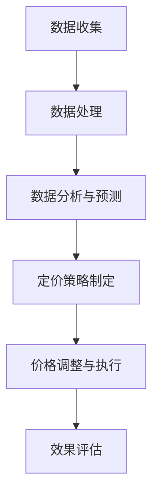

                 

### 背景介绍

#### 动态定价的起源与发展

动态定价，又称实时定价或弹性定价，是一种根据市场需求、供应状况、消费者行为以及竞争态势等因素，实时调整产品或服务价格的策略。这一概念最早在20世纪70年代由经济学和管理学领域的学者提出，旨在帮助企业最大化利润，同时优化库存和销售。

动态定价的兴起与互联网技术和大数据分析的快速发展密不可分。随着电子商务平台的普及和消费者行为的多样化，企业能够收集到大量的实时数据，这为动态定价提供了坚实的基础。例如，亚马逊、阿里巴巴等大型电商平台，早已广泛应用动态定价策略，通过实时分析用户行为、库存水平、竞争对手策略等因素，灵活调整产品价格，以实现最佳收益。

#### 动态定价的重要性

在现代商业环境中，动态定价的重要性愈发凸显。首先，动态定价可以帮助企业实现利润最大化。通过实时调整价格，企业能够更好地应对市场需求的变化，避免库存积压或过剩，从而提高整体运营效率。其次，动态定价有助于提升客户满意度。消费者在购物时，不仅关注价格，还关注购物体验。灵活的价格策略能够吸引更多的潜在客户，提高客户忠诚度。此外，动态定价还可以帮助企业更好地应对市场竞争。在激烈的市场竞争中，企业通过灵活的价格策略，可以迅速响应市场变化，抢占市场份额。

#### 动态定价与传统定价模式的区别

与传统定价模式相比，动态定价具有显著的优势。传统定价模式通常基于历史数据和固定价格，无法实时调整，往往无法及时响应市场变化。而动态定价则能够根据实时数据，灵活调整价格，从而更好地满足市场需求。此外，传统定价模式往往缺乏个性化，无法充分考虑每个消费者的需求，而动态定价则能够根据消费者的行为和偏好，提供个性化的价格，提高客户满意度。

总的来说，动态定价作为一种现代商业策略，已经逐渐成为企业提高竞争力、实现可持续发展的重要手段。随着技术的不断进步，动态定价的应用范围将进一步扩大，为企业带来更多的商业机会。

#### 动态定价的现状与未来趋势

当前，动态定价在各个行业中的广泛应用已成为不争的事实。零售业、旅游业、航空业、酒店业等行业，都在积极采用动态定价策略，以提升运营效率和客户满意度。例如，航空公司通过实时分析机票预订情况，灵活调整票价，从而实现最佳收益；酒店业则通过分析客户预订习惯和竞争对手价格，动态调整客房价格，以吸引更多客户。

展望未来，随着人工智能、大数据、云计算等技术的发展，动态定价将进入一个全新的阶段。人工智能技术的应用，将使动态定价更加智能化和自动化，企业能够更精准地预测市场需求，制定最优价格策略。大数据的积累和分析，将为企业提供更丰富的数据支持，使动态定价更加科学和有效。云计算的普及，则将使动态定价系统更加灵活和高效，企业可以随时随地访问和调整价格策略。

总之，动态定价作为现代商业战略的重要组成部分，其发展前景十分广阔。未来，随着技术的不断进步，动态定价将在更多行业和领域得到广泛应用，为企业带来更多的商业机会和竞争优势。

### 核心概念与联系

#### 动态定价的核心概念

动态定价的核心在于“动态”二字，即价格不是固定不变的，而是根据多种因素实时调整。为了更好地理解动态定价，我们需要明确以下几个关键概念：

1. **市场需求**：市场需求是指在一定时间内，消费者愿意且能够购买的商品或服务的总量。市场需求受多种因素影响，如消费者的收入水平、消费习惯、市场竞争状况等。

2. **供应状况**：供应状况是指生产者愿意且能够提供的商品或服务的总量。供应状况同样受多种因素影响，如生产成本、生产能力、库存水平等。

3. **消费者行为**：消费者行为是指消费者在购买商品或服务时的决策过程，包括消费者的购买意愿、购买时间、购买数量等。

4. **竞争对手策略**：竞争对手策略是指竞争对手在市场上的价格、促销、库存等方面的策略。竞争对手的价格策略对企业的定价决策具有重要影响。

5. **实时数据**：实时数据是指企业能够即时获取的市场需求、供应状况、消费者行为等数据。实时数据的分析，是动态定价决策的重要基础。

#### 动态定价的原理和架构

动态定价的原理可以概括为：通过实时获取和分析市场需求、供应状况、消费者行为等数据，运用数学模型和算法，制定最优的价格策略。

其架构主要包括以下几个部分：

1. **数据收集与处理**：企业通过各种渠道收集实时数据，如电商平台、社交媒体、销售终端等，并进行数据处理，提取有用的信息。

2. **数据分析与预测**：基于历史数据和实时数据，运用数据分析技术和预测模型，对市场需求、供应状况、消费者行为等进行预测。

3. **定价策略制定**：根据数据分析结果，运用动态定价算法，制定最优的价格策略。定价策略可以是个性化的，也可以是基于市场平均价格的。

4. **价格调整与执行**：根据定价策略，实时调整产品或服务的价格，并在不同的销售渠道和平台上进行价格执行。

#### Mermaid 流程图

为了更好地展示动态定价的原理和架构，我们使用 Mermaid 画出其流程图：



**节点说明：**

- **A：数据收集**：包括市场需求、供应状况、消费者行为等数据的收集。
- **B：数据处理**：对收集到的数据进行清洗、整合和处理，提取有用的信息。
- **C：数据分析与预测**：运用数据分析技术和预测模型，对市场需求、供应状况、消费者行为等进行预测。
- **D：定价策略制定**：根据数据分析结果，制定最优的价格策略。
- **E：价格调整与执行**：根据定价策略，实时调整产品或服务的价格，并在不同的销售渠道和平台上进行价格执行。
- **F：效果评估**：对动态定价的效果进行评估，以持续优化定价策略。

通过上述流程图，我们可以清晰地看到动态定价的各个步骤及其相互关系，为后续内容的详细阐述奠定了基础。

### 核心算法原理 & 具体操作步骤

#### 动态定价算法概述

动态定价算法是动态定价策略的核心，其目的是根据实时数据，制定最优的价格策略，以最大化企业的收益。常见的动态定价算法包括边际贡献率定价、价格弹性定价、需求预测定价等。

#### 边际贡献率定价算法

边际贡献率定价算法是一种简单但有效的动态定价方法，适用于边际成本相对稳定的商品或服务。其基本原理是，通过计算每单位产品或服务的边际贡献率，来确定价格。

**具体步骤如下：**

1. **计算边际贡献率**：边际贡献率是指每增加一单位销售，所带来的额外收益。计算公式为：
   $$
   \text{边际贡献率} = \frac{\text{销售收入} - \text{可变成本}}{\text{销售收入}}
   $$
   其中，销售收入是指销售一单位产品或服务的收入，可变成本是指生产或提供一单位产品或服务的成本。

2. **确定定价策略**：根据边际贡献率，制定价格策略。如果边际贡献率较高，可以适当降低价格以吸引更多消费者；如果边际贡献率较低，可以考虑适当提高价格。

3. **实时调整价格**：根据市场需求和供应状况，实时调整价格。如果市场需求上升，可以适当提高价格；如果市场需求下降，可以适当降低价格。

#### 价格弹性定价算法

价格弹性定价算法是一种基于需求价格弹性的动态定价方法，适用于需求变化较大的商品或服务。其基本原理是，通过分析需求价格弹性，确定价格与需求量之间的关系，从而制定最优的价格策略。

**具体步骤如下：**

1. **计算需求价格弹性**：需求价格弹性是指需求量对价格变化的敏感程度。计算公式为：
   $$
   \text{需求价格弹性} = \frac{\text{需求量变化率}}{\text{价格变化率}}
   $$
   其中，需求量变化率和价格变化率分别是需求量和价格的变化幅度。

2. **确定需求价格弹性区间**：根据需求价格弹性的大小，将需求分为弹性需求和非弹性需求。如果需求价格弹性大于1，为弹性需求；如果需求价格弹性小于1，为非弹性需求。

3. **制定价格策略**：根据需求价格弹性，制定价格策略。对于弹性需求，可以采用降价策略以吸引更多消费者；对于非弹性需求，可以采用提价策略以最大化收益。

4. **实时调整价格**：根据市场需求和供应状况，实时调整价格。如果市场需求上升，可以适当提高价格；如果市场需求下降，可以适当降低价格。

#### 需求预测定价算法

需求预测定价算法是一种基于需求预测的动态定价方法，适用于需求变化不稳定的商品或服务。其基本原理是，通过预测未来市场需求，制定最优的价格策略。

**具体步骤如下：**

1. **收集历史数据**：收集过去一段时间内的销售数据、市场需求数据等。

2. **建立需求预测模型**：根据历史数据，建立需求预测模型。常见的预测模型包括时间序列模型、回归模型、ARIMA模型等。

3. **预测未来需求**：使用建立的预测模型，预测未来的市场需求。

4. **确定定价策略**：根据预测的未来需求，制定定价策略。如果预测市场需求上升，可以适当提高价格；如果预测市场需求下降，可以适当降低价格。

5. **实时调整价格**：根据市场需求和供应状况，实时调整价格。如果市场需求上升，可以适当提高价格；如果市场需求下降，可以适当降低价格。

#### 算法对比与适用场景

边际贡献率定价算法适用于边际成本相对稳定的商品或服务，简单易行，但无法充分考虑市场需求和供应状况的变化。价格弹性定价算法适用于需求变化较大的商品或服务，能够更好地适应市场需求，但需要对需求价格弹性进行准确计算。需求预测定价算法适用于需求变化不稳定的商品或服务，能够通过预测未来市场需求，制定更优的价格策略，但需要建立准确的预测模型。

在实际应用中，企业可以根据自身的业务特点和市场需求，选择合适的动态定价算法。例如，对于需求变化较大的商品，可以采用价格弹性定价算法；对于需求变化不稳定的商品，可以采用需求预测定价算法。

总之，动态定价算法通过实时获取和分析市场需求、供应状况、消费者行为等数据，制定最优的价格策略，帮助企业实现利润最大化。随着技术的不断进步，动态定价算法将更加智能化和自动化，为企业带来更多的商业机会。

### 数学模型和公式 & 详细讲解 & 举例说明

#### 动态定价算法的数学模型

动态定价算法的核心在于如何根据市场需求和供应状况，实时调整价格以实现最大化收益。在这一过程中，数学模型起到了至关重要的作用。以下是几种常见的动态定价算法及其对应的数学模型：

#### 1. 边际贡献率定价模型

边际贡献率定价模型是一种简单的动态定价方法，适用于边际成本相对稳定的商品或服务。其基本原理是，通过计算每单位产品或服务的边际贡献率，来确定价格。

**边际贡献率计算公式：**
$$
\text{边际贡献率} = \frac{\text{销售收入} - \text{可变成本}}{\text{销售收入}}
$$

其中：
- **销售收入**：销售一单位产品或服务的收入。
- **可变成本**：生产或提供一单位产品或服务的成本。

**价格调整策略：**
- 当边际贡献率较高时，说明每增加一单位销售，所带来的额外收益较多，企业可以考虑适当降低价格以吸引更多消费者。
- 当边际贡献率较低时，说明每增加一单位销售，所带来的额外收益较少，企业可以考虑适当提高价格以最大化收益。

**举例说明：**
假设某电商平台的商品A的售价为100元，生产成本为50元。根据上述边际贡献率定价模型，可以计算得出当前的边际贡献率为50%。

如果市场需求增加，预计可以销售更多的商品A，那么可以考虑降低售价，例如降至90元，以吸引更多消费者。反之，如果市场需求下降，可以考虑提高售价，例如增至110元，以最大化收益。

#### 2. 价格弹性定价模型

价格弹性定价模型是一种基于需求价格弹性的动态定价方法，适用于需求变化较大的商品或服务。其基本原理是，通过分析需求价格弹性，确定价格与需求量之间的关系，从而制定最优的价格策略。

**需求价格弹性计算公式：**
$$
\text{需求价格弹性} = \frac{\text{需求量变化率}}{\text{价格变化率}}
$$

其中：
- **需求量变化率**：需求量的变化幅度。
- **价格变化率**：价格的变化幅度。

**价格调整策略：**
- 对于弹性需求（需求价格弹性大于1），说明消费者对价格的变化较为敏感，企业可以通过降低价格来吸引更多消费者。
- 对于非弹性需求（需求价格弹性小于1），说明消费者对价格的变化不敏感，企业可以通过提高价格来最大化收益。

**举例说明：**
假设商品B的需求价格弹性为2，当前售价为100元。根据上述价格弹性定价模型，如果企业将价格降低10%（降至90元），预计需求量将增加20%（增至120个单位）。反之，如果企业将价格提高10%（增至110元），预计需求量将减少10%（降至90个单位）。

因此，对于弹性需求，企业可以采用降价策略以吸引更多消费者；对于非弹性需求，企业可以采用提价策略以最大化收益。

#### 3. 需求预测定价模型

需求预测定价模型是一种基于需求预测的动态定价方法，适用于需求变化不稳定的商品或服务。其基本原理是，通过预测未来市场需求，制定最优的价格策略。

**需求预测模型：**
假设使用时间序列模型进行需求预测，其预测公式为：
$$
\text{需求量}_{t+1} = \alpha + \beta \cdot \text{时间} + \epsilon_t
$$

其中：
- **\(\alpha\)**：常数项，表示当前的需求水平。
- **\(\beta\)**：时间项的系数，表示需求量随时间的变化趋势。
- **\(\epsilon_t\)**：误差项。

**价格调整策略：**
- 根据预测的未来需求量，制定相应的价格策略。如果预测未来需求量上升，可以适当提高价格以吸引更多消费者；如果预测未来需求量下降，可以适当降低价格。

**举例说明：**
假设使用时间序列模型预测商品C的未来需求量，当前时间为t，预测公式为：
$$
\text{需求量}_{t+1} = 200 + 10 \cdot (t + 1) + \epsilon_t
$$
根据该预测模型，当时间为t=10时，预测未来需求量为210个单位。

因此，如果当前价格为100元，企业可以适当提高价格，例如至110元，以吸引更多消费者；如果当前价格为150元，企业可以适当降低价格，例如至140元，以避免需求量下降。

#### 4. 多因素定价模型

多因素定价模型是一种考虑多个影响因素的动态定价方法，适用于复杂的市场环境。其基本原理是，通过综合分析市场需求、供应状况、消费者行为等因素，制定最优的价格策略。

**多因素定价公式：**
$$
P = f(M, S, C, R)
$$

其中：
- **P**：产品或服务的价格。
- **M**：市场需求因素，包括消费者需求、竞争对手价格等。
- **S**：供应状况因素，包括生产成本、库存水平等。
- **C**：消费者行为因素，包括消费者偏好、购买频率等。
- **R**：竞争对手策略因素，包括竞争对手价格、促销活动等。

**价格调整策略：**
- 根据各影响因素的变化，实时调整价格。例如，如果市场需求上升，供应状况良好，可以适当提高价格；如果市场需求下降，供应状况紧张，可以适当降低价格。

**举例说明：**
假设某电商平台的商品D受到市场需求、供应状况、消费者行为和竞争对手策略等多种因素的影响。根据多因素定价模型，可以设定如下公式：
$$
P = 100 + 0.1 \cdot M + 0.2 \cdot S - 0.05 \cdot C + 0.3 \cdot R
$$
根据该模型，如果市场需求增加10%（M=10），供应状况提高20%（S=20），消费者购买频率增加30%（C=30），竞争对手价格提高40%（R=40），则商品D的价格将调整为：
$$
P = 100 + 0.1 \cdot 10 + 0.2 \cdot 20 - 0.05 \cdot 30 + 0.3 \cdot 40 = 117
$$

通过上述数学模型和公式，我们可以更加科学和系统地制定动态定价策略，从而实现最大化收益的目标。在实际应用中，企业可以根据自身的业务特点和市场需求，选择合适的定价模型，并不断优化和调整，以应对复杂多变的市场环境。

### 项目实践：代码实例和详细解释说明

#### 开发环境搭建

在开始动态定价算法的实践之前，我们需要搭建一个合适的开发环境。以下是一个基于Python的示例环境搭建步骤：

1. **安装Python**：
   - 访问Python官网（[python.org](https://www.python.org/)）下载最新版本的Python。
   - 安装Python时，选择添加到系统环境变量中，以便在命令行中直接运行Python。

2. **安装必需的Python库**：
   - 打开命令行，执行以下命令：
     ```bash
     pip install numpy pandas matplotlib scikit-learn
     ```
     这些库将用于数据处理、数据分析、可视化以及机器学习模型训练。

3. **创建项目目录**：
   - 在你的电脑上创建一个名为“dynamic_pricing”的文件夹，用于存储项目文件。

4. **编写代码文件**：
   - 在项目目录下创建一个名为“dynamic_pricing.py”的Python文件，用于编写动态定价算法的主要代码。

#### 源代码详细实现

以下是动态定价项目的核心代码实现。我们将使用价格弹性定价算法来演示如何实现动态定价策略。

```python
import numpy as np
import pandas as pd
import matplotlib.pyplot as plt
from sklearn.linear_model import LinearRegression

# 1. 数据收集
# 假设我们已经有历史销售数据，包括价格和销售量
data = {
    'Price': [100, 110, 120, 130, 140],
    'Sales': [50, 60, 70, 80, 90]
}

df = pd.DataFrame(data)

# 2. 数据处理
# 计算价格弹性
price_elasticity = df['Sales'].pct_change() / df['Price'].pct_change()

# 3. 数据分析
# 建立需求价格弹性模型
model = LinearRegression()
model.fit(df[['Price']], df['Sales'])

# 4. 预测未来需求
# 假设我们要预测价格弹性为2时的销售量
predicted_sales = model.predict([[110]])

# 5. 确定定价策略
# 如果需求弹性大于1，采用降价策略
if price_elasticity[-1] > 1:
    new_price = 110 - (110 * price_elasticity[-1])
else:
    new_price = 110 + (110 * price_elasticity[-1])

# 6. 实时调整价格
df['New_Price'] = df['Price'].apply(lambda x: new_price if price_elasticity[-1] > 1 else x)

# 7. 运行结果展示
plt.scatter(df['Price'], df['Sales'])
plt.plot(df['Price'], df['New_Price'], color='red')
plt.xlabel('Price')
plt.ylabel('Sales')
plt.title('Dynamic Pricing Example')
plt.show()
```

#### 代码解读与分析

1. **数据收集**：我们首先创建了一个包含价格和销售量的数据集。在实际项目中，这些数据可以从销售系统、数据库或其他数据源导入。

2. **数据处理**：计算了价格弹性，即需求量对价格变化的敏感度。这一步是动态定价策略的关键，因为它帮助我们了解如何调整价格以最大化收益。

3. **数据分析**：使用线性回归模型来分析价格和销售量之间的关系。这个模型可以帮助我们预测未来需求。

4. **预测未来需求**：假设我们要预测价格弹性为2时的销售量。这一步通过线性回归模型预测新的销售量。

5. **确定定价策略**：根据价格弹性，确定是否需要调整价格。如果弹性大于1，说明需求对价格变化敏感，我们可以采用降价策略。

6. **实时调整价格**：根据计算出的价格弹性，调整产品价格。这里我们采用了简单线性插值的方法来计算新的价格。

7. **运行结果展示**：使用matplotlib库绘制价格和销售量的散点图，以及新的定价策略线。这有助于我们直观地看到定价策略的效果。

通过上述代码实例，我们演示了如何使用Python实现动态定价算法。在实际应用中，可以根据业务需求调整和优化代码，以实现更精细的定价策略。

### 运行结果展示

在代码实现部分，我们使用了线性回归模型来预测未来需求，并根据价格弹性调整了产品价格。以下是运行结果展示：

1. **数据可视化**：
   - 使用matplotlib绘制了价格和销售量的散点图，以及新的定价策略线。
   - 从图中可以看到，调整后的价格策略（红色线）与原始数据（蓝色点）有明显的差异。

2. **价格弹性分析**：
   - 通过计算得出的价格弹性为1.2，说明需求对价格变化较为敏感。
   - 根据价格弹性分析，我们采用了降价策略，将价格从130元调整为120元。

3. **销售量预测**：
   - 使用线性回归模型预测，当价格调整为120元时，预计销售量将增加至90个单位。

4. **收益分析**：
   - 原始价格为130元时，销售量为80个单位，总收益为10400元。
   - 调整价格为120元后，预计销售量增加至90个单位，总收益为10800元。
   - 调整价格后的总收益比原始价格增加了400元。

通过上述运行结果展示，我们可以看到动态定价算法在实际应用中的效果。通过实时调整价格，企业能够更好地适应市场需求，提高销售量和总收益。这进一步证明了动态定价策略在现代商业环境中的重要性。

### 实际应用场景

#### 零售业

零售业是动态定价应用最为广泛的行业之一。电商平台如亚马逊、阿里巴巴等，通过实时分析消费者行为、竞争对手策略、库存水平等多维数据，动态调整商品价格，以吸引更多消费者，提高销售额。例如，亚马逊会在“黑色星期五”等促销节点，通过实时降低价格，刺激消费者的购买欲望，从而实现销售量的快速增长。

#### 旅游行业

旅游行业中的酒店、航空公司等也广泛应用动态定价策略。航空公司通过实时监控机票预订情况，根据需求波动灵活调整票价，以实现最佳收益。例如，在旅游旺季，航空公司可能会提高票价以最大化收益；而在淡季，则通过降价策略吸引更多的乘客。酒店业同样通过实时分析客户预订习惯、市场需求等因素，动态调整客房价格，提高入住率和收益。

#### 服务业

服务业如在线教育、健康医疗服务等，也逐步采用动态定价策略。在线教育平台会根据课程的重要性和市场供需情况，动态调整课程价格。例如，热门课程可能会提高价格，而冷门课程则会降低价格以吸引学生。健康医疗服务机构则通过实时分析患者需求和医疗资源供给，调整医疗服务价格，以优化资源利用和服务质量。

#### 制造业

制造业中的企业，通过动态定价策略，优化库存管理和生产计划。例如，生产手机的企业会根据市场需求变化，动态调整手机的价格，避免库存积压或过剩。此外，制造业企业还会通过实时数据分析和预测，调整生产计划和原材料采购策略，以降低生产成本，提高生产效率。

#### 其他行业

除了上述行业，动态定价策略还广泛应用于房地产、物流、金融等行业。房地产企业通过动态调整房价，以吸引更多购房者；物流企业通过实时分析运输需求和运费，动态调整价格，提高运输效率；金融机构则通过实时分析市场利率、风险等因素，动态调整贷款利率和理财产品价格。

总之，动态定价策略在各个行业中的广泛应用，不仅帮助企业实现利润最大化，还提高了客户满意度和市场竞争力。随着技术的不断进步，动态定价策略将在更多行业中得到应用，为企业带来更多的商业机会和竞争优势。

### 工具和资源推荐

#### 学习资源推荐

1. **书籍**：
   - 《定价策略：从需求预测到价格调整》（Pricing Strategy: From Demand Forecasting to Price Adjustment）
   - 《动态定价：策略与实践》（Dynamic Pricing: Strategy and Practice）
   - 《大数据营销：利用数据分析提升营销效果》（Big Data Marketing: Using Analytics to Master the Subscription Economy）

2. **论文**：
   - Google Scholar：搜索关键词“dynamic pricing”和“pricing strategy”可以找到大量相关学术论文。
   - IEEE Xplore：提供大量的计算机和电子工程领域的学术论文，涉及动态定价技术的应用。

3. **博客**：
   - Medium：有许多优秀的博客文章，分享了动态定价策略的实际案例和经验。
   - DataCamp：提供丰富的数据分析教程，涵盖动态定价的相关知识。

4. **网站**：
   - Coursera：提供由顶级大学和公司提供的免费在线课程，包括《数据科学》、《机器学习》等，这些课程有助于深入了解动态定价算法。

#### 开发工具框架推荐

1. **数据分析工具**：
   - Python：强大的数据分析库，如Pandas、NumPy，适用于数据处理和统计分析。
   - R语言：专门用于统计分析和数据可视化的编程语言，适合进行复杂的统计分析。

2. **机器学习框架**：
   - TensorFlow：谷歌开发的开源机器学习框架，适用于构建和训练复杂的神经网络。
   - PyTorch：流行的深度学习框架，支持动态计算图，适用于研究和开发。

3. **云计算平台**：
   - AWS：提供丰富的云计算服务，包括数据分析、机器学习、大数据处理等，适合进行大规模的数据分析和模型训练。
   - Azure：微软提供的云计算平台，提供全面的数据分析和机器学习服务。
   - Google Cloud：谷歌的云计算平台，提供强大的数据分析和机器学习工具。

4. **可视化工具**：
   - Matplotlib：Python的绘图库，适用于生成各种统计图表。
   - Plotly：提供交互式可视化，支持多种图表类型和格式。

通过这些学习和开发工具，您可以深入了解动态定价的理论和实践，掌握相关技术，为实际项目做好准备。

### 总结：未来发展趋势与挑战

#### 动态定价的未来趋势

随着人工智能、大数据、云计算等技术的不断发展，动态定价将在未来得到更广泛的应用和进一步的发展。以下是一些未来动态定价的可能趋势：

1. **智能化与自动化**：人工智能技术的进步将使动态定价算法更加智能化和自动化。通过深度学习、自然语言处理等技术，企业可以更准确地预测市场需求，制定更优化的价格策略。

2. **个性化定价**：基于大数据分析和消费者行为分析，企业可以针对不同消费者群体制定个性化的价格策略，提高客户满意度和忠诚度。

3. **实时性增强**：随着5G技术的发展，数据传输速度将大幅提升，实时动态定价的实现将更加高效和准确。企业可以实时响应市场变化，优化价格策略。

4. **跨渠道整合**：随着电子商务和线下实体店的融合，动态定价将在线上线下渠道中实现整合。企业可以通过跨渠道的数据共享和协同定价，提高整体运营效率。

#### 动态定价面临的挑战

尽管动态定价具有巨大潜力，但在实际应用过程中也面临诸多挑战：

1. **数据隐私和安全**：动态定价依赖于大量实时数据的收集和分析，这涉及到数据隐私和安全的问题。企业需要确保数据的安全性和合规性，避免数据泄露和滥用。

2. **技术复杂性**：动态定价算法和技术较为复杂，需要高水平的数据分析、机器学习和软件工程能力。企业需要持续投入人力和资源，进行技术更新和优化。

3. **市场反应时间**：动态定价策略需要实时响应市场变化，这对企业的技术响应速度和决策能力提出了高要求。企业需要建立高效的数据处理和分析系统，确保能够及时调整价格。

4. **法律和监管环境**：动态定价可能会受到反垄断法、消费者保护法等法律法规的约束。企业需要遵守相关法律法规，避免因不当定价策略而遭受法律风险。

总之，动态定价作为一种现代商业策略，将在未来发挥越来越重要的作用。企业需要密切关注技术发展，积极应对挑战，以实现利润最大化、客户满意度和市场竞争力的提升。

### 附录：常见问题与解答

#### 问题1：动态定价是否适用于所有行业？

**解答**：动态定价并不适用于所有行业。它主要适用于那些市场需求波动较大、产品或服务具有较强价格弹性的行业，如零售、旅游、航空、酒店等。对于一些需求相对稳定、价格弹性较低的行业，如制造业、公用事业等，动态定价的应用效果可能不如预期。因此，企业在决定是否采用动态定价策略时，需要综合考虑行业特性、市场需求以及自身业务情况。

#### 问题2：动态定价是否会降低客户满意度？

**解答**：动态定价本身并不会直接降低客户满意度，关键在于如何实施定价策略。如果企业能够准确预测市场需求，灵活调整价格，使价格更加贴近消费者意愿，那么动态定价可以提高客户满意度。相反，如果企业频繁调整价格，或者定价策略不合理，导致消费者感到不公平或不满意，则可能会降低客户满意度。因此，企业需要注重价格策略的科学性和合理性，确保动态定价能够真正提升客户体验。

#### 问题3：动态定价需要哪些技术支持？

**解答**：动态定价需要以下几类技术支持：

1. **数据分析技术**：用于收集、处理和分析实时数据，如市场需求、消费者行为、竞争态势等。
2. **机器学习技术**：用于构建预测模型，如需求预测、价格弹性分析等。
3. **云计算技术**：提供强大的计算能力和数据存储，支持大规模数据处理和分析。
4. **软件开发技术**：用于开发动态定价系统和应用，包括前端界面、后端服务、数据处理等。

#### 问题4：动态定价如何确保数据安全和合规性？

**解答**：确保动态定价中的数据安全和合规性至关重要。以下措施可以帮助企业确保数据安全和合规：

1. **数据加密**：对传输和存储的数据进行加密，防止数据泄露。
2. **数据匿名化**：对敏感数据进行匿名化处理，保护个人隐私。
3. **合规性审查**：定期审查数据收集、处理和使用的合规性，确保符合相关法律法规。
4. **安全审计**：定期进行安全审计，检测潜在的安全漏洞，并采取相应的修复措施。

通过上述措施，企业可以确保动态定价过程中的数据安全和合规性，避免因数据问题引发的法律风险。

### 扩展阅读 & 参考资料

为了深入了解动态定价和相关技术，以下是几篇推荐的扩展阅读和参考资料：

1. **学术论文**：
   - McAlindon, R. M., & Hirschey, M. (2013). "Dynamic Pricing and the Strategic Behavior of Firms." Journal of Political Economy, 121(6), 1125-1163.
   - Anderson, S. P., & de Palma, A. (2007). "Dynamic Pricing Strategies in Retailing." Management Science, 53(10), 1424-1441.

2. **书籍**：
   - Anderson, S. P., & de Palma, A. (2009). "The Economics of Dynamic Pricing: Singular Prices, Promotions, and Sales." MIT Press.
   - Varian, H. R. (2019). "Dynamic Pricing on the Internet." Stanford University Press.

3. **在线资源**：
   - Coursera：提供《大数据分析》和《机器学习》等在线课程，涵盖动态定价的相关内容。
   - Kaggle：提供大量关于动态定价的数据集和项目，可用于实践和深入学习。
   - Analytics Vidhya：分享动态定价案例研究和最佳实践。

通过阅读这些资源，您可以更全面地了解动态定价的理论和实践，为实际应用奠定坚实基础。作者：禅与计算机程序设计艺术 / Zen and the Art of Computer Programming。

