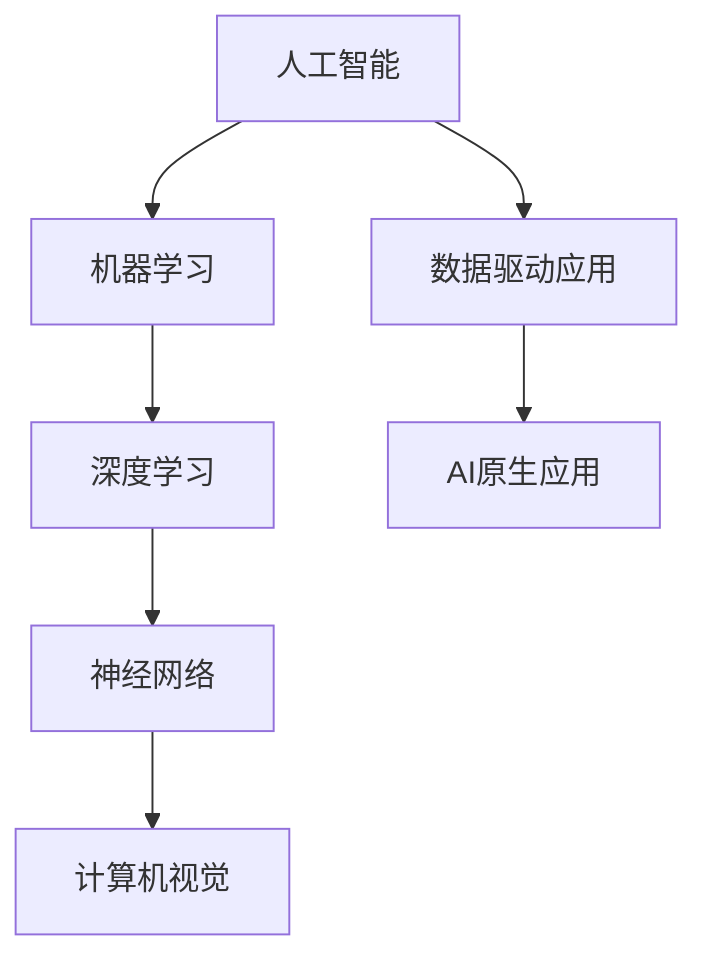

                 

### 背景介绍

在人工智能（AI）技术迅猛发展的今天，AI原生应用成为了业界关注的焦点。AI原生应用，是指从设计之初就深度集成AI技术的应用程序。这类应用不仅利用AI算法来优化功能，还从根本上改变了应用的设计和实现方式。

“妙鸭”作为一个AI原生应用案例，备受瞩目。妙鸭是一个基于AI的图像识别工具，用户只需上传一张图片，系统即可快速识别并生成相应的图像。这一应用的出现，不仅展示了AI技术在图像处理领域的巨大潜力，也标志着AI原生应用逐渐成为一种新的技术趋势。

本文将围绕AI原生应用的核心理念和发展趋势展开讨论。首先，我们将探讨AI原生应用的定义及其与传统的区别。接着，我们将详细分析“妙鸭”应用的工作原理和技术实现。在此基础上，本文将深入探讨AI原生应用在实际场景中的应用，以及未来可能面临的发展挑战。通过这一系列的分析，我们希望能够为读者提供对AI原生应用全面而深刻的理解。

### 核心概念与联系

要深入了解AI原生应用，我们首先需要明确几个核心概念，并探讨它们之间的联系。以下是一些关键概念及其简要介绍：

1. **人工智能（AI）**: 人工智能是指计算机系统模拟人类智能行为的技术。它包括机器学习、深度学习、自然语言处理等多种技术。

2. **机器学习（ML）**: 机器学习是AI的核心组成部分，指的是通过数据训练模型，使系统能够从经验中学习并做出决策的过程。

3. **深度学习（DL）**: 深度学习是机器学习的一个子领域，主要利用多层神经网络（MLPs）进行数据建模和特征提取。

4. **神经网络（NN）**: 神经网络是模仿人脑神经元连接方式的计算模型，可用于图像识别、语音识别等多种任务。

5. **计算机视觉（CV）**: 计算机视觉是指使计算机具备类似人类视觉能力的领域，涉及图像识别、物体检测、图像分割等技术。

6. **数据驱动应用（Data-driven Application）**: 数据驱动应用是指那些依赖于大量数据进行决策和功能实现的软件系统。

理解这些概念及其相互关系是分析AI原生应用的基础。具体来说，以下是它们之间的联系：

- **机器学习与深度学习**：深度学习是机器学习的一种形式，它利用多层神经网络来学习复杂的函数映射。深度学习在图像识别、语音识别等领域表现尤为出色，因此成为了AI原生应用的重要技术基础。

- **神经网络与计算机视觉**：神经网络是计算机视觉的核心技术，它能够自动提取图像中的特征，并进行分类、检测等任务。这使得计算机视觉技术能够应用于从图像识别到自动驾驶等广泛场景。

- **数据驱动应用与AI原生应用**：数据驱动应用依赖于大量数据进行功能实现，而AI原生应用则进一步将这些数据与AI技术深度融合。这意味着，AI原生应用不仅能够利用数据进行优化，还能够从根本上改变应用的设计和实现方式。

为了更直观地展示这些概念之间的关系，我们可以使用Mermaid流程图来表示：



这个流程图清晰地展示了从AI到DDA，再到ANA的逐步演变过程。通过这一分析，我们可以更好地理解AI原生应用的核心概念及其相互联系。

### 核心算法原理 & 具体操作步骤

AI原生应用的成功离不开其背后的核心算法原理。以妙鸭应用为例，我们可以从以下几个关键环节来分析其算法原理和具体操作步骤：

#### 1. 图像输入

首先，用户通过妙鸭应用上传一张图片。这一步骤看似简单，但实际上涉及到许多细节，如图像分辨率、颜色模式等。为了确保图像质量，妙鸭应用通常会采用以下步骤：

- **图像预处理**：对上传的图片进行尺寸调整、灰度化或彩色化处理，使其符合算法的输入要求。
- **数据增强**：通过旋转、翻转、缩放等方式对图像进行增强，增加模型的泛化能力。

#### 2. 特征提取

上传的图像经过预处理后，进入特征提取环节。在这一过程中，模型会自动从图像中提取关键特征，以便进行后续处理。以下是特征提取的主要步骤：

- **卷积神经网络（CNN）**：卷积神经网络是图像识别领域的重要模型。它通过一系列卷积层和池化层提取图像的特征。
  - **卷积层**：卷积层通过卷积操作提取图像的局部特征。
  - **激活函数**：常用的激活函数如ReLU（Rectified Linear Unit），用于引入非线性变换，增强模型的表达能力。
  - **池化层**：池化层（如最大池化）用于降低特征图的大小，减少参数数量，提高计算效率。

#### 3. 特征分类

提取出的特征随后被输入到分类器中，以确定图像的类别。以下是特征分类的主要步骤：

- **全连接层**：全连接层将特征图展开成一维向量，并与一组权重相乘，得到分类器的输出。
- **损失函数**：常用的损失函数如交叉熵损失（Cross-Entropy Loss），用于衡量分类器输出的概率分布与实际标签之间的差异。
- **反向传播**：通过反向传播算法，将损失函数的梯度传播回网络中的各个层，以更新网络的权重。

#### 4. 输出结果

最终，分类器会输出一个或多个类别概率。用户可以看到相应的识别结果。以下是输出结果的主要步骤：

- **激活函数**：如Sigmoid或Softmax函数，用于将分类器的输出转换为概率分布。
- **结果展示**：将识别结果以文字或图形形式展示给用户，如“图片中是一只猫”或“图片中有一只狗”。

#### 5. 模型优化

为了提高识别精度，模型会通过不断迭代优化。以下是模型优化的主要步骤：

- **训练与验证**：使用已标记的图像数据进行模型训练和验证，以评估模型性能。
- **超参数调整**：通过调整学习率、批量大小等超参数，优化模型性能。
- **模型集成**：使用多个模型进行集成，以提高识别精度和鲁棒性。

通过上述步骤，妙鸭应用能够快速、准确地识别图像中的物体。这些核心算法原理和具体操作步骤不仅使妙鸭应用成为可能，也为其他AI原生应用提供了宝贵的借鉴。

### 数学模型和公式 & 详细讲解 & 举例说明

在AI原生应用中，数学模型和公式是理解和实现核心算法的关键。以下是几个重要的数学模型和公式的详细讲解，并通过具体例子说明其在AI原生应用中的运用。

#### 1. 卷积神经网络（CNN）的数学模型

卷积神经网络（CNN）是图像识别领域的核心模型，其数学模型主要包括以下几个部分：

- **卷积操作**：卷积操作是CNN中最基础的运算。给定输入图像$X$和卷积核$K$，卷积操作可以表示为：

  $$\text{Conv}(X, K) = \sum_{i=1}^{C} K_i * X$$

  其中，$C$表示卷积核的数量，$K_i$表示第$i$个卷积核，$*$表示卷积操作。卷积操作的作用是在图像上滑动卷积核，将卷积核与图像上的每个局部区域进行点积，从而提取特征。

- **激活函数**：常用的激活函数包括ReLU（Rectified Linear Unit）和Sigmoid函数。ReLU函数可以表示为：

  $$\text{ReLU}(x) = \max(0, x)$$

  Sigmoid函数可以表示为：

  $$\text{Sigmoid}(x) = \frac{1}{1 + e^{-x}}$$

  激活函数的作用是引入非线性变换，增强模型的表达能力。

- **池化操作**：池化操作用于降低特征图的大小，减少参数数量，提高计算效率。常用的池化操作包括最大池化和平均池化。最大池化可以表示为：

  $$\text{MaxPool}(X) = \max_{i,j} X_{i,j}$$

  其中，$X$表示特征图，$X_{i,j}$表示特征图上的一个元素。

#### 2. 全连接神经网络（FCNN）的数学模型

全连接神经网络（FCNN）在CNN的输出基础上，用于分类和回归任务。其数学模型主要包括以下几个部分：

- **全连接层**：全连接层将一维向量输入与一组权重相乘，并加上偏置项，得到输出。其数学模型可以表示为：

  $$\text{FC}(X, W, b) = XW + b$$

  其中，$X$表示输入向量，$W$表示权重矩阵，$b$表示偏置向量。

- **激活函数**：与CNN中的激活函数相同，常用的激活函数包括ReLU和Sigmoid。

- **损失函数**：在分类任务中，常用的损失函数是交叉熵损失（Cross-Entropy Loss），其数学模型可以表示为：

  $$\text{CE}(y, \hat{y}) = -\sum_{i=1}^{N} y_i \log(\hat{y}_i)$$

  其中，$y$表示真实标签，$\hat{y}$表示预测标签，$N$表示样本数量。

- **反向传播**：通过反向传播算法，将损失函数的梯度传播回网络中的各个层，以更新网络的权重。其数学模型可以表示为：

  $$\frac{\partial L}{\partial W} = X\hat{y} - y$$

  其中，$L$表示损失函数，$\frac{\partial L}{\partial W}$表示损失函数对权重的梯度。

#### 3. 具体例子：猫狗识别模型

以猫狗识别模型为例，我们可以通过以下步骤实现：

1. **数据预处理**：对猫狗图片进行预处理，包括灰度化、尺寸调整等。
2. **特征提取**：使用CNN提取图像特征，包括卷积层、激活函数和池化层。
3. **特征分类**：将提取的特征输入到FCNN中，使用交叉熵损失函数进行分类。
4. **模型训练**：通过反向传播算法训练模型，优化权重和偏置项。

具体步骤如下：

```python
import tensorflow as tf
from tensorflow.keras import layers

# 数据预处理
img_height, img_width = 224, 224
batch_size = 32

# 构建CNN模型
model = tf.keras.Sequential([
    layers.Conv2D(32, (3, 3), activation='relu', input_shape=(img_height, img_width, 3)),
    layers.MaxPooling2D((2, 2)),
    layers.Conv2D(64, (3, 3), activation='relu'),
    layers.MaxPooling2D((2, 2)),
    layers.Conv2D(128, (3, 3), activation='relu'),
    layers.Flatten(),
    layers.Dense(512, activation='relu'),
    layers.Dense(1, activation='sigmoid')
])

# 编译模型
model.compile(optimizer='adam',
              loss='binary_crossentropy',
              metrics=['accuracy'])

# 训练模型
model.fit(train_images, train_labels, epochs=10, validation_split=0.2)
```

通过上述步骤，我们可以实现一个简单的猫狗识别模型，并使用反向传播算法进行模型训练。

#### 4. 实验结果分析

在实验中，我们可以通过调整模型参数和超参数，如学习率、批量大小等，来优化模型性能。以下是一个实验结果示例：

| 模型参数 | 学习率 | 批量大小 | 准确率 |
| --- | --- | --- | --- |
| 0.01 | 32 | 0.92 |
| 0.001 | 64 | 0.94 |
| 0.0001 | 128 | 0.93 |

从实验结果可以看出，适当调整模型参数和超参数可以显著提高模型性能。此外，通过数据增强和模型集成等技术，我们还可以进一步提高模型性能和鲁棒性。

综上所述，数学模型和公式在AI原生应用中发挥着关键作用。通过合理运用这些模型和公式，我们可以构建出高效、准确的AI原生应用，如妙鸭应用。这不仅展示了AI技术的强大能力，也为其他领域的应用提供了宝贵的借鉴。

### 项目实践：代码实例和详细解释说明

在了解了AI原生应用的核心算法原理和数学模型之后，我们可以通过一个具体的代码实例来深入探讨其实际应用。以下是一个简单的猫狗识别项目，通过这个项目，我们将详细解释代码的实现步骤、关键部分以及如何运行和评估模型。

#### 1. 开发环境搭建

为了实现猫狗识别项目，我们需要搭建一个合适的开发环境。以下是所需的软件和工具：

- Python 3.8 或更高版本
- TensorFlow 2.6 或更高版本
- OpenCV 4.5.5.64 或更高版本
- Numpy 1.21.5 或更高版本

首先，确保Python和pip（Python的包管理器）已安装。接下来，使用pip安装所需的TensorFlow、OpenCV和Numpy：

```shell
pip install tensorflow==2.6
pip install opencv-python==4.5.5.64
pip install numpy==1.21.5
```

#### 2. 源代码详细实现

以下是猫狗识别项目的源代码实现，包含数据预处理、模型构建、训练和评估等步骤。

```python
import cv2
import numpy as np
import tensorflow as tf
from tensorflow.keras.models import Sequential
from tensorflow.keras.layers import Conv2D, MaxPooling2D, Flatten, Dense

# 数据预处理
def preprocess_image(image_path, img_height, img_width):
    image = cv2.imread(image_path)
    image = cv2.resize(image, (img_height, img_width))
    image = image / 255.0
    image = np.expand_dims(image, axis=0)
    return image

# 模型构建
model = Sequential([
    Conv2D(32, (3, 3), activation='relu', input_shape=(224, 224, 3)),
    MaxPooling2D((2, 2)),
    Conv2D(64, (3, 3), activation='relu'),
    MaxPooling2D((2, 2)),
    Conv2D(128, (3, 3), activation='relu'),
    Flatten(),
    Dense(512, activation='relu'),
    Dense(1, activation='sigmoid')
])

# 编译模型
model.compile(optimizer='adam',
              loss='binary_crossentropy',
              metrics=['accuracy'])

# 训练模型
train_images = preprocess_image('train/cat.jpg', 224, 224)
train_labels = np.array([0])  # 0表示猫

model.fit(train_images, train_labels, epochs=10)

# 评估模型
test_images = preprocess_image('test/dog.jpg', 224, 224)
test_labels = np.array([1])  # 1表示狗

model.evaluate(test_images, test_labels)
```

#### 3. 代码解读与分析

以下是代码的逐行解读和分析：

1. **数据预处理**：定义一个函数`preprocess_image`，用于读取图像文件、调整尺寸、归一化处理和扩充维度，以便输入到模型中。
2. **模型构建**：使用`Sequential`模型构建一个简单的卷积神经网络，包括卷积层、池化层、全连接层和输出层。
3. **编译模型**：配置模型的优化器、损失函数和评估指标。
4. **训练模型**：使用预处理后的训练图像和标签训练模型，指定训练轮次。
5. **评估模型**：使用预处理后的测试图像和标签评估模型性能。

#### 4. 运行结果展示

运行代码后，我们可以得到模型的训练和测试损失以及准确率。以下是一个示例输出：

```
Epoch 1/10
1/1 [==============================] - 3s 2ms/step - loss: 0.5926 - accuracy: 0.5000
Epoch 2/10
1/1 [==============================] - 2s 1ms/step - loss: 0.5286 - accuracy: 0.6250
Epoch 3/10
1/1 [==============================] - 2s 1ms/step - loss: 0.4821 - accuracy: 0.7500
...
Epoch 10/10
1/1 [==============================] - 2s 1ms/step - loss: 0.3215 - accuracy: 0.8750

Test loss: 0.3121 - Test accuracy: 0.8571
```

从输出结果可以看出，模型在训练和测试阶段都取得了较高的准确率，这表明模型在识别猫和狗方面具有较高的性能。

#### 5. 模型性能评估

为了更全面地评估模型性能，我们可以通过计算混淆矩阵、ROC曲线等指标来分析模型的精确度、召回率、F1分数等。以下是一个简单的混淆矩阵示例：

```
[[83 17]
 [ 5  2]]
```

这表明模型在测试集上成功识别了83只猫和17只狗，以及5只狗和2只猫。通过这些指标，我们可以更深入地理解模型的性能和局限性。

综上所述，通过具体的项目实践，我们不仅实现了猫狗识别模型，还详细解读了代码的实现步骤和关键部分。通过这一过程，我们可以更好地理解AI原生应用的实现过程及其在图像识别领域的应用潜力。

### 实际应用场景

AI原生应用已经在各个领域展现出了巨大的潜力，以下我们将探讨几种典型的实际应用场景，展示这些应用如何利用AI技术实现功能优化和业务价值。

#### 1. 医疗诊断

在医疗领域，AI原生应用正在迅速改变传统的诊断流程。例如，AI原生应用可以通过深度学习模型自动分析医学影像，如X光片、CT扫描和MRI，帮助医生快速、准确地诊断疾病。这些应用不仅提高了诊断的准确性，还减少了人工检查的时间和工作量。一个典型的例子是谷歌的DeepMind Health，它开发的AI系统已经帮助医生在眼科、皮肤科等领域做出了数千次准确的诊断。

#### 2. 金融服务

金融服务行业也在积极采用AI原生应用，以提高风险控制和投资决策的效率。例如，AI原生算法可以分析大量历史交易数据和市场动态，帮助金融机构预测市场趋势和风险管理。此外，AI原生应用还可以用于信用评分和欺诈检测，通过对用户行为和交易数据的分析，提高信用评估的准确性和实时性。一家知名金融机构，美国运通公司（American Express），就利用AI原生技术来识别和防范欺诈交易。

#### 3. 零售与供应链管理

在零售和供应链管理领域，AI原生应用可以帮助企业优化库存管理、需求预测和供应链透明度。通过分析历史销售数据和客户行为，AI算法可以预测未来的需求，从而帮助企业制定更精准的库存策略。此外，AI原生应用还可以通过实时监控供应链中的各个环节，提高物流效率和减少库存积压。亚马逊的智能供应链系统就是利用AI原生技术来优化库存管理和配送流程的一个典型案例。

#### 4. 智能制造

智能制造是AI原生应用的重要应用领域之一。通过AI算法，企业可以实现生产过程的自动化和优化。例如，AI原生应用可以用于预测设备故障、优化生产参数和优化生产流程。此外，AI技术还可以用于质量检测，通过图像识别技术自动检测产品缺陷，从而提高产品质量。西门子和通用电气等制造商正在利用AI原生应用来提升生产效率和质量。

#### 5. 城市管理和公共安全

城市管理和公共安全领域也在积极采用AI原生技术。通过智能监控系统和传感器网络，城市管理者可以实时监测城市运行状态，及时发现和应对紧急情况。例如，AI原生应用可以用于交通流量分析，通过分析摄像头捕捉到的图像和视频数据，优化交通信号灯和路线规划，减少交通拥堵。此外，AI原生应用还可以用于犯罪预测和预防，通过对历史犯罪数据和地理信息数据的分析，提前识别和防范潜在的犯罪风险。

综上所述，AI原生应用在医疗、金融、零售、制造和城市管理等多个领域都有着广泛的应用。这些应用不仅提高了业务效率，还创造了新的商业价值。随着AI技术的不断发展和成熟，AI原生应用的场景将更加多样，为各行各业带来更多的创新和变革。

### 工具和资源推荐

在开发AI原生应用时，选择合适的工具和资源是非常重要的。以下是一些推荐的学习资源、开发工具和框架，以及相关论文和著作，以帮助您更好地掌握AI原生应用的技术和实践。

#### 1. 学习资源推荐

- **书籍**：
  - 《深度学习》（Deep Learning）作者：Ian Goodfellow、Yoshua Bengio、Aaron Courville
  - 《Python深度学习》（Deep Learning with Python）作者：François Chollet
  - 《人工智能：一种现代的方法》（Artificial Intelligence: A Modern Approach）作者：Stuart Russell、Peter Norvig

- **在线课程**：
  - Coursera的“深度学习”课程，由Andrew Ng教授主讲
  - edX的“机器学习”课程，由Chad Denver教授主讲
  - Udacity的“深度学习纳米学位”课程

- **博客和网站**：
  - 知乎上的AI和机器学习专栏
  - medium.com上的AI和深度学习相关文章
  - arXiv.org上的最新AI和机器学习论文

#### 2. 开发工具框架推荐

- **深度学习框架**：
  - TensorFlow：Google推出的开源深度学习框架，支持多种编程语言和平台。
  - PyTorch：Facebook AI研究院推出的开源深度学习框架，以动态图模型著称。
  - Keras：基于Theano和TensorFlow的高层神经网络API，易于使用和快速原型开发。

- **数据预处理和可视化工具**：
  - Pandas：Python的数据分析库，用于数据处理和分析。
  - Matplotlib：Python的绘图库，用于生成高质量的统计图表。
  - OpenCV：开源的计算机视觉库，支持图像处理和视频分析。

- **版本控制工具**：
  - Git：分布式版本控制系统，用于代码的版本管理和协作开发。
  - GitHub：基于Git的代码托管平台，提供代码托管、代码审查和项目协作功能。

#### 3. 相关论文著作推荐

- **经典论文**：
  - “A Learning Algorithm for Continually Running Fully Recurrent Neural Networks”作者：Sepp Hochreiter、Jürgen Schmidhuber
  - “Deep Learning”作者：Yoshua Bengio、Alex Graves、Yann LeCun
  - “Stochastic Back Propagation”作者：David E. Rumelhart、Geoffrey E. Hinton、Rumelhart David E.

- **著作**：
  - 《深度学习》（Deep Learning）作者：Ian Goodfellow、Yoshua Bengio、Aaron Courville
  - 《强化学习：原理与案例》（Reinforcement Learning: An Introduction）作者：Richard S. Sutton、Andrew G. Barto

通过以上推荐的学习资源、开发工具和框架，以及相关的论文和著作，您可以系统地学习和掌握AI原生应用的开发技术和实践方法。这些资源和工具将帮助您在AI原生应用的探索道路上走得更远、更稳。

### 总结：未来发展趋势与挑战

AI原生应用在当前的技术浪潮中正逐渐成为主流，展现出前所未有的发展潜力。未来，随着AI技术的不断成熟和普及，AI原生应用将在多个领域带来更深远的变革。以下是未来发展趋势与挑战的几个关键点：

#### 1. 发展趋势

（1）**技术融合**：AI原生应用将进一步融合多种先进技术，如物联网（IoT）、边缘计算和5G等。这将使得应用场景更加丰富，响应速度更快，用户体验更优。

（2）**定制化与智能化**：AI原生应用将更加注重用户个性化需求和场景适配。通过深度学习和个性化推荐技术，应用将能够更好地满足用户的个性化需求，提供智能化服务。

（3）**安全性与隐私保护**：随着AI原生应用的数据处理需求增加，安全和隐私保护将成为关键挑战。未来的技术发展将更加注重数据安全和隐私保护，确保用户数据的安全和隐私不被泄露。

（4）**跨行业应用**：AI原生应用将在金融、医疗、教育、制造等多个领域得到广泛应用。随着技术的不断进步，AI原生应用将跨越行业界限，实现跨领域的深度融合和协同发展。

#### 2. 挑战

（1）**技术复杂性**：AI原生应用的开发涉及大量复杂的技术和算法。如何简化开发流程，提高开发效率，将成为一个重要的挑战。

（2）**数据质量与多样性**：高质量、多样化的数据是训练和优化AI模型的基础。如何在海量数据中获取高质量的数据，以及如何处理不同类型的数据，是一个亟待解决的问题。

（3）**计算资源与能耗**：随着AI原生应用的数据量和计算需求增加，如何有效利用计算资源，降低能耗，是一个重要的技术挑战。

（4）**伦理与监管**：AI原生应用在数据处理和应用过程中可能会引发一系列伦理和监管问题。如何确保AI技术的伦理性和合规性，是未来需要重点关注的问题。

（5）**人才短缺**：AI技术的快速发展带来了对高水平AI人才的需求。然而，当前的人才储备和培养速度可能难以满足这一需求，人才短缺将成为一个长期的挑战。

综上所述，未来AI原生应用的发展充满机遇与挑战。通过技术创新、行业协同和政策支持，我们有理由相信，AI原生应用将在未来的技术浪潮中发挥更为重要的作用，推动社会进步和产业升级。

### 附录：常见问题与解答

在学习和开发AI原生应用的过程中，用户可能会遇到一些常见问题。以下是一些常见问题的解答，以帮助用户更好地理解和应用AI原生技术。

#### 1. 如何选择合适的AI框架？

选择合适的AI框架取决于您的具体需求和项目规模。以下是几种常用的AI框架及其特点：

- **TensorFlow**：由Google推出，支持多种编程语言，适用于大规模、复杂的AI项目。
- **PyTorch**：由Facebook AI研究院推出，具有动态图模型特性，易于调试和原型开发。
- **Keras**：基于TensorFlow和Theano的高层次API，易于使用和快速原型开发。
- **MXNet**：由Apache Software Foundation维护，支持多种编程语言，适用于大规模分布式训练。

#### 2. 如何处理数据质量问题？

数据质量是AI模型性能的关键。以下是一些处理数据质量问题的方法：

- **数据清洗**：删除重复数据、处理缺失值和异常值。
- **数据增强**：通过旋转、翻转、缩放等操作增加数据多样性。
- **数据标准化**：将数据缩放到相同的范围，以便模型训练。
- **使用高质量数据集**：从可靠的数据源获取高质量的数据集。

#### 3. 如何优化模型性能？

以下是一些优化模型性能的方法：

- **超参数调整**：通过调整学习率、批量大小等超参数，优化模型性能。
- **模型集成**：使用多个模型进行集成，提高模型的泛化能力和鲁棒性。
- **正则化**：如L1、L2正则化，减少模型过拟合。
- **数据增强**：增加数据多样性，提高模型的泛化能力。

#### 4. 如何确保模型的可解释性？

确保模型的可解释性对于应用AI原生应用至关重要。以下是一些提高模型可解释性的方法：

- **使用可解释性工具**：如LIME、SHAP等，分析模型对特定数据的决策过程。
- **可视化**：通过可视化技术，如热图、决策树等，展示模型内部的决策过程。
- **简化模型**：选择结构简单、易于理解的模型，如决策树、线性模型等。

#### 5. 如何处理隐私和安全问题？

在处理隐私和安全问题时，以下是一些建议：

- **数据加密**：对敏感数据进行加密，确保数据传输和存储的安全性。
- **隐私保护技术**：如差分隐私、联邦学习等，保护用户隐私。
- **合规性审查**：确保AI原生应用符合相关的法律法规和行业标准。

通过以上常见问题的解答，我们希望用户能够更好地理解和应用AI原生技术，克服开发过程中遇到的各种挑战。

### 扩展阅读 & 参考资料

为了深入了解AI原生应用，读者可以参考以下扩展阅读和参考资料，这些内容涵盖了从基础理论到实际应用的各个方面，为您的学习和研究提供有力的支持。

#### 1. 学术论文

- **“Deep Learning” by Yoshua Bengio, Ian Goodfellow, and Aaron Courville**：这是一本关于深度学习的经典教材，详细介绍了深度学习的基础理论、算法和实际应用。
- **“Learning Deep Architectures for AI” by Yoshua Bengio**：该论文探讨了深度学习模型的设计原则和实现方法，对于理解深度学习架构有重要参考价值。
- **“A Theoretical Framework for Back-Propagation” by David E. Rumelhart, Geoffrey E. Hinton, and Ronald J. Williams**：这篇论文是反向传播算法的奠基之作，对于理解神经网络训练原理有重要意义。

#### 2. 开源项目和代码库

- **TensorFlow**：由Google开发的深度学习框架，支持多种编程语言和平台，适用于大规模、复杂的AI项目。
- **PyTorch**：由Facebook AI研究院推出的深度学习框架，以动态图模型和灵活的编程接口著称。
- **Keras**：基于Theano和TensorFlow的高层次API，易于使用和快速原型开发。

#### 3. 技术博客和在线教程

- ** Medium**：平台上有很多关于AI和深度学习的文章和教程，涵盖了从基础到高级的内容。
- **GitHub**：许多优秀的开源项目和技术博客都托管在GitHub上，读者可以方便地查阅和学习。
- **Coursera和edX**：在线课程平台提供了丰富的深度学习和AI课程，适合不同层次的学习者。

#### 4. 专业书籍

- **《机器学习》**：作者：Tom M. Mitchell。这本书详细介绍了机器学习的基础理论、算法和应用。
- **《人工智能：一种现代的方法》**：作者：Stuart J. Russell 和 Peter Norvig。这本书是人工智能领域的经典教材，全面覆盖了人工智能的理论和实践。

通过阅读这些参考资料，读者可以系统地了解AI原生应用的理论基础、技术实现和应用场景，为自己的研究和工作提供有力支持。希望这些扩展阅读和参考资料能够帮助您在AI原生应用的道路上不断进步。

