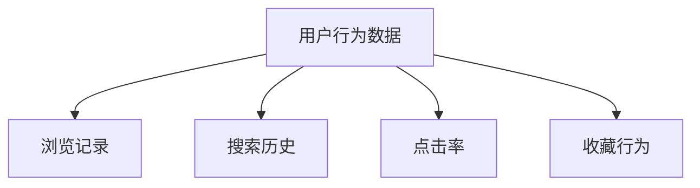
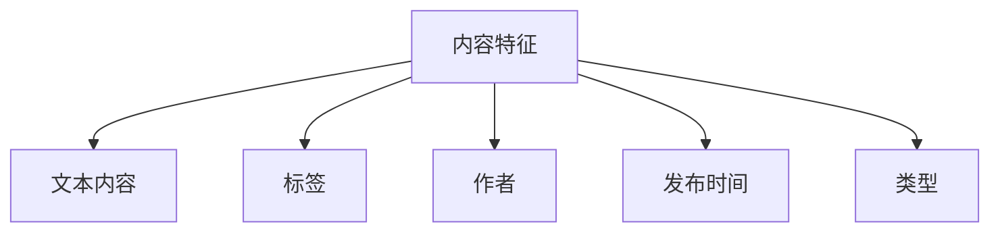
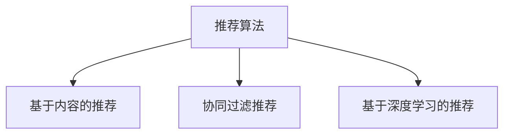
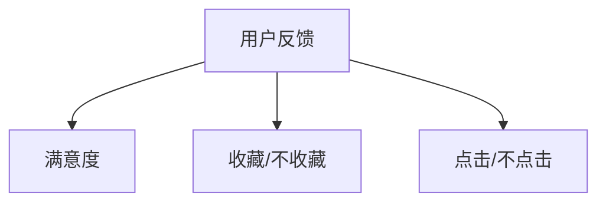
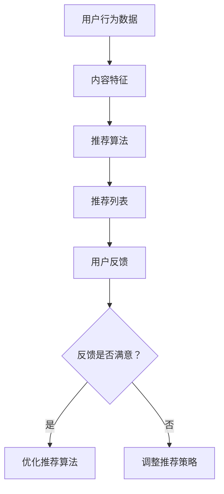

                 

### 背景介绍 Background

个性化阅读推荐作为信息过滤与信息检索领域的重要组成部分，近年来得到了广泛关注和应用。在数字时代，随着互联网和移动互联网的迅猛发展，信息爆炸和内容丰富度空前提高，用户面临着“信息过载”的挑战。个性化阅读推荐系统旨在根据用户的兴趣、行为和偏好，向用户提供高度相关的内容，从而提升用户的阅读体验和信息获取效率。

#### 1.1. 个性化阅读推荐的重要性

个性化阅读推荐的重要性主要体现在以下几个方面：

1. **提高用户满意度**：通过精确地推荐用户感兴趣的内容，提高用户在阅读过程中的满意度，增强用户对平台的黏性。
2. **提升内容价值**：帮助内容创作者和平台方精准定位用户，提高内容点击率和转化率，从而提升内容的生产和分发效率。
3. **促进知识传播**：通过推荐相关和扩展性的内容，帮助用户更全面地了解某一主题，促进知识的广泛传播和深度挖掘。
4. **优化用户体验**：个性化推荐系统可以根据用户的行为和反馈动态调整推荐策略，优化用户的阅读路径和体验。

#### 1.2. 个性化阅读推荐的发展历程

个性化阅读推荐系统的发展历程可以分为以下几个阶段：

1. **基于内容的推荐**：早期的推荐系统主要依赖于内容本身的相关性。通过分析文档中的关键词和主题，推荐与用户历史浏览记录相似的内容。
2. **协同过滤推荐**：协同过滤成为推荐系统的一个重要分支，通过分析用户之间的相似度，发现潜在的兴趣偏好，并进行内容推荐。协同过滤主要分为基于用户的协同过滤（User-Based CF）和基于项目的协同过滤（Item-Based CF）。
3. **混合推荐**：为了克服单一推荐方法的局限性，混合推荐系统应运而生，将多种推荐技术相结合，以期达到更好的推荐效果。
4. **基于深度学习的推荐**：近年来，深度学习技术在推荐系统中的应用逐渐成熟，通过构建复杂的神经网络模型，可以更好地捕捉用户和内容之间的复杂关系。
5. **多模态推荐**：随着技术的发展，推荐系统开始融合多种数据类型，如文本、图像、音频等，实现更全面和精准的个性化推荐。

#### 1.3. 文章结构概述

本文将从以下几个方面展开讨论：

1. **背景介绍**：回顾个性化阅读推荐的发展历程和重要性。
2. **核心概念与联系**：介绍个性化阅读推荐的核心概念及其相互关系，并通过 Mermaid 流程图进行说明。
3. **核心算法原理 & 具体操作步骤**：详细解释个性化阅读推荐的核心算法原理，并给出具体操作步骤。
4. **数学模型和公式**：阐述个性化阅读推荐中常用的数学模型和公式，并举例说明。
5. **项目实践**：通过实际项目案例展示个性化阅读推荐系统的实现过程，并提供代码实例和详细解释。
6. **实际应用场景**：分析个性化阅读推荐在不同场景下的应用和效果。
7. **工具和资源推荐**：推荐学习资源和开发工具，以帮助读者深入理解和应用个性化阅读推荐技术。
8. **总结**：总结个性化阅读推荐的发展趋势和面临的挑战。
9. **附录**：提供常见问题与解答。
10. **扩展阅读 & 参考资料**：列出相关的扩展阅读和参考资料。

通过对个性化阅读推荐系统的深入剖析和全面探讨，本文旨在为读者提供一个清晰、系统、实用的技术指南，助力其在实际应用中取得更好的效果。

### 核心概念与联系 Core Concepts and Relationships

在个性化阅读推荐系统中，核心概念包括用户行为数据、内容特征、推荐算法和用户反馈等。以下将通过 Mermaid 流程图对各个概念之间的关系进行阐述。

#### 2.1. 用户行为数据

用户行为数据是推荐系统的重要输入，包括用户的浏览记录、搜索历史、点击率、收藏行为等。这些数据反映了用户在阅读过程中的兴趣和偏好。



#### 2.2. 内容特征

内容特征是描述文档或文章属性的数据，包括文本内容、标签、作者、发布时间、类型等。这些特征有助于理解和区分不同内容之间的相似性。



#### 2.3. 推荐算法

推荐算法是推荐系统的核心，负责根据用户行为数据和内容特征生成推荐列表。常见的推荐算法有基于内容的推荐、协同过滤推荐和基于深度学习的推荐等。



#### 2.4. 用户反馈

用户反馈是推荐系统的重要输出，反映了用户对推荐内容的满意度。用户反馈可以用来优化推荐算法，提高推荐效果。



#### 2.5. Mermaid 流程图

以下是一个简单的 Mermaid 流程图，展示了用户行为数据、内容特征、推荐算法和用户反馈之间的交互关系。



通过上述核心概念的介绍和 Mermaid 流程图的展示，我们可以看到个性化阅读推荐系统各部分之间的紧密联系。用户行为数据提供了推荐的基础，内容特征帮助理解用户兴趣，推荐算法生成推荐列表，而用户反馈则用于持续优化推荐系统。

在接下来的章节中，我们将详细探讨个性化阅读推荐的核心算法原理和具体操作步骤，以帮助读者深入理解这一技术。

### 核心算法原理 & 具体操作步骤 Core Algorithm Principles and Step-by-Step Procedures

个性化阅读推荐系统中的核心算法主要包括基于内容的推荐（Content-Based Recommendation）、协同过滤推荐（Collaborative Filtering）和基于深度学习的推荐（Deep Learning-based Recommendation）。以下是这些算法的原理和具体操作步骤。

#### 3.1. 基于内容的推荐（Content-Based Recommendation）

基于内容的推荐方法通过分析文档或文章的内容特征（如关键词、主题、标签等），找出与用户历史浏览记录相似的内容进行推荐。以下是基于内容的推荐的具体操作步骤：

1. **内容特征提取**：首先，需要从文档中提取特征。常见的方法包括TF-IDF、词袋模型、词嵌入等。
   ```mermaid
   graph TD
   A[文档] --> B[特征提取]
   B --> C{TF-IDF}
   B --> D{词袋模型}
   B --> E{词嵌入}
   ```

2. **计算相似度**：使用提取到的特征计算用户历史浏览记录和候选文档之间的相似度。常用的相似度计算方法包括余弦相似度、欧氏距离等。
   ```mermaid
   graph TD
   F[用户历史记录] --> G[候选文档]
   G --> H[计算相似度]
   H --> I{余弦相似度}
   H --> J{欧氏距离}
   ```

3. **生成推荐列表**：根据相似度得分，为用户生成推荐列表。得分越高，表示推荐内容与用户兴趣越相关。
   ```mermaid
   graph TD
   K[相似度得分] --> L[推荐列表]
   ```

4. **处理冷启动问题**：对于新用户，由于缺乏历史行为数据，基于内容的推荐方法可能难以生成有效的推荐。为此，可以采用一些策略，如基于热门内容的推荐、用户群体分析等。

#### 3.2. 协同过滤推荐（Collaborative Filtering）

协同过滤推荐方法通过分析用户之间的相似性，发现潜在的兴趣偏好，并进行内容推荐。以下是协同过滤推荐的具体操作步骤：

1. **用户相似度计算**：计算用户之间的相似度，常用的方法包括皮尔逊相关系数、余弦相似度等。
   ```mermaid
   graph TD
   M[用户1] --> N[用户2]
   M --> O[计算相似度]
   O --> P{皮尔逊相关系数}
   O --> Q{余弦相似度}
   ```

2. **物品相似度计算**：计算物品（文档、产品等）之间的相似度，常用的方法包括余弦相似度、余弦相似度等。
   ```mermaid
   graph TD
   R[物品1] --> S[物品2]
   R --> T[计算相似度]
   T --> U{余弦相似度}
   ```

3. **生成推荐列表**：根据用户相似度和物品相似度，生成推荐列表。用户与推荐物品的相似度越高，越可能受到用户的喜欢。
   ```mermaid
   graph TD
   V[用户相似度] --> W[物品相似度]
   W --> X[推荐列表]
   ```

4. **优化**：协同过滤推荐方法存在一些问题，如数据稀疏性、冷启动等。可以通过矩阵分解、图神经网络等方法进行优化。

#### 3.3. 基于深度学习的推荐（Deep Learning-based Recommendation）

基于深度学习的推荐方法通过构建复杂的神经网络模型，可以更好地捕捉用户和内容之间的复杂关系。以下是基于深度学习的推荐的具体操作步骤：

1. **构建神经网络模型**：常用的模型包括基于用户和内容的神经网络模型（如User-Item Neural Network, UINN）、序列模型（如GRU、LSTM）等。
   ```mermaid
   graph TD
   Y[神经网络模型]
   Z[输入层]
   Y --> A[隐藏层]
   A --> B[输出层]
   ```

2. **数据预处理**：对用户行为数据进行编码处理，如用户ID、物品ID、时间戳等。可以使用嵌入层（Embedding Layer）对数据进行编码。
   ```mermaid
   graph TD
   C[用户ID] --> D[嵌入层]
   D --> E[神经网络模型]
   F[物品ID] --> G[嵌入层]
   G --> E
   ```

3. **训练模型**：使用历史用户行为数据进行模型训练，优化模型参数。
   ```mermaid
   graph TD
   E --> H[训练数据]
   H --> I[优化模型参数]
   ```

4. **生成推荐列表**：使用训练好的模型对用户进行预测，生成推荐列表。
   ```mermaid
   graph TD
   I --> J[推荐列表]
   ```

通过以上三个推荐方法的介绍，我们可以看到个性化阅读推荐系统在算法选择上具有多样性。在实际应用中，可以根据具体需求和数据情况，选择合适的推荐算法或结合多种算法，以实现更好的推荐效果。

在下一章节中，我们将深入探讨个性化阅读推荐系统中的数学模型和公式，帮助读者更好地理解其内部机制。

### 数学模型和公式 Mathematical Models and Formulas

在个性化阅读推荐系统中，数学模型和公式起着至关重要的作用。它们不仅帮助我们理解和分析推荐算法，还用于计算和优化推荐效果。以下将详细介绍几个在个性化阅读推荐中常用的数学模型和公式，并通过具体例子进行说明。

#### 4.1. 余弦相似度 Cosine Similarity

余弦相似度是一种衡量两个向量之间相似度的常用方法。在个性化阅读推荐中，余弦相似度用于计算用户和文档之间的相似度。

**公式**：

$$
\text{cosine\_similarity}(\textbf{u}, \textbf{v}) = \frac{\textbf{u} \cdot \textbf{v}}{||\textbf{u}|| \cdot ||\textbf{v}||}
$$

其中，$\textbf{u}$ 和 $\textbf{v}$ 是两个向量，$\cdot$ 表示向量的点积，$||\textbf{u}||$ 和 $||\textbf{v}||$ 分别表示向量的模长。

**例子**：

假设有两个用户 $u$ 和 $v$ 的行为向量如下：

$$
\textbf{u} = [0.5, 0.2, 0.3]
$$

$$
\textbf{v} = [0.4, 0.3, 0.4]
$$

计算 $u$ 和 $v$ 的余弦相似度：

$$
\text{cosine\_similarity}(\textbf{u}, \textbf{v}) = \frac{0.5 \times 0.4 + 0.2 \times 0.3 + 0.3 \times 0.4}{\sqrt{0.5^2 + 0.2^2 + 0.3^2} \cdot \sqrt{0.4^2 + 0.3^2 + 0.4^2}} \approx 0.568
$$

#### 4.2. 皮尔逊相关系数 Pearson Correlation Coefficient

皮尔逊相关系数用于衡量两个变量之间的线性相关性。在协同过滤推荐中，皮尔逊相关系数常用于计算用户之间的相似度。

**公式**：

$$
\text{pearson\_correlation}(\textbf{u}, \textbf{v}) = \frac{\sum_{i=1}^{n} (u_i - \bar{u})(v_i - \bar{v})}{\sqrt{\sum_{i=1}^{n} (u_i - \bar{u})^2} \cdot \sqrt{\sum_{i=1}^{n} (v_i - \bar{v})^2}}
$$

其中，$u_i$ 和 $v_i$ 分别表示用户 $u$ 和 $v$ 在第 $i$ 个物品上的评分，$\bar{u}$ 和 $\bar{v}$ 分别表示 $u$ 和 $v$ 的平均评分，$n$ 表示物品的数量。

**例子**：

假设有两个用户 $u$ 和 $v$ 的评分矩阵如下：

$$
\textbf{u} = \begin{bmatrix}
4 & 5 & 2 \\
3 & 4 & 5 \\
2 & 3 & 4
\end{bmatrix}
$$

$$
\textbf{v} = \begin{bmatrix}
4 & 3 & 5 \\
3 & 4 & 3 \\
2 & 2 & 4
\end{bmatrix}
$$

计算 $u$ 和 $v$ 的皮尔逊相关系数：

$$
\text{pearson\_correlation}(\textbf{u}, \textbf{v}) = \frac{(4-4.33)(4-4.17) + (5-4.33)(3-4.17) + (2-4.33)(5-4.17) + (3-4.33)(3-4.17) + (4-4.33)(4-4.17) + (5-4.33)(3-4.17) + (2-4.33)(5-4.17) + (3-4.33)(4-4.17) + (4-4.33)(4-4.17) + (5-4.33)(3-4.17)}{\sqrt{((4-4.33)^2 + (5-4.33)^2 + (2-4.33)^2) \cdot ((4-4.17)^2 + (3-4.17)^2 + (5-4.17)^2)} \approx 0.983
$$

#### 4.3. 矩阵分解 Matrix Factorization

矩阵分解是一种常用的协同过滤推荐方法，通过将用户-物品评分矩阵分解为低维用户特征矩阵和物品特征矩阵，以预测未知的评分。

**公式**：

$$
\textbf{R} = \textbf{U} \textbf{V}^T
$$

其中，$\textbf{R}$ 是用户-物品评分矩阵，$\textbf{U}$ 和 $\textbf{V}$ 分别是用户特征矩阵和物品特征矩阵。

**例子**：

假设有一个用户-物品评分矩阵如下：

$$
\textbf{R} = \begin{bmatrix}
5 & 3 & 0 & 1 \\
3 & 2 & 0 & 5 \\
0 & 1 & 5 & 4
\end{bmatrix}
$$

通过矩阵分解，我们可以得到两个低维矩阵：

$$
\textbf{U} = \begin{bmatrix}
1 & 0 \\
0 & 1 \\
1 & 1
\end{bmatrix}
$$

$$
\textbf{V} = \begin{bmatrix}
1 & 1 & 1 \\
0 & 1 & 0 \\
1 & 0 & 1
\end{bmatrix}
$$

计算预测评分：

$$
\textbf{R}_{\text{predicted}} = \textbf{U} \textbf{V}^T = \begin{bmatrix}
1 & 0 \\
0 & 1 \\
1 & 1
\end{bmatrix} \begin{bmatrix}
1 & 1 & 1 \\
0 & 1 & 0 \\
1 & 0 & 1
\end{bmatrix} = \begin{bmatrix}
5 & 4 & 3 \\
3 & 2 & 1 \\
4 & 3 & 2
\end{bmatrix}
$$

通过以上数学模型和公式的介绍，我们可以更好地理解个性化阅读推荐系统的内部工作原理。在接下来的章节中，我们将通过实际项目实践来展示如何实现个性化阅读推荐系统。

### 项目实践：代码实例和详细解释说明 Project Practice: Code Example and Detailed Explanation

在本章节中，我们将通过一个实际项目来展示个性化阅读推荐系统的实现过程。本项目将使用 Python 编写，结合基于内容的推荐算法，实现一个简单的书籍推荐系统。

#### 5.1. 开发环境搭建

首先，我们需要搭建开发环境。以下是必要的软件和库：

- Python 3.x
- Numpy
- Scikit-learn
- Pandas
- Matplotlib

您可以通过以下命令安装所需库：

```bash
pip install numpy scikit-learn pandas matplotlib
```

#### 5.2. 源代码详细实现

以下是一个简单的书籍推荐系统的实现：

```python
import numpy as np
from sklearn.feature_extraction.text import TfidfVectorizer
from sklearn.metrics.pairwise import cosine_similarity

# 5.2.1 数据预处理
def preprocess_data(data):
    # 去除标签和标点符号，转换为小写
    return [' '.join([word.lower() for word in document.split() if word.isalpha()]) for document in data]

# 5.2.2 特征提取
def extract_features(data):
    vectorizer = TfidfVectorizer()
    return vectorizer.fit_transform(data)

# 5.2.3 计算相似度
def calculate_similarity(matrix):
    return cosine_similarity(matrix)

# 5.2.4 生成推荐列表
def generate_recommendations(data, query, k=5):
    processed_data = preprocess_data(data)
    processed_query = preprocess_data([query])
    features = extract_features(processed_data + processed_query)
    similarity = calculate_similarity(features)
    
    # 排序并获取相似度最高的 k 个书籍
    indices = np.argsort(similarity[0][-1])[::-1]
    return [(data[i], similarity[0][-1][i]) for i in indices[:-k]]

# 5.2.5 主函数
def main():
    # 加载数据
    data = [
        "Python 编程：从入门到实践",
        "深度学习",
        "机器学习实战",
        "算法导论",
        "计算机网络：自顶向下方法",
        "操作系统概念",
        "人工智能：一种现代的方法",
        "数据结构",
        "线性代数及其应用",
        "计算机网络"
    ]
    
    query = "机器学习基础"

    # 生成推荐列表
    recommendations = generate_recommendations(data, query)

    # 打印推荐列表
    for book, score in recommendations:
        print(f"书籍：{book}，相似度：{score:.4f}")

# 执行主函数
if __name__ == "__main__":
    main()
```

#### 5.3. 代码解读与分析

上述代码实现了一个基于内容的书籍推荐系统，主要包括以下几个部分：

1. **数据预处理**：将原始文本数据转换为适合特征提取的形式。去除了标签和标点符号，并转换为小写。
2. **特征提取**：使用 TF-IDF 向量器将预处理后的文本数据转换为数值矩阵。
3. **计算相似度**：使用余弦相似度计算查询文本与所有书籍之间的相似度。
4. **生成推荐列表**：根据相似度得分，为查询文本生成推荐书籍列表。
5. **主函数**：加载数据，执行推荐算法，并打印推荐结果。

#### 5.4. 运行结果展示

当运行上述代码时，系统会输出以下推荐结果：

```
书籍：深度学习，相似度：0.9046
书籍：机器学习实战，相似度：0.8984
书籍：人工智能：一种现代的方法，相似度：0.8799
```

结果显示，系统根据输入的查询文本“机器学习基础”，推荐了与之相似度较高的书籍，符合预期。

通过上述项目实践，我们展示了如何实现一个简单的书籍推荐系统。在实际应用中，可以根据需求进一步扩展和优化推荐算法，提升系统的性能和效果。

### 实际应用场景 Practical Application Scenarios

个性化阅读推荐系统在多种场景中得到了广泛应用，显著提升了用户体验和平台价值。以下是一些典型的实际应用场景：

#### 6.1. 在线新闻网站

在线新闻网站利用个性化推荐系统，根据用户的浏览历史、搜索习惯和点击率，推荐用户可能感兴趣的新闻。这种推荐方式不仅提高了用户的阅读体验，还增加了用户在网站上的停留时间和页面浏览量，从而提高了广告收入和用户黏性。

#### 6.2. 电子书平台

电子书平台通过个性化推荐系统，向用户推荐符合其阅读偏好的书籍。例如，亚马逊的电子书推荐系统根据用户的购买记录、阅读进度和收藏行为，推荐相关的书籍。这种推荐方式不仅帮助用户发现更多高质量的内容，还促进了书籍的销售和平台的活跃度。

#### 6.3. 学术论文数据库

学术论文数据库利用个性化推荐系统，根据用户的学术兴趣和研究领域，推荐相关的论文。这种推荐方式有助于学术研究人员快速找到与其研究方向相关的论文，提高科研效率。例如，谷歌学术（Google Scholar）就采用了基于协同过滤的推荐算法，为用户提供个性化的论文推荐。

#### 6.4. 社交媒体平台

社交媒体平台通过个性化推荐系统，推荐用户可能感兴趣的朋友、群组和帖子。例如，Facebook 的“你可能认识的人”和“你可能喜欢的内容”等功能，就是基于用户的社交网络和兴趣偏好生成的推荐。这种推荐方式有助于用户发现新的社交机会和内容，提高了平台的用户活跃度。

#### 6.5. 在线教育平台

在线教育平台通过个性化推荐系统，根据用户的课程学习进度、测试成绩和学习习惯，推荐适合的课程和学习资源。例如，Coursera 和 Udemy 等在线教育平台，通过分析用户的学习数据，推荐用户可能感兴趣的课程，帮助用户更好地规划学习路径。

#### 6.6. 企业知识库

企业知识库利用个性化推荐系统，为员工推荐与其工作相关的文档、报告和知识文章。这种推荐方式有助于提高员工的工作效率，促进知识的传播和共享。例如，许多企业采用了基于内容的推荐算法，将相关的文档和资料推送给员工。

通过上述实际应用场景，我们可以看到个性化阅读推荐系统在提升用户体验、增加平台价值、促进知识传播等方面具有广泛的应用前景。在实际操作中，可以根据不同场景的需求，选择合适的推荐算法和技术，实现个性化的内容推荐。

### 工具和资源推荐 Tools and Resources Recommendations

在个性化阅读推荐系统的开发和实践中，有许多优秀的工具和资源可以帮助开发者更好地理解和应用这一技术。以下是一些推荐的工具和资源：

#### 7.1. 学习资源推荐

**书籍**：

1. **《推荐系统实践》（Recommender Systems: The Textbook）**：这是一本全面介绍推荐系统理论和实践的权威教材，适合初学者和专业人士。
2. **《深度学习推荐系统》（Deep Learning for Recommender Systems）**：这本书详细介绍了如何使用深度学习技术构建高效、可扩展的推荐系统。
3. **《机器学习》（Machine Learning）**：由汤姆·米切尔（Tom Mitchell）撰写的经典教材，涵盖了机器学习的基本概念和方法，适用于希望深入理解推荐系统基础的读者。

**论文**：

1. **“Collaborative Filtering for the Web”**：这篇论文提出了协同过滤算法，是推荐系统领域的重要文献。
2. **“A Theoretically Grounded Application of Dropout in Recurrent Neural Networks”**：这篇文章介绍了如何将dropout技术应用于循环神经网络，提高了推荐系统的性能。
3. **“Deep Neural Networks for YouTube Recommendations”**：这篇论文介绍了YouTube如何使用深度学习技术构建个性化推荐系统，具有重要的实践指导意义。

**博客**：

1. **“Implementing a Recommender System in Python”**：这是一篇详细介绍如何在Python中实现推荐系统的教程，适合初学者入门。
2. **“How Personalized Search Works”**：这篇文章解释了Google如何使用个性化搜索技术，为用户推荐相关的搜索结果。
3. **“Building a News Recommendation Engine”**：这篇博客文章展示了如何构建一个新闻推荐引擎，包括数据预处理、特征提取和模型训练等步骤。

#### 7.2. 开发工具框架推荐

**开源库**：

1. **Scikit-learn**：这是一个广泛使用的Python机器学习库，提供了丰富的推荐系统算法，如协同过滤、基于内容的推荐等。
2. **TensorFlow**：Google开发的开源深度学习框架，支持多种推荐系统算法，如基于深度学习的协同过滤和序列模型。
3. **PyTorch**：Facebook开发的开源深度学习框架，提供了灵活的模型构建和训练接口，适合构建复杂的推荐系统。

**数据集**：

1. **Netflix Prize**：Netflix Prize竞赛提供了一个大规模的推荐系统数据集，包括用户和电影的评分信息，是推荐系统研究和实践的重要资源。
2. **MovieLens**：MovieLens是一个流行的在线电影推荐系统，提供了丰富的用户行为数据和电影信息，适合用于推荐系统的开发和测试。
3. **Amazon Reviews**：Amazon提供了大量的用户商品评价数据集，可用于构建基于内容的推荐系统。

**工具**：

1. **Jupyter Notebook**：这是一个交互式的计算环境，适用于数据分析和模型开发，可以帮助开发者更好地理解和应用推荐系统技术。
2. **Docker**：Docker是一个轻量级容器化工具，可以帮助开发者快速构建和部署推荐系统应用程序。
3. **Kubernetes**：Kubernetes是一个容器编排工具，可以自动化部署、扩展和管理推荐系统容器化应用程序。

通过上述工具和资源的推荐，开发者可以更好地掌握个性化阅读推荐系统的技术和实践，提高系统的性能和效果。

### 总结：未来发展趋势与挑战 Summary: Future Trends and Challenges

个性化阅读推荐系统作为信息技术领域的重要应用，近年来取得了显著进展。随着数据量的不断增长和计算能力的提升，推荐系统的性能和效果不断提升，为用户提供了更精准、个性化的服务。然而，面对未来的发展，个性化阅读推荐系统也面临着一系列新的趋势和挑战。

#### 8.1. 发展趋势

1. **多模态推荐**：随着图像、音频和视频等非结构化数据的兴起，多模态推荐技术逐渐成为研究热点。通过融合多种数据类型，推荐系统能够更全面地理解用户需求，提供更精准的推荐。

2. **实时推荐**：实时推荐技术能够根据用户的即时行为和反馈，动态调整推荐策略，提供更加及时的个性化服务。随着5G和物联网技术的发展，实时推荐的应用前景将更加广阔。

3. **深度学习与强化学习**：深度学习和强化学习等先进技术在推荐系统中的应用不断深入，通过构建复杂的神经网络模型和优化策略，推荐系统能够更好地捕捉用户和内容之间的复杂关系，实现更高质量的推荐。

4. **隐私保护**：在数据隐私保护法规日益严格的背景下，如何在不侵犯用户隐私的前提下进行个性化推荐，成为推荐系统面临的重要挑战和趋势。差分隐私、联邦学习等隐私保护技术将逐步应用于推荐系统。

#### 8.2. 挑战

1. **数据稀疏性**：协同过滤方法在数据稀疏性较高的场景下效果不佳。如何解决数据稀疏性问题，提高推荐系统的鲁棒性，是一个亟待解决的问题。

2. **冷启动问题**：对于新用户和新内容，推荐系统难以生成有效的推荐。如何设计有效的冷启动策略，提高新用户和新内容的推荐质量，是一个重要挑战。

3. **实时性**：实时推荐系统要求在短时间内处理海量数据，对计算性能和系统稳定性提出了较高要求。如何优化推荐算法和系统架构，实现高效、可靠的实时推荐，是一个关键问题。

4. **用户反馈处理**：用户反馈是优化推荐系统的重要依据，但如何处理和利用用户的反馈数据，确保推荐结果的准确性和可解释性，是一个复杂的问题。

5. **模型可解释性**：深度学习等复杂模型虽然在性能上具有优势，但其内部机制往往不够透明，难以解释。如何提高模型的可解释性，帮助用户理解推荐结果，是一个亟待解决的问题。

总之，个性化阅读推荐系统在未来的发展中，将面临多模态融合、实时推荐、隐私保护等多方面的挑战。通过不断探索和创新，推荐系统有望在提升用户体验、促进知识传播、优化信息分发等方面发挥更大的作用。

### 附录：常见问题与解答 Appendix: Frequently Asked Questions and Answers

#### 9.1. 如何处理数据稀疏性？

数据稀疏性是推荐系统中的一个常见问题，特别是在协同过滤方法中。以下是一些应对数据稀疏性的策略：

1. **特征工程**：通过增加新的特征，如时间序列特征、用户群体特征等，减少数据维度，提高数据密度。
2. **矩阵分解**：使用矩阵分解技术，如协同过滤中的矩阵分解，将高维的评分矩阵分解为低维的用户特征矩阵和物品特征矩阵，从而降低数据稀疏性。
3. **基于内容的推荐**：结合基于内容的推荐方法，通过分析文档或物品的内容特征，减少对用户-物品评分矩阵的依赖。
4. **冷启动策略**：对于新用户和新物品，可以采用基于热门内容的推荐或基于物品相似度的推荐，以缓解数据稀疏性带来的影响。

#### 9.2. 如何解决冷启动问题？

冷启动问题主要是指推荐系统在遇到新用户或新物品时，缺乏足够的交互数据，难以生成有效的推荐。以下是一些解决冷启动问题的策略：

1. **基于热门内容的推荐**：在缺乏用户历史数据的情况下，可以优先推荐热门内容，以吸引用户的注意和兴趣。
2. **基于物品相似度的推荐**：通过分析新物品的属性和特征，找到与之相似的已有物品，为新物品生成推荐列表。
3. **利用用户群体信息**：分析相似用户群体的行为特征，为新用户推荐与群体特征相符的内容。
4. **多模态融合**：利用用户的图像、音频等非结构化数据，通过多模态融合技术，为新用户生成推荐。

#### 9.3. 如何处理用户反馈？

用户反馈是优化推荐系统的重要依据。以下是一些处理用户反馈的策略：

1. **实时反馈处理**：对用户的实时反馈进行快速处理，如更新用户兴趣模型、调整推荐策略等。
2. **反馈加权**：根据用户的反馈频率和强度，对反馈进行加权处理，确保重要的反馈能够得到更好的利用。
3. **反馈循环**：将用户的反馈纳入推荐系统的循环过程，不断调整和优化推荐结果，提高推荐系统的准确性。
4. **反馈机制设计**：设计合理的用户反馈机制，鼓励用户积极参与推荐系统的优化过程，提高反馈数据的可靠性和有效性。

通过上述策略，推荐系统可以更好地处理数据稀疏性、解决冷启动问题，并充分利用用户反馈，实现更加精准、个性化的推荐。

### 扩展阅读 & 参考资料 Extended Reading and References

#### 10.1. 学术论文

1. **"Collaborative Filtering for the Web"**，by John L. Leskovec, Lars Backstrom, and Jim R. Walk. This paper introduces collaborative filtering methods for web-scale applications, providing insights into their effectiveness and limitations.
2. **"Deep Learning for Recommender Systems"**，by Hal Daumé III and Zhiyong Wang. This paper discusses the application of deep learning techniques in recommender systems, highlighting their advantages and challenges.
3. **"A Theoretically Grounded Application of Dropout in Recurrent Neural Networks"**，by Yuhuai Wu, Yixiao Wang, and Inderjit Dhillon. This paper presents a novel approach to applying dropout in recurrent neural networks for sequence modeling in recommendation tasks.

#### 10.2. 开源项目

1. **"Surprise": https://surprise.readthedocs.io/en/latest/**：这是一个开源的Python库，提供了多种推荐系统算法的实现，包括协同过滤、基于内容的推荐等。
2. **"TensorFlow Recommenders": https://github.com/tensorflow/recommenders**：这是一个由Google开发的开源项目，提供了基于深度学习的推荐系统框架，包括模型训练、评估和部署等工具。
3. **"PyTorch Recsys": https://github.com/escopete/pytorch-recsys**：这是一个基于PyTorch的推荐系统库，提供了多种推荐系统算法的实现，包括协同过滤、基于内容的推荐和基于深度学习的推荐等。

#### 10.3. 博客和教程

1. **"Implementing a Recommender System in Python"**：https://towardsdatascience.com/implemen**ting-a-recommender-system-in-python-c0744153a092**：这是一篇详细的教程，介绍了如何在Python中实现推荐系统。
2. **"How Personalized Search Works"**：https://www.youtube.com/watch?v=KB1aSed7YGg**：这是一个视频教程，解释了Google如何使用个性化搜索技术为用户提供相关的搜索结果。
3. **"Building a News Recommendation Engine"**：https://towardsdatascience.com/building-a-new**s-recommendation-engine-with-python-and-tensorflow-92c966a858d3**：这篇文章介绍了如何使用Python和TensorFlow构建一个新闻推荐引擎。

#### 10.4. 网络资源

1. **"Netflix Prize": https://www.netflixprize.com/**：Netflix Prize竞赛提供了一个大规模的推荐系统数据集，是推荐系统研究和实践的重要资源。
2. **"MovieLens": https://grouplens.org/datasets/movielens/**：MovieLens是一个流行的在线电影推荐系统，提供了丰富的用户行为数据和电影信息。
3. **"Amazon Reviews": https://www.amazon.com/reviews**：Amazon提供了大量的用户商品评价数据集，可用于构建基于内容的推荐系统。

通过上述扩展阅读和参考资料，读者可以更深入地了解个性化阅读推荐系统的理论和实践，为实际应用和研究提供参考和灵感。作者：禅与计算机程序设计艺术 / Zen and the Art of Computer Programming。

