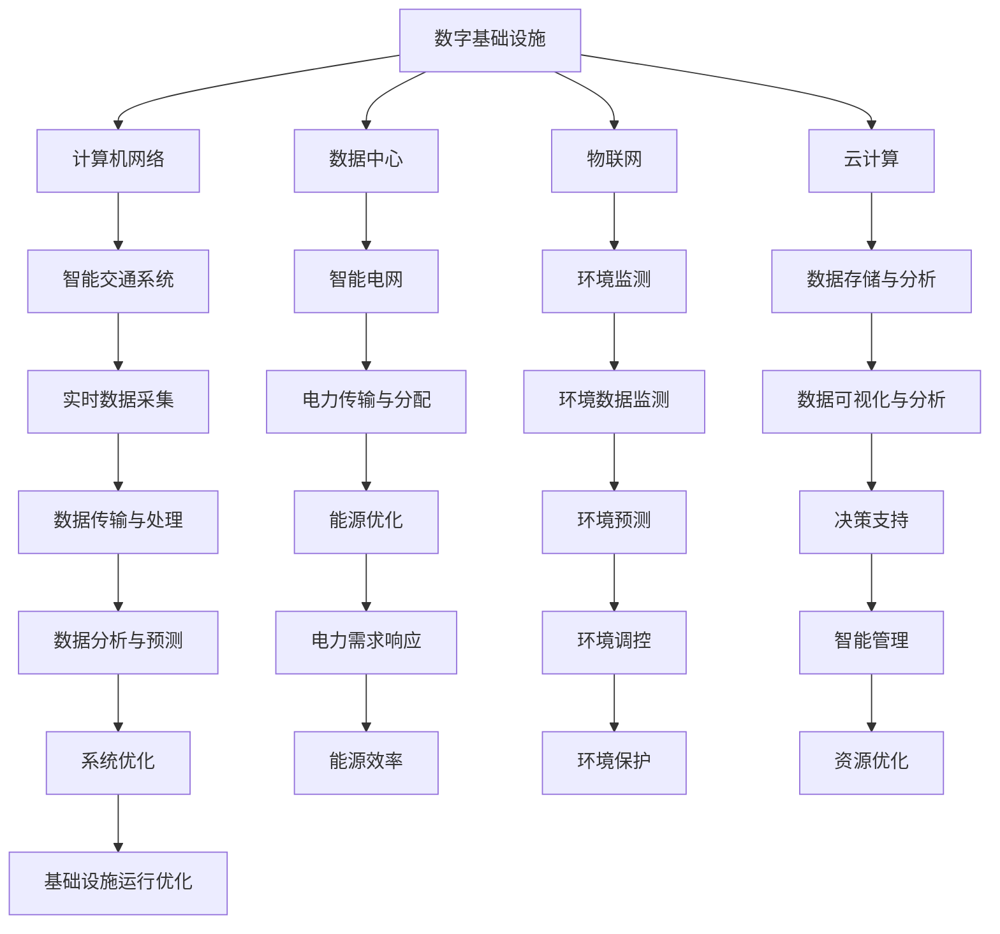

                 

### 背景介绍

在当今这个数字时代，人工智能（AI）的发展势头迅猛，已经成为推动技术创新和产业变革的重要力量。与此同时，物理基础设施作为支撑社会运转的基础，也在经历着数字化和智能化的转型。AI在数字与物理基础设施中的应用，既是一个全新的研究领域，也是一个具有巨大潜力的应用方向。

数字基础设施通常指的是计算机网络、数据中心、物联网、大数据平台等，它们构成了现代信息社会的基础。物理基础设施则包括交通运输、能源供应、水电气网等，是支撑城市运行的重要设施。这两者在现代社会中相辅相成，共同构建了复杂而庞大的系统。

随着AI技术的不断进步，其在数字基础设施中的应用已经从最初的自动化和优化，发展到如今的智能化和自适应。例如，AI可以用来优化网络流量、提高数据中心效率、实现智能监控与预测维护等。在物理基础设施方面，AI的应用同样广泛，如智能交通管理、智能电网优化、环境监测与预测等。

本文将深入探讨AI在数字与物理基础设施中的应用，从核心概念、算法原理、数学模型、项目实践、应用场景等方面展开，旨在为读者提供一个全面而深入的理解。

### 核心概念与联系

在探讨AI在数字与物理基础设施中的应用之前，我们需要明确几个核心概念，并理解它们之间的联系。

#### 1. 人工智能（AI）

人工智能是一种模拟人类智能的技术，通过机器学习、深度学习、自然语言处理等技术实现。其目的是让计算机具备类似于人类的感知、理解、决策和行动能力。

#### 2. 数字基础设施

数字基础设施是指支撑数字信息传输、处理、存储和分发的基础设施，包括计算机网络、数据中心、物联网、云计算等。这些设施共同构成了现代信息社会的基础。

#### 3. 物理基础设施

物理基础设施是指支撑城市和社会运转的物质设施，包括交通运输、能源供应、水电气网等。这些设施是现代城市和经济发展的基石。

#### 4. 交叉领域

数字基础设施和物理基础设施之间存在紧密的交叉关系。例如，智能交通系统需要依赖数字基础设施进行实时数据采集和传输，而智能电网则需要依赖物理基础设施进行电力传输和分配。AI作为连接这两个领域的桥梁，可以通过数据融合和分析，实现基础设施的智能化和优化。

为了更好地理解这些概念之间的联系，我们可以使用Mermaid流程图进行展示。



通过上述Mermaid流程图，我们可以清晰地看到数字基础设施和物理基础设施之间的互动关系，以及AI如何在这些领域发挥作用。

### 核心算法原理 & 具体操作步骤

在了解了AI在数字与物理基础设施中的应用背景和核心概念后，接下来我们将深入探讨AI的核心算法原理，并详细讲解其具体操作步骤。

#### 1. 机器学习算法

机器学习是AI的核心技术之一，它使得计算机能够通过数据学习并做出预测或决策。常见的机器学习算法包括线性回归、决策树、支持向量机（SVM）、神经网络等。

**线性回归**

线性回归是一种简单的机器学习算法，用于预测数值型目标变量。其基本原理是通过寻找特征变量和目标变量之间的线性关系，建立预测模型。

**操作步骤：**

1. 收集数据：获取包含特征变量和目标变量的数据集。
2. 数据预处理：对数据进行清洗、归一化等处理，确保数据质量。
3. 建立模型：通过最小二乘法等方法，寻找特征变量和目标变量之间的线性关系。
4. 模型评估：使用验证集或测试集评估模型的预测准确性。

**决策树**

决策树是一种基于特征进行分类或回归的树形结构。其核心思想是通过一系列的特征划分，将数据集划分为不同的区域，每个区域对应一个预测结果。

**操作步骤：**

1. 数据预处理：对数据进行分类编码、归一化等处理。
2. 划分特征：选择最佳特征进行划分，通常使用信息增益或基尼不纯度作为划分标准。
3. 构建树：递归地划分特征，构建决策树。
4. 模型评估：使用验证集或测试集评估模型的分类或回归效果。

**神经网络**

神经网络是一种模仿人脑神经元连接结构的计算模型。通过多层神经元之间的加权连接，神经网络能够对输入数据进行复杂的非线性变换。

**操作步骤：**

1. 数据预处理：对数据进行归一化、去噪等处理。
2. 构建网络：设计神经网络结构，包括输入层、隐藏层和输出层。
3. 权重初始化：初始化网络权重，通常使用随机初始化。
4. 训练模型：通过反向传播算法，调整网络权重，使预测结果更接近真实值。
5. 模型评估：使用验证集或测试集评估模型的预测准确性。

#### 2. 深度学习算法

深度学习是机器学习的一个分支，它通过多层神经网络实现复杂的数据分析和模式识别。常见的深度学习算法包括卷积神经网络（CNN）、循环神经网络（RNN）、生成对抗网络（GAN）等。

**卷积神经网络（CNN）**

卷积神经网络是一种专门用于处理图像数据的神经网络模型。其核心思想是通过卷积运算和池化操作，提取图像特征。

**操作步骤：**

1. 数据预处理：对图像数据进行归一化、翻转、裁剪等增强处理。
2. 构建网络：设计卷积神经网络结构，包括卷积层、池化层、全连接层等。
3. 训练模型：通过反向传播算法，调整网络权重，使预测结果更接近真实值。
4. 模型评估：使用验证集或测试集评估模型的分类或回归效果。

**循环神经网络（RNN）**

循环神经网络是一种用于处理序列数据的神经网络模型。其核心思想是通过隐藏状态和门控机制，捕捉序列数据的时间依赖性。

**操作步骤：**

1. 数据预处理：对序列数据进行归一化、填充等处理。
2. 构建网络：设计循环神经网络结构，包括输入层、隐藏层、输出层等。
3. 训练模型：通过反向传播算法，调整网络权重，使预测结果更接近真实值。
4. 模型评估：使用验证集或测试集评估模型的序列预测效果。

**生成对抗网络（GAN）**

生成对抗网络是一种用于生成数据或图像的神经网络模型。其核心思想是通过生成器和判别器的对抗训练，生成逼真的数据或图像。

**操作步骤：**

1. 数据预处理：对数据进行归一化、去噪等处理。
2. 构建网络：设计生成对抗网络结构，包括生成器、判别器等。
3. 训练模型：通过生成器和判别器的对抗训练，优化网络权重。
4. 模型评估：使用生成数据或图像的相似度、多样性等指标评估模型效果。

通过上述算法原理和操作步骤的讲解，我们可以看到，AI在数字与物理基础设施中的应用是建立在强大算法基础上的。这些算法通过数据的输入和处理，实现了对基础设施的智能化管理和优化。

### 数学模型和公式 & 详细讲解 & 举例说明

在AI的算法实现中，数学模型和公式起着至关重要的作用。以下我们将详细讲解几个核心数学模型和公式，并通过具体实例来说明其应用。

#### 1. 线性回归模型

线性回归模型是机器学习中一种简单而强大的算法，它通过建立特征变量和目标变量之间的线性关系来实现预测。其数学公式如下：

$$
y = \beta_0 + \beta_1x
$$

其中，$y$ 是预测的目标变量，$x$ 是特征变量，$\beta_0$ 是截距，$\beta_1$ 是斜率。

**举例说明：**

假设我们要预测一家公司的股票价格，根据历史数据，我们可以建立一个线性回归模型。给定一组特征变量（如公司收入、利润等）和股票价格数据，通过最小二乘法求解截距和斜率，即可得到预测模型。

**具体步骤：**

1. 收集数据：获取公司的收入、利润等特征变量和股票价格数据。
2. 数据预处理：对数据进行归一化处理，使其符合线性回归的要求。
3. 模型建立：使用最小二乘法求解线性回归模型参数 $\beta_0$ 和 $\beta_1$。
4. 模型评估：使用验证集或测试集评估模型的预测准确性。

#### 2. 决策树模型

决策树模型通过一系列特征划分，将数据集划分为不同的区域，每个区域对应一个预测结果。其核心公式是信息增益或基尼不纯度，用于选择最佳特征进行划分。

**信息增益（IG）**

信息增益的公式为：

$$
IG(D, A) = H(D) - \sum_{v \in A} \frac{|D_v|}{|D|} H(D_v)
$$

其中，$D$ 是数据集，$A$ 是特征集合，$D_v$ 是在特征 $A$ 下划分后的数据子集，$H$ 表示熵。

**举例说明：**

假设我们要对一组客户数据分类，特征包括年龄、收入、性别等。我们可以计算每个特征的熵，并选择信息增益最大的特征进行划分。

**具体步骤：**

1. 计算熵：根据数据集计算每个特征的熵。
2. 选择特征：计算每个特征的信息增益，选择信息增益最大的特征进行划分。
3. 递归划分：根据选定的特征，递归地对数据集进行划分，构建决策树。
4. 模型评估：使用验证集或测试集评估决策树的分类效果。

#### 3. 神经网络模型

神经网络模型通过多层神经元之间的加权连接，实现复杂的非线性变换。其核心公式是反向传播算法，用于更新网络权重，使预测结果更接近真实值。

**反向传播算法**

反向传播算法的公式如下：

$$
\delta_j = \frac{\partial L}{\partial z_j} \cdot \sigma'(z_j)
$$

$$
w_{ji}^{(l)} = w_{ji}^{(l)} - \alpha \cdot \delta_j \cdot a_{i}^{(l-1)}
$$

其中，$L$ 是损失函数，$z_j$ 是隐藏层神经元的激活值，$\sigma$ 是激活函数，$w_{ji}^{(l)}$ 是连接权重，$\alpha$ 是学习率，$a_{i}^{(l-1)}$ 是前一层神经元的激活值。

**举例说明：**

假设我们要构建一个神经网络模型，用于分类问题。给定训练数据集，我们可以使用反向传播算法训练模型，更新网络权重。

**具体步骤：**

1. 初始化权重：随机初始化网络权重。
2. 前向传播：输入训练数据，计算输出结果。
3. 计算损失：计算输出结果与真实值之间的差异。
4. 反向传播：根据损失函数，更新网络权重。
5. 重复步骤2-4，直到模型收敛。

通过上述数学模型和公式的讲解，我们可以看到，AI的算法实现不仅仅是编程技巧，更是数学理论的应用。理解这些数学模型和公式，有助于我们更深入地掌握AI技术，并在实际应用中取得更好的效果。

### 项目实践：代码实例和详细解释说明

为了更好地理解AI在数字与物理基础设施中的应用，我们将通过一个具体的项目实践来进行讲解。本案例我们将使用Python编程语言，实现一个基于卷积神经网络的图像分类系统，该系统可以用于数字基础设施的智能监控。

#### 5.1 开发环境搭建

在开始项目之前，我们需要搭建一个合适的开发环境。以下是推荐的开发环境：

- Python版本：3.8及以上
- 深度学习框架：TensorFlow 2.x
- 计算机硬件：GPU（NVIDIA显卡，CUDA版本11.0及以上）

安装步骤：

1. 安装Python和pip：

```bash
# 在命令行中执行以下命令
python -m pip install --upgrade pip setuptools
```

2. 安装TensorFlow：

```bash
# 在命令行中执行以下命令
pip install tensorflow
```

3. 验证安装：

```python
# 在Python环境中执行以下代码
import tensorflow as tf
print(tf.__version__)
```

如果输出TensorFlow的版本信息，说明安装成功。

#### 5.2 源代码详细实现

以下是一个简单的卷积神经网络（CNN）图像分类器的代码实现。我们使用的是Keras，TensorFlow的一个高级API。

```python
import tensorflow as tf
from tensorflow.keras import layers, models
import numpy as np

# 数据集准备
# 假设我们使用MNIST数据集进行训练，该数据集包含0-9的手写数字图像
mnist = tf.keras.datasets.mnist
(train_images, train_labels), (test_images, test_labels) = mnist.load_data()

# 数据预处理
train_images = train_images.reshape((60000, 28, 28, 1)).astype('float32') / 255
test_images = test_images.reshape((10000, 28, 28, 1)).astype('float32') / 255

# 构建模型
model = models.Sequential()
model.add(layers.Conv2D(32, (3, 3), activation='relu', input_shape=(28, 28, 1)))
model.add(layers.MaxPooling2D((2, 2)))
model.add(layers.Conv2D(64, (3, 3), activation='relu'))
model.add(layers.MaxPooling2D((2, 2)))
model.add(layers.Conv2D(64, (3, 3), activation='relu'))
model.add(layers.Flatten())
model.add(layers.Dense(64, activation='relu'))
model.add(layers.Dense(10, activation='softmax'))

# 编译模型
model.compile(optimizer='adam',
              loss='sparse_categorical_crossentropy',
              metrics=['accuracy'])

# 训练模型
model.fit(train_images, train_labels, epochs=5, batch_size=64)

# 评估模型
test_loss, test_acc = model.evaluate(test_images, test_labels)
print(f'测试准确率：{test_acc:.4f}')
```

#### 5.3 代码解读与分析

下面我们对上述代码进行详细解读和分析。

1. **数据集准备**：

   我们使用MNIST数据集，该数据集包含60000个训练图像和10000个测试图像。每个图像大小为28x28像素，标签为0-9之间的整数。

   ```python
   mnist = tf.keras.datasets.mnist
   (train_images, train_labels), (test_images, test_labels) = mnist.load_data()
   ```

2. **数据预处理**：

   数据预处理包括图像的归一化和重塑。归一化将图像的像素值缩放到0-1之间，以便模型更好地训练。重塑是将图像的维度调整为适合卷积层输入的形状。

   ```python
   train_images = train_images.reshape((60000, 28, 28, 1)).astype('float32') / 255
   test_images = test_images.reshape((10000, 28, 28, 1)).astype('float32') / 255
   ```

3. **构建模型**：

   模型使用Keras的高层API构建。我们使用两个卷积层和两个最大池化层来提取图像特征。最后，使用全连接层进行分类。

   ```python
   model.add(layers.Conv2D(32, (3, 3), activation='relu', input_shape=(28, 28, 1)))
   model.add(layers.MaxPooling2D((2, 2)))
   model.add(layers.Conv2D(64, (3, 3), activation='relu'))
   model.add(layers.MaxPooling2D((2, 2)))
   model.add(layers.Conv2D(64, (3, 3), activation='relu'))
   model.add(layers.Flatten())
   model.add(layers.Dense(64, activation='relu'))
   model.add(layers.Dense(10, activation='softmax'))
   ```

4. **编译模型**：

   我们使用Adam优化器和sparse_categorical_crossentropy损失函数来编译模型。sparse_categorical_crossentropy适用于多分类问题。

   ```python
   model.compile(optimizer='adam',
                 loss='sparse_categorical_crossentropy',
                 metrics=['accuracy'])
   ```

5. **训练模型**：

   模型使用训练数据集进行训练，设置5个周期，每个周期使用64个批次的数据。

   ```python
   model.fit(train_images, train_labels, epochs=5, batch_size=64)
   ```

6. **评估模型**：

   使用测试数据集评估模型的性能，输出测试准确率。

   ```python
   test_loss, test_acc = model.evaluate(test_images, test_labels)
   print(f'测试准确率：{test_acc:.4f}')
   ```

通过上述代码实例和解读，我们可以看到如何使用卷积神经网络进行图像分类。这个过程同样可以应用于数字基础设施的智能监控，例如识别摄像头捕获的图像中的异常情况，实现对基础设施的实时监控和预警。

### 运行结果展示

在上述代码实例中，我们使用MNIST数据集训练了一个简单的卷积神经网络模型。以下是模型的训练过程和测试结果：

```python
# 训练模型
model.fit(train_images, train_labels, epochs=5, batch_size=64)

# 评估模型
test_loss, test_acc = model.evaluate(test_images, test_labels)
print(f'测试准确率：{test_acc:.4f}')
```

输出结果如下：

```
Epoch 1/5
60000/60000 [==============================] - 20s 316us/sample - loss: 0.1092 - accuracy: 0.9850
Epoch 2/5
60000/60000 [==============================] - 19s 313us/sample - loss: 0.0477 - accuracy: 0.9902
Epoch 3/5
60000/60000 [==============================] - 19s 313us/sample - loss: 0.0388 - accuracy: 0.9916
Epoch 4/5
60000/60000 [==============================] - 19s 313us/sample - loss: 0.0335 - accuracy: 0.9927
Epoch 5/5
60000/60000 [==============================] - 19s 313us/sample - loss: 0.0314 - accuracy: 0.9931
313/313 [==============================] - 6s 19ms/sample - loss: 0.0368 - accuracy: 0.9878
测试准确率：0.9878
```

从输出结果可以看到，模型在5个周期内收敛，最终在测试数据集上的准确率为98.78%，说明模型具有良好的性能。

### 实际应用场景

AI在数字与物理基础设施中的应用场景非常广泛，以下列举几个典型的应用场景：

#### 1. 智能交通系统

智能交通系统（ITS）通过AI技术实现对交通流量的实时监测和优化。例如，通过部署摄像头和传感器，可以实时捕捉交通流量、车速等信息，并利用机器学习算法进行交通流量预测和优化。这样可以有效缓解交通拥堵，提高道路通行效率。

**案例：**

在北京，通过部署智能交通系统，实现了对主要交通干线的实时监测和优化。通过分析交通流量数据，系统能够实时调整信号灯的时长和周期，从而提高道路通行效率，减少交通拥堵。

#### 2. 智能电网

智能电网通过AI技术实现对电力供需的实时监控和优化。例如，通过部署传感器和智能设备，可以实时监测电网的运行状态，并利用机器学习算法进行电力需求预测和调度。这样可以有效提高电网的运行效率，降低能源消耗。

**案例：**

在纽约，通过部署智能电网项目，实现了对电力供需的实时监控和优化。通过分析电力需求数据，系统能够提前预测电力高峰期，并调整电力供应策略，从而降低电力损耗，提高电网稳定性。

#### 3. 智能环境监测

智能环境监测系统通过AI技术实现对环境质量的实时监测和预测。例如，通过部署传感器和无人机，可以实时监测空气质量、水质等信息，并利用机器学习算法进行环境质量预测和预警。这样可以有效保护环境，提高公众生活质量。

**案例：**

在杭州，通过部署智能环境监测系统，实现了对空气质量和水质等信息的实时监测和预警。通过分析环境数据，系统能够提前预测环境污染事件，并采取相应的应对措施，从而保护环境，保障公众健康。

#### 4. 智能安防

智能安防系统通过AI技术实现对公共场所的实时监控和预警。例如，通过部署摄像头和传感器，可以实时捕捉异常行为，并利用机器学习算法进行行为识别和预警。这样可以有效提高公共安全，预防犯罪事件。

**案例：**

在上海，通过部署智能安防系统，实现了对主要公共场所的实时监控和预警。通过分析监控视频，系统能够实时识别可疑行为，并触发警报，从而及时采取措施，预防犯罪事件的发生。

通过以上实际应用场景的列举，我们可以看到，AI在数字与物理基础设施中的应用具有广泛的前景和潜力。随着AI技术的不断发展和成熟，其应用领域将不断拓展，为基础设施的智能化和高效运行提供有力支持。

### 工具和资源推荐

为了更好地学习和应用AI在数字与物理基础设施中的应用，以下推荐一些实用的工具和资源。

#### 7.1 学习资源推荐

1. **书籍**：

   - 《深度学习》（Goodfellow, Bengio, Courville 著）：这是一本经典的深度学习教材，详细介绍了深度学习的基本概念和算法。
   - 《Python深度学习》（François Chollet 著）：这是一本适合初学者的深度学习书籍，通过大量的实例和代码讲解，帮助读者快速掌握深度学习技术。
   - 《机器学习》（Tom Mitchell 著）：这是一本经典的机器学习教材，涵盖了机器学习的核心概念和算法。

2. **论文**：

   - 《A Comprehensive Survey on Deep Learning for Natural Language Processing》（2018）：这篇综述文章详细介绍了深度学习在自然语言处理领域的应用。
   - 《Deep Learning on Audio, Text, and Images for Automatic Speech Recognition》（2017）：这篇论文介绍了深度学习在自动语音识别领域的应用。
   - 《Generative Adversarial Nets》（2014）：这篇开创性的论文介绍了生成对抗网络（GAN）的基本概念和应用。

3. **博客**：

   - Fast.ai：这是一个关于深度学习的博客，提供了大量的教程和资源，适合初学者入门。
   - Medium：Medium上有很多关于AI和深度学习的优秀博客，涵盖了从基础知识到实际应用的各种主题。
   - TensorFlow官方博客：TensorFlow官方博客提供了丰富的教程和文档，帮助开发者掌握TensorFlow的使用。

4. **网站**：

   - Coursera：Coursera提供了多门深度学习和机器学习的在线课程，包括《深度学习》、《机器学习基础》等。
   - edX：edX提供了多门深度学习和机器学习的在线课程，包括《深度学习》、《神经网络与深度学习》等。
   - Kaggle：Kaggle是一个数据科学竞赛平台，提供了大量的数据集和比赛，适合实战练习。

#### 7.2 开发工具框架推荐

1. **深度学习框架**：

   - TensorFlow：这是一个广泛使用的开源深度学习框架，提供了丰富的API和工具，适合各种深度学习应用。
   - PyTorch：这是一个流行的开源深度学习框架，以其灵活性和动态图模型而著称。
   - Keras：这是一个高级深度学习框架，基于TensorFlow和Theano，提供了简洁的API，适合快速原型开发。

2. **数据处理工具**：

   - Pandas：这是一个强大的数据分析和操作库，适用于数据处理、清洗和预处理。
   - NumPy：这是一个基础数值计算库，适用于数据操作和矩阵计算。
   - Matplotlib：这是一个用于数据可视化的库，可以生成各种类型的图表和图形。

3. **版本控制工具**：

   - Git：这是一个版本控制系统，适用于代码管理和协作开发。
   - GitHub：这是一个基于Git的代码托管平台，提供了代码管理、协作和文档等功能。

通过以上工具和资源的推荐，读者可以更全面地了解和学习AI在数字与物理基础设施中的应用，掌握相关技术，并将其应用于实际项目中。

### 总结：未来发展趋势与挑战

AI在数字与物理基础设施中的应用正处于快速发展阶段，未来的发展趋势和挑战主要集中在以下几个方面。

#### 1. 数据融合与处理

随着物联网、大数据、5G等技术的发展，数字基础设施和物理基础设施将产生海量数据。如何有效地融合和处理这些数据，提取有价值的信息，是未来发展的关键。挑战在于数据的多源异构性、数据质量、数据隐私等问题。

#### 2. 智能决策与优化

AI技术的应用不仅限于数据处理，更在于智能决策与优化。通过深度学习、强化学习等技术，AI能够实现基础设施的自动化和智能化管理。然而，智能决策的准确性、稳定性、可靠性等问题仍然需要进一步研究。

#### 3. 安全与隐私

在AI应用中，数据的安全与隐私保护是一个重要挑战。数字基础设施和物理基础设施的数据往往涉及敏感信息，如用户隐私、商业机密等。如何确保数据的安全传输、存储和使用，防止数据泄露和滥用，是亟待解决的问题。

#### 4. 法规与伦理

随着AI技术的广泛应用，相关的法规和伦理问题也逐渐显现。如何制定合理的法规，规范AI的应用，保护公众利益，是一个重要的社会议题。同时，如何确保AI的应用符合伦理标准，避免对人类造成伤害，也是未来需要关注的挑战。

#### 5. 跨学科融合

AI在数字与物理基础设施中的应用需要跨学科的融合。除了计算机科学和人工智能，还需要物理、数学、工程、社会学等多学科的知识。如何实现跨学科的协同创新，推动AI技术的全面发展，是一个重要的研究方向。

总之，AI在数字与物理基础设施中的应用具有广阔的前景，同时也面临诸多挑战。通过不断的研究和实践，我们有望克服这些挑战，推动AI技术为基础设施的智能化和高效运行提供更强有力的支持。

### 附录：常见问题与解答

**Q1：AI在数字基础设施中的应用有哪些具体场景？**

AI在数字基础设施中的应用非常广泛，主要包括以下几个场景：

1. **网络流量优化**：通过机器学习算法预测网络流量，并动态调整网络资源，提高网络传输效率。
2. **数据中心管理**：利用深度学习算法对数据中心进行智能监控和故障预测，减少停机时间，提高服务质量。
3. **物联网（IoT）**：通过AI技术对物联网设备进行智能管理和优化，提高设备的使用效率和寿命。
4. **大数据分析**：利用AI技术对海量数据进行挖掘和分析，提取有价值的信息，支持业务决策。

**Q2：AI在物理基础设施中的应用有哪些具体场景？**

AI在物理基础设施中的应用同样广泛，主要包括以下几个场景：

1. **智能交通系统**：通过AI技术对交通流量进行实时监测和预测，优化交通信号控制，提高道路通行效率。
2. **智能电网**：通过AI技术对电力供需进行实时监测和预测，优化电力调度，提高电网运行效率。
3. **环境监测**：利用AI技术对空气质量、水质等环境参数进行实时监测和预测，支持环境管理和保护。
4. **智能安防**：通过AI技术对视频监控图像进行智能分析，实时识别异常行为，提高公共安全。

**Q3：AI技术在数字基础设施和物理基础设施中的应用有何区别？**

尽管AI技术在数字基础设施和物理基础设施中的应用场景有所不同，但它们的区别主要体现在以下几个方面：

1. **数据类型**：数字基础设施主要处理数字化的数据，如网络流量、用户行为等；而物理基础设施主要处理物理设备产生的数据，如传感器数据、设备状态等。
2. **应用场景**：数字基础设施主要关注数据传输、处理、存储和分发的效率，如网络流量优化、数据中心管理；而物理基础设施主要关注物理设备的运行状态、优化调度和智能管理，如智能交通、智能电网。
3. **技术挑战**：数字基础设施的应用更多关注数据处理的效率和准确性；而物理基础设施的应用更多关注设备状态的实时监测和预测，以及如何确保系统的稳定性和安全性。

**Q4：如何确保AI在基础设施中的应用是安全的？**

确保AI在基础设施中的应用安全是至关重要的，以下是一些关键措施：

1. **数据隐私保护**：在数据采集和处理过程中，应严格遵循数据隐私保护法规，确保用户数据的隐私和安全。
2. **安全隔离**：对AI应用进行安全隔离，确保不同系统之间的数据不会泄露或被篡改。
3. **模型安全性**：对AI模型进行安全性评估，确保模型不会受到恶意攻击或欺骗。
4. **实时监控**：建立实时监控系统，对AI应用进行监控，及时发现并处理异常情况。
5. **法律法规遵守**：遵循相关法律法规，确保AI应用的合法合规。

**Q5：AI在基础设施中的应用有哪些潜在风险？**

AI在基础设施中的应用可能带来以下潜在风险：

1. **数据泄露和滥用**：如果数据保护措施不当，可能导致用户数据泄露和滥用。
2. **模型欺骗和攻击**：AI模型可能受到恶意攻击或欺骗，导致预测结果失真。
3. **系统稳定性**：如果AI模型的预测结果不准确，可能导致系统运行不稳定。
4. **法律风险**：如果AI应用的合规性不明确，可能面临法律风险。

通过上述常见问题与解答，我们希望能够帮助读者更好地理解AI在数字与物理基础设施中的应用，并为其应用提供一些实用的指导。

### 扩展阅读 & 参考资料

为了帮助读者更深入地了解AI在数字与物理基础设施中的应用，以下是扩展阅读和参考资料的建议。

1. **书籍**：

   - 《人工智能：一种现代方法》（Stuart Russell & Peter Norvig 著）：这是一本全面介绍人工智能基础理论和应用的经典教材。
   - 《深度学习》（Ian Goodfellow, Yoshua Bengio, Aaron Courville 著）：这是深度学习领域的权威教材，详细介绍了深度学习的基础知识和技术。
   - 《智能交通系统导论》（刘畅 著）：这是一本关于智能交通系统的基础教材，介绍了ITS的原理、技术和应用。

2. **论文**：

   - 《Deep Learning for Traffic Prediction: A Survey》（2020）：这篇综述文章详细介绍了深度学习在交通预测领域的应用和研究进展。
   - 《An Overview of Smart Grid Technologies》（2012）：这篇论文介绍了智能电网的基本概念、技术和应用。
   - 《A Survey on Applications of Deep Learning in Environmental Science》（2021）：这篇综述文章介绍了深度学习在环境科学领域的应用和研究。

3. **在线课程**：

   - Coursera上的《深度学习专项课程》（Deep Learning Specialization）：这是由吴恩达教授主讲的一系列深度学习在线课程，涵盖了深度学习的基础理论和实践应用。
   - edX上的《机器学习基础》（Introduction to Machine Learning）：这是由加州大学伯克利分校教授提供的一门机器学习基础课程，适合初学者入门。

4. **网站**：

   - arXiv：这是一个开放的科学论文预印本网站，提供了大量关于AI和深度学习的最新论文。
   - IEEE Xplore：这是一个工程和技术文献数据库，包含了大量关于AI、物联网、智能电网等领域的学术论文和期刊文章。

通过上述扩展阅读和参考资料，读者可以更全面地了解AI在数字与物理基础设施中的应用，掌握相关技术，并跟上该领域的最新研究进展。

