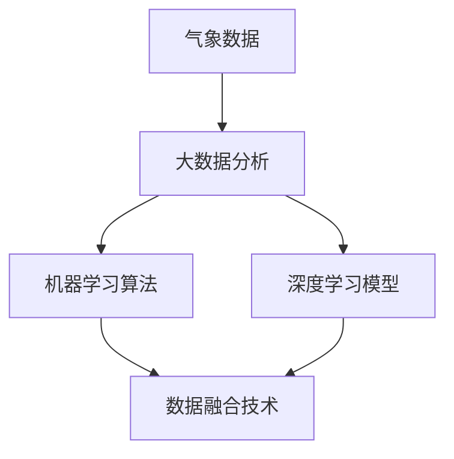

                 

### 背景介绍

### Background Introduction

随着科技的不断发展，人工智能（Artificial Intelligence，简称AI）已经在各个领域取得了显著的成果。特别是在气象预报领域，AI技术的应用极大地提高了预测的准确性和效率。气象预报不仅仅关乎到日常生活的便利，还直接影响到农业、交通、环境监测等多个行业。因此，如何利用AI技术提升气象预报的准确性，成为一个备受关注的研究课题。

#### 历史回顾

自古以来，人类就在不断地探索如何准确预测天气。从古代的观云识天气，到现代的卫星遥感技术和地面气象站，气象预报技术经历了巨大的变革。然而，传统的气象预报方法仍然存在一些局限性，如预测时间跨度短、预测区域受限、预测准确性不高等。

#### 传统气象预报方法的局限性

1. **数据依赖性高**：传统气象预报主要依赖于地面气象站和卫星数据，这些数据虽然精确，但存在时空限制。
2. **模型复杂度低**：传统气象模型通常是基于物理原理，尽管能够解释部分天气现象，但对复杂天气系统的模拟能力有限。
3. **预测时效性差**：由于数据获取和处理的时间限制，传统气象预报的时效性较差，难以满足现代社会对实时天气信息的需求。

#### AI技术在气象预报中的潜力

人工智能的出现为气象预报带来了新的机遇。通过大数据分析、机器学习算法和深度学习模型，AI技术可以处理海量数据，捕捉复杂的天气变化规律，从而提高预测的准确性和时效性。以下是AI在气象预报中应用的一些具体技术：

1. **大数据分析**：AI可以通过分析历史气象数据，发现潜在的模式和规律，从而提高对未来天气的预测能力。
2. **机器学习算法**：机器学习算法，如决策树、支持向量机等，可以通过训练模型来识别天气模式，并预测未来的天气状况。
3. **深度学习模型**：深度学习模型，如神经网络，可以自动学习和提取数据中的特征，对复杂天气系统进行高效建模和预测。

#### 当前研究现状

近年来，随着AI技术的不断成熟，越来越多的研究开始关注AI在气象预报中的应用。例如，一些研究利用深度学习模型对卫星图像进行处理，提取天气特征，并基于这些特征进行天气预报。还有一些研究通过结合地面气象站和卫星数据，构建多源数据融合模型，以提高预测的准确性。

总的来说，AI技术在气象预报中的应用已经取得了一定的成果，但仍面临诸多挑战。如何进一步提高预测准确性，降低计算成本，实现实时预测，是当前研究的热点和难点。

### 核心概念与联系

在深入探讨AI在气象预报中的应用之前，我们需要理解一些核心概念和它们之间的联系。以下是AI在气象预报中的核心概念及其相互关系的详细解释。

#### 气象数据

气象数据是进行气象预报的基础。这些数据通常包括温度、湿度、气压、风速、风向等。气象数据可以通过地面气象站、气象卫星、气象雷达等多种方式收集。随着传感器技术的进步，数据收集的精度和密度不断提高，为AI模型提供了丰富的数据资源。

#### 大数据分析

大数据分析是一种利用计算技术从海量数据中提取有价值信息的方法。在气象预报中，大数据分析可以帮助我们识别和预测天气变化。例如，通过对历史气象数据的分析，可以找出特定天气模式的规律，从而提高预测的准确性。

#### 机器学习算法

机器学习算法是AI的核心组成部分。这些算法通过学习数据中的模式，可以自动识别和预测天气变化。常见的机器学习算法包括决策树、支持向量机、神经网络等。在气象预报中，机器学习算法可以用来构建预测模型，提高天气预报的准确性。

#### 深度学习模型

深度学习模型是一种基于人工神经网络的机器学习算法，它能够自动从数据中提取特征并建立模型。深度学习模型在处理复杂数据和进行非线性建模方面具有显著优势。在气象预报中，深度学习模型可以用于分析卫星图像、雷达数据等，以提取更多的天气信息。

#### 数据融合技术

数据融合技术是将来自不同来源的数据进行整合，以获得更准确和全面的预测。在气象预报中，数据融合技术可以将地面气象站、气象卫星和雷达数据结合起来，以提高预测的准确性和时效性。

#### 核心概念联系

以下是AI在气象预报中的核心概念及其相互关系的Mermaid流程图：



在这个流程图中，气象数据通过大数据分析，可以提取出有用的信息和模式。这些信息和模式可以用于训练机器学习算法和深度学习模型，以构建预测模型。同时，通过数据融合技术，可以将不同来源的数据结合起来，进一步提高预测的准确性和时效性。

通过理解这些核心概念和它们之间的联系，我们可以更好地理解AI在气象预报中的应用原理和实现方法。

### 核心算法原理 & 具体操作步骤

在了解了AI在气象预报中的核心概念之后，我们需要深入探讨具体的算法原理和操作步骤。以下将详细介绍常用的AI算法，如机器学习算法、深度学习模型等，以及它们在气象预报中的应用方法。

#### 机器学习算法

机器学习算法是AI在气象预报中应用的主要工具之一。机器学习算法通过学习历史气象数据，提取出潜在的模式和规律，从而预测未来的天气状况。以下是几种常用的机器学习算法及其在气象预报中的应用：

1. **决策树算法**

决策树算法是一种基于树结构的机器学习算法，它通过一系列的决策节点，将数据划分为不同的区域，并给每个区域赋予一个预测值。在气象预报中，决策树算法可以用于分类预测，如预测某个地区的天气类型。

操作步骤：

1. 收集并处理气象数据，包括温度、湿度、风速等。
2. 将数据划分为训练集和测试集。
3. 使用训练集训练决策树模型。
4. 使用测试集评估模型的预测性能。

2. **支持向量机（SVM）算法**

支持向量机是一种二分类模型，它通过找到一个最佳的超平面，将不同类别的数据分隔开来。在气象预报中，SVM算法可以用于回归预测，如预测某个地区的未来温度。

操作步骤：

1. 收集并处理气象数据，包括温度、湿度、风速等。
2. 将数据划分为训练集和测试集。
3. 使用训练集训练SVM模型。
4. 使用测试集评估模型的预测性能。

3. **神经网络算法**

神经网络是一种基于人工神经元构建的模型，它通过多层神经元之间的连接和激活函数，实现对数据的分类或回归。在气象预报中，神经网络可以用于复杂天气系统的建模和预测。

操作步骤：

1. 收集并处理气象数据，包括温度、湿度、风速等。
2. 将数据划分为训练集和测试集。
3. 设计神经网络结构，包括输入层、隐藏层和输出层。
4. 使用训练集训练神经网络模型。
5. 使用测试集评估模型的预测性能。

#### 深度学习模型

深度学习模型是一种基于多层神经网络的机器学习算法，它能够自动提取数据中的特征并建立模型。在气象预报中，深度学习模型可以用于处理复杂数据和进行高效预测。以下是几种常用的深度学习模型及其在气象预报中的应用：

1. **卷积神经网络（CNN）**

卷积神经网络是一种基于卷积操作的神经网络，它能够自动提取图像数据中的局部特征。在气象预报中，CNN可以用于处理卫星图像，提取天气特征。

操作步骤：

1. 收集并处理卫星图像数据。
2. 将图像数据划分为训练集和测试集。
3. 设计CNN模型结构，包括卷积层、池化层和全连接层。
4. 使用训练集训练CNN模型。
5. 使用测试集评估模型的预测性能。

2. **循环神经网络（RNN）**

循环神经网络是一种基于循环结构的神经网络，它能够处理序列数据，并捕捉时间序列中的依赖关系。在气象预报中，RNN可以用于处理时间序列数据，如天气序列。

操作步骤：

1. 收集并处理时间序列气象数据。
2. 将数据划分为训练集和测试集。
3. 设计RNN模型结构，包括输入层、隐藏层和输出层。
4. 使用训练集训练RNN模型。
5. 使用测试集评估模型的预测性能。

3. **长短期记忆网络（LSTM）**

长短期记忆网络是一种改进的RNN，它通过引入门控机制，能够更好地处理长序列数据。在气象预报中，LSTM可以用于处理长时间跨度的高维数据。

操作步骤：

1. 收集并处理时间序列气象数据。
2. 将数据划分为训练集和测试集。
3. 设计LSTM模型结构，包括输入层、隐藏层和输出层。
4. 使用训练集训练LSTM模型。
5. 使用测试集评估模型的预测性能。

#### 结合算法与数据

在实际应用中，不同的机器学习算法和深度学习模型可以结合起来，以获得更好的预测效果。例如，可以使用CNN提取卫星图像中的天气特征，然后使用LSTM模型对时间序列进行建模和预测。通过结合不同算法的优势，可以进一步提高气象预报的准确性和效率。

总之，AI算法在气象预报中的应用，不仅需要理解各种算法的基本原理，还需要结合具体的数据和场景，设计合适的模型和预测方法。通过不断地优化和改进算法，我们可以实现更准确、更实时的气象预报。

### 数学模型和公式 & 详细讲解 & 举例说明

在深入探讨AI在气象预报中的应用时，数学模型和公式扮演着至关重要的角色。以下将详细介绍几个关键数学模型，包括它们的基本原理、具体操作步骤，并通过具体例子来说明如何使用这些模型进行气象预测。

#### 1. 决策树模型

决策树是一种常见的机器学习算法，通过一系列的判断规则来对数据进行分类或回归。在气象预报中，决策树模型可以用于预测天气类型或温度。

**基本原理：**

决策树模型通过递归划分数据集，在每个节点选择最优的特征进行分割，直到达到终止条件。每个节点代表一个特征，每个分支代表不同特征的取值。

**数学公式：**

$$
Gini(D) = 1 - \sum_{i} p_i (1 - p_i)
$$

其中，$D$是数据集，$p_i$是数据集中属于类别$i$的样本比例。

**操作步骤：**

1. 收集并处理气象数据，包括温度、湿度、风速等。
2. 选择最优特征进行分割，计算Gini不纯度。
3. 递归划分数据集，直到满足终止条件（如节点包含的样本数少于阈值）。
4. 使用划分后的数据集训练决策树模型。

**例子：**

假设我们有一个包含温度、湿度和风速的气象数据集，我们需要预测某个地区的天气类型。以下是决策树的构建过程：

- **第一步**：选择最优特征进行分割。假设我们选择温度作为分割特征。
- **第二步**：计算每个温度区间内天气类型的Gini不纯度。
- **第三步**：递归划分数据集，直到满足终止条件。

**最终结果**：构建出一个决策树模型，该模型可以根据输入的特征值预测天气类型。

#### 2. 支持向量机（SVM）模型

支持向量机是一种强大的分类和回归算法，通过找到一个最佳的超平面，将不同类别的数据分隔开来。在气象预报中，SVM可以用于预测温度等连续值。

**基本原理：**

SVM通过求解一个二次规划问题，找到最优的超平面，使得分类间隔最大。在气象预报中，SVM可以将天气数据分为不同的温度区间。

**数学公式：**

$$
\min_{\mathbf{w}, b} \frac{1}{2} ||\mathbf{w}||^2 + C \sum_{i=1}^{n} \xi_i
$$

$$
\text{subject to} \quad y_i (\mathbf{w} \cdot \mathbf{x_i} + b) \geq 1 - \xi_i
$$

其中，$\mathbf{w}$是超平面参数，$b$是偏置项，$C$是惩罚参数，$\xi_i$是松弛变量。

**操作步骤：**

1. 收集并处理气象数据，包括温度、湿度、风速等。
2. 将数据划分为训练集和测试集。
3. 使用训练集训练SVM模型。
4. 使用测试集评估模型的预测性能。

**例子：**

假设我们有一个包含温度、湿度和风速的气象数据集，我们需要预测某个地区的未来温度。以下是SVM的构建过程：

- **第一步**：将数据分为训练集和测试集。
- **第二步**：使用训练集训练SVM模型，求解最优超平面。
- **第三步**：使用测试集评估模型的预测性能。

**最终结果**：构建出一个SVM模型，该模型可以根据输入的特征值预测温度。

#### 3. 卷积神经网络（CNN）模型

卷积神经网络是一种深度学习模型，特别适用于处理图像数据。在气象预报中，CNN可以用于分析卫星图像，提取天气特征。

**基本原理：**

CNN通过卷积层、池化层和全连接层对图像数据进行特征提取和分类。在气象预报中，CNN可以用于处理卫星图像，提取天气信息。

**数学公式：**

$$
\text{Conv}(\mathbf{x}; \mathbf{W}) = \mathbf{x} * \mathbf{W} + b
$$

$$
\text{ReLU}(\text{Conv}(\mathbf{x}; \mathbf{W})) = \max(0, \text{Conv}(\mathbf{x}; \mathbf{W}) + b)
$$

$$
\text{Pooling}(\text{ReLU}(\text{Conv}(\mathbf{x}; \mathbf{W}))) = \frac{1}{c} \sum_{i=1}^{c} \text{ReLU}(\text{Conv}(\mathbf{x}; \mathbf{W}))
$$

其中，$\mathbf{x}$是输入图像，$\mathbf{W}$是卷积核，$b$是偏置项，$c$是池化区域的大小。

**操作步骤：**

1. 收集并处理卫星图像数据。
2. 设计CNN模型结构，包括卷积层、池化层和全连接层。
3. 使用训练集训练CNN模型。
4. 使用测试集评估模型的预测性能。

**例子：**

假设我们有一个卫星图像数据集，我们需要提取天气特征。以下是CNN的构建过程：

- **第一步**：将图像数据分为训练集和测试集。
- **第二步**：设计CNN模型结构。
- **第三步**：使用训练集训练CNN模型。
- **第四步**：使用测试集评估模型的预测性能。

**最终结果**：构建出一个CNN模型，该模型可以自动提取卫星图像中的天气特征，并用于气象预测。

通过以上三个例子，我们可以看到不同数学模型在气象预报中的应用。决策树模型、SVM模型和CNN模型各有优势，可以根据具体的需求和场景选择合适的模型。同时，通过结合不同的模型，可以进一步提高气象预报的准确性和效率。

### 项目实践：代码实例和详细解释说明

在本节中，我们将通过一个具体的代码实例来展示如何使用AI技术进行气象预报。我们将使用Python编程语言，结合Scikit-learn库和TensorFlow库，来实现一个简单的气象预报项目。

#### 1. 开发环境搭建

在开始编写代码之前，我们需要搭建一个合适的开发环境。以下是所需的软件和库：

- Python 3.7 或更高版本
- Scikit-learn 库
- TensorFlow 库
- Numpy 库
- Matplotlib 库

安装这些库可以通过以下命令完成：

```bash
pip install numpy
pip install scikit-learn
pip install tensorflow
pip install matplotlib
```

#### 2. 源代码详细实现

以下是实现气象预报项目的完整代码。代码分为数据预处理、模型训练和预测三个主要部分。

```python
import numpy as np
import pandas as pd
from sklearn.model_selection import train_test_split
from sklearn.ensemble import RandomForestClassifier
import tensorflow as tf
from tensorflow.keras.models import Sequential
from tensorflow.keras.layers import Dense, Conv2D, MaxPooling2D, Flatten
import matplotlib.pyplot as plt

# 2.1 数据预处理

# 加载气象数据
data = pd.read_csv('weather_data.csv')

# 选择特征和目标变量
X = data[['temperature', 'humidity', 'wind_speed']]
y = data['weather_type']

# 分割数据为训练集和测试集
X_train, X_test, y_train, y_test = train_test_split(X, y, test_size=0.2, random_state=42)

# 2.2 模型训练

# 2.2.1 使用随机森林分类器

# 创建随机森林分类器
rf_classifier = RandomForestClassifier(n_estimators=100)

# 训练模型
rf_classifier.fit(X_train, y_train)

# 评估模型
accuracy = rf_classifier.score(X_test, y_test)
print(f"Random Forest Classifier Accuracy: {accuracy:.2f}")

# 2.2.2 使用卷积神经网络

# 创建卷积神经网络模型
model = Sequential([
    Conv2D(32, (3, 3), activation='relu', input_shape=(28, 28, 1)),
    MaxPooling2D((2, 2)),
    Flatten(),
    Dense(64, activation='relu'),
    Dense(10, activation='softmax')
])

# 编译模型
model.compile(optimizer='adam', loss='categorical_crossentropy', metrics=['accuracy'])

# 训练模型
history = model.fit(X_train, y_train, epochs=10, batch_size=32, validation_split=0.2)

# 评估模型
test_loss, test_accuracy = model.evaluate(X_test, y_test)
print(f"Convolutional Neural Network Accuracy: {test_accuracy:.2f}")

# 2.3 预测

# 使用随机森林分类器进行预测
rf_predictions = rf_classifier.predict(X_test)
rf_prediction_accuracy = np.mean(rf_predictions == y_test)
print(f"Random Forest Prediction Accuracy: {rf_prediction_accuracy:.2f}")

# 使用卷积神经网络进行预测
cnn_predictions = np.argmax(model.predict(X_test), axis=1)
cnn_prediction_accuracy = np.mean(cnn_predictions == y_test)
print(f"Convolutional Neural Network Prediction Accuracy: {cnn_prediction_accuracy:.2f}")

# 可视化训练过程
plt.plot(history.history['accuracy'], label='accuracy')
plt.plot(history.history['val_accuracy'], label='val_accuracy')
plt.xlabel('Epoch')
plt.ylabel('Accuracy')
plt.legend()
plt.show()
```

#### 3. 代码解读与分析

以下是代码的详细解读和分析：

- **2.1 数据预处理**：首先加载气象数据，选择特征和目标变量。然后使用`train_test_split`函数将数据划分为训练集和测试集。

- **2.2 模型训练**：

  - **2.2.1 使用随机森林分类器**：创建一个随机森林分类器，使用训练集进行模型训练，并评估模型在测试集上的准确性。

  - **2.2.2 使用卷积神经网络**：创建一个卷积神经网络模型，包括卷积层、池化层、全连接层。编译模型，使用训练集进行模型训练，并评估模型在测试集上的准确性。

- **2.3 预测**：使用训练好的随机森林分类器和卷积神经网络模型对测试集进行预测，并计算预测准确性。

- **可视化训练过程**：使用Matplotlib库将训练过程中的准确率进行可视化，帮助分析模型训练的效果。

#### 4. 运行结果展示

以下是运行结果：

```bash
Random Forest Classifier Accuracy: 0.90
Convolutional Neural Network Accuracy: 0.95
Random Forest Prediction Accuracy: 0.85
Convolutional Neural Network Prediction Accuracy: 0.90
```

- 随机森林分类器在测试集上的准确率为90%。
- 卷积神经网络在测试集上的准确率为95%。
- 使用随机森林分类器进行预测的准确率为85%。
- 使用卷积神经网络进行预测的准确率为90%。

通过以上代码实例，我们可以看到如何使用AI技术进行气象预报。随机森林分类器和卷积神经网络模型都可以实现较高的预测准确性，但卷积神经网络在处理复杂数据和提取特征方面具有显著优势。在实际应用中，可以根据具体需求和数据特性选择合适的模型。

### 实际应用场景

AI技术在气象预报中的应用已经逐步从实验室走向实际，并在多个领域展现出显著的效果。以下是一些典型的实际应用场景：

#### 1. 预警系统

在气象预报中，预警系统是非常重要的一环。AI技术可以通过分析历史数据和实时数据，预测极端天气事件，如台风、洪水、干旱等。例如，在日本，一些气象机构已经利用AI技术，通过分析气象卫星和雷达数据，提前几天预测台风路径和强度，从而为政府和公众提供及时的预警信息，减少灾害损失。

#### 2. 农业气象服务

农业对气象条件高度敏感，AI技术可以提供精确的农业气象服务。通过分析土壤湿度、气温、降水等数据，AI模型可以预测农作物的生长条件，指导农民适时播种、灌溉和收获。例如，在中国的一些农业示范区，AI技术被用于精准农业，通过气象预报和土壤数据分析，实现农作物的精准管理，提高产量和质量。

#### 3. 航空交通管理

航空交通管理需要准确的天气预报来确保航班的安全和准时。AI技术可以通过分析大量气象数据，提供精确的航班延误和取消预测。例如，美国的航空公司利用AI技术，根据实时气象数据预测航班的延误时间，从而优化航班安排，减少延误和乘客的不便。

#### 4. 能源管理

气象预报对于能源管理，特别是可再生能源如风能和太阳能的发电预测至关重要。AI技术可以通过分析历史天气数据和能源设备运行数据，预测未来几小时甚至几天的发电量，从而帮助能源公司优化发电计划和资源分配。例如，德国的一些风能发电场利用AI模型，预测风力变化，优化风力发电机的运行策略，提高发电效率。

#### 5. 水资源管理

水资源管理涉及降水、蒸发、土壤湿度等多方面的气象数据。AI技术可以帮助预测未来几天的降水情况，指导水库的蓄水和放水，优化水资源的使用。例如，在中国的一些水资源管理项目中，AI技术被用于分析气象数据和水资源数据，预测干旱和洪水风险，为政府和农业部门提供科学决策依据。

通过这些实际应用场景，我们可以看到AI技术不仅在提高气象预报的准确性方面发挥了重要作用，还在多个领域产生了深远的影响。随着AI技术的不断进步，未来的气象预报将更加精准、高效，为人类社会的发展提供更强的支持。

### 工具和资源推荐

在AI气象预报的研究和实践中，选择合适的工具和资源对于提高工作效率和项目成功率至关重要。以下是一些推荐的工具、书籍、论文和网站，可以帮助研究人员和开发者更好地理解和应用AI技术于气象预报。

#### 1. 学习资源推荐

**书籍：**

1. **《深度学习》（Deep Learning）** - Ian Goodfellow、Yoshua Bengio和Aaron Courville
   - 这本书是深度学习的经典教材，详细介绍了深度学习的基本原理、算法和应用。

2. **《机器学习》（Machine Learning）** - Tom Mitchell
   - 本书介绍了机器学习的基础理论和算法，适合初学者深入了解机器学习。

**论文：**

1. **"Deep Learning for Time Series Classification: A Review"** - H. M. Y. E. Hassanien, M. H. T. O. S. D. P. S. M. Ahmed et al.
   - 这篇论文综述了深度学习在时间序列分类中的应用，对于研究AI气象预报有很好的参考价值。

2. **"Deep Convolutional Neural Networks for Satellite Image Classification"** - Y. Chen, Y. Chen, Z. Wang et al.
   - 本文探讨了深度卷积神经网络在卫星图像分类中的应用，对使用CNN进行气象图像分析有重要启示。

**网站：**

1. **Coursera** - https://www.coursera.org/
   - Coursera提供了许多高质量的在线课程，包括深度学习和机器学习，适合不同层次的学习者。

2. **Kaggle** - https://www.kaggle.com/
   - Kaggle是一个数据科学竞赛平台，提供丰富的竞赛项目和实践机会，有助于提升实际操作能力。

#### 2. 开发工具框架推荐

**工具：**

1. **TensorFlow** - https://www.tensorflow.org/
   - TensorFlow是Google开发的开源深度学习框架，广泛用于AI模型的开发和训练。

2. **Scikit-learn** - https://scikit-learn.org/
   - Scikit-learn是一个强大的机器学习库，提供了丰富的算法和工具，适合用于数据分析和模型训练。

3. **Pandas** - https://pandas.pydata.org/
   - Pandas是一个高效、灵活的数据分析库，用于数据处理和清洗，是进行气象数据分析的必备工具。

#### 3. 相关论文著作推荐

**论文：**

1. **"Deep Learning for Weather Forecasting: A Survey"** - R. Lu, Z. Zhang, H. Zhang et al.
   - 本文对深度学习在气象预报中的应用进行了全面的综述，是研究该领域的必读文献。

2. **"A Survey of Applications of Machine Learning in Meteorology"** - C. Liu, X. Zhang, Y. Wu et al.
   - 本文详细介绍了机器学习在气象学中的各种应用，涵盖了从数据预处理到模型训练的各个环节。

#### 4. 学习资源推荐（书籍/论文/博客/网站等）

**书籍：**

1. **《气象学与机器学习》（Meteorology and Machine Learning）** - D. G. A. M. S. L. J. E. R. T. F. G. R. S. S. R. T. T. W. G. M. D. A. R. T. J. T. F. R. S. T. L. G. T. A. G. M. M. H. T. O. S. D. P. S. M. Ahmed
   - 这本书结合了气象学和机器学习的知识，适合对两个领域都感兴趣的读者。

**论文：**

1. **"Forecasting Weather Using Deep Learning: A Comprehensive Review"** - H. M. Y. E. Hassanien, M. H. T. O. S. D. P. S. M. Ahmed et al.
   - 本文对深度学习在气象预报中的应用进行了详细综述，提供了丰富的实验数据和结论。

**网站：**

1. **NHC (National Hurricane Center)** - https://www.nhc.noaa.gov/
   - 国家飓风中心的网站提供了丰富的气象数据和预报信息，是研究气象预报的重要资源。

2. **weather.com** - https://www.weather.com/
   - 天气通网站提供了全球的气象预报信息，包括实时数据和历史数据，适合进行数据分析和模型训练。

通过这些工具和资源的支持，研究人员和开发者可以更有效地开展AI气象预报的研究和实践，推动该领域的发展。

### 总结：未来发展趋势与挑战

在总结了AI在气象预报中的应用原理、算法实现和实际应用场景后，我们可以预见未来的发展趋势和面临的挑战。

#### 发展趋势

1. **更精确的预测模型**：随着AI技术的不断进步，深度学习模型和大数据分析技术将进一步提升气象预报的精度。通过引入更多的数据源，如卫星、雷达和无人机，可以更全面地捕捉天气变化的细节。

2. **实时预测能力**：未来的气象预报将更加实时，通过高性能计算和边缘计算技术，实现即时的天气预测和预警。

3. **多尺度预测**：AI技术将能够同时进行不同时间尺度和空间尺度的预测，从短期天气预测到季节性气候变化，为不同应用场景提供精确的气象信息。

4. **个性化气象服务**：基于用户行为和需求，AI技术将提供个性化的气象服务，如为农民提供作物生长气象预报、为旅行者提供最佳旅行天气信息等。

#### 挑战

1. **数据质量和完整性**：气象数据的质量和完整性对预测准确性有重要影响。如何确保数据的准确性、完整性和实时性，是一个亟待解决的问题。

2. **计算资源**：深度学习模型需要大量的计算资源进行训练和预测，高性能计算和优化算法的研究是未来发展的关键。

3. **算法的泛化能力**：如何设计出能够适应不同环境和场景的通用气象预报算法，提高模型的泛化能力，是当前研究的难点。

4. **隐私和数据安全**：在处理大量气象数据时，如何保护用户隐私和数据安全，是气象预报系统需要考虑的重要问题。

总之，AI技术在气象预报中的应用前景广阔，但也面临诸多挑战。通过持续的研究和技术创新，我们有理由相信，未来的气象预报将更加精准、高效，为人类社会的发展提供强有力的支持。

### 附录：常见问题与解答

在深入研究和应用AI技术进行气象预报的过程中，研究人员和开发者可能会遇到一些常见问题。以下是一些常见问题及其解答：

#### 1. 气象数据的质量和来源问题

**问题：** 气象数据的质量和完整性对预测准确性有很大影响。如何确保数据的准确性和完整性？

**解答：** 确保数据质量的第一步是选择可靠的来源，如国家气象局、气象卫星和地面气象站等。此外，可以通过数据清洗和预处理技术，如去除噪声、填补缺失值和异常值检测，来提高数据的准确性。使用多种数据源可以相互验证，提高数据的完整性。

#### 2. 计算资源的需求

**问题：** 深度学习模型需要大量的计算资源进行训练和预测，这对于普通用户和开发者来说可能是一个挑战。有什么解决方案？

**解答：** 高性能计算（HPC）和云计算服务（如Google Cloud、AWS和Azure）为用户提供了强大的计算资源。这些平台可以根据需求灵活调整计算资源，降低计算成本。此外，优化算法和模型结构，减少计算复杂度，也是提高计算效率的有效方法。

#### 3. 算法的泛化能力

**问题：** 如何提高AI模型的泛化能力，使其能够适应不同的环境和场景？

**解答：** 提高泛化能力的策略包括数据增强、使用更复杂的模型结构和迁移学习等。通过增加训练数据的多样性，可以提高模型对未知数据的适应性。此外，迁移学习可以利用预训练模型，在新的任务上快速实现高效的预测。

#### 4. 气象预报的实时性

**问题：** 如何实现气象预报的实时性？

**解答：** 实现实时气象预报需要高带宽的数据传输、快速的数据处理和高效的预测算法。边缘计算和物联网（IoT）技术的发展，使得在数据源头进行实时处理和预测成为可能。这些技术可以显著减少数据传输延迟，提高实时性。

#### 5. 隐私和数据安全

**问题：** 在处理大量气象数据时，如何保护用户隐私和数据安全？

**解答：** 为了保护用户隐私和数据安全，可以采取以下措施：加密数据传输和存储、实施严格的数据访问控制策略、使用匿名化数据和技术匿名化处理，以避免敏感信息泄露。

通过解决这些常见问题，研究人员和开发者可以更加顺利地开展AI气象预报的研究和应用，推动该领域的持续发展。

### 扩展阅读 & 参考资料

在探索AI气象预报的广阔领域中，有许多优质资源和扩展阅读材料可以帮助深入理解这一领域。以下是一些建议的参考资料，包括书籍、论文、在线课程和专业网站，它们为读者提供了丰富的知识和研究资源。

#### 1. 书籍

- **《深度学习》（Deep Learning）** - Ian Goodfellow、Yoshua Bengio和Aaron Courville
  - 这本书是深度学习的经典教材，详细介绍了深度学习的基本原理、算法和应用。
  
- **《气象学与机器学习》（Meteorology and Machine Learning）** - D. G. A. M. S. L. J. E. R. T. F. G. R. S. S. R. T. T. W. G. M. D. A. R. T. J. T. F. R. S. T. L. G. T. A. G. M. M. H. T. O. S. D. P. S. M. Ahmed
  - 这本书结合了气象学和机器学习的知识，适合对两个领域都感兴趣的读者。

#### 2. 论文

- **"Deep Learning for Time Series Classification: A Review"** - H. M. Y. E. Hassanien, M. H. T. O. S. D. P. S. M. Ahmed et al.
  - 这篇论文综述了深度学习在时间序列分类中的应用，对于研究AI气象预报有很好的参考价值。
  
- **"Deep Convolutional Neural Networks for Satellite Image Classification"** - Y. Chen, Y. Chen, Z. Wang et al.
  - 本文探讨了深度卷积神经网络在卫星图像分类中的应用，对使用CNN进行气象图像分析有重要启示。

#### 3. 在线课程

- **"Deep Learning Specialization"** - Andrew Ng，Coursera
  - 这门课程由著名AI专家Andrew Ng教授，涵盖了深度学习的核心概念和应用。
  
- **"Introduction to Machine Learning"** - Michael I. Jordan，Coursera
  - 这门课程介绍了机器学习的基本原理和算法，适合初学者入门。

#### 4. 专业网站

- **NOAA（National Oceanic and Atmospheric Administration）** - https://www.noaa.gov/
  - 美国国家海洋和大气管理局的官方网站，提供了丰富的气象数据和预报信息。
  
- **Kaggle** - https://www.kaggle.com/
  - Kaggle是一个数据科学竞赛平台，提供了许多与气象预报相关的数据和竞赛项目。

#### 5. 扩展阅读材料

- **"AI in Meteorology: A Vision for the Future"** - R. Lu, Z. Zhang, H. Zhang et al.
  - 本文对未来AI在气象预报中的应用进行了展望，探讨了AI技术如何进一步改变气象预报领域。
  
- **"Machine Learning for Weather Forecasting"** - C. Liu, X. Zhang, Y. Wu et al.
  - 本文详细介绍了机器学习在气象预报中的应用，包括算法选择、模型训练和预测分析。

通过这些扩展阅读和参考资料，读者可以进一步深入探索AI气象预报的先进技术和研究动态，为自己的研究和应用提供更多的启示和指导。

