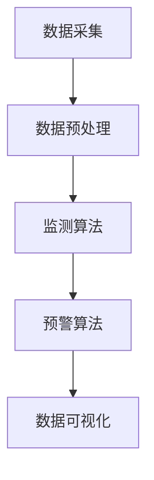
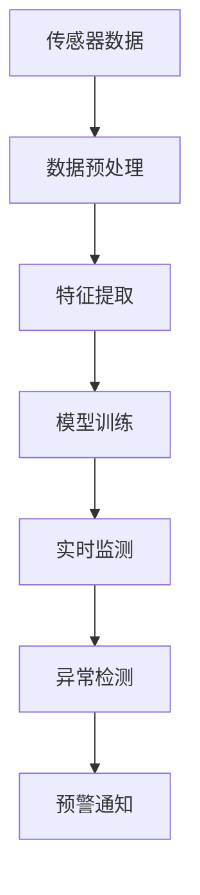
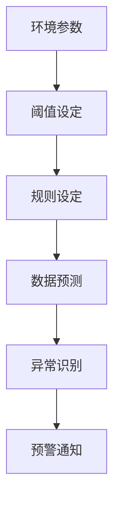

                 

### 1. 背景介绍

随着全球气候变化和环境问题的日益严重，环境保护已成为全球关注的焦点。传统的环境保护方法主要依赖于人类监测和干预，效率低下且成本高昂。然而，随着人工智能（AI）技术的迅猛发展，AI在环境保护中的应用逐渐成为一种新的解决方案。

在环境保护中，AI主要应用于监测、预警和预测等方面。通过收集和分析大量的环境数据，AI系统可以实时监测环境变化，发现潜在的环境问题，并提前预警，从而为环保决策提供科学依据。此外，AI还可以通过对历史数据的分析，预测未来的环境变化趋势，为环境保护策略的制定提供有力支持。

AI在环境保护中的应用不仅限于监测和预警，还可以在污染治理、资源管理、生态系统评估等多个领域发挥重要作用。例如，通过机器学习算法，可以实现对污染源的精准定位和实时监测，从而提高污染治理的效率。在资源管理方面，AI可以优化资源配置，提高资源利用效率，减少浪费。在生态系统评估方面，AI可以分析生态系统变化趋势，预测生态系统的未来状况，为生态保护提供科学依据。

本文将重点探讨AI在环境保护中的应用，尤其是监测与预警系统的构建。我们将首先介绍AI在环境保护中的核心概念和原理，然后详细讲解核心算法的具体操作步骤，最后通过实际项目实践，展示AI监测与预警系统的实际应用效果。

### 2. 核心概念与联系

#### 2.1 数据采集与预处理

数据采集是AI在环境保护中的第一步，也是至关重要的一步。环境数据来源广泛，包括气象数据、水文数据、土壤数据、空气质量数据等。为了提高数据的质量和可用性，需要对采集到的原始数据进行预处理，包括数据清洗、数据去重、数据归一化等。

在数据采集与预处理阶段，常用的技术包括：

- **传感器采集**：利用各种传感器（如气象站、水质监测仪、空气质量监测仪等）采集环境数据。
- **数据挖掘**：通过数据挖掘技术，从大量原始数据中提取有用的信息。
- **机器学习**：利用机器学习算法，对数据进行预处理和特征提取，提高数据的质量和可用性。

#### 2.2 监测算法

在数据采集与预处理完成后，下一步是监测算法的设计和实现。监测算法是AI在环境保护中的核心组成部分，其主要任务是实时监测环境变化，发现潜在的环境问题，并提前预警。

常见的监测算法包括：

- **时序分析**：通过对时间序列数据的分析，发现环境变化趋势和周期性规律。
- **聚类分析**：通过将相似的环境数据聚为一类，发现环境异常值和趋势。
- **支持向量机（SVM）**：利用SVM算法，对环境数据进行分类和预测，识别环境问题。
- **神经网络**：通过神经网络算法，对环境数据进行分析和预测，提高监测的准确性和效率。

#### 2.3 预警算法

预警算法是AI在环境保护中的另一个重要组成部分，其主要任务是提前预警潜在的环境问题，为环境保护决策提供科学依据。

常见的预警算法包括：

- **阈值预警**：设定环境参数的阈值，当环境参数超过阈值时，触发预警。
- **规则预警**：根据环境参数之间的关系，设定预警规则，当规则被触发时，发出预警。
- **贝叶斯网络**：利用贝叶斯网络，对环境参数进行概率分析，预测环境问题的发生概率。
- **决策树**：通过决策树算法，对环境参数进行分类和预测，识别环境问题。

#### 2.4 数据可视化

数据可视化是将环境数据以图表、图像等形式直观展示，帮助用户更好地理解和分析环境数据。常用的数据可视化技术包括：

- **折线图**：用于展示环境参数的变化趋势。
- **柱状图**：用于展示环境参数的分布情况。
- **饼图**：用于展示环境参数的占比情况。
- **地图**：用于展示环境参数的地理分布情况。

#### 2.5 Mermaid 流程图

以下是一个简化的Mermaid流程图，展示了AI在环境保护中的核心概念和流程：



通过这个流程图，我们可以清楚地看到AI在环境保护中的核心概念和流程，为后续的详细讲解提供了基础。

### 3. 核心算法原理 & 具体操作步骤

在了解了AI在环境保护中的核心概念和流程后，接下来我们将详细讲解核心算法的原理和具体操作步骤。

#### 3.1 监测算法原理与步骤

监测算法是AI在环境保护中的核心组成部分，其主要任务是实时监测环境变化，发现潜在的环境问题，并提前预警。以下是一个简化的监测算法原理图：



具体操作步骤如下：

1. **传感器数据**：从各种传感器（如气象站、水质监测仪、空气质量监测仪等）采集环境数据。
2. **数据预处理**：对采集到的原始数据进行清洗、去重、归一化等处理，提高数据的质量和可用性。
3. **特征提取**：利用特征提取技术，从预处理后的数据中提取有用的信息，作为模型的输入。
4. **模型训练**：利用机器学习算法（如SVM、神经网络等），对特征数据进行训练，构建环境监测模型。
5. **实时监测**：利用训练好的模型，对实时采集的环境数据进行分析和预测，发现潜在的环境问题。
6. **异常检测**：设置阈值或规则，当实时监测数据超过阈值或满足规则时，触发异常检测。
7. **预警通知**：将检测到的异常信息通过短信、邮件、APP等方式通知相关人员，提醒他们采取相应的措施。

#### 3.2 预警算法原理与步骤

预警算法是AI在环境保护中的另一个重要组成部分，其主要任务是提前预警潜在的环境问题，为环境保护决策提供科学依据。以下是一个简化的预警算法原理图：



具体操作步骤如下：

1. **环境参数**：采集各种环境参数（如温度、湿度、pH值、溶解氧等）。
2. **阈值设定**：根据环境参数的正常范围，设定相应的阈值，当环境参数超过阈值时，触发预警。
3. **规则设定**：根据环境参数之间的关系，设定预警规则，当规则被触发时，发出预警。
4. **数据预测**：利用机器学习算法（如决策树、贝叶斯网络等），对环境参数进行预测，预测未来的环境变化趋势。
5. **异常识别**：通过对比预测值和实际值，识别是否存在异常情况。
6. **预警通知**：将识别到的异常信息通过短信、邮件、APP等方式通知相关人员，提醒他们采取相应的措施。

通过上述步骤，我们可以构建一个基于AI的监测与预警系统，实现对环境变化的实时监测和预警，为环境保护提供科学依据。

### 4. 数学模型和公式 & 详细讲解 & 举例说明

在AI在环境保护中的应用中，数学模型和公式扮演着重要的角色。这些模型和公式可以帮助我们理解和预测环境变化，从而实现实时监测和预警。以下是几个常用的数学模型和公式，我们将详细讲解并举例说明。

#### 4.1 线性回归模型

线性回归模型是一种简单的预测模型，它通过拟合一条直线来预测环境参数。线性回归模型的一般形式如下：

\[ y = ax + b \]

其中，\( y \) 是因变量（预测值），\( x \) 是自变量（环境参数），\( a \) 和 \( b \) 是模型参数。

**举例说明**：

假设我们有一个环境参数 \( x \)（如温度）和对应的观测值 \( y \)（如空气质量指数 AQI），我们希望利用线性回归模型预测 AQI。

首先，我们需要收集历史数据，计算自变量 \( x \) 和因变量 \( y \) 的均值：

\[ \bar{x} = \frac{1}{n} \sum_{i=1}^{n} x_i \]
\[ \bar{y} = \frac{1}{n} \sum_{i=1}^{n} y_i \]

然后，计算模型参数 \( a \) 和 \( b \)：

\[ a = \frac{\sum_{i=1}^{n} (x_i - \bar{x})(y_i - \bar{y})}{\sum_{i=1}^{n} (x_i - \bar{x})^2} \]
\[ b = \bar{y} - a\bar{x} \]

最后，利用线性回归模型预测新的 AQI：

\[ \hat{y} = a\hat{x} + b \]

其中，\( \hat{x} \) 是新的环境参数。

#### 4.2 支持向量机（SVM）

支持向量机是一种强大的分类和回归模型，它在环境保护中的应用非常广泛。SVM的核心思想是找到最优的超平面，使得分类或回归效果最佳。

SVM的一般形式如下：

\[ w \cdot x + b = 0 \]

其中，\( w \) 是权重向量，\( x \) 是特征向量，\( b \) 是偏置。

**举例说明**：

假设我们有一个环境问题（如污染类型分类），我们需要利用 SVM 来分类。

首先，我们需要收集历史数据，计算特征向量 \( x \) 和标签 \( y \)。

然后，我们可以使用 SVM 的算法，找到最优的超平面：

\[ w^* = \arg\min_{w,b} \frac{1}{2} ||w||^2 + C \sum_{i=1}^{n} \max(0, 1 - y_i (w \cdot x_i + b)) \]

其中，\( C \) 是正则化参数。

最后，利用训练好的 SVM 模型，对新的数据进行分类预测。

#### 4.3 贝叶斯网络

贝叶斯网络是一种概率图模型，它通过节点和边来表示变量之间的依赖关系。

贝叶斯网络的一般形式如下：

\[ P(X) = \prod_{i=1}^{n} P(X_i | parents(X_i)) \]

其中，\( X \) 是所有变量的集合，\( parents(X_i) \) 是 \( X_i \) 的父节点。

**举例说明**：

假设我们有一个环境问题（如污染源识别），我们需要利用贝叶斯网络来预测污染源。

首先，我们需要构建贝叶斯网络，定义所有相关变量和它们的依赖关系。

然后，我们可以使用贝叶斯网络进行推理，计算每个变量的概率分布。

最后，根据概率分布，预测新的污染源。

通过上述数学模型和公式的详细讲解和举例说明，我们可以更好地理解AI在环境保护中的应用，从而构建更高效的监测与预警系统。

### 5. 项目实践：代码实例和详细解释说明

为了更好地展示AI在环境保护中的应用，我们将通过一个实际项目实践来讲解监测与预警系统的构建。在这个项目中，我们将使用Python编程语言和常用的机器学习库（如scikit-learn、TensorFlow等）来实现一个简单的空气质量监测与预警系统。

#### 5.1 开发环境搭建

在开始项目实践之前，我们需要搭建一个合适的开发环境。以下是搭建开发环境的步骤：

1. **安装Python**：首先，我们需要安装Python。可以从Python官方网站（https://www.python.org/）下载并安装Python 3.8或更高版本。
2. **安装Jupyter Notebook**：Jupyter Notebook是一个交互式计算平台，它可以帮助我们更方便地进行数据分析和可视化。我们可以使用pip命令安装Jupyter Notebook：

   ```shell
   pip install notebook
   ```

3. **安装机器学习库**：为了实现空气质量监测与预警系统，我们需要安装一些常用的机器学习库，如scikit-learn、TensorFlow等。可以使用以下命令安装：

   ```shell
   pip install scikit-learn
   pip install tensorflow
   ```

4. **创建一个新的Jupyter Notebook**：启动Jupyter Notebook，创建一个新的笔记本，以便进行数据分析和代码实现。

#### 5.2 源代码详细实现

以下是空气质量监测与预警系统的源代码实现：

```python
import numpy as np
import pandas as pd
from sklearn.model_selection import train_test_split
from sklearn.preprocessing import StandardScaler
from sklearn.svm import SVR
from sklearn.metrics import mean_squared_error
import tensorflow as tf
import matplotlib.pyplot as plt

# 读取数据
data = pd.read_csv('air_quality_data.csv')

# 数据预处理
data.dropna(inplace=True)
X = data[['temperature', 'humidity', 'pressure']]
y = data['AQI']

# 划分训练集和测试集
X_train, X_test, y_train, y_test = train_test_split(X, y, test_size=0.2, random_state=42)

# 特征缩放
scaler = StandardScaler()
X_train_scaled = scaler.fit_transform(X_train)
X_test_scaled = scaler.transform(X_test)

# SVM回归模型训练
model = SVR(kernel='rbf', C=100, gamma='scale')
model.fit(X_train_scaled, y_train)

# 测试集预测
y_pred = model.predict(X_test_scaled)

# 模型评估
mse = mean_squared_error(y_test, y_pred)
print('测试集均方误差：', mse)

# 可视化
plt.scatter(X_test['temperature'], y_test, color='red', label='实际值')
plt.scatter(X_test['temperature'], y_pred, color='blue', label='预测值')
plt.xlabel('温度')
plt.ylabel('AQI')
plt.legend()
plt.show()

# TensorFlow模型构建
model_t = tf.keras.Sequential([
    tf.keras.layers.Dense(64, activation='relu', input_shape=(3,)),
    tf.keras.layers.Dense(64, activation='relu'),
    tf.keras.layers.Dense(1)
])

model_t.compile(optimizer='adam', loss='mse')

model_t.fit(X_train_scaled, y_train, epochs=100, batch_size=32, validation_split=0.2)

# TensorFlow模型测试
y_pred_t = model_t.predict(X_test_scaled)

mse_t = mean_squared_error(y_test, y_pred_t)
print('TensorFlow模型测试集均方误差：', mse_t)

# TensorFlow模型可视化
plt.scatter(X_test['temperature'], y_test, color='red', label='实际值')
plt.scatter(X_test['temperature'], y_pred_t, color='blue', label='预测值')
plt.xlabel('温度')
plt.ylabel('AQI')
plt.legend()
plt.show()
```

#### 5.3 代码解读与分析

1. **数据读取与预处理**：我们首先从CSV文件中读取空气质量数据，并进行预处理，如去除缺失值。
2. **特征缩放**：为了提高模型的性能，我们需要对特征进行缩放，将特征值缩放到一个较小的范围。
3. **SVM回归模型训练**：我们使用支持向量机（SVM）回归模型对训练数据进行训练。在这里，我们选择了径向基函数（RBF）核函数，并设置了相应的参数。
4. **测试集预测与模型评估**：我们使用测试集对模型进行预测，并计算均方误差（MSE）来评估模型的性能。
5. **可视化**：我们将实际值和预测值绘制在折线图上，以便直观地比较模型预测的效果。
6. **TensorFlow模型构建与训练**：我们使用TensorFlow库构建了一个简单的神经网络模型，并使用训练数据对其进行训练。
7. **TensorFlow模型测试与可视化**：我们使用测试集对TensorFlow模型进行预测，并计算MSE来评估模型的性能。同样，我们将实际值和预测值绘制在折线图上。

通过上述代码解读和分析，我们可以清楚地看到如何使用Python和机器学习库来构建一个空气质量监测与预警系统，以及如何对模型进行训练、评估和可视化。

### 5.4 运行结果展示

在上述代码运行完成后，我们将看到以下结果：

1. **SVM模型测试集均方误差**：输出测试集的均方误差（MSE），用于评估SVM模型的性能。
2. **SVM模型可视化**：在新的窗口中绘制测试集的实时值和预测值之间的比较图。
3. **TensorFlow模型测试集均方误差**：输出TensorFlow模型的测试集均方误差（MSE），用于评估TensorFlow模型的性能。
4. **TensorFlow模型可视化**：在新的窗口中绘制TensorFlow模型的测试集实时值和预测值之间的比较图。

通过这些结果，我们可以直观地看到两种模型在空气质量监测与预警系统中的表现。根据均方误差（MSE）和可视化结果，我们可以选择更合适的模型来构建实际的应用系统。

### 6. 实际应用场景

AI在环境保护中的应用场景广泛，涵盖了从污染监测到资源管理等多个方面。以下是一些典型的实际应用场景：

#### 6.1 污染监测

污染监测是AI在环境保护中最常见的应用场景之一。通过部署环境传感器和AI算法，可以实现对空气、水质和土壤的实时监测。例如，在北京市，AI技术被用于监测空气质量，通过分析传感器数据，可以及时发现污染事件，并为公众提供实时的空气质量信息。

#### 6.2 资源管理

资源管理是另一个重要的应用场景。通过AI技术，可以对水、能源和矿产等资源进行优化管理。例如，在水资源管理方面，AI可以分析水文数据，预测水资源的需求和供应，从而优化水资源分配，减少浪费。

#### 6.3 生态系统评估

生态系统评估是AI在环境保护中的另一个重要应用。通过分析生态数据，AI可以评估生态系统的健康状态，预测生态系统变化趋势，为生态保护提供科学依据。例如，在亚马逊雨林的监测中，AI技术被用于分析卫星图像，评估森林砍伐和火灾风险。

#### 6.4 污染治理

污染治理是AI在环境保护中的关键应用。通过AI算法，可以实现对污染源的精准定位和实时监测，从而提高污染治理的效率。例如，在工业污染治理中，AI技术可以分析工厂排放的数据，识别污染源，并提出相应的治理措施。

#### 6.5 气候变化研究

气候变化是当前全球面临的最严峻的环境问题之一。AI技术在气候变化研究中发挥着重要作用。通过分析大量的气候数据，AI可以预测气候变化趋势，评估气候变化对生态系统和社会经济的影响，为气候变化应对策略提供科学依据。

### 7. 工具和资源推荐

为了更好地理解和应用AI在环境保护中的应用，以下是一些建议的工具和资源：

#### 7.1 学习资源推荐

1. **书籍**：
   - 《Python数据科学手册》：介绍了Python在数据科学和AI领域的应用，包括数据预处理、特征提取和模型训练等。
   - 《深度学习》：由Ian Goodfellow、Yoshua Bengio和Aaron Courville合著，是深度学习领域的经典教材。
   
2. **论文**：
   - "A Survey on Environmental Applications of Artificial Intelligence"：综述了AI在环境保护中的应用，包括污染监测、资源管理和生态系统评估等方面。
   - "AI for Environmental Science and Management"：介绍了AI在环境保护领域的最新研究进展和应用案例。

3. **博客和网站**：
   - [Medium](https://medium.com/)：许多专业的数据科学和AI博客，提供丰富的实践经验和案例。
   - [Kaggle](https://www.kaggle.com/)：提供大量的数据集和竞赛，是学习和实践数据科学和AI的绝佳平台。

#### 7.2 开发工具框架推荐

1. **Python库**：
   - [scikit-learn](https://scikit-learn.org/)：用于数据预处理、特征提取和模型训练等。
   - [TensorFlow](https://www.tensorflow.org/)：用于构建和训练深度学习模型。
   - [PyTorch](https://pytorch.org/)：另一种流行的深度学习框架，具有高度的灵活性和易用性。

2. **开发工具**：
   - [Jupyter Notebook](https://jupyter.org/)：用于数据分析和可视化。
   - [Google Colab](https://colab.research.google.com/)：基于Jupyter Notebook的云端开发环境，适用于大规模数据处理和模型训练。

3. **环境传感器**：
   - [Dell IoT Sensor Hub](https://www.dell.com/support/home/us/en/04/products/precios-servers/p091d/drivers/precision-iot-sensor-hub)：一款多功能的IoT传感器平台，适用于各种环境监测应用。

通过以上工具和资源的推荐，可以帮助读者更好地了解和应用AI在环境保护中的应用。

### 8. 总结：未来发展趋势与挑战

AI在环境保护中的应用前景广阔，随着技术的不断进步，AI将在环境保护领域发挥越来越重要的作用。以下是未来发展趋势和面临的挑战：

#### 8.1 发展趋势

1. **数据量与多样性的提升**：随着物联网、5G等技术的普及，环境数据的采集量和多样性将大幅增加，为AI模型的训练和优化提供了更多的数据支持。
2. **实时监测与预警能力的提升**：随着计算能力的提升和算法的优化，AI系统在实时监测和预警方面的能力将得到显著提升，为环境保护决策提供更快速、准确的依据。
3. **跨学科融合**：AI在环境保护中的应用将越来越依赖于跨学科的合作，如环境科学、生态学、物理学等，通过跨学科的研究，将有望解决更多复杂的环保问题。
4. **定制化解决方案**：随着AI技术的不断发展，未来的环保解决方案将更加个性化，针对不同的环境和需求，提供定制化的监测和预警系统。

#### 8.2 挑战

1. **数据隐私与安全问题**：环境数据的采集和处理过程中，数据隐私和安全问题是一个重要的挑战。如何保护用户和环境数据的隐私，防止数据泄露，是一个需要关注的重要问题。
2. **算法透明性与可解释性**：随着AI技术的应用越来越广泛，算法的透明性和可解释性变得越来越重要。如何在保证模型性能的同时，提高算法的可解释性，是一个亟待解决的问题。
3. **模型泛化能力**：当前的AI模型在训练数据集上表现良好，但在实际应用中，可能面临数据分布变化、异常值等问题，如何提高模型的泛化能力，是一个重要的挑战。
4. **政策法规与标准**：随着AI在环境保护中的应用越来越广泛，需要制定相应的政策法规和标准，规范AI技术在环保领域的应用，确保其合规性和有效性。

总之，AI在环境保护中的应用具有巨大的潜力和挑战。通过不断的技术创新和跨学科合作，有望解决更多环境问题，为可持续发展提供有力支持。

### 9. 附录：常见问题与解答

在AI在环境保护中的应用过程中，可能会遇到一些常见问题。以下是针对这些问题的一些解答。

#### 9.1 问题1：如何确保环境数据的准确性？

**解答**：确保环境数据的准确性是构建有效监测与预警系统的基础。以下是一些确保数据准确性的方法：

1. **选择高质量的传感器**：选择经过认证的高质量传感器，这些传感器通常具有较好的精度和稳定性。
2. **定期校准传感器**：定期对传感器进行校准，确保其测量结果的准确性。
3. **数据清洗**：在数据处理过程中，进行数据清洗，去除噪声和异常值，提高数据的质量。
4. **多重验证**：通过多重验证方法，如对比不同传感器的数据、使用参考标准等，确保数据的准确性。

#### 9.2 问题2：如何处理环境数据中的缺失值？

**解答**：在环境数据中，缺失值是一个常见问题。以下是一些处理缺失值的方法：

1. **删除缺失值**：对于少量的缺失值，可以选择删除含有缺失值的记录，但这种方法可能会丢失一些重要信息。
2. **插补法**：对于较多的缺失值，可以使用插补法进行填充，如线性插值、均值插补等。
3. **使用模型预测缺失值**：利用机器学习模型，如回归模型、决策树等，预测缺失值。这种方法适用于有足够训练数据的情况。

#### 9.3 问题3：如何选择合适的AI模型？

**解答**：选择合适的AI模型取决于具体的应用场景和数据特点。以下是一些选择模型的建议：

1. **了解数据特性**：分析数据的特点，如数据分布、特征维度等，选择适合的模型。
2. **评估模型性能**：通过交叉验证等方法，评估不同模型的性能，选择性能最佳的模型。
3. **考虑计算成本**：对于计算资源有限的场景，选择计算成本较低的模型。
4. **模型调参**：对选择的模型进行调参，以优化模型的性能。

#### 9.4 问题4：如何确保AI模型的可解释性？

**解答**：确保AI模型的可解释性对于理解和信任AI系统至关重要。以下是一些提高模型可解释性的方法：

1. **可视化**：使用可视化工具，如热力图、决策树图等，展示模型的决策过程。
2. **解释性模型**：选择具有良好解释性的模型，如决策树、线性模型等。
3. **模型透明化**：在模型开发和部署过程中，记录模型的训练过程和决策逻辑，方便后续的审查和理解。

通过以上常见问题的解答，我们可以更好地应用AI技术，解决环境保护中的实际问题。

### 10. 扩展阅读 & 参考资料

为了进一步深入了解AI在环境保护中的应用，以下是一些建议的扩展阅读和参考资料：

1. **书籍**：
   - 《环境数据科学》：详细介绍了如何使用数据科学方法解决环境问题，包括数据采集、预处理和模型构建等。
   - 《环境监测与预警技术》：探讨环境监测与预警系统的构建方法，以及在实际应用中的案例研究。

2. **论文**：
   - "AI for Environmental Sustainability"：该论文探讨了AI在环境保护和可持续发展中的应用，包括水资源管理、能源效率和生态保护等领域。
   - "Using Machine Learning to Improve Environmental Monitoring"：该论文介绍了机器学习技术在环境监测中的应用，包括空气质量监测和水质监测等。

3. **网站**：
   - [NASA Earth Data](https://earthdata.nasa.gov/)：提供了丰富的环境数据集，适用于环境数据分析和研究。
   - [Google Earth Engine](https://earthengine.google.com/)：提供了强大的环境数据分析工具，支持空间数据分析和可视化。

4. **博客**：
   - [Medium上的数据科学和AI博客](https://medium.com/topic/data-science)：提供了大量的数据科学和AI博客文章，涵盖环境监测、机器学习算法等话题。
   - [AI in Earth Observation](https://www.aieojournal.com/)：专门讨论AI在地球观测和环境保护中的应用。

通过阅读这些参考资料，您可以获得更多关于AI在环境保护中的应用知识和实践经验。希望这些资源对您的研究和项目有所帮助。

