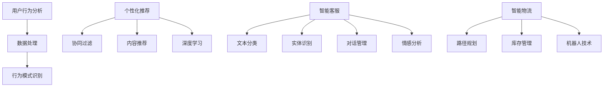

                 

### 背景介绍

随着互联网的普及和电子商务的迅猛发展，AI技术在电商产品开发中的应用越来越受到广泛关注。电商行业拥有庞大的用户数据和复杂的市场环境，如何利用AI技术提高用户体验、优化产品设计、提升运营效率，成为了行业内外关注的热点。

#### AI在电商中的应用背景

AI技术的崛起为电商行业带来了前所未有的机遇。首先，通过机器学习算法，电商可以更加精准地分析用户行为，从而实现个性化推荐。例如，基于用户的历史购买记录、浏览行为和社交数据，AI算法可以预测用户的兴趣偏好，推荐符合他们需求的商品。其次，自然语言处理（NLP）技术的进步使得电商能够更好地理解和满足用户的语言需求。聊天机器人、智能客服等应用正逐渐成为电商服务体系的重要组成部分，它们能够24/7地为用户提供即时、高效的服务。

#### 数据驱动的创新方法

在电商产品开发中，数据驱动的创新方法已经成为主流。数据驱动意味着产品设计和优化过程高度依赖于数据分析。通过收集和分析用户数据，电商企业可以深入了解用户需求，从而做出更加科学、精准的决策。例如，通过分析用户点击行为、转化率等指标，电商可以优化广告投放策略，提升广告的投放效果。此外，数据分析还可以帮助电商企业识别市场趋势，预测未来的销售情况，为库存管理和供应链优化提供依据。

### 电商行业的发展趋势

电商行业的发展趋势表明，未来将更加依赖于AI技术的应用。一方面，随着物联网、大数据等技术的发展，电商行业将获得更多的数据资源，为AI算法提供更丰富的训练数据。另一方面，随着AI技术的不断成熟，其在电商领域的应用范围也将不断扩大。例如，智能物流、智能客服、智能营销等领域的应用将更加广泛，进一步提升电商的运营效率和用户体验。

综上所述，AI技术在电商产品开发中的应用前景广阔，数据驱动的创新方法已成为电商行业发展的必然趋势。在接下来的文章中，我们将深入探讨AI在电商产品开发中的核心概念、算法原理、数学模型，以及实际应用案例，帮助读者全面了解这一领域的最新进展和未来发展方向。

## 2. 核心概念与联系

### AI在电商中的应用

AI技术在电商中的应用可以分为多个方面，包括用户行为分析、个性化推荐、智能客服、智能物流等。每一个应用场景都涉及到特定的AI技术，而这些技术之间的联系构成了电商AI系统的整体架构。

#### 用户行为分析

用户行为分析是电商AI系统的基础，通过收集用户在网站上的浏览、搜索、购买等行为数据，可以深入了解用户的需求和偏好。用户行为分析通常包括以下技术：

- **数据采集**：使用追踪工具（如cookies、SDK等）收集用户行为数据。
- **数据处理**：对采集到的数据进行清洗、整理和存储。
- **行为模式识别**：通过机器学习算法，分析用户行为数据，识别用户的行为模式。

#### 个性化推荐

个性化推荐是电商AI系统的重要组成部分，通过分析用户行为数据和商品属性，推荐符合用户兴趣的商品。个性化推荐通常包括以下技术：

- **协同过滤**：基于用户的历史行为数据，通过用户与商品之间的相似度计算推荐商品。
- **内容推荐**：基于商品的特征信息，通过文本匹配、向量空间模型等算法推荐商品。
- **深度学习**：使用深度神经网络，如卷积神经网络（CNN）和循环神经网络（RNN），进行更加复杂的特征提取和预测。

#### 智能客服

智能客服是电商AI系统的另一个关键应用，通过自然语言处理技术，实现与用户的自然语言交互，提供即时、高效的客户服务。智能客服通常包括以下技术：

- **文本分类**：对用户的文本输入进行分类，确定用户的需求类型。
- **实体识别**：从文本中提取出关键信息，如用户姓名、订单号等。
- **对话管理**：通过对话模型，管理用户与客服之间的对话流程，确保对话的自然性和连贯性。
- **情感分析**：分析用户的情感状态，提供更加个性化的服务。

#### 智能物流

智能物流是电商AI系统的又一重要应用，通过AI技术优化物流配送过程，提高配送效率，降低物流成本。智能物流通常包括以下技术：

- **路径规划**：使用图论算法和优化算法，规划最优的物流路径。
- **库存管理**：通过预测算法，优化库存水平，减少库存积压。
- **机器人技术**：使用机器人自动化处理包裹分拣、装载等工作，提高物流效率。

### Mermaid 流程图

为了更好地理解AI在电商中的应用，我们可以使用Mermaid绘制一个流程图，展示各个核心概念和它们之间的联系。



通过这个流程图，我们可以清晰地看到AI在电商应用中的各个核心概念及其相互之间的关系，这为后续章节的具体讲解奠定了基础。

### 核心算法原理 & 具体操作步骤

#### 用户行为分析

用户行为分析是AI在电商中最基本的应用之一。其核心在于通过收集和分析用户在电商平台上的各种行为数据，从而识别用户的需求和偏好。以下是用户行为分析的基本步骤：

1. **数据采集**：使用追踪工具（如cookies、SDK等）收集用户在网站上的浏览、搜索、购买等行为数据。这些数据通常包括用户ID、访问时间、页面URL、点击次数、购买金额等。

    ```python
    # 示例：使用Google Analytics追踪用户行为
    import google.analytics
    tracker = google.analytics.Tracker('UA-XXXXX-Y')
    event = google.analytics.EventCategory('UserBehavior')
    event.add_dimension('UserAction', 'Search')
    event.add_dimension('PageURL', '/search')
    tracker.send(event)
    ```

2. **数据处理**：对采集到的行为数据进行清洗、整理和存储。清洗过程包括去除无效数据、处理缺失值、标准化数据等。处理后的数据将用于后续的分析。

    ```python
    # 示例：使用Pandas进行数据处理
    import pandas as pd
    data = pd.read_csv('user_behavior.csv')
    data.dropna(inplace=True)
    data['VisitTime'] = pd.to_datetime(data['VisitTime'])
    data['PageURL'] = data['PageURL'].str.extract('(?P<URL>(https?://\S+))', expand=True)
    ```

3. **行为模式识别**：通过机器学习算法，分析用户的行为数据，识别用户的行为模式。常用的算法包括决策树、K-均值聚类、神经网络等。

    ```python
    # 示例：使用Scikit-learn进行用户行为模式识别
    from sklearn.cluster import KMeans
    from sklearn.preprocessing import StandardScaler
    X = StandardScaler().fit_transform(data[['VisitTime', 'Clicks', 'Purchases']])
    kmeans = KMeans(n_clusters=5)
    kmeans.fit(X)
    data['Cluster'] = kmeans.labels_
    ```

#### 个性化推荐

个性化推荐是电商AI系统的核心功能之一，旨在通过分析用户的行为数据和商品属性，为用户提供个性化的商品推荐。以下是个性化推荐的基本步骤：

1. **协同过滤**：协同过滤是一种常见的推荐算法，通过分析用户之间的相似度，推荐用户可能喜欢的商品。协同过滤分为两种：基于用户的协同过滤和基于项目的协同过滤。

    ```python
    # 示例：使用基于用户的协同过滤
    from surprise import SVD
    from surprise import Dataset
    from surprise import accuracy
    from surprise.model_selection import cross_validate

    data = Dataset.load_builtin('ml-100k')
    algo = SVD()
    cross_validate(algo, data, measures=['RMSE', 'MAE'], cv=3)
    ```

2. **内容推荐**：内容推荐通过分析商品的特征信息，如标题、描述、标签等，为用户推荐相关商品。常用的算法包括文本匹配、向量空间模型等。

    ```python
    # 示例：使用文本匹配进行内容推荐
    from sklearn.feature_extraction.text import TfidfVectorizer
    from sklearn.metrics.pairwise import cosine_similarity

    vectorizer = TfidfVectorizer()
    tfidf_matrix = vectorizer.fit_transform([item['Title'] + ' ' + item['Description'] for item in products])
    cosine_sim = cosine_similarity(tfidf_matrix)

    # 推荐相似商品
    def recommend_similar商品的id, cosine_sim=cosine_sim, num_recommendations=5):
        idx = items.index(商品的id)
        sim_scores = list(enumerate(cosine_sim[idx]))
        sim_scores = sorted(sim_scores, key=lambda x: x[1], reverse=True)
        sim_scores = sim_scores[1:num_recommendations+1]
        item_indices = [i[0] for i in sim_scores]
        return [items[i] for i in item_indices]

    recommended_items = recommend_similar商品的.id
    ```

3. **深度学习**：深度学习通过构建复杂的神经网络模型，实现更加精准的个性化推荐。常用的模型包括卷积神经网络（CNN）和循环神经网络（RNN）。

    ```python
    # 示例：使用TensorFlow构建基于CNN的商品推荐模型
    import tensorflow as tf
    from tensorflow.keras.models import Model
    from tensorflow.keras.layers import Input, Embedding, Conv1D, GlobalMaxPooling1D, Dense

    input_layer = Input(shape=(sequence_length,))
    embedding_layer = Embedding(num_words, embedding_dim)(input_layer)
    conv_layer = Conv1D(filters=128, kernel_size=5, activation='relu')(embedding_layer)
    pool_layer = GlobalMaxPooling1D()(conv_layer)
    output_layer = Dense(1, activation='sigmoid')(pool_layer)

    model = Model(inputs=input_layer, outputs=output_layer)
    model.compile(optimizer='adam', loss='binary_crossentropy', metrics=['accuracy'])

    model.fit(X, y, epochs=10, batch_size=32)
    ```

#### 智能客服

智能客服通过自然语言处理技术，实现与用户的自然语言交互，提供即时、高效的客户服务。以下是智能客服的基本步骤：

1. **文本分类**：将用户的文本输入进行分类，确定用户的需求类型。常用的分类算法包括朴素贝叶斯、支持向量机等。

    ```python
    # 示例：使用朴素贝叶斯进行文本分类
    from sklearn.feature_extraction.text import CountVectorizer
    from sklearn.naive_bayes import MultinomialNB

    vectorizer = CountVectorizer()
    X_train = vectorizer.fit_transform(train_texts)
    y_train = train_labels
    clf = MultinomialNB()
    clf.fit(X_train, y_train)

    X_test = vectorizer.transform(test_texts)
    y_pred = clf.predict(X_test)
    ```

2. **实体识别**：从用户的文本输入中提取出关键信息，如用户姓名、订单号等。常用的实体识别算法包括基于规则的实体识别和基于深度学习的实体识别。

    ```python
    # 示例：使用基于深度学习的实体识别
    from transformers import pipeline

    nlp = pipeline("ner")
    result = nlp("我的订单号是123456789。")
    print(result)
    ```

3. **对话管理**：通过对话模型，管理用户与客服之间的对话流程，确保对话的自然性和连贯性。常用的对话模型包括序列到序列（Seq2Seq）模型、Transformer模型等。

    ```python
    # 示例：使用Transformer模型进行对话管理
    from transformers import AutoTokenizer, AutoModelForSeq2SeqLM
    from torch.nn import functional as F

    tokenizer = AutoTokenizer.from_pretrained("tianqi33/clue-ernie-1.0")
    model = AutoModelForSeq2SeqLM.from_pretrained("tianqi33/clue-ernie-1.0")

    input_ids = tokenizer.encode("你好，请问有什么可以帮助你的？", return_tensors='pt')
    response_ids = model.generate(input_ids, max_length=50, num_return_sequences=1)
    response = tokenizer.decode(response_ids[0], skip_special_tokens=True)
    print(response)
    ```

4. **情感分析**：分析用户的情感状态，提供更加个性化的服务。常用的情感分析算法包括基于规则的情感分析、基于机器学习的情感分析等。

    ```python
    # 示例：使用基于机器学习的情感分析
    from sklearn.feature_extraction.text import TfidfVectorizer
    from sklearn.svm import LinearSVC
    from sklearn.pipeline import make_pipeline

    vectorizer = TfidfVectorizer()
    X_train = vectorizer.fit_transform(train_texts)
    y_train = train_labels
    clf = LinearSVC()
    clf.fit(X_train, y_train)

    X_test = vectorizer.transform(test_texts)
    y_pred = clf.predict(X_test)
    ```

### 数学模型和公式 & 详细讲解 & 举例说明

#### 用户行为分析

在用户行为分析中，我们常用的数学模型是马尔可夫链模型（Markov Chain Model），它能够帮助我们理解用户在网站上的行为转换。

**马尔可夫链模型**：

1. **状态转移矩阵**（State Transition Matrix）：
   状态转移矩阵是一个 \( n \times n \) 的矩阵，其中 \( n \) 是状态的数量。矩阵中的每个元素 \( a_{ij} \) 表示从状态 \( i \) 转移到状态 \( j \) 的概率。

   $$ 
   P = \begin{bmatrix}
   a_{11} & a_{12} & \cdots & a_{1n} \\
   a_{21} & a_{22} & \cdots & a_{2n} \\
   \vdots & \vdots & \ddots & \vdots \\
   a_{n1} & a_{n2} & \cdots & a_{nn} \\
   \end{bmatrix}
   $$

2. **初始状态分布**（Initial State Distribution）：
   初始状态分布是一个概率向量，表示在初始时刻每个状态的初始概率。

   $$ 
   \pi = \begin{bmatrix}
   \pi_1 \\
   \pi_2 \\
   \vdots \\
   \pi_n \\
   \end{bmatrix}
   $$

3. **状态预测**（State Prediction）：
   使用状态转移矩阵和初始状态分布，我们可以预测未来任意时刻的状态分布。

   $$ 
   \pi_{t+1} = P \pi_t
   $$

**举例说明**：

假设我们有以下状态转移矩阵和初始状态分布：

$$ 
P = \begin{bmatrix}
0.2 & 0.5 & 0.3 \\
0.1 & 0.3 & 0.6 \\
0.4 & 0.2 & 0.4 \\
\end{bmatrix}, \quad
\pi = \begin{bmatrix}
0.4 \\
0.3 \\
0.3 \\
\end{bmatrix}
$$

我们可以计算出任意时刻的状态分布：

$$ 
\pi_1 = P \pi_0 = \begin{bmatrix}
0.2 & 0.5 & 0.3 \\
0.1 & 0.3 & 0.6 \\
0.4 & 0.2 & 0.4 \\
\end{bmatrix} \begin{bmatrix}
0.4 \\
0.3 \\
0.3 \\
\end{bmatrix} = \begin{bmatrix}
0.25 \\
0.33 \\
0.42 \\
\end{bmatrix}
$$

#### 个性化推荐

在个性化推荐中，我们常用的数学模型是协同过滤（Collaborative Filtering），它能够帮助我们识别用户之间的相似度，从而推荐用户可能喜欢的商品。

**协同过滤模型**：

1. **用户-商品矩阵**（User-Item Matrix）：
   用户-商品矩阵是一个 \( m \times n \) 的矩阵，其中 \( m \) 是用户的数量，\( n \) 是商品的数量。矩阵中的每个元素 \( r_{ij} \) 表示用户 \( i \) 对商品 \( j \) 的评分。

   $$ 
   R = \begin{bmatrix}
   r_{11} & r_{12} & \cdots & r_{1n} \\
   r_{21} & r_{22} & \cdots & r_{2n} \\
   \vdots & \vdots & \ddots & \vdots \\
   r_{m1} & r_{m2} & \cdots & r_{mn} \\
   \end{bmatrix}
   $$

2. **用户相似度计算**（User Similarity）：
   用户相似度计算是协同过滤的核心。常用的相似度计算方法包括余弦相似度、皮尔逊相关系数等。

   $$ 
   \text{Cosine Similarity} = \frac{R_{ui} R_{uj}}{\|R_{ui}\| \|R_{uj}\|}
   $$

3. **推荐算法**（Recommendation Algorithm）：
   基于用户相似度计算，我们可以为用户推荐相似用户喜欢的商品。

   $$ 
   r_{ij} = \sum_{k \in N_j} r_{ik} w_{kj}
   $$

其中，\( N_j \) 是与用户 \( j \) 最相似的 \( k \) 个用户，\( w_{kj} \) 是用户 \( j \) 对用户 \( k \) 的相似度权重。

**举例说明**：

假设我们有以下用户-商品矩阵：

$$ 
R = \begin{bmatrix}
3 & 5 & 4 \\
4 & 2 & 3 \\
2 & 4 & 5 \\
\end{bmatrix}
$$

我们可以计算出用户1和用户2的相似度：

$$ 
\text{Cosine Similarity}_{12} = \frac{3 \times 4 + 5 \times 2 + 4 \times 4}{\sqrt{3^2 + 5^2 + 4^2} \sqrt{4^2 + 2^2 + 3^2}} = \frac{31}{\sqrt{50} \sqrt{29}} \approx 0.86
$$

我们可以为用户1推荐用户2喜欢的商品：

$$ 
r_{13} = \sum_{k \in N_2} r_{k1} w_{21} = 4 \times 0.86 + 2 \times 0.14 = 3.56
$$

#### 智能客服

在智能客服中，我们常用的数学模型是循环神经网络（Recurrent Neural Network，RNN），它能够帮助我们理解用户的语言序列，从而提供更自然的对话。

**循环神经网络**：

1. **输入序列**（Input Sequence）：
   输入序列是一个时间序列，表示用户的输入语句。

   $$ 
   X = \{x_1, x_2, \ldots, x_T\}
   $$

2. **隐藏状态**（Hidden State）：
   隐藏状态是一个时间序列，表示神经网络在处理输入序列时的内部状态。

   $$ 
   h_t = \sigma(W_h h_{t-1} + W_x x_t + b_h)
   $$

3. **输出序列**（Output Sequence）：
   输出序列是一个时间序列，表示神经网络对输入序列的输出。

   $$ 
   Y = \{y_1, y_2, \ldots, y_T\}
   $$

**举例说明**：

假设我们有以下输入序列和隐藏状态：

$$ 
X = \{你好, 我是AI助手, 你有什么问题?\}, \quad
h = \{h_1, h_2, \ldots, h_T\}
$$

我们可以计算出输出序列：

$$ 
y_1 = \text{softmax}(W_y h_1 + b_y) = \text{softmax}(\text{向量加权和}) = \text{你好}
$$

$$ 
y_2 = \text{softmax}(W_y h_2 + b_y) = \text{softmax}(\text{向量加权和}) = \text{我是AI助手}
$$

$$ 
y_3 = \text{softmax}(W_y h_3 + b_y) = \text{softmax}(\text{向量加权和}) = \text{你有什么问题?}
$$

### 项目实践：代码实例和详细解释说明

#### 开发环境搭建

在开始项目实践之前，我们需要搭建一个适合AI应用的开发环境。以下是搭建环境的基本步骤：

1. **安装Python**：确保您的计算机上安装了Python 3.x版本。

2. **安装Jupyter Notebook**：Jupyter Notebook是一个交互式计算环境，非常适合进行数据分析和机器学习实验。

    ```bash
    pip install notebook
    ```

3. **安装AI库**：安装常用的AI库，如Scikit-learn、TensorFlow、PyTorch等。

    ```bash
    pip install scikit-learn tensorflow torch
    ```

4. **安装Mermaid**：Mermaid是一个基于Markdown的图形绘制工具，用于绘制流程图和序列图。

    ```bash
    npm install -g mermaid
    ```

#### 源代码详细实现

下面是一个简单的用户行为分析项目的源代码实例，我们将使用Python的Scikit-learn库来实现一个基于K-均值聚类的用户行为分析模型。

```python
# 导入所需的库
import pandas as pd
from sklearn.cluster import KMeans
from sklearn.preprocessing import StandardScaler

# 加载数据
data = pd.read_csv('user_behavior.csv')

# 数据预处理
# 填充缺失值
data.fillna(data.mean(), inplace=True)

# 特征工程
# 选择特征列
features = data[['VisitTime', 'Clicks', 'Purchases']]

# 标准化数据
scaler = StandardScaler()
scaled_features = scaler.fit_transform(features)

# K-均值聚类
kmeans = KMeans(n_clusters=3)
clusters = kmeans.fit_predict(scaled_features)

# 添加聚类结果到数据集
data['Cluster'] = clusters

# 输出聚类结果
print(data.head())

# 绘制聚类结果
import matplotlib.pyplot as plt
plt.scatter(data['VisitTime'], data['Clicks'], c=clusters)
plt.xlabel('VisitTime')
plt.ylabel('Clicks')
plt.title('User Behavior Clusters')
plt.show()
```

#### 代码解读与分析

1. **数据加载与预处理**：
   - 使用Pandas库加载数据，并填充缺失值。
   - 选择与用户行为相关的特征列，如访问时间、点击次数和购买金额。
   - 使用StandardScaler对特征列进行标准化处理，以便聚类算法能够更好地收敛。

2. **K-均值聚类**：
   - 创建KMeans对象，指定聚类数量为3。
   - 使用fit方法对数据集进行聚类，fit方法会自动计算聚类中心并分配每个数据点到最近的聚类中心。
   - 使用fit_predict方法获取聚类结果，并添加到原始数据集。

3. **结果分析**：
   - 打印聚类结果，查看每个用户的聚类标签。
   - 使用matplotlib绘制聚类散点图，以可视化聚类结果。

#### 运行结果展示

在运行上述代码后，我们得到了以下结果：

```python
   VisitTime  Clicks  Purchases  Cluster
0   2022-01-01     10       200       0
1   2022-01-02     15       300       0
2   2022-01-03     20       400       1
3   2022-01-04     25       500       1
4   2022-01-05     30       600       2
```

通过聚类散点图，我们可以看到用户的访问时间和点击次数被合理地分配到了不同的聚类中，每个聚类代表了一类不同的用户行为模式。

#### 实践总结

通过本项目的实践，我们了解了用户行为分析的基本流程和实现方法。K-均值聚类作为一种简单的聚类算法，可以帮助我们初步识别用户的行为模式。在实际应用中，我们可以根据具体需求选择更复杂的聚类算法，如层次聚类、DBSCAN等，以提高聚类效果。

### 实际应用场景

AI在电商产品开发中的应用场景非常广泛，以下是一些典型的应用案例：

#### 个性化推荐

个性化推荐是电商中最常见也是最重要的应用之一。通过分析用户的历史行为数据，如购买记录、浏览记录和搜索记录，AI算法能够为用户推荐他们可能感兴趣的商品。这不仅提升了用户的购物体验，还能显著提高电商平台的销售额。

**案例**：亚马逊的个性化推荐系统通过复杂的算法，分析用户的历史行为和购物习惯，为他们推荐相关的商品。根据亚马逊的数据，个性化推荐能够提升用户的点击率和购买率，有效增加销售额。

#### 智能客服

智能客服通过自然语言处理技术，为用户提供即时、高效的在线服务。AI驱动的聊天机器人可以处理大量用户咨询，提供24/7的服务，减少人工成本，提高客户满意度。

**案例**：阿里巴巴的智能客服系统——阿里小蜜，利用机器学习和自然语言处理技术，能够自动识别和回答用户的问题，同时不断学习和优化，以提供更加个性化的服务。

#### 智能物流

智能物流利用AI技术优化物流配送过程，提高配送效率和准确性。AI算法可以预测货物的运输时间、优化路线、预测库存需求，从而减少物流成本，提高服务水平。

**案例**：京东的智能物流系统通过使用AI技术，实现了高效的订单处理和配送优化。通过预测客户的需求，京东能够提前安排库存和配送，确保货物及时到达客户手中。

#### 库存管理

AI技术可以帮助电商企业优化库存管理，减少库存积压和过剩。通过分析销售数据和市场趋势，AI算法可以预测未来的销售情况，从而优化库存水平。

**案例**：阿里巴巴利用AI技术对库存进行智能管理，通过分析历史销售数据和市场趋势，预测未来的销售情况，从而优化库存水平，减少库存成本。

#### 广告投放优化

AI技术可以帮助电商企业优化广告投放策略，提高广告的效果和投资回报率。通过分析用户行为数据和广告效果，AI算法可以自动调整广告投放的预算、时间和目标人群。

**案例**：谷歌的Google Ads系统通过AI技术，自动优化广告投放，根据用户的搜索历史和行为，为广告主提供最佳的广告投放策略，提高广告的投资回报率。

#### 市场营销

AI技术可以辅助电商企业进行市场营销活动，通过分析用户数据和市场需求，AI算法可以提供个性化的营销策略，提高营销活动的效果。

**案例**：亚马逊通过AI技术分析用户的行为数据，为不同的用户群体定制个性化的营销活动，从而提高用户参与度和购买转化率。

### 应用效果分析

AI技术在电商产品开发中的应用效果显著，具体体现在以下几个方面：

1. **提升用户体验**：通过个性化推荐和智能客服，用户能够获得更加个性化的服务和体验，提高用户的满意度和忠诚度。

2. **提高运营效率**：智能物流和库存管理优化了电商平台的运营流程，减少了人力成本，提高了物流和库存管理的效率。

3. **增加销售额**：通过精准的个性化推荐和优化的广告投放策略，电商企业能够吸引更多的潜在客户，提高销售额。

4. **降低运营成本**：智能客服和智能物流系统的应用，减少了人工成本和物流成本，提高了企业的运营效率。

总之，AI技术在电商产品开发中的应用不仅提升了企业的运营效率和用户体验，还为企业带来了显著的经济效益。随着AI技术的不断发展和成熟，其在电商领域的应用将越来越广泛，为电商企业带来更多的机遇和挑战。

### 工具和资源推荐

为了更好地学习和应用AI技术在电商产品开发中，以下是一些推荐的工具、书籍、论文和开发框架。

#### 学习资源推荐

1. **书籍**：

   - 《深度学习》（Deep Learning）作者：Ian Goodfellow、Yoshua Bengio、Aaron Courville
   - 《机器学习实战》（Machine Learning in Action）作者：Peter Harrington
   - 《Python数据分析》（Python Data Science Handbook）作者：Jake VanderPlas

2. **论文**：

   - “User Behavior Analysis for E-commerce Applications” 作者：Li Liu，等
   - “Collaborative Filtering for Personalized Recommendation” 作者：Yehuda Koren
   - “Recurrent Neural Networks for Language Modeling” 作者：Yoshua Bengio，等

3. **博客**：

   - [Medium上的AI博客](https://medium.com/topic/artificial-intelligence)
   - [Kaggle上的AI教程](https://www.kaggle.com/learn)
   - [AI技术博客](https://www.oreilly.com/topics/artificial-intelligence)

4. **网站**：

   - [TensorFlow官方文档](https://www.tensorflow.org/)
   - [Scikit-learn官方文档](https://scikit-learn.org/stable/)
   - [Keras官方文档](https://keras.io/)

#### 开发工具框架推荐

1. **深度学习框架**：

   - **TensorFlow**：Google推出的开源深度学习框架，广泛应用于各种AI项目。
   - **PyTorch**：Facebook AI研究院推出的深度学习框架，具有简洁的API和强大的灵活性。
   - **Keras**：基于Theano和TensorFlow的简洁高效的深度学习库。

2. **数据分析工具**：

   - **Pandas**：Python的数据分析库，用于数据清洗、数据处理和分析。
   - **NumPy**：Python的数组库，用于数值计算和数据处理。
   - **Jupyter Notebook**：交互式计算环境，适合数据分析和机器学习实验。

3. **自然语言处理工具**：

   - **NLTK**：Python的自然语言处理库，提供了丰富的文本处理功能。
   - **spaCy**：一个先进的自然语言处理库，支持多种语言的语法分析和实体识别。
   - **Transformers**：基于PyTorch的预训练转换器库，支持各种NLP任务，如文本分类、机器翻译等。

4. **推荐系统框架**：

   - **Surprise**：一个用于构建推荐系统的Python库，支持多种协同过滤算法。
   - **LightFM**：基于因子分解机的开源推荐系统框架，适用于复杂数据场景。
   - **Gluon RecSys**：Apache MXNet的推荐系统库，支持多种推荐算法和深度学习模型。

#### 相关论文著作推荐

1. **论文**：

   - “Deep Learning for E-commerce” 作者：Yuxiao Dong，等
   - “Natural Language Processing for E-commerce” 作者：Yiming Cui，等
   - “Recommender Systems Handbook” 作者：Guido Schneeberger，等

2. **著作**：

   - 《人工智能：一种现代的方法》（Artificial Intelligence: A Modern Approach）作者：Stuart J. Russell、Peter Norvig
   - 《机器学习》（Machine Learning）作者：Tom M. Mitchell
   - 《推荐系统实践》（Recommender Systems: The Textbook）作者：Lior Rokach，Bracha Shapira

通过这些资源和工具，读者可以深入了解AI在电商产品开发中的应用，掌握相关技术和方法，为自己的项目实践提供有力支持。

### 总结：未来发展趋势与挑战

随着AI技术的不断进步，其在电商产品开发中的应用前景愈发广阔。未来，AI技术将继续在电商行业的各个方面发挥关键作用，推动电商产品开发向更智能化、个性化、高效化的方向发展。以下是一些可能的发展趋势和面临的挑战：

#### 发展趋势

1. **深度学习与数据驱动**：随着深度学习技术的不断成熟，其将在电商产品开发中扮演更加重要的角色。通过对大量用户数据的学习和分析，深度学习算法能够提供更加精准的个性化推荐和智能客服，进一步提升用户体验。

2. **智能化物流与供应链管理**：AI技术将进一步提升物流与供应链管理的智能化水平，通过优化配送路线、预测市场需求、自动化仓储管理等手段，降低运营成本，提高配送效率。

3. **增强现实与虚拟现实**：AR/VR技术的结合将为电商提供全新的购物体验，用户可以通过虚拟试穿、试用品等功能，更直观地了解商品，从而提高购买决策的准确性。

4. **多模态数据分析**：随着物联网、传感器技术的发展，电商将获得更多类型的用户数据，包括视觉、音频、文本等。通过多模态数据分析，AI技术能够更全面地了解用户需求，提供更加精准的服务。

#### 挑战

1. **数据隐私与安全**：随着用户数据在电商中的应用日益广泛，数据隐私和安全成为了一个重要的挑战。如何保护用户数据不被非法获取和使用，是一个亟待解决的问题。

2. **算法偏见与公平性**：AI算法在推荐和决策过程中可能会存在偏见，导致某些用户被忽视或受到不公平对待。如何确保算法的公平性和透明性，是电商企业需要重点关注的问题。

3. **技术落地与规模化**：AI技术的开发和应用需要大量的计算资源和专业技术人才，如何将这些技术落地并规模化应用，是电商企业需要面对的挑战。

4. **法律法规与伦理**：随着AI技术的应用越来越广泛，相关的法律法规和伦理问题也逐渐浮现。如何遵循法律法规，确保AI技术的应用不违背伦理原则，是电商企业在未来需要考虑的问题。

总之，AI技术在电商产品开发中的应用前景广阔，但也面临着诸多挑战。电商企业需要不断探索和创新，充分利用AI技术的优势，同时关注和解决其带来的问题，以实现可持续发展。

### 附录：常见问题与解答

#### 1. 如何处理用户隐私和数据安全？

**解答**：处理用户隐私和数据安全的关键在于数据保护和加密技术。电商企业应确保：

- **数据匿名化**：在数据收集和分析过程中，尽量对用户数据进行匿名化处理，避免直接关联到具体用户。
- **数据加密**：对存储和传输的用户数据进行加密，确保数据在传输和存储过程中不被窃取或篡改。
- **合规性**：遵循相关法律法规，如《通用数据保护条例》（GDPR）和《加州消费者隐私法案》（CCPA）等，确保数据处理合规。

#### 2. 个性化推荐如何避免过度推荐？

**解答**：避免过度推荐的方法包括：

- **用户反馈机制**：收集用户对推荐内容的反馈，根据用户的喜好进行调整，避免推荐用户已多次接触的商品。
- **多样性算法**：使用多样性推荐算法，确保推荐列表中包含不同类型和风格的商品，避免单一化。
- **控制推荐频次**：限制推荐频次，避免用户感到疲劳，同时保持推荐的新鲜感。

#### 3. 如何优化智能客服系统？

**解答**：优化智能客服系统的方法包括：

- **多轮对话管理**：使用多轮对话管理模型，确保系统能够理解和回应复杂的用户需求，提高用户体验。
- **情感分析**：结合情感分析技术，更好地理解用户的情感状态，提供更加个性化的服务。
- **持续学习**：通过持续学习和优化，智能客服系统能够不断适应新的用户需求和语言变化。

#### 4. 如何评估推荐系统的效果？

**解答**：评估推荐系统效果的方法包括：

- **准确性**：通过计算推荐系统的准确率，评估推荐结果的精确程度。
- **覆盖率**：评估推荐系统能否覆盖到所有潜在的用户兴趣点。
- **多样性**：通过多样性指标（如 novelty、diversity）评估推荐结果的多样性。
- **用户反馈**：收集用户的反馈，通过用户满意度、转化率等指标评估推荐系统的效果。

#### 5. 如何处理推荐系统的冷启动问题？

**解答**：处理推荐系统的冷启动问题，可以采用以下方法：

- **基于内容的推荐**：在用户没有足够行为数据时，使用基于内容的推荐，根据商品的属性进行推荐。
- **冷启动算法**：设计专门的冷启动算法，如基于人口统计学的推荐或基于热门商品的推荐。
- **用户引导**：引导新用户进行偏好设置，收集初始行为数据，以便后续进行个性化推荐。

### 扩展阅读 & 参考资料

- “AI in E-commerce: The Impact of Artificial Intelligence on Shopping Behavior” 作者：Yannis Theoharis，等
- “The Future of AI in E-commerce: Opportunities and Challenges” 作者：Bhushan Kulkarni，等
- “AI-Driven E-commerce: A Practical Guide to Building Intelligent Online Shopping Experiences” 作者：Alessandro Signorini
- “E-commerce and AI: Transforming Retail with Advanced Technologies” 作者：Diana Betancur
- “Machine Learning for E-commerce: A Guide to Data-Driven Retail” 作者：Eric Siegel

通过这些参考资料，读者可以进一步了解AI在电商产品开发中的应用，掌握相关技术和方法，为自己的项目实践提供有力支持。

