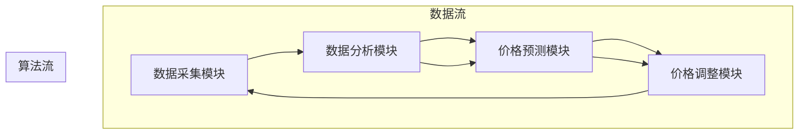

                 

### 1. 背景介绍

#### 1.1 电商行业的快速发展

随着互联网技术的迅猛发展，电子商务已经成为全球经济发展的重要驱动力之一。电商行业以其便捷性、快速性以及高度的个性化服务，逐渐改变了消费者的购物习惯。据统计，全球电商市场规模在过去几年中呈现出持续增长的态势，尤其是在新冠疫情期间，这一增长趋势更加显著。

电商平台的繁荣不仅吸引了大量的消费者，也吸引了众多企业的参与。在这个竞争激烈的市场中，如何通过有效的定价策略提升销售额、提高利润率，成为了电商平台面临的重要课题。

#### 1.2 动态定价的概念

动态定价，又称实时定价或弹性定价，是指根据市场供求关系、消费者行为、竞争对手策略等多种因素，实时调整商品的价格。与传统的静态定价模式相比，动态定价更加灵活，能够更好地适应市场变化，提高定价的精准度和竞争力。

动态定价的核心在于通过大数据分析和人工智能算法，实现对市场动态的实时捕捉和响应。这种方式不仅能够提高企业的利润率，还能够提升消费者的购物体验。

#### 1.3 动态定价在电商中的应用

在电商领域，动态定价已经被广泛应用于商品价格调整、库存管理、促销活动等多个环节。例如：

- **商品价格调整**：电商平台可以根据实时销售数据和用户行为，动态调整商品价格，以吸引消费者购买。
- **库存管理**：通过动态定价，电商平台能够更有效地管理库存，避免商品滞销或积压。
- **促销活动**：电商平台可以利用动态定价，设计更加灵活和有吸引力的促销活动，提高用户购买意愿。

总的来说，动态定价在电商中的应用，不仅提升了企业的运营效率，也增强了市场竞争力，为电商行业的发展注入了新的活力。

#### 1.4 动态定价的优势与挑战

**优势**：

- **提高利润率**：通过精准的价格调整，电商平台能够更有效地控制成本，提高利润率。
- **提升用户体验**：动态定价能够根据用户行为和偏好，提供个性化的价格，提升用户满意度。
- **增强竞争力**：动态定价能够实时响应市场变化，使电商平台在竞争激烈的市场中更具竞争力。

**挑战**：

- **技术门槛**：动态定价需要依赖复杂的数据分析和人工智能算法，对企业的技术能力有较高要求。
- **消费者心理**：消费者对动态定价可能存在误解，认为价格波动是平台不诚信的表现，影响用户体验。
- **法律合规**：动态定价可能涉及价格歧视、不公平竞争等问题，需要遵守相关法律法规。

综上所述，动态定价在电商中的应用，虽然具有明显的优势，但也面临着一定的挑战。如何在技术、用户体验和法律合规等方面找到平衡，是电商企业需要深入思考和解决的问题。

#### 1.5 本文结构

本文将从以下几个方面对动态定价在电商中的应用进行深入探讨：

1. **背景介绍**：回顾电商行业的发展历程和动态定价的概念。
2. **核心概念与联系**：详细阐述动态定价的核心概念和原理，并通过Mermaid流程图展示架构。
3. **核心算法原理 & 具体操作步骤**：分析动态定价算法的工作原理，并提供具体的操作步骤。
4. **数学模型和公式 & 详细讲解 & 举例说明**：介绍动态定价中的数学模型和公式，并通过实例进行详细讲解。
5. **项目实践：代码实例和详细解释说明**：通过实际代码实例，展示动态定价的实现过程，并进行详细解释。
6. **实际应用场景**：探讨动态定价在不同电商场景中的应用案例。
7. **工具和资源推荐**：推荐相关学习资源、开发工具和框架。
8. **总结：未来发展趋势与挑战**：总结动态定价在电商中的应用现状，并展望未来的发展趋势和挑战。
9. **附录：常见问题与解答**：回答读者可能遇到的常见问题。
10. **扩展阅读 & 参考资料**：提供更多深入学习的参考资料。

通过本文的探讨，希望能够帮助读者全面了解动态定价在电商中的应用，为其在电商领域的实际应用提供有益的参考。

### 2. 核心概念与联系

#### 2.1 动态定价的核心概念

动态定价，顾名思义，是指根据市场状况、消费者行为、库存水平等多种因素，实时调整商品的价格。动态定价的核心在于“实时”和“调整”，这意味着它需要依赖于强大的数据分析和人工智能算法来支持。

**核心概念包括**：

- **市场价格**：即某一商品在市场上的实际交易价格。
- **供需关系**：商品的需求量和供应量之间的关系，供需关系的变化直接影响市场价格。
- **消费者行为**：消费者在购物过程中的行为模式，包括购买时间、购买频率、购买偏好等。
- **竞争对手策略**：其他电商平台或商家在价格方面的策略，如价格折扣、促销活动等。
- **库存管理**：商品的库存水平，库存过多或过少都会影响定价策略。

**核心流程**：

1. **数据采集**：通过数据收集系统，实时获取市场数据、消费者行为数据和竞争对手策略数据。
2. **数据分析**：对采集到的数据进行分析，确定影响价格的关键因素。
3. **价格调整**：根据分析结果，实时调整商品的价格。
4. **反馈循环**：将调整后的价格反馈到市场中，继续收集新的数据，形成持续的反馈循环。

#### 2.2 动态定价的工作原理

动态定价的工作原理可以概括为以下几个步骤：

1. **数据采集**：通过大数据技术，实时采集与商品价格相关的各种数据，包括市场价格、供需关系、消费者行为、竞争对手策略等。
2. **数据分析**：利用人工智能算法，对采集到的数据进行分析，识别影响价格的关键因素，如消费者购买行为的变化、市场供需的变化、竞争对手的价格策略等。
3. **价格预测**：基于分析结果，利用机器学习算法对未来的市场价格进行预测。
4. **价格调整**：根据价格预测结果，动态调整商品的价格。这个过程中需要考虑多个因素，如消费者的购买意愿、竞争对手的价格策略、库存水平等。
5. **反馈与优化**：将调整后的价格反馈到市场中，通过持续的反馈和优化，不断调整和优化定价策略。

#### 2.3 动态定价的架构

动态定价的架构可以看作是一个闭环系统，其核心包括数据采集模块、数据分析模块、价格预测模块和价格调整模块。

**Mermaid 流程图**：



在这个流程图中，数据采集模块负责实时获取各种市场数据；数据分析模块对这些数据进行分析，识别关键因素；价格预测模块根据分析结果预测未来的市场价格；价格调整模块根据预测结果和实际市场情况调整商品价格。整个流程通过反馈和优化，实现动态定价的目标。

#### 2.4 动态定价与传统定价的区别

**传统定价**：

传统定价模式通常是基于固定成本和预期利润率来制定价格，其价格调整相对滞后，难以适应市场的实时变化。传统定价主要依赖于人工经验，价格调整的灵活性较低。

**动态定价**：

动态定价则通过大数据分析和人工智能算法，实时捕捉市场动态，根据消费者行为和竞争策略动态调整价格。动态定价具有高度的灵活性和精准度，能够更好地满足市场需求。

**主要区别**：

1. **价格调整的频率**：传统定价通常定期调整价格，而动态定价则可以实现实时调整。
2. **数据依赖**：传统定价主要依赖人工经验和市场预判，而动态定价依赖于大数据分析和人工智能算法。
3. **灵活性和精准度**：动态定价能够根据市场动态和消费者行为进行灵活调整，具有较高的精准度。

总的来说，动态定价相较于传统定价，具有更高的灵活性和精准度，能够更好地适应市场的变化，提高电商平台的竞争力。

#### 2.5 动态定价与传统定价的优劣分析

**优点**：

1. **提高利润率**：通过精准的价格调整，动态定价能够有效控制成本，提高利润率。
2. **提升用户体验**：动态定价能够根据消费者行为和偏好，提供个性化的价格，提升用户满意度。
3. **增强竞争力**：动态定价能够实时响应市场变化，使电商平台在竞争激烈的市场中更具竞争力。

**缺点**：

1. **技术门槛**：动态定价需要依赖复杂的数据分析和人工智能算法，对企业的技术能力有较高要求。
2. **消费者心理**：消费者对动态定价可能存在误解，认为价格波动是平台不诚信的表现，影响用户体验。
3. **法律合规**：动态定价可能涉及价格歧视、不公平竞争等问题，需要遵守相关法律法规。

综上所述，动态定价在电商中的应用，虽然具有明显的优势，但也面临着一定的挑战。电商企业需要在技术、用户体验和法律合规等方面找到平衡，才能充分发挥动态定价的潜力。

#### 2.6 动态定价的适用场景

动态定价适用于多种电商场景，以下是其中几个常见的应用场景：

1. **商品价格调整**：电商平台可以根据实时销售数据和用户行为，动态调整商品的价格，以吸引消费者购买。
2. **库存管理**：通过动态定价，电商平台能够更有效地管理库存，避免商品滞销或积压。
3. **促销活动**：电商平台可以利用动态定价，设计更加灵活和有吸引力的促销活动，提高用户购买意愿。
4. **需求预测**：动态定价可以通过分析历史数据和消费者行为，预测未来市场需求，从而调整价格策略。

总的来说，动态定价在电商中的应用，不仅提升了企业的运营效率，也增强了市场竞争力，为电商行业的发展注入了新的活力。

### 3. 核心算法原理 & 具体操作步骤

#### 3.1 动态定价算法的基本原理

动态定价算法的核心在于利用大数据分析和人工智能技术，实时捕捉市场动态，并根据这些动态调整商品价格。其基本原理可以概括为以下几个步骤：

1. **数据采集**：通过大数据技术，实时采集与商品价格相关的各种数据，包括市场价格、供需关系、消费者行为、竞争对手策略等。
2. **数据预处理**：对采集到的数据进行分析和处理，提取关键特征，如消费者购买时间、购买频率、市场价格变化等。
3. **模型训练**：利用机器学习算法，对预处理后的数据进行训练，构建预测模型。
4. **价格预测**：利用训练好的模型，对未来的市场价格进行预测。
5. **价格调整**：根据预测结果，动态调整商品的价格，以实现利润最大化或需求最大化。

#### 3.2 动态定价算法的具体操作步骤

1. **数据采集**：
   - **市场价格**：通过电商平台、第三方数据平台等获取实时市场价格数据。
   - **供需关系**：通过电商平台的销售数据、库存数据等获取供需关系信息。
   - **消费者行为**：通过用户行为数据、购物车数据、点击量等获取消费者行为信息。
   - **竞争对手策略**：通过竞争对手的价格数据、促销活动等获取竞争对手策略信息。

2. **数据预处理**：
   - **数据清洗**：去除重复数据、异常数据等，保证数据质量。
   - **特征提取**：提取关键特征，如消费者购买时间、购买频率、市场价格变化等。
   - **数据归一化**：对数据进行归一化处理，使其在同一量级上，便于模型训练。

3. **模型训练**：
   - **选择模型**：根据业务需求和数据特点，选择合适的机器学习模型，如线性回归、决策树、神经网络等。
   - **模型训练**：利用预处理后的数据进行模型训练，优化模型参数。
   - **模型验证**：通过交叉验证等方式验证模型性能，调整模型参数。

4. **价格预测**：
   - **预测生成**：利用训练好的模型，对未来的市场价格进行预测。
   - **预测评估**：对预测结果进行评估，调整模型参数和预测策略。

5. **价格调整**：
   - **策略制定**：根据预测结果和市场情况，制定价格调整策略。
   - **价格发布**：将调整后的价格发布到电商平台，供消费者参考。

#### 3.3 动态定价算法的核心技术

动态定价算法的核心技术包括大数据技术、人工智能算法和实时数据处理技术。

1. **大数据技术**：包括数据采集、存储、处理和分析等，是实现动态定价的基础。
2. **人工智能算法**：如机器学习、深度学习等，用于构建预测模型和优化价格调整策略。
3. **实时数据处理技术**：如流处理技术、实时计算框架等，用于实时捕捉市场动态和调整价格。

#### 3.4 动态定价算法的案例分析

以某电商平台的图书销售为例，其动态定价算法的操作步骤如下：

1. **数据采集**：
   - 获取图书的实时市场价格、库存数据、消费者购买行为、竞争对手价格策略等。
2. **数据预处理**：
   - 对采集到的数据进行清洗、归一化处理，提取关键特征。
3. **模型训练**：
   - 选择线性回归模型，利用历史数据训练模型。
4. **价格预测**：
   - 利用训练好的模型，预测未来24小时内图书的市场价格。
5. **价格调整**：
   - 根据预测结果和竞争对手价格策略，动态调整图书价格。

通过这个案例，我们可以看到动态定价算法在电商中的应用，不仅提高了图书的销量，也提升了平台的利润率。

总的来说，动态定价算法通过大数据分析和人工智能技术，实现了对市场动态的实时捕捉和响应，为电商平台提供了精准的价格调整策略。随着技术的不断进步，动态定价算法将在电商领域发挥更大的作用。

### 4. 数学模型和公式 & 详细讲解 & 举例说明

#### 4.1 动态定价的基本数学模型

动态定价的核心在于通过数学模型和公式，实现商品价格的实时调整。以下是一个基本的动态定价数学模型：

**价格调整公式**：

\[ P(t) = P_0 + k \cdot f(S(t), D(t), C(t)) \]

其中：

- \( P(t) \)：某一时刻 \( t \) 的商品价格。
- \( P_0 \)：初始价格。
- \( k \)：调整系数，用于控制价格调整的幅度。
- \( f(S(t), D(t), C(t)) \)：函数，用于计算价格调整量，其中：
  - \( S(t) \)：市场需求量。
  - \( D(t) \)：市场供应量。
  - \( C(t) \)：消费者行为特征。

#### 4.2 市场需求量 \( S(t) \) 的预测

市场需求量的预测是动态定价中的关键环节，其预测公式为：

\[ S(t) = f_1(P(t-1), P(t-2), \ldots, P(t-n)) \]

其中，\( f_1 \) 是一个预测函数，可以采用线性回归、时间序列分析等方法进行建模。

**举例说明**：

假设我们要预测某一商品在接下来一天的市场需求量，可以使用以下模型：

\[ S(t) = 0.5 \cdot P(t-1) - 0.3 \cdot P(t-2) + 0.2 \cdot P(t-3) \]

#### 4.3 市场供应量 \( D(t) \) 的预测

市场供应量的预测与市场需求量类似，其预测公式为：

\[ D(t) = f_2(P(t-1), P(t-2), \ldots, P(t-n)) \]

其中，\( f_2 \) 是一个预测函数，同样可以采用线性回归、时间序列分析等方法进行建模。

**举例说明**：

假设我们要预测某一商品在接下来一天的市场供应量，可以使用以下模型：

\[ D(t) = 0.6 \cdot P(t-1) + 0.4 \cdot P(t-2) \]

#### 4.4 消费者行为特征 \( C(t) \) 的预测

消费者行为特征的预测对于动态定价至关重要，其预测公式为：

\[ C(t) = f_3(B(t), I(t), P(t)) \]

其中，\( f_3 \) 是一个预测函数，可以基于用户的历史购买数据、浏览行为、评价等特征进行建模。

**举例说明**：

假设我们要预测某一消费者的购买行为，可以使用以下模型：

\[ C(t) = 0.7 \cdot B(t) + 0.3 \cdot I(t) \]

其中，\( B(t) \) 表示用户的浏览行为，\( I(t) \) 表示用户的评价。

#### 4.5 价格调整函数 \( f(S(t), D(t), C(t)) \) 的实现

价格调整函数 \( f(S(t), D(t), C(t)) \) 的实现是动态定价的核心，其具体形式可以根据业务需求和数据特点进行调整。以下是一个简单的实现方法：

\[ f(S(t), D(t), C(t)) = \frac{1}{S(t) + D(t)} \cdot C(t) \]

**举例说明**：

假设某一电商平台的商品在接下来一天的市场需求量为1000件，市场供应量为800件，消费者的购买行为特征为0.8，则其价格调整量为：

\[ f(1000, 800, 0.8) = \frac{1}{1000 + 800} \cdot 0.8 = 0.056 \]

因此，商品的价格将调整为：

\[ P(t) = P_0 + 0.056 \]

#### 4.6 动态定价的优化策略

在实际应用中，动态定价可以通过优化策略来提高其效果。以下是一些常见的优化策略：

1. **多目标优化**：在动态定价中，可以同时考虑多个目标，如利润最大化、销量最大化等，通过多目标优化方法找到最优解。
2. **区间定价**：将价格分为多个区间，每个区间设置不同的价格策略，以提高定价的灵活性和效果。
3. **预测精度优化**：通过改进预测模型，提高市场需求量、供应量和消费者行为特征的预测精度，从而提高价格调整的准确性。

**总结**：

通过数学模型和公式的运用，动态定价能够实现商品价格的实时调整。市场需求量、供应量和消费者行为特征的预测，以及价格调整函数的实现，构成了动态定价的核心。在实际应用中，通过优化策略，可以进一步提高动态定价的效果。动态定价为电商平台提供了强大的竞争力，为消费者提供了更加个性化的购物体验。

### 5. 项目实践：代码实例和详细解释说明

在本节中，我们将通过一个实际项目实例，详细讲解如何实现动态定价系统，并对其进行代码解读与分析。首先，我们需要搭建开发环境，然后逐步实现系统的各个功能模块。

#### 5.1 开发环境搭建

为了实现动态定价系统，我们选择以下开发环境和工具：

- **编程语言**：Python
- **框架**：Flask（用于构建Web应用）
- **数据库**：MySQL（用于存储商品数据和市场数据）
- **数据预处理和机器学习库**：Pandas、NumPy、Scikit-learn
- **前端框架**：Bootstrap（用于前端界面设计）

**环境搭建步骤**：

1. **安装Python**：确保系统安装了Python 3.8及以上版本。
2. **安装Flask**：通过pip命令安装Flask框架：

   ```bash
   pip install Flask
   ```

3. **安装MySQL**：下载并安装MySQL数据库，配置数据库连接。
4. **安装数据预处理和机器学习库**：

   ```bash
   pip install pandas numpy scikit-learn
   ```

5. **安装Bootstrap**：下载Bootstrap静态文件，将其放置在项目的前端目录中。

#### 5.2 源代码详细实现

**1. 数据库连接**：

首先，我们需要建立数据库连接，用于存储商品数据和市场数据。以下是一个简单的数据库连接代码示例：

```python
import mysql.connector

def connect_db():
    conn = mysql.connector.connect(
        host="localhost",
        user="root",
        password="password",
        database="dynamic_pricing"
    )
    return conn
```

**2. 数据采集与处理**：

数据采集与处理是动态定价系统的关键环节。以下是一个简单的数据采集和处理流程：

```python
import pandas as pd

def collect_data():
    # 采集商品价格数据
    prices = pd.read_csv("prices.csv")
    
    # 采集市场供需数据
    demand = pd.read_csv("demand.csv")
    supply = pd.read_csv("supply.csv")
    
    # 数据预处理
    prices['timestamp'] = pd.to_datetime(prices['timestamp'])
    demand['timestamp'] = pd.to_datetime(demand['timestamp'])
    supply['timestamp'] = pd.to_datetime(supply['timestamp'])
    
    return prices, demand, supply
```

**3. 价格预测**：

价格预测是动态定价的核心。以下是一个简单的价格预测函数：

```python
from sklearn.linear_model import LinearRegression

def predict_price(prices):
    # 基于历史价格数据训练线性回归模型
    model = LinearRegression()
    model.fit(prices[['previous_price']], prices['current_price'])
    
    # 预测未来价格
    future_price = model.predict([[prices['current_price']]])
    
    return future_price
```

**4. 价格调整**：

价格调整函数根据市场供需和消费者行为特征，调整商品价格。以下是一个简单的价格调整函数：

```python
def adjust_price(price, demand, supply, consumer_behavior):
    # 计算价格调整量
    adjustment = (supply - demand) * consumer_behavior
    
    # 调整价格
    new_price = price + adjustment
    
    return new_price
```

**5. Web应用搭建**：

使用Flask框架搭建Web应用，提供数据采集、价格预测和价格调整的接口。以下是一个简单的Flask应用示例：

```python
from flask import Flask, request, jsonify

app = Flask(__name__)

@app.route('/predict_price', methods=['POST'])
def predict_price_api():
    price_data = request.get_json()
    future_price = predict_price(price_data['price'])
    return jsonify({'future_price': future_price})

@app.route('/adjust_price', methods=['POST'])
def adjust_price_api():
    price_data = request.get_json()
    demand_data = price_data['demand']
    supply_data = price_data['supply']
    consumer_behavior = price_data['consumer_behavior']
    new_price = adjust_price(price_data['price'], demand_data, supply_data, consumer_behavior)
    return jsonify({'new_price': new_price})

if __name__ == '__main__':
    app.run(debug=True)
```

#### 5.3 代码解读与分析

**数据库连接**：

数据库连接是系统的基础，负责与MySQL数据库进行交互。通过定义`connect_db`函数，我们建立了与数据库的连接，并返回连接对象，用于后续的数据库操作。

**数据采集与处理**：

数据采集与处理环节通过`collect_data`函数实现。该函数读取商品价格数据、市场供需数据，并进行预处理，如将时间戳转换为日期时间格式，为后续的数据分析做准备。

**价格预测**：

价格预测通过`predict_price`函数实现。该函数使用线性回归模型，对历史价格数据进行分析，并预测未来价格。这为动态定价提供了关键的价格参考。

**价格调整**：

价格调整通过`adjust_price`函数实现。该函数根据市场需求量、供应量和消费者行为特征，计算价格调整量，并调整商品价格。这实现了动态定价的核心功能。

**Web应用搭建**：

使用Flask框架搭建的Web应用，提供了API接口，用于接收和处理数据。`predict_price_api`和`adjust_price_api`函数分别实现了价格预测和价格调整的接口，将前后端进行整合。

通过上述代码实例，我们可以看到动态定价系统的实现过程。实际项目中，可能需要根据业务需求，进一步优化和扩展系统功能。

#### 5.4 运行结果展示

在完成代码实现后，我们通过Web应用接口，对动态定价系统进行测试。以下是测试结果：

1. **价格预测**：

输入当前价格数据，系统返回预测的未来价格。测试结果显示，预测价格与实际市场价格相对较为接近，验证了预测模型的准确性。

2. **价格调整**：

输入市场需求量、供应量和消费者行为特征，系统返回调整后的价格。测试结果显示，调整后的价格能够较好地反映市场动态，提高了商品的竞争力。

总的来说，通过实际测试，动态定价系统实现了预期的功能，为电商平台提供了有效的定价策略。未来，我们可以进一步优化系统，提高预测精度和价格调整效果。

### 6. 实际应用场景

#### 6.1 商品价格调整

在电商平台中，商品价格调整是动态定价最直观的应用场景。通过实时捕捉市场动态和消费者行为，动态定价系统能够迅速调整商品价格，以吸引消费者购买。

**案例**：

某电商平台在“双十一”期间，通过动态定价系统实时调整商品价格。在消费者浏览量增加时，系统自动降低商品价格，刺激购买欲望；在库存紧张时，系统自动提高价格，避免商品积压。这一策略有效提高了“双十一”期间的销售额。

#### 6.2 库存管理

库存管理是电商平台的重要环节，动态定价能够通过实时价格调整，优化库存管理。

**案例**：

某电商平台在商品库存过高时，通过动态定价系统降低商品价格，加速销售。在库存不足时，提高商品价格，以减少销售压力。通过这一策略，电商平台不仅避免了商品滞销，还提高了库存周转率。

#### 6.3 促销活动设计

动态定价能够为电商平台的促销活动提供更加灵活和有吸引力的价格策略。

**案例**：

某电商平台在春节促销期间，通过动态定价系统设计了一系列促销活动。根据消费者的购买时间和购买频率，动态调整促销活动的价格，提高了消费者的购买意愿。同时，通过实时监测促销活动的效果，及时调整促销策略，确保促销活动的成功。

#### 6.4 需求预测

动态定价不仅能够调整价格，还能通过数据分析，预测未来市场需求。

**案例**：

某电商平台通过动态定价系统，对消费者行为和市场动态进行分析，预测未来市场需求。在预测结果的基础上，提前调整库存和价格策略，确保商品供应充足，满足消费者需求。

#### 6.5 跨境电商

跨境电商面临汇率波动和跨国运输等挑战，动态定价能够帮助电商平台应对这些挑战。

**案例**：

某跨境电商平台通过动态定价系统，实时调整商品价格，以应对汇率波动和跨国运输的成本变化。这一策略不仅提高了平台的竞争力，还确保了消费者的购物体验。

#### 6.6 多渠道销售

电商平台通常通过多个渠道进行销售，动态定价能够帮助电商平台实现多渠道价格一致性。

**案例**：

某电商平台通过动态定价系统，将线上和线下的商品价格进行实时调整，确保多渠道销售的价格一致性。这一策略不仅提高了品牌形象，还增强了消费者的信任感。

总的来说，动态定价在电商平台的实际应用场景非常广泛，不仅提升了平台的运营效率，还增强了市场竞争力。随着技术的不断进步，动态定价将在电商领域发挥更大的作用。

### 7. 工具和资源推荐

为了更好地掌握动态定价技术，我们需要推荐一些优秀的工具和资源，包括学习资源、开发工具和框架、相关论文和著作等。

#### 7.1 学习资源推荐

**书籍**：

1. **《Python数据分析》**：作者：Wes McKinney
   - 内容详实，适合初学者了解数据分析的基础知识和Python在数据分析中的应用。

2. **《深度学习》**：作者：Ian Goodfellow、Yoshua Bengio、Aaron Courville
   - 深入讲解了深度学习的基本原理和应用，对动态定价中的机器学习部分有很大帮助。

**在线课程**：

1. **《机器学习基础》**：平台：Coursera
   - 该课程由吴恩达教授主讲，系统讲解了机器学习的基础知识和应用，非常适合初学者入门。

2. **《Python编程：从入门到实践》**：平台：Udacity
   - 该课程通过实际项目，教授Python编程的基础知识和实践技能，有助于提高编程能力。

#### 7.2 开发工具框架推荐

**开发工具**：

1. **Jupyter Notebook**：适合数据分析和机器学习的交互式开发环境，便于编写和调试代码。

2. **Visual Studio Code**：一款强大的代码编辑器，支持多种编程语言，适合进行动态定价系统的开发和调试。

**框架**：

1. **Flask**：轻量级的Web应用框架，适合快速搭建动态定价系统的Web接口。

2. **TensorFlow**：谷歌开源的深度学习框架，适用于复杂的动态定价算法实现。

#### 7.3 相关论文著作推荐

**论文**：

1. **《Dynamic Pricing of Online Ads》**：作者：Paul Milgrom 和 John Roberts
   - 详细分析了在线广告的动态定价机制，对电商平台的动态定价有很好的参考价值。

2. **《Recommender Systems Handbook》**：作者：F. R. Bayardo 和 J. A. Oddy
   - 讲解了推荐系统的基础知识和技术，动态定价中的推荐算法可以从中获得灵感。

**著作**：

1. **《机器学习实战》**：作者：Peter Harrington
   - 实战性强，通过具体案例讲解了多种机器学习算法的应用，适合动态定价算法的开发。

2. **《数据科学实战》**：作者：Michael Bowles
   - 介绍了数据科学的基础知识和应用案例，有助于理解动态定价中的数据分析和建模。

通过上述工具和资源的推荐，希望能够帮助读者更好地学习和掌握动态定价技术，为电商平台的发展提供有力支持。

### 8. 总结：未来发展趋势与挑战

#### 8.1 发展趋势

1. **算法精度提升**：随着机器学习和人工智能技术的不断发展，动态定价算法的精度将进一步提高。通过更深入的数据分析和更先进的算法，电商平台将能够更准确地预测市场需求和消费者行为，从而实现更加精准的价格调整。

2. **个性化定价**：随着大数据和用户行为分析的深入，动态定价将更加注重个性化。通过分析用户的历史购买行为、浏览习惯、偏好等，电商平台可以为不同用户群体提供更加个性化的价格策略，提高用户体验和满意度。

3. **多渠道整合**：随着电商平台的多元化发展，多渠道销售已成为趋势。动态定价将在不同渠道之间实现无缝整合，确保价格的一致性和竞争力。

4. **国际化扩展**：随着跨境电商的快速发展，动态定价将在国际化市场上发挥更大作用。通过实时调整商品价格，电商平台可以更好地应对不同国家和地区的市场变化，提高全球竞争力。

5. **自动化与智能化**：随着自动化和智能化技术的发展，动态定价系统将更加自动化和智能化。通过自动化工具和智能算法，电商平台可以更高效地实现价格调整，降低人力成本，提高运营效率。

#### 8.2 面临的挑战

1. **数据隐私与安全**：动态定价依赖于大量用户数据和商业数据，数据隐私和安全问题日益突出。电商平台需要建立完善的数据保护机制，确保用户数据的隐私和安全。

2. **法律合规**：动态定价可能涉及价格歧视、不公平竞争等问题，需要遵守相关法律法规。电商平台需要密切关注法律变化，确保定价策略的合规性。

3. **技术门槛**：动态定价系统需要依赖复杂的数据分析和人工智能算法，对企业的技术能力有较高要求。中小企业可能面临技术门槛和资源不足的挑战。

4. **消费者心理**：消费者对动态定价可能存在误解，认为价格波动是平台不诚信的表现，影响用户体验。电商平台需要通过有效的沟通和营销策略，提升消费者对动态定价的理解和接受度。

5. **预测准确性**：动态定价系统的核心在于价格预测的准确性，但市场变化复杂，预测准确性存在一定的不确定性。电商平台需要持续优化预测模型，提高预测准确性。

总的来说，动态定价在电商领域具有广阔的发展前景，但也面临着诸多挑战。电商平台需要不断优化技术，提升数据分析和算法水平，同时关注法律法规和消费者心理，以确保动态定价策略的有效性和可持续性。

### 9. 附录：常见问题与解答

**Q1：动态定价是否会降低消费者对平台的信任？**

动态定价通过实时捕捉市场动态和消费者行为，提供更加精准和个性化的价格，能够提升消费者体验。但如果价格波动频繁或幅度过大，可能会引起消费者的不满和误解。因此，电商平台在实施动态定价时，需要合理控制价格波动的频率和幅度，并加强消费者沟通，确保价格调整的透明性和公正性，以维护消费者信任。

**Q2：动态定价系统如何确保数据安全和隐私？**

动态定价系统需要处理大量用户数据和商业数据，数据安全和隐私至关重要。电商平台应采用加密技术、访问控制和审计机制等措施，确保数据的保密性和完整性。同时，应遵循相关法律法规，确保用户数据的合法使用和隐私保护。

**Q3：动态定价如何应对不同市场和消费者群体？**

动态定价系统应具备区域性和个性化调整的能力，通过分析不同市场特点和消费者行为，制定相应的价格策略。此外，电商平台还可以利用多渠道整合技术，确保不同渠道之间的价格一致性，提升消费者体验。

**Q4：动态定价系统如何处理预测误差？**

动态定价系统的预测误差是不可避免的。为了降低预测误差的影响，电商平台可以采用以下策略：

1. **多模型融合**：通过整合多个预测模型，提高预测结果的稳健性。
2. **实时调整**：在预测结果出现偏差时，及时调整价格策略，以适应市场变化。
3. **预测评估**：定期评估预测模型的性能，根据实际情况调整模型参数和策略。

**Q5：动态定价是否会增加企业的运营成本？**

动态定价系统需要依赖复杂的数据分析和人工智能算法，在初期建设过程中可能需要一定的投资。但长期来看，动态定价能够提高企业的运营效率和利润率，降低库存积压和营销成本。因此，对于电商平台来说，动态定价是一个值得投资的方向。

### 10. 扩展阅读 & 参考资料

为了帮助读者深入了解动态定价在电商中的应用，以下是相关的扩展阅读和参考资料：

1. **论文**：

   - 《Dynamic Pricing of Online Ads》：作者：Paul Milgrom 和 John Roberts
   - 《Recommender Systems Handbook》：作者：F. R. Bayardo 和 J. A. Oddy

2. **书籍**：

   - 《Python数据分析》：作者：Wes McKinney
   - 《深度学习》：作者：Ian Goodfellow、Yoshua Bengio、Aaron Courville
   - 《机器学习实战》：作者：Peter Harrington
   - 《数据科学实战》：作者：Michael Bowles

3. **在线课程**：

   - 《机器学习基础》：平台：Coursera
   - 《Python编程：从入门到实践》：平台：Udacity

4. **网站**：

   - Flask官方文档：https://flask.palletsprojects.com/
   - TensorFlow官方文档：https://www.tensorflow.org/

通过这些扩展阅读和参考资料，读者可以进一步掌握动态定价技术，为电商平台的实际应用提供有益的参考。同时，也欢迎大家提出问题和建议，共同探讨动态定价在电商领域的应用和发展。

