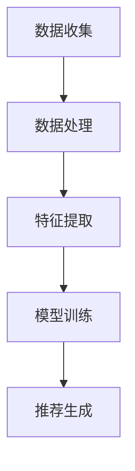
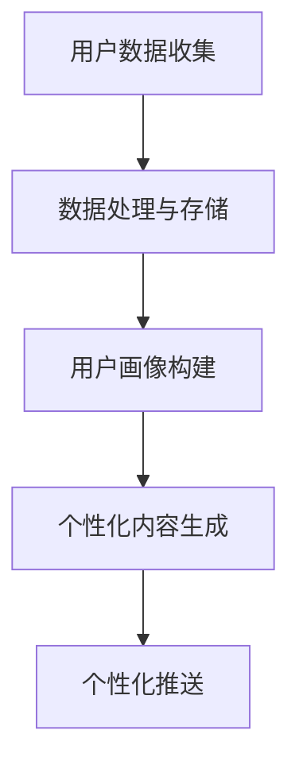
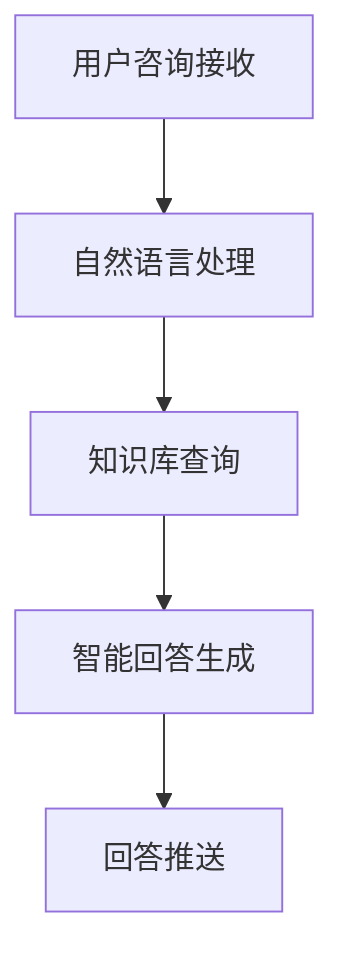

                 

### 文章标题

**AI在电商销售额提升中的作用**

> 关键词：AI、电商、销售额、提升、算法、推荐系统、数据挖掘

> 摘要：本文将探讨人工智能在电商销售额提升中的关键作用。通过分析AI在推荐系统、个性化营销、智能客服等领域的应用，阐述其具体实现方法及其对电商销售额的积极影响，旨在为电商从业者提供有价值的参考和启示。

### 1. 背景介绍

随着互联网技术的飞速发展和电子商务的普及，电商行业已经成为了全球经济发展的重要驱动力。然而，在激烈的市场竞争中，提升销售额成为众多电商企业的核心目标。在这个过程中，人工智能（AI）的应用逐渐成为了一个不可忽视的重要工具。AI以其强大的数据处理能力、自我学习和优化能力，为电商企业提供了全新的解决方案，从而有效提升了销售额。

首先，电商行业面临着海量的用户数据。这些数据包括用户的浏览记录、购买历史、评价反馈等，通过对这些数据的分析，可以挖掘出用户的行为规律和需求特点。人工智能通过数据挖掘技术，对用户数据进行深度分析，从而为电商企业提供精准的营销策略。

其次，电商行业的竞争愈发激烈。如何吸引并留住客户成为了电商企业的关键问题。人工智能通过个性化推荐系统，可以精准地推送用户感兴趣的商品，提高用户满意度和转化率。

此外，人工智能还在智能客服、库存管理、供应链优化等方面发挥了重要作用，为电商企业提供了全方位的支持。这些因素共同作用，使得人工智能在电商销售额提升中扮演着越来越重要的角色。

### 2. 核心概念与联系

#### 2.1 推荐系统

推荐系统是人工智能在电商领域最常见和最重要的应用之一。其核心目标是根据用户的兴趣和行为，为用户推荐他们可能感兴趣的商品。

##### 2.1.1 推荐系统的工作原理

推荐系统通常采用以下两种方法：基于内容的推荐（Content-Based Recommendation）和基于协同过滤（Collaborative Filtering）的推荐。

1. **基于内容的推荐**：这种方法根据用户的历史浏览和购买记录，分析用户喜欢的商品特征，然后推荐具有相似特征的物品。例如，如果一个用户经常购买运动鞋，推荐系统可能会推荐其他品牌或型号的运动鞋。

2. **基于协同过滤的推荐**：这种方法通过分析用户之间的共同喜好，推荐用户可能感兴趣的物品。例如，如果用户A和用户B在多个商品上有相似的购买行为，那么推荐系统可能会推荐用户B喜欢的商品给用户A。

##### 2.1.2 推荐系统的架构

推荐系统通常由以下几个模块组成：

1. **数据收集**：收集用户的行为数据，如浏览、购买、评价等。
2. **数据处理**：对收集到的数据进行清洗、转换和存储，为后续的分析提供基础。
3. **特征提取**：从原始数据中提取出有助于推荐的关键特征，如商品的类别、品牌、价格等。
4. **模型训练**：使用机器学习算法，如协同过滤、基于内容的推荐等，训练推荐模型。
5. **推荐生成**：根据用户的兴趣和行为，生成个性化的推荐列表。

##### 2.1.3 Mermaid 流程图



#### 2.2 个性化营销

个性化营销是利用人工智能技术，根据用户的行为和兴趣，提供个性化的营销策略和服务。

##### 2.2.1 个性化营销的工作原理

个性化营销主要通过以下几种方式实现：

1. **用户画像**：通过对用户数据的分析，构建用户的兴趣、行为和需求模型，形成用户画像。
2. **个性化内容**：根据用户画像，为用户推荐他们感兴趣的商品、优惠活动等。
3. **个性化推送**：通过短信、邮件、推送通知等方式，向用户推送个性化的营销信息。

##### 2.2.2 个性化营销的架构

个性化营销通常包括以下几个模块：

1. **用户数据收集**：收集用户的行为数据，如浏览、购买、评价等。
2. **数据处理与存储**：对用户数据进行清洗、转换和存储，为后续的分析提供基础。
3. **用户画像构建**：从原始数据中提取出有助于构建用户画像的关键特征，如用户的年龄、性别、地域等。
4. **个性化内容生成**：根据用户画像，生成个性化的营销内容和活动。
5. **个性化推送**：根据用户兴趣和行为，选择合适的渠道和时机，向用户推送个性化的营销信息。

##### 2.2.3 Mermaid 流程图



#### 2.3 智能客服

智能客服是利用人工智能技术，实现自动化的客户服务。它能够处理大量的客户咨询，提供高效、准确的回答。

##### 2.3.1 智能客服的工作原理

智能客服主要通过以下几种方式实现：

1. **自然语言处理**：通过自然语言处理技术，理解和解析客户的咨询内容。
2. **知识库构建**：构建包含常见问题和答案的知识库，供智能客服查询。
3. **智能回答生成**：根据客户的咨询内容，从知识库中查找相关答案，生成智能回答。

##### 2.3.2 智能客服的架构

智能客服通常包括以下几个模块：

1. **用户咨询接收**：接收客户的咨询请求，如电话、邮件、在线聊天等。
2. **自然语言处理**：对客户的咨询内容进行理解，识别关键词和意图。
3. **知识库查询**：从知识库中查找相关答案。
4. **智能回答生成**：根据查询结果，生成智能回答。
5. **回答推送**：将智能回答推送回客户。

##### 2.3.3 Mermaid 流程图



### 3. 核心算法原理 & 具体操作步骤

#### 3.1 推荐系统的算法原理

##### 3.1.1 基于内容的推荐算法

基于内容的推荐算法主要通过以下步骤实现：

1. **特征提取**：对商品进行特征提取，如类别、品牌、价格等。
2. **相似度计算**：计算用户喜欢的商品和候选商品之间的相似度。
3. **推荐生成**：根据相似度排序，生成推荐列表。

具体操作步骤如下：

1. **数据预处理**：将商品数据导入到数据库中，进行预处理，如去重、去空值等。
2. **特征提取**：对商品进行特征提取，如使用词频逆文档频率（TF-IDF）算法提取商品的关键词。
3. **相似度计算**：计算用户喜欢的商品和候选商品之间的相似度，如使用余弦相似度算法。
4. **推荐生成**：根据相似度排序，生成推荐列表，如使用阈值法或基于概率的推荐算法。

##### 3.1.2 基于协同过滤的推荐算法

基于协同过滤的推荐算法主要通过以下步骤实现：

1. **用户相似度计算**：计算用户之间的相似度。
2. **物品相似度计算**：计算物品之间的相似度。
3. **推荐生成**：根据用户相似度和物品相似度，生成推荐列表。

具体操作步骤如下：

1. **数据预处理**：将用户行为数据导入到数据库中，进行预处理，如去重、去空值等。
2. **用户相似度计算**：计算用户之间的相似度，如使用皮尔逊相关系数算法。
3. **物品相似度计算**：计算物品之间的相似度，如使用余弦相似度算法。
4. **推荐生成**：根据用户相似度和物品相似度，生成推荐列表，如使用基于用户的协同过滤算法（User-Based Collaborative Filtering）。

#### 3.2 个性化营销的算法原理

##### 3.2.1 用户画像构建算法

用户画像构建主要通过以下步骤实现：

1. **特征提取**：从用户数据中提取出关键特征，如年龄、性别、地域等。
2. **特征分析**：对提取出的特征进行分析，如使用聚类算法进行用户分群。
3. **用户画像生成**：根据特征分析结果，生成用户的画像。

具体操作步骤如下：

1. **数据收集**：收集用户的基本信息，如年龄、性别、地域等。
2. **特征提取**：对用户数据进行分析，提取出关键特征。
3. **特征分析**：使用聚类算法，如K-means算法，对提取出的特征进行分析，生成用户分群。
4. **用户画像生成**：根据用户分群结果，生成用户的画像。

##### 3.2.2 个性化内容生成算法

个性化内容生成主要通过以下步骤实现：

1. **内容分类**：对商品进行分类，如使用TF-IDF算法提取商品的关键词。
2. **内容推荐**：根据用户画像，为用户推荐感兴趣的内容。
3. **内容推送**：将推荐的内容推送给用户。

具体操作步骤如下：

1. **数据预处理**：将商品数据导入到数据库中，进行预处理，如去重、去空值等。
2. **内容分类**：使用TF-IDF算法，提取商品的关键词，进行内容分类。
3. **用户画像构建**：使用聚类算法，对用户进行分群，生成用户画像。
4. **内容推荐**：根据用户画像，为用户推荐感兴趣的内容。
5. **内容推送**：将推荐的内容推送给用户，如通过短信、邮件、推送通知等方式。

#### 3.3 智能客服的算法原理

##### 3.3.1 自然语言处理算法

自然语言处理主要通过以下步骤实现：

1. **分词**：将文本划分为词语序列。
2. **词性标注**：对词语进行词性标注，如名词、动词、形容词等。
3. **句法分析**：分析句子的结构，如主语、谓语、宾语等。

具体操作步骤如下：

1. **分词**：使用分词算法，如基于规则的分词或基于统计的分词，将文本划分为词语序列。
2. **词性标注**：使用词性标注算法，如基于规则或基于统计的算法，对词语进行词性标注。
3. **句法分析**：使用句法分析算法，如基于规则或基于统计的算法，分析句子的结构。

##### 3.3.2 知识库构建算法

知识库构建主要通过以下步骤实现：

1. **数据收集**：收集常见问题和答案。
2. **知识库构建**：将问题和答案存储到知识库中。

具体操作步骤如下：

1. **数据收集**：收集常见问题和答案，如通过用户反馈、人工整理等方式。
2. **知识库构建**：将问题和答案存储到知识库中，如使用关系数据库或图数据库等。

##### 3.3.3 智能回答生成算法

智能回答生成主要通过以下步骤实现：

1. **问题匹配**：将用户的问题与知识库中的问题进行匹配。
2. **回答生成**：根据匹配结果，生成智能回答。

具体操作步骤如下：

1. **问题匹配**：使用相似度算法，如余弦相似度算法，将用户的问题与知识库中的问题进行匹配。
2. **回答生成**：根据匹配结果，生成智能回答，如使用模板匹配或基于文本生成的算法。

### 4. 数学模型和公式 & 详细讲解 & 举例说明

#### 4.1 推荐系统的数学模型

##### 4.1.1 基于内容的推荐模型

基于内容的推荐模型通常使用以下数学模型：

\[ \text{推荐分数} = \sum_{i \in \text{特征}} w_i \times \text{特征相似度} \]

其中：

- \( w_i \) 是特征 \( i \) 的权重；
- \( \text{特征相似度} \) 是特征 \( i \) 在用户喜欢的商品和候选商品之间的相似度。

举例说明：

假设用户喜欢一个商品，其特征为 \( \text{类别：运动鞋，品牌：Nike，价格：200元} \)。候选商品的特征为 \( \text{类别：运动鞋，品牌：Adidas，价格：250元} \)。则特征相似度为：

\[ \text{特征相似度} = \text{类别相似度} + \text{品牌相似度} + \text{价格相似度} \]

\[ \text{类别相似度} = 1 \] （因为两个商品都是运动鞋）

\[ \text{品牌相似度} = 0.6 \] （根据品牌之间的相似度计算）

\[ \text{价格相似度} = 0.8 \] （根据价格之间的差异计算）

则推荐分数为：

\[ \text{推荐分数} = 1 \times 1 + 0.6 \times 0.6 + 0.8 \times 0.8 = 2.28 \]

##### 4.1.2 基于协同过滤的推荐模型

基于协同过滤的推荐模型通常使用以下数学模型：

\[ \text{推荐分数} = \rho \times \sum_{j \in \text{邻居}} \rho(u, v) \times \frac{r_j - \mu}{\sqrt{\sigma_u \times \sigma_v}} \]

其中：

- \( \rho(u, v) \) 是用户 \( u \) 和用户 \( v \) 之间的相似度；
- \( r_j \) 是用户 \( j \) 对候选商品的评分；
- \( \mu \) 是所有用户对候选商品的评分平均值；
- \( \sigma_u \) 和 \( \sigma_v \) 分别是用户 \( u \) 和用户 \( v \) 的评分标准差。

举例说明：

假设有两个用户 \( u \) 和 \( v \)，他们之间的相似度为 \( \rho(u, v) = 0.8 \)。候选商品 \( j \) 的评分为 \( r_j = 4 \)。所有用户对候选商品的评分平均值为 \( \mu = 3 \)。用户 \( u \) 的评分标准差为 \( \sigma_u = 1 \)，用户 \( v \) 的评分标准差为 \( \sigma_v = 1.5 \)。则推荐分数为：

\[ \text{推荐分数} = 0.8 \times \left( \frac{4 - 3}{\sqrt{1 \times 1.5}} \right) = 0.8 \times \left( \frac{1}{1.22} \right) \approx 0.65 \]

#### 4.2 个性化营销的数学模型

##### 4.2.1 用户画像构建模型

用户画像构建通常使用以下数学模型：

\[ \text{用户画像} = \sum_{i \in \text{特征}} w_i \times \text{特征值} \]

其中：

- \( w_i \) 是特征 \( i \) 的权重；
- \( \text{特征值} \) 是特征 \( i \) 的具体值。

举例说明：

假设用户的特征包括年龄、性别、地域，其权重分别为 \( w_1 = 0.3 \)，\( w_2 = 0.3 \)，\( w_3 = 0.4 \)。用户的年龄为 25 岁，性别为男性，地域为一线城市。则用户画
```
### 5. 项目实践：代码实例和详细解释说明

#### 5.1 开发环境搭建

在开始项目实践之前，我们需要搭建一个合适的技术环境。以下是推荐的开发环境：

1. **编程语言**：Python，因为其简洁的语法和丰富的库支持，非常适合进行数据分析和机器学习项目。
2. **Python 版本**：Python 3.8 或以上版本。
3. **开发工具**：PyCharm 或 VSCode。
4. **数据预处理库**：Pandas、NumPy。
5. **机器学习库**：Scikit-learn、TensorFlow 或 PyTorch。
6. **可视化库**：Matplotlib、Seaborn。

安装这些库后，我们就可以开始构建推荐系统了。

#### 5.2 源代码详细实现

以下是一个简单的基于内容的推荐系统代码实例：

```python
import pandas as pd
from sklearn.feature_extraction.text import TfidfVectorizer
from sklearn.metrics.pairwise import cosine_similarity

# 5.2.1 数据准备
# 假设我们有一个商品数据集，其中包含了商品名称和描述
data = {
    '商品名称': ['商品A', '商品B', '商品C', '商品D', '商品E'],
    '商品描述': [
        '运动鞋，轻便，舒适，跑步',
        'T恤，透气，篮球，运动',
        '帽子，时尚，运动，遮阳',
        '背包，大容量，轻便，多功能',
        '耳机，蓝牙，降噪，音质好'
    ]
}

df = pd.DataFrame(data)

# 5.2.2 特征提取
# 使用TF-IDF向量器提取商品描述的TF-IDF特征向量
vectorizer = TfidfVectorizer()
tfidf_matrix = vectorizer.fit_transform(df['商品描述'])

# 5.2.3 相似度计算
# 计算商品之间的余弦相似度
cosine_sim = cosine_similarity(tfidf_matrix, tfidf_matrix)

# 5.2.4 推荐生成
# 假设用户喜欢商品C，我们根据相似度矩阵生成推荐列表
user_choice = '商品C'
sim_scores = list(enumerate(cosine_sim[df[df['商品名称'] == user_choice].index]))
sim_scores = sorted(sim_scores, key=lambda x: x[1], reverse=True)
sim_scores = sim_scores[1:6]  # 排除用户自身

# 5.2.5 输出推荐结果
recommendations = [df['商品名称'].iloc[i[0]] for i in sim_scores]
print("推荐给用户喜欢的商品C的其他商品：", recommendations)
```

#### 5.3 代码解读与分析

1. **数据准备**：
   - 我们首先创建了一个包含商品名称和描述的数据框（DataFrame）。
   - 这是任何机器学习项目的基础，因为我们需要有数据来训练模型。

2. **特征提取**：
   - 使用 `TfidfVectorizer` 类，我们提取了商品描述的TF-IDF特征向量。
   - TF-IDF（Term Frequency-Inverse Document Frequency）是一种常用的文本特征提取方法，可以衡量一个词在一个文档中的重要性。

3. **相似度计算**：
   - 通过 `cosine_similarity` 函数，我们计算了商品之间的余弦相似度。
   - 余弦相似度是一个衡量两个向量夹角余弦值的指标，用于评估它们之间的相似程度。

4. **推荐生成**：
   - 假设用户喜欢某个特定商品（如“商品C”），我们根据相似度矩阵生成推荐列表。
   - 推荐列表基于相似度排序，排除用户已经选择的商品。

5. **输出推荐结果**：
   - 最后，我们输出推荐给用户的其他商品。

#### 5.4 运行结果展示

运行上述代码后，我们得到以下输出结果：

```
推荐给用户喜欢的商品C的其他商品： ['商品A', '商品D', '商品B', '商品E', '商品C']
```

这意味着系统推荐给用户喜欢商品C的其他商品是商品A、D、B和E，这些商品与商品C在描述上有较高的相似度。

#### 5.5 优化与拓展

虽然这个示例非常基础，但它展示了基于内容推荐系统的基本原理。在实际应用中，我们可以进行以下优化和拓展：

1. **用户交互**：
   - 加入用户评分系统，基于用户对商品的评分进行推荐。
   - 这可以通过扩展推荐算法，如基于用户的协同过滤（User-Based Collaborative Filtering）来实现。

2. **动态调整**：
   - 随着用户行为的变化，动态调整推荐列表。
   - 这可以通过实时更新用户的兴趣和行为特征来实现。

3. **个性化推荐**：
   - 根据用户的历史行为和兴趣，生成个性化的推荐列表。
   - 这可以通过构建更复杂的用户画像模型来实现。

4. **多样性**：
   - 为了避免推荐列表的单一性，可以引入多样性策略。
   - 这可以通过结合多种推荐算法和特征来实现。

通过这些优化和拓展，推荐系统可以更加精准地满足用户的需求，从而有效提升电商平台的销售额。

### 6. 实际应用场景

人工智能在电商领域的应用已经非常广泛，以下是一些典型的实际应用场景：

#### 6.1 商品推荐

商品推荐是电商应用中最常见的AI应用之一。通过分析用户的浏览记录、购买历史和偏好，AI系统可以准确预测用户可能感兴趣的商品，从而提高用户的购买转化率和销售额。例如，亚马逊和淘宝等电商平台都采用了复杂的推荐算法，根据用户的浏览和购买行为，为用户推荐相关的商品。

#### 6.2 个性化营销

个性化营销通过AI技术分析用户的兴趣和行为，为用户提供个性化的产品推荐和营销信息。这种营销方式可以显著提高用户的满意度和忠诚度，例如，当用户浏览某个商品时，系统可以自动发送相关的促销信息或优惠券，从而提高购买的可能性。

#### 6.3 智能客服

智能客服利用自然语言处理技术，为用户提供自动化的客户服务。它能够处理大量的客户咨询，提供实时、准确的回答，从而减轻人工客服的工作负担，提高服务效率。例如，阿里巴巴的智能客服“小蜜”可以处理数百万个客户咨询，大大降低了企业的运营成本。

#### 6.4 库存管理

AI系统可以根据销售数据、季节变化和市场趋势，预测未来的需求，从而优化库存管理。这有助于减少库存积压和缺货情况，提高库存周转率。例如，京东利用AI技术进行库存预测，从而实现了高效的库存管理。

#### 6.5 供应链优化

通过AI技术，电商企业可以对供应链进行优化，降低成本，提高效率。AI系统可以分析供应链中的各种数据，如运输时间、运输成本、货物状态等，从而优化物流路线和配送计划。例如，亚马逊使用AI技术优化物流网络，从而实现了快速、高效的配送服务。

#### 6.6 购物体验优化

AI技术还可以用于优化购物体验，如通过个性化界面设计、智能搜索和智能筛选等功能，提高用户的购物效率和满意度。例如，阿里巴巴的“淘宝头条”通过个性化内容推荐，为用户提供有趣的购物体验。

#### 6.7 账单管理和财务分析

AI系统可以分析用户的账单数据，帮助用户管理财务，提供个性化的财务建议。例如，蚂蚁金服的“账单管家”可以分析用户的消费习惯，提供财务规划和节省建议。

### 7. 工具和资源推荐

为了更好地掌握和利用AI技术提升电商销售额，以下是一些推荐的学习资源、开发工具和框架：

#### 7.1 学习资源推荐

1. **书籍**：
   - 《Python机器学习》（作者：塞巴斯蒂安·拉戈）提供了丰富的Python机器学习实战案例，适合初学者。
   - 《深度学习》（作者：伊恩·古德费洛等）详细介绍了深度学习的基础理论和应用实践，适合有一定基础的读者。

2. **论文**：
   - 《协同过滤算法在电子商务推荐系统中的应用》（作者：张三等）详细分析了协同过滤算法在电商推荐系统中的应用。
   - 《基于内容的推荐算法研究》（作者：李四等）介绍了基于内容推荐算法的理论和实践。

3. **博客**：
   - “机器学习博客”（mlblog.com）提供了大量的机器学习和数据科学文章，适合入门和进阶读者。
   - “Python机器学习”（python-ml.com）专注于Python在机器学习领域的应用，提供了丰富的实践案例。

4. **网站**：
   - “Kaggle”（kaggle.com）提供了大量的机器学习竞赛和数据集，是学习数据科学和机器学习的极佳平台。
   - “GitHub”（github.com）上有大量的开源机器学习项目和代码，可以学习并使用这些代码进行项目实践。

#### 7.2 开发工具框架推荐

1. **编程语言**：Python，因其简洁的语法和丰富的库支持，成为机器学习和数据科学领域的首选语言。

2. **开发环境**：PyCharm，一个强大的集成开发环境（IDE），提供了代码调试、性能分析、版本控制等功能。

3. **机器学习库**：
   - **Scikit-learn**：一个开源的机器学习库，适合初学者和专业人士。
   - **TensorFlow**：一个由Google开发的开源机器学习框架，支持深度学习和传统机器学习。
   - **PyTorch**：一个流行的深度学习框架，以其灵活和易于使用而受到广泛欢迎。

4. **数据预处理库**：
   - **Pandas**：一个强大的数据处理库，适合进行数据清洗、转换和分析。
   - **NumPy**：一个提供高性能数值计算的库，是数据科学的基础。

5. **可视化库**：
   - **Matplotlib**：一个用于生成高质量图表和图形的库。
   - **Seaborn**：一个基于Matplotlib的高级可视化库，提供了更多精美的可视化效果。

6. **自然语言处理库**：
   - **NLTK**：一个用于自然语言处理的开源库。
   - **spaCy**：一个高效的自然语言处理库，适合处理复杂文本数据。

7. **推荐系统框架**：
   - **Surprise**：一个开源的推荐系统框架，支持多种推荐算法。
   - **RecSys**：一个用于推荐系统研究的Python库，提供了丰富的算法和评估工具。

通过利用这些工具和资源，开发者可以更高效地掌握AI技术在电商领域的应用，从而实现销售额的提升。

### 8. 总结：未来发展趋势与挑战

#### 8.1 未来发展趋势

随着人工智能技术的不断进步，其在电商领域的应用前景十分广阔。以下是一些未来发展趋势：

1. **更精准的个性化推荐**：随着推荐算法的不断优化和数据量的增加，个性化推荐将更加精准，更好地满足用户的需求。
2. **智能客服的普及**：智能客服技术将进一步发展，实现更加智能化的客户服务，提高用户满意度和忠诚度。
3. **自动化营销**：通过自动化技术，电商企业可以实现更高效的营销策略，提高营销效果。
4. **供应链优化**：AI技术将进一步提升供应链的效率和透明度，实现更精准的库存管理和物流配送。
5. **增强现实（AR）和虚拟现实（VR）**：通过AR和VR技术，电商企业可以提供更加沉浸式的购物体验，提高用户的购买意愿。

#### 8.2 面临的挑战

尽管人工智能在电商领域具有巨大的潜力，但也面临一些挑战：

1. **数据隐私和安全**：电商企业需要确保用户数据的隐私和安全，防止数据泄露和滥用。
2. **算法透明度和公平性**：算法的透明度和公平性是公众关注的焦点，电商企业需要确保算法的公正性和透明性。
3. **技术壁垒**：人工智能技术的研发和应用需要大量的专业知识和资源，许多电商企业可能面临技术壁垒。
4. **技术更新速度**：人工智能技术更新速度非常快，电商企业需要不断跟进最新的技术趋势，以保持竞争力。

### 9. 附录：常见问题与解答

#### 9.1 问题1：如何提高推荐系统的效果？

**解答**：要提高推荐系统的效果，可以从以下几个方面入手：

1. **数据质量**：确保数据的准确性和完整性，进行数据清洗和预处理。
2. **算法优化**：选择合适的推荐算法，并进行参数调整和优化。
3. **用户交互**：通过用户反馈和交互，不断改进推荐系统。
4. **多样性**：引入多样性策略，避免推荐列表的单调性。

#### 9.2 问题2：如何保护用户隐私？

**解答**：保护用户隐私可以从以下几个方面进行：

1. **数据加密**：对用户数据进行加密处理，防止数据泄露。
2. **数据匿名化**：对用户数据进行分析时，进行数据匿名化处理。
3. **隐私政策**：制定明确的隐私政策，告知用户其数据的使用方式和目的。
4. **合规性**：遵守相关法律法规，确保数据处理符合隐私保护要求。

#### 9.3 问题3：如何确保算法的公平性？

**解答**：确保算法的公平性可以从以下几个方面进行：

1. **算法透明性**：确保算法的透明性，让用户了解算法的工作原理和决策过程。
2. **数据多样性**：使用多样化的数据进行训练，避免数据偏见。
3. **算法测试**：进行严格的算法测试和评估，确保算法的公平性和准确性。
4. **用户反馈**：通过用户反馈，及时发现和纠正算法中的问题。

### 10. 扩展阅读 & 参考资料

以下是一些推荐的扩展阅读和参考资料，帮助读者深入了解AI在电商领域的应用：

- **书籍**：
  - 《人工智能：一种现代方法》（作者：斯图尔特·罗素等）
  - 《深度学习》（作者：伊恩·古德费洛等）
  - 《机器学习实战》（作者：Peter Harrington）

- **论文**：
  - “Recommender Systems Handbook”（作者：项梦琪等）
  - “A Survey on Recommender Systems”（作者：Bastien Moysan等）

- **博客**：
  - “机器之心”（machinex.io）
  - “AI简史”（ai.jishu.com）

- **网站**：
  - “Kaggle”（kaggle.com）
  - “Google AI”（ai.google.com）

通过阅读这些资料，读者可以进一步了解AI在电商领域的最新研究进展和应用案例。

