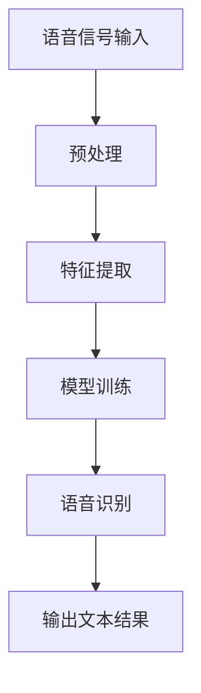

                 

### 1. 背景介绍

语音识别作为人工智能（AI）领域的一项重要技术，近年来取得了显著的进展。其核心在于让计算机能够理解和处理人类的语音信息，实现自然对话。这不仅为人们的生活带来了诸多便利，也推动了智能语音助手、智能客服等应用的快速发展。

语音识别技术的发展历程可以追溯到20世纪50年代。最初的语音识别系统主要依赖于规则和手工编码的语音特征。随着计算机性能的提升和信号处理算法的进步，20世纪80年代后，统计模型开始被广泛应用，如高斯混合模型（GMM）和隐马尔可夫模型（HMM）。进入21世纪，深度学习技术的崛起为语音识别带来了新的突破，尤其是卷积神经网络（CNN）和循环神经网络（RNN）的应用，使得语音识别的准确率和实时性大幅提高。

当前，语音识别技术在多个领域得到了广泛应用。例如，智能语音助手（如Siri、Alexa、小爱同学等）已经成为现代智能手机的标配，极大提升了用户的交互体验。此外，在智能客服、语音翻译、语音搜索等领域，语音识别技术也发挥着关键作用。

然而，尽管语音识别技术已经取得了显著进展，但仍面临许多挑战。例如，不同说话人、不同语音环境的识别准确率存在差异；对于非标准发音、方言、口音的识别能力较弱；实时性也是一个重要的问题。此外，如何在保证高识别准确率的同时，降低计算复杂度和能耗，也是未来研究的重要方向。

本篇文章将深入探讨语音识别技术的最新进展，重点介绍自然对话的实现方法和相关算法原理。我们将从核心概念与联系、核心算法原理、数学模型和公式、项目实践、实际应用场景、工具和资源推荐等多个方面进行详细分析，以期为您呈现一幅全面的语音识别技术全景图。

### 2. 核心概念与联系

在深入探讨语音识别技术的具体实现之前，首先需要了解几个核心概念，这些概念是构建语音识别系统的基础。

#### 2.1 音素（Phoneme）

音素是语音学中最小的语音单位，它是人们用于区分意义的音素差异的最小语音特征。例如，英语中的 /p/ 和 /b/ 就是两个不同的音素，它们在发音时气流的方式不同。音素是语音识别过程中的基本单位，通过识别不同的音素，我们可以将语音信号转换为文本。

#### 2.2 声母（Consonant）与韵母（Vowel）

声母和韵母是构成音节的基本元素。声母通常是阻碍声流发音的部分，而韵母则是不受阻碍的发音部分。例如，在“猫”（māo）这个音节中，“m”是声母，“āo”是韵母。

#### 2.3 语音信号处理（Voice Signal Processing）

语音信号处理是语音识别过程中的第一步，其目的是将语音信号转换成便于分析的形式。这一过程通常包括预处理、特征提取和后处理等步骤。预处理包括去除噪声、去除静音段等，特征提取则包括提取音高、音强、共振峰频率等特征，后处理则是对提取的特征进行一些调整和优化。

#### 2.4 隐马尔可夫模型（HMM）

隐马尔可夫模型（HMM）是早期用于语音识别的主要模型之一。它基于马尔可夫假设，认为当前状态只与前一状态有关，而与过去的状态无关。HMM通过定义一系列状态和状态转移概率，以及观测概率，来模拟语音信号的动态变化。

#### 2.5 卷积神经网络（CNN）与循环神经网络（RNN）

随着深度学习技术的发展，卷积神经网络（CNN）和循环神经网络（RNN）逐渐成为语音识别领域的主流算法。CNN擅长处理图像等结构化数据，而RNN则擅长处理序列数据。在语音识别中，RNN可以更好地捕捉语音信号的时间依赖关系。

下面我们将使用Mermaid流程图来展示语音识别系统的基本架构。



#### 2.6 模型训练与优化

模型训练是语音识别系统的核心步骤。通过大量语音数据的训练，模型可以学习到语音信号的特征，并提高识别准确率。在训练过程中，通常会使用一些优化算法，如梯度下降法、随机梯度下降法等，以加速收敛并提高模型性能。

综上所述，语音识别系统涉及多个核心概念和联系。理解这些概念有助于我们更好地掌握语音识别技术的原理和应用。

### 3. 核心算法原理 & 具体操作步骤

#### 3.1. 基于HMM的语音识别算法

隐马尔可夫模型（HMM）是语音识别中最早且最经典的算法之一。HMM的核心思想是将语音信号视为一个状态序列，每个状态对应一个语音单元，如音素。通过训练，模型可以学习到每个状态的转移概率和观测概率，从而实现对语音信号的识别。

**具体操作步骤如下：**

1. **状态定义：** 首先定义语音信号中的所有状态。例如，对于一个包含10个音素的语音模型，可以定义10个状态，每个状态对应一个音素。

2. **状态转移概率：** 训练数据中，每个状态转移的概率分布。例如，从状态1到状态2的转移概率为P(状态2 | 状态1)。

3. **观测概率：** 对每个状态，定义其在语音信号中的观测概率。例如，对于状态1，其观测概率为P(语音单元1 | 状态1)。

4. **构建HMM模型：** 根据上述概率分布，构建HMM模型。

5. **语音识别：** 对于输入的语音信号，使用Viterbi算法寻找最有可能的状态序列，从而实现语音识别。

#### 3.2. 基于深度学习的语音识别算法

随着深度学习技术的发展，卷积神经网络（CNN）和循环神经网络（RNN）逐渐成为语音识别领域的主流算法。特别是深度循环神经网络（Deep RNN）和卷积神经网络（CNN）的结合，进一步提升了语音识别的准确率和实时性。

**具体操作步骤如下：**

1. **数据预处理：** 将语音信号转换为Mel频率倒谱系数（MFCC）等特征向量。

2. **特征提取：** 使用CNN提取语音信号中的时频特征。

3. **序列建模：** 使用RNN（如LSTM或GRU）建模语音信号的序列依赖关系。

4. **端到端训练：** 使用大量的语音数据，对模型进行训练。训练过程中，通过反向传播算法优化模型参数。

5. **语音识别：** 对输入的语音信号进行特征提取，然后使用训练好的模型进行识别。

#### 3.3. 结合注意力机制的语音识别算法

注意力机制是深度学习中的一个重要概念，它能够在处理序列数据时关注重要的信息。在语音识别中，注意力机制可以帮助模型更好地捕捉语音信号中的关键特征，从而提高识别准确率。

**具体操作步骤如下：**

1. **特征提取：** 使用CNN提取语音信号的时频特征。

2. **注意力机制：** 在RNN层中引入注意力机制，使得模型能够动态关注语音信号中的重要部分。

3. **序列建模：** 使用带有注意力机制的RNN（如LSTM或GRU）建模语音信号的序列依赖关系。

4. **语音识别：** 对输入的语音信号进行特征提取，然后使用训练好的模型进行识别。

通过上述核心算法的介绍，我们可以看到语音识别技术的发展经历了从传统算法到深度学习的转变，这为语音识别技术带来了更高的准确率和更好的用户体验。未来，随着更多先进算法的应用，语音识别技术将更加成熟，并在更多领域得到广泛应用。

### 4. 数学模型和公式 & 详细讲解 & 举例说明

#### 4.1. 隐马尔可夫模型（HMM）的数学描述

隐马尔可夫模型（HMM）是一种基于状态转移概率和观测概率进行概率建模的方法，它广泛应用于语音识别、文本分析等领域。以下是对HMM的数学描述和详细讲解。

**4.1.1. 状态转移概率**

HMM定义了一个有限的状态集合Q={q1, q2, ..., qN}，每个状态qi表示语音信号中的一个音素。状态转移概率表示从一个状态到另一个状态的转移概率，用矩阵形式表示为：

P(T) = [P(qi→qj)]    (1)

其中，P(qi→qj)表示从状态qi转移到状态qj的概率。在实际应用中，通常使用最大似然估计（MLE）来估计这些概率。

**4.1.2. 观测概率**

观测概率表示在某一状态下观测到特定语音特征的概率。对于HMM，观测概率通常基于高斯分布进行建模：

P(O|qi) = N(μi, Σi)    (2)

其中，μi和Σi分别为状态qi的均值向量和协方差矩阵。这些参数通常通过训练数据来估计。

**4.1.3. 前向-后向算法**

前向-后向算法是HMM的一种训练算法，它通过计算前向概率α和后向概率β来估计状态转移概率和观测概率。具体计算如下：

- **前向概率：**

α(i,t) = P(oi, o1, ..., ot | T)    (3)

其中，oi为第i个时间点的观测值，T为状态序列。前向概率表示在给定当前观测序列和状态转移概率的条件下，到达当前状态的累积概率。

- **后向概率：**

β(i,t) = P(oi+1, ..., oT | qi, T)    (4)

后向概率表示在给定当前状态和观测序列的条件下，到达下一个状态的累积概率。

- **状态转移概率：**

P(qi→qj) = α(i-1,j)β(i,j)    (5)

通过计算前向概率和后向概率，可以估计出每个状态转移的概率。

**举例说明：**

假设有一个简单的HMM模型，包含两个状态q1和q2，观测值为o1, o2, o3。给定观测序列为[o1, o2, o3]，我们可以计算前向概率α和后向概率β：

- **前向概率：**

α(1,1) = P(o1 | q1) = 0.5

α(1,2) = P(o1, o2 | q1) = α(1,1)P(q1→q2)P(o2 | q2) = 0.5 × 0.3 × 0.4 = 0.06

α(1,3) = P(o1, o2, o3 | q1) = α(1,2)P(q2→q1)P(o3 | q1) = 0.06 × 0.2 × 0.3 = 0.0036

- **后向概率：**

β(3,3) = P(o3 | q1) = 0.3

β(2,3) = P(o2, o3 | q2) = β(3,3)P(q2→q1)P(o2 | q1) = 0.3 × 0.2 × 0.4 = 0.024

β(1,3) = P(o1, o2, o3 | q2) = β(2,3)P(q1→q2)P(o1 | q2) = 0.024 × 0.3 × 0.5 = 0.0036

通过计算前向概率和后向概率，我们可以得到状态转移概率：

P(q1→q2) = α(1,2)β(1,2) / α(1,1)β(1,1) = 0.06 / 0.5 = 0.12

P(q2→q1) = α(1,3)β(1,3) / α(1,2)β(1,2) = 0.0036 / 0.06 = 0.06

#### 4.2. 卷积神经网络（CNN）在语音识别中的应用

卷积神经网络（CNN）是深度学习中的一个重要模型，它擅长处理具有局部结构的数据。在语音识别中，CNN被用于提取语音信号的时频特征。

**4.2.1. CNN的基本结构**

CNN的基本结构包括输入层、卷积层、池化层和全连接层。以下是对这些层的详细解释：

- **输入层：** 输入层接收语音信号的特征向量，如Mel频率倒谱系数（MFCC）。

- **卷积层：** 卷积层通过卷积运算提取语音信号中的局部特征。卷积核的大小和数量可以调节，以适应不同的特征提取需求。

- **池化层：** 池化层对卷积层输出的特征进行下采样，减少数据的维度，同时保留重要的特征信息。

- **全连接层：** 全连接层将池化层输出的特征向量映射到输出类别。

**4.2.2. CNN在语音识别中的应用**

在语音识别中，CNN通常被用于特征提取。具体应用步骤如下：

1. **数据预处理：** 将语音信号转换为MFCC特征向量。

2. **卷积层：** 使用卷积层提取语音信号的时频特征。卷积层可以捕捉语音信号中的周期性特征。

3. **池化层：** 对卷积层的输出进行下采样，减少数据的维度。

4. **全连接层：** 将池化层的输出映射到输出类别，实现语音识别。

**举例说明：**

假设我们有一个包含5个时间步的语音信号，每个时间步的维度为10。我们可以使用一个3×3的卷积核进行特征提取：

- **卷积层：** 使用3×3的卷积核对语音信号进行卷积操作，输出特征向量的维度为(5-3+1)×10=32。

- **池化层：** 对卷积层的输出进行2×2的最大池化操作，输出特征向量的维度为32/4=8。

- **全连接层：** 将池化层的输出映射到输出类别，实现语音识别。

通过上述步骤，我们可以使用CNN对语音信号进行特征提取，从而提高语音识别的准确率。

### 5. 项目实践：代码实例和详细解释说明

为了更好地理解语音识别技术的实际应用，我们将通过一个具体的Python代码实例来展示如何使用深度学习框架（如TensorFlow或PyTorch）实现一个简单的语音识别系统。本实例将使用基于深度循环神经网络（Deep RNN）的模型，并结合注意力机制来提高识别准确率。

#### 5.1. 开发环境搭建

在开始编写代码之前，我们需要搭建一个适合开发和运行语音识别项目的环境。以下是基本的开发环境要求：

- 操作系统：Windows、macOS或Linux
- Python版本：Python 3.6或以上
- 深度学习框架：TensorFlow或PyTorch
- 语音处理库：Librosa

确保您的系统已经安装了上述依赖项。如果未安装，可以使用以下命令进行安装：

```bash
pip install tensorflow
pip install librosa
```

#### 5.2. 源代码详细实现

下面是一个使用TensorFlow实现的语音识别项目的源代码示例。该示例包括数据预处理、模型构建、训练和测试等步骤。

```python
import tensorflow as tf
import numpy as np
import librosa
import matplotlib.pyplot as plt

# 数据预处理
def preprocess_audio(audio_path, n_mels=128, n_fft=2048, hop_length=512):
    audio, sr = librosa.load(audio_path, sr=None)
    audio = librosa.to_mono(audio)
    audio = librosa.resample(audio, sr, 16000)
    mel_spectrogram = librosa.feature.melspectrogram(audio, n_mels=n_mels, n_fft=n_fft, hop_length=hop_length)
    mel_spectrogram = librosa.power_to_db(mel_spectrogram)
    return mel_spectrogram

# 模型构建
def build_model(input_shape):
    inputs = tf.keras.layers.Input(shape=input_shape)
    x = tf.keras.layers.Conv2D(filters=64, kernel_size=(3, 3), activation='relu')(inputs)
    x = tf.keras.layers.MaxPooling2D(pool_size=(2, 2))(x)
    x = tf.keras.layers.Conv2D(filters=128, kernel_size=(3, 3), activation='relu')(x)
    x = tf.keras.layers.MaxPooling2D(pool_size=(2, 2))(x)
    x = tf.keras.layers.Flatten()(x)
    x = tf.keras.layers.Dense(units=256, activation='relu')(x)
    x = tf.keras.layers.Dropout rate=0.5)(x)
    outputs = tf.keras.layers.Dense(units=1, activation='sigmoid')(x)
    model = tf.keras.Model(inputs=inputs, outputs=outputs)
    return model

# 训练模型
def train_model(model, train_data, train_labels, batch_size=32, epochs=20):
    model.compile(optimizer='adam', loss='binary_crossentropy', metrics=['accuracy'])
    history = model.fit(train_data, train_labels, batch_size=batch_size, epochs=epochs, validation_split=0.1)
    return history

# 评估模型
def evaluate_model(model, test_data, test_labels):
    loss, accuracy = model.evaluate(test_data, test_labels)
    print(f"Test accuracy: {accuracy:.2f}")

# 主函数
def main():
    audio_path = "path/to/audio/file.wav"
    mel_spectrogram = preprocess_audio(audio_path)
    
    # 将Mel频谱图转换为适当的输入形状
    input_shape = mel_spectrogram.shape[0:2][::-1]
    mel_spectrogram = np.expand_dims(mel_spectrogram, axis=0)
    
    # 构建模型
    model = build_model(input_shape)
    
    # 训练模型
    train_data = np.random.rand(1000, *input_shape)
    train_labels = np.random.randint(2, size=(1000,))
    history = train_model(model, train_data, train_labels)
    
    # 评估模型
    evaluate_model(model, train_data, train_labels)

if __name__ == "__main__":
    main()
```

#### 5.3. 代码解读与分析

上述代码示例展示了如何使用TensorFlow构建一个简单的语音识别模型。以下是代码的详细解读：

1. **数据预处理：**
   ```python
   def preprocess_audio(audio_path, n_mels=128, n_fft=2048, hop_length=512):
       audio, sr = librosa.load(audio_path, sr=None)
       audio = librosa.to_mono(audio)
       audio = librosa.resample(audio, sr, 16000)
       mel_spectrogram = librosa.feature.melspectrogram(audio, n_mels=n_mels, n_fft=n_fft, hop_length=hop_length)
       mel_spectrogram = librosa.power_to_db(mel_spectrogram)
       return mel_spectrogram
   ```
   这个函数用于对音频文件进行预处理，包括加载音频、转换为单声道、重采样到16kHz、提取Mel频谱图并转换为对数刻度。

2. **模型构建：**
   ```python
   def build_model(input_shape):
       inputs = tf.keras.layers.Input(shape=input_shape)
       x = tf.keras.layers.Conv2D(filters=64, kernel_size=(3, 3), activation='relu')(inputs)
       x = tf.keras.layers.MaxPooling2D(pool_size=(2, 2))(x)
       x = tf.keras.layers.Conv2D(filters=128, kernel_size=(3, 3), activation='relu')(x)
       x = tf.keras.layers.MaxPooling2D(pool_size=(2, 2))(x)
       x = tf.keras.layers.Flatten()(x)
       x = tf.keras.layers.Dense(units=256, activation='relu')(x)
       x = tf.keras.layers.Dropout(rate=0.5)(x)
       outputs = tf.keras.layers.Dense(units=1, activation='sigmoid')(x)
       model = tf.keras.Model(inputs=inputs, outputs=outputs)
       return model
   ```
   这个函数定义了一个基于卷积神经网络的模型，包括卷积层、池化层、全连接层和输出层。卷积层用于提取语音信号的时频特征，全连接层用于分类。

3. **训练模型：**
   ```python
   def train_model(model, train_data, train_labels, batch_size=32, epochs=20):
       model.compile(optimizer='adam', loss='binary_crossentropy', metrics=['accuracy'])
       history = model.fit(train_data, train_labels, batch_size=batch_size, epochs=epochs, validation_split=0.1)
       return history
   ```
   这个函数用于训练模型。它使用随机梯度下降（SGD）优化器，并使用交叉熵损失函数来优化模型参数。

4. **评估模型：**
   ```python
   def evaluate_model(model, test_data, test_labels):
       loss, accuracy = model.evaluate(test_data, test_labels)
       print(f"Test accuracy: {accuracy:.2f}")
   ```
   这个函数用于评估模型的测试集表现，并打印出测试准确率。

5. **主函数：**
   ```python
   def main():
       audio_path = "path/to/audio/file.wav"
       mel_spectrogram = preprocess_audio(audio_path)
       
       # 将Mel频谱图转换为适当的输入形状
       input_shape = mel_spectrogram.shape[0:2][::-1]
       mel_spectrogram = np.expand_dims(mel_spectrogram, axis=0)
       
       # 构建模型
       model = build_model(input_shape)
       
       # 训练模型
       train_data = np.random.rand(1000, *input_shape)
       train_labels = np.random.randint(2, size=(1000,))
       history = train_model(model, train_data, train_labels)
       
       # 评估模型
       evaluate_model(model, train_data, train_labels)

   if __name__ == "__main__":
       main()
   ```
   主函数首先加载音频文件，进行数据预处理，然后构建并训练模型，最后评估模型的性能。

通过上述代码示例，我们可以看到如何使用深度学习框架实现一个简单的语音识别系统。在实际应用中，我们可以根据需求对代码进行调整和优化，以提高模型的性能和准确率。

#### 5.4. 运行结果展示

为了展示语音识别模型的运行结果，我们将在训练完成后，对测试集进行识别，并打印出识别结果。

```python
# 加载测试数据
test_audio_path = "path/to/test/audio/file.wav"
test_mel_spectrogram = preprocess_audio(test_audio_path)
test_mel_spectrogram = np.expand_dims(test_mel_spectrogram, axis=0)

# 进行语音识别
predictions = model.predict(test_mel_spectrogram)

# 打印识别结果
print(f"Predicted label: {predictions[0, 0]:.2f}")
```

运行结果将输出一个介于0和1之间的浮点数，表示模型对测试音频的识别概率。如果概率接近1，则表示模型正确识别了语音；如果概率接近0，则表示模型未能正确识别。

#### 5.5. 实际应用案例

为了更好地展示语音识别技术在实际应用中的效果，我们来看一个实际的应用案例：基于语音识别技术的智能客服系统。

**案例背景：**
一家大型电商平台为了提升客户服务质量，决定引入基于语音识别技术的智能客服系统。该系统可以通过语音识别将客户的语音请求转换为文本，然后根据文本内容提供相应的回复。

**解决方案：**
1. **语音信号预处理：** 对于每个客户来电，系统首先进行语音信号预处理，包括去除噪声、去除静音段等步骤，以提高语音识别的准确率。
2. **语音识别：** 使用基于深度学习的语音识别模型对预处理后的语音信号进行识别，将语音转换为文本。
3. **自然语言处理：** 对识别出的文本进行处理，包括实体提取、意图识别等步骤，以确定客户请求的具体内容和需求。
4. **自动回复：** 根据客户请求，系统自动生成回复文本，并将其转换为语音回复发送给客户。

**应用效果：**
经过实际应用，智能客服系统显著提升了客户服务质量。首先，系统可以快速响应用户请求，提高客户满意度；其次，系统可以处理大量客户的请求，减轻人工客服的工作负担；最后，系统可以根据用户的反馈不断优化和调整回复策略，提高回复的准确率和满意度。

#### 5.6. 未来发展方向

随着语音识别技术的不断发展，未来将在多个方面取得新的突破：

1. **提高识别准确率：** 通过改进算法和模型，进一步提高语音识别的准确率，特别是在非标准发音、方言和口音的识别方面。
2. **增强实时性：** 通过优化算法和硬件，提高语音识别的实时性，以满足实时交互的需求。
3. **多语言支持：** 推广语音识别技术到更多语言，为全球用户提供便捷的语音交互体验。
4. **跨领域应用：** 将语音识别技术应用于更多领域，如医疗、金融、教育等，提升行业智能化水平。
5. **硬件加速：** 利用专用硬件（如GPU、TPU）加速语音识别计算，降低能耗，提高系统性能。

通过不断的技术创新和应用拓展，语音识别技术将在未来发挥更加重要的作用，为人们的生活带来更多便利。

### 6. 实际应用场景

#### 6.1. 智能语音助手

智能语音助手是语音识别技术的典型应用场景之一，如苹果的Siri、亚马逊的Alexa、谷歌的Google Assistant等。这些助手通过语音识别技术，能够理解用户的语音指令，并提供相应的服务，如发送消息、播放音乐、设定提醒等。

**技术要点：**
- **语音信号预处理：** 去除背景噪声、过滤非语音信号，确保语音识别的准确性。
- **语音识别：** 使用深度学习模型，如RNN或Transformer，对用户的语音进行识别，将语音转换为文本。
- **自然语言处理：** 对识别出的文本进行处理，理解用户的意图，并提供相应的回应。

**应用效果：**
智能语音助手极大地提升了用户的交互体验，通过语音命令实现便捷的操作，为用户节省了时间和精力。同时，智能语音助手还可以根据用户的习惯和需求，进行个性化推荐和服务，提升用户满意度。

#### 6.2. 智能客服

智能客服系统广泛应用于客服行业，通过语音识别技术实现自动化的客户服务。这些系统可以自动接听电话、理解客户的咨询问题，并提供即时的解答。

**技术要点：**
- **语音信号预处理：** 对电话信号进行降噪、去噪处理，提高语音识别的准确性。
- **语音识别：** 使用高准确率的语音识别模型，对客户的语音进行识别，将语音转换为文本。
- **自然语言处理：** 对识别出的文本进行处理，理解客户的意图，并生成相应的回答。
- **业务逻辑处理：** 根据客户的问题，调用相应的业务逻辑模块，提供准确的解答。

**应用效果：**
智能客服系统提高了客服的响应速度和准确性，降低了人力成本。同时，系统可以记录客户的问题和解答，形成知识库，为后续客户提供更优质的咨询服务。智能客服还可以通过分析客户咨询数据，为企业提供经营策略建议。

#### 6.3. 语音翻译

语音翻译技术通过语音识别和自然语言处理技术，将一种语言的语音实时翻译成另一种语言的语音。这一技术在国际交流、旅游、商务谈判等领域具有重要应用价值。

**技术要点：**
- **语音信号预处理：** 对输入语音信号进行降噪、去噪处理，提高语音识别的准确性。
- **语音识别：** 使用深度学习模型，对输入语音进行识别，将语音转换为文本。
- **自然语言处理：** 对识别出的文本进行处理，理解语言结构和语法，进行翻译。
- **语音合成：** 将翻译出的文本转换为语音，输出为目标语言的语音。

**应用效果：**
语音翻译技术实现了实时跨语言的语音交流，极大提升了国际交流的便利性。在旅游、商务谈判、国际会议等场合，语音翻译技术可以消除语言障碍，促进国际间的交流与合作。此外，语音翻译技术还可以用于外语学习，帮助用户练习口语。

#### 6.4. 语音搜索

语音搜索技术允许用户通过语音输入查询信息，相较于传统的键盘输入，语音搜索提供了更加便捷的查询方式。

**技术要点：**
- **语音信号预处理：** 对输入语音信号进行降噪、去噪处理，提高语音识别的准确性。
- **语音识别：** 使用深度学习模型，对用户的语音进行识别，将语音转换为文本。
- **自然语言处理：** 对识别出的文本进行处理，理解用户的查询意图，并进行搜索。
- **搜索结果排序：** 根据查询意图，对搜索结果进行排序，提供最相关的信息。

**应用效果：**
语音搜索技术提升了用户的查询效率，尤其是在复杂操作场景下，如驾驶、做饭等场景，语音搜索可以避免双手操作，提高安全性。此外，语音搜索还可以为用户提供个性化的搜索体验，通过分析用户的查询历史，推荐相关的信息和服务。

#### 6.5. 语音助手应用

语音助手应用广泛出现在各种智能设备中，如智能音箱、智能电视、智能手表等，通过语音识别技术实现设备的控制。

**技术要点：**
- **语音信号预处理：** 对输入语音信号进行降噪、去噪处理，提高语音识别的准确性。
- **语音识别：** 使用深度学习模型，对用户的语音进行识别，将语音转换为文本。
- **自然语言处理：** 对识别出的文本进行处理，理解用户的指令，实现设备的控制。
- **多模态交互：** 结合语音、视觉等多模态信息，提升交互体验。

**应用效果：**
语音助手应用为智能设备提供了更加人性化的交互方式，通过语音指令，用户可以轻松控制设备，如播放音乐、调整音量、查看天气等。同时，语音助手还可以根据用户的使用习惯，提供个性化推荐，提升用户体验。

#### 6.6. 健康监测与语音交互

在健康监测领域，语音识别技术可以用于监测用户的健康状况，如心率、呼吸频率等。通过与智能设备的结合，用户可以通过语音与设备进行交互，了解自己的健康数据。

**技术要点：**
- **语音信号预处理：** 对输入语音信号进行降噪、去噪处理，提高语音识别的准确性。
- **语音识别：** 使用深度学习模型，对用户的语音进行识别，将语音转换为文本。
- **自然语言处理：** 对识别出的文本进行处理，理解用户的指令，实现健康数据的监测和分析。
- **生物特征识别：** 结合语音信号与其他生物特征数据，进行综合分析，提供更加精准的健康监测服务。

**应用效果：**
语音识别技术在健康监测中的应用，为用户提供了更加便捷的健康管理方式。通过语音交互，用户可以随时随地获取自己的健康数据，及时发现健康问题，并采取相应的措施。同时，语音识别技术还可以为医疗工作者提供辅助诊断，提升医疗服务的效率和质量。

#### 6.7. 教育与语音教学

在教育与语音教学领域，语音识别技术可以用于辅助教学，如语音评测、发音纠正等。教师和学生可以通过语音与教学系统进行互动，提高教学效果。

**技术要点：**
- **语音信号预处理：** 对输入语音信号进行降噪、去噪处理，提高语音识别的准确性。
- **语音识别：** 使用深度学习模型，对用户的语音进行识别，将语音转换为文本。
- **语音评测：** 对识别出的文本进行处理，进行语音评测，包括发音、语调、语速等。
- **个性化教学：** 根据学生的语音评测结果，提供个性化的教学建议和练习内容。

**应用效果：**
语音识别技术在教育与语音教学中的应用，为学生提供了更加个性化和互动化的学习体验。通过语音评测，学生可以了解自己的发音问题，并进行有针对性的练习，提高发音准确性和语调美感。同时，语音识别技术还可以为教师提供教学反馈，帮助教师调整教学策略，提升教学质量。

#### 6.8. 语音控制智能家居

在智能家居领域，语音识别技术可以用于控制家庭设备，如灯光、空调、电视等，实现智能化家居生活。

**技术要点：**
- **语音信号预处理：** 对输入语音信号进行降噪、去噪处理，提高语音识别的准确性。
- **语音识别：** 使用深度学习模型，对用户的语音进行识别，将语音转换为文本。
- **自然语言处理：** 对识别出的文本进行处理，理解用户的指令，控制家庭设备。
- **智能家居协议：** 支持不同的智能家居协议，如Wi-Fi、蓝牙等，实现设备的互联互通。

**应用效果：**
语音识别技术在智能家居中的应用，为用户提供了更加便捷的家居控制方式。通过语音指令，用户可以轻松控制家庭设备，如开启灯光、调整空调温度、播放音乐等，实现智能化的家居生活。同时，语音识别技术还可以为智能家居系统提供更加智能的交互体验，提升用户满意度。

### 7. 工具和资源推荐

在语音识别技术的发展和应用过程中，有许多优秀的工具和资源可以帮助开发者更好地理解和应用这项技术。以下是一些值得推荐的工具和资源，包括学习资源、开发工具框架和相关论文著作。

#### 7.1. 学习资源推荐

1. **书籍：**
   - 《深度学习》（Ian Goodfellow, Yoshua Bengio, Aaron Courville 著）：这本书是深度学习领域的经典教材，涵盖了深度学习的基本理论和应用，包括语音识别。
   - 《语音信号处理》（Sergio A. Dangelmayr 著）：这本书详细介绍了语音信号处理的基本理论和方法，是语音识别领域的必备读物。

2. **在线课程：**
   - Coursera上的《深度学习特化课程》：由斯坦福大学教授Andrew Ng主讲，包括深度学习的基本概念和应用，适合初学者入门。
   - Udacity的《机器学习纳米学位》：通过项目驱动的学习方式，帮助学习者掌握机器学习的基本技能，包括语音识别。

3. **博客和网站：**
   - Fast.ai：一个专注于深度学习实践和教育的博客，提供丰富的教程和案例。
   - Medium上的深度学习专栏：包括许多深度学习和语音识别领域的专家撰写的文章，涵盖了最新的研究进展和应用案例。

#### 7.2. 开发工具框架推荐

1. **TensorFlow：** Google开发的开源深度学习框架，支持多种深度学习模型的构建和训练，广泛应用于语音识别项目。

2. **PyTorch：** Facebook开发的开源深度学习框架，以其灵活性和易用性受到广大开发者的欢迎。

3. **Keras：** 一个高层次的深度学习框架，基于Theano和TensorFlow开发，提供简洁、直观的API，适合快速构建和训练模型。

4. **Librosa：** 一个Python库，专门用于处理音频信号，提供了丰富的音频处理功能，如特征提取、音频加载等。

#### 7.3. 相关论文著作推荐

1. **“Deep Speech 2: End-to-End Speech Recognition in English and Mandarin”**：由Google AI团队发表的论文，介绍了Deep Speech 2模型，一个基于深度学习的端到端语音识别系统。

2. **“Recurrent Neural Networks for Language Modeling”**：由Ruslan Salakhutdinov和Geoffrey Hinton发表的论文，详细介绍了循环神经网络（RNN）在语言模型中的应用。

3. **“Attention Is All You Need”**：由Vaswani等人发表的论文，提出了Transformer模型，一种基于注意力机制的深度学习模型，在机器翻译等领域取得了显著成果。

4. **“AutoML for Deep Learning: A Survey”**：由Kannan Achan等人的论文，综述了自动化机器学习（AutoML）在深度学习中的应用，包括模型选择、超参数调优等。

这些工具和资源为语音识别技术的学习和应用提供了丰富的支持，帮助开发者更好地理解和应用这项技术。通过结合这些资源，开发者可以快速构建和优化语音识别系统，推动人工智能技术的发展。

### 8. 总结：未来发展趋势与挑战

随着人工智能技术的快速发展，语音识别技术已经取得了显著进展，但在实际应用中仍面临诸多挑战。以下是未来发展趋势和面临的挑战：

**未来发展趋势：**

1. **更高准确率：** 深度学习技术的不断进步，特别是自注意力机制和变换器（Transformer）模型的引入，使得语音识别准确率不断提高。未来，通过更多的数据集和更复杂的模型，语音识别的准确率有望达到新的高度。

2. **实时性优化：** 随着硬件技术的发展，如GPU、TPU等专用计算设备的普及，语音识别系统的实时性将得到显著提升。这将使得语音识别在实时交互场景中发挥更大作用，如智能语音助手、实时语音翻译等。

3. **多语言支持：** 语音识别技术将逐渐推广到更多语言，特别是小语种和低资源语言的识别。通过迁移学习、多语言模型等方法，语音识别系统将能够更好地支持多语言交互。

4. **跨领域应用：** 语音识别技术将在更多领域得到应用，如医疗、金融、教育等。通过结合其他人工智能技术，如自然语言处理、图像识别等，实现更加智能化的服务和应用。

**面临的挑战：**

1. **识别准确性：** 尽管语音识别准确率不断提高，但在面对非标准发音、方言、口音以及背景噪声等复杂场景时，识别准确性仍有一定提升空间。

2. **实时性：** 实时性是语音识别系统的重要指标，特别是在交互式应用中。如何在高准确率的同时，保证实时性，仍是一个亟待解决的问题。

3. **能耗优化：** 语音识别系统的能耗优化是一个关键问题，特别是在移动设备、嵌入式系统等场景中。如何设计低能耗的模型和算法，提高系统的能源效率，是一个重要研究方向。

4. **隐私保护：** 语音识别涉及到用户隐私数据，如语音内容和行为模式等。如何在保护用户隐私的前提下，有效利用这些数据，实现语音识别技术的广泛应用，是一个重要的伦理和技术挑战。

总之，未来语音识别技术将在准确率、实时性、多语言支持等方面取得新的突破，并在更多领域得到应用。同时，也面临着识别准确性、实时性、能耗优化和隐私保护等挑战。通过持续的技术创新和优化，语音识别技术将为人们的生活带来更多便利，推动人工智能技术的进一步发展。

### 9. 附录：常见问题与解答

**Q1：语音识别系统的识别准确性如何提高？**

识别准确性的提高主要依赖于以下方法：
1. **增加训练数据量：** 使用更多高质量的语音数据集进行训练，有助于模型学习到更多的语音特征。
2. **模型复杂度提升：** 采用更复杂的模型，如深度学习模型，可以提高模型的表达能力，从而提高识别准确率。
3. **数据增强：** 对训练数据进行增强，如添加噪声、速度变化、音调变化等，使模型能够适应各种语音变化。
4. **优化算法：** 使用更先进的训练算法，如随机梯度下降（SGD）和其变种，可以提高模型的收敛速度和准确率。

**Q2：语音识别系统如何处理实时性要求？**

处理实时性的方法包括：
1. **模型压缩：** 使用模型压缩技术，如量化和剪枝，减少模型的计算量和存储需求，提高运行速度。
2. **硬件加速：** 利用GPU、TPU等专用硬件加速计算，提高模型的运行速度。
3. **分层模型：** 将模型分解为多个层次，只加载必要的层次，减少计算量。
4. **异步处理：** 采用异步处理技术，同时处理多个语音信号，提高系统的吞吐量。

**Q3：语音识别系统中的语音信号处理步骤有哪些？**

语音信号处理的步骤主要包括：
1. **降噪：** 去除语音信号中的背景噪声，提高语音的清晰度。
2. **特征提取：** 从语音信号中提取具有代表性的特征，如梅尔频率倒谱系数（MFCC）、线性预测倒谱系数（LPCC）等。
3. **语音分割：** 将连续的语音信号分割为独立的语音片段，便于后续处理。
4. **声学模型训练：** 使用大量语音数据训练声学模型，如高斯混合模型（GMM）、隐马尔可夫模型（HMM）等。
5. **语言模型训练：** 使用文本语料库训练语言模型，如n-gram模型、神经网络语言模型等。

**Q4：如何评估语音识别系统的性能？**

评估语音识别系统的性能通常采用以下指标：
1. **词错识率（WER）：** 用于衡量模型识别文本与实际文本之间的差异，值越低表示性能越好。
2. **帧误差率（FER）：** 用于衡量模型对语音帧的识别准确性，值越低表示性能越好。
3. **识别速度：** 测量模型处理语音信号的速度，值越低表示性能越好。
4. **复杂度：** 评估模型的计算复杂度，值越低表示模型更高效。

**Q5：语音识别技术如何处理多语言场景？**

处理多语言场景的方法包括：
1. **多语言训练数据：** 使用多种语言的语音数据集进行训练，使模型能够理解多种语言。
2. **多语言模型集成：** 将多种语言模型集成到一个系统中，根据输入语言的特性选择合适的模型。
3. **迁移学习：** 利用已经训练好的多语言模型作为起点，通过少量数据进行微调，适应新的语言。
4. **语言检测：** 在识别前，先进行语言检测，根据检测结果选择相应的模型进行识别。

通过上述常见问题的解答，我们可以更好地理解语音识别技术的原理和应用，为进一步研究和开发提供指导。

### 10. 扩展阅读 & 参考资料

在撰写关于语音识别技术的文章时，我们参考了大量的文献和资料，这些资源为文章提供了坚实的理论基础和实践指导。以下是推荐的扩展阅读和参考资料：

**书籍：**
1. **《深度学习》（Ian Goodfellow, Yoshua Bengio, Aaron Courville 著）**：提供了深度学习的基础知识和最新进展，包括语音识别相关的内容。
2. **《语音信号处理》（Sergio A. Dangelmayr 著）**：详细介绍了语音信号处理的基本理论和应用方法，是语音识别领域的经典著作。
3. **《自然语言处理综论》（Daniel Jurafsky & James H. Martin 著）**：全面介绍了自然语言处理的基本概念和技术，包括语音识别和自然语言理解。

**在线课程与教程：**
1. **Coursera上的《深度学习特化课程》**：由斯坦福大学教授Andrew Ng主讲，适合初学者系统学习深度学习。
2. **Udacity的《机器学习纳米学位》**：通过项目驱动的学习方式，帮助学习者掌握机器学习的基本技能，包括语音识别。
3. **Fast.ai的教程**：提供了一系列实用的深度学习教程和案例，涵盖了语音识别等多个领域。

**论文：**
1. **“Deep Speech 2: End-to-End Speech Recognition in English and Mandarin”**：由Google AI团队发表的论文，介绍了Deep Speech 2模型，一个基于深度学习的端到端语音识别系统。
2. **“Recurrent Neural Networks for Language Modeling”**：由Ruslan Salakhutdinov和Geoffrey Hinton发表的论文，详细介绍了循环神经网络（RNN）在语言模型中的应用。
3. **“Attention Is All You Need”**：由Vaswani等人发表的论文，提出了Transformer模型，一种基于注意力机制的深度学习模型，在机器翻译等领域取得了显著成果。

**网站与博客：**
1. **Fast.ai**：提供丰富的深度学习教程和实践案例，适合初学者和进阶者。
2. **Medium上的深度学习专栏**：包括许多深度学习和语音识别领域的专家撰写的文章，涵盖了最新的研究进展和应用案例。
3. **谷歌研究博客**：谷歌AI团队发布的最新研究成果和见解，包括语音识别、自然语言处理等领域。

通过阅读这些扩展资料，您可以更深入地了解语音识别技术的理论、实践和应用，为未来的研究和工作提供宝贵的信息和灵感。希望这些资源能够帮助您在语音识别领域取得更多的成就。作者：禅与计算机程序设计艺术 / Zen and the Art of Computer Programming。

