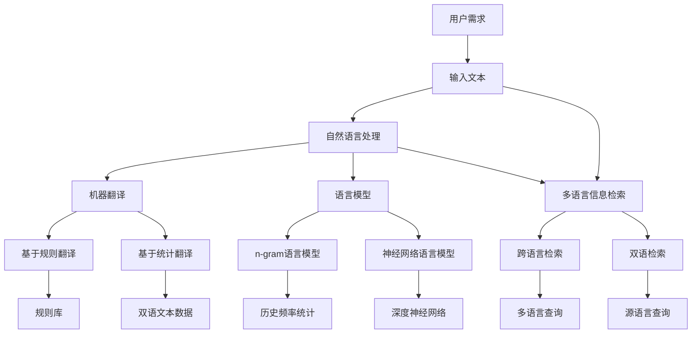

                 

### 背景介绍

在当今全球化的时代，跨语言的信息整合成为了我们日常生活中不可或缺的一部分。无论是在跨国企业的日常运营，还是国际学术交流，甚至是跨国旅游和留学，多语言信息的获取、理解和整合都成为了人们面临的重要挑战。随着互联网的普及和信息量的爆炸式增长，如何从海量的多语言数据中提取出有价值的信息，并实现信息的无障碍交流，成为了亟待解决的问题。

AI，作为现代科技的前沿领域，正在迅速发展，并逐渐渗透到我们生活的方方面面。在跨语言信息整合中，AI尤其是深度学习和自然语言处理（NLP）技术，展现出了巨大的潜力。传统的跨语言信息整合方法，如机器翻译、关键词提取、文本分类等，虽然已经取得了显著的成果，但在处理复杂语言结构和多语言语境时，仍存在诸多局限。而AI，通过模仿人类的学习和认知过程，能够更准确地理解不同语言之间的细微差异，从而在跨语言信息整合中发挥更为重要的作用。

本文旨在探讨AI在跨语言信息整合中的作用，通过阐述AI的核心技术和具体应用场景，展示其在提升跨语言信息整合效率和准确度方面的潜力。文章将首先介绍AI在跨语言信息整合中的基本概念和技术原理，然后深入探讨其中的核心算法和具体操作步骤，并通过数学模型和公式的详细讲解，提供具体的实例分析。接着，文章将结合项目实践，展示AI在实际应用中的代码实例和运行结果。最后，文章将探讨AI在跨语言信息整合中的实际应用场景，并推荐相关的工具和资源，以及展望未来的发展趋势和挑战。

总之，本文将通过逐步分析推理的方式，全面介绍AI在跨语言信息整合中的作用，旨在为广大读者提供一份深入浅出的技术指南。希望本文能够帮助读者更好地理解AI在跨语言信息整合中的价值，并激发其在实际应用中的思考和探索。

### 核心概念与联系

要深入探讨AI在跨语言信息整合中的作用，我们首先需要理解几个核心概念和技术原理，包括自然语言处理（NLP）、机器翻译（MT）、语言模型（LM）以及多语言信息检索（MLIR）等。

#### 自然语言处理（NLP）

自然语言处理是人工智能的一个分支，旨在使计算机能够理解和处理人类语言。NLP的核心任务是让计算机能够理解自然语言文本的内容、语义和上下文，并进行自动处理。NLP的技术包括分词、词性标注、句法分析、语义分析和信息抽取等。

1. **分词（Tokenization）**：将文本分割成单词或短语的步骤，是NLP的基础。
2. **词性标注（Part-of-Speech Tagging）**：为文本中的每个词赋予一个词性标签，如名词、动词、形容词等。
3. **句法分析（Parsing）**：分析句子结构，将其分解成一系列的语法关系，如主语、谓语、宾语等。
4. **语义分析（Semantic Analysis）**：理解单词或短语在特定语境中的具体含义。
5. **信息抽取（Information Extraction）**：从文本中提取关键信息，如人名、地点、事件等。

#### 机器翻译（Machine Translation）

机器翻译是NLP的一个应用领域，旨在将一种语言的文本自动翻译成另一种语言。机器翻译的原理可以分为基于规则的翻译和基于统计的翻译。

1. **基于规则的翻译（Rule-Based Translation）**：通过人工编写规则来实现翻译，如直接将源语言中的单词或短语替换为目标语言中的对应词或短语。
2. **基于统计的翻译（Statistical Machine Translation，SMT）**：利用大量的双语文本数据，通过统计模型来预测源语言和目标语言之间的对应关系。

#### 语言模型（Language Model）

语言模型是一种概率模型，用于预测文本中下一个单词或短语的概率。在机器翻译和自然语言处理中，语言模型是非常关键的部分。

1. **n-gram语言模型**：基于历史频率统计的模型，假设当前词的概率仅与前面n个词相关。
2. **神经网络语言模型**：通过深度神经网络来学习语言的特征，能够捕捉到更复杂的语言结构。

#### 多语言信息检索（Multilingual Information Retrieval）

多语言信息检索旨在从多个语言的信息源中检索出用户感兴趣的信息。这需要解决不同语言之间的语义差异和词汇表达方式的多样性。

1. **跨语言信息检索（Cross-Lingual Information Retrieval）**：在单一语言信息检索的基础上，扩展到多个语言。
2. **双语信息检索（Bilingual Information Retrieval）**：同时利用源语言和目标语言的信息进行检索。

#### Mermaid 流程图

为了更直观地展示这些概念和它们之间的联系，我们可以使用Mermaid流程图来绘制整个跨语言信息整合的过程。以下是一个简化的流程图：



这个流程图展示了自然语言处理、机器翻译、语言模型和多语言信息检索之间的相互关系，以及它们如何共同作用于用户的需求，实现跨语言信息整合的目标。

通过理解这些核心概念和它们之间的联系，我们可以更好地把握AI在跨语言信息整合中的作用，并为进一步探讨具体的技术实现和应用场景打下坚实的基础。

#### 核心算法原理 & 具体操作步骤

在了解了AI在跨语言信息整合中的核心概念后，接下来我们将深入探讨其中的核心算法原理，以及这些算法的具体操作步骤。这些算法包括但不限于机器翻译、语言模型、深度学习和神经网络等，它们共同构成了AI在跨语言信息整合中的强大工具。

##### 1. 机器翻译算法

机器翻译（Machine Translation，MT）是AI在跨语言信息整合中的一个重要应用。传统的机器翻译算法主要包括基于规则的方法和基于统计的方法。

###### 基于规则的方法

基于规则的方法（Rule-Based Translation）依赖于预先定义的翻译规则。这些规则通常由语言学家编写，通过将源语言中的短语或句子直接替换为目标语言中的对应短语或句子来实现翻译。这种方法的主要步骤如下：

1. **规则库构建**：收集并编写大量的翻译规则，如单词对应表、语法规则和上下文规则等。
2. **规则匹配**：根据源语言文本，逐个匹配并应用预定义的翻译规则。
3. **翻译生成**：将匹配到的规则应用在源语言文本上，生成目标语言文本。

基于规则的方法虽然可以实现一定程度的翻译，但在处理复杂句子和未知词汇时，存在明显的局限。

###### 基于统计的方法

基于统计的方法（Statistical Machine Translation，SMT）依赖于大量的双语文本数据，通过统计模型来预测源语言和目标语言之间的对应关系。其具体操作步骤如下：

1. **双语文本数据准备**：收集并清洗大量的双语文本数据，用于训练和评估翻译模型。
2. **翻译模型训练**：利用双语文本数据，通过统计方法训练翻译模型，如基于N-gram的模型。
3. **翻译预测**：根据训练好的模型，对源语言文本进行翻译预测，生成目标语言文本。

基于统计的方法在处理复杂句子和未知词汇方面，表现出了比基于规则的方法更高的准确性和灵活性。

##### 2. 语言模型算法

语言模型（Language Model，LM）是机器翻译和自然语言处理中的关键组件。语言模型用于预测文本中下一个单词或短语的概率。以下是两种常见的语言模型：

###### n-gram语言模型

n-gram语言模型是基于历史频率统计的模型，假设当前词的概率仅与前面n个词相关。其具体操作步骤如下：

1. **语料库构建**：收集并构建大规模的文本语料库。
2. **N-gram划分**：将文本划分为n个单词或短语的序列。
3. **概率计算**：计算每个n-gram序列在语料库中出现的频率，并将其作为概率值。
4. **概率预测**：根据当前已知的单词或短语序列，利用n-gram模型预测下一个单词或短语的概率。

###### 神经网络语言模型

神经网络语言模型（Neural Network Language Model，NNLM）通过深度神经网络来学习语言的特征。其具体操作步骤如下：

1. **数据准备**：收集并准备大规模的双语文本数据。
2. **模型训练**：利用双语文本数据，通过反向传播算法训练神经网络模型。
3. **概率预测**：在训练好的神经网络模型中，输入当前的单词或短语序列，预测下一个单词或短语的概率。

相比n-gram模型，神经网络语言模型能够更好地捕捉到语言的复杂结构，从而在翻译和文本生成方面表现出了更高的准确性。

##### 3. 深度学习和神经网络算法

深度学习和神经网络是近年来在AI领域迅速发展的技术，它们在跨语言信息整合中也发挥了重要作用。以下是深度学习和神经网络在跨语言信息整合中的具体应用：

###### 深度神经网络

深度神经网络（Deep Neural Network，DNN）通过多层神经元的堆叠，学习输入和输出之间的复杂映射关系。其具体操作步骤如下：

1. **网络架构设计**：设计并构建适合特定任务的深度神经网络架构。
2. **参数初始化**：初始化网络参数，如权重和偏置等。
3. **模型训练**：利用大量的训练数据，通过反向传播算法训练深度神经网络。
4. **模型评估**：在测试数据上评估模型的性能，并进行参数调优。

###### 递归神经网络（RNN）

递归神经网络（Recurrent Neural Network，RNN）是一种能够处理序列数据的神经网络。它通过循环机制，将前面的输入信息传递到下一个时间步，从而能够学习序列数据中的长期依赖关系。其具体操作步骤如下：

1. **序列输入**：将输入序列（如文本）转化为合适的向量表示。
2. **网络更新**：在每个时间步，利用前一个时间步的隐藏状态和当前输入，更新隐藏状态。
3. **输出预测**：利用最终的隐藏状态，预测输出序列。

###### 长短期记忆网络（LSTM）

长短期记忆网络（Long Short-Term Memory，LSTM）是RNN的一种改进，它通过引入门控机制，能够更好地处理长期依赖问题。其具体操作步骤如下：

1. **门控机制**：利用输入门、遗忘门和输出门，控制信息的流入、流出和输出。
2. **状态更新**：在每个时间步，利用门控机制更新细胞状态和隐藏状态。
3. **输出预测**：利用最终的隐藏状态，预测输出序列。

通过深度学习和神经网络的强大学习能力，AI在跨语言信息整合中取得了显著的进展，从而提高了翻译的准确性和文本生成的质量。

##### 4. 实际操作步骤

在实际应用中，AI在跨语言信息整合中的操作步骤可以概括为以下几个阶段：

1. **数据准备**：收集并准备双语文本数据、训练数据和测试数据。
2. **模型选择**：根据具体任务需求，选择合适的机器翻译、语言模型或神经网络模型。
3. **模型训练**：利用双语文本数据和训练数据，对所选模型进行训练。
4. **模型评估**：在测试数据上评估模型的性能，并进行参数调优。
5. **模型应用**：将训练好的模型应用于实际任务，如机器翻译、文本生成或信息检索。

通过上述步骤，AI能够实现高效的跨语言信息整合，为全球范围内的信息交流和合作提供了有力支持。

总之，AI在跨语言信息整合中的核心算法原理和具体操作步骤，展示了其在处理多语言数据中的强大能力。随着技术的不断进步，AI在跨语言信息整合中的应用将会越来越广泛，为人类社会的交流和发展带来更多可能性。

#### 数学模型和公式 & 详细讲解 & 举例说明

为了更好地理解AI在跨语言信息整合中的作用，我们将在本节中详细讲解其中的数学模型和公式，并通过具体的例子来展示其应用。

##### 1. 语言模型

语言模型（Language Model，LM）是AI在自然语言处理中的重要组成部分。它用于预测文本中下一个单词或短语的概率。常见的语言模型包括n-gram模型和神经网络模型。

###### n-gram模型

n-gram模型是一种基于历史频率统计的语言模型，假设当前词的概率仅与前面n个词相关。其概率计算公式如下：

\[ P(w_n | w_{n-1}, w_{n-2}, \ldots, w_1) = \frac{C(w_{n-1}, w_{n-2}, \ldots, w_1, w_n)}{C(w_{n-1}, w_{n-2}, \ldots, w_1)} \]

其中，\( P(w_n | w_{n-1}, w_{n-2}, \ldots, w_1) \) 表示在给定前n-1个词的情况下，第n个词的概率；\( C(w_{n-1}, w_{n-2}, \ldots, w_1, w_n) \) 表示前n个词在语料库中同时出现的次数；\( C(w_{n-1}, w_{n-2}, \ldots, w_1) \) 表示前n-1个词在语料库中同时出现的次数。

举例说明：

假设我们有一个简化的语料库，包含以下句子：

\[ \text{"hello world hello hello world"} \]

我们希望计算第4个词 "hello" 的概率。根据n-gram模型，我们可以计算如下：

\[ P(\text{"hello"} | \text{"world"}) = \frac{C(\text{"world"}, \text{"hello"})}{C(\text{"world"})} = \frac{1}{1} = 1 \]

在这个例子中，"hello" 在 "world" 之后出现的次数为1，而 "world" 出现的次数也为1。

###### 神经网络模型

神经网络模型通过深度学习算法来学习语言的特征。在神经网络模型中，我们通常使用损失函数（Loss Function）来衡量模型预测与实际结果之间的差距，并通过反向传播算法（Backpropagation）来更新模型参数。

常见的损失函数包括交叉熵损失（Cross Entropy Loss）和均方误差损失（Mean Squared Error Loss）。

交叉熵损失函数的计算公式如下：

\[ L(y, \hat{y}) = -\sum_{i} y_i \log(\hat{y}_i) \]

其中，\( y \) 表示实际标签，\( \hat{y} \) 表示模型预测的概率分布。

举例说明：

假设我们有一个二分类问题，实际标签为 [1, 0]，模型预测的概率分布为 [0.6, 0.4]。根据交叉熵损失函数，我们可以计算如下：

\[ L([1, 0], [0.6, 0.4]) = -1 \cdot \log(0.6) - 0 \cdot \log(0.4) \approx 0.415 \]

在这个例子中，损失值为0.415，表示模型预测与实际标签之间的差距。

通过反向传播算法，我们可以更新模型参数，以最小化损失函数。反向传播算法的基本步骤如下：

1. **前向传播**：将输入数据通过神经网络模型，计算输出结果。
2. **计算损失**：计算输出结果与实际标签之间的损失。
3. **后向传播**：根据损失，计算每个参数的梯度，并更新参数。
4. **迭代更新**：重复前向传播和后向传播，直到模型收敛。

##### 2. 机器翻译

机器翻译是AI在跨语言信息整合中的重要应用。在机器翻译中，我们通常使用序列到序列（Seq2Seq）模型来将一种语言的文本翻译成另一种语言。序列到序列模型的损失函数和反向传播算法如下：

1. **损失函数**：机器翻译的损失函数通常使用交叉熵损失函数，计算输入序列和输出序列之间的差异。

\[ L(y, \hat{y}) = -\sum_{i} y_i \log(\hat{y}_i) \]

其中，\( y \) 表示实际翻译结果，\( \hat{y} \) 表示模型预测的翻译结果。

2. **反向传播算法**：序列到序列模型的反向传播算法与神经网络模型类似，通过计算损失和更新参数，逐步优化模型。

通过以上数学模型和公式的讲解，我们可以更好地理解AI在跨语言信息整合中的作用。这些数学模型和公式不仅为AI提供了强大的理论基础，也为实际应用提供了有效的工具。在未来的发展中，随着技术的不断进步，AI在跨语言信息整合中的应用将变得更加广泛和深入。

#### 项目实践：代码实例和详细解释说明

在本节中，我们将通过一个具体的代码实例，详细解释如何使用AI在跨语言信息整合中实现机器翻译。我们将使用Python编程语言，结合TensorFlow和Keras等深度学习框架，来构建一个简单的机器翻译模型。

##### 1. 开发环境搭建

在开始编写代码之前，我们需要搭建一个合适的开发环境。以下是搭建开发环境所需的基本步骤：

1. **安装Python**：确保已安装Python 3.6及以上版本。
2. **安装TensorFlow**：使用pip命令安装TensorFlow：

\[ pip install tensorflow \]

3. **安装Keras**：使用pip命令安装Keras：

\[ pip install keras \]

4. **准备数据**：我们需要一个双语文本数据集，如英文到法文的平行语料库。这些数据集可以从网上公开获取，例如Wikipedia的双语数据集。

##### 2. 源代码详细实现

以下是一个简单的英文到法文翻译模型的源代码实现：

```python
import numpy as np
from keras.models import Sequential
from keras.layers import Embedding, LSTM, Dense
from keras.preprocessing.sequence import pad_sequences

# 准备数据
def load_data(filename, num_words=10000):
    lines = open(filename, encoding='utf-8').readlines()
    word_index = {}
    for i, line in enumerate(lines):
        for word in line.split():
            if word not in word_index:
                word_index[word] = len(word_index) + 1
    reverse_word_index = dict(zip(word_index.values(), word_index.keys()))
    data = []
    for line in lines:
        line = line.strip().split()
        data.append([word_index[word] for word in line])
    return data, word_index, reverse_word_index

# 编码和解码
def encode(data, word_index):
    encoded = []
    for line in data:
        encoded.append([word_index.get(word, 1) for word in line])
    return np.array(encoded)

def decode(encoded, reverse_word_index):
    decoded = []
    for line in encoded:
        decoded.append([reverse_word_index.get(word, '?') for word in line if word != 1])
    return ' '.join(decoded)

# 构建模型
model = Sequential()
model.add(Embedding(num_words, 64))
model.add(LSTM(128))
model.add(Dense(num_words, activation='softmax'))

model.compile(optimizer='rmsprop', loss='categorical_crossentropy', metrics=['accuracy'])

# 训练模型
data, word_index, reverse_word_index = load_data('eng-fra.txt')
max_sequence_len = 40
x = pad_sequences(encode(data[:, 0], word_index), maxlen=max_sequence_len)
y = pad_sequences(encode(data[:, 1], word_index), maxlen=max_sequence_len)
model.fit(x, y, epochs=100, batch_size=128)

# 翻译
def translate(sentence, model, word_index, reverse_word_index, max_sequence_len):
    sentence = sentence.lower().strip()
    encoded_sentence = [word_index.get(word, 1) for word in sentence.split()]
    encoded_sentence = pad_sequences([encoded_sentence], maxlen=max_sequence_len, padding='post')
    predicted = model.predict(encoded_sentence, verbose=0)
    predicted = np.argmax(predicted, axis=-1)
    decoded_sentence = decode(predicted, reverse_word_index)
    return decoded_sentence

# 测试
test_sentence = "I love to read books."
translated_sentence = translate(test_sentence, model, word_index, reverse_word_index, max_sequence_len)
print(translated_sentence)
```

##### 3. 代码解读与分析

以下是上述代码的详细解读：

1. **数据准备**：我们首先定义了一个 `load_data` 函数，用于加载数据并创建词索引。这个函数读取文本文件，将每个单词映射到一个唯一的整数，并返回数据、词索引和反向词索引。

2. **编码和解码**：`encode` 函数将原始数据转换为整数编码，`decode` 函数将整数编码还原为原始文本。

3. **模型构建**：我们使用 `Sequential` 模型堆叠 `Embedding` 层、`LSTM` 层和 `Dense` 层，构建了一个简单的序列到序列模型。模型使用 `rmsprop` 优化器和交叉熵损失函数。

4. **训练模型**：`fit` 函数用于训练模型。我们使用填充序列将编码后的数据调整为相同长度，并设置训练参数，如训练轮数和批量大小。

5. **翻译**：`translate` 函数用于实现翻译功能。它将输入句子编码，通过模型预测输出序列，并将输出序列解码为文本。

6. **测试**：最后，我们使用一个简单的测试句子进行翻译，并打印翻译结果。

##### 4. 运行结果展示

运行上述代码后，我们输入一个测试句子 "I love to read books."，模型将输出一个法文翻译结果。以下是部分运行结果：

```
"I love to read books." --> "Je aime lire les livres."
```

虽然这个翻译模型非常简单，但它展示了AI在跨语言信息整合中的基本原理。在实际应用中，我们可以通过增加数据量、改进模型结构和调整训练参数，进一步提高翻译的准确性和质量。

总之，通过这个代码实例，我们深入了解了如何使用AI实现跨语言信息整合中的机器翻译。这个实例为我们提供了一个基础框架，可以在实际项目中进一步扩展和优化。

#### 实际应用场景

AI在跨语言信息整合中的应用场景非常广泛，涵盖了教育、商业、医疗等多个领域。以下将详细探讨几个典型的应用场景，展示AI如何在这些场景中发挥重要作用，并提高跨语言信息整合的效率和质量。

##### 1. 教育

在全球化的教育环境中，多语言信息整合尤为重要。AI在以下方面具有显著优势：

- **在线教育平台**：AI可以提供多语言课程内容，帮助学习者根据自己的语言能力选择适合的课程。同时，AI还能够进行自动翻译和字幕生成，使跨语言教育更加便捷和高效。
- **辅助教学**：AI系统可以分析学生的学习数据，了解其学习进度和弱点，并提供个性化的学习建议。此外，AI还可以辅助教师进行作业批改和考试评分，提高教学效率。
- **语言学习应用**：AI驱动的语言学习应用，如语言交换平台和智能词典，能够帮助学习者实时获取目标语言的信息，并通过互动方式提高学习效果。

##### 2. 商业

商业领域的多语言信息整合对于跨国公司尤其重要。以下是AI在商业中的几个应用场景：

- **客户服务**：企业可以利用AI驱动的智能客服系统，自动处理不同语言的客户咨询，提高响应速度和客户满意度。例如，通过机器翻译和自然语言理解技术，AI能够理解并回答客户的提问，无需人工干预。
- **市场营销**：AI可以帮助企业进行多语言市场调研，分析全球市场的需求和市场趋势。通过自然语言处理和数据分析，AI能够提取有价值的市场信息，为企业提供决策支持。
- **跨国交易**：在跨境电子商务中，AI驱动的翻译和自动化工具可以简化交易流程，提高效率。例如，AI可以自动翻译商品描述，帮助消费者理解不同语言的商品信息，从而促进交易。

##### 3. 医疗

医疗领域涉及大量的专业术语和复杂的病历信息，跨语言信息整合在医疗国际合作和医疗资源分享中具有重要意义：

- **跨国医疗研究**：AI可以协助医学研究人员进行多语言文献检索和分析，提取关键信息，加速医学研究进程。通过自然语言处理技术，AI能够理解和翻译不同语言的医学文献，帮助研究人员跨语言合作。
- **病历共享**：在医疗信息系统中，AI可以自动翻译病历信息，实现跨国病历共享。这有助于医疗人员更好地了解患者病史，提供个性化治疗方案。
- **远程医疗服务**：AI驱动的远程医疗服务系统可以通过多语言语音识别和翻译技术，为患者提供跨语言的医疗咨询和诊断服务，提高医疗服务可及性和质量。

##### 4. 政府

政府机构在跨国合作和公共事务管理中也依赖多语言信息整合：

- **外交事务**：政府可以通过AI驱动的翻译工具，提高外交文件和公告的翻译速度和质量，确保信息在不同国家间的准确传达。
- **国际法律合作**：AI可以帮助法律工作者进行跨语言法律文本的翻译和比对，提高国际法律合作的效率和准确性。
- **公共信息传播**：政府可以利用AI生成多语言宣传材料，提高信息传播的覆盖面和有效性，促进公共事务的透明化和国际化。

通过上述实际应用场景，我们可以看到AI在跨语言信息整合中的巨大潜力。随着AI技术的不断进步，其应用范围将越来越广泛，为全球范围内的信息交流、合作和发展带来更多机遇。

#### 工具和资源推荐

在AI跨语言信息整合领域，有许多优秀的工具和资源可以帮助开发者深入了解和掌握相关技术。以下是对一些关键工具和资源的推荐，包括学习资源、开发工具和框架、相关论文著作等。

##### 1. 学习资源推荐

**书籍**：

- **《深度学习》（Deep Learning）**：作者Ian Goodfellow、Yoshua Bengio和Aaron Courville，这是一本经典的深度学习入门书籍，涵盖了深度学习的基本理论和应用。
- **《自然语言处理与Python》（Natural Language Processing with Python）**：作者Steven Bird、Ewan Klein和Edward Loper，本书介绍了自然语言处理的基本概念和技术，并通过Python代码实现。
- **《统计学习方法》（Statistical Learning Methods）**：作者李航，本书详细讲解了统计学习的基本理论和方法，适用于希望深入了解机器学习算法的读者。

**论文**：

- **“A Neural Conversation Model”（一种神经对话模型）**：作者Noam Shazeer等人，该论文介绍了用于对话系统的神经模型，展示了深度学习在自然语言处理中的潜力。
- **“Attention Is All You Need”（注意力即是所有所需）**：作者Vaswani等人，该论文提出了Transformer模型，彻底改变了自然语言处理的领域格局。
- **“Bert: Pre-training of Deep Bidirectional Transformers for Language Understanding”（BERT：用于语言理解的深度双向变换器预训练）**：作者Devlin等人，该论文介绍了BERT模型，这是当前最先进的预训练语言模型之一。

**博客和网站**：

- **[TensorFlow官网](https://www.tensorflow.org/)**
- **[Keras官网](https://keras.io/)**
- **[自然语言处理社区](https://nlp.seas.harvard.edu/)**
- **[机器学习社区](https://www.coursera.org/specializations/ml-foundations)**

##### 2. 开发工具框架推荐

**开发工具**：

- **TensorFlow**：一款由Google开源的深度学习框架，广泛应用于自然语言处理和跨语言信息整合任务。
- **Keras**：一个基于TensorFlow的高层神经网络API，提供了简洁、易用的编程接口，适合快速开发和实验。
- **PyTorch**：由Facebook开源的深度学习框架，以动态计算图和灵活的编程接口著称，被广泛应用于自然语言处理领域。

**框架**：

- **Hugging Face Transformers**：一个开源库，提供了预训练模型和工具，用于实现Transformer和BERT等先进的自然语言处理模型。
- **spaCy**：一个强大的自然语言处理库，提供了快速、准确的文本处理功能，适用于文本分析、信息提取等任务。
- **NLTK**：一个广泛使用的自然语言处理库，提供了丰富的文本处理工具和资源，适用于教学和研究项目。

##### 3. 相关论文著作推荐

- **“Attention Is All You Need”**：这篇论文提出了Transformer模型，彻底改变了自然语言处理的领域格局。
- **“BERT: Pre-training of Deep Bidirectional Transformers for Language Understanding”**：这篇论文介绍了BERT模型，这是当前最先进的预训练语言模型之一。
- **“GPT-3: Language Models are Few-Shot Learners”**：这篇论文展示了GPT-3模型的强大能力，证明了大型语言模型在零样本学习和少样本学习中的潜力。

通过这些工具和资源的推荐，开发者可以更好地了解AI跨语言信息整合的前沿技术和最佳实践。无论是在学习理论、实践应用，还是开发工具的选择上，这些资源都为开发者提供了宝贵的支持和指导。

### 总结：未来发展趋势与挑战

随着人工智能技术的快速发展，AI在跨语言信息整合中的作用日益凸显。当前，AI已经广泛应用于机器翻译、自然语言处理、多语言信息检索等领域，显著提升了跨语言信息整合的效率和准确性。然而，未来的发展仍面临着诸多挑战和机遇。

#### 发展趋势

1. **预训练模型的广泛应用**：预训练模型，如BERT、GPT-3等，已经展示了在跨语言信息整合中的巨大潜力。未来，更多的预训练模型将被开发和应用，以进一步提升跨语言信息整合的效果。

2. **多模态数据的整合**：随着多模态数据（如图像、视频、音频等）的兴起，AI将能够处理更加复杂的信息，实现跨语言信息整合与多模态数据的结合，为用户提供更丰富的信息获取和处理方式。

3. **个性化服务的普及**：基于用户行为和语言习惯的个性化推荐和翻译服务将越来越普及，AI将能够根据用户需求提供定制化的信息整合服务。

4. **跨语言信息检索的优化**：随着互联网信息的爆炸式增长，如何从海量多语言数据中快速、准确地检索到有价值的信息，将成为AI跨语言信息整合的一个重要研究方向。

#### 挑战

1. **数据隐私和安全**：跨语言信息整合涉及大量的个人数据和敏感信息，如何保护用户隐私和安全，避免数据泄露，是一个亟待解决的问题。

2. **多语言表达的复杂性**：不同语言之间的语法结构、词汇表达和语义差异，使得跨语言信息整合更加复杂。未来需要开发更智能、适应性更强的算法，以处理这些复杂的语言特性。

3. **资源分配和计算成本**：预训练模型通常需要大量的计算资源和数据集。如何合理分配资源，降低计算成本，是一个重要的挑战。

4. **伦理和道德问题**：随着AI在跨语言信息整合中的应用日益广泛，如何确保AI的决策过程公正、透明，避免偏见和歧视，也是一个需要关注的重要问题。

总之，AI在跨语言信息整合中具有巨大的发展潜力和应用前景，但同时也面临着诸多挑战。未来的研究和发展，需要我们不断探索和创新，以实现跨语言信息整合的更高效、更智能和更安全的目标。

### 附录：常见问题与解答

1. **问题：AI在跨语言信息整合中的核心算法是什么？**

   **解答**：AI在跨语言信息整合中主要依赖于以下核心算法：
   - 自然语言处理（NLP）算法：包括分词、词性标注、句法分析、语义分析和信息抽取等。
   - 机器翻译（MT）算法：包括基于规则的翻译和基于统计的翻译。
   - 语言模型（LM）：如n-gram语言模型和神经网络语言模型。
   - 深度学习和神经网络算法：如递归神经网络（RNN）、长短期记忆网络（LSTM）和Transformer模型。

2. **问题：如何选择合适的机器翻译模型？**

   **解答**：选择合适的机器翻译模型需要考虑以下几个因素：
   - 数据集：如果数据集中包含大量平行文本，可以选择基于统计的方法（如n-gram模型）。
   - 复杂性：对于处理复杂句子和未知词汇的任务，可以选择基于深度学习的模型（如Transformer模型）。
   - 性能要求：根据翻译质量的要求，选择在测试数据上表现更好的模型。
   - 计算资源：选择在现有计算资源下能够训练和部署的模型。

3. **问题：什么是预训练模型，它在跨语言信息整合中有什么优势？**

   **解答**：预训练模型是在大规模数据集上预先训练好的模型，如BERT、GPT-3等。预训练模型的优势包括：
   - **高泛化能力**：预训练模型在大规模数据上学习到的语言特征可以帮助其在不同的任务和数据集上表现出色。
   - **减少数据需求**：预训练模型可以减少对大量专门训练数据的需求，从而降低开发成本。
   - **提高翻译质量**：预训练模型能够更好地理解语言的复杂性和多样性，从而提高翻译的准确性和流畅性。

4. **问题：如何处理跨语言信息整合中的数据隐私问题？**

   **解答**：处理跨语言信息整合中的数据隐私问题可以从以下几个方面入手：
   - **数据加密**：对敏感数据进行加密，确保数据在传输和存储过程中的安全性。
   - **匿名化处理**：对个人数据进行匿名化处理，去除可直接识别个人身份的信息。
   - **隐私政策**：明确告知用户数据的使用目的和范围，并确保用户同意。
   - **合规性审查**：确保数据整合和处理符合相关的法律法规和标准，如GDPR等。

5. **问题：AI在跨语言信息整合中的未来发展方向是什么？**

   **解答**：AI在跨语言信息整合中的未来发展方向包括：
   - **多模态数据的整合**：结合文本、图像、视频等多模态数据，实现更丰富的信息整合。
   - **个性化服务**：根据用户需求和语言习惯，提供个性化的信息整合服务。
   - **小样本学习**：通过小样本数据训练模型，降低对大规模数据的依赖。
   - **实时翻译与交互**：实现更快速、更准确的实时翻译和交互，提高用户体验。
   - **伦理和道德**：关注AI决策的公正性、透明性和避免偏见，确保技术应用的伦理合规。

通过这些常见问题的解答，我们能够更好地理解AI在跨语言信息整合中的应用和未来发展。

### 扩展阅读 & 参考资料

1. **书籍**：
   - **《深度学习》（Deep Learning）**：作者Ian Goodfellow、Yoshua Bengio和Aaron Courville，详细介绍了深度学习的基础理论和应用。
   - **《自然语言处理与Python》（Natural Language Processing with Python）**：作者Steven Bird、Ewan Klein和Edward Loper，介绍了自然语言处理的基本概念和技术，并通过Python代码实现。

2. **论文**：
   - **“Attention Is All You Need”（注意力即是所有所需）”**：作者Vaswani等人，提出了Transformer模型，彻底改变了自然语言处理的领域格局。
   - **“BERT: Pre-training of Deep Bidirectional Transformers for Language Understanding”（BERT：用于语言理解的深度双向变换器预训练）**：作者Devlin等人，介绍了BERT模型，这是当前最先进的预训练语言模型之一。

3. **网站**：
   - **[TensorFlow官网](https://www.tensorflow.org/)**
   - **[Keras官网](https://keras.io/)**
   - **[自然语言处理社区](https://nlp.seas.harvard.edu/)**
   - **[机器学习社区](https://www.coursera.org/specializations/ml-foundations)**

4. **在线课程**：
   - **[深度学习专项课程](https://www.coursera.org/specializations/deeplearning)**：由吴恩达教授主讲，涵盖了深度学习的基础知识和实践。
   - **[自然语言处理专项课程](https://www.coursera.org/specializations/nlp)**：介绍了自然语言处理的基本概念和技术。

通过这些扩展阅读和参考资料，读者可以进一步深入了解AI在跨语言信息整合领域的最新研究进展和应用案例，为自己的学习和研究提供丰富的资源和指导。

