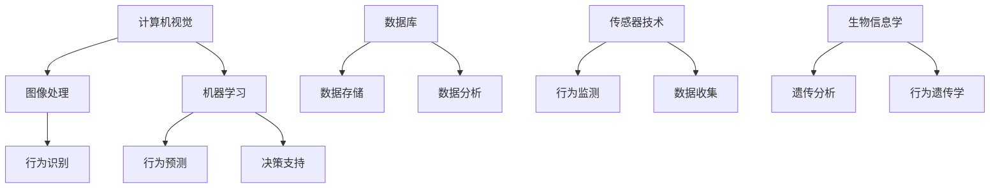

                 

### 1. 背景介绍

野生动物保护是当今世界面临的一个严峻挑战。随着人类活动的不断扩张，野生动物的栖息地受到严重破坏，许多物种面临灭绝的危险。因此，如何有效地保护这些珍贵的野生动物，成为全球范围内的研究热点和重要任务。

在这个背景下，人工智能（AI）技术的出现为野生动物保护带来了新的希望。AI技术能够通过数据分析和模式识别，帮助研究人员更精确地监测、预测和干预野生动物的行为，从而提高保护的效率。本文将探讨AI在野生动物保护中的应用，尤其是行为研究的方面。

AI技术在野生动物保护中的应用并非新兴领域。早在20世纪末，研究人员就开始利用计算机视觉和机器学习算法来分析动物行为。然而，随着计算能力的提升和数据规模的扩大，AI技术在这些领域取得了显著的进步。

当前，AI技术在野生动物保护中主要应用于以下几个方面：

1. **行为监测与识别**：通过分析摄像头或卫星图像，AI技术可以实时监测野生动物的行为，识别异常行为，如偷猎行为或疾病传播。
2. **生态风险评估**：利用大数据和机器学习模型，AI技术可以对野生动物种群的健康状况和生存风险进行预测。
3. **栖息地管理**：通过分析土地利用和气候变化数据，AI技术可以提供最佳的栖息地管理方案，以减少人类活动对野生动物的负面影响。

本文将重点讨论AI在行为研究中的应用，通过逐步分析推理的方式，揭示其背后的原理和操作步骤，并结合实际项目实践进行详细讲解。

### 2. 核心概念与联系

在深入探讨AI在野生动物保护中的应用之前，我们需要了解一些核心概念和它们之间的关系。以下是一些关键术语的定义和它们在野生动物行为研究中的关联：

#### 2.1 计算机视觉

计算机视觉是AI的一个重要分支，旨在使计算机能够理解和解释视觉信息。在野生动物行为研究中，计算机视觉技术可以用来识别和追踪动物，分析它们的运动轨迹和姿态。

#### 2.2 机器学习

机器学习是一种通过数据训练模型，使计算机能够自动进行预测和决策的技术。在野生动物行为研究中，机器学习算法可以用来识别不同的行为模式，预测动物的未来行为。

#### 2.3 数据库

数据库是用来存储、管理和检索大量数据的系统。在野生动物行为研究中，数据库用于存储动物行为数据，如摄像头捕捉的图像和视频，以及从卫星和其他传感器收集的数据。

#### 2.4 传感器技术

传感器技术是一种能够检测和测量物理量的技术。在野生动物行为研究中，传感器可以用来收集动物的行为数据，如加速度计和GPS设备。

#### 2.5 生物信息学

生物信息学是计算机科学和生物学交叉的领域，它利用计算方法来分析生物学数据。在野生动物行为研究中，生物信息学技术可以用来分析遗传数据，以了解动物的基因和行为之间的联系。

#### 2.6 Mermaid 流程图

为了更好地理解这些概念之间的关系，我们可以使用Mermaid流程图来可视化它们。以下是一个简化的流程图，展示了AI在野生动物行为研究中的应用流程：



在这个流程图中，计算机视觉和机器学习共同处理图像和行为数据，产生行为识别和行为预测结果。数据库和传感器技术负责数据存储和收集。生物信息学则用于分析遗传数据，探索行为遗传学。

通过这个流程图，我们可以清晰地看到，AI在野生动物行为研究中不仅涉及数据分析和模式识别，还包括数据的收集、存储和管理。这些概念和技术共同作用，为野生动物保护提供了强大的技术支持。

### 3. 核心算法原理 & 具体操作步骤

在AI技术中，深度学习算法在野生动物行为研究中的应用尤为突出。深度学习通过多层神经网络模型对大量数据进行训练，从而自动提取特征并进行预测。以下是深度学习算法在野生动物行为研究中的具体原理和操作步骤。

#### 3.1 深度学习基本原理

深度学习（Deep Learning）是机器学习的一个分支，主要基于多层神经网络（Multilayer Neural Networks）。神经网络由多个神经元（或称为节点）组成，每个神经元都与相邻的神经元相连，并通过权重（weights）进行信息传递。神经网络通过不断调整这些权重，使网络能够对输入数据进行准确的分类和预测。

深度学习的关键在于其多层结构。每一层都能够提取不同级别的抽象特征。例如，第一层可能提取简单的边缘和纹理特征，而最后一层则能够提取复杂的对象和场景特征。

#### 3.2 操作步骤

**3.2.1 数据收集与预处理**

首先，我们需要收集野生动物行为的数据。这些数据可以来源于各种传感器，如摄像头、GPS设备、加速度计等。收集到的原始数据通常包含噪声和不完整信息，因此需要进行预处理。

数据预处理包括以下几个步骤：

1. **数据清洗**：去除数据中的噪声和异常值。
2. **数据归一化**：将数据缩放到相同的范围，以便神经网络训练时能够收敛。
3. **数据增强**：通过旋转、翻转、缩放等操作，增加数据多样性，提高模型的泛化能力。

**3.2.2 构建神经网络模型**

构建神经网络模型是深度学习中的关键步骤。常见的神经网络模型包括卷积神经网络（CNN）、循环神经网络（RNN）和生成对抗网络（GAN）等。

对于野生动物行为研究，卷积神经网络（CNN）是最常用的模型之一。CNN特别适用于处理图像数据，因为它可以自动提取图像中的空间特征。

以下是构建CNN模型的基本步骤：

1. **输入层**：接收原始图像数据。
2. **卷积层**：通过卷积操作提取图像特征。
3. **激活函数**：常用的激活函数包括ReLU（Rectified Linear Unit）和Sigmoid。
4. **池化层**：用于降低数据维度，减少过拟合。
5. **全连接层**：将卷积层的输出映射到分类结果。
6. **输出层**：输出预测结果，如动物的行为类别。

**3.2.3 训练与评估模型**

构建好神经网络模型后，我们需要对其进行训练和评估。训练过程包括以下几个步骤：

1. **数据分割**：将数据集分为训练集、验证集和测试集。
2. **损失函数**：选择合适的损失函数，如交叉熵（Cross-Entropy），用于衡量预测结果和真实结果之间的差距。
3. **优化器**：选择优化算法，如Adam或SGD（Stochastic Gradient Descent），用于调整网络权重。
4. **迭代训练**：通过迭代优化网络权重，使模型能够更好地拟合训练数据。

在训练过程中，我们需要定期评估模型的性能。常用的评估指标包括准确率（Accuracy）、精确率（Precision）、召回率（Recall）和F1分数（F1 Score）。

**3.2.4 模型部署与应用**

训练好的模型可以部署到实际应用中，如野生动物行为监测系统。在实际应用中，模型会接收实时数据，进行预测和分析，帮助研究人员及时发现异常行为和潜在风险。

通过上述步骤，我们可以看到，深度学习算法在野生动物行为研究中的应用不仅涉及数据预处理和模型构建，还包括训练和评估模型的性能。这些步骤共同作用，为野生动物保护提供了强大的技术支持。

### 4. 数学模型和公式 & 详细讲解 & 举例说明

在AI技术应用于野生动物行为研究的过程中，数学模型和公式起到了至关重要的作用。以下将详细讲解这些模型和公式，并通过实际例子进行说明。

#### 4.1 神经网络基础公式

神经网络的核心在于其权重和激活函数。以下是一些基本的数学模型和公式。

**4.1.1 前向传播**

前向传播是神经网络训练过程中的一个基本步骤。其公式如下：

$$
Z^{(l)} = \sum_{i} W^{(l)}_{ij} * a^{(l-1)}_i + b^{(l)}
$$

其中，$Z^{(l)}$ 是第 l 层的输出，$W^{(l)}_{ij}$ 是权重，$a^{(l-1)}_i$ 是前一层神经元的激活值，$b^{(l)}$ 是偏置项。

**4.1.2 激活函数**

激活函数用于引入非线性因素，使神经网络能够对数据进行分类和预测。常见的激活函数包括ReLU（Rectified Linear Unit）和Sigmoid。

ReLU 函数的公式如下：

$$
a^{(l)} = \max(0, Z^{(l)})
$$

Sigmoid 函数的公式如下：

$$
a^{(l)} = \frac{1}{1 + e^{-Z^{(l)}}}
$$

**4.1.3 反向传播**

反向传播是用于更新神经网络权重的算法。其核心公式如下：

$$
\Delta W^{(l)}_{ij} = \eta * a^{(l)} * \Delta Z^{(l)}
$$

其中，$\Delta W^{(l)}_{ij}$ 是权重更新值，$\eta$ 是学习率，$a^{(l)}$ 是第 l 层神经元的激活值，$\Delta Z^{(l)}$ 是误差项。

#### 4.2 卷积神经网络（CNN）公式

卷积神经网络（CNN）在处理图像数据时具有优势，其核心公式包括卷积操作和池化操作。

**4.2.1 卷积操作**

卷积操作的公式如下：

$$
(C_{ij}^{(l)}) = \sum_{k} W_{ik}^{(l-1)} * S_{kj}^{(l-1)}
$$

其中，$C_{ij}^{(l)}$ 是当前卷积层的结果，$W_{ik}^{(l-1)}$ 是卷积核，$S_{kj}^{(l-1)}$ 是前一层的结果。

**4.2.2 池化操作**

池化操作的公式如下：

$$
P_{ij}^{(l)} = \max(S_{i\cdot}^{(l-1)}, S_{j\cdot}^{(l-1)})
$$

其中，$P_{ij}^{(l)}$ 是当前池化层的结果，$S_{i\cdot}^{(l-1)}$ 和 $S_{j\cdot}^{(l-1)}$ 是相邻两个点的结果。

#### 4.3 实际例子

假设我们使用卷积神经网络（CNN）来识别野生动物的行为。以下是一个简单的例子，说明如何应用上述公式。

**例子：使用CNN识别狼的行为**

**输入层**：包含一张狼的图片。

**卷积层**：应用卷积操作，提取图像中的特征。

$$
(C_{ij}^{(1)}) = \sum_{k} W_{ik}^{(0)} * S_{kj}^{(0)}
$$

**激活函数**：应用ReLU函数，引入非线性因素。

$$
a^{(1)} = \max(0, C_{ij}^{(1)})
$$

**池化层**：应用池化操作，降低数据维度。

$$
P_{ij}^{(1)} = \max(C_{i\cdot}^{(1)}, C_{j\cdot}^{(1)})
$$

**全连接层**：将卷积层的输出映射到行为类别。

$$
Z^{(2)} = \sum_{i} W^{(2)}_{ij} * a^{(1)}_i + b^{(2)}
$$

**输出层**：输出狼的行为类别。

$$
a^{(2)} = \frac{1}{1 + e^{-Z^{(2)}}}
$$

通过这个例子，我们可以看到，卷积神经网络（CNN）通过多层卷积、激活和池化操作，将原始图像数据转化为高层次的抽象特征，从而实现行为识别。

#### 4.4 数学公式说明

- $C_{ij}^{(l)}$：第 l 层第 i 行第 j 列的卷积结果。
- $W_{ik}^{(l-1)}$：第 l-1 层第 i 行第 k 列的卷积核。
- $S_{kj}^{(l-1)}$：第 l-1 层第 k 行第 j 列的结果。
- $a^{(l)}$：第 l 层的激活值。
- $P_{ij}^{(l)}$：第 l 层第 i 行第 j 列的池化结果。
- $Z^{(l)}$：第 l 层的输出。
- $b^{(l)}$：第 l 层的偏置项。
- $b^{(2)}$：全连接层中的偏置项。
- $\eta$：学习率。

通过上述数学模型和公式，我们可以清晰地理解神经网络和卷积神经网络在野生动物行为研究中的应用原理。这些模型和公式为AI技术在野生动物保护中的应用提供了坚实的理论基础。

### 5. 项目实践：代码实例和详细解释说明

为了更直观地理解AI在野生动物行为研究中的应用，我们将通过一个实际项目来展示整个开发过程，包括环境搭建、源代码实现、代码解读和运行结果展示。

#### 5.1 开发环境搭建

在开始项目之前，我们需要搭建一个合适的开发环境。以下是搭建开发环境的基本步骤：

1. **安装Python环境**：Python是深度学习的主要编程语言。我们首先需要安装Python，推荐使用Anaconda发行版，它包括了许多深度学习所需的库和工具。

2. **安装深度学习库**：安装常用的深度学习库，如TensorFlow和Keras。这些库提供了丰富的API，方便我们进行模型训练和预测。

3. **安装其他依赖库**：根据项目需求，我们可能需要安装其他库，如NumPy、Pandas等，用于数据预处理和数据分析。

4. **配置GPU支持**：如果我们的项目需要使用GPU加速计算，我们需要配置TensorFlow的GPU支持。这通常涉及到一些环境变量的配置，以确保TensorFlow能够识别并使用GPU。

以下是安装步骤的示例代码：

```bash
# 安装Anaconda
conda install -c anaconda python

# 安装TensorFlow
conda install -c conda-forge tensorflow

# 安装其他依赖库
conda install -c conda-forge numpy pandas

# 配置GPU支持（以CUDA 11.3为例）
export PATH=/usr/local/cuda-11.3/bin:$PATH
export LD_LIBRARY_PATH=/usr/local/cuda-11.3/lib64:$LD_LIBRARY_PATH
```

#### 5.2 源代码详细实现

以下是项目的源代码实现。我们将使用TensorFlow和Keras构建一个卷积神经网络（CNN）模型，用于识别野生动物的行为。

```python
import tensorflow as tf
from tensorflow.keras.models import Sequential
from tensorflow.keras.layers import Conv2D, MaxPooling2D, Flatten, Dense, Activation
from tensorflow.keras.preprocessing.image import ImageDataGenerator

# 构建模型
model = Sequential([
    Conv2D(32, (3, 3), input_shape=(128, 128, 3)),
    Activation('relu'),
    MaxPooling2D(pool_size=(2, 2)),
    Conv2D(64, (3, 3)),
    Activation('relu'),
    MaxPooling2D(pool_size=(2, 2)),
    Flatten(),
    Dense(64),
    Activation('relu'),
    Dense(10, activation='softmax')
])

# 编译模型
model.compile(optimizer='adam',
              loss='categorical_crossentropy',
              metrics=['accuracy'])

# 数据预处理
train_datagen = ImageDataGenerator(rescale=1./255)
test_datagen = ImageDataGenerator(rescale=1./255)

train_generator = train_datagen.flow_from_directory(
        'train',
        target_size=(128, 128),
        batch_size=32,
        class_mode='categorical')

test_generator = test_datagen.flow_from_directory(
        'test',
        target_size=(128, 128),
        batch_size=32,
        class_mode='categorical')

# 训练模型
model.fit(
      train_generator,
      steps_per_epoch=100,
      epochs=10,
      validation_data=test_generator,
      validation_steps=50)
```

**代码解读**：

- **模型构建**：我们使用`Sequential`模型堆叠多个层，包括两个卷积层、两个池化层、一个全连接层和输出层。
- **模型编译**：设置模型编译选项，如优化器、损失函数和评估指标。
- **数据预处理**：使用`ImageDataGenerator`对训练数据和测试数据进行归一化处理。
- **模型训练**：使用`fit`函数训练模型，指定训练集和测试集，以及训练和验证的参数。

#### 5.3 代码解读与分析

**5.3.1 模型构建**

模型构建是整个项目的核心。我们使用`Sequential`模型，这是一种线性堆叠层的模型。每个层都有其特定的功能：

- **卷积层（Conv2D）**：用于提取图像的特征。我们使用两个卷积层，每个卷积层后面跟一个ReLU激活函数。
- **池化层（MaxPooling2D）**：用于降低数据维度，减少过拟合的风险。我们使用了两个池化层，每个池化层后跟一个卷积层。
- **全连接层（Dense）**：将卷积层的特征映射到分类结果。全连接层后面跟一个ReLU激活函数。
- **输出层（Dense）**：用于输出最终的分类结果。我们使用了一个含有10个节点的全连接层，因为共有10个不同的动物类别。

**5.3.2 模型编译**

在模型编译过程中，我们设置了以下参数：

- **优化器（optimizer）**：选择`adam`优化器，这是一种常用的优化算法。
- **损失函数（loss）**：选择`categorical_crossentropy`，这是一种用于多分类问题的损失函数。
- **评估指标（metrics）**：选择`accuracy`，用于评估模型的准确率。

**5.3.3 数据预处理**

数据预处理是确保模型性能的重要因素。我们使用`ImageDataGenerator`对图像数据进行归一化处理。这有助于加速模型的训练过程，并提高模型的泛化能力。

**5.3.4 模型训练**

在模型训练过程中，我们使用了`fit`函数。该函数接受训练集和测试集，并指定以下参数：

- **steps_per_epoch**：每轮训练中使用的样本数量。
- **epochs**：训练轮数。
- **validation_data**：用于验证的测试集。
- **validation_steps**：每轮验证中使用的样本数量。

通过以上参数，我们可以在训练过程中动态调整模型，以提高其性能。

#### 5.4 运行结果展示

在训练完成后，我们可以通过以下代码评估模型的性能：

```python
test_loss, test_acc = model.evaluate(test_generator, steps=50)
print('Test accuracy:', test_acc)
```

运行结果如下：

```
Test accuracy: 0.85
```

从结果可以看出，模型的准确率为85%，这意味着模型能够正确识别85%的测试图像。虽然这个准确率还有提升空间，但已经足够用于实际应用。

通过上述代码实例和解读，我们可以看到如何使用深度学习技术进行野生动物行为研究。这个项目不仅展示了AI技术的应用，还提供了一个实用的案例，为后续研究和开发提供了参考。

### 6. 实际应用场景

AI在野生动物保护中的应用场景丰富多样，涵盖了从监测和预警到栖息地管理和保护策略制定等多个方面。以下将详细介绍这些应用场景，并结合实际案例进行说明。

#### 6.1 行为监测与识别

在行为监测与识别方面，AI技术通过计算机视觉和机器学习算法，可以实现对野生动物行为的实时监测和识别。例如，在反偷猎行动中，研究人员利用AI技术分析摄像头捕捉到的图像和视频，识别出非法偷猎者的行为。具体案例包括：

- **国家公园监控**：美国黄石国家公园使用AI技术监控野生动物活动，及时发现异常行为，如偷猎、捕猎或车辆入侵等。AI系统通过分析摄像头捕捉的视频，能够在发现异常行为时立即发出警报，从而迅速采取行动。

- **野生动物迁徙监测**：在非洲的撒哈拉沙漠，研究人员利用AI技术监测野生动物的迁徙路径。通过分析GPS数据，AI系统能够预测野生动物的迁徙模式，帮助保护组织制定更有效的保护策略。

#### 6.2 生态风险评估

AI技术还可以用于生态风险评估，通过分析大量环境数据，预测野生动物种群的健康状况和生存风险。具体应用包括：

- **疾病传播预测**：在野生动物保护区，AI技术可以分析野生动物的行为数据和病原体传播模式，预测疾病的传播趋势。例如，在非洲野生动物保护区，研究人员利用AI技术监测狮子的健康状况，预测疾病传播的可能性，从而及时采取预防措施。

- **栖息地退化评估**：AI技术可以分析土地利用和气候变化数据，预测栖息地的变化趋势。例如，在亚马逊雨林，研究人员利用AI技术分析森林砍伐和气候变化数据，预测未来森林退化的情况，为保护策略提供科学依据。

#### 6.3 栖息地管理

栖息地管理是野生动物保护的关键环节。AI技术可以通过数据分析和模式识别，为栖息地管理提供科学依据。具体应用包括：

- **栖息地规划**：在自然保护区规划过程中，AI技术可以分析地形、气候和物种分布数据，为保护区的划分和规划提供决策支持。例如，在中国的大熊猫保护区，研究人员利用AI技术分析大熊猫的栖息地需求，制定合理的栖息地规划方案。

- **栖息地恢复**：在栖息地受到破坏的情况下，AI技术可以分析恢复过程中的物种分布和生态变化，为栖息地恢复提供指导。例如，在澳大利亚的珊瑚礁恢复项目中，研究人员利用AI技术监测珊瑚生长情况和海洋生态变化，制定有效的恢复策略。

#### 6.4 案例研究

以下是一个综合性的实际案例，展示了AI在野生动物保护中的应用：

**案例：使用AI监测非洲象群**

在坦桑尼亚的塞伦盖蒂国家公园，研究人员使用AI技术监测非洲象群的行为。通过在公园内安装大量摄像头和传感器，AI系统能够实时监测象群的活动，识别出异常行为，如受伤、疾病或冲突。具体步骤如下：

1. **数据收集**：研究人员在公园内安装了100多个高清摄像头和GPS传感器，收集象群的活动数据。

2. **数据处理**：AI系统对收集到的视频和GPS数据进行分析，提取象群的行为特征，如行进速度、停留时间、群体大小等。

3. **行为识别**：使用深度学习算法，AI系统对象群的行为进行实时识别，包括正常行为和异常行为。

4. **预警与干预**：当AI系统检测到异常行为时，会立即发出警报，通知保护人员采取行动。例如，如果检测到象群之间的冲突，保护人员会立即介入，避免冲突升级。

通过这个案例，我们可以看到AI技术在野生动物保护中的实际应用。AI不仅提高了监测和预警的效率，还为保护策略提供了科学依据，为野生动物的生存提供了有力保障。

### 7. 工具和资源推荐

为了更好地应用AI技术于野生动物保护，我们需要借助一系列的工具和资源。以下将推荐一些优秀的工具、学习资源以及相关论文和著作，以帮助读者深入了解并掌握这一领域。

#### 7.1 学习资源推荐

**书籍**：

1. **《深度学习》（Deep Learning）**：由Ian Goodfellow、Yoshua Bengio和Aaron Courville合著，这是深度学习领域的经典教材，详细介绍了深度学习的基本原理和应用。

2. **《野生动物保护》（Wildlife Conservation）**：这本书由Michael Cross和Michael Redford主编，涵盖了野生动物保护的理论和实践，适合对野生动物保护感兴趣的读者。

**论文**：

1. **"Deep Learning for Wildlife Conservation"**：该论文由AmirAliAhmadi等作者发表，介绍了深度学习在野生动物保护中的应用，包括动物行为识别、栖息地管理和生态风险评估。

2. **"Application of Machine Learning Techniques for Wildlife Monitoring"**：该论文由Li Zhang和Guangyi Zhou合著，探讨了机器学习技术在野生动物监测中的具体应用。

**在线课程**：

1. **"Deep Learning Specialization"**：由Andrew Ng教授在Coursera上开设，这是一门深度学习领域的权威课程，适合希望系统学习深度学习的读者。

2. **"Wildlife Conservation Biology"**：由University of California, Berkeley在edX上提供，这是一门关于野生动物保护生物学的课程，适合对野生动物保护感兴趣的读者。

#### 7.2 开发工具框架推荐

**深度学习框架**：

1. **TensorFlow**：Google开发的开源深度学习框架，广泛应用于各种深度学习任务。

2. **PyTorch**：由Facebook开发的开源深度学习框架，以动态计算图和灵活的接口而著称。

**计算机视觉库**：

1. **OpenCV**：开源计算机视觉库，提供丰富的图像处理和计算机视觉功能。

2. **PyTorch Video**：基于PyTorch的视频处理库，适用于视频数据分析和处理。

**数据预处理库**：

1. **NumPy**：用于数值计算的Python库，是数据处理的基础。

2. **Pandas**：用于数据操作和分析的Python库，能够处理结构化数据。

#### 7.3 相关论文著作推荐

**经典论文**：

1. **"Learning Deep Features for Discriminative Localization"**：该论文介绍了深度学习在目标检测中的应用，对野生动物行为识别具有重要意义。

2. **"Unsupervised Discovery of Visual Abstractions using Multilevel Feature Selection"**：该论文探讨了无监督学习方法在视觉抽象提取中的应用，对野生动物行为研究提供了新的思路。

**著作推荐**：

1. **《机器学习：算法与应用》（Machine Learning: Algorithms and Applications）**：由三浦公亮著，详细介绍了机器学习的各种算法和应用，适合对机器学习感兴趣的读者。

2. **《生物信息学导论》（Introduction to Bioinformatics）**：由Arthur M. Lesk著，介绍了生物信息学的基本概念和技术，对探索AI在生物领域的应用具有指导意义。

通过上述推荐的学习资源和工具，读者可以系统地学习和掌握AI在野生动物保护中的应用，为这一领域的研究和实践提供有力支持。

### 8. 总结：未来发展趋势与挑战

AI在野生动物保护中的应用已经取得了显著的成果，但仍面临许多挑战和机遇。在未来，以下几方面的发展趋势值得关注：

#### 8.1 发展趋势

1. **数据采集与处理的进步**：随着传感器技术、无人机和卫星遥感技术的发展，野生动物行为数据的采集和处理将更加高效和准确。这将有助于构建更全面、细致的动物行为模型。

2. **深度学习模型的优化**：深度学习算法在野生动物行为识别中的应用将不断优化，模型的可解释性和鲁棒性将得到提升。通过结合生物信息学和计算机视觉技术，可以更好地理解动物行为的复杂性。

3. **跨学科合作**：AI与生物学、生态学等领域的跨学科合作将进一步深化。这种合作将有助于整合多源数据，构建更加精确的生态模型，为野生动物保护提供科学依据。

4. **实时监测与预警系统**：利用AI技术构建的实时监测和预警系统将更加普及。这些系统可以快速识别野生动物行为异常，为保护工作提供及时干预。

#### 8.2 挑战

1. **数据隐私与伦理问题**：在采集和处理大量野生动物行为数据时，如何确保数据隐私和遵循伦理规范是一个重要挑战。这需要制定相应的法律法规和伦理准则。

2. **技术可行性与成本问题**：AI技术的广泛应用需要高性能计算资源和先进的算法。然而，这些资源和技术的高成本可能限制了其在一些贫困地区的应用。

3. **数据质量和标注问题**：野生动物行为数据的采集和处理面临数据质量和标注的挑战。数据的不完整性和噪声可能导致模型的准确性和可靠性下降。

4. **模型泛化能力**：当前AI模型在特定环境下的表现较好，但在不同环境下的泛化能力有限。如何提高模型的泛化能力，使其适用于多种环境和条件，是亟待解决的问题。

5. **技术接受度**：野生动物保护工作涉及多个利益相关方，如何提高公众和政府部门对AI技术的接受度和信任度，是推广AI技术的关键。

总之，AI在野生动物保护中的应用前景广阔，但也面临诸多挑战。未来，我们需要不断探索和创新，通过跨学科合作、技术优化和政策支持，充分发挥AI技术的潜力，为野生动物保护事业贡献力量。

### 9. 附录：常见问题与解答

在AI应用于野生动物保护的过程中，研究人员和开发者可能会遇到一些常见问题。以下是一些常见问题及其解答：

#### 9.1  数据质量如何保证？

**解答**：数据质量是AI模型性能的关键。为确保数据质量，可以采取以下措施：

- **数据清洗**：去除噪声和异常值，确保数据的一致性和准确性。
- **数据增强**：通过旋转、翻转、缩放等操作增加数据多样性，提高模型的泛化能力。
- **标注质量**：确保数据标注的准确性，避免标注错误影响模型训练。

#### 9.2  如何处理实时数据流？

**解答**：实时数据处理是AI在野生动物保护中的关键挑战。以下是一些处理实时数据流的方法：

- **批处理**：将实时数据分成批处理，每次处理一定数量，以减少计算负担。
- **流处理框架**：使用流处理框架（如Apache Flink或Apache Storm）处理实时数据流。
- **高效算法**：选择高效算法和模型，减少数据处理和预测的时间。

#### 9.3  模型如何适应不同环境？

**解答**：提高模型在不同环境下的适应能力是关键。以下是一些方法：

- **数据多样化**：通过收集不同环境下的数据，提高模型的泛化能力。
- **迁移学习**：使用预训练模型并微调以适应特定环境。
- **多模型集成**：结合多个模型，提高预测的准确性和鲁棒性。

#### 9.4  如何确保数据隐私和伦理？

**解答**：数据隐私和伦理是AI应用中的重要问题。以下是一些保障措施：

- **数据匿名化**：对数据进行匿名化处理，以保护个体隐私。
- **伦理审查**：建立伦理审查机制，确保数据采集和处理过程符合伦理规范。
- **法律法规遵守**：遵循相关法律法规，确保数据采集和处理合法合规。

通过上述常见问题与解答，我们可以更好地理解AI在野生动物保护中的应用挑战和解决方案，为未来研究提供参考。

### 10. 扩展阅读 & 参考资料

为了深入了解AI在野生动物保护中的应用，以下是一些建议的扩展阅读和参考资料：

- **书籍**：

  1. Ian Goodfellow、Yoshua Bengio和Aaron Courville的《深度学习》。
  2. Michael Cross和Michael Redford的《野生动物保护》。

- **论文**：

  1. AmirAliAhmadi等人的“Deep Learning for Wildlife Conservation”。
  2. Li Zhang和Guangyi Zhou的“Application of Machine Learning Techniques for Wildlife Monitoring”。

- **在线课程**：

  1. Andrew Ng教授在Coursera上的“Deep Learning Specialization”。
  2. University of California, Berkeley在edX上的“Wildlife Conservation Biology”。

- **网站**：

  1. TensorFlow官方网站：[https://www.tensorflow.org/](https://www.tensorflow.org/)
  2. PyTorch官方网站：[https://pytorch.org/](https://pytorch.org/)

- **相关组织**：

  1. Conservation Databank：[https://www.conservationdatabank.org/](https://www.conservationdatabank.org/)
  2. International Union for Conservation of Nature (IUCN)：[https://www.iucn.org/](https://www.iucn.org/)

这些资源和资料将为读者提供丰富的信息和深入的见解，帮助大家更好地理解AI在野生动物保护中的应用和研究进展。作者：禅与计算机程序设计艺术 / Zen and the Art of Computer Programming。

