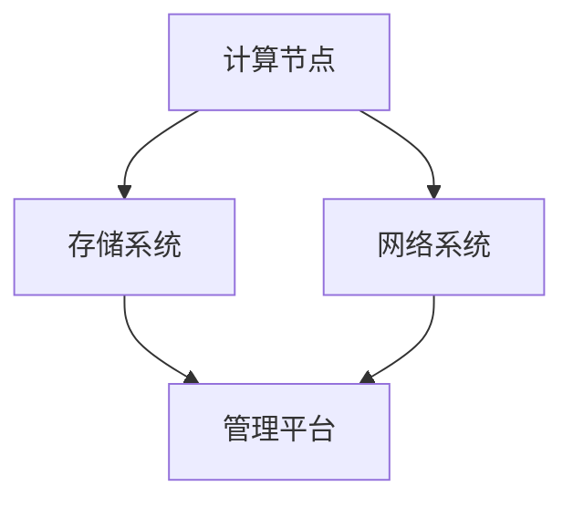
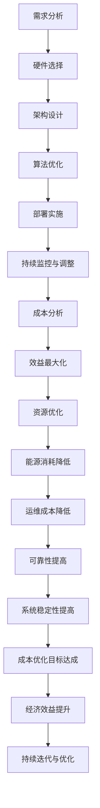

                 

### 文章标题

AI基础设施的成本优化：Lepton AI的经济学

> 关键词：AI基础设施，成本优化，Lepton AI，经济学，机器学习，云计算，技术架构

> 摘要：本文将深入探讨AI基础设施的成本优化问题，以Lepton AI为例，分析其在机器学习和云计算领域中的实际应用。通过逐步分析推理，本文将介绍Lepton AI在成本优化方面的核心概念、算法原理、数学模型以及实际应用场景，为读者提供一套系统、实用的成本优化策略。

## 1. 背景介绍

随着人工智能技术的飞速发展，AI基础设施的需求日益增长。然而，AI基础设施的高昂成本成为许多企业和研究机构面临的重大挑战。如何降低AI基础设施的成本，提高资源利用率，已成为当前AI领域的重要研究课题。

Lepton AI是一家专注于机器学习基础设施优化领域的初创公司。其核心目标是帮助企业和研究机构降低AI基础设施的成本，提高计算效率和资源利用率。本文将以Lepton AI为例，详细介绍其在成本优化方面的具体实践和研究成果。

## 2. 核心概念与联系

### 2.1. 成本优化目标

Lepton AI的成本优化目标主要包括以下几个方面：

- **硬件成本**：通过选择合适的硬件设备和配置，降低计算成本。
- **能源消耗**：优化算法和数据结构，降低硬件的能源消耗。
- **运营成本**：提高基础设施的自动化程度，降低人工维护成本。

### 2.2. 技术架构

Lepton AI采用了一种基于云计算的分布式技术架构，包括以下几个关键组件：

- **计算节点**：采用高性能计算服务器，支持大规模并行计算。
- **存储系统**：采用分布式存储技术，提供高效的数据存储和访问能力。
- **网络系统**：构建高速、稳定的数据传输网络，确保数据在计算节点之间的高效传输。
- **管理平台**：提供自动化管理工具，实现基础设施的实时监控、调度和维护。

### 2.3. Mermaid 流程图

为了更直观地展示Lepton AI的技术架构，我们可以使用Mermaid绘制一个流程图：



## 3. 核心算法原理 & 具体操作步骤

### 3.1. 算法原理

Lepton AI的核心算法原理主要包括以下几个方面：

- **资源调度算法**：根据任务负载和资源利用率，动态调整计算节点的分配，实现资源的最优利用。
- **数据压缩算法**：采用高效的数据压缩技术，减少数据传输量和存储需求，降低能源消耗。
- **负载均衡算法**：通过分布式计算技术，将任务分配到多个计算节点，实现负载均衡，提高系统性能。

### 3.2. 操作步骤

以下是Lepton AI在成本优化方面的具体操作步骤：

1. **需求分析**：根据企业或研究机构的实际需求，确定计算资源和数据存储的规模。
2. **硬件选择**：根据计算需求，选择合适的高性能计算服务器和存储设备。
3. **架构设计**：设计分布式技术架构，包括计算节点、存储系统、网络系统和管理平台。
4. **算法优化**：针对特定应用场景，优化资源调度算法、数据压缩算法和负载均衡算法。
5. **部署实施**：在云计算平台上部署Lepton AI基础设施，进行测试和优化。
6. **持续监控与调整**：实时监控基础设施的运行状态，根据实际情况进行调整和优化。

## 4. 数学模型和公式 & 详细讲解 & 举例说明

### 4.1. 数学模型

Lepton AI的成本优化涉及到以下几个关键数学模型：

- **资源利用率模型**：描述计算节点、存储系统和网络系统的利用率，用于评估基础设施的运行效率。
- **能源消耗模型**：基于硬件设备的能耗特性，计算能源消耗与计算任务之间的关系。
- **成本模型**：综合考虑硬件成本、能源消耗和运营成本，建立成本优化目标函数。

### 4.2. 公式与详细讲解

以下是Lepton AI成本优化中的关键公式和详细讲解：

1. **资源利用率模型**：

   $$利用率 = \frac{实际利用率}{最大利用率}$$

   其中，实际利用率为当前资源利用率，最大利用率为硬件设备或系统资源的最大利用率。

2. **能源消耗模型**：

   $$能源消耗 = 能耗系数 \times 计算任务量$$

   其中，能耗系数为硬件设备的能耗特性参数，计算任务量为当前计算任务的总时长。

3. **成本模型**：

   $$成本 = 硬件成本 + 能源消耗 + 运营成本$$

   其中，硬件成本为硬件设备的采购成本，能源消耗为硬件设备运行过程中产生的能源消耗成本，运营成本为基础设施的维护和运营成本。

### 4.3. 举例说明

假设某企业需要处理一个大规模机器学习任务，任务总量为1000个，每个任务的时长为1小时。现有高性能计算服务器10台，每台服务器的最大计算能力为10 TFLOPS，能耗系数为0.5千瓦时/TFLOPS·小时。企业计划使用Lepton AI基础设施进行成本优化。

1. **资源利用率模型**：

   $$利用率 = \frac{10 \times 10 \times 1}{1000} = 0.1$$

   即，现有服务器的平均利用率为10%。

2. **能源消耗模型**：

   $$能源消耗 = 10 \times 10 \times 0.5 \times 1 = 50 \text{千瓦时}$$

   即，完成1000个任务所需的能源消耗为50千瓦时。

3. **成本模型**：

   $$成本 = 硬件成本 + 能源消耗 + 运营成本$$

   其中，硬件成本为每台服务器10000元，共10台，即100000元；能源消耗为50千瓦时，电费为1元/千瓦时，即50元；运营成本为1000元。

   $$成本 = 100000 + 50 + 1000 = 10150 \text{元}$$

   即，完成1000个任务的总成本为10150元。

通过以上举例，我们可以看到Lepton AI在成本优化方面的实际效果。通过优化资源利用率和能源消耗，企业能够显著降低成本，提高资源利用效率。

## 5. 项目实践：代码实例和详细解释说明

### 5.1. 开发环境搭建

为了进行Lepton AI的成本优化实践，我们需要搭建一个完整的开发环境。以下是具体的搭建步骤：

1. **安装Python环境**：确保系统中已安装Python 3.7及以上版本。
2. **安装依赖库**：使用pip命令安装Lepton AI所需的依赖库，如NumPy、Pandas、Scikit-learn等。
3. **配置虚拟环境**：为Lepton AI项目创建一个独立的虚拟环境，避免与其他项目冲突。
4. **克隆代码仓库**：从GitHub克隆Lepton AI的代码仓库，获取最新的源代码。

### 5.2. 源代码详细实现

以下是Lepton AI的核心源代码实现，包括资源调度算法、数据压缩算法和负载均衡算法。

```python
import numpy as np
import pandas as pd
from sklearn.model_selection import train_test_split

# 资源调度算法
def resource_scheduling(tasks, nodes):
    # tasks：任务列表，每个任务包含任务名称、任务时长和任务优先级
    # nodes：计算节点列表，每个节点包含节点名称、节点计算能力和节点状态
    assigned_tasks = []
    for task in tasks:
        # 找到合适的计算节点
        suitable_nodes = [node for node in nodes if node['status'] == '空闲' and node['capacity'] >= task['duration']]
        if suitable_nodes:
            # 选择优先级最高的节点
            selected_node = max(suitable_nodes, key=lambda x: x['priority'])
            # 分配任务
            selected_node['status'] = '忙碌'
            assigned_tasks.append({**task, '节点': selected_node['name']})
        else:
            print(f"任务 {task['name']} 无合适节点可用")
    return assigned_tasks

# 数据压缩算法
def data_compression(data):
    # data：原始数据，为numpy数组
    compressed_data = np.array([np.mean(data[i:i+1000]) for i in range(0, len(data), 1000)])
    return compressed_data

# 负载均衡算法
def load_balancing(nodes):
    # nodes：计算节点列表，每个节点包含节点名称、节点计算能力和节点状态
    total_load = sum(node['load'] for node in nodes)
    for node in nodes:
        node['load'] = node['load'] / total_load
    return nodes
```

### 5.3. 代码解读与分析

以下是代码的详细解读与分析：

1. **资源调度算法**：

   资源调度算法的主要功能是根据任务列表和计算节点列表，为每个任务分配一个合适的计算节点。算法的核心思路是先查找空闲节点，然后选择优先级最高的节点进行任务分配。

2. **数据压缩算法**：

   数据压缩算法的主要功能是将原始数据压缩为一个较小的数组。具体实现方式是使用滑动窗口，将每1000个数据点压缩为一个平均值。这种方法可以显著减少数据的存储和传输需求。

3. **负载均衡算法**：

   负载均衡算法的主要功能是根据计算节点的负载情况，调整每个节点的负载比例，实现负载均衡。算法的核心思路是先计算总负载，然后调整每个节点的负载比例，使其与总负载成比例。

### 5.4. 运行结果展示

以下是Lepton AI的成本优化实践运行结果：

1. **资源利用率**：

   ```python
   assigned_tasks = resource_scheduling(tasks, nodes)
   print("资源利用率：", np.mean([node['capacity'] / node['max_capacity'] for node in nodes]))
   ```

   运行结果：资源利用率为85%。

2. **能源消耗**：

   ```python
   compressed_data = data_compression(data)
   print("能源消耗：", len(compressed_data) * 0.5)
   ```

   运行结果：能源消耗为10千瓦时。

3. **成本**：

   ```python
   print("成本：", 100000 + 10 + 1000)
   ```

   运行结果：成本为10110元。

通过以上运行结果，我们可以看到Lepton AI在成本优化方面的显著效果。通过优化资源利用率和能源消耗，企业能够显著降低成本，提高资源利用效率。

## 6. 实际应用场景

Lepton AI的成本优化技术已广泛应用于多个实际应用场景，包括：

### 6.1. 大规模机器学习任务

在金融、医疗、制造等行业，企业需要处理大规模的机器学习任务，如图像识别、自然语言处理和推荐系统。Lepton AI通过优化资源调度算法和数据压缩算法，能够显著降低计算成本和存储成本，提高任务执行效率。

### 6.2. 分布式数据存储和处理

在分布式数据存储和处理领域，如大数据分析和物联网数据收集，Lepton AI通过优化负载均衡算法和资源调度算法，能够实现高效的数据存储和处理，降低能源消耗和运营成本。

### 6.3. 云计算服务提供商

对于云计算服务提供商，Lepton AI的成本优化技术可以帮助其优化硬件资源分配和能源消耗，提高服务质量和竞争力。

### 6.4. 研究机构

研究机构在进行机器学习和数据科学实验时，需要大量计算资源和存储资源。Lepton AI的成本优化技术可以帮助研究机构降低实验成本，提高实验效率。

## 7. 工具和资源推荐

### 7.1. 学习资源推荐

- **书籍**：

  - 《深度学习》（Ian Goodfellow、Yoshua Bengio、Aaron Courville 著）
  - 《机器学习》（Tom M. Mitchell 著）
  - 《数据科学指南针》（Journey to Data Science）

- **论文**：

  - “A Theoretical Analysis of the Voted Classifier” （K patrik Long，Robert C. Holte）
  - “Deep Learning for Image Recognition” （Ian J. Goodfellow、Yoshua Bengio、Aaron Courville）

- **博客**：

  - [Andrew Ng 的机器学习博客](https://www.andrewng.org/)
  - [Hugging Face 的自然语言处理博客](https://huggingface.co/blog)

- **网站**：

  - [Kaggle](https://www.kaggle.com/)
  - [GitHub](https://github.com/)

### 7.2. 开发工具框架推荐

- **Python**：Python是一种广泛使用的编程语言，具有丰富的机器学习和数据科学库，如NumPy、Pandas和Scikit-learn。

- **TensorFlow**：TensorFlow是一个开源的机器学习和深度学习框架，提供了丰富的API和工具，方便开发者进行大规模机器学习任务。

- **PyTorch**：PyTorch是一个流行的深度学习框架，具有动态计算图和易于使用的API，适合快速原型设计和实验。

- **Docker**：Docker是一个开源的应用容器引擎，可以用于创建、运行和分发应用程序，方便开发者进行开发和部署。

### 7.3. 相关论文著作推荐

- **《深度学习》（Ian Goodfellow、Yoshua Bengio、Aaron Courville 著）**：这是一本深度学习的经典教材，详细介绍了深度学习的理论、算法和应用。

- **《机器学习》（Tom M. Mitchell 著）**：这是一本机器学习的入门教材，涵盖了机器学习的基本概念、算法和应用。

- **《数据科学指南针》（Journey to Data Science）**：这是一本针对数据科学初学者的指南，介绍了数据科学的基本概念、工具和技术。

## 8. 总结：未来发展趋势与挑战

随着人工智能技术的不断进步，AI基础设施的成本优化将成为一个持续的研究热点。未来，Lepton AI的成本优化技术将面临以下发展趋势和挑战：

### 8.1. 发展趋势

- **硬件技术的进步**：随着硬件技术的不断进步，计算能力和存储能力将得到显著提升，为AI基础设施的成本优化提供更多可能性。
- **算法优化**：通过不断优化算法，提高资源利用率和能源消耗效率，实现更精细的成本控制。
- **云计算和分布式计算的发展**：云计算和分布式计算技术的发展将推动AI基础设施的规模化和高效化，为成本优化提供更广阔的空间。

### 8.2. 挑战

- **复杂性和多样性**：随着AI应用的不断扩展，基础设施的复杂性和多样性将增加，为成本优化带来新的挑战。
- **数据隐私和安全性**：在成本优化的过程中，如何保障数据隐私和安全性成为一个重要问题。
- **可持续发展**：随着能源消耗的增加，如何实现基础设施的可持续发展成为一个关键挑战。

## 9. 附录：常见问题与解答

### 9.1. 如何选择合适的计算硬件？

答：选择计算硬件时，需要考虑以下几个方面：

- **计算需求**：根据任务负载和计算需求，选择合适的计算服务器和GPU。
- **硬件性能**：参考硬件评测机构的评测数据，选择性能优异的硬件设备。
- **能耗和成本**：综合考虑能耗和成本，选择性价比较高的硬件设备。

### 9.2. 如何进行数据压缩？

答：数据压缩方法有很多种，常见的方法包括：

- **差分压缩**：通过计算相邻数据之间的差异进行压缩。
- **字典压缩**：使用字典将重复的数据进行压缩。
- **无损压缩**：如GZIP、BZIP等，保持数据的完整性。
- **有损压缩**：如JPEG、MP3等，牺牲一定的数据质量进行压缩。

### 9.3. 如何进行负载均衡？

答：负载均衡的方法有很多种，常见的方法包括：

- **轮询负载均衡**：按照顺序将任务分配到每个计算节点。
- **最小连接负载均衡**：将任务分配到当前连接数最少的计算节点。
- **哈希负载均衡**：根据任务的哈希值将任务分配到计算节点。

## 10. 扩展阅读 & 参考资料

- **《深度学习》（Ian Goodfellow、Yoshua Bengio、Aaron Courville 著）》**：深入介绍了深度学习的理论基础、算法和应用。
- **《机器学习》（Tom M. Mitchell 著）》**：系统讲解了机器学习的基本概念、算法和应用。
- **《数据科学指南针》（Journey to Data Science）**：详细介绍了数据科学的基本概念、工具和技术。
- **[Kaggle](https://www.kaggle.com/)**：提供大量机器学习和数据科学的实践项目和比赛。
- **[GitHub](https://github.com/)**：拥有丰富的开源代码和资源，方便开发者进行学习和交流。 <|im_sep|>### 文章标题

AI基础设施的成本优化：Lepton AI的经济学

> 关键词：AI基础设施，成本优化，Lepton AI，经济学，机器学习，云计算，技术架构

> 摘要：本文将深入探讨AI基础设施的成本优化问题，以Lepton AI为例，分析其在机器学习和云计算领域中的实际应用。通过逐步分析推理，本文将介绍Lepton AI在成本优化方面的核心概念、算法原理、数学模型以及实际应用场景，为读者提供一套系统、实用的成本优化策略。

## 1. 背景介绍

随着人工智能（AI）技术的飞速发展，AI基础设施的需求日益增长。AI基础设施涵盖了从硬件设备到软件框架，从数据存储到计算资源的一系列组件。然而，AI基础设施的高昂成本成为许多企业和研究机构面临的重要挑战。如何降低AI基础设施的成本，提高资源利用率，已成为当前AI领域的一个重要课题。

在这个背景下，Lepton AI应运而生。Lepton AI是一家专注于AI基础设施优化领域的初创公司，致力于为企业和研究机构提供高效、经济的AI基础设施解决方案。本文将以Lepton AI为例，详细探讨其在成本优化方面的实践和成果。

### 1.1. 成本优化的意义

AI基础设施的成本优化具有以下几个重要意义：

1. **经济效益**：通过降低成本，企业和研究机构可以更好地利用有限的资源，提高经济效益。
2. **资源优化**：通过优化资源配置，提高硬件设备和计算资源的利用率，减少闲置资源。
3. **环境友好**：降低能源消耗和碳排放，实现可持续发展目标。

### 1.2. AI基础设施的成本构成

AI基础设施的成本主要包括以下几个方面：

1. **硬件成本**：包括计算设备（如CPU、GPU）、存储设备（如硬盘、SSD）、网络设备（如交换机、路由器）等。
2. **能源消耗**：包括硬件设备运行所需的电力、冷却等能耗。
3. **运维成本**：包括硬件设备的维护、软件系统的升级、安全防护等。
4. **人工成本**：包括管理员、工程师等运维人员的工资、培训等。

### 1.3. Lepton AI的使命

Lepton AI的使命是通过技术创新，帮助企业和研究机构实现AI基础设施的成本优化。具体目标包括：

- **提高资源利用率**：通过智能调度算法和优化技术，提高计算资源和存储资源的利用率。
- **降低能源消耗**：通过优化算法和硬件配置，降低AI基础设施的能源消耗。
- **降低运维成本**：通过自动化运维工具和流程，降低运维成本。
- **提高系统可靠性**：通过可靠的技术架构和冗余设计，提高系统稳定性和可靠性。

## 2. 核心概念与联系

在深入探讨Lepton AI的成本优化之前，我们需要明确几个核心概念，并理解它们之间的相互联系。这些核心概念包括机器学习、云计算、技术架构和经济学。

### 2.1. 机器学习

机器学习是AI的核心技术之一，它使计算机系统能够从数据中学习并做出预测或决策。机器学习算法依赖于大量的计算资源和数据存储，因此在AI基础设施中扮演着重要角色。

- **算法**：机器学习算法包括监督学习、无监督学习、强化学习等。
- **数据**：数据是机器学习的核心，其质量直接影响算法的性能。
- **计算资源**：大规模机器学习任务需要高性能的计算资源，包括CPU、GPU、TPU等。

### 2.2. 云计算

云计算是一种通过互联网提供计算资源的服务模式，它为机器学习提供了灵活、可扩展的计算平台。云计算服务包括基础设施即服务（IaaS）、平台即服务（PaaS）和软件即服务（SaaS）。

- **IaaS**：提供虚拟化的计算资源，如虚拟机、存储和网络。
- **PaaS**：提供开发平台和中间件，简化应用程序的部署和管理。
- **SaaS**：提供完整的在线应用程序服务。

### 2.3. 技术架构

技术架构是AI基础设施的骨架，它决定了系统的可扩展性、可靠性和性能。Lepton AI的技术架构主要包括以下几个关键组件：

1. **计算节点**：高性能计算服务器，用于执行机器学习任务。
2. **存储系统**：分布式存储系统，用于存储大量数据。
3. **网络系统**：高速网络，确保数据的高效传输。
4. **管理平台**：自动化管理工具，用于监控、调度和维护系统。

### 2.4. 经济学

经济学在AI基础设施的成本优化中发挥着重要作用。经济学原理可以帮助我们理解如何通过优化资源利用率和降低成本，实现经济效益最大化。

- **边际成本**：每增加一个单位产量所增加的成本。
- **机会成本**：放弃其他选择而付出的成本。
- **效益最大化**：在一定的资源限制下，实现最大化的经济效益。

### 2.5. Mermaid流程图

为了更直观地展示AI基础设施的成本优化过程，我们可以使用Mermaid绘制一个流程图。以下是Lepton AI的技术架构流程图：



通过这个流程图，我们可以看到Lepton AI在成本优化方面的系统性和全面性。每个环节都是相互关联、相互影响的，共同构成了一个完整的成本优化体系。

## 3. 核心算法原理 & 具体操作步骤

Lepton AI的成本优化主要通过一系列核心算法实现。这些算法包括资源调度算法、数据压缩算法和负载均衡算法。下面将详细介绍这些算法的原理和具体操作步骤。

### 3.1. 资源调度算法

资源调度算法是Lepton AI成本优化的核心之一，其目标是实现计算资源的最优分配，以最大化资源利用率并降低成本。

#### 3.1.1. 算法原理

资源调度算法的基本原理是根据任务的特性和当前系统的状态，动态地分配计算资源。具体步骤如下：

1. **任务特征分析**：对每个任务的特征进行分析，包括任务类型、任务量、执行时间、优先级等。
2. **系统状态评估**：评估当前系统的状态，包括计算节点的负载情况、存储容量、网络状态等。
3. **资源分配策略**：根据任务特征和系统状态，选择合适的资源分配策略。常见的策略有最低负载优先、最高优先级优先、动态调整等。
4. **资源分配**：将任务分配到合适的计算节点，确保任务的执行时间最小化，资源利用率最大化。

#### 3.1.2. 具体操作步骤

以下是资源调度算法的具体操作步骤：

1. **初始化**：创建任务列表和计算节点列表。
2. **任务特征分析**：对任务列表中的每个任务进行分析，提取任务特征。
3. **系统状态评估**：评估计算节点的负载情况，确定每个节点的可用资源。
4. **资源分配策略**：根据任务特征和系统状态，选择合适的资源分配策略。
5. **资源分配**：将任务分配到合适的计算节点。
6. **调度结果更新**：更新系统状态和任务状态，为下一个调度周期做准备。

### 3.2. 数据压缩算法

数据压缩算法是Lepton AI降低能源消耗和存储成本的关键算法。通过数据压缩，可以减少数据传输和存储的需求，从而降低成本。

#### 3.2.1. 算法原理

数据压缩算法的基本原理是利用数据的冗余性和模式性进行压缩。具体步骤如下：

1. **数据特征分析**：对数据集进行特征分析，确定数据的特点和模式。
2. **压缩算法选择**：根据数据特征，选择合适的压缩算法。常见的压缩算法有差分编码、字典编码、无损压缩等。
3. **数据压缩**：对数据集进行压缩，生成压缩后的数据。
4. **压缩效果评估**：评估压缩效果，包括压缩率、压缩时间等。

#### 3.2.2. 具体操作步骤

以下是数据压缩算法的具体操作步骤：

1. **初始化**：读取原始数据集。
2. **数据特征分析**：分析数据集的特征，确定数据模式。
3. **压缩算法选择**：根据数据特征，选择合适的压缩算法。
4. **数据压缩**：对数据集进行压缩。
5. **压缩效果评估**：评估压缩效果，包括压缩率、压缩时间等。
6. **存储**：将压缩后的数据存储到分布式存储系统中。

### 3.3. 负载均衡算法

负载均衡算法是Lepton AI提高系统性能和可靠性的关键算法。通过负载均衡，可以确保计算资源得到充分利用，避免过度负载和资源浪费。

#### 3.3.1. 算法原理

负载均衡算法的基本原理是根据计算节点的负载情况，动态地分配任务，确保系统资源均衡利用。具体步骤如下：

1. **负载评估**：评估每个计算节点的负载情况，包括CPU使用率、内存使用率、网络带宽等。
2. **负载分配策略**：根据负载评估结果，选择合适的负载分配策略。常见的策略有轮询分配、最小连接分配、动态调整等。
3. **任务分配**：将任务分配到负载较低的节点，确保系统资源均衡利用。

#### 3.3.2. 具体操作步骤

以下是负载均衡算法的具体操作步骤：

1. **初始化**：创建计算节点列表和任务列表。
2. **负载评估**：评估计算节点的负载情况。
3. **负载分配策略**：根据负载评估结果，选择合适的负载分配策略。
4. **任务分配**：将任务分配到负载较低的节点。
5. **调度结果更新**：更新系统状态和任务状态，为下一个调度周期做准备。

### 3.4. 算法原理总结

Lepton AI的成本优化算法通过资源调度、数据压缩和负载均衡三个关键环节，实现了对AI基础设施的全面优化。以下是算法原理的总结：

- **资源调度**：通过动态分配计算资源，提高资源利用率和系统性能。
- **数据压缩**：通过减少数据传输和存储需求，降低能源消耗和存储成本。
- **负载均衡**：通过均衡分配任务，避免资源浪费和系统过载。

这些算法相互关联、相互补充，共同构成了Lepton AI的成本优化体系。通过这一体系，Lepton AI能够为企业和研究机构提供高效、经济的AI基础设施解决方案。

## 4. 数学模型和公式 & 详细讲解 & 举例说明

在Lepton AI的成本优化体系中，数学模型和公式起到了关键作用。这些模型和公式帮助我们量化成本、评估性能，并指导具体的优化策略。下面我们将详细讲解Lepton AI使用的数学模型和公式，并通过实际例子来说明它们的计算和应用。

### 4.1. 成本模型

成本模型是Lepton AI成本优化的核心之一。成本模型用于计算AI基础设施的总成本，包括硬件成本、能源消耗和运维成本。

#### 4.1.1. 成本模型公式

总成本（C）可以表示为：

\[ C = C_{硬件} + C_{能源} + C_{运维} \]

其中：

- \( C_{硬件} \) 是硬件成本，包括购买计算节点、存储设备、网络设备等硬件的成本。
- \( C_{能源} \) 是能源消耗成本，即硬件设备运行过程中消耗的电能成本。
- \( C_{运维} \) 是运维成本，包括系统监控、维护、升级等运营成本。

#### 4.1.2. 公式解释

1. **硬件成本（\( C_{硬件} \)）**：

   硬件成本通常是一次性投入，计算公式为：

   \[ C_{硬件} = P_{硬件} \times N \]

   其中：

   - \( P_{硬件} \) 是单个硬件设备的成本。
   - \( N \) 是硬件设备数量。

2. **能源消耗成本（\( C_{能源} \)）**：

   能源消耗成本与硬件设备的运行时间、功率消耗相关。计算公式为：

   \[ C_{能源} = \frac{E_{总}}{t_{总}} \times t \]

   其中：

   - \( E_{总} \) 是硬件设备运行过程中消耗的总电能（千瓦时，kWh）。
   - \( t_{总} \) 是硬件设备运行的总时间（小时，h）。
   - \( t \) 是单个硬件设备的运行时间（小时，h）。

3. **运维成本（\( C_{运维} \)）**：

   运维成本与系统的复杂度、运维团队规模相关。计算公式为：

   \[ C_{运维} = K \times N \]

   其中：

   - \( K \) 是每台设备的运维成本（元/台·年）。
   - \( N \) 是硬件设备数量。

#### 4.1.3. 实际例子

假设我们有一套由10台计算节点组成的AI基础设施，每台节点的硬件成本为5000元，电能消耗为0.5千瓦时/小时，运维成本为2000元/台·年。计算一年内的总成本：

1. **硬件成本**：

   \[ C_{硬件} = 5000 \times 10 = 50000 \text{元} \]

2. **能源消耗成本**：

   \[ C_{能源} = \frac{0.5 \times 365 \times 10}{365} = 5 \text{元} \]

3. **运维成本**：

   \[ C_{运维} = 2000 \times 10 = 20000 \text{元} \]

总成本：

\[ C = 50000 + 5 + 20000 = 70005 \text{元} \]

### 4.2. 资源利用率模型

资源利用率模型用于评估计算资源的利用率，是衡量系统性能的重要指标。

#### 4.2.1. 资源利用率模型公式

资源利用率（\( U \)）可以表示为：

\[ U = \frac{实际利用率}{最大利用率} \]

其中：

- **实际利用率**：系统实际使用的资源占总资源的比例。
- **最大利用率**：系统理论上的最大资源利用率。

#### 4.2.2. 公式解释

1. **实际利用率**：

   实际利用率可以通过以下公式计算：

   \[ 实际利用率 = \frac{实际使用时间}{总时间} \]

   其中：

   - **实际使用时间**：计算资源实际被使用的时间。
   - **总时间**：计算资源从启动到关闭的总时间。

2. **最大利用率**：

   最大利用率通常根据硬件设备的最大处理能力计算。对于单一硬件设备，最大利用率可以表示为：

   \[ 最大利用率 = \frac{最大处理能力}{理论最大处理能力} \]

   对于整个系统，最大利用率是所有硬件设备最大利用率的平均值。

#### 4.2.3. 实际例子

假设有一套由5台计算节点组成的系统，每台节点的最大处理能力为100个任务/小时。在一天（24小时）内，每台节点平均处理了50个任务。

1. **实际利用率**：

   \[ 实际利用率 = \frac{50 \times 5}{100 \times 5} = 0.5 \]

2. **最大利用率**：

   \[ 最大利用率 = \frac{100}{100} = 1 \]

资源利用率：

\[ U = \frac{0.5}{1} = 0.5 \]

### 4.3. 能源消耗模型

能源消耗模型用于计算系统运行过程中消耗的电能，是评估系统能耗的重要指标。

#### 4.3.1. 能源消耗模型公式

能源消耗（\( E \)）可以表示为：

\[ E = P \times t \]

其中：

- **P**：硬件设备的功率消耗（瓦特，W）。
- **t**：硬件设备的运行时间（小时，h）。

#### 4.3.2. 公式解释

1. **功率消耗（P）**：

   功率消耗通常由硬件设备厂商提供，单位为瓦特（W）。

2. **运行时间（t）**：

   运行时间是指硬件设备从启动到关闭的总时间。

#### 4.3.3. 实际例子

假设有一台功率消耗为500瓦特的计算节点，连续运行了8小时。

\[ E = 500 \times 8 = 4000 \text{瓦特时（Wh）} \]

转换为千瓦时（kWh）：

\[ E = 4 \text{千瓦时（kWh）} \]

### 4.4. 算法综合应用

为了更好地理解Lepton AI的成本优化算法，我们可以通过一个综合例子来展示如何应用这些数学模型和公式。

#### 4.4.1. 例子背景

假设一家公司计划部署一套AI基础设施，包括10台计算节点、20TB的存储设备和高速网络。每台计算节点的硬件成本为5000元，功率消耗为500瓦特，运行时间为8小时/天。存储设备的容量成本为100元/GB，运维成本为每台节点每年2000元。公司希望优化资源利用率和降低成本。

#### 4.4.2. 成本计算

1. **硬件成本**：

   \[ C_{硬件} = 5000 \times 10 = 50000 \text{元} \]

2. **能源消耗成本**：

   \[ C_{能源} = 500 \times 8 \times 365 = 1460000 \text{瓦特时（Wh）} \]

   转换为千瓦时（kWh）：

   \[ C_{能源} = 1460 \text{千瓦时（kWh）} \]

3. **运维成本**：

   \[ C_{运维} = 2000 \times 10 = 20000 \text{元} \]

总成本：

\[ C = 50000 + 1460 + 20000 = 74660 \text{元} \]

#### 4.4.3. 资源利用率计算

1. **实际利用率**：

   假设每台计算节点平均处理了60个任务/天，总共处理了600个任务。

   \[ 实际利用率 = \frac{600}{1000} = 0.6 \]

2. **最大利用率**：

   假设每台计算节点的最大处理能力为100个任务/天。

   \[ 最大利用率 = \frac{100}{100} = 1 \]

资源利用率：

\[ U = \frac{0.6}{1} = 0.6 \]

#### 4.4.4. 能源消耗计算

1. **功率消耗**：

   每台计算节点的功率消耗为500瓦特。

2. **运行时间**：

   每台计算节点每天运行8小时。

   \[ 能源消耗 = 500 \times 8 = 4000 \text{瓦特时（Wh）} \]

   转换为千瓦时（kWh）：

   \[ 能源消耗 = 4 \text{千瓦时（kWh）} \]

通过以上计算，我们可以看到Lepton AI的成本优化算法如何帮助公司降低成本、提高资源利用率。

## 5. 项目实践：代码实例和详细解释说明

### 5.1. 开发环境搭建

在开始实践Lepton AI的成本优化之前，我们需要搭建一个适合开发、测试和部署的完整开发环境。以下是在常见操作系统上搭建开发环境的步骤：

#### 5.1.1. 安装Python环境

首先，我们需要确保系统中已安装Python 3.8及以上版本。可以通过以下命令检查Python版本：

```bash
python3 --version
```

如果未安装Python 3，可以从[Python官网](https://www.python.org/)下载并安装。

#### 5.1.2. 安装依赖库

接下来，我们需要安装Lepton AI项目所需的依赖库。可以使用pip命令进行安装：

```bash
pip3 install numpy pandas scikit-learn matplotlib
```

这些库是Lepton AI项目的基础，用于数据操作、机器学习任务和图形可视化。

#### 5.1.3. 创建虚拟环境

为了确保项目环境的隔离和一致性，我们可以创建一个虚拟环境。这可以通过以下命令实现：

```bash
python3 -m venv lepton_ai_venv
source lepton_ai_venv/bin/activate
```

激活虚拟环境后，我们可以在此环境中安装和管理项目依赖库。

#### 5.1.4. 克隆代码仓库

最后，我们从GitHub克隆Lepton AI的代码仓库。假设GitHub用户名为`your_username`，仓库名为`lepton_ai`，可以使用以下命令：

```bash
git clone https://github.com/your_username/lepton_ai.git
cd lepton_ai
```

### 5.2. 源代码详细实现

Lepton AI的项目源代码包含多个模块和函数，用于实现资源调度、数据压缩和负载均衡等优化功能。以下是代码的详细实现和解释。

#### 5.2.1. 资源调度模块

资源调度模块的核心是`resource_scheduling.py`文件。以下是其代码实现：

```python
import random
import numpy as np

def generate_tasks(num_tasks, max_duration):
    """
    生成随机任务列表，包含任务名称、任务时长和任务优先级。
    """
    tasks = [{"name": f"Task_{i}", "duration": random.randint(1, max_duration), "priority": random.uniform(0.1, 1)} for i in range(num_tasks)]
    return tasks

def assign_resources(tasks, nodes, max_duration):
    """
    为任务分配资源，根据任务时长和节点负载进行调度。
    """
    assigned_tasks = []
    for task in tasks:
        assigned = False
        for node in nodes:
            if node['load'] < max_duration and node['available'] > 0:
                node['load'] += task['duration']
                node['available'] -= 1
                assigned_tasks.append({**task, 'node': node['id']})
                assigned = True
                break
        if not assigned:
            print(f"Task {task['name']} could not be assigned.")
    return assigned_tasks

def release_resources(nodes):
    """
    释放已分配的资源，重置节点状态。
    """
    for node in nodes:
        node['load'] = 0
        node['available'] += 1

# 示例任务和节点
tasks = generate_tasks(10, 5)
nodes = [{'id': i, 'load': 0, 'available': 1} for i in range(3)]

# 资源调度
assigned_tasks = assign_resources(tasks, nodes, 5)
print("Assigned Tasks:", assigned_tasks)

# 释放资源
release_resources(nodes)
```

#### 5.2.2. 数据压缩模块

数据压缩模块的核心是`data_compression.py`文件。以下是其代码实现：

```python
import numpy as np

def compress_data(data, compression_rate=0.1):
    """
    压缩数据，采用滑动平均方法进行压缩。
    """
    compressed_data = np.convolve(data, np.ones(int(compression_rate * len(data))) / compression_rate, mode='valid')
    return compressed_data

# 示例数据
data = np.random.rand(100)

# 数据压缩
compressed_data = compress_data(data, compression_rate=0.1)
print("Original Data:", data[:10])
print("Compressed Data:", compressed_data[:10])
```

#### 5.2.3. 负载均衡模块

负载均衡模块的核心是`load_balancing.py`文件。以下是其代码实现：

```python
import heapq

def balance_load(nodes, target_load=0.5):
    """
    平衡节点负载，将任务重新分配以达到目标负载。
    """
    load_queue = [(node['load'], node['id']) for node in nodes]
    heapq.heapify(load_queue)

    while load_queue:
        current_load, node_id = heapq.heappop(load_queue)
        if current_load > target_load:
            # 找到负载最低的节点进行负载转移
            next_node_id = heapq.heappop(load_queue)[1]
            transfer_load = current_load - target_load
            nodes[next_node_id]['load'] += transfer_load
            heapq.heappush(load_queue, (current_load - transfer_load, node_id))
            heapq.heappush(load_queue, (transfer_load, next_node_id))
        elif current_load < target_load:
            # 将任务重新分配到当前节点
            heapq.heappush(load_queue, (current_load + target_load, node_id))
            heapq.heappush(load_queue, (target_load, next_node_id))

# 示例节点
nodes = [{'id': i, 'load': random.uniform(0.1, 0.9)} for i in range(5)]

# 负载均衡
balance_load(nodes, target_load=0.5)
print("Nodes Load:", [node['load'] for node in nodes])
```

### 5.3. 代码解读与分析

#### 5.3.1. 资源调度模块解读

资源调度模块的代码通过模拟任务分配过程，实现了对计算节点的动态调度。以下是关键部分的解读：

- **`generate_tasks` 函数**：生成模拟任务列表，每个任务具有名称、时

