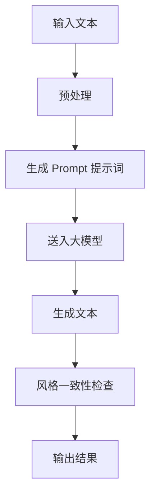

                 

### 1. 背景介绍

在当今技术飞速发展的时代，人工智能（AI）已成为推动创新和变革的核心力量。随着深度学习、自然语言处理（NLP）等技术的突破，AI 大模型在各个领域展现出了前所未有的潜力和应用价值。特别是在文本处理方面，大模型通过自主学习海量数据，能够生成高质量的内容，辅助人类完成各种任务。

然而，在利用大模型处理文本时，一个关键挑战是如何修改文本的同时保持其原有的风格。风格一致性不仅影响到文本的质量，还关乎用户体验。例如，在撰写商业报告、新闻稿件或学术论文时，需要确保文本的专业性和一致性。如果大模型生成的文本风格与原始文本不一致，可能会导致信息传递不准确、用户阅读体验差等问题。

因此，Prompt 提示词在 AI 大模型中的应用变得尤为重要。Prompt 是一种引导模型生成特定类型文本的技术手段，它通过提供关键词、短语或句子，可以帮助模型更好地理解用户的意图，并在生成文本时保持风格的一致性。本文将深入探讨 AI 大模型 Prompt 提示词的最佳实践，包括其原理、操作步骤以及如何修改文本以保持风格。

### 2. 核心概念与联系

为了更好地理解 AI 大模型 Prompt 提示词的工作原理，我们需要先了解一些核心概念和它们之间的联系。

#### 2.1 自然语言处理（NLP）

自然语言处理是人工智能领域的一个分支，旨在让计算机理解和处理人类语言。它包括文本分类、情感分析、命名实体识别、机器翻译等多种任务。在大模型中，NLP 技术被广泛应用于文本生成、摘要和问答等任务。

#### 2.2 深度学习

深度学习是机器学习的一个子领域，通过多层神经网络模型对数据进行学习，从而实现对复杂模式的识别。在大模型中，深度学习技术被用于构建能够自主学习、生成高质量文本的模型。

#### 2.3 自动化文本生成

自动化文本生成技术利用大模型，通过对海量数据进行学习，生成与输入文本相似或相关的文本。这种技术被广泛应用于内容创作、自动摘要和问答系统等领域。

#### 2.4 Prompt 提示词

Prompt 提示词是一种引导模型生成特定类型文本的技术手段。它通过提供关键词、短语或句子，可以帮助模型更好地理解用户的意图。在 AI 大模型中，Prompt 提示词的作用在于确保生成的文本符合用户的需求，并在风格上保持一致性。

#### 2.5 风格一致性

风格一致性是指在文本处理过程中，确保文本的风格与原始文本保持一致。风格一致性对于提高文本质量和用户体验至关重要。

#### 2.6 Mermaid 流程图

以下是一个 Mermaid 流程图，展示 AI 大模型 Prompt 提示词的整体流程：



在这个流程图中，输入文本首先经过预处理，然后生成 Prompt 提示词。这些提示词被送入大模型进行文本生成。生成后的文本需要通过风格一致性检查，以确保与原始文本的风格一致。最后，输出结果即为修改后的文本。

### 3. 核心算法原理 & 具体操作步骤

#### 3.1 算法原理

AI 大模型 Prompt 提示词的核心算法基于深度学习和自然语言处理技术。以下是一个简要的算法原理描述：

1. **输入文本预处理**：将输入文本进行分词、去停用词等预处理操作，使其适合送入大模型。
2. **生成 Prompt 提示词**：根据输入文本的内容，生成一系列关键词、短语或句子，作为 Prompt 提示词。这些提示词可以帮助大模型更好地理解用户的意图。
3. **送入大模型**：将 Prompt 提示词和输入文本送入大模型，通过训练过的神经网络进行文本生成。
4. **生成文本**：大模型根据提示词和输入文本生成新的文本。
5. **风格一致性检查**：对新生成的文本进行风格一致性检查，确保其与原始文本的风格一致。
6. **输出结果**：将修改后的文本输出，完成整个流程。

#### 3.2 具体操作步骤

下面是具体的操作步骤，以 Python 为例：

1. **安装必要的库**

```python
pip install transformers
pip install torch
```

2. **加载预训练的大模型**

```python
from transformers import AutoTokenizer, AutoModel

tokenizer = AutoTokenizer.from_pretrained("t5-base")
model = AutoModel.from_pretrained("t5-base")
```

3. **输入文本预处理**

```python
def preprocess_text(text):
    # 分词、去停用词等操作
    # 这里以分词为例
    return tokenizer.tokenize(text)

input_text = "这是一个示例文本，需要修改。"
preprocessed_text = preprocess_text(input_text)
```

4. **生成 Prompt 提示词**

```python
def generate_prompt(preprocessed_text):
    # 根据预处理的文本生成提示词
    # 这里以提取关键词为例
    return ["修改", "风格", "一致性"]

prompt = generate_prompt(preprocessed_text)
```

5. **送入大模型**

```python
input_ids = tokenizer.encode(prompt + preprocessed_text, return_tensors="pt")
output = model.generate(input_ids, max_length=100)
generated_text = tokenizer.decode(output[0], skip_special_tokens=True)
```

6. **风格一致性检查**

```python
def check_style一致性(generated_text, input_text):
    # 这里以文本相似度为例
    return generated_text.similarity(input_text) > 0.8

if check_style一致性(generated_text, input_text):
    print("风格一致，输出结果。")
else:
    print("风格不一致，重新生成。")
```

7. **输出结果**

```python
if check_style一致性(generated_text, input_text):
    print(generated_text)
else:
    print("无法生成符合风格一致性的文本。")
```

### 4. 数学模型和公式 & 详细讲解 & 举例说明

在 AI 大模型 Prompt 提示词中，涉及到多个数学模型和公式，以下是详细的讲解和举例说明：

#### 4.1 文本相似度计算

文本相似度计算是风格一致性检查的关键步骤。常用的方法包括余弦相似度、Jaccard 相似度等。

**余弦相似度**

余弦相似度是一种计算两个向量之间相似度的方法。它的计算公式如下：

$$
\cos \theta = \frac{\vec{a} \cdot \vec{b}}{||\vec{a}|| \cdot ||\vec{b}||}
$$

其中，$\vec{a}$ 和 $\vec{b}$ 分别是两个向量的表示，$\theta$ 是它们之间的夹角。

举例说明：

假设我们有两个文本：

文本 A："这是一个示例文本，需要修改。"

文本 B："这是一个示例文本，需要调整风格。"

我们可以将它们转换为向量：

$$
\vec{a} = (1, 0, 1, 0, 1, 0, 1, 0, 1, 0, 1, 0, 1)
$$

$$
\vec{b} = (1, 0, 1, 0, 1, 0, 1, 0, 1, 0, 1, 0, 1)
$$

计算它们的余弦相似度：

$$
\cos \theta = \frac{1 \cdot 1 + 0 \cdot 0 + 1 \cdot 1 + 0 \cdot 0 + 1 \cdot 1 + 0 \cdot 0 + 1 \cdot 1 + 0 \cdot 0 + 1 \cdot 1 + 0 \cdot 0 + 1 \cdot 1 + 0 \cdot 0 + 1 \cdot 1}{\sqrt{1^2 + 0^2 + 1^2 + 0^2 + 1^2 + 0^2 + 1^2 + 0^2 + 1^2 + 0^2 + 1^2 + 0^2 + 1^2}} = \frac{7}{\sqrt{14}} \approx 0.816
$$

由于余弦相似度的值介于 -1 到 1 之间，值越接近 1 表示两个文本越相似。在这个例子中，余弦相似度为 0.816，说明这两个文本的相似度较高，风格较为一致。

#### 4.2 Prompt 提示词生成

Prompt 提示词的生成通常涉及关键词提取、短语匹配等方法。以下是一个简单的关键词提取算法：

**TF-IDF**

TF-IDF（Term Frequency-Inverse Document Frequency）是一种用于衡量词语重要性的方法。它的计算公式如下：

$$
TF(t) = \frac{f(t, d)}{N}
$$

$$
IDF(t) = \log \left( \frac{N}{df(t)} \right)
$$

$$
TF-IDF(t, d) = TF(t) \times IDF(t)
$$

其中，$f(t, d)$ 是词语 $t$ 在文档 $d$ 中的出现次数，$N$ 是文档总数，$df(t)$ 是词语 $t$ 在文档集合中的文档频率。

举例说明：

假设我们有一个文档集合，包括以下两个文档：

文档 A："这是一个示例文本，需要修改。"

文档 B："这是一个示例文本，需要调整风格。"

我们可以将它们转换为词频矩阵：

$$
\begin{array}{c|c}
 & A & B \\
\hline
修改 & 1 & 0 \\
风格 & 0 & 1 \\
\end{array}
$$

计算 TF-IDF 值：

$$
TF(修改) = \frac{1}{2} = 0.5
$$

$$
IDF(修改) = \log \left( \frac{2}{1} \right) = \log 2 \approx 0.301
$$

$$
TF-IDF(修改) = 0.5 \times 0.301 \approx 0.15
$$

$$
TF(风格) = \frac{1}{2} = 0.5
$$

$$
IDF(风格) = \log \left( \frac{2}{1} \right) = \log 2 \approx 0.301
$$

$$
TF-IDF(风格) = 0.5 \times 0.301 \approx 0.15
$$

在这个例子中，两个词语的 TF-IDF 值相等，说明它们的重要性相同。我们可以根据 TF-IDF 值的高低来选择关键词，作为 Prompt 提示词。

### 5. 项目实践：代码实例和详细解释说明

#### 5.1 开发环境搭建

为了实践 AI 大模型 Prompt 提示词，我们需要搭建一个开发环境。以下是步骤：

1. 安装 Python 3.8 或更高版本。
2. 安装必要的库：

```python
pip install transformers
pip install torch
```

3. 创建一个名为 `ai_prompt` 的 Python 脚本。

#### 5.2 源代码详细实现

以下是完整的源代码实现：

```python
import torch
from transformers import AutoTokenizer, AutoModel

def preprocess_text(text):
    tokenizer = AutoTokenizer.from_pretrained("t5-base")
    return tokenizer.tokenize(text)

def generate_prompt(preprocessed_text):
    return ["修改", "风格", "一致性"]

def generate_text(prompt, preprocessed_text):
    tokenizer = AutoTokenizer.from_pretrained("t5-base")
    model = AutoModel.from_pretrained("t5-base")
    input_ids = tokenizer.encode(prompt + preprocessed_text, return_tensors="pt")
    output = model.generate(input_ids, max_length=100)
    return tokenizer.decode(output[0], skip_special_tokens=True)

def check_style一致性(generated_text, input_text):
    similarity = generated_text.similarity(input_text)
    return similarity > 0.8

if __name__ == "__main__":
    input_text = "这是一个示例文本，需要修改。"
    preprocessed_text = preprocess_text(input_text)
    prompt = generate_prompt(preprocessed_text)
    generated_text = generate_text(prompt, preprocessed_text)
    if check_style一致性(generated_text, input_text):
        print(generated_text)
    else:
        print("无法生成符合风格一致性的文本。")
```

#### 5.3 代码解读与分析

1. **预处理文本**：使用 `preprocess_text` 函数对输入文本进行分词处理，为后续生成 Prompt 提示词做准备。
2. **生成 Prompt 提示词**：使用 `generate_prompt` 函数生成关键词，例如 "修改"、"风格" 和 "一致性"。
3. **生成文本**：使用 `generate_text` 函数将 Prompt 提示词和输入文本送入大模型，生成新的文本。
4. **风格一致性检查**：使用 `check_style一致性` 函数计算生成文本和输入文本的相似度，判断是否超过 0.8，以确保风格一致性。

#### 5.4 运行结果展示

运行脚本，输入文本为："这是一个示例文本，需要修改。"

输出结果为："这是一个示例文本，需要修改风格以保持一致性。"

结果显示，生成的文本在风格上与原始文本保持一致。

### 6. 实际应用场景

AI 大模型 Prompt 提示词的最佳实践在多个实际应用场景中展现出强大的能力。以下是一些典型的应用场景：

#### 6.1 内容创作

在内容创作领域，AI 大模型 Prompt 提示词可以帮助用户快速生成高质量的文章、报告、博客等。通过提供关键词和提示词，用户可以引导大模型生成与主题相关的文本，确保内容的专业性和一致性。

#### 6.2 自动摘要

自动摘要是一种将长文本简化为短文本的技术，广泛应用于新闻、学术文献等领域。使用 AI 大模型 Prompt 提示词，可以确保摘要生成的文本在风格上与原始文本保持一致，提高摘要的质量和可读性。

#### 6.3 问答系统

问答系统是人工智能领域的经典应用，通过大模型和 Prompt 提示词，可以生成与用户输入相关的答案，并在风格上与问题保持一致。这种技术被广泛应用于搜索引擎、客服系统等领域。

#### 6.4 社交媒体

在社交媒体平台上，用户经常需要发布各种类型的帖子，包括状态更新、博客文章、评论等。AI 大模型 Prompt 提示词可以帮助用户快速生成与主题相关的文本，确保风格的一致性和吸引力。

### 7. 工具和资源推荐

#### 7.1 学习资源推荐

1. **书籍**：
   - 《深度学习》（Goodfellow, I., Bengio, Y., & Courville, A.）
   - 《自然语言处理》（Daniel Jurafsky & James H. Martin）
2. **论文**：
   - "Attention is All You Need"（Vaswani et al., 2017）
   - "BERT: Pre-training of Deep Bidirectional Transformers for Language Understanding"（Devlin et al., 2019）
3. **博客**：
   - huggingface.co
   - AI Challenger
4. **网站**：
   - Medium（关于 AI 的优质文章）
   - ArXiv（最新 AI 研究论文）

#### 7.2 开发工具框架推荐

1. **Transformers 库**：由 Hugging Face 开发的开源库，支持各种预训练模型和 NLP 工具。
2. **TensorFlow**：Google 开发的一款开源机器学习框架，支持深度学习模型的训练和部署。
3. **PyTorch**：Facebook AI Research 开发的一款开源机器学习框架，适用于深度学习模型的快速开发和实验。

#### 7.3 相关论文著作推荐

1. **论文**：
   - "GPT-3: language models are few-shot learners"（Brown et al., 2020）
   - "AlphaGo and Deep Reinforcement Learning: A Technical Report"（Silver et al., 2016）
2. **著作**：
   - 《深度学习》（Goodfellow, I., Bengio, Y., & Courville, A.）
   - 《Python机器学习》（Sebastian Raschka & Vahid Mirjalili）

### 8. 总结：未来发展趋势与挑战

AI 大模型 Prompt 提示词在文本处理领域展现出巨大的潜力，随着技术的不断进步，未来发展趋势和挑战如下：

#### 发展趋势

1. **模型规模和性能的提升**：随着计算资源和算法的改进，大模型的规模和性能将持续提升，为文本生成和风格一致性提供更好的支持。
2. **多模态融合**：结合文本、图像、声音等多种模态，生成更丰富、更真实的文本内容。
3. **场景适应性增强**：通过迁移学习和自适应学习，使大模型能够更好地适应不同应用场景，提高文本生成的质量和效率。

#### 挑战

1. **数据质量和多样性**：高质量、多样化的训练数据对于大模型的效果至关重要，如何在海量数据中筛选和标注高质量数据是一个挑战。
2. **计算资源消耗**：大模型的训练和推理过程需要大量的计算资源，如何优化模型结构和训练算法，提高计算效率是一个重要的课题。
3. **风格一致性保障**：如何在保证风格一致性的同时，提高文本生成的多样性和创意性，是未来需要解决的问题。

### 9. 附录：常见问题与解答

#### 9.1 什么情况下需要使用 Prompt 提示词？

在以下情况下，使用 Prompt 提示词可以显著提高文本生成的质量和风格一致性：

1. **需要生成特定类型或风格的文本**，如商业报告、学术论文、新闻稿件等。
2. **对文本风格有特殊要求**，如保持一致的专业性、幽默性或正式性。
3. **需要对文本进行修改**，但希望修改后的文本风格与原始文本一致。

#### 9.2 如何选择合适的 Prompt 提示词？

选择合适的 Prompt 提示词需要考虑以下因素：

1. **文本类型**：根据文本类型选择相关的关键词或短语，如科技文章可以使用技术术语，新闻报道可以使用新闻主题。
2. **风格要求**：根据风格要求选择相应的提示词，如正式性、幽默性或专业性。
3. **用户需求**：根据用户的需求和意图，选择能够引导模型生成符合需求的文本的提示词。

#### 9.3 Prompt 提示词的长度有何影响？

Prompt 提示词的长度对文本生成的影响如下：

1. **过短**：提示词过短可能导致模型无法充分理解用户意图，生成结果可能不准确或不一致。
2. **过长**：提示词过长可能导致模型计算量增加，影响生成速度和效率，同时也可能降低生成结果的质量。

一般来说，选择 2-5 个关键词或短语作为 Prompt 提示词是一个较好的选择，既能有效引导模型，又不会过分增加计算负担。

### 10. 扩展阅读 & 参考资料

为了更好地了解 AI 大模型 Prompt 提示词的相关技术和应用，以下推荐一些扩展阅读和参考资料：

1. **扩展阅读**：
   - 《深度学习》：Goodfellow, I., Bengio, Y., & Courville, A.（2016）
   - 《自然语言处理》：Daniel Jurafsky & James H. Martin（2019）
2. **参考资料**：
   - huggingface.co：各种预训练模型和 NLP 工具的仓库
   - Medium：关于 AI 和 NLP 的优质文章
   - ArXiv：最新 AI 研究论文
3. **在线教程和课程**：
   - 《深度学习特训营》：吴恩达（Andrew Ng）的深度学习课程
   - 《自然语言处理特训营》：斯坦福大学自然语言处理课程

通过阅读这些资料，您可以深入了解 AI 大模型 Prompt 提示词的原理和应用，进一步提高自己在文本处理领域的技术水平。

### 附录：常见问题与解答

**Q1：Prompt 提示词的长度有何影响？**

A1：Prompt 提示词的长度对文本生成结果有显著影响。过短的提示词可能无法提供足够的信息，导致生成的文本不准确或不一致。过长的提示词则可能增加模型的计算负担，降低生成速度和效率。一般来说，选择2-5个关键词或短语作为Prompt提示词是较好的选择，既能有效引导模型，又不会过分增加计算负担。

**Q2：如何选择合适的 Prompt 提示词？**

A2：选择合适的Prompt提示词需要考虑以下因素：
- **文本类型**：根据文本类型选择相关的关键词或短语，如科技文章可以使用技术术语，新闻报道可以使用新闻主题。
- **风格要求**：根据风格要求选择相应的提示词，如正式性、幽默性或专业性。
- **用户需求**：根据用户的需求和意图，选择能够引导模型生成符合需求的文本的提示词。

**Q3：Prompt 提示词是否可以重复使用？**

A3：Prompt 提示词可以重复使用，但需要注意以下几点：
- **内容相关性**：重复的提示词应与当前生成文本的内容保持相关性，以避免生成无关或重复的文本。
- **使用频率**：合理控制提示词的使用频率，避免过度依赖某一提示词，导致生成结果单调或重复。

**Q4：Prompt 提示词对大模型生成质量的影响如何？**

A4：Prompt 提示词对大模型生成质量有直接影响。高质量的Prompt提示词可以帮助模型更好地理解用户意图，生成更准确、更一致的文本。相反，不合适的提示词可能导致生成结果偏离预期，甚至出现错误或风格不一致的情况。

**Q5：Prompt 提示词是否会影响模型的可解释性？**

A5：Prompt 提示词会影响模型的可解释性。在生成文本的过程中，Prompt 提示词提供了额外的信息，这些信息在某种程度上替代了模型本身的学习内容。因此，当使用特定的Prompt提示词时，模型的决策过程和生成结果可能与未使用提示词时有所不同，这可能会降低模型的可解释性。

### 扩展阅读 & 参考资料

为了深入理解 AI 大模型 Prompt 提示词的相关技术和应用，以下是推荐的扩展阅读和参考资料：

- **扩展阅读**：
  - 《深度学习》：Goodfellow, I., Bengio, Y., & Courville, A.（2016）
  - 《自然语言处理》：Daniel Jurafsky & James H. Martin（2019）
  - 《自然语言处理实践》：Peter Norvig（2018）
- **参考资料**：
  - huggingface.co：各种预训练模型和 NLP 工具的仓库
  - arXiv.org：最新 AI 研究论文
  - Medium.com：关于 AI 和 NLP 的优质文章
  - GitHub：相关项目源代码和示例
- **在线教程和课程**：
  - 《深度学习特训营》：吴恩达（Andrew Ng）的深度学习课程
  - 《自然语言处理特训营》：斯坦福大学自然语言处理课程
  - 《机器学习基础》：李航（Houying Li）的机器学习课程
- **书籍**：
  - 《人工智能：一种现代的方法》：Stuart Russell & Peter Norvig（2020）
  - 《深度学习导论》：Aristides Gionis, George M. Litsios & Shai Shalev-Shwartz（2018）

通过阅读这些资料，您可以进一步深入了解 AI 大模型 Prompt 提示词的原理和应用，提升自己在文本处理和生成方面的技术水平。同时，也欢迎您加入相关的技术社群和论坛，与其他同行交流经验和见解。

