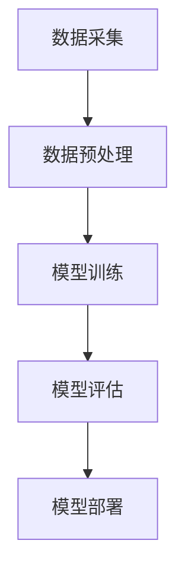

                 

### 文章标题

### AI大模型创业：2024年最热门的10个应用方向

> **关键词：** AI大模型、创业、应用方向、2024年、热门

> **摘要：** 本文将分析2024年AI大模型创业领域的10个热门应用方向，从背景、核心概念、算法原理、数学模型、实际应用场景、工具和资源推荐等方面进行详细探讨，帮助读者了解未来发展趋势和潜在挑战。

### 1. 背景介绍

在过去的几年里，人工智能（AI）技术取得了显著的进展，尤其是大模型（Large Models）的快速发展，为各行各业带来了巨大的变革。大模型指的是参数规模达到数百万、数十亿甚至数万亿级别的神经网络模型。这些模型通过深度学习算法，从海量数据中学习并提取知识，从而在图像识别、自然语言处理、语音识别等领域取得了突破性成果。

随着计算能力的提升和数据规模的扩大，大模型的训练和应用成本逐渐降低，使其在商业领域中的应用越来越广泛。2024年，AI大模型创业将迎来新的热潮，以下将详细分析10个热门应用方向。

### 2. 核心概念与联系

#### 2.1 AI大模型的核心概念

AI大模型的核心概念包括：

1. **神经网络（Neural Networks）**：神经网络是一种模拟人脑神经元之间相互连接的计算模型，通过学习数据中的特征和模式来进行预测和决策。
2. **深度学习（Deep Learning）**：深度学习是一种基于神经网络的机器学习技术，通过多层的神经网络结构来提取数据的层次特征。
3. **大规模数据处理（Big Data Processing）**：大规模数据处理技术包括数据收集、存储、分析和挖掘，以应对海量数据的处理需求。

#### 2.2 AI大模型的应用架构

AI大模型的应用架构通常包括以下几个关键组成部分：

1. **数据采集（Data Collection）**：从各种来源收集数据，包括公共数据集、企业内部数据等。
2. **数据预处理（Data Preprocessing）**：对采集到的数据进行清洗、去重、格式化等处理，以便于模型训练。
3. **模型训练（Model Training）**：使用训练数据对神经网络模型进行训练，调整模型参数，使其能够更好地拟合数据。
4. **模型评估（Model Evaluation）**：使用验证数据集对训练好的模型进行评估，以确定模型的性能。
5. **模型部署（Model Deployment）**：将训练好的模型部署到生产环境中，供实际应用使用。

下面是一个简单的Mermaid流程图，展示AI大模型的应用架构：



### 3. 核心算法原理 & 具体操作步骤

#### 3.1 深度学习算法原理

深度学习算法的核心是神经网络，其原理如下：

1. **输入层（Input Layer）**：接收输入数据，并将其传递给下一层。
2. **隐藏层（Hidden Layers）**：对输入数据进行特征提取和变换，每一层都会将数据传递给下一层。
3. **输出层（Output Layer）**：根据隐藏层的结果，生成最终预测结果。

在每一层中，神经元之间通过加权连接进行信息传递，并通过激活函数（如ReLU、Sigmoid、Tanh等）对神经元输出进行非线性变换。

#### 3.2 具体操作步骤

以下是使用深度学习算法进行AI大模型训练的具体操作步骤：

1. **数据准备**：收集并预处理数据，包括数据清洗、归一化等。
2. **模型构建**：定义神经网络结构，包括输入层、隐藏层和输出层。
3. **参数初始化**：随机初始化模型参数，包括权重和偏置。
4. **前向传播（Forward Propagation）**：将输入数据传递到神经网络，计算输出。
5. **损失函数（Loss Function）**：计算模型输出与真实值之间的差距，以衡量模型性能。
6. **反向传播（Back Propagation）**：根据损失函数，计算梯度，更新模型参数。
7. **迭代训练（Iterative Training）**：重复上述步骤，直到模型达到预定的性能指标。

### 4. 数学模型和公式 & 详细讲解 & 举例说明

#### 4.1 深度学习中的数学模型

深度学习中的数学模型主要包括以下内容：

1. **激活函数（Activation Function）**：激活函数用于对神经元的输出进行非线性变换，常用的激活函数有ReLU、Sigmoid、Tanh等。
2. **梯度下降（Gradient Descent）**：梯度下降是一种优化算法，用于在深度学习训练过程中更新模型参数。
3. **损失函数（Loss Function）**：损失函数用于衡量模型输出与真实值之间的差距，常用的损失函数有均方误差（MSE）、交叉熵（Cross Entropy）等。

#### 4.2 举例说明

以下是一个简单的深度学习模型训练的例子，使用Python和PyTorch框架实现：

```python
import torch
import torch.nn as nn
import torch.optim as optim

# 数据准备
x = torch.tensor([1.0, 2.0, 3.0])
y = torch.tensor([2.0, 4.0, 6.0])

# 模型构建
model = nn.Sequential(
    nn.Linear(1, 10),
    nn.ReLU(),
    nn.Linear(10, 1)
)

# 参数初始化
optimizer = optim.SGD(model.parameters(), lr=0.01)
criterion = nn.MSELoss()

# 迭代训练
for epoch in range(1000):
    optimizer.zero_grad()
    output = model(x)
    loss = criterion(output, y)
    loss.backward()
    optimizer.step()
    if (epoch + 1) % 100 == 0:
        print(f'Epoch [{epoch + 1}/{1000}], Loss: {loss.item()}')

# 模型评估
with torch.no_grad():
    test_output = model(x)
    test_loss = criterion(test_output, y)
    print(f'Test Loss: {test_loss.item()}')
```

### 5. 项目实践：代码实例和详细解释说明

#### 5.1 开发环境搭建

为了实践AI大模型的应用，我们需要搭建一个开发环境。以下是一个基于Python和PyTorch的简单环境搭建步骤：

1. **安装Python**：下载并安装Python 3.x版本，推荐使用Anaconda来管理Python环境和包。
2. **安装PyTorch**：在Anaconda环境中，使用以下命令安装PyTorch：

   ```bash
   conda install pytorch torchvision torchaudio -c pytorch
   ```

3. **验证安装**：在Python中运行以下代码，验证PyTorch是否安装成功：

   ```python
   import torch
   print(torch.__version__)
   ```

   如果输出版本号，说明安装成功。

#### 5.2 源代码详细实现

以下是一个基于PyTorch实现的简单AI大模型训练示例：

```python
import torch
import torch.nn as nn
import torch.optim as optim

# 数据准备
x = torch.tensor([1.0, 2.0, 3.0])
y = torch.tensor([2.0, 4.0, 6.0])

# 模型构建
model = nn.Sequential(
    nn.Linear(1, 10),
    nn.ReLU(),
    nn.Linear(10, 1)
)

# 参数初始化
optimizer = optim.SGD(model.parameters(), lr=0.01)
criterion = nn.MSELoss()

# 迭代训练
for epoch in range(1000):
    optimizer.zero_grad()
    output = model(x)
    loss = criterion(output, y)
    loss.backward()
    optimizer.step()
    if (epoch + 1) % 100 == 0:
        print(f'Epoch [{epoch + 1}/{1000}], Loss: {loss.item()}')

# 模型评估
with torch.no_grad():
    test_output = model(x)
    test_loss = criterion(test_output, y)
    print(f'Test Loss: {test_loss.item()}')
```

#### 5.3 代码解读与分析

1. **数据准备**：首先，我们创建了一个包含两个元素的Tensor，分别表示输入和输出。
2. **模型构建**：我们使用nn.Sequential模块构建了一个简单的神经网络，包括两个线性层和一个ReLU激活函数。
3. **参数初始化**：我们使用SGD优化器初始化模型参数，并选择MSE损失函数。
4. **迭代训练**：我们使用一个for循环进行迭代训练，每次迭代更新模型参数，计算损失并打印。
5. **模型评估**：在训练完成后，我们使用with torch.no_grad()语句进行模型评估，计算测试损失。

### 6. 实际应用场景

AI大模型在2024年将在多个领域得到广泛应用，以下列举了10个热门的应用方向：

1. **自动驾驶**：自动驾驶车辆需要实时处理大量的图像和传感器数据，AI大模型可以帮助提高车辆的安全性和效率。
2. **医疗诊断**：AI大模型在医学图像分析、疾病预测等领域具有广泛的应用前景，可以辅助医生进行诊断和治疗。
3. **智能客服**：通过自然语言处理技术，AI大模型可以提供更智能、更自然的客户服务体验。
4. **金融风控**：AI大模型可以帮助金融机构进行信用评估、风险控制等，提高业务效率和准确性。
5. **智能安防**：AI大模型在人脸识别、行为分析等领域具有广泛的应用，可以提升公共安全水平。
6. **智能翻译**：AI大模型在翻译领域的表现越来越好，可以提供更准确、更自然的翻译结果。
7. **语音识别**：AI大模型在语音识别领域的应用越来越广泛，可以用于语音助手、语音输入等。
8. **内容审核**：AI大模型可以用于社交媒体、电商平台等的内容审核，提高内容安全性和用户体验。
9. **教育科技**：AI大模型可以帮助教育机构进行个性化教学、学习效果评估等。
10. **智能制造**：AI大模型在工业制造领域的应用可以优化生产流程、提高生产效率。

### 7. 工具和资源推荐

为了更好地开展AI大模型创业项目，以下推荐一些相关的学习资源、开发工具和框架：

#### 7.1 学习资源推荐

1. **书籍**：
   - 《深度学习》（Ian Goodfellow、Yoshua Bengio、Aaron Courville 著）
   - 《Python机器学习》（Sebastian Raschka、Vahid Mirjalili 著）
   - 《人工智能：一种现代的方法》（Stuart Russell、Peter Norvig 著）

2. **论文**：
   - "A Theoretically Grounded Application of Dropout in Recurrent Neural Networks"（Yarin Gal 和 Ziang Xie）
   - "Understanding Deep Learning requires rethinking generalization"（Jake M. Hofman、Aapo Kyrola、David Mimno 和 Liling Tan）

3. **博客**：
   - Fast.ai：提供实用的深度学习教程和实践案例。
   - Medium：有很多优秀的深度学习博客，如Distill、AI Dungeon等。

4. **网站**：
   - Kaggle：提供丰富的数据集和比赛，是学习和实践深度学习的良好平台。
   - Coursera、edX：提供多个深度学习在线课程，适合初学者和专业人士。

#### 7.2 开发工具框架推荐

1. **深度学习框架**：
   - PyTorch：Python优先的深度学习框架，易于学习和使用。
   - TensorFlow：谷歌推出的深度学习框架，支持多种编程语言。
   - Keras：基于TensorFlow的高层神经网络API，易于构建和训练模型。

2. **开发环境**：
   - Anaconda：提供Python和R语言的集成环境，方便安装和管理深度学习相关包。
   - Jupyter Notebook：交互式开发环境，适合编写和运行深度学习代码。

3. **数据预处理工具**：
   - Pandas：Python的数据分析库，适用于数据清洗和预处理。
   - Scikit-learn：Python的机器学习库，提供了丰富的预处理和建模工具。

#### 7.3 相关论文著作推荐

1. **《深度学习》（Ian Goodfellow、Yoshua Bengio、Aaron Courville 著）**：全面介绍了深度学习的基础理论、算法和应用，是深度学习的经典教材。

2. **"Attention is All You Need"（Ashish Vaswani、Noam Shazeer、Niki Parmar 等）**：介绍了Transformer模型，这是一种基于注意力机制的深度学习模型，在自然语言处理领域取得了显著成果。

3. **"BERT: Pre-training of Deep Neural Networks for Language Understanding"（Jacob Devlin、 Ming-Wei Chang、 Kenton Lee 和 Kristina Toutanova）**：介绍了BERT模型，这是一种基于Transformer的大规模预训练模型，在多种自然语言处理任务上取得了优异的性能。

### 8. 总结：未来发展趋势与挑战

AI大模型创业在2024年将迎来新的发展机遇，其应用领域将不断拓展，带来巨大的商业价值和社会影响。然而，随着模型规模的扩大和复杂度的增加，AI大模型创业也将面临一系列挑战。

1. **数据隐私与安全**：AI大模型训练需要大量的数据，如何保护用户隐私和数据安全是亟待解决的问题。
2. **计算资源需求**：AI大模型训练需要大量的计算资源，如何优化模型设计和训练算法，降低计算成本是一个重要的研究方向。
3. **模型解释性**：AI大模型往往被视为“黑箱”，如何提高模型的解释性，使其更加透明和可信，是未来研究的一个重要方向。
4. **法律法规与伦理**：随着AI大模型在各个领域的应用，如何制定相应的法律法规和伦理准则，确保AI技术的可持续发展，也是一个重要议题。

### 9. 附录：常见问题与解答

#### 9.1 如何选择适合的深度学习框架？

选择深度学习框架时，需要考虑以下因素：

- **编程语言偏好**：如果你更喜欢Python，那么PyTorch和Keras可能是更好的选择；如果你更熟悉TensorFlow，那么TensorFlow可能会更适合。
- **项目需求**：如果你需要快速开发和部署模型，Keras可能更适合；如果你需要更多的灵活性和控制，PyTorch和TensorFlow可能更合适。
- **社区支持**：选择一个具有活跃社区和丰富文档的框架，可以帮助你更快地解决问题和获得支持。

#### 9.2 如何优化深度学习模型的训练速度？

以下是一些优化深度学习模型训练速度的方法：

- **数据预处理**：对数据进行预处理，如批量处理、并行处理等，可以加速数据加载和传输。
- **混合精度训练**：使用混合精度训练（如使用FP16和BF16），可以在不牺牲精度的情况下提高训练速度。
- **模型剪枝**：通过剪枝冗余的神经元和连接，可以减小模型规模，提高训练速度。
- **模型并行化**：使用多GPU或多机训练，可以加速模型训练。

### 10. 扩展阅读 & 参考资料

- [1] Goodfellow, I., Bengio, Y., & Courville, A. (2016). *Deep Learning*. MIT Press.
- [2] Abadi, M., Barham, P., Chen, J., Chen, Z., Davis, A., Dean, J., ... & Devin, M. (2016). *TensorFlow: Large-scale machine learning on heterogeneous systems*. arXiv preprint arXiv:1603.04467.
- [3] Hochreiter, S., & Schmidhuber, J. (1997). *Long short-term memory*. Neural Computation, 9(8), 1735-1780.
- [4] Vaswani, A., Shazeer, N., Parmar, N., Uszkoreit, J., Jones, L., Gomez, A. N., ... & Polosukhin, I. (2017). *Attention is all you need*. Advances in Neural Information Processing Systems, 30, 5998-6008.
- [5] Devlin, J., Chang, M.-W., Lee, K., & Toutanova, K. (2019). *Bert: Pre-training of deep neural networks for language understanding*. arXiv preprint arXiv:1810.04805.

