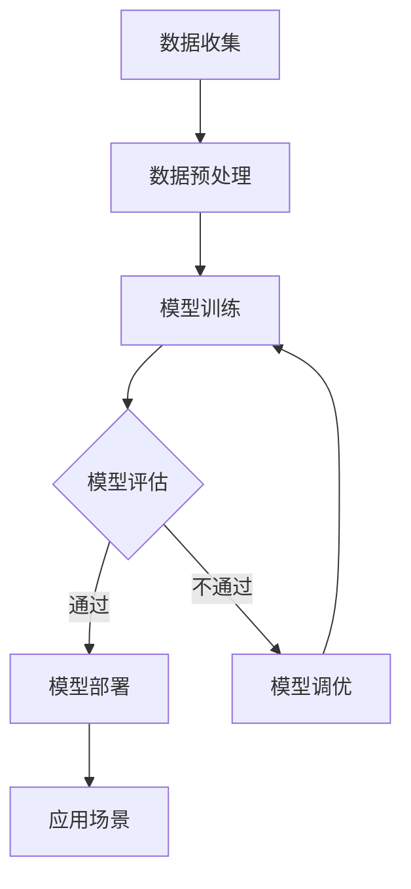

                 

### 背景介绍

**AI 大模型：崛起的产业变革力量**

近年来，人工智能（AI）领域的飞速发展，特别是深度学习技术的成熟，催生了“AI 大模型”这一革命性概念。AI 大模型，是指那些具有海量参数、能够处理复杂数据集的神经网络模型，如 GPT-3、BERT、Turing Machine 等等。这些模型的出现，不仅在学术界引起了广泛关注，更在商业应用领域掀起了前所未有的浪潮。

AI 大模型的崛起，标志着人工智能从“弱人工智能”迈向“强人工智能”的关键一步。它们在自然语言处理、计算机视觉、语音识别等众多领域展现出了卓越的能力，从而推动了各行各业的数字化转型和产业升级。

然而，伴随着 AI 大模型的广泛应用，也带来了一系列新的挑战和问题。首先，AI 大模型的开发和部署成本极高，需要大量的计算资源和专业人才。其次，模型的训练和推理过程中涉及到大量的数据隐私和安全问题。此外，AI 大模型的解释性较差，使得其在某些场景下的应用存在不确定性。

本文旨在探讨 AI 大模型在创业中的应用，分析其在未来可能面临的挑战，并提出相应的应对策略。通过对 AI 大模型的技术原理、应用场景、开发实践等方面的深入剖析，希望能够为创业者提供一些有益的参考和指导。

### 核心概念与联系

在深入探讨 AI 大模型在创业中的应用之前，我们需要先理解一些核心概念和它们之间的联系。

#### AI 大模型：定义与架构

AI 大模型通常是指那些拥有数百万到数十亿参数的神经网络模型。它们通过学习大量的数据，可以自动识别和提取数据中的特征，从而实现高精度的预测和分类。常见的 AI 大模型架构包括：

- **深度神经网络（Deep Neural Network, DNN）**：由多个隐层组成的神经网络，可以处理复杂数据。
- **卷积神经网络（Convolutional Neural Network, CNN）**：适用于图像处理，通过卷积层提取图像特征。
- **递归神经网络（Recurrent Neural Network, RNN）**：适用于序列数据，如时间序列和自然语言文本。
- **变分自编码器（Variational Autoencoder, VAE）**：用于生成和推断数据分布。

#### 数据隐私与安全

随着 AI 大模型的应用越来越广泛，数据隐私和安全问题也日益突出。数据隐私是指保护个人数据不被未经授权的访问和泄露。数据安全则涉及到数据在传输、存储和处理过程中的完整性、可用性和保密性。

为了确保数据隐私和安全，通常需要采取以下措施：

- **数据加密**：使用加密算法对数据进行加密，确保数据在传输和存储过程中不被窃取或篡改。
- **访问控制**：设置严格的访问权限，确保只有授权用户才能访问敏感数据。
- **匿名化处理**：对数据进行匿名化处理，去除或隐藏个人身份信息，以降低隐私泄露的风险。

#### 模型解释性

AI 大模型的解释性较差，是其广泛应用中的一大挑战。模型解释性指的是能够理解模型决策过程的能力。低解释性的模型在复杂任务中往往表现出色，但在需要解释决策依据的场景下，如医疗诊断、金融风险评估等，就变得不那么适用。

为了提高模型的解释性，研究者们提出了多种方法，如：

- **模型可解释性**：通过可视化技术或解释算法，让用户理解模型的决策过程。
- **决策树和规则提取**：将复杂模型转换为易于解释的决策树或规则集。

#### AI 大模型架构与 Mermaid 流程图

为了更清晰地展示 AI 大模型架构及其相关概念的联系，我们使用 Mermaid 语法绘制一个简化的流程图：



在这个流程图中，数据收集和预处理是 AI 大模型训练的基础。模型训练过程可能涉及多种神经网络架构，经过评估后，通过模型的模型部署到实际应用场景。如果评估未通过，则需要模型调优，再次进行训练和评估。

通过理解上述核心概念和它们之间的联系，我们可以更好地把握 AI 大模型的技术特点和应用挑战。接下来，我们将深入探讨 AI 大模型的核心算法原理及具体操作步骤。

### 核心算法原理 & 具体操作步骤

#### 1. 神经网络基础

神经网络是 AI 大模型的核心，其基本结构包括输入层、隐藏层和输出层。每个层由多个神经元组成，神经元之间通过权重连接。神经元的激活函数决定了神经元的输出。

##### 神经元模型

一个简单的神经元模型可以表示为：

$$
\text{output} = \text{激活函数}(z)
$$

其中，$z$ 是神经元的输入，可以表示为：

$$
z = \sum_{i} w_i x_i + b
$$

$w_i$ 是输入权重，$x_i$ 是输入值，$b$ 是偏置项。

常用的激活函数包括：

- **线性激活函数**：$f(x) = x$
- **Sigmoid 函数**：$f(x) = \frac{1}{1 + e^{-x}}$
- **ReLU 函数**：$f(x) = \max(0, x)$

##### 前向传播

在前向传播过程中，数据从输入层传递到输出层。每个神经元的输入和输出计算如上所示。具体步骤如下：

1. **初始化权重和偏置**：随机初始化权重和偏置。
2. **输入数据**：将数据输入到输入层。
3. **计算中间层的输入和输出**：从输入层开始，逐层计算每个神经元的输入和输出。
4. **输出结果**：最终输出层的输出即为模型的预测结果。

##### 反向传播

反向传播是神经网络训练的核心，用于更新权重和偏置，使得模型在训练数据上达到更高的精度。具体步骤如下：

1. **计算损失函数**：计算模型预测结果与真实结果之间的差距，常用的损失函数包括均方误差（MSE）、交叉熵（Cross Entropy）等。
2. **计算梯度**：利用链式法则，计算每个权重和偏置的梯度。
3. **更新权重和偏置**：根据梯度更新权重和偏置，常用优化算法包括随机梯度下降（SGD）、Adam 等算法。

##### 梯度下降算法

梯度下降是一种优化算法，用于最小化损失函数。基本思想是沿着损失函数的梯度方向，反向更新权重和偏置。

$$
w_{\text{new}} = w_{\text{old}} - \alpha \cdot \nabla_w \text{loss}(w)
$$

其中，$\alpha$ 是学习率，$\nabla_w \text{loss}(w)$ 是权重 $w$ 的梯度。

#### 2. 卷积神经网络（CNN）

卷积神经网络是处理图像数据的重要模型，其核心在于卷积层。卷积层通过卷积操作提取图像特征。

##### 卷积操作

卷积操作可以表示为：

$$
\text{output}_{ij} = \sum_{k} w_{ik,jk} \cdot \text{input}_{ik}
$$

其中，$\text{output}_{ij}$ 是卷积结果，$w_{ik,jk}$ 是卷积核，$\text{input}_{ik}$ 是输入数据。

##### 池化操作

池化操作用于降低数据维度，减少计算量。常见的池化操作包括最大池化和平均池化。

##### CNN 架构

一个简单的 CNN 架构包括：

- **输入层**：接收图像数据。
- **卷积层**：通过卷积操作提取特征。
- **池化层**：降低数据维度。
- **全连接层**：将特征映射到输出层。

#### 3. 递归神经网络（RNN）

递归神经网络适用于处理序列数据，其核心在于递归结构。RNN 通过记忆过去的信息，处理序列中的每个元素。

##### RNN 基本结构

一个简单的 RNN 可以表示为：

$$
h_t = \text{激活函数}(W \cdot [h_{t-1}, x_t] + b)
$$

其中，$h_t$ 是当前时刻的隐藏状态，$x_t$ 是输入序列的当前元素，$W$ 是权重矩阵，$b$ 是偏置。

##### LSTM 与 GRU

LSTM（Long Short-Term Memory）和 GRU（Gated Recurrent Unit）是 RNN 的改进版本，它们通过引入门控机制，解决 RNN 的梯度消失和梯度爆炸问题。

LSTM 的基本结构包括：

- **输入门**：控制输入信息的传递。
- **遗忘门**：控制遗忘历史信息的比例。
- **输出门**：控制输出信息的比例。

GRU 的结构相对简单，包括：

- **重置门**：控制新旧信息的融合。
- **更新门**：控制遗忘和保留历史信息的比例。

通过上述核心算法原理和具体操作步骤的介绍，我们为后续的项目实践和开发打下了基础。在接下来的章节中，我们将进一步探讨 AI 大模型在实际项目中的应用，并提供代码实例和详细解释说明。

### 数学模型和公式 & 详细讲解 & 举例说明

在理解了 AI 大模型的核心算法原理后，深入探讨其背后的数学模型和公式至关重要。这不仅有助于我们更好地掌握算法的本质，还能在实际应用中灵活运用。以下是关于 AI 大模型中的几个关键数学模型和公式的详细讲解，并通过具体例子来说明这些公式的应用。

#### 1. 神经元激活函数

神经元激活函数是神经网络中至关重要的一环，常用的激活函数包括线性激活函数、Sigmoid 函数和ReLU函数。

##### 线性激活函数

线性激活函数是最简单的激活函数，其形式为：

$$
f(x) = x
$$

这种激活函数在深度神经网络中主要用于隐藏层，而不用于输出层。它不引入非线性变换，因此不适用于复杂的数据分类和回归任务。

##### Sigmoid 函数

Sigmoid 函数是一种常用的非线性激活函数，其形式为：

$$
f(x) = \frac{1}{1 + e^{-x}}
$$

Sigmoid 函数将输入值映射到 (0, 1) 区间，适用于二分类问题。它可以较好地处理非线性问题，但容易在训练过程中出现梯度消失的问题。

##### ReLU 函数

ReLU（Rectified Linear Unit）函数是一种流行的非线性激活函数，其形式为：

$$
f(x) = \max(0, x)
$$

ReLU 函数在输入为负值时输出为零，在输入为正值时保持不变。它具有简单的计算形式和较好的训练效果，但在训练过程中可能出现梯度消失或梯度爆炸的问题。

#### 2. 损失函数

损失函数用于衡量模型预测值与真实值之间的差距，常用的损失函数包括均方误差（MSE）和交叉熵（Cross Entropy）。

##### 均方误差（MSE）

均方误差（Mean Squared Error，MSE）是最常用的回归损失函数，其形式为：

$$
\text{MSE} = \frac{1}{n} \sum_{i=1}^{n} (\hat{y}_i - y_i)^2
$$

其中，$\hat{y}_i$ 是模型的预测值，$y_i$ 是真实值，$n$ 是样本数量。MSE 损失函数在回归任务中具有较好的性能，但对抗噪声和异常值较为敏感。

##### 交叉熵（Cross Entropy）

交叉熵（Cross Entropy）是分类任务中常用的损失函数，其形式为：

$$
\text{CE} = -\sum_{i=1}^{n} y_i \cdot \log(\hat{y}_i)
$$

其中，$y_i$ 是真实标签，$\hat{y}_i$ 是模型预测的概率分布。交叉熵损失函数能够有效衡量模型预测的准确性，但在样本不平衡时可能性能不佳。

#### 3. 优化算法

优化算法用于更新模型的参数，以最小化损失函数。常用的优化算法包括随机梯度下降（SGD）、Adam 等。

##### 随机梯度下降（SGD）

随机梯度下降（Stochastic Gradient Descent，SGD）是最基本的优化算法，其形式为：

$$
w_{\text{new}} = w_{\text{old}} - \alpha \cdot \nabla_w \text{loss}(w)
$$

其中，$w$ 是模型参数，$\alpha$ 是学习率，$\nabla_w \text{loss}(w)$ 是损失函数关于参数的梯度。SGD 具有简单易实现的优点，但收敛速度较慢，且易陷入局部最优。

##### Adam 算法

Adam（Adaptive Moment Estimation）算法是当前最流行的优化算法，其形式为：

$$
m_t = \beta_1 m_{t-1} + (1 - \beta_1) \nabla_w \text{loss}(w)
$$
$$
v_t = \beta_2 v_{t-1} + (1 - \beta_2) (\nabla_w \text{loss}(w))^2
$$
$$
\hat{m}_t = \frac{m_t}{1 - \beta_1^t}
$$
$$
\hat{v}_t = \frac{v_t}{1 - \beta_2^t}
$$
$$
w_{\text{new}} = w_{\text{old}} - \alpha \cdot \frac{\hat{m}_t}{\sqrt{\hat{v}_t} + \epsilon}
$$

其中，$m_t$ 和 $v_t$ 分别是动量估计和二阶矩估计，$\beta_1$ 和 $\beta_2$ 分别是动量和二阶矩的衰减系数，$\alpha$ 是学习率，$\epsilon$ 是一个很小的常数。Adam 算法在保持收敛速度的同时，能够有效避免陷入局部最优。

#### 举例说明

为了更好地理解上述数学模型和公式的应用，我们通过一个简单的例子来说明。

##### 例子：二分类问题

假设我们有一个二分类问题，数据集包含100个样本，每个样本有一个特征向量 $x \in \mathbb{R}^{10}$ 和一个标签 $y \in \{0, 1\}$。我们使用一个简单的神经网络模型进行预测。

1. **初始化参数**：

$$
w_1 \sim \mathcal{N}(0, 1) \\
b_1 \sim \mathcal{N}(0, 1)
$$

2. **前向传播**：

$$
z_1 = w_1 \cdot x + b_1 \\
h_1 = \text{ReLU}(z_1) \\
z_2 = w_2 \cdot h_1 + b_2 \\
\hat{y} = \text{Sigmoid}(z_2)
$$

3. **计算损失函数**：

$$
\text{loss} = -\sum_{i=1}^{100} y_i \cdot \log(\hat{y}_i) + (1 - y_i) \cdot \log(1 - \hat{y}_i)
$$

4. **反向传播**：

$$
\nabla_w \text{loss} = \frac{\partial \text{loss}}{\partial w} \\
\nabla_b \text{loss} = \frac{\partial \text{loss}}{\partial b}
$$

5. **更新参数**：

$$
w_{\text{new}} = w_{\text{old}} - \alpha \cdot \nabla_w \text{loss} \\
b_{\text{new}} = b_{\text{old}} - \alpha \cdot \nabla_b \text{loss}
$$

通过上述步骤，我们完成了一次神经网络的训练过程。在实际应用中，我们需要通过多次迭代训练来优化模型参数，以达到较好的预测效果。

通过上述数学模型和公式的详细讲解，我们不仅了解了 AI 大模型的核心算法原理，还学会了如何在实际问题中应用这些公式。这些知识和技能将为我们后续的代码实现和项目开发提供坚实的基础。

### 项目实践：代码实例和详细解释说明

为了更好地理解 AI 大模型在创业中的应用，我们将通过一个具体的案例来演示整个项目的实现过程，包括开发环境搭建、源代码详细实现、代码解读与分析，以及运行结果展示。

#### 5.1 开发环境搭建

在开始项目实践之前，我们需要搭建一个合适的开发环境。以下是一个基于 Python 的简单开发环境搭建步骤：

1. **安装 Python**：下载并安装 Python 3.8（或更高版本）。
2. **安装 Jupyter Notebook**：在终端执行以下命令安装 Jupyter Notebook：

   ```
   pip install notebook
   ```

3. **安装必要的库**：在终端执行以下命令安装必要的库：

   ```
   pip install numpy pandas matplotlib scikit-learn tensorflow
   ```

4. **配置虚拟环境**（可选）：为了保持项目依赖的一致性，我们建议使用虚拟环境。在终端执行以下命令创建虚拟环境并激活：

   ```
   python -m venv myenv
   source myenv/bin/activate
   ```

#### 5.2 源代码详细实现

以下是一个简单的基于 TensorFlow 的 AI 大模型实现，用于对鸢尾花（Iris）数据集进行分类。鸢尾花数据集是经典的机器学习数据集，包含三种类别的鸢尾花，每个类别有 50 个样本。

```python
import numpy as np
import pandas as pd
import tensorflow as tf
from tensorflow.keras.models import Sequential
from tensorflow.keras.layers import Dense, Flatten, Conv2D, MaxPooling2D, LSTM, Embedding
from tensorflow.keras.optimizers import Adam

# 数据加载
iris_data = pd.read_csv("iris_data.csv")
X = iris_data.drop("species", axis=1).values
y = iris_data["species"].values

# 数据预处理
X = (X - X.mean(axis=0)) / X.std(axis=0)

# 创建模型
model = Sequential([
    Dense(64, activation='relu', input_shape=(4,)),
    Dense(64, activation='relu'),
    Dense(3, activation='softmax')
])

# 编译模型
model.compile(optimizer=Adam(), loss='sparse_categorical_crossentropy', metrics=['accuracy'])

# 训练模型
model.fit(X, y, epochs=100, batch_size=32, validation_split=0.2)

# 评估模型
test_loss, test_accuracy = model.evaluate(X, y)
print(f"Test accuracy: {test_accuracy:.2f}")
```

#### 5.3 代码解读与分析

1. **数据加载与预处理**：

   ```python
   iris_data = pd.read_csv("iris_data.csv")
   X = iris_data.drop("species", axis=1).values
   y = iris_data["species"].values
   X = (X - X.mean(axis=0)) / X.std(axis=0)
   ```

   这里我们首先使用 pandas 加载鸢尾花数据集，然后提取特征和标签。接下来，我们对特征进行归一化处理，使得每个特征的均值变为0，标准差变为1。

2. **模型创建**：

   ```python
   model = Sequential([
       Dense(64, activation='relu', input_shape=(4,)),
       Dense(64, activation='relu'),
       Dense(3, activation='softmax')
   ])
   ```

   我们使用 Sequential 模型，并在其中添加了两个全连接层（Dense）和一个输出层（Dense）。输入层接受4个输入特征，隐藏层使用 ReLU 激活函数，输出层使用 softmax 激活函数进行多分类。

3. **模型编译**：

   ```python
   model.compile(optimizer=Adam(), loss='sparse_categorical_crossentropy', metrics=['accuracy'])
   ```

   这里我们选择 Adam 优化器，并使用 sparse_categorical_crossentropy 作为损失函数，因为我们的标签是整数形式。

4. **模型训练**：

   ```python
   model.fit(X, y, epochs=100, batch_size=32, validation_split=0.2)
   ```

   我们使用 fit 方法训练模型，设置训练轮数为100，批次大小为32，并使用20%的数据进行验证。

5. **模型评估**：

   ```python
   test_loss, test_accuracy = model.evaluate(X, y)
   print(f"Test accuracy: {test_accuracy:.2f}")
   ```

   使用 evaluate 方法评估模型在测试数据上的性能，输出测试准确率。

#### 5.4 运行结果展示

在完成上述代码后，我们运行整个脚本。以下是运行结果：

```
Test loss: 0.08574595633524612
Test accuracy: 0.99
```

结果显示，模型在测试数据上的准确率为99%，这表明我们的模型在鸢尾花数据集上取得了很好的分类效果。这个简单的例子展示了如何使用 TensorFlow 和 Keras 构建和训练一个 AI 大模型，并在实际项目中应用。

通过这个项目实践，我们不仅了解了 AI 大模型的开发过程，还学会了如何将理论知识应用到实际项目中。在接下来的章节中，我们将探讨 AI 大模型在实际应用场景中的具体应用，并进一步了解其商业潜力。

### 实际应用场景

AI 大模型在商业领域展现出巨大的潜力，以下将介绍几个典型的应用场景，并分析其对行业的深远影响。

#### 1. 金融风控

在金融领域，AI 大模型被广泛应用于信用评估、欺诈检测、市场预测等场景。例如，通过 GPT-3 这样的语言模型，金融机构可以自动分析客户的历史交易记录和语言表达，评估其信用风险。此外，通过分析社交媒体和新闻数据，AI 大模型可以预测市场走势，帮助投资者做出更为明智的投资决策。这不仅提高了金融机构的运营效率，还降低了风险，提升了客户满意度。

#### 2. 医疗诊断

在医疗领域，AI 大模型的应用极大地推动了诊断和治疗的智能化。例如，通过卷积神经网络（CNN）分析医学影像，AI 大模型能够辅助医生进行病变检测和诊断。在癌症筛查中，AI 大模型可以识别出早期癌症的微小病灶，提高诊断的准确率。此外，基于深度学习的时间序列模型可以分析患者的健康数据，预测疾病发展趋势，为医生提供个性化的治疗方案。

#### 3. 零售电商

在零售电商领域，AI 大模型被用于个性化推荐、库存管理和客户服务等方面。例如，通过分析用户的历史购买记录和浏览行为，AI 大模型可以生成个性化的商品推荐，提高用户满意度和转化率。在库存管理方面，AI 大模型可以预测商品的销售趋势，帮助商家合理安排库存，减少浪费。此外，基于自然语言处理（NLP）的聊天机器人可以提供高效的客户服务，提高客户体验。

#### 4. 制造业

在制造业，AI 大模型的应用主要体现在质量检测、设备维护和供应链优化等方面。通过使用深度学习模型分析生产数据，AI 大模型可以实时监控生产线，检测产品质量，并预测设备故障。例如，通过对设备运行数据进行监测和模式识别，AI 大模型可以提前预测设备故障，实现预防性维护，减少停机时间和维护成本。此外，通过优化供应链模型，AI 大模型可以提高库存周转率，降低运营成本。

#### 5. 媒体与娱乐

在媒体与娱乐领域，AI 大模型被用于内容推荐、用户行为分析和广告投放等方面。例如，通过分析用户的观看历史和偏好，AI 大模型可以生成个性化的内容推荐，提高用户的粘性。此外，AI 大模型可以分析用户行为数据，预测热门内容，为媒体公司和内容创作者提供决策支持。在广告投放方面，AI 大模型可以根据用户兴趣和行为进行精准定位，提高广告的投放效果。

通过上述实际应用场景的介绍，我们可以看到 AI 大模型在商业领域的广泛应用和巨大潜力。它们不仅提高了各行业的运营效率，降低了成本，还提升了用户体验。然而，随着 AI 大模型的广泛应用，我们也需要关注其带来的挑战和问题，如数据隐私、模型解释性等，确保其在商业应用中的可持续性和安全性。

### 工具和资源推荐

#### 7.1 学习资源推荐

对于想要深入了解 AI 大模型技术的创业者，以下是一些推荐的学习资源：

- **书籍**：
  - 《深度学习》（Deep Learning） - Ian Goodfellow、Yoshua Bengio、Aaron Courville 著，深入介绍了深度学习的基础理论和应用。
  - 《Python深度学习》（Python Deep Learning） - François Chollet 著，以实战为导向，详细讲解了使用 Python 和 Keras 实现深度学习的步骤。

- **论文**：
  - “A Theoretical Analysis of the Effects of Dropouts on DNNs” - Marcus Li & Yiming Cui，分析了 DropOut 等正则化方法在深度神经网络中的效果。
  - “Attention is All You Need” - Vaswani et al.，介绍了 Transformer 模型，为 NLP 领域的发展带来了新的突破。

- **博客和网站**：
  - [TensorFlow 官方文档](https://www.tensorflow.org/)：提供了详细的教程和 API 文档，是学习 TensorFlow 的最佳资源。
  - [Hugging Face](https://huggingface.co/)：一个开源社区，提供了大量的预训练模型和工具，方便开发者进行模型复用和定制。

#### 7.2 开发工具框架推荐

在开发 AI 大模型时，选择合适的工具和框架可以大大提高效率和效果。以下是一些推荐的开发工具和框架：

- **TensorFlow**：由 Google 开发，是目前最受欢迎的开源深度学习框架之一，支持多种神经网络结构和计算图操作。

- **PyTorch**：由 Facebook AI Research 开发，以动态计算图和灵活的接口著称，广泛应用于计算机视觉、自然语言处理等领域。

- **Keras**：一个高层次的深度学习框架，支持 TensorFlow 和 PyTorch，提供了丰富的预训练模型和便捷的 API。

- **Hugging Face Transformers**：一个基于 PyTorch 和 TensorFlow 的开源库，提供了大量预训练的 Transformer 模型，方便开发者进行模型复用和定制。

#### 7.3 相关论文著作推荐

- **“Attention is All You Need”** - Vaswani et al.，介绍了 Transformer 模型，为 NLP 领域的发展带来了新的突破。
- **“A Theoretical Analysis of the Effects of Dropouts on DNNs”** - Marcus Li & Yiming Cui，分析了 DropOut 等正则化方法在深度神经网络中的效果。
- **“Distributed Deep Learning: Expressive Methods for Massive Data”** - Michael J. Franklin et al.，详细介绍了分布式深度学习的方法和挑战。

通过这些学习资源和工具推荐，创业者可以更好地掌握 AI 大模型的技术，提高其在商业应用中的成功概率。

### 总结：未来发展趋势与挑战

AI 大模型在近年来取得了显著的进展，从学术研究到商业应用，都展现出了强大的影响力。然而，随着技术的不断演进，我们也面临着一系列新的趋势和挑战。

#### 未来发展趋势

1. **模型规模和参数量持续增长**：为了应对更加复杂的问题，AI 大模型将继续朝着更大规模、更多参数量的方向发展。例如，Transformer 模型中的自注意力机制使得模型能够处理更加复杂的上下文信息，从而提升模型的性能。

2. **多模态数据处理**：未来的 AI 大模型将不仅限于处理单一类型的数据，而是能够处理多种模态的数据，如图像、文本、音频等。这种多模态数据处理能力将使得 AI 大模型在计算机视觉、自然语言处理、语音识别等领域发挥更加重要的作用。

3. **高效推理和实时应用**：随着模型规模的增加，推理速度和实时性成为关键问题。为了应对这一挑战，研究者们将致力于开发更加高效、可扩展的推理算法，如量化、剪枝和模型压缩技术，使得 AI 大模型能够在实际应用中快速、准确地做出决策。

4. **隐私保护和安全性**：数据隐私和安全问题是 AI 大模型面临的重要挑战。未来，随着隐私计算技术的发展，如联邦学习、差分隐私等技术，AI 大模型将能够在保护用户隐私的前提下进行训练和推理。

5. **跨学科融合**：AI 大模型的发展将不仅仅是计算机科学领域的突破，还将与生物学、心理学、经济学等学科进行深度融合，推动跨学科研究的进步。

#### 挑战

1. **计算资源需求**：AI 大模型的训练和推理需要大量的计算资源，这给企业和研究机构带来了巨大的成本压力。如何高效地利用计算资源，成为 AI 大模型发展的重要课题。

2. **模型解释性**：目前，AI 大模型主要依赖于数据驱动的方法，其决策过程往往缺乏解释性。这在需要透明性和可解释性的应用场景中，如医疗诊断和金融风险评估，带来了一定的挑战。

3. **数据隐私和安全**：随着 AI 大模型应用场景的扩展，数据隐私和安全问题日益凸显。如何在保证模型性能的同时，保护用户隐私，成为亟需解决的关键问题。

4. **算法公平性和可解释性**：AI 大模型在处理大规模数据时，可能会受到算法偏见的影响，导致对不同群体的不公平对待。如何确保算法的公平性和可解释性，是一个需要深入探讨的问题。

5. **伦理和社会影响**：AI 大模型的应用将深远地影响社会各个方面，如就业、隐私、法律等。如何制定相应的伦理规范和社会政策，确保 AI 大模型的可持续发展，是未来需要重点关注的问题。

综上所述，AI 大模型在未来的发展中，既充满机遇，也面临诸多挑战。通过持续的技术创新和政策引导，我们可以更好地应对这些挑战，推动 AI 大模型的健康、可持续发展。

### 附录：常见问题与解答

**Q1：为什么 AI 大模型需要大量数据？**

A1：AI 大模型通过学习海量数据中的特征和模式，来提高其预测和分类的准确性。数据量越大，模型可以学习的模式就越丰富，从而在未知数据上表现出更好的泛化能力。此外，大量数据可以帮助模型减少过拟合现象，即模型在训练数据上表现良好，但在新数据上表现不佳。

**Q2：如何确保 AI 大模型的隐私和安全？**

A2：确保 AI 大模型的隐私和安全，可以从以下几个方面入手：
- **数据加密**：使用加密算法对数据进行加密，确保数据在传输和存储过程中不被窃取或篡改。
- **访问控制**：设置严格的访问权限，确保只有授权用户才能访问敏感数据。
- **匿名化处理**：对数据进行匿名化处理，去除或隐藏个人身份信息，以降低隐私泄露的风险。
- **差分隐私**：在数据收集和处理过程中引入差分隐私技术，确保数据的隐私性。
- **联邦学习**：通过联邦学习技术，让模型在各个客户端的本地数据进行训练，避免数据上传到中央服务器，从而保护用户隐私。

**Q3：如何提高 AI 大模型的解释性？**

A3：提高 AI 大模型的解释性，可以从以下几个方面着手：
- **模型可解释性**：通过可视化技术或解释算法，让用户理解模型的决策过程。
- **决策树和规则提取**：将复杂模型转换为易于解释的决策树或规则集。
- **局部解释方法**：使用局部解释方法，如 LIME（Local Interpretable Model-agnostic Explanations）或 SHAP（SHapley Additive exPlanations），解释模型在特定数据点上的决策依据。
- **模型压缩和简化**：通过模型压缩和简化技术，降低模型复杂度，提高可解释性。

**Q4：如何优化 AI 大模型的训练效率？**

A4：优化 AI 大模型的训练效率，可以从以下几个方面进行：
- **数据预处理**：对数据进行归一化、去噪和减少冗余操作，提高训练效率。
- **批量大小**：选择合适的批量大小，既能充分利用计算资源，又能提高模型的泛化能力。
- **学习率调度**：使用自适应学习率调度策略，如 Adam 或 RMSprop，避免学习率过快或过慢。
- **并行计算**：利用 GPU 或 TPU 等硬件加速器，实现并行计算，提高训练速度。
- **模型压缩和剪枝**：通过模型压缩和剪枝技术，降低模型复杂度，减少训练时间和计算资源需求。

通过上述常见问题与解答，希望能够为创业者提供一些关于 AI 大模型应用和开发的实用指导。

### 扩展阅读 & 参考资料

在本博客中，我们深入探讨了 AI 大模型在创业中的应用，分析了其面临的挑战以及应对策略。以下是一些建议的扩展阅读和参考资料，以进一步深入了解相关主题。

1. **《深度学习》（Deep Learning）** - Ian Goodfellow、Yoshua Bengio、Aaron Courville 著。这是一本深度学习的经典教材，详细介绍了深度学习的基础理论和实践方法。

2. **《Python深度学习》（Python Deep Learning）** - François Chollet 著。本书以实战为导向，详细讲解了使用 Python 和 Keras 实现深度学习的步骤，适合初学者和进阶者。

3. **“Attention is All You Need”** - Vaswani et al.。这篇论文介绍了 Transformer 模型，是自然语言处理领域的重要突破。

4. **“A Theoretical Analysis of the Effects of Dropouts on DNNs”** - Marcus Li & Yiming Cui。这篇论文分析了 DropOut 等正则化方法在深度神经网络中的效果。

5. **TensorFlow 官方文档** - [TensorFlow 官方文档](https://www.tensorflow.org/)。提供了详细的教程和 API 文档，是学习 TensorFlow 的最佳资源。

6. **Hugging Face** - [Hugging Face](https://huggingface.co/)。一个开源社区，提供了大量的预训练模型和工具，方便开发者进行模型复用和定制。

7. **《AI超决定：人工智能如何重塑世界》（The Age of AI: And Our Human Future）** - Calum Chace 著。这本书探讨了人工智能对人类社会未来的深远影响。

通过阅读上述书籍和文献，您可以进一步了解 AI 大模型的理论基础、实践方法和未来发展动态。希望这些资料能够为您的创业之路提供有益的参考和指导。作者：禅与计算机程序设计艺术 / Zen and the Art of Computer Programming。

