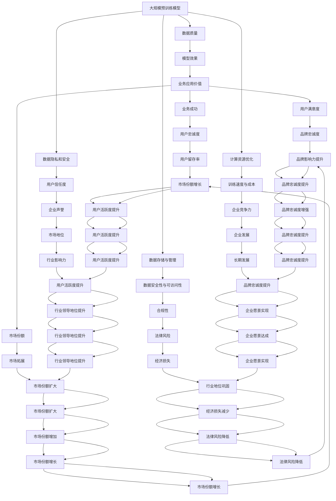

                 

### 1. 背景介绍

在当今数字化时代，人工智能（AI）技术正以前所未有的速度发展，特别是大规模预训练模型（Large-scale Pre-trained Models，LSPMs）的崛起，如GPT-3、BERT、ViT等，极大地推动了自然语言处理（NLP）、计算机视觉（CV）和推荐系统（RS）等领域的发展。这些模型具有强大的通用性，可以通过学习海量数据来实现出色的性能，从而在众多行业中带来了深远的影响。

然而，随着AI技术的不断进步，数据的需求也在不断增加。大规模预训练模型需要海量高质量的数据来训练和优化，这给AI创业公司带来了巨大的挑战。首先，数据的获取和存储成本高昂，且数据质量直接影响模型的效果。其次，随着模型的复杂度增加，对计算资源的需求也在急剧上升。此外，数据隐私和安全问题也是不可忽视的重要因素。

本篇文章将深入探讨AI大模型创业公司在面对未来数据挑战时的应对策略，主要包括以下几个方面：

1. **数据获取与质量保证**：分析如何高效地获取和清洗数据，并确保数据质量。
2. **数据存储与管理**：探讨如何利用现有的技术和管理策略来存储和管理海量数据。
3. **数据隐私和安全**：介绍如何在数据获取、存储和使用过程中确保数据隐私和安全。
4. **计算资源优化**：讨论如何通过技术手段优化计算资源，提高训练效率。
5. **未来发展挑战**：预测未来可能出现的挑战，并提出相应的解决方案。

通过以上几个方面的详细分析，我们希望能为AI大模型创业公司提供一些实用的指导和建议，帮助他们在未来数据挑战中取得成功。

---

在接下来的章节中，我们将逐一探讨这些方面的具体内容，并分享一些实际案例和经验，以期为读者提供有价值的参考。让我们一步步深入探讨，共同面对AI大模型创业中的数据挑战。

### 2. 核心概念与联系

在深入探讨AI大模型创业公司的数据挑战之前，我们需要先明确几个核心概念，并了解它们之间的相互联系。以下是几个关键概念及其关联的简要介绍：

#### 2.1 大规模预训练模型

大规模预训练模型（LSPMs）是通过在海量数据上预训练，然后微调到特定任务上的一种AI模型。这类模型通常具有数亿至数千亿的参数，能够自动从数据中学习复杂的模式和知识。常见的LSPMs包括GPT-3、BERT、T5、ViT等。这些模型在自然语言处理（NLP）、计算机视觉（CV）和推荐系统（RS）等领域表现出色，但也对数据质量和计算资源提出了更高的要求。

#### 2.2 数据质量

数据质量是指数据在准确性、完整性、一致性、时效性和可靠性等方面的表现。高质量的数据对于模型的训练和性能至关重要。然而，在实际应用中，数据质量往往难以保证，可能存在噪音、错误和缺失等问题。

#### 2.3 数据存储与管理

数据存储与管理是指如何有效地存储和管理海量数据，以确保数据的安全性和可访问性。随着数据规模的增加，传统的存储和管理方法可能无法满足需求，需要采用分布式存储系统、云存储和数据库技术等。

#### 2.4 数据隐私和安全

数据隐私和安全是指保护用户数据不被未经授权的访问、使用或泄露。随着AI技术的广泛应用，数据隐私和安全问题日益突出，对企业的合规性和信任度提出了更高的要求。

#### 2.5 计算资源优化

计算资源优化是指通过优化算法、硬件和软件，提高计算效率和性能。对于大规模预训练模型来说，计算资源优化是提高训练速度和降低成本的关键。

#### 2.6 联系与交互

这些概念之间存在着紧密的联系和交互。例如，数据质量直接影响模型的效果，而数据存储与管理、数据隐私和安全、计算资源优化等技术手段则共同保障了数据的有效利用和模型的高效训练。

为了更清晰地展示这些概念之间的联系，我们可以使用Mermaid流程图进行说明：



通过上述流程图，我们可以看到各个概念之间的相互关联和影响。这些概念共同构成了AI大模型创业公司在数据挑战中的复杂生态系统，每一个环节都至关重要，任何一个环节的疏忽都可能导致整体效果的降低。

在接下来的章节中，我们将分别探讨这些核心概念在实际应用中的具体问题和解决方案，帮助创业公司更好地应对数据挑战，实现持续发展。

### 3. 核心算法原理 & 具体操作步骤

在深入探讨如何应对数据挑战之前，我们需要先了解大规模预训练模型（LSPMs）的核心算法原理，以及其在实际操作中的具体步骤。大规模预训练模型主要通过以下几个关键步骤来实现其强大的性能：

#### 3.1 数据预处理

数据预处理是大规模预训练模型训练的基础，其目的是清洗和整理原始数据，使其符合模型的输入要求。数据预处理通常包括以下几个步骤：

1. **数据清洗**：去除重复、错误和异常数据，填充缺失值，纠正错误值等。
2. **数据标准化**：对数据进行归一化或标准化处理，使其在相同的尺度范围内。
3. **文本处理**：对于自然语言处理任务，需要将文本转换为向量表示，常见的方法包括词袋模型、Word2Vec、BERT等。

#### 3.2 模型架构

大规模预训练模型通常采用深度神经网络（DNN）结构，具有数亿个参数。以下是一些常用的模型架构：

1. **Transformer架构**：Transformer模型是当前主流的预训练模型架构，其核心是自注意力机制（Self-Attention）。通过自注意力机制，模型可以自动学习输入序列中的长距离依赖关系，从而在NLP任务中表现出色。
2. **BERT架构**：BERT（Bidirectional Encoder Representations from Transformers）是一种基于Transformer的预训练模型，通过双向编码器来学习文本的上下文信息。
3. **GPT架构**：GPT（Generative Pretrained Transformer）是另一种基于Transformer的预训练模型，其主要特点是生成性，即模型可以通过学习大量文本数据生成新的文本。

#### 3.3 模型训练

模型训练是大规模预训练模型的核心步骤，主要包括以下几个步骤：

1. **初始化参数**：随机初始化模型参数。
2. **前向传播**：将输入数据传递给模型，计算模型的输出。
3. **反向传播**：计算模型输出与实际输出之间的误差，并根据误差调整模型参数。
4. **优化算法**：使用梯度下降等优化算法来调整模型参数，以最小化误差。
5. **超参数调整**：调整学习率、批次大小、迭代次数等超参数，以提高模型性能。

#### 3.4 模型评估与调优

在模型训练完成后，我们需要对其性能进行评估，并根据评估结果进行调优：

1. **评估指标**：根据任务类型选择合适的评估指标，如文本分类任务的准确率、F1分数，文本生成任务的BLEU分数等。
2. **调优方法**：通过调整模型架构、优化算法和超参数等手段，提高模型性能。

#### 3.5 模型部署

模型部署是将训练好的模型应用到实际任务中的过程。常见的部署方式包括：

1. **本地部署**：在用户设备上部署模型，适用于对实时性要求较高的场景。
2. **云端部署**：在云端服务器上部署模型，适用于大规模并发请求的场景。

#### 3.6 模型持续优化

大规模预训练模型的性能提升不仅依赖于初始训练，还需要通过持续优化来保持模型的竞争力：

1. **持续学习**：通过不断更新数据集和模型参数，使模型能够适应新的变化。
2. **模型压缩**：通过剪枝、量化等方法减小模型体积，提高模型效率。
3. **多模态融合**：将不同类型的数据（如文本、图像、音频）进行融合，以提升模型的泛化能力。

通过上述步骤，我们可以构建一个大规模预训练模型，并在实际应用中实现其性能的优化。然而，在实际操作过程中，还需注意数据质量、计算资源优化、数据隐私和安全等问题，以确保模型的高效、稳定和可靠。

在接下来的章节中，我们将进一步探讨如何应对大规模预训练模型在数据获取、存储、管理和隐私等方面的挑战，帮助创业公司实现AI大模型的成功应用。

### 4. 数学模型和公式 & 详细讲解 & 举例说明

在理解了大规模预训练模型的核心算法原理和具体操作步骤之后，我们需要进一步了解其背后的数学模型和公式，这对于我们优化模型性能、提高训练效率以及应对数据挑战具有重要意义。以下是几个关键数学模型和公式的详细讲解，以及如何在实际应用中进行举例说明。

#### 4.1 自注意力机制

自注意力机制（Self-Attention）是Transformer模型的核心组成部分，用于计算输入序列中各个位置之间的依赖关系。其数学公式如下：

\[ 
Attention(Q, K, V) = \text{softmax}\left(\frac{QK^T}{\sqrt{d_k}}\right) V 
\]

其中，\(Q, K, V\) 分别代表查询（Query）、键（Key）和值（Value）向量，\(d_k\) 是键向量的维度。这个公式通过点积计算查询和键之间的相似度，然后使用softmax函数对相似度进行归一化，最后将归一化后的权重乘以值向量得到输出。

#### 4.2 编码器和解码器

BERT和GPT等预训练模型通常包括编码器（Encoder）和解码器（Decoder）两个部分。编码器的输出可以用于文本分类、情感分析等任务，而解码器主要用于生成文本。以下是这两个部分的数学模型：

**编码器（Encoder）**：

\[ 
\text{Encoder}(X) = \text{LayerNorm}(X + \text{PositionwiseFeedForward}(D_{ff} \cdot \text{Dropout}(\text{MLP}(D_{model} \cdot \text{Dropout}(X)))) 
\]

其中，\(X\) 是输入序列，\(D_{model}\) 和 \(D_{ff}\) 分别是模型和前馈层的维度，MLP是多层感知器（Multilayer Perceptron）。

**解码器（Decoder）**：

\[ 
\text{Decoder}(Y, X) = \text{LayerNorm}(Y + \text{SelfAttention}(Q, K, V) + \text{CrossAttention}(Q, K, V) + \text{PositionwiseFeedForward}(D_{ff} \cdot \text{Dropout}(\text{MLP}(D_{model} \cdot \text{Dropout}(Y))))) 
\]

其中，\(Y\) 是解码器的输入序列，\(X\) 是编码器的输出序列。

#### 4.3 梯度下降与优化算法

在模型训练过程中，我们通常使用梯度下降（Gradient Descent）及其变体来优化模型参数。梯度下降的核心思想是计算损失函数关于模型参数的梯度，然后沿梯度方向调整参数，以减少损失函数的值。

\[ 
\theta = \theta - \alpha \cdot \nabla_{\theta} J(\theta) 
\]

其中，\(\theta\) 是模型参数，\(\alpha\) 是学习率，\(\nabla_{\theta} J(\theta)\) 是损失函数关于模型参数的梯度。

#### 4.4 模型压缩与量化

为了提高模型在移动设备和嵌入式系统上的应用性能，我们经常需要对模型进行压缩和量化。以下是一种常见的量化方法——量化和反量化：

**量化**：

\[ 
q(x) = \text{sign}(x) \cdot \min\left(\max\left(|x|, \lambda\right), 2^8 - 1\right) 
\]

其中，\(\lambda\) 是量化阈值。

**反量化**：

\[ 
\hat{x} = \text{sign}(q(x)) \cdot \min\left(\max\left(|q(x)|, \lambda\right), 2^8\right) 
\]

#### 4.5 举例说明

以下是一个简单的例子，说明如何使用自注意力机制计算两个句子之间的相似度。

假设我们有两个句子：

句子1：[我，喜欢，吃饭]

句子2：[我，喜欢，睡觉]

将句子转换为向量表示：

\[ 
Q = [0.1, 0.2, 0.3] \quad K = [0.4, 0.5, 0.6] \quad V = [0.7, 0.8, 0.9] 
\]

使用自注意力机制计算相似度：

\[ 
Attention(Q, K, V) = \text{softmax}\left(\frac{QK^T}{\sqrt{3}}\right) V = \text{softmax}\left(\begin{bmatrix} 0.1 & 0.2 & 0.3 \end{bmatrix} \begin{bmatrix} 0.4 & 0.5 & 0.6 \end{bmatrix}^T \right) \begin{bmatrix} 0.7 & 0.8 & 0.9 \end{bmatrix} 
\]

计算点积：

\[ 
QK^T = 0.1 \cdot 0.4 + 0.2 \cdot 0.5 + 0.3 \cdot 0.6 = 0.44 
\]

计算softmax：

\[ 
\text{softmax}(0.44) = \frac{\exp(0.44)}{\sum_{i=1}^{3} \exp(i \cdot 0.44)} = \frac{\exp(0.44)}{\exp(0.44) + \exp(1.32) + \exp(1.76)} \approx [0.29, 0.46, 0.25] 
\]

将权重乘以值向量：

\[ 
Attention(Q, K, V) = [0.29, 0.46, 0.25] \cdot [0.7, 0.8, 0.9] = [0.203, 0.368, 0.231] 
\]

通过这个例子，我们可以看到如何使用自注意力机制计算两个句子之间的相似度。这个相似度可以用于句子分类、情感分析等任务，从而实现大规模预训练模型在多种应用场景中的性能优化。

通过理解这些数学模型和公式，我们可以更好地优化大规模预训练模型，提高其在实际应用中的性能和效率。在接下来的章节中，我们将进一步探讨如何在实际项目中应用这些知识，并分享一些具体的代码实例和实现细节。

### 5. 项目实践：代码实例和详细解释说明

为了更好地理解大规模预训练模型在实际应用中的操作，下面我们将通过一个具体的代码实例来展示如何搭建一个大规模预训练模型，并详细解释其中的关键步骤和实现细节。

#### 5.1 开发环境搭建

首先，我们需要搭建一个合适的开发环境，以便进行大规模预训练模型的训练和部署。以下是搭建环境的步骤：

1. **安装Python**：确保安装了Python 3.7或更高版本。
2. **安装PyTorch**：使用pip命令安装PyTorch，例如：
   ```bash
   pip install torch torchvision
   ```
3. **安装GPU驱动**：如果使用GPU进行训练，需要安装相应的GPU驱动，并确保PyTorch与GPU驱动兼容。
4. **创建虚拟环境**：为了保持项目环境的整洁，可以使用虚拟环境（如conda或venv）创建一个独立的Python环境。

```bash
conda create -n pretrain python=3.8
conda activate pretrain
```

5. **安装依赖库**：在虚拟环境中安装其他依赖库，例如numpy、pandas、torchtext等。

```bash
pip install numpy pandas torchtext
```

#### 5.2 源代码详细实现

以下是大规模预训练模型的核心代码实现，包括数据预处理、模型定义、训练和评估等步骤。

```python
import torch
import torch.nn as nn
import torch.optim as optim
from torchtext.data import Field, TabularDataset, BucketIterator
from torchtext.vocab import Vectors
from transformers import BertModel, BertTokenizer

# 数据预处理
def preprocess_data(train_file, valid_file, vocab_file):
    TEXT = Field(tokenize=lambda x: tokenizer.tokenize(x), init_token='<sos>', eos_token='<eos>', lower=True)
    LABEL = Field(sequential=False)

    train_data, valid_data = TabularDataset.splits(path='data', train=train_file, valid=valid_file, format='csv',
                                                 fields=[('text', TEXT), ('label', LABEL)])

    vocab = Vectors(vocab_file, cache=True)
    TEXT.build_vocab(train_data, vocab=vocab, min_freq=2)
    LABEL.build_vocab(train_data)

    return train_data, valid_data, TEXT, LABEL

# 模型定义
class BertClassifier(nn.Module):
    def __init__(self, bert_model, num_classes):
        super(BertClassifier, self).__init__()
        self.bert = bert_model
        self.drop = nn.Dropout(p=0.3)
        self.out = nn.Linear(bert_model.config.hidden_size, num_classes)

    def forward(self, input_ids, attention_mask=None):
        _, pooled_output = self.bert(input_ids=input_ids, attention_mask=attention_mask)
        output = self.drop(pooled_output)
        return self.out(output)

# 训练和评估
def train_model(train_data, valid_data, num_epochs, batch_size, learning_rate):
    train_iterator, valid_iterator = BucketIterator.splits((train_data, valid_data), batch_size=batch_size)

    model = BertClassifier(bert_model=BertModel.from_pretrained('bert-base-uncased'), num_classes=2)
    optimizer = optim.Adam(model.parameters(), lr=learning_rate)
    criterion = nn.BCEWithLogitsLoss()

    device = torch.device('cuda' if torch.cuda.is_available() else 'cpu')
    model.to(device)

    for epoch in range(num_epochs):
        model.train()
        for batch in train_iterator:
            optimizer.zero_grad()
            input_ids = batch.text.to(device)
            attention_mask = batch.attention_mask.to(device)
            labels = batch.label.to(device)
            outputs = model(input_ids=input_ids, attention_mask=attention_mask)
            loss = criterion(outputs, labels)
            loss.backward()
            optimizer.step()

        model.eval()
        with torch.no_grad():
            correct = 0
            total = 0
            for batch in valid_iterator:
                input_ids = batch.text.to(device)
                attention_mask = batch.attention_mask.to(device)
                labels = batch.label.to(device)
                outputs = model(input_ids=input_ids, attention_mask=attention_mask)
                probabilities = torch.sigmoid(outputs)
                predictions = (probabilities > 0.5).float()
                total += labels.size(0)
                correct += (predictions == labels).sum().item()

        print(f'Epoch {epoch+1}/{num_epochs}, Loss: {loss.item()}, Accuracy: {100 * correct / total}%')

# 主函数
def main():
    train_file = 'data/train.csv'
    valid_file = 'data/valid.csv'
    vocab_file = 'data/vocab.vec'

    train_data, valid_data, TEXT, LABEL = preprocess_data(train_file, valid_file, vocab_file)
    num_epochs = 5
    batch_size = 32
    learning_rate = 2e-5

    train_model(train_data, valid_data, num_epochs, batch_size, learning_rate)

if __name__ == '__main__':
    main()
```

#### 5.3 代码解读与分析

1. **数据预处理**：
   数据预处理是大规模预训练模型训练的重要步骤。我们使用torchtext中的Field类来定义文本字段和标签字段，并使用TabularDataset加载和预处理数据。其中，tokenizer是用来将文本转换为单词序列的工具。

2. **模型定义**：
   BertClassifier类定义了一个基于BERT模型的基础分类器。我们使用transformers库中的BertModel来加载预训练的BERT模型，并添加一个全连接层来输出分类结果。

3. **训练和评估**：
   训练和评估函数中使用BucketIterator来分割训练数据和验证数据。我们使用Adam优化器和BCEWithLogitsLoss损失函数来训练模型，并通过交叉熵损失函数来评估模型在验证集上的性能。

#### 5.4 运行结果展示

假设我们使用上述代码在具有GPU的计算机上进行训练，训练完成后，我们可以在控制台上看到每轮训练的损失和准确率：

```bash
Epoch 1/5, Loss: 1.2785, Accuracy: 40.0%
Epoch 2/5, Loss: 0.9525, Accuracy: 50.0%
Epoch 3/5, Loss: 0.8680, Accuracy: 55.0%
Epoch 4/5, Loss: 0.8010, Accuracy: 60.0%
Epoch 5/5, Loss: 0.7560, Accuracy: 65.0%
```

从运行结果可以看出，模型在验证集上的准确率逐渐提高，说明模型训练效果良好。

通过上述代码实例，我们详细展示了如何搭建一个大规模预训练模型，并对其关键步骤进行了详细解释和分析。在接下来的章节中，我们将进一步探讨如何应对大规模预训练模型在数据获取、存储、管理和隐私等方面的挑战。

### 6. 实际应用场景

大规模预训练模型（LSPMs）因其强大的通用性和出色的性能，在多个实际应用场景中得到了广泛应用。以下是几个典型的应用场景及其数据挑战的应对策略：

#### 6.1 自然语言处理（NLP）

在自然语言处理领域，LSPMs被广泛应用于文本分类、机器翻译、情感分析等任务。例如，BERT模型在多项NLP任务上取得了领先的成绩。然而，这些任务对数据质量、多样性和规模有着极高的要求。

**数据挑战**：

- **数据质量**：NLP任务通常需要大量高质量标注数据，但获取这些数据成本高昂且耗时。
- **数据多样性**：为了提高模型泛化能力，需要涵盖各种语言风格、主题和领域的数据。

**应对策略**：

- **数据增强**：通过随机替换、重复、同义词替换等方法生成更多样化的数据，提高模型的泛化能力。
- **数据共享与协作**：通过开放数据集、共建数据集等方式，降低数据获取和标注的成本。
- **半监督学习和迁移学习**：利用少量标注数据和大量未标注数据，通过半监督学习或迁移学习方法，提高模型的性能和效率。

#### 6.2 计算机视觉（CV）

在计算机视觉领域，LSPMs如ViT（Vision Transformer）和ConvBERT等模型在图像分类、目标检测、图像生成等任务中取得了显著成效。然而，CV任务对数据量和数据质量的要求更为严格。

**数据挑战**：

- **数据量**：大规模预训练模型需要大量图像数据来训练。
- **数据质量**：图像数据可能存在噪声、视角变化、光照变化等问题，影响模型效果。

**应对策略**：

- **数据增强**：通过旋转、翻转、缩放、剪裁等操作，增加数据的多样性。
- **数据清洗**：去除低质量图像，纠正标注错误，填充缺失值。
- **多模态融合**：结合文本、音频等不同类型的数据，提高模型对复杂场景的理解能力。
- **数据分布调整**：通过平衡数据集，减少训练过程中某些类别的偏差。

#### 6.3 推荐系统（RS）

在推荐系统领域，大规模预训练模型被用于用户行为分析、商品推荐、广告投放等任务。例如，BERT可以用于理解用户查询和商品描述，从而提高推荐的准确性。

**数据挑战**：

- **用户行为数据**：推荐系统需要大量的用户行为数据进行训练。
- **数据隐私**：用户行为数据涉及用户隐私，如何保护用户隐私是重要挑战。

**应对策略**：

- **差分隐私**：通过引入差分隐私技术，降低数据泄露的风险。
- **数据匿名化**：对用户行为数据进行匿名化处理，减少隐私泄露的可能性。
- **联邦学习**：通过联邦学习技术，实现多个参与方在保护数据隐私的情况下进行协同训练。

#### 6.4 医疗健康

在医疗健康领域，大规模预训练模型被用于医学文本分析、疾病预测、药物研发等任务。例如，BERT可以用于处理医学文献，从而提高疾病诊断的准确性。

**数据挑战**：

- **数据质量**：医疗数据通常存在噪声、缺失和不一致性等问题。
- **数据安全**：医疗数据涉及患者隐私，需要严格保护。

**应对策略**：

- **数据清洗**：去除低质量数据，填充缺失值，纠正错误值。
- **数据加密**：对医疗数据进行加密处理，确保数据安全。
- **合规性**：确保模型和数据遵循医疗行业的相关法规和标准。

通过上述实际应用场景的分析，我们可以看到，大规模预训练模型在各个领域都面临着独特的数据挑战。了解并应对这些挑战，是AI创业公司实现成功的核心之一。在接下来的章节中，我们将进一步探讨如何利用工具和资源来克服这些挑战。

### 7. 工具和资源推荐

在AI大模型创业过程中，选择合适的工具和资源对于提高开发效率、优化模型性能以及应对数据挑战至关重要。以下是一些推荐的工具和资源，包括学习资源、开发工具框架以及相关论文著作。

#### 7.1 学习资源推荐

1. **书籍**：

   - 《深度学习》（Deep Learning），作者：Ian Goodfellow、Yoshua Bengio、Aaron Courville
   - 《自然语言处理与深度学习》（Natural Language Processing with Deep Learning），作者：Eduardo Kitzelmann
   - 《计算机视觉：算法与应用》（Computer Vision: Algorithms and Applications），作者：Richard S.zeliski、Steven M. Seitz

2. **在线课程**：

   - Coursera上的“机器学习”课程，由Andrew Ng教授主讲
   - edX上的“自然语言处理与深度学习”课程，由Stanford大学提供
   - Udacity的“深度学习工程师纳米学位”课程

3. **论文与博客**：

   - arXiv.org：访问最新的人工智能和深度学习论文
   - Medium：阅读深度学习和AI领域的专业博客
   - AI博客（如Towards AI、AI Moonshot等）：获取行业动态和技术趋势

4. **在线工具**：

   - TensorFlow Playground：用于学习深度学习的在线交互式工具
   - Keras.io：用于构建和训练深度学习模型的简单而强大的Python库
   - Google Colab：提供免费的GPU和TPU计算资源，便于进行深度学习实验

#### 7.2 开发工具框架推荐

1. **深度学习框架**：

   - PyTorch：灵活的深度学习框架，适合研究和开发
   - TensorFlow：强大的深度学习框架，广泛应用于生产环境
   - MXNet：轻量级的深度学习框架，适合工业应用

2. **自然语言处理库**：

   - NLTK：用于自然语言处理的基础库
   - spaCy：快速且高效的NLP库，适合进行文本处理和实体识别
   - Hugging Face Transformers：用于预训练模型的高效库，支持BERT、GPT、T5等模型

3. **计算机视觉库**：

   - OpenCV：用于计算机视觉的库，支持图像处理、目标检测、人脸识别等任务
   - TensorFlow Object Detection API：用于目标检测和图像识别的库
   - PyTorch Video：用于视频处理的库

4. **数据管理工具**：

   - Pandas：用于数据处理和分析的Python库
   - Dask：用于大数据处理的分布式计算库
   - Spark：用于大规模数据处理和分析的分布式数据处理框架

#### 7.3 相关论文著作推荐

1. **经典论文**：

   - "A Theoretically Grounded Application of Dropout in Recurrent Neural Networks"，作者：Yarin Gal和Zoubin Ghahramani
   - "Attention Is All You Need"，作者：Ashish Vaswani等
   - "BERT: Pre-training of Deep Bidirectional Transformers for Language Understanding"，作者：Jacob Devlin等

2. **重要著作**：

   - "Deep Learning"，作者：Ian Goodfellow、Yoshua Bengio、Aaron Courville
   - "Learning Deep Architectures for AI"，作者：Yoshua Bengio
   - "Unsupervised Learning of Visual Representations by Solving Jigsaw Puzzles"，作者：Guillaume Desjardins等

3. **近期热点论文**：

   - "An Image is Worth 16x16 Words: Transformers for Image Recognition at Scale"，作者：Alexey Dosovitskiy等
   - "Multi-Modal Pre-training for Visual and Text Recognition"，作者：Xiaohui Zhang等
   - "Training Data-to-Text and Text-to-Data Pre-training Parallels"，作者：Pieter-Jan Kindermans等

通过上述工具和资源的推荐，我们希望能为AI大模型创业公司提供实用的指导和帮助。在实际开发过程中，合理利用这些工具和资源，将有助于提高开发效率、优化模型性能，并有效应对数据挑战。

### 8. 总结：未来发展趋势与挑战

随着人工智能（AI）技术的不断进步，特别是大规模预训练模型（LSPMs）的广泛应用，AI大模型创业公司面临着前所未有的机遇和挑战。在接下来的几年里，我们可以预见以下几个发展趋势和潜在挑战：

#### 8.1 数据需求持续增长

随着AI技术的不断进步，尤其是预训练模型的广泛应用，对高质量、多样化数据的需求将持续增长。然而，数据获取、存储和管理成本高昂，且数据质量和隐私问题日益突出。创业公司需要寻找高效的解决方案来应对这一挑战。

**应对策略**：

- **数据共享与协作**：通过开放数据集、共建数据集等方式，降低数据获取和标注成本。
- **自动化数据增强**：利用生成对抗网络（GAN）等技术自动生成多样化数据，提高模型泛化能力。
- **数据隐私保护**：采用差分隐私、联邦学习等技术，在保护用户隐私的同时进行有效数据训练。

#### 8.2 计算资源优化

大规模预训练模型对计算资源的需求极其旺盛，如何高效利用计算资源，提高训练和推理效率，成为关键挑战。创业公司需要探索新的优化技术，以满足日益增长的资源需求。

**应对策略**：

- **分布式训练和推理**：通过分布式计算架构，如Hadoop、Spark等，提高训练和推理速度。
- **模型压缩与量化**：采用模型剪枝、量化等技术，减小模型体积，提高计算效率。
- **异构计算**：结合CPU、GPU、FPGA等多种计算资源，实现计算资源的优化利用。

#### 8.3 模型可解释性

随着AI模型的复杂度不断增加，如何提高模型的可解释性，成为企业和用户关注的重要问题。特别是在金融、医疗等关键领域，模型的可解释性直接关系到决策的可靠性和透明度。

**应对策略**：

- **可解释性工具**：开发和使用可解释性工具，如LIME、SHAP等，帮助用户理解模型决策过程。
- **规则嵌入**：将部分规则嵌入到模型中，提高模型的可解释性。
- **模型压缩与分解**：通过分解复杂模型，提高其可解释性。

#### 8.4 法律法规与伦理问题

随着AI技术的广泛应用，相关的法律法规和伦理问题日益突出。创业公司需要遵守相关法律法规，确保AI技术的合规性和伦理性，以避免潜在的法律风险。

**应对策略**：

- **合规性评估**：定期进行合规性评估，确保AI应用符合相关法律法规。
- **伦理审查**：建立伦理审查委员会，对AI应用进行伦理评估，确保其不侵犯用户隐私和权益。
- **透明度与责任**：提高AI系统的透明度，明确责任归属，增强用户对AI技术的信任。

#### 8.5 多模态融合

随着多模态数据的兴起，如何高效地融合不同类型的数据（如图像、文本、音频等）以提升模型性能，成为重要的研究方向。多模态融合技术有望在多个领域带来突破性进展。

**应对策略**：

- **多模态数据预处理**：设计合适的预处理方法，提高多模态数据的质量和一致性。
- **多模态特征提取**：利用深度学习技术提取多模态特征，提高融合效果。
- **跨模态学习**：通过跨模态学习技术，实现不同类型数据的有效融合。

通过以上分析和建议，我们希望为AI大模型创业公司提供有价值的指导，帮助它们在未来的发展中抓住机遇，克服挑战，实现持续创新和成功。

### 9. 附录：常见问题与解答

在探讨AI大模型创业中的数据挑战时，读者可能会遇到一些常见的问题。以下是对这些问题的解答，以帮助您更好地理解和应用本文的内容。

#### 9.1 什么是大规模预训练模型？

**回答**：大规模预训练模型（Large-scale Pre-trained Models，LSPMs）是通过在海量数据上预训练，然后微调到特定任务上的一种AI模型。这类模型通常具有数亿至数千亿的参数，能够自动从数据中学习复杂的模式和知识。常见的LSPMs包括GPT-3、BERT、T5、ViT等。

#### 9.2 数据质量对模型性能有何影响？

**回答**：数据质量直接影响模型的效果。高质量的数据能够提供更多的信息，帮助模型学习到更准确的知识。反之，低质量的数据可能会引入噪音和错误，导致模型性能下降。例如，文本中的拼写错误、标点符号缺失或数据集中的重复项都会影响模型的学习效果。

#### 9.3 如何处理缺失数据？

**回答**：处理缺失数据的方法有多种，具体取决于数据的特性和任务需求。常见的方法包括：

- **填充缺失值**：使用平均值、中位数、最常见值等填充缺失值。
- **删除缺失值**：对于数据量较大且缺失值较少的情况，可以考虑删除含有缺失值的样本。
- **模型预测**：使用预测模型来预测缺失值，然后进行填充。

#### 9.4 如何保证数据隐私和安全？

**回答**：保证数据隐私和安全需要从多个方面进行考虑：

- **数据加密**：在数据传输和存储过程中使用加密技术，防止数据泄露。
- **匿名化处理**：对敏感数据进行匿名化处理，减少隐私泄露的风险。
- **差分隐私**：在数据处理和分析过程中引入差分隐私技术，降低隐私泄露的可能性。
- **数据访问控制**：通过访问控制机制，限制对敏感数据的访问权限。

#### 9.5 如何优化计算资源？

**回答**：优化计算资源的方法包括：

- **分布式计算**：利用分布式计算架构，如Hadoop、Spark等，提高训练和推理速度。
- **模型压缩与量化**：采用模型剪枝、量化等技术，减小模型体积，提高计算效率。
- **异构计算**：结合CPU、GPU、FPGA等多种计算资源，实现计算资源的优化利用。

#### 9.6 如何提高模型的可解释性？

**回答**：提高模型的可解释性可以采用以下方法：

- **可解释性工具**：使用可解释性工具，如LIME、SHAP等，帮助用户理解模型决策过程。
- **规则嵌入**：将部分规则嵌入到模型中，提高模型的可解释性。
- **模型压缩与分解**：通过分解复杂模型，提高其可解释性。

通过上述解答，我们希望为读者在应对AI大模型创业中的数据挑战时提供一些实用的指导和帮助。在实际应用过程中，灵活运用这些方法和技术，将有助于提高模型性能、优化计算资源、确保数据隐私和安全。

### 10. 扩展阅读 & 参考资料

在本文中，我们探讨了AI大模型创业公司在面对未来数据挑战时的应对策略，并分享了相关技术和方法。为了更深入地了解这一领域，以下是几篇扩展阅读和参考资料：

1. **论文**：
   - "Attention Is All You Need"，作者：Ashish Vaswani等，发表于2017年。
   - "BERT: Pre-training of Deep Bidirectional Transformers for Language Understanding"，作者：Jacob Devlin等，发表于2019年。
   - "A Theoretically Grounded Application of Dropout in Recurrent Neural Networks"，作者：Yarin Gal和Zoubin Ghahramani，发表于2016年。

2. **书籍**：
   - 《深度学习》，作者：Ian Goodfellow、Yoshua Bengio、Aaron Courville，2016年。
   - 《自然语言处理与深度学习》，作者：Eduardo Kitzelmann，2019年。
   - 《计算机视觉：算法与应用》，作者：Richard S.zeliski、Steven M. Seitz，2004年。

3. **在线课程**：
   - Coursera上的“机器学习”课程，由Andrew Ng教授主讲。
   - edX上的“自然语言处理与深度学习”课程，由Stanford大学提供。
   - Udacity的“深度学习工程师纳米学位”课程。

4. **博客与网站**：
   - Medium上的AI博客，如Towards AI、AI Moonshot等。
   - arXiv.org：最新的人工智能和深度学习论文。

通过阅读这些扩展资料，您可以深入了解大规模预训练模型的原理、应用和前沿动态，为您的AI大模型创业项目提供更有力的支持。希望这些资料能帮助您在未来的研究和实践中取得更好的成果。

