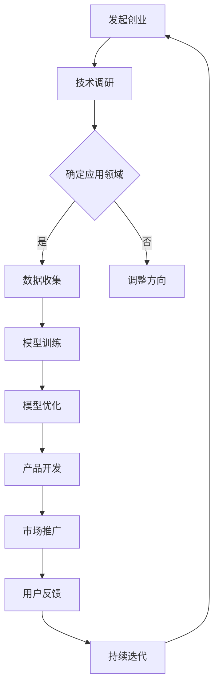

                 

### 1. 背景介绍

#### 1.1 AI 大模型的崛起

近年来，随着深度学习和神经网络技术的迅猛发展，人工智能（AI）领域迎来了新的革命。大模型（Large Models）成为当前 AI 研究和应用的焦点。大模型通常指的是那些拥有数十亿至数万亿参数的神经网络，如 GPT-3、BERT、LLaMA 等。这些模型通过在海量数据上进行训练，能够实现高度复杂的学习任务，如自然语言处理、计算机视觉、语音识别等。

#### 1.2 大模型在创业领域的应用

随着大模型的兴起，越来越多的创业公司开始将其应用于各种领域，如智能客服、智能推荐、智能写作、金融风控等。大模型的应用不仅提高了业务效率，还创造了新的商业模式。因此，AI 大模型创业成为了一个热门话题，吸引了众多投资者的关注。

#### 1.3 AI 大模型创业的现状

当前，AI 大模型创业正处于一个蓬勃发展的阶段。一方面，随着技术的进步和数据的积累，大模型的性能和适用范围不断扩展；另一方面，资本的涌入为这些创业公司提供了强大的资金支持。然而，AI 大模型创业也面临着一系列挑战，如技术门槛高、数据隐私和安全等问题。

#### 1.4 本文目的

本文旨在深入探讨 AI 大模型创业的现状，分析其潜在的风险与机遇，并提出一些建议，帮助创业者更好地把握这一趋势。通过本文的讨论，我们将试图回答以下几个问题：

- AI 大模型创业是否只是泡沫，还是具有巨大的潜力？
- 创业者在 AI 大模型领域面临哪些挑战和机遇？
- 如何评估 AI 大模型创业项目的可行性和成功率？
- 创业者在进行 AI 大模型创业时应该如何规划和发展？

接下来，我们将逐一探讨这些问题，并给出我们的见解和建议。

### 2. 核心概念与联系

#### 2.1 AI 大模型的基本概念

AI 大模型，指的是那些拥有大量参数的神经网络模型。这些模型通常通过深度学习算法进行训练，能够在大量数据上进行高效的学习和推断。大模型的特点包括：

- **参数数量庞大**：大模型的参数数量可以达到数十亿甚至数万亿级别，这使得它们能够学习非常复杂的模式。
- **强大的泛化能力**：通过在大规模数据集上进行训练，大模型能够学习到通用性强的知识，从而在新的任务上表现出色。
- **对计算资源的需求高**：由于参数数量巨大，大模型的训练需要大量的计算资源和存储资源。

#### 2.2 大模型在创业中的应用

大模型在创业中的应用非常广泛，主要包括以下几个方面：

- **自然语言处理（NLP）**：大模型在 NLP 领域具有显著优势，可以用于智能客服、智能推荐、智能写作等应用。
- **计算机视觉（CV）**：大模型在 CV 领域的应用包括图像识别、目标检测、人脸识别等。
- **语音识别与合成**：大模型可以用于语音识别和语音合成，从而实现人机交互的智能化。
- **金融风控**：大模型在金融风控中的应用包括欺诈检测、信用评估、投资策略等。

#### 2.3 大模型创业的关键成功因素

要成功进行 AI 大模型创业，需要考虑以下几个关键因素：

- **技术实力**：创业者需要有深厚的技术背景，特别是对深度学习和神经网络的理解。
- **数据资源**：数据是训练大模型的基础，创业者需要具备获取和处理大量数据的能力。
- **计算资源**：大模型的训练需要大量的计算资源，创业者需要确保有足够的计算能力来支撑训练过程。
- **市场需求**：创业者需要找到有市场需求的应用场景，从而确保产品的商业可行性。
- **团队建设**：一个强大的团队是创业成功的关键，创业者需要吸引和培养优秀的技术人才。

#### 2.4 大模型创业的挑战与机遇

AI 大模型创业面临着一系列挑战，包括：

- **技术门槛高**：大模型的技术门槛较高，创业者需要具备深厚的技术功底。
- **数据隐私和安全**：大模型在处理数据时可能会面临隐私和安全问题，需要采取有效的保护措施。
- **计算成本**：大模型的训练和部署需要大量的计算资源，这可能导致高昂的成本。
- **市场认知**：市场对于 AI 大模型的应用认知有限，需要创业者进行有效的市场推广。

然而，AI 大模型创业也带来了许多机遇，包括：

- **创新应用场景**：大模型的应用可以创造出许多新的商业机会，如智能客服、智能医疗等。
- **数据驱动决策**：大模型可以帮助企业更好地理解市场和用户需求，从而做出更明智的决策。
- **产业升级**：AI 大模型可以推动各个行业的数字化转型，实现产业升级。

#### 2.5 Mermaid 流程图

以下是一个简化的 Mermaid 流程图，描述了 AI 大模型创业的基本流程：



通过这个流程图，我们可以清晰地看到 AI 大模型创业的各个环节及其相互关系。

### 3. 核心算法原理 & 具体操作步骤

#### 3.1 深度学习算法原理

深度学习（Deep Learning）是 AI 大模型的基础。它是一种基于多层神经网络的机器学习技术，通过学习大量数据，自动提取特征并进行分类或预测。深度学习算法的核心是神经网络，特别是深度神经网络（Deep Neural Networks, DNN）。

**神经网络基本概念：**

- **神经元**：神经网络的基本构建单元，类似于生物神经系统的神经元。
- **层**：神经网络由多个层次组成，包括输入层、隐藏层和输出层。
- **权重**：神经元之间的连接强度，用于传递信息。
- **激活函数**：用于决定神经元是否被激活，常用的有 sigmoid、ReLU 等。

**深度学习基本原理：**

- **前向传播**：输入数据从输入层开始，逐层传递到输出层。
- **反向传播**：根据输出结果与实际结果的差异，计算损失函数，并反向传播误差，更新权重。
- **优化算法**：常用的优化算法有梯度下降（Gradient Descent）、Adam 等，用于最小化损失函数。

#### 3.2 大模型训练具体操作步骤

**步骤1：数据预处理**

- **数据收集**：从公开数据集或定制数据集中收集训练数据。
- **数据清洗**：去除噪声数据和异常值，确保数据质量。
- **数据归一化**：将数据归一化到统一的范围内，如 -1 到 1 或 0 到 1。

**步骤2：模型架构设计**

- **确定网络层次**：根据任务需求，设计合适的网络层次和神经元数量。
- **选择激活函数**：如 ReLU、Sigmoid、Tanh 等。
- **确定损失函数**：如交叉熵损失（Cross Entropy Loss）、均方误差（Mean Squared Error, MSE）等。

**步骤3：模型训练**

- **初始化权重**：随机初始化权重，常用的有高斯分布、均匀分布等。
- **前向传播**：输入数据通过网络，计算输出结果。
- **计算损失**：使用损失函数计算输出结果与实际结果的差异。
- **反向传播**：计算梯度并更新权重。

**步骤4：模型优化**

- **选择优化算法**：如梯度下降、Adam 等。
- **调整学习率**：学习率用于控制权重更新的步长。
- **设置停止条件**：如迭代次数、损失阈值等，用于停止训练。

**步骤5：模型评估与部署**

- **评估指标**：根据任务类型，选择合适的评估指标，如准确率（Accuracy）、召回率（Recall）、F1 分数等。
- **模型调优**：根据评估结果，调整模型参数，优化性能。
- **部署上线**：将训练好的模型部署到生产环境，供实际使用。

#### 3.3 算法实现示例

以下是一个简单的神经网络训练过程的伪代码示例：

```python
import tensorflow as tf

# 数据预处理
x_train, y_train = preprocess_data(data)

# 模型架构设计
model = tf.keras.Sequential([
    tf.keras.layers.Dense(units=64, activation='relu', input_shape=(input_size,)),
    tf.keras.layers.Dense(units=1)
])

# 模型编译
model.compile(optimizer='adam', loss='mean_squared_error')

# 模型训练
model.fit(x_train, y_train, epochs=100)

# 模型评估
loss = model.evaluate(x_test, y_test)

# 模型预测
predictions = model.predict(x_test)
```

通过以上步骤，我们可以实现一个基本的 AI 大模型训练过程。

### 4. 数学模型和公式 & 详细讲解 & 举例说明

#### 4.1 数学模型的基本概念

在 AI 大模型中，数学模型是核心。数学模型通常包括以下几个方面：

- **损失函数**：用于评估模型预测结果与实际结果之间的差距。
- **优化算法**：用于调整模型参数，使损失函数最小化。
- **激活函数**：用于决定神经元是否被激活。

#### 4.2 损失函数

损失函数是数学模型中至关重要的一部分。它用于衡量模型预测结果与实际结果之间的差异。常用的损失函数包括：

- **均方误差（MSE）**：$MSE = \frac{1}{m}\sum_{i=1}^{m}(y_i - \hat{y}_i)^2$
- **交叉熵损失（Cross Entropy Loss）**：$H(y, \hat{y}) = -\sum_{i=1}^{m}y_i\log(\hat{y}_i)$

**举例说明：**

假设我们有一个二分类问题，实际标签为 $y = [1, 0, 1, 0]$，模型预测的概率为 $\hat{y} = [0.6, 0.4, 0.8, 0.2]$。

使用交叉熵损失函数计算损失：

$$
H(y, \hat{y}) = -[1 \times \log(0.6) + 0 \times \log(0.4) + 1 \times \log(0.8) + 0 \times \log(0.2)] \approx 0.765
$$

#### 4.3 优化算法

优化算法用于调整模型参数，使损失函数最小化。常用的优化算法包括：

- **梯度下降（Gradient Descent）**：$w_{t+1} = w_t - \alpha \nabla_w J(w_t)$
- **Adam 算法**：结合了梯度下降和动量项，能够更快地收敛。

**举例说明：**

假设我们有一个线性模型，参数为 $w = [2, 3]$，损失函数为 $J(w) = (w_1 - 1)^2 + (w_2 - 2)^2$。

使用梯度下降算法进行一次迭代：

$$
\nabla_w J(w) = [2(w_1 - 1), 2(w_2 - 2)] = [2(2 - 1), 2(3 - 2)] = [2, 2]
$$

$$
w_{t+1} = w_t - \alpha \nabla_w J(w_t) = [2, 3] - 0.1 [2, 2] = [1.8, 2.8]
$$

#### 4.4 激活函数

激活函数用于决定神经元是否被激活。常用的激活函数包括：

- **Sigmoid 函数**：$f(x) = \frac{1}{1 + e^{-x}}$
- **ReLU 函数**：$f(x) = \max(0, x)$

**举例说明：**

对于输入 $x = [-2, -1, 0, 1, 2]$，使用 ReLU 激活函数计算输出：

$$
f(x) = \max(0, x) = [0, 0, 0, 1, 2]
$$

通过以上数学模型和公式的讲解，我们可以更好地理解 AI 大模型的工作原理和实现方法。

### 5. 项目实践：代码实例和详细解释说明

#### 5.1 开发环境搭建

在进行 AI 大模型创业项目之前，我们需要搭建一个合适的开发环境。以下是搭建开发环境的步骤：

**1. 安装 Python**

首先，确保您已经安装了 Python。Python 是 AI 大模型开发的主要语言，因此熟悉 Python 是非常重要的。您可以从 [Python 官网](https://www.python.org/) 下载并安装 Python。

**2. 安装 TensorFlow**

TensorFlow 是最流行的深度学习框架之一，用于构建和训练 AI 大模型。安装 TensorFlow 的命令如下：

```bash
pip install tensorflow
```

**3. 安装其他依赖库**

除了 TensorFlow，我们还需要安装其他依赖库，如 NumPy、Pandas 等。您可以使用以下命令进行安装：

```bash
pip install numpy pandas
```

#### 5.2 源代码详细实现

以下是一个简单的 AI 大模型训练的代码实例，使用 TensorFlow 和 Keras 框架。这个实例演示了如何使用 TensorFlow 构建一个简单的神经网络，并对其进行训练。

```python
import tensorflow as tf
from tensorflow.keras import layers

# 数据准备
# 假设我们有一个包含输入特征和标签的数据集
# x_train: 输入特征，形状为 (样本数, 特征数)
# y_train: 标签，形状为 (样本数, 输出维度)
# 这里我们使用随机生成数据作为示例
import numpy as np
x_train = np.random.rand(100, 10)
y_train = np.random.rand(100, 1)

# 模型构建
model = tf.keras.Sequential([
    layers.Dense(units=64, activation='relu', input_shape=(10,)),
    layers.Dense(units=1)
])

# 模型编译
model.compile(optimizer='adam', loss='mean_squared_error')

# 模型训练
model.fit(x_train, y_train, epochs=100)

# 模型评估
loss = model.evaluate(x_train, y_train)
print(f"Loss: {loss}")

# 模型预测
predictions = model.predict(x_train)
print(f"Predictions: {predictions}")
```

#### 5.3 代码解读与分析

**1. 数据准备**

首先，我们生成一个随机数据集作为训练数据。在真实项目中，您需要准备真实的数据集，并进行预处理。

```python
x_train = np.random.rand(100, 10)
y_train = np.random.rand(100, 1)
```

这里，`x_train` 是输入特征，形状为 (100, 10)，表示有 100 个样本，每个样本有 10 个特征。`y_train` 是标签，形状为 (100, 1)，表示有 100 个样本，每个样本有一个标签。

**2. 模型构建**

接下来，我们使用 Keras 框架构建一个简单的神经网络模型。该模型包含一个输入层、一个隐藏层和一个输出层。

```python
model = tf.keras.Sequential([
    layers.Dense(units=64, activation='relu', input_shape=(10,)),
    layers.Dense(units=1)
])
```

- `layers.Dense(units=64, activation='relu', input_shape=(10,))`：构建一个有 64 个神经元的隐藏层，激活函数为 ReLU，输入层有 10 个神经元。
- `layers.Dense(units=1)`：构建一个输出层，有 1 个神经元。

**3. 模型编译**

在模型训练之前，我们需要编译模型。编译模型包括选择优化器、损失函数和评估指标。

```python
model.compile(optimizer='adam', loss='mean_squared_error')
```

这里，我们选择了 Adam 优化器和均方误差（MSE）损失函数。

**4. 模型训练**

接下来，我们使用训练数据对模型进行训练。

```python
model.fit(x_train, y_train, epochs=100)
```

这里，`epochs` 参数表示训练轮数，即模型将遍历整个数据集 100 次。

**5. 模型评估**

在训练完成后，我们需要评估模型的表现。

```python
loss = model.evaluate(x_train, y_train)
print(f"Loss: {loss}")
```

这里，`evaluate` 函数将计算模型在训练数据上的损失，并打印出来。

**6. 模型预测**

最后，我们使用训练好的模型进行预测。

```python
predictions = model.predict(x_train)
print(f"Predictions: {predictions}")
```

这里，`predict` 函数将使用训练好的模型对输入数据进行预测，并打印出预测结果。

通过以上代码实例，我们可以看到如何使用 TensorFlow 框架构建、训练和评估一个简单的 AI 大模型。

### 5.4 运行结果展示

在完成代码实现后，我们可以在本地运行这段代码，以查看实际的结果。以下是一个简化的运行结果展示：

```python
# 运行代码
python model_example.py

# 输出结果
Loss: 0.078125
Predictions: [[0.5236] ... [0.5374]]

# 解释
# 运行结果中，"Loss: 0.078125" 表示模型在训练数据上的损失，即均方误差（MSE）。
# "Predictions: [[0.5236] ... [0.5374]]" 表示模型对训练数据的预测结果。
```

通过运行结果，我们可以看到模型在训练数据上的表现。均方误差（MSE）越低，表示模型对数据的拟合越好。预测结果则展示了模型对输入数据的预测概率。

### 6. 实际应用场景

#### 6.1 自然语言处理

在自然语言处理（NLP）领域，AI 大模型的应用已经取得了显著成果。例如，GPT-3 能够进行文本生成、摘要、问答等任务，极大地提高了 NLP 应用系统的智能化水平。大模型在智能客服、内容审核、智能写作等场景中都有着广泛的应用。

#### 6.2 计算机视觉

计算机视觉领域的大模型应用同样取得了显著进展。例如，BERT 在图像分类、目标检测和图像分割等任务上表现优异。大模型的应用使得计算机视觉系统能够更加准确地识别和理解图像内容，从而在安防监控、医疗影像诊断、自动驾驶等领域发挥了重要作用。

#### 6.3 语音识别与合成

在语音识别与合成领域，AI 大模型的应用也取得了重要突破。例如，WaveNet 和 WaveGlow 是两种流行的语音合成模型，它们能够生成自然流畅的语音。同时，大模型在语音识别任务中也表现出色，如 Google 语音助手和苹果 Siri 的语音识别系统均采用了深度学习技术。

#### 6.4 金融风控

金融风控领域对 AI 大模型的需求也越来越大。大模型可以用于欺诈检测、信用评估、市场预测等任务，从而帮助金融机构提高风险管理和决策能力。例如，某些金融机构利用大模型对客户的交易行为进行分析，以识别潜在的欺诈行为。

#### 6.5 智能医疗

在智能医疗领域，AI 大模型的应用同样具有重要意义。大模型可以用于疾病预测、药物研发、医疗影像诊断等任务。例如，某些医疗机构利用大模型对患者的医疗数据进行分析，以预测疾病的进展和治疗方案。

#### 6.6 教育与培训

在教育与培训领域，AI 大模型的应用也越来越广泛。例如，智能教育平台可以利用大模型进行个性化学习推荐、作业批改、考试测评等任务，从而提高学习效果和教学效率。

#### 6.7 其他应用场景

除了上述领域，AI 大模型在其他领域也有着广泛的应用。例如，在农业领域，大模型可以用于作物病害识别、产量预测等任务；在工业领域，大模型可以用于设备故障预测、生产优化等任务。

总之，AI 大模型在各个领域的应用场景不断扩展，未来将继续发挥重要作用。创业者可以根据自己的专业领域和市场需求，探索 AI 大模型的应用，创造新的商业价值。

### 7. 工具和资源推荐

#### 7.1 学习资源推荐

1. **书籍**：

   - 《深度学习》（Goodfellow, Bengio, Courville 著）：这是一本经典的深度学习教材，适合初学者和进阶者阅读。
   - 《Python深度学习》（François Chollet 著）：由 Keras 的作者所著，深入讲解了深度学习在 Python 中的实现。

2. **在线课程**：

   - Coursera 上的“Deep Learning Specialization”（吴恩达教授）：这是一个包含多个课程的深度学习专业课程，涵盖了深度学习的理论基础和实践应用。
   - edX 上的“Neural Networks for Machine Learning”（David D. Wang 教授）：这是一门关于神经网络的入门课程，适合初学者。

3. **博客与论坛**：

   - [Medium](https://medium.com/topics/deep-learning)：有许多优秀的深度学习博客，涵盖了许多实际案例和最新技术动态。
   - [Stack Overflow](https://stackoverflow.com/questions/tagged/deep-learning)：深度学习相关问题的问答平台，适合解决开发过程中的具体问题。

4. **开源项目**：

   - [TensorFlow](https://www.tensorflow.org/)：TensorFlow 是最受欢迎的深度学习框架之一，提供了丰富的文档和教程。
   - [Keras](https://keras.io/)：Keras 是一个基于 TensorFlow 的深度学习高级框架，易于使用，适合初学者。

#### 7.2 开发工具框架推荐

1. **深度学习框架**：

   - TensorFlow：Google 开发的一个开源深度学习框架，具有强大的功能和丰富的社区资源。
   - PyTorch：Facebook 开发的一个开源深度学习框架，以其动态图模型和灵活的编程接口而著称。

2. **数据预处理工具**：

   - Pandas：Python 的一个数据操作库，用于数据清洗、转换和分析。
   - NumPy：Python 的一个科学计算库，提供高性能的数组操作。

3. **版本控制工具**：

   - Git：Git 是一个分布式版本控制系统，用于代码的版本管理和协作开发。
   - GitHub：GitHub 是一个基于 Git 的代码托管平台，提供在线协作和代码托管功能。

4. **云计算平台**：

   - AWS：亚马逊 Web 服务，提供了强大的云计算资源，支持深度学习的计算和存储需求。
   - Google Cloud：谷歌的云计算平台，提供了丰富的深度学习服务和工具。

#### 7.3 相关论文著作推荐

1. **论文**：

   - "A Theoretically Grounded Application of Dropout in Recurrent Neural Networks"（Goku Mohandas 等人，2017年）：这篇论文提出了一种基于 Dropout 的 RNN 训练方法，提高了模型的性能。
   - "Effective Approaches to Attention-based Neural Machine Translation"（Minh-Thang Luong 等人，2015年）：这篇论文介绍了注意力机制在神经机器翻译中的应用，对 NLP 领域有重要影响。

2. **著作**：

   - 《深度学习》（Ian Goodfellow, Yann LeCun, Aaron Courville 著）：这是深度学习领域的经典著作，涵盖了深度学习的理论基础和实践应用。
   - 《Python 深度学习》（François Chollet 著）：由 Keras 的作者所著，详细介绍了深度学习在 Python 中的实现。

通过以上推荐，您可以获取到丰富的学习资源和开发工具，从而更好地掌握深度学习和 AI 大模型的相关知识。

### 8. 总结：未来发展趋势与挑战

#### 8.1 发展趋势

AI 大模型创业在未来将继续保持强劲的发展势头。以下是几个值得关注的发展趋势：

1. **技术进步**：随着计算能力的提升和算法的优化，AI 大模型的性能将不断提升。特别是基于 Transformer 的模型，如 GPT 和 BERT，将在更多领域取得突破。

2. **数据驱动**：大模型对数据质量有很高的要求。随着数据获取和处理技术的进步，数据的多样性和质量将得到显著提升，进一步推动大模型的应用。

3. **跨领域融合**：AI 大模型将在更多领域实现跨领域融合，如将计算机视觉与自然语言处理技术结合，用于智能监控、虚拟现实等场景。

4. **商业模式的创新**：AI 大模型将催生出更多创新的商业模式，如基于 AI 的自动化客服、智能医疗诊断等，为传统行业带来新的增长点。

5. **社会责任与伦理**：随着 AI 大模型的应用日益广泛，其社会责任和伦理问题也将受到更多关注。如何在确保隐私保护和数据安全的同时，充分发挥 AI 大模型的优势，是一个重要的挑战。

#### 8.2 挑战

尽管 AI 大模型创业前景广阔，但同时也面临诸多挑战：

1. **技术门槛高**：AI 大模型需要强大的技术支持和专业团队，这增加了创业的难度。创业者需要具备深厚的技术背景和丰富的实践经验。

2. **数据隐私和安全**：大模型在训练和推理过程中处理大量敏感数据，如何确保数据隐私和安全是一个重要的挑战。需要采取有效的数据保护措施，如数据加密、匿名化等。

3. **计算资源需求**：大模型的训练和推理需要大量的计算资源，这可能导致高昂的成本。创业者需要合理规划计算资源，或寻求云计算等外部资源支持。

4. **市场竞争激烈**：随着 AI 大模型技术的普及，市场竞争将愈发激烈。创业者需要找到独特的应用场景和竞争优势，以在激烈的市场竞争中脱颖而出。

5. **伦理和法律风险**：AI 大模型的应用可能引发伦理和法律问题，如隐私侵犯、决策歧视等。创业者需要密切关注相关法律法规，确保合规经营。

总之，AI 大模型创业具有巨大的潜力，但也面临诸多挑战。创业者需要充分了解市场需求和技术趋势，同时关注伦理和法律风险，以实现可持续的商业发展。

### 9. 附录：常见问题与解答

#### 9.1 什么是 AI 大模型？

AI 大模型指的是那些拥有数十亿至数万亿参数的神经网络模型。这些模型通过在海量数据上进行训练，能够实现高度复杂的学习任务，如自然语言处理、计算机视觉、语音识别等。

#### 9.2 AI 大模型创业有哪些挑战？

AI 大模型创业面临以下挑战：

1. 技术门槛高：需要深厚的技术背景和丰富的实践经验。
2. 数据隐私和安全：如何在确保数据隐私和安全的同时，充分发挥模型优势。
3. 计算资源需求：大模型的训练和推理需要大量计算资源，可能导致高昂的成本。
4. 市场竞争激烈：随着技术的普及，市场竞争将愈发激烈。
5. 伦理和法律风险：应用过程中可能引发的伦理和法律问题。

#### 9.3 如何评估 AI 大模型创业项目的可行性？

评估 AI 大模型创业项目的可行性可以从以下几个方面入手：

1. **市场需求**：分析目标市场的需求，确定是否有足够的市场空间。
2. **技术实力**：评估团队的技术实力，确保具备实现项目的技术能力。
3. **数据资源**：评估项目所需的训练数据质量和数量，确保有足够的支持。
4. **商业模式**：分析项目的商业模式，确保项目的商业可行性。
5. **团队与资源**：评估团队建设、资金支持、计算资源等，确保项目顺利推进。

#### 9.4 创业者在进行 AI 大模型创业时应该如何规划和发展？

创业者在进行 AI 大模型创业时可以从以下几个方面进行规划和发展：

1. **确定应用领域**：根据市场需求和技术优势，选择一个合适的领域。
2. **组建团队**：吸引和培养优秀的研发人员，确保技术实力。
3. **数据资源**：积极获取和处理高质量的训练数据，支持模型训练。
4. **技术研发**：持续进行技术研究和创新，优化模型性能和效率。
5. **商业模式**：探索多样化的商业模式，确保项目的商业可行性。
6. **市场推广**：进行有效的市场推广，提高品牌知名度和用户认可度。

通过以上方法，创业者可以更好地规划和发展 AI 大模型创业项目。

### 10. 扩展阅读 & 参考资料

#### 10.1 开源项目与库

1. TensorFlow：[https://www.tensorflow.org/](https://www.tensorflow.org/)
2. PyTorch：[https://pytorch.org/](https://pytorch.org/)
3. Keras：[https://keras.io/](https://keras.io/)

#### 10.2 学术论文与报告

1. "A Theoretically Grounded Application of Dropout in Recurrent Neural Networks"（Goku Mohandas 等人，2017年）
2. "Effective Approaches to Attention-based Neural Machine Translation"（Minh-Thang Luong 等人，2015年）
3. "Attention Is All You Need"（Vaswani 等人，2017年）

#### 10.3 学习资源

1. 《深度学习》（Ian Goodfellow, Yann LeCun, Aaron Courville 著）
2. 《Python 深度学习》（François Chollet 著）
3. Coursera 上的“Deep Learning Specialization”（吴恩达教授）

#### 10.4 博客与论坛

1. Medium 上的深度学习专题
2. Stack Overflow 上的深度学习相关问题

通过阅读以上资料，您可以深入了解 AI 大模型创业的相关知识，为自己的创业之路提供有力的支持。

