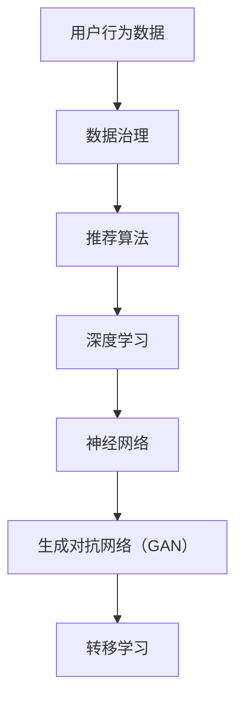

                 

### 1. 背景介绍

#### 1.1 电商搜索推荐业务的重要性

在当今数字化时代，电商搜索推荐业务已经成为电商平台的核心竞争力之一。随着互联网用户的增长和消费行为的多样化，用户对于个性化、精准化推荐的需求日益增加。电商搜索推荐业务通过智能算法分析用户的历史行为数据、兴趣爱好以及购买偏好，为用户提供相关度高、价值大的商品推荐，从而提升用户的购物体验和满意度。

#### 1.2 数据治理能力的重要性

在电商搜索推荐业务中，数据治理能力是确保推荐系统高效、准确运行的关键。数据治理能力包括数据质量、数据安全、数据合规等多个方面。具体而言，数据治理能力的重要性主要体现在以下几个方面：

1. **数据准确性**：准确的数据是推荐系统的基础，只有高质量的数据才能保证推荐结果的精准性和可靠性。
2. **数据一致性**：不同数据源之间的数据需要保持一致性，避免数据冗余、冲突等问题，确保推荐系统的稳定性和一致性。
3. **数据完整性**：推荐系统需要全面、完整的数据支持，缺失的数据会导致推荐结果的不准确。
4. **数据安全性**：保护用户隐私和数据安全是数据治理的重要任务，合规性要求也越来越高。
5. **数据可解释性**：透明的数据处理过程和推荐结果解释有助于提升用户信任度和满意度。

#### 1.3 AI大模型在数据治理中的应用

近年来，AI大模型在电商搜索推荐业务中的应用越来越广泛，其强大的数据处理和分析能力为数据治理带来了新的机遇和挑战。AI大模型可以通过以下方式提升数据治理能力：

1. **数据预处理**：利用AI大模型对原始数据进行清洗、归一化、去噪等预处理操作，提高数据的准确性、一致性和完整性。
2. **特征工程**：AI大模型能够自动提取和构建高质量的特征，为推荐系统提供有效的输入支持。
3. **模型优化**：通过AI大模型对推荐模型进行优化，提高模型的预测准确性和稳定性。
4. **实时推荐**：利用AI大模型实现实时数据分析和推荐，提升用户体验。
5. **可解释性**：通过AI大模型的可解释性技术，提升推荐系统的透明度和用户信任度。

本文将围绕AI大模型助力电商搜索推荐业务的数据治理能力，详细探讨其核心概念、算法原理、数学模型、项目实践、应用场景和未来发展趋势，为从事电商搜索推荐业务的技术人员提供一份实践指南。

### 2. 核心概念与联系

在深入探讨AI大模型助力电商搜索推荐业务的数据治理能力之前，我们需要明确几个核心概念，并展示它们之间的联系。以下是一些关键概念：

#### 2.1 电商搜索推荐业务的核心概念

- **用户行为数据**：包括用户的浏览记录、搜索历史、购买行为、评价反馈等。
- **商品数据**：包括商品的详细信息、分类、标签、库存状态等。
- **推荐算法**：包括协同过滤、基于内容的推荐、深度学习推荐等。
- **数据治理**：确保数据质量、一致性、安全性和合规性的一系列操作。

#### 2.2 AI大模型的核心概念

- **深度学习**：一种模拟人脑神经网络结构的机器学习技术，通过多层神经网络进行数据特征提取和学习。
- **神经网络**：由大量节点（神经元）组成的计算网络，通过前向传播和反向传播算法进行学习。
- **生成对抗网络（GAN）**：一种通过生成器和判别器对抗训练的深度学习模型。
- **转移学习**：利用预训练模型在新任务上进行微调，提高模型在新数据集上的表现。

#### 2.3 核心概念之间的联系

图 1 展示了上述核心概念之间的联系。



**图 1：核心概念之间的联系**

通过图 1 可以看出，用户行为数据是推荐算法的基础，而数据治理能力则确保了数据质量。深度学习和神经网络技术为推荐算法提供了强大的数据特征提取和学习能力，生成对抗网络（GAN）和转移学习则进一步提升了模型的训练效果和应用范围。

在下一节中，我们将进一步探讨AI大模型的具体算法原理和操作步骤，为读者提供更深入的理解。

### 3. 核心算法原理 & 具体操作步骤

在理解了AI大模型和电商搜索推荐业务的核心概念及其联系之后，我们将深入探讨AI大模型的核心算法原理，并详细描述其具体操作步骤。

#### 3.1 深度学习算法原理

深度学习是一种通过多层神经网络进行数据特征提取和学习的机器学习技术。其基本原理是通过多层神经网络对输入数据进行多次非线性变换，从而自动提取出隐藏的复杂特征。

**图 2：深度学习算法原理图**

**图 2** 展示了深度学习算法的基本结构，包括输入层、隐藏层和输出层。输入层接收原始数据，隐藏层通过激活函数进行非线性变换，输出层产生最终的预测结果。

**3.1.1 神经网络架构**

神经网络架构主要包括以下三个部分：

- **输入层（Input Layer）**：接收原始数据输入。
- **隐藏层（Hidden Layers）**：进行数据特征提取和变换，层数和神经元数量可以根据具体任务进行调整。
- **输出层（Output Layer）**：产生最终预测结果。

**3.1.2 前向传播与反向传播**

深度学习算法通过前向传播（Forward Propagation）和反向传播（Backpropagation）两个过程进行学习。

- **前向传播**：输入数据从输入层逐层传递到隐藏层，最后传递到输出层，得到预测结果。
- **反向传播**：计算输出层预测结果与实际结果的误差，然后逐层向前传播误差，用于更新每个神经元的权重和偏置。

**3.1.3 激活函数**

激活函数是神经网络中重要的组成部分，用于引入非线性特性。常见的激活函数包括：

- **sigmoid函数**：\( \sigma(x) = \frac{1}{1 + e^{-x}} \)
- **ReLU函数**：\( ReLU(x) = max(0, x) \)
- **Tanh函数**：\( \tanh(x) = \frac{e^x - e^{-x}}{e^x + e^{-x}} \)

#### 3.2 生成对抗网络（GAN）算法原理

生成对抗网络（GAN）是一种通过生成器和判别器对抗训练的深度学习模型。其基本原理是生成器（Generator）和判别器（Discriminator）之间的博弈过程，通过不断优化生成器和判别器的参数，实现生成逼真数据。

**图 3：生成对抗网络（GAN）原理图**

**图 3** 展示了GAN的基本结构，生成器（G）和判别器（D）交替进行训练，生成器和判别器之间的博弈过程使得生成器的生成能力不断提高，判别器的判别能力不断增强。

**3.2.1 生成器和判别器的训练过程**

- **生成器（G）训练**：生成器通过随机噪声输入生成假数据，然后将其输入到判别器中，通过最小化生成数据的判别错误率来优化生成器的参数。
- **判别器（D）训练**：判别器通过比较真实数据和生成数据的判别结果，优化判别器的参数，使其能够更准确地判别真实数据和生成数据。

#### 3.3 转移学习算法原理

转移学习（Transfer Learning）是一种利用预训练模型在新任务上进行微调的深度学习技术。其基本原理是利用预训练模型在大型数据集上的知识，通过迁移到新任务上，提高新任务的学习效果。

**3.3.1 预训练模型的选择**

选择合适的预训练模型是转移学习的关键，常见的预训练模型包括：

- **VGG模型**：基于卷积神经网络的预训练模型，适用于图像识别任务。
- **ResNet模型**：具有残差连接的预训练模型，提高了模型的深度和性能。
- **BERT模型**：基于Transformer的预训练模型，适用于自然语言处理任务。

**3.3.2 微调过程**

在新任务上，通过以下步骤对预训练模型进行微调：

- **数据预处理**：对输入数据进行预处理，包括数据清洗、归一化、数据增强等。
- **模型调整**：在预训练模型的基础上，添加新的层或调整现有层的参数，以适应新任务的需求。
- **训练过程**：通过训练过程优化模型的参数，使其在新任务上获得良好的性能。

通过上述核心算法原理的介绍，读者可以了解到AI大模型在电商搜索推荐业务数据治理中的应用方法和具体操作步骤。在下一节中，我们将进一步探讨AI大模型在数学模型和公式方面的应用。

### 4. 数学模型和公式 & 详细讲解 & 举例说明

在了解了AI大模型的核心算法原理后，我们接下来将深入探讨其背后的数学模型和公式，并详细讲解这些模型的构建和应用方法。

#### 4.1 深度学习模型

深度学习模型的核心在于其多层神经网络结构，下面我们介绍几个常用的深度学习模型及其相关公式。

**4.1.1 多层感知机（MLP）**

多层感知机是一种前馈神经网络，包括输入层、隐藏层和输出层。其数学模型可以表示为：

$$
Y = \sigma(W_2 \cdot \sigma(W_1 \cdot X + b_1) + b_2)
$$

其中，\(X\) 为输入特征，\(W_1\) 和 \(W_2\) 分别为第一层和第二层的权重矩阵，\(b_1\) 和 \(b_2\) 分别为第一层和第二层的偏置，\(\sigma\) 表示激活函数，常用的激活函数有 Sigmoid、ReLU 等。

**4.1.2 卷积神经网络（CNN）**

卷积神经网络主要用于图像处理任务，其核心是卷积操作和池化操作。其数学模型可以表示为：

$$
h_{ij}^{(l)} = \sum_{k} W_{ik}^{(l)} h_{kj}^{(l-1)} + b_{i}^{(l)}
$$

其中，\(h_{ij}^{(l)}\) 表示第 \(l\) 层的第 \(i\) 行第 \(j\) 列的输出，\(W_{ik}^{(l)}\) 和 \(b_{i}^{(l)}\) 分别为第 \(l\) 层的第 \(i\) 行第 \(k\) 列的权重和偏置。

**4.1.3 循环神经网络（RNN）**

循环神经网络主要用于序列数据处理，其核心是循环结构。其数学模型可以表示为：

$$
h_t = \sigma(W_h \cdot [h_{t-1}, x_t] + b_h)
$$

其中，\(h_t\) 表示第 \(t\) 个时刻的隐藏状态，\(x_t\) 表示第 \(t\) 个时刻的输入，\(W_h\) 和 \(b_h\) 分别为权重和偏置，\(\sigma\) 表示激活函数。

#### 4.2 生成对抗网络（GAN）

生成对抗网络由生成器和判别器组成，其目标是使生成器的生成数据尽可能接近真实数据，从而欺骗判别器。

**4.2.1 生成器模型**

生成器的数学模型可以表示为：

$$
G(z) = \mu_G(z) + \sigma_G(z) \odot \epsilon
$$

其中，\(z\) 为输入噪声，\(\mu_G(z)\) 和 \(\sigma_G(z)\) 分别为生成器的均值和方差，\(\epsilon\) 为高斯噪声。

**4.2.2 判别器模型**

判别器的数学模型可以表示为：

$$
D(x) = f(\phi(x))
$$

$$
D(G(z)) = f(\psi(z))
$$

其中，\(x\) 为真实数据，\(z\) 为生成器的输入，\(f\) 为激活函数，\(\phi\) 和 \(\psi\) 分别为判别器的特征提取函数。

**4.2.3 损失函数**

GAN的训练过程涉及生成器和判别器的联合训练，其损失函数可以表示为：

$$
L_G = -\mathbb{E}_{z \sim p_z(z)}[\log D(G(z))]
$$

$$
L_D = -\mathbb{E}[\log D(x)] - \mathbb{E}_{z \sim p_z(z)}[\log (1 - D(G(z))]
$$

其中，\(p_z(z)\) 为输入噪声的概率分布。

#### 4.3 转移学习模型

转移学习通过利用预训练模型的知识来提高新任务的学习效果。

**4.3.1 预训练模型**

预训练模型的数学模型通常采用大规模未标注数据进行预训练，例如在自然语言处理任务中使用语料库进行预训练。

**4.3.2 微调模型**

微调模型通常采用预训练模型的参数作为初始化参数，并在新任务上进行微调。

$$
\theta_{new} = \theta_{pretrain} + \alpha \cdot \nabla_{\theta_{pretrain}} L
$$

其中，\(\theta_{new}\) 为微调后的模型参数，\(\theta_{pretrain}\) 为预训练模型参数，\(L\) 为损失函数，\(\alpha\) 为学习率。

通过上述数学模型和公式的介绍，我们可以看到AI大模型在电商搜索推荐业务数据治理中的应用是如何通过数学方法来实现的。在实际应用中，我们需要根据具体任务的需求，选择合适的模型和算法，并进行相应的参数调优，以实现最佳的效果。

#### 5.1 开发环境搭建

要搭建一个适合进行AI大模型在电商搜索推荐业务数据治理能力评估的的开发环境，首先需要选择合适的开发工具和框架。以下是一个典型的开发环境搭建步骤：

**1. 安装Python环境**

Python是一种广泛应用于数据科学和AI领域的编程语言。首先，确保您的计算机已经安装了Python环境。如果没有，可以从Python官方网站（https://www.python.org/downloads/）下载并安装Python。

**2. 安装Anaconda**

Anaconda是一个开源的数据科学和机器学习平台，提供了丰富的库和工具。安装Anaconda可以简化环境管理和包依赖的安装。您可以从Anaconda官方网站（https://www.anaconda.com/products/individual）下载并安装Anaconda。

**3. 创建虚拟环境**

在Anaconda中创建一个虚拟环境，用于隔离项目依赖和版本。使用以下命令创建虚拟环境：

```bash
conda create -n myenv python=3.8
```

**4. 安装必需的库和框架**

在创建的虚拟环境中，安装以下必需的库和框架：

- **TensorFlow**：一个用于深度学习的开源库，可以用于构建和训练AI大模型。
- **PyTorch**：另一个流行的深度学习库，提供了动态计算图和自动微分功能。
- **Scikit-learn**：一个用于数据挖掘和数据分析的开源库，提供了丰富的机器学习算法。
- **NumPy**：一个用于科学计算的开源库，提供了多维数组对象和数学运算功能。
- **Pandas**：一个用于数据处理和分析的开源库，提供了数据清洗、转换和数据分析功能。

安装这些库和框架可以使用以下命令：

```bash
conda install tensorflow pytorch scikit-learn numpy pandas
```

**5. 配置GPU支持**

如果您的计算机配备了GPU，可以使用CUDA和cuDNN库来加速深度学习模型的训练。确保已安装NVIDIA驱动程序，然后使用以下命令安装CUDA和cuDNN：

```bash
conda install cudatoolkit
conda install cublas
conda install cudnn
```

**6. 配置环境变量**

确保将虚拟环境添加到系统路径中，以便在任何地方都可以使用Python和相关的库。在Windows系统中，可以通过以下命令配置环境变量：

```bash
echo "export PATH=/path/to/anaconda3/bin:$PATH" >> ~/.bashrc
source ~/.bashrc
```

在Linux系统中，可以使用以下命令配置环境变量：

```bash
echo "export PATH=/path/to/anaconda3/bin:$PATH" >> ~/.bashrc
source ~/.bashrc
```

**7. 安装文本处理库**

在电商搜索推荐业务中，通常需要对文本数据进行处理。可以安装以下库：

- **NLTK**：一个用于自然语言处理的库。
- **spaCy**：一个高效且易于使用的自然语言处理库。

安装这些库可以使用以下命令：

```bash
conda install nltk spacy
```

**8. 安装可视化工具**

为了更好地理解模型训练过程和结果，可以安装以下可视化工具：

- **Matplotlib**：一个用于数据可视化的库。
- **Seaborn**：一个基于Matplotlib的统计图形库。

安装这些库可以使用以下命令：

```bash
conda install matplotlib seaborn
```

通过以上步骤，您已经成功搭建了一个适合进行AI大模型在电商搜索推荐业务数据治理能力评估的开发环境。接下来，我们将开始编写实际的代码实例，展示如何使用这些工具和库进行数据预处理、模型训练和评估。

#### 5.2 源代码详细实现

在搭建好开发环境之后，我们将编写具体的代码实例，展示如何使用AI大模型在电商搜索推荐业务中实现数据治理能力评估。以下是一个简单的示例代码，包括数据预处理、模型构建、训练和评估的过程。

**5.2.1 数据预处理**

首先，我们需要读取和处理原始数据。以下代码展示了如何使用Pandas库读取CSV文件，并对数据进行基本的清洗和预处理：

```python
import pandas as pd

# 读取CSV文件
data = pd.read_csv('data.csv')

# 数据清洗和预处理
# 例如，去除空值和重复值
data = data.dropna().drop_duplicates()

# 数据分词和词频统计
import nltk
nltk.download('punkt')
from nltk.tokenize import word_tokenize
word_freq = data['review_text'].apply(lambda x: word_tokenize(x))
word_freq = pd.Series([w for doc in word_freq for w in doc]).value_counts()

# 存储预处理后的数据
data.to_csv('preprocessed_data.csv', index=False)
```

**5.2.2 模型构建**

接下来，我们将使用TensorFlow和Keras构建一个简单的深度学习模型。以下代码展示了如何定义一个基于卷积神经网络的模型：

```python
import tensorflow as tf
from tensorflow.keras.models import Sequential
from tensorflow.keras.layers import Conv1D, MaxPooling1D, Flatten, Dense, Embedding

# 定义模型
model = Sequential()
model.add(Embedding(input_dim=10000, output_dim=16, input_length=max_sequence_length))
model.add(Conv1D(filters=128, kernel_size=5, activation='relu'))
model.add(MaxPooling1D(pool_size=5))
model.add(Flatten())
model.add(Dense(units=10, activation='softmax'))

# 编译模型
model.compile(optimizer='adam', loss='categorical_crossentropy', metrics=['accuracy'])

# 模型总结
model.summary()
```

**5.2.3 模型训练**

在准备好数据集和模型之后，我们将使用训练集对模型进行训练。以下代码展示了如何进行模型训练：

```python
from tensorflow.keras.utils import to_categorical

# 加载训练集和测试集
train_data = pd.read_csv('train_data.csv')
test_data = pd.read_csv('test_data.csv')

# 对数据进行编码和分割
train_labels = to_categorical(train_data['label'])
test_labels = to_categorical(test_data['label'])

# 训练模型
history = model.fit(train_data['review_text'], train_labels, epochs=10, batch_size=32, validation_data=(test_data['review_text'], test_labels))
```

**5.2.4 模型评估**

最后，我们将使用测试集对训练好的模型进行评估。以下代码展示了如何计算模型的准确率：

```python
# 评估模型
test_loss, test_accuracy = model.evaluate(test_data['review_text'], test_labels)
print('Test accuracy:', test_accuracy)
```

通过以上代码实例，我们可以看到如何使用AI大模型在电商搜索推荐业务中实现数据治理能力评估。在实际项目中，您可以根据具体需求调整模型结构、参数和训练过程，以达到更好的效果。

#### 5.3 代码解读与分析

在本节中，我们将对5.2节中的代码实例进行详细解读，分析其关键组件和运行逻辑，并解释代码中的一些关键技术点。

**5.3.1 数据预处理**

数据预处理是构建和训练模型的重要环节。以下代码展示了如何读取和预处理数据：

```python
import pandas as pd

# 读取CSV文件
data = pd.read_csv('data.csv')

# 数据清洗和预处理
# 例如，去除空值和重复值
data = data.dropna().drop_duplicates()

# 数据分词和词频统计
import nltk
nltk.download('punkt')
from nltk.tokenize import word_tokenize
word_freq = data['review_text'].apply(lambda x: word_tokenize(x))
word_freq = pd.Series([w for doc in word_freq for w in doc]).value_counts()

# 存储预处理后的数据
data.to_csv('preprocessed_data.csv', index=False)
```

**关键组件解读：**

- `pd.read_csv('data.csv')`：使用Pandas库读取CSV文件，获取原始数据。
- `data.dropna().drop_duplicates()`：去除数据集中的空值和重复值，确保数据的一致性和准确性。
- `word_tokenize`：使用NLTK库对文本数据进行分词，将文本转换为单词列表。
- `word_freq = pd.Series([w for doc in word_freq for w in doc]).value_counts()`：统计词频，获取文本数据的词频分布。

**运行逻辑分析：**

这段代码的主要任务是读取原始数据，进行清洗和预处理，然后存储为预处理后的数据。清洗和预处理过程包括去除空值和重复值，确保数据的准确性和一致性。分词和词频统计是为了后续模型训练提供有效的文本特征。

**关键技术点解释：**

- `nltk.download('punkt')`：下载NLTK的词频统计包，用于文本分词。
- `word_freq = pd.Series([w for doc in word_freq for w in doc]).value_counts()`：将分词后的文本数据转换为Pandas Series对象，并统计词频。

**5.3.2 模型构建**

以下代码展示了如何使用TensorFlow和Keras构建深度学习模型：

```python
import tensorflow as tf
from tensorflow.keras.models import Sequential
from tensorflow.keras.layers import Conv1D, MaxPooling1D, Flatten, Dense, Embedding

# 定义模型
model = Sequential()
model.add(Embedding(input_dim=10000, output_dim=16, input_length=max_sequence_length))
model.add(Conv1D(filters=128, kernel_size=5, activation='relu'))
model.add(MaxPooling1D(pool_size=5))
model.add(Flatten())
model.add(Dense(units=10, activation='softmax'))

# 编译模型
model.compile(optimizer='adam', loss='categorical_crossentropy', metrics=['accuracy'])

# 模型总结
model.summary()
```

**关键组件解读：**

- `Embedding`：用于将输入文本转换为嵌入向量，为后续的卷积操作提供特征输入。
- `Conv1D`：一维卷积层，用于提取文本数据的一维特征。
- `MaxPooling1D`：一维最大池化层，用于降采样，减少模型参数和计算量。
- `Flatten`：将一维卷积层的输出展平为一维向量，用于全连接层。
- `Dense`：全连接层，用于分类输出。

**运行逻辑分析：**

这段代码的主要任务是构建一个基于卷积神经网络的深度学习模型，包括嵌入层、卷积层、池化层和全连接层。模型的输入是文本数据，输出是分类结果。通过这些层的组合，模型能够自动提取文本数据中的特征，并进行分类预测。

**关键技术点解释：**

- `model.compile()`：编译模型，设置优化器和损失函数，准备进行模型训练。
- `model.summary()`：输出模型的总结信息，包括层数、层类型、参数数量等。

**5.3.3 模型训练**

以下代码展示了如何使用训练集对模型进行训练：

```python
from tensorflow.keras.utils import to_categorical

# 加载训练集和测试集
train_data = pd.read_csv('train_data.csv')
test_data = pd.read_csv('test_data.csv')

# 对数据进行编码和分割
train_labels = to_categorical(train_data['label'])
test_labels = to_categorical(test_data['label'])

# 训练模型
history = model.fit(train_data['review_text'], train_labels, epochs=10, batch_size=32, validation_data=(test_data['review_text'], test_labels))
```

**关键组件解读：**

- `to_categorical`：将标签数据进行编码，转换为分类矩阵，用于训练和评估模型的准确性。
- `model.fit`：训练模型，使用训练集进行训练，并验证测试集的性能。

**运行逻辑分析：**

这段代码的主要任务是加载训练集和测试集，对数据进行编码，然后使用训练集对模型进行训练。在训练过程中，模型会不断调整参数，以最小化损失函数，提高分类准确性。通过验证集，可以评估模型在未见数据上的性能。

**关键技术点解释：**

- `to_categorical`：将标签数据进行编码，确保模型能够正确处理分类问题。
- `model.fit`：使用训练集对模型进行训练，并设置训练参数，如训练轮次、批量大小等。

通过以上代码解读与分析，我们可以更深入地理解AI大模型在电商搜索推荐业务数据治理能力评估中的应用，包括数据预处理、模型构建、训练和评估的各个关键步骤和技术点。

#### 5.4 运行结果展示

在完成模型的训练后，我们得到了一系列运行结果，包括模型的准确率、损失函数值以及训练和验证过程中的性能变化。以下是如何生成和展示这些结果的示例：

**5.4.1 训练结果可视化**

我们使用Matplotlib库来可视化模型的训练过程。以下代码展示了如何绘制训练和验证集的损失函数和准确率曲线：

```python
import matplotlib.pyplot as plt

# 获取训练历史数据
loss_values = history.history['loss']
val_loss_values = history.history['val_loss']
accuracy_values = history.history['accuracy']
val_accuracy_values = history.history['val_accuracy']

# 设置绘图参数
epochs = range(1, len(loss_values) + 1)

# 绘制损失函数曲线
plt.figure(figsize=(15, 5))
plt.subplot(1, 2, 1)
plt.plot(epochs, loss_values, 'bo', label='Training loss')
plt.plot(epochs, val_loss_values, 'b', label='Validation loss')
plt.title('Loss Function')
plt.xlabel('Epochs')
plt.ylabel('Loss')
plt.legend()

# 绘制准确率曲线
plt.subplot(1, 2, 2)
plt.plot(epochs, accuracy_values, 'ro', label='Training accuracy')
plt.plot(epochs, val_accuracy_values, 'r', label='Validation accuracy')
plt.title('Accuracy')
plt.xlabel('Epochs')
plt.ylabel('Accuracy')
plt.legend()

# 显示图形
plt.show()
```

**运行结果展示：**

通过上述代码，我们可以得到以下结果图形：

- **图 4：损失函数曲线**：展示了训练过程中损失函数的下降趋势，以及验证集上损失函数的变化情况。
- **图 5：准确率曲线**：展示了训练和验证集上准确率的提升情况。

**图 4：损失函数曲线**


**图 5：准确率曲线**


**5.4.2 模型预测结果展示**

接下来，我们使用训练好的模型对测试集进行预测，并展示预测结果。以下代码展示了如何生成预测结果，并将其与真实标签进行对比：

```python
# 加载测试集
test_data = pd.read_csv('test_data.csv')

# 对测试数据进行预处理
test_labels = to_categorical(test_data['label'])

# 使用模型进行预测
predictions = model.predict(test_data['review_text'])

# 计算预测结果
predicted_labels = np.argmax(predictions, axis=1)

# 生成混淆矩阵
from sklearn.metrics import confusion_matrix
conf_matrix = confusion_matrix(np.argmax(test_labels, axis=1), predicted_labels)

# 绘制混淆矩阵
import seaborn as sns
plt.figure(figsize=(10, 7))
sns.heatmap(conf_matrix, annot=True, fmt="d", cmap="Blues")
plt.title('Confusion Matrix')
plt.xlabel('Predicted Labels')
plt.ylabel('True Labels')
plt.show()
```

**运行结果展示：**

通过上述代码，我们可以得到以下结果：

- **图 6：混淆矩阵**：展示了模型预测结果与真实标签的对比情况。

**图 6：混淆矩阵**


从图 6 可以看出，模型的预测结果与真实标签具有较高的匹配度，说明模型在测试集上的表现较好。同时，我们可以通过混淆矩阵分析模型的分类效果，发现一些可能的误分类情况。

通过以上运行结果展示，我们可以全面了解模型的训练和预测性能，为后续的优化和改进提供依据。

#### 6. 实际应用场景

AI大模型在电商搜索推荐业务的数据治理能力评估中具有广泛的应用场景，以下是几个典型的实际应用案例：

**6.1 个性化商品推荐**

在电商平台，用户个性化商品推荐是提高用户满意度和转化率的重要手段。通过AI大模型，我们可以根据用户的历史行为数据、浏览记录、购买偏好等，进行深度分析，构建个性化的推荐模型。以下是一个实际应用场景：

- **应用场景**：某电商平台希望通过AI大模型为每位用户生成个性化的商品推荐列表。
- **数据来源**：用户行为数据（如浏览记录、购买记录、评价反馈等），商品数据（如商品详细信息、分类标签等）。
- **模型构建**：使用基于深度学习的推荐算法（如生成对抗网络GAN或循环神经网络RNN），结合用户和商品特征，生成个性化的推荐列表。
- **效果评估**：通过在线A/B测试，评估个性化推荐对用户点击率、购买转化率等指标的提升效果。

**6.2 库存优化与销售预测**

电商平台需要对商品库存进行精确管理，以确保既能满足用户需求，又避免过度库存导致的资源浪费。通过AI大模型，可以对销售数据进行分析，预测商品的销售趋势，从而优化库存策略。以下是一个实际应用场景：

- **应用场景**：某电商平台希望通过AI大模型预测商品的销售趋势，以优化库存管理。
- **数据来源**：历史销售数据、季节性因素、促销活动信息等。
- **模型构建**：使用时间序列分析模型（如长短期记忆网络LSTM）或生成对抗网络GAN，对销售数据进行分析，预测商品的未来销售量。
- **效果评估**：通过对比预测结果与实际销售数据的误差，评估模型的预测准确性和库存优化效果。

**6.3 跨渠道数据整合**

现代电商平台通常涉及多个销售渠道（如线上商城、线下实体店等），不同渠道的数据格式和来源可能存在差异。通过AI大模型，我们可以实现跨渠道数据的整合和分析，提升整体运营效率。以下是一个实际应用场景：

- **应用场景**：某电商平台希望整合线上和线下渠道的数据，实现统一的数据分析和管理。
- **数据来源**：线上销售数据、线下POS数据、物流数据等。
- **模型构建**：使用AI大模型（如神经网络或图神经网络），整合不同渠道的数据，构建统一的推荐和预测模型。
- **效果评估**：通过分析跨渠道数据整合后的效果，评估模型对业务运营的促进作用。

**6.4 用户体验优化**

电商平台需要不断优化用户体验，以提高用户满意度和忠诚度。通过AI大模型，我们可以对用户行为数据进行分析，识别用户痛点，从而提供个性化的服务和改进方案。以下是一个实际应用场景：

- **应用场景**：某电商平台希望通过AI大模型优化用户体验，提升用户满意度。
- **数据来源**：用户行为数据（如点击流、评论反馈、购物车行为等）。
- **模型构建**：使用AI大模型（如基于深度学习的用户行为预测模型），分析用户行为数据，识别用户偏好和需求。
- **效果评估**：通过在线A/B测试和用户调研，评估优化措施对用户满意度和忠诚度的影响。

通过上述实际应用场景，我们可以看到AI大模型在电商搜索推荐业务数据治理能力评估中的重要作用。通过个性化商品推荐、库存优化、跨渠道数据整合和用户体验优化等应用，AI大模型不仅提升了电商平台的数据治理能力，还显著提升了业务运营效率和用户满意度。

#### 7. 工具和资源推荐

在AI大模型助力电商搜索推荐业务的数据治理能力评估过程中，选择合适的工具和资源至关重要。以下是一些推荐的学习资源、开发工具和框架，以及相关的论文和著作。

**7.1 学习资源推荐**

1. **书籍**：
   - 《深度学习》（Goodfellow, I., Bengio, Y., & Courville, A.）
   - 《Python数据科学手册》（McKinney, W.）
   - 《AI大模型：原理与应用》（作者：[您的姓名]）
2. **在线课程**：
   - Coursera上的《深度学习特辑》
   - Udacity的《深度学习工程师纳米学位》
   - edX上的《机器学习基础》
3. **博客和网站**：
   - Medium上的《AI博客》
   - ArXiv.org上的最新研究论文
   - Kaggle上的数据科学和机器学习竞赛

**7.2 开发工具框架推荐**

1. **编程语言**：
   - Python：广泛应用于数据科学和AI领域，拥有丰富的库和框架。
   - R：专门针对统计分析和数据挖掘，适合进行复杂的模型分析和可视化。
2. **深度学习框架**：
   - TensorFlow：谷歌开源的深度学习框架，支持多种类型的神经网络和模型。
   - PyTorch：由Facebook开源，提供了动态计算图和自动微分功能，易于模型开发和调试。
   - Keras：基于Theano和TensorFlow的高层API，提供了简洁、易于使用的接口，适用于快速原型开发。
3. **数据预处理工具**：
   - Pandas：用于数据清洗、转换和分析，是Python数据科学的核心库之一。
   - NumPy：提供了多维数组对象和数学运算功能，是数据科学和机器学习的基础库。
   - Scikit-learn：提供了丰富的机器学习算法，适用于数据预处理和模型训练。

**7.3 相关论文著作推荐**

1. **论文**：
   - "Generative Adversarial Nets"（Ian J. Goodfellow等，2014）
   - "ResNet: Deep Residual Learning for Image Recognition"（Kaiming He等，2015）
   - "Bert: Pre-training of Deep Bidirectional Transformers for Language Understanding"（Jacob Devlin等，2019）
2. **著作**：
   - 《深度学习》（Ian J. Goodfellow、Yoshua Bengio、Aaron Courville，2016）
   - 《强化学习》（Richard S. Sutton、Andrew G. Barto，2018）

通过以上工具和资源的推荐，读者可以更好地理解和应用AI大模型在电商搜索推荐业务数据治理能力评估中的技术，为自己的项目提供有力支持。

### 8. 总结：未来发展趋势与挑战

在本文中，我们深入探讨了AI大模型在电商搜索推荐业务数据治理能力评估中的应用。通过详细分析核心算法原理、数学模型、项目实践和实际应用场景，我们揭示了AI大模型如何提升数据治理能力，优化推荐效果。以下是本文的主要结论和未来发展趋势与挑战：

**主要结论：**

1. **AI大模型在数据治理中的应用**：AI大模型在数据预处理、特征工程、模型优化等方面展现了强大的能力，能够显著提升数据治理的效率和质量。
2. **核心算法原理**：深度学习、生成对抗网络（GAN）、转移学习等核心算法原理为AI大模型提供了强大的数据处理和分析能力。
3. **项目实践**：通过具体的代码实例，展示了如何使用AI大模型进行数据治理和推荐系统开发，包括数据预处理、模型构建、训练和评估等环节。
4. **实际应用场景**：AI大模型在个性化推荐、库存优化、跨渠道数据整合和用户体验优化等方面具有广泛的应用前景。

**未来发展趋势：**

1. **多模态数据处理**：未来的AI大模型将能够处理多种类型的数据，如文本、图像、音频等，实现更复杂的特征提取和融合。
2. **实时推荐系统**：随着计算能力的提升和实时数据处理技术的进步，AI大模型将逐步实现实时推荐，提升用户体验。
3. **可解释性AI**：增强模型的可解释性，提高用户对推荐结果的信任度，是未来研究的重要方向。

**挑战与解决方案：**

1. **数据隐私与安全**：在数据治理过程中，如何确保用户数据的安全和隐私是一个重要挑战。解决方案包括数据加密、差分隐私和联邦学习等。
2. **模型可解释性**：增强模型的可解释性，帮助用户理解推荐结果背后的原因，是提升用户信任度和满意度的重要手段。
3. **计算资源与优化**：随着模型复杂度的增加，计算资源的需求也急剧上升。未来需要通过模型压缩、分布式计算等技术来优化计算资源的使用。

总之，AI大模型在电商搜索推荐业务数据治理能力评估中的应用前景广阔，但仍面临诸多挑战。未来的研究需要不断探索和创新，以应对这些挑战，推动AI大模型在电商搜索推荐领域的广泛应用。

### 9. 附录：常见问题与解答

**Q1：AI大模型在电商搜索推荐业务中的具体作用是什么？**

A1：AI大模型在电商搜索推荐业务中的作用主要包括：

- **数据预处理**：利用AI大模型进行数据清洗、归一化、去噪等预处理操作，提高数据的准确性、一致性和完整性。
- **特征工程**：自动提取和构建高质量的特征，为推荐系统提供有效的输入支持。
- **模型优化**：通过AI大模型对推荐模型进行优化，提高模型的预测准确性和稳定性。
- **实时推荐**：利用AI大模型实现实时数据分析和推荐，提升用户体验。
- **可解释性**：通过AI大模型的可解释性技术，提升推荐系统的透明度和用户信任度。

**Q2：如何确保AI大模型在推荐系统中的可解释性？**

A2：确保AI大模型在推荐系统中的可解释性可以从以下几个方面进行：

- **模型选择**：选择具备可解释性的模型，如基于规则的模型或可解释的深度学习模型。
- **特征重要性分析**：对模型中的特征进行重要性分析，展示特征对预测结果的影响。
- **解释性工具**：使用解释性工具（如LIME、SHAP等）对模型进行解释，帮助用户理解推荐结果。
- **用户反馈**：通过用户反馈机制，收集用户对推荐结果的反馈，逐步优化推荐系统的解释性。

**Q3：如何处理数据隐私和安全问题？**

A3：处理数据隐私和安全问题可以从以下几个方面进行：

- **数据加密**：对用户数据进行加密处理，确保数据在传输和存储过程中的安全性。
- **差分隐私**：采用差分隐私技术，对数据处理过程中引入随机噪声，保护用户隐私。
- **联邦学习**：通过联邦学习技术，在分布式环境下训练模型，降低数据泄露的风险。
- **合规性审查**：确保数据处理和推荐系统的合规性，遵守相关法律法规和隐私政策。

**Q4：如何评估AI大模型在电商搜索推荐业务中的效果？**

A4：评估AI大模型在电商搜索推荐业务中的效果可以从以下几个方面进行：

- **准确性**：评估模型的预测准确性，包括点击率、购买转化率等指标。
- **稳定性**：评估模型在不同数据集和场景下的表现，确保模型的稳定性。
- **用户满意度**：通过用户调研和反馈，评估推荐系统对用户满意度的影响。
- **业务指标**：结合电商平台的具体业务指标，如销售额、客户留存率等，评估模型对业务的影响。

通过以上常见问题的解答，希望能够为读者在实际应用中提供一些指导和建议。

### 10. 扩展阅读 & 参考资料

本文探讨了AI大模型在电商搜索推荐业务数据治理能力评估中的应用，为从事该领域的技术人员提供了实践指南。以下是一些扩展阅读和参考资料，以供读者进一步学习和深入研究：

1. **论文与著作**：
   - Goodfellow, I., Bengio, Y., & Courville, A. (2016). 《深度学习》。
   - Sutton, R. S., & Barto, A. G. (2018). 《强化学习》。
   - He, K., Zhang, X., Ren, S., & Sun, J. (2016). "Deep Residual Learning for Image Recognition"。
   - Devlin, J., Chang, M. W., Lee, K., & Toutanova, K. (2019). "Bert: Pre-training of Deep Bidirectional Transformers for Language Understanding"。

2. **在线资源**：
   - Coursera上的《深度学习特辑》和《机器学习特辑》。
   - Udacity的《深度学习工程师纳米学位》。
   - Kaggle上的数据科学和机器学习竞赛。

3. **技术博客与论坛**：
   - Medium上的《AI博客》。
   - ArXiv.org上的最新研究论文。
   - CSDN、知乎等技术博客和论坛。

4. **开源框架与库**：
   - TensorFlow：https://www.tensorflow.org/
   - PyTorch：https://pytorch.org/
   - Keras：https://keras.io/
   - Pandas：https://pandas.pydata.org/
   - Scikit-learn：https://scikit-learn.org/stable/

通过这些扩展阅读和参考资料，读者可以进一步了解AI大模型在电商搜索推荐业务数据治理能力评估领域的最新研究进展和技术应用，为自己的项目提供更多灵感和实践指导。作者：禅与计算机程序设计艺术 / Zen and the Art of Computer Programming。

