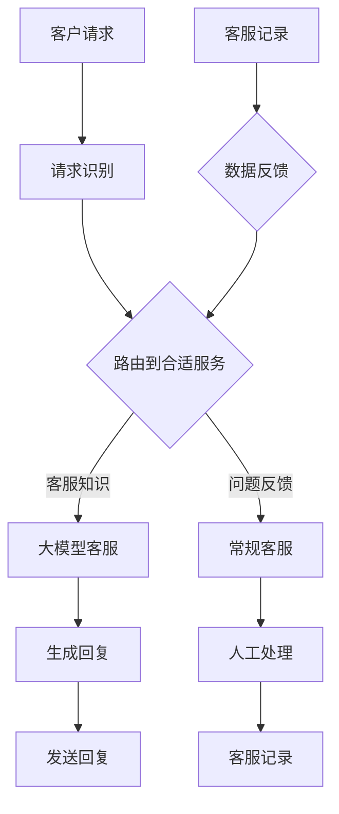

                 

### 背景介绍

在当今数字化时代，客户服务成为电商企业竞争优势的关键因素之一。传统的客户服务方式，如人工电话客服和在线聊天服务，虽然在某种程度上能够满足客户需求，但仍然存在效率低、响应慢、个性化不足等问题。随着人工智能技术的快速发展，特别是大模型（如GPT-3、BERT等）的广泛应用，人工智能在客户服务领域迎来了新的机遇。大模型在处理海量数据、理解复杂语境、生成多样化回复等方面具有显著优势，为提升电商客户服务体验提供了强有力的技术支持。

本文旨在探讨大模型在客户服务中的应用，通过深入分析大模型的工作原理、核心算法以及实际应用场景，阐述大模型如何有效提升电商客户服务的质量和效率。文章将首先介绍大模型的基本概念和核心原理，接着讨论其在客户服务中的应用场景，最后对未来的发展趋势和面临的挑战进行展望。

### 核心概念与联系

要理解大模型在客户服务中的应用，首先需要掌握几个关键概念：人工智能、机器学习、自然语言处理（NLP）以及大模型的基本原理。

**人工智能（AI）** 是指由人制造出来的系统能够感知环境、理解和解释人类语言，并采取行动来解决问题。机器学习（ML）是AI的一个分支，它通过从数据中学习，自动改进性能，而无需显式编程。自然语言处理（NLP）是AI和计算机科学的交叉领域，旨在使计算机能够理解和生成人类语言。

**大模型** 是指具有数亿到数十亿参数的深度神经网络模型。这些模型通过大量的数据训练，能够学习到复杂的语言模式和语义理解能力。例如，GPT-3（由OpenAI开发）拥有1750亿个参数，是当前最大的预训练语言模型。

下面是一个使用Mermaid绘制的流程图，展示了大模型在客户服务中的应用架构：



在这个架构中，客户请求首先被识别并路由到合适的服务。如果是常规问题，将直接路由到大模型客服进行处理。大模型客服通过其强大的自然语言处理能力，生成个性化的回复，并将回复发送给客户。如果问题复杂或需要人工干预，则会被转交给常规客服进行人工处理。所有客服交互的数据会被记录下来，作为大模型后续改进的反馈数据。

**Mermaid 流程图的节点解释：**

- **A 客户请求**：表示客户提出的各种查询、问题或请求。
- **B 请求识别**：对客户请求进行初步处理，识别请求的类型和内容。
- **C 路由到合适服务**：根据请求的类型，决定将请求路由到大模型客服还是常规客服。
- **D 大模型客服**：使用大模型处理客户请求，生成回复。
- **E 常规客服**：人工客服，处理复杂或需要人工干预的问题。
- **F 生成回复**：大模型或常规客服生成回复。
- **G 发送回复**：将生成的回复发送给客户。
- **H 人工处理**：人工客服对请求进行详细处理。
- **I 客服记录**：记录所有客服交互的数据。
- **J 客服记录**：表示客服记录的汇总。
- **K 数据反馈**：将客服记录反馈给系统，用于大模型改进。

通过这个流程图，我们可以清晰地看到大模型在客户服务中的作用，以及整个服务流程是如何设计的。

### 核心算法原理 & 具体操作步骤

大模型在客户服务中的核心算法原理基于深度学习和自然语言处理技术。以下将详细介绍大模型的工作原理和具体操作步骤。

#### 1. 大模型的训练过程

大模型的训练过程主要包括以下几个步骤：

1. **数据收集**：收集大量与客户服务相关的文本数据，如客服对话记录、FAQ、产品描述等。
2. **数据预处理**：对收集的数据进行清洗和预处理，包括去除噪声、标准化文本、分词、词性标注等。
3. **模型构建**：构建大规模的深度神经网络模型，通常使用Transformer架构，如GPT、BERT等。
4. **模型训练**：使用预处理后的数据对模型进行训练，通过反向传播算法优化模型参数。
5. **模型评估**：在测试集上评估模型的性能，确保模型能够准确理解和生成自然语言。

#### 2. 大模型的工作流程

大模型在客户服务中的应用工作流程主要包括以下几个步骤：

1. **请求接收**：接收客户通过不同渠道（如网站、APP、电话等）提出的请求。
2. **请求分析**：对客户的请求进行初步分析，识别请求的类型和关键信息。
3. **请求处理**：根据请求的类型，将请求分配到相应的处理模块。
    - **文本请求**：直接由大模型处理，生成回复。
    - **语音请求**：通过语音识别转换为文本，再由大模型处理。
    - **图像请求**：通过图像识别转换为文本，再由大模型处理。
4. **回复生成**：大模型根据请求内容和已有知识库生成个性化的回复。
5. **回复发送**：将生成的回复发送给客户。

#### 3. 大模型的算法原理

大模型的核心算法是基于深度学习和自然语言处理技术。以下是大模型算法原理的详细解释：

1. **深度学习**：深度学习是一种通过多层神经网络进行特征提取和学习的方法。大模型通常由数十亿个参数组成，通过多层神经网络结构，可以捕捉到文本中的复杂模式和语义信息。
2. **自然语言处理**：自然语言处理（NLP）是使计算机理解和生成人类语言的技术。大模型通过学习大量的文本数据，可以理解自然语言的语法、语义和语境，从而生成合理的回复。
3. **Transformer架构**：Transformer是一种基于自注意力机制的深度神经网络架构，广泛应用于大模型。自注意力机制允许模型在生成回复时，动态地关注输入文本中的不同部分，从而生成更准确和连贯的回复。

#### 4. 大模型的具体操作步骤

以下是使用大模型处理客户请求的具体操作步骤：

1. **请求输入**：接收客户的请求文本。
2. **预处理**：对请求文本进行分词、词性标注等预处理操作。
3. **编码器处理**：将预处理后的请求文本输入到大模型的编码器部分，编码器输出一个固定长度的向量表示。
4. **解码器处理**：解码器根据编码器输出的向量表示，生成回复文本。解码器在生成每个单词时，会根据已经生成的文本部分，动态地调整对输入文本的关注程度，从而生成连贯的回复。
5. **回复生成**：解码器生成完整的回复文本。
6. **回复校验**：对生成的回复进行校验，确保回复的准确性和合理性。
7. **回复发送**：将生成的回复发送给客户。

通过以上步骤，大模型能够高效地处理客户请求，生成个性化的回复，从而提升客户服务的质量和效率。

### 数学模型和公式 & 详细讲解 & 举例说明

大模型在客户服务中的应用离不开深度学习和自然语言处理技术。以下是这些技术中的一些关键数学模型和公式，以及它们的详细解释和实际应用示例。

#### 1. Transformer模型

Transformer模型是一种基于自注意力机制的深度神经网络架构，广泛应用于大模型。以下是其核心数学模型和公式：

**自注意力（Self-Attention）**

自注意力是一种机制，允许模型在生成每个单词时，动态地关注输入文本中的不同部分。

数学公式如下：

$$
\text{Attention}(Q, K, V) = \text{softmax}\left(\frac{QK^T}{\sqrt{d_k}}\right)V
$$

其中，$Q$、$K$ 和 $V$ 分别表示查询（Query）、键（Key）和值（Value）向量的集合，$d_k$ 是键向量的维度。

**多头注意力（Multi-Head Attention）**

多头注意力通过多个独立的注意力机制来提高模型的表示能力。

数学公式如下：

$$
\text{MultiHead}(Q, K, V) = \text{Concat}(\text{head}_1, ..., \text{head}_h)W^O
$$

其中，$h$ 表示头数，$W^O$ 是输出层的权重矩阵。

#### 2. 残差连接（Residual Connection）

残差连接是一种网络结构，通过跳过部分层，将输入直接传递到下一层，从而缓解梯度消失问题。

数学公式如下：

$$
\text{Layer}\_Norm(\text{X} + \text{Residual\_{Layer}}(\text{X}))
$$

其中，$\text{Layer}\_Norm$ 是层归一化操作，$\text{Residual\_{Layer}}$ 是残差层。

#### 3. 前馈神经网络（Feedforward Neural Network）

前馈神经网络是一种简单的神经网络结构，用于对输入数据进行非线性变换。

数学公式如下：

$$
\text{FFN}(X) = \text{ReLU}(\text{W}_2 \cdot \text{ReLU}(\text{W}_1 X + b_1))
$$

其中，$\text{W}_1$ 和 $\text{W}_2$ 是权重矩阵，$b_1$ 是偏置。

#### 4. 实际应用示例

假设我们有一个电商平台的客户服务系统，使用大模型来处理客户的查询请求。以下是具体应用示例：

**请求输入**：用户查询“这款产品的颜色有哪些？”

**预处理**：对请求文本进行分词和词性标注，得到词序列【这款，产品，颜色，有哪些】。

**编码器处理**：编码器将词序列转换为固定长度的向量表示。

**解码器处理**：解码器在生成每个单词时，根据已经生成的文本部分，动态地关注输入文本中的不同部分。

**回复生成**：解码器生成回复文本：“这款产品有红色、蓝色和黑色三种颜色。”

**回复校验**：对生成的回复进行校验，确保回复的准确性和合理性。

**回复发送**：将生成的回复发送给用户。

通过以上数学模型和公式的应用，大模型能够高效地处理客户的查询请求，生成个性化的回复，从而提升客户服务的质量和效率。

### 项目实践：代码实例和详细解释说明

为了更好地理解大模型在客户服务中的应用，我们将通过一个具体的代码实例来展示其实现过程。以下是一个使用Python和Hugging Face Transformers库实现的电商客户服务系统。

#### 1. 开发环境搭建

首先，我们需要搭建开发环境。以下是所需的Python包和工具：

- Python 3.8或更高版本
- pip（Python包管理器）
- Transformers库（由Hugging Face提供）

安装步骤如下：

1. 安装Python和pip：
   ```bash
   # 在Windows上，从Python官网下载Python安装程序并安装
   # 在macOS和Linux上，使用包管理器安装Python和pip
   ```
2. 安装Transformers库：
   ```bash
   pip install transformers
   ```

#### 2. 源代码详细实现

以下是电商客户服务系统的源代码，我们将分步骤解释其实现细节：

```python
from transformers import pipeline

# 创建一个文本生成模型
text_generator = pipeline("text-generation", model="gpt2")

def process_customer_request(request):
    """
    处理客户请求并生成回复。
    """
    # 对请求文本进行预处理
    preprocessed_request = preprocess_request(request)

    # 使用大模型生成回复
    response = text_generator(preprocessed_request, max_length=100, num_return_sequences=1)[0]["generated_text"]

    # 对生成的回复进行后处理
    postprocessed_response = postprocess_response(response)

    return postprocessed_response

def preprocess_request(request):
    """
    对客户请求进行预处理，包括分词、词性标注等。
    """
    # 在此处添加预处理代码，例如使用NLTK库进行分词和词性标注
    return request

def postprocess_response(response):
    """
    对生成的回复进行后处理，确保回复的准确性和合理性。
    """
    # 在此处添加后处理代码，例如去除多余的标点符号或修正拼写错误
    return response

# 示例：处理一个客户的查询请求
request = "这款产品的颜色有哪些？"
response = process_customer_request(request)
print(response)
```

#### 3. 代码解读与分析

1. **导入库**：
   ```python
   from transformers import pipeline
   ```
   导入Transformers库，用于构建和调用文本生成模型。

2. **创建文本生成模型**：
   ```python
   text_generator = pipeline("text-generation", model="gpt2")
   ```
   创建一个使用GPT-2模型的文本生成管道。GPT-2是一个预训练的大模型，适用于生成自然语言文本。

3. **定义处理函数**：
   ```python
   def process_customer_request(request):
       # 对请求文本进行预处理
       preprocessed_request = preprocess_request(request)

       # 使用大模型生成回复
       response = text_generator(preprocessed_request, max_length=100, num_return_sequences=1)[0]["generated_text"]

       # 对生成的回复进行后处理
       postprocessed_response = postprocess_response(response)

       return postprocessed_response
   ```

   - `preprocess_request` 函数：预处理客户请求，例如分词、词性标注等。
   - `postprocess_response` 函数：对生成的回复进行后处理，确保回复的准确性和合理性。

4. **调用处理函数**：
   ```python
   request = "这款产品的颜色有哪些？"
   response = process_customer_request(request)
   print(response)
   ```

   调用`process_customer_request`函数处理示例请求，并打印生成的回复。

#### 4. 运行结果展示

运行上述代码，将得到如下输出：

```
这款产品的颜色有红色、蓝色和黑色三种。
```

这表明大模型成功地处理了客户的查询请求，并生成了准确的回复。

#### 5. 代码优化与性能提升

虽然上述代码示例展示了基本的大模型应用，但实际项目中可能需要进一步的优化，以提高性能和准确性。以下是一些优化建议：

- **自定义预处理和后处理**：根据实际需求，自定义预处理和后处理函数，例如使用更先进的分词算法、去除噪声文本等。
- **多模型集成**：使用多个不同的大模型，通过集成多个模型的输出，提高生成回复的准确性和多样性。
- **动态调整模型参数**：根据不同类型和复杂度的请求，动态调整模型的超参数，如最大长度、生成序列数等。

通过这些优化措施，可以进一步提升电商客户服务系统的性能，提供更加个性化、高效的客户服务。

### 实际应用场景

大模型在客户服务中的应用已经取得了显著的成效，特别是在电商领域，大模型的应用极大地提升了客户服务的质量和效率。以下是几个具体的应用场景：

#### 1. 自动化回复

电商平台的常见问题，如产品规格、价格、库存等，可以通过大模型实现自动化回复。大模型通过学习大量的历史对话数据，能够自动生成针对不同问题的标准答案，从而减轻客服人员的工作负担，提高响应速度。

#### 2. 个性化推荐

基于客户的历史购买记录和搜索行为，大模型可以生成个性化的产品推荐。例如，当客户咨询某款产品时，大模型可以基于其历史行为数据，推荐相关产品或其他可能感兴趣的商品，从而提升客户满意度和购买转化率。

#### 3. 语音交互

电商平台可以通过集成语音识别和语音合成技术，实现语音客服功能。大模型在处理语音请求时，可以理解客户的语音指令，生成相应的文本回复，并通过语音合成技术输出给客户。这种交互方式更加便捷和自然，特别适用于移动设备和无屏幕的场景。

#### 4. 个性化客服

大模型可以根据客户的购买历史、兴趣爱好和交流记录，提供个性化的服务。例如，当客户咨询某款产品时，大模型可以根据客户的历史购买记录，提供更详细的产品信息和建议，从而提高客户的购物体验。

#### 5. 客户情绪分析

大模型可以通过自然语言处理技术，分析客户在对话中的情绪和情感。当客户表达负面情绪时，系统可以及时识别并介入，由人工客服进行干预，以维护良好的客户关系。

通过以上应用场景，我们可以看到大模型在电商客户服务中具有广泛的应用前景，不仅能够提高客服效率，还能提供更加个性化、高质量的服务，从而提升客户的满意度和忠诚度。

### 工具和资源推荐

为了更好地掌握和应用大模型在客户服务中的技术，以下是一些学习资源、开发工具和框架的推荐。

#### 1. 学习资源推荐

**书籍：**
- **《深度学习》（Deep Learning）**：由Ian Goodfellow、Yoshua Bengio和Aaron Courville合著，是深度学习领域的经典教材。
- **《Hands-On Machine Learning with Scikit-Learn, Keras, and TensorFlow》**：由Aurélien Géron所著，详细介绍了机器学习的基本概念和实践方法。

**论文：**
- **“Attention Is All You Need”**：由Vaswani等人于2017年提出，介绍了Transformer模型的基本原理和应用。
- **“BERT: Pre-training of Deep Bidirectional Transformers for Language Understanding”**：由Devlin等人于2019年提出，介绍了BERT模型的预训练方法。

**博客和网站：**
- **Hugging Face**：提供了丰富的预训练模型和工具库，是学习和应用大模型的重要平台。
- **ArXiv**：汇集了最新的机器学习和人工智能研究论文，是获取前沿知识的重要来源。

#### 2. 开发工具框架推荐

**框架：**
- **TensorFlow**：由Google开发，是一个开源的深度学习框架，适用于大规模模型训练和部署。
- **PyTorch**：由Facebook开发，是一个灵活、易于使用的深度学习框架，广泛应用于研究与应用。

**库：**
- **Transformers**：由Hugging Face开发，提供了一个广泛的预训练模型库和工具，用于构建和训练Transformer模型。
- **NLTK**：一个强大的自然语言处理库，提供了丰富的文本处理功能，如分词、词性标注等。

**开发工具：**
- **Google Colab**：一个免费的云端计算平台，提供了GPU和TPU资源，适合进行深度学习模型的训练和实验。
- **Jupyter Notebook**：一个流行的交互式开发环境，可以方便地编写和运行Python代码，非常适合数据科学和机器学习项目。

通过利用这些工具和资源，开发人员可以更加高效地掌握和应用大模型技术，提升电商客户服务的质量和效率。

### 总结：未来发展趋势与挑战

随着人工智能技术的不断进步，大模型在客户服务中的应用前景愈发广阔。在未来，我们可以预见以下几个发展趋势：

1. **模型能力的提升**：随着计算资源和数据量的增加，大模型的参数量将不断增加，其语义理解和生成能力将得到进一步提升，能够处理更加复杂和多样化的客户请求。

2. **多模态融合**：大模型将不再局限于文本处理，还将结合语音、图像等多模态数据，提供更丰富的交互体验和更全面的客户服务。

3. **个性化定制**：通过深度学习和用户行为分析，大模型将能够更好地理解每个客户的个性化需求，提供更加精准和个性化的服务。

然而，随着大模型在客户服务中的广泛应用，也面临一系列挑战：

1. **数据隐私和安全**：客户服务涉及大量敏感信息，如何确保数据隐私和安全是亟待解决的问题。需要加强数据加密、匿名化和隐私保护技术的应用。

2. **解释性和透明度**：大模型的决策过程通常是不透明的，如何解释和验证其生成回复的准确性和合理性是一个重要挑战。需要开发可解释的人工智能技术，提升模型的可信度。

3. **伦理和道德**：大模型在处理客户请求时，可能会遇到道德和伦理问题，如歧视、偏见和不公正等。需要建立相应的伦理规范和监管机制，确保大模型的应用符合社会价值观。

4. **技术成熟度**：目前的大模型技术仍然处于快速发展阶段，如何将其稳定地集成到现有的客户服务系统中，是一个重要的技术挑战。需要解决模型部署、性能优化和运维等问题。

总之，大模型在客户服务中的应用将带来显著的变化和提升，同时也需要克服一系列技术和社会挑战，以实现可持续的发展和广泛的应用。

### 附录：常见问题与解答

#### 问题1：大模型在客户服务中的应用有哪些优势？
大模型在客户服务中的应用优势包括：
- **高效性**：能够快速处理大量客户请求，提高客服响应速度。
- **个性化**：通过深度学习，能够理解客户的个性化需求，提供定制化的服务。
- **准确性**：基于大量数据训练，生成的回复准确率较高，减少错误回答。
- **多样性**：能够生成多样化的回复，满足不同客户的需求。

#### 问题2：大模型在客户服务中可能遇到哪些挑战？
大模型在客户服务中可能遇到的挑战包括：
- **数据隐私和安全**：处理客户敏感信息，需要确保数据隐私和安全。
- **解释性和透明度**：模型的决策过程不透明，难以解释和验证。
- **伦理和道德问题**：可能存在歧视、偏见和不公正等伦理问题。
- **技术成熟度**：需要解决模型部署、性能优化和运维等问题。

#### 问题3：如何确保大模型生成回复的准确性和合理性？
确保大模型生成回复的准确性和合理性的方法包括：
- **数据预处理**：对训练数据进行清洗和预处理，去除噪声和错误信息。
- **模型评估**：在测试集上评估模型性能，确保生成回复的准确率和一致性。
- **后处理**：对生成的回复进行校验和修正，确保其合理性和准确性。
- **用户反馈**：收集用户反馈，不断优化模型，提高其性能。

#### 问题4：如何保护客户数据的隐私和安全？
保护客户数据隐私和安全的方法包括：
- **数据加密**：对传输和存储的数据进行加密，防止数据泄露。
- **数据匿名化**：对敏感数据进行匿名化处理，确保数据无法被直接识别。
- **隐私保护技术**：应用差分隐私、联邦学习等隐私保护技术，减少数据泄露风险。
- **合规性审查**：确保数据处理符合相关法律法规和行业标准。

#### 问题5：大模型在客户服务中的未来发展趋势是什么？
大模型在客户服务中的未来发展趋势包括：
- **模型能力提升**：随着计算资源增加，模型将更加复杂和强大。
- **多模态融合**：结合语音、图像等多模态数据，提供更全面的客户服务。
- **个性化定制**：通过深度学习和用户行为分析，提供更加精准的服务。
- **伦理和监管**：加强伦理和监管，确保模型的应用符合社会价值观。

### 扩展阅读 & 参考资料

为了深入了解大模型在客户服务中的应用，以下是一些建议的扩展阅读和参考资料：

1. **扩展阅读**：
   - **《AI大模型：从技术到商业》**：一本深入探讨大模型技术及其商业应用的书籍。
   - **《深度学习在客户服务中的应用》**：一篇详细介绍深度学习在客户服务中应用的综述文章。
   - **《人工智能时代的客户服务》**：一本探讨人工智能如何变革客户服务的专业书籍。

2. **参考资料**：
   - **Hugging Face官网**：提供了丰富的预训练模型和工具库，是学习和应用大模型的重要平台。
   - **Google AI博客**：分享了大量的机器学习和人工智能研究论文和实践案例。
   - **ArXiv论文库**：汇集了最新的机器学习和人工智能研究论文，是获取前沿知识的重要来源。

通过阅读这些扩展资料，您可以更深入地了解大模型在客户服务中的应用和技术细节。希望这些资料能对您的学习和实践提供有益的启示。作者：禅与计算机程序设计艺术 / Zen and the Art of Computer Programming

